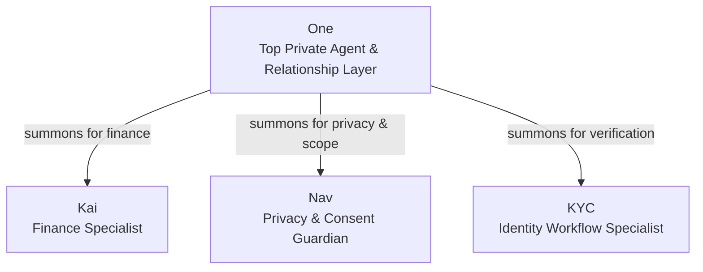
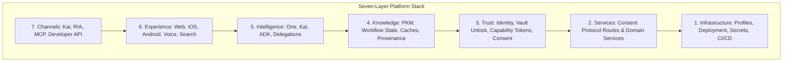

<h1 align="center">Hussh Research</h1>

<p align="center">
  <strong>The Private Agent Platform</strong><br/>
  <em>Consent-first private agents & scoped information infrastructure.</em><br/>
  <em>Your information. Your vault. Your private agents.</em>
</p>

<p align="center">
  
  
  
  
  <br/>
  
  
  
  <a href="https://discord.gg/fd38enfsH5"></a>
</p>

---

## 30-Second Overview

**Hussh** is a consent-first platform for **private agents**. Core thesis: *"An agent should work for the person whose life it touches."*

Hussh enables individuals to own their private information through client-side encryption (BYOK), explicit capability tokens (PCHP), and zero-knowledge memory storage.

The monorepo structure is modular and contributor-friendly:

- [hushh-webapp/](hushh-webapp/): Next.js 16 + React + Capacitor experience client (Web, iOS, Android)
- [consent-protocol/](consent-protocol/): FastAPI backend, consent protocol, Personal Knowledge Model (PKM), ADK agents, and MCP surfaces
- [docs/](docs/): Architecture, guides, operations, vision, and roadmap references

---

## Meet the Private Agent Ecosystem



- **One (The Private Agent)**: The primary relationship layer. Holds your preferences, context, decisions, and trusted connections. Operates in four core motions: *Listens*, *Remembers*, *Decides*, and *Acts*.
- **Kai (Finance Specialist)**: Summoned by One for market intelligence, portfolio analytics, investment research, and receipts-backed execution.
- **Nav (Privacy Guardian)**: Summoned by One for scope review, vault management, deletion, and consent transparency.
- **KYC (Identity Specialist)**: Handles requirement collection and approval-gated document verification.

---

## Core Guarantees & Security Invariants

1. 🔐 **Client-Side Cryptography (BYOK):** Vault keys are derived and unlocked on-device. The backend stores ciphertext and metadata, never plaintext user context.
2. 📜 **Consent-First & Scoped Access (PCHP):** Signed-in is not consent. Every operation requires a valid, scoped, and revocable capability token (`VAULT_OWNER` / PCHP).
3. 👁️ **Zero-Knowledge Memory:** The backend holds zero unencrypted personal information or memory cards.
4. 📱 **Tri-Flow Parity:** Unified contract alignment across Web, iOS, and Android.

---

## Visual Map



---

## Quick Start

### 1. Clone & Bootstrap
```bash
git clone https://github.com/hushh-labs/hushh-research.git
cd hushh-research
./bin/hushh bootstrap
```

### 2. Start Local Servers
Run three separate integrated terminals for full telemetry and hot-reloading:

```bash
# Terminal 1: Cloud SQL Proxy
./bin/hushh proxy --mode local

# Terminal 2: FastAPI Backend
./bin/hushh backend --mode local --reload

# Terminal 3: Next.js Frontend
./bin/hushh web --mode local
```

*Note: `./bin/hushh web` defaults to local. Use `./bin/hushh web --mode uat` for the hosted UAT backend shortcut.*

---

## Choose Your Contributor Lane

- **App Contributor:** `./bin/hushh bootstrap` then `./bin/hushh web`
- **Backend / Protocol Contributor:** `./bin/hushh bootstrap` then `./bin/hushh terminal backend --mode local --reload`
- **Standalone `consent-protocol` Subtree:** See [consent-protocol/README.md](consent-protocol/README.md)
- **Operator / Maintainer:** See [docs/reference/operations/README.md](docs/reference/operations/README.md)

---

## Canonical Contributor Commands

All repository operations flow through the canonical `./bin/hushh` CLI:

```bash
./bin/hushh bootstrap
./bin/hushh doctor --mode local
./bin/hushh codex onboard
./bin/hushh codex ci-status --watch
./bin/hushh codex route-task repo-orientation
./bin/hushh web
./bin/hushh native ios --mode uat
./bin/hushh native android --mode uat
```

---

## Platform Roadmap & Evolution

```mermaid
timeline
  title Hussh Platform Evolution
  section Phase 1: Trust Core
    Client-side Vault (BYOK) : PCHP Capability Tokens : Zero-Knowledge Backend
    FastAPI & Python 3.13 : Google ADK & A2A : MCP Developer Surface
  section Phase 2: Private Agents
    One Voice Conversational Surface : Kai Financial Intelligence : One Location & Wallet Pass
    Consent Center & Granular Scopes : RIA & Investor Workflows
  section Phase 3: Enterprise Relays
    MuleSoft Omni Gateway & Salesforce : DocuSign & Agreement Execution : PKM Slice Marketplace
  section Phase 4: On-Device & Hardware
    BYOA & Local MLX Inference : One Mac Desktop App : Ambient Wearable Contracts (Meta Glasses)
```

### 🟢 Phase 1: Trust Infrastructure & Protocol (Shipped / Current)
- **Vault Encryption & BYOK:** On-device key derivation (PBKDF2 / WebAuthn PRF). Ciphertext-only storage.
- **Capability Tokens (PCHP):** `VAULT_OWNER` & PCHP scoped consent handshake for agents and APIs.
- **Protocol Foundation:** FastAPI + Python 3.13 backend, Google ADK runtime, A2A delegation, and MCP developer surface.

### 🟢 Phase 2: Private Agents & Specialist Roster (Shipped / Active)
- **One Voice:** Direct conversational voice surface for private actions and intent execution.
- **Kai Financial Specialist:** Real-time market intelligence, portfolio analytics, and receipts-backed decisions.
- **One Location & Wallet:** Consented location sharing and Apple Wallet Pass integration.
- **Consent Center:** Granular scope management, revocation worker, and audit provenance.

### 🟡 Phase 3: Enterprise & Partner Relays (Active Rollout)
- **MuleSoft & Salesforce Secure Relay:** Partner-authorized secure relay for enterprise CRM workflows.
- **DocuSign & Agreement Workflows:** Vendor-neutral agreement execution under Nav and One.
- **PKM Slice Marketplace:** User-priced, consent-backed information slice subscriptions.

### 🔵 Phase 4: On-Device Compute & Hardware Horizons (Future / R&D)
- **BYOA & Local Inference:** MLX / on-device execution for zero-network privacy.
- **One Mac Native App:** macOS desktop connector and local knowledge base.
- **Ambient Intelligence & Wearables:** Ambient wearable agent contracts (Meta Glasses, App Intents).

---

## Workspace Directory Map

- [hushh-webapp/](hushh-webapp/): Next.js 16 + React + Capacitor experience client
- [consent-protocol/](consent-protocol/): FastAPI backend, consent protocol, PKM, ADK agents, and MCP surfaces
- [contracts/](contracts/): Generated schemas, action gateways, and cross-surface contracts
- [docs/](docs/): Canonical architecture, guides, vision, and operational references
- [.codex/](.codex/): Reusable skill fleet, workflows, and governance agents

---

## Documentation Index

- [Getting Started Guide](docs/guides/getting-started.md)
- [Environment Model](docs/guides/environment-model.md)
- [Project Context Map](docs/project_context_map.md)
- [Architecture Reference](docs/reference/architecture/architecture.md)
- [Brand & Compatibility Contract](docs/reference/operations/brand-and-compatibility-contract.md)
- [Founder Language Matrix](docs/reference/architecture/founder-language-matrix.md)
- [Vision & Thesis](docs/vision/README.md)
- [Future Roadmap Home](docs/future/README.md)
- [CLI Reference](docs/reference/operations/cli.md)
- [Contributing Guide](contributing.md)

---

## Community & Contributing

We welcome community contributions! Please ensure:

- **License:** Apache-2.0 for first-party code.
- **Commit Signoff:** All commits must include DCO signoff (`git commit -s`).
- **Code of Conduct:** Read our [Code of Conduct](code_of_conduct.md).
- **Discord:** Join the conversation on [Discord](https://discord.gg/fd38enfsH5).

---

<p align="center">
  <em>Hussh exists to make consented, scoped, zero-knowledge AI straightforward to build and reason about.</em>
</p>
