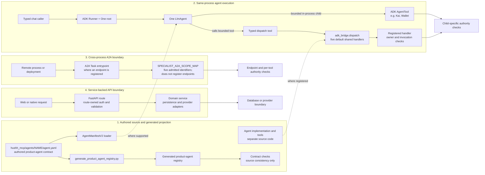

# Agent Development

> The community contribution bible. Everything you need to build, test, and ship a new Hussh agent or operon.

The executable lifecycle route is `./bin/hushh codex route-task product-agent-development`.
Runtime product agents live under `consent-protocol/hushh_mcp/agents`; repo-scoped
engineering evidence agents are authored under root `agents/`; host mirrors are
generated. They
are separate namespaces.

`agent.yaml` is the only authored product-agent source. The strict
`AgentManifestV2` loader rejects unknown fields, and
`consent-protocol/scripts/generate_product_agent_registry.py` produces
`contracts/agents/product-agent-registry.v2.json`. Do not add a parallel Python
manifest, repeated prompt, delegate enum, agent card, or hand-maintained registry.

Every product-agent change must declare runtime mode, invocation/data/action
authority, typed contracts and failure states, side effects and confirmation,
PKM behavior, surface applicability, privacy allowlist, telemetry namespace,
evaluation threshold, performance budget, kill switch, rollout, and rollback.
Invocation authority never implies private-data access or mutation authority.


## One authored fleet, explicit runtime dependencies

Keep each specialist's existing task and result contract. Register an optional
`service_handler` through `adk_bridge.dispatch.register_specialist` when the
same handler needs replaceable dependencies. Without a bound runtime, dispatch
continues through the existing shared handler.

Authenticated ingress may bind `SpecialistRuntime` for one invocation. Dispatch
checks owner identity and active invocation authority before obtaining services,
checks access before and after execution, and restores the previous context on
exit. Missing runtime services fail closed. Information and Location chat
services accept explicit `service_ports` and `scope_tokens`; bind these from
verified ingress, never model arguments. Tool-specific consent remains required.
In this shared-runtime branch, omitted individual ports retain shared defaults;
these hooks alone do not establish private isolation. No ingress binding is added
by the generic dependency seam.

The default shared-runtime `adk_bridge.dispatch` registry registers
`agent_documents`, `agent_location`, `agent_email`, `agent_nav`, and
`agent_personal_information`. An owner-bound pod may register Connections and
Connected Systems for its own turn; those are not ambient shared-runtime
handlers. This registry is separate from `SPECIALIST_A2A_SCOPE_MAP`,
which validates five external A2A identifiers: One, Kai, Nav, KYC, and Personal
Information. A scope-map entry does not register an in-process handler, and a
local dispatch registration does not create an A2A endpoint. Nav
uses a manifest-owned Consent AgentTool child with scoped read tools. A selected
Connections turn additionally requires exact manifest invocation capabilities,
trusted task/owner bindings, and a database-confirmed owner token before and
throughout its read/proposal tools. Connection proposals return to One with exact
record IDs for the existing generated action/confirmation path; the legacy
selection executor is not exposed by the child. Live migration acceptance remains
open in the migration baseline report. Shared specialist
turn execution lives in `hushh_mcp/hushh_adk/turn.py`; event deadlines and
cancellation live in `hushh_mcp/hushh_adk/events.py`. Each turn receives fresh
in-memory session state and explicit HushhContext authority. No whole-turn retry
replays completed tool effects.
Dependency hooks do not register additional agents, grant information access,
or establish deployment readiness. Preserve shared defaults when transferring
portable changes from a private deployment branch; keep deployment adapters and
pod admission policy with their owning topology.

## Architecture Review Questions

### One Chat connector execution boundary

The existing external connector registry is a catalog of configurations, not a
permission grant or proof that a tool is callable. One has two execution paths:

- A remote, owner-registered HTTPS MCP server is discovered through the
  owner-bound `RegisteredMcpToolset`. The ADK toolset validates schemas,
  connection revision, credentials and exact-call review. Adding a compatible
  custom server does not require a provider-specific Python tool dispatcher.
- Google Drive, Gmail and Calendar can use their existing OAuth-backed API
  services. Their typed Chat reads and reviewed actions retain those services'
  scope and confirmation checks. An OAuth API capability is not a Google-hosted
  MCP call, even if its connector appears beside MCP servers in Settings.

Google-hosted Workspace MCP endpoints require Developer Preview admission.
Do not present a configured endpoint or an OAuth grant as evidence of that
admission. Connection, callable read capability, consent to share, and action
approval are separate states. One chooses a sequence from its admitted tools;
connector output cannot authorize another action or a Memory write. Selected
Drive files do not imply account-wide Drive search. Gmail sending remains the
existing editable draft and explicit reviewed-send workflow, not an automatic
consequence of a read grant. Client-facing Chat and Settings describe provider
capabilities and connection state, not their underlying transport.

The Founder Wiki at `https://mcp.hushh.ai/mcp` is a custom-connector contract
example: its HTTPS endpoint and owner-supplied authorization fit the generic
vault connector path without a Wiki-specific dispatcher. The coding agent's
Wiki credential is not available to app owners. A live Chat read requires the
owner to connect it in-app and approve the exact call; synthetic contract
tests prove compatibility only, not live authorization.

Apply these questions to each orchestration change at the pinned ADK revision:

1. **One decision owner:** Does One remain the only top-level semantic router?
   Use an in-process `AgentTool` for a bounded local child and A2A only for a
   process or deployment boundary. Neither an MCP tool nor a new API route
   should become a second specialist router.
2. **Three separate authorities:** Which verified principal may invoke the
   specialist, which exact information may it read, and which action may it
   propose or execute? Revalidate owner and scope at ingress and at protected
   tool calls; model instructions and agent-card metadata grant neither.
3. **State ownership:** Is every turn's ADK state owner-scoped? Specialist turns
   use fresh in-memory sessions; shared Agent Chat persists encrypted sessions
   with per-snapshot revision checks. Keep credentials out of model-visible
   session state and events. A private pod's owner-isolated recovery is a
   separate topology, not a reason to add ambient shared-runtime memory.
4. **Effects and failure:** Are writes idempotent or explicitly confirmed? Do
   model-call budgets, first/idle/total deadlines and cancellation preserve
   completed tool receipts without replaying effects? A failed turn is not
   permission to repeat the whole invocation.
5. **Promotion evidence:** Does the manifest declare each surface, evaluation,
   telemetry, kill switch and rollback? A generated registry and green unit
   tests prove source consistency, not a deployed A2A Task lifecycle or live
   owner-consent acceptance.

These decisions follow Google's [ADK safety guidance](https://adk.dev/safety/),
[credential and session-state guidance](https://adk.dev/tools-custom/authentication/),
and [A2A integration guidance](https://adk.dev/a2a/). The checked-in code and
pin-specific tests decide what this repository actually supports.

## Visual Context

Canonical visual owner: [consent-protocol](../README.md). Use that map for the top-down system view; this page is the narrower detail beneath it.

Founder-language mapping:

- `TrustLink / A2A delegation` means delegated authority must inherit the same consent boundary this doc enforces
- `Capability Tokens` remain explicit here because agent entry points, tools, and operons validate concrete token scopes
- `Separation of Duties` is implemented through the DNA model: agents orchestrate, tools expose callable surfaces, operons hold business logic, and services touch persistence

## Visual Map

A contributor authors manifests and implementation code. The map below shows
separate execution lanes; it is not one pipeline used by every agent. A generated
registry proves manifest consistency, while each runtime boundary owns its own
invocation and information checks.



---

## The DNA Model

Hussh agents are built from four composable layers. Each layer has a single responsibility and strict dependency rules.

```
┌─────────────────────────────────────────────────────┐
│ AGENT                                                │
│ Orchestrates tools, owns a manifest, enforces        │
│ entry authority belongs to the runtime boundary       │
├─────────────────────────────────────────────────────┤
│ TOOLS                                                │
│ LLM-callable functions decorated with @hushh_tool    │
│ Consent re-validated per invocation                  │
├─────────────────────────────────────────────────────┤
│ OPERONS                                              │
│ Business logic functions. PURE (math, no side        │
│ effects) or IMPURE (network/LLM, but stateless)     │
│ Never import services directly                       │
├─────────────────────────────────────────────────────┤
│ SERVICES                                             │
│ The only layer that touches the database             │
│ (PersonalKnowledgeModelService, ConsentDBService, etc.)          │
└─────────────────────────────────────────────────────┘
```

### Dependency Rules

The table is the intended placement rule. It is not yet an enforcement claim:
retained Nav, Location, and Personal Information tools still import service
classes directly. New specialist work should receive replaceable service ports
from verified ingress; existing imports need bounded migrations with behavior
parity before this rule can be enforced repo-wide. Persistence remains owned by
services throughout that migration.

| Layer    | Can Import       | Cannot Import    |
| -------- | ---------------- | ---------------- |
| Agent    | Tools, ADK core  | Services, DB     |
| Tool     | Operons          | Services, DB     |
| Operon   | Other operons    | Services, DB     |
| Service  | DatabaseClient   | Agents, Tools    |

**Exception**: Impure operons (fetchers, LLM, storage) may use consent validation and external APIs, but never import service classes directly.

### Import-Safe Package Rule

Operon package entrypoints must stay lightweight. Importing a pure gene must
not initialize model clients, provider SDKs, storage, environment loaders, or
mutable runtime state. Preserve convenient package-level exports through lazy
resolution or similarly explicit compatibility facades, and prove the boundary
with a fresh-process import test.

---

## Consent Checks by Runtime Boundary

There is no single consent stack used by every route. Apply the owning runtime
contract and re-check authority at each protected tool or service boundary.

- In-process ADK children use One's current session contract and child-specific tools.
- The process-local dispatch registry separately checks owner and invocation authority.
- External A2A entrypoints validate the mapped scope; that scope admits invocation
  only and does not itself grant information or action authority.
- FastAPI routes and their services enforce their route-specific authentication,
  consent and persistence contracts.

The following HushhAgent and decorator examples apply only to lanes that use those
wrappers; they are not a description of the One ADK AgentTool or A2A paths.

### HushhAgent application entry

`HushhAgent.run_turn()` validates the token against the agent's
`required_scopes` before any tool executes. Call this application entrypoint;
do not override ADK's internal `run()` protocol.

```python
# Application caller; HushhAgent owns validation, context, and Runner setup.
response = await agent.run_turn(
    prompt=prompt,
    user_id=verified_user_id,
    consent_token=verified_consent_token,
)
```

### Decorated tool invocation

Where a handler uses `@hushh_tool`, the decorator re-validates consent with the
tool's specific scope before the function body runs.

```python
# hushh_mcp/hushh_adk/tools.py
@hushh_tool(scope="agent.kai.analyze")
async def perform_fundamental_analysis(ticker: str) -> Dict:
    ctx = HushhContext.current()  # Access injected context
    # ... tool logic (consent already validated by decorator)
```

The decorator:
1. Checks that `HushhContext` exists (security violation if not)
2. Validates token scope matches the tool's required scope
3. Verifies `token.user_id == context.user_id` (anti-spoofing)

### Impure operon checks

Where an impure operon is called through this tool path, it validates consent
inline as its first operation. Pure calculators skip this check; other lanes use
their owning service and invocation contracts.

```python
# hushh_mcp/operons/kai/analysis.py
def analyze_fundamentals(ticker, user_id, sec_filings, consent_token):
    # Consent validation as first line
    valid, reason, _ = validate_token(consent_token, "agent.kai.analyze")
    if not valid:
        raise PermissionError(f"Consent denied: {reason}")
    # ... business logic
```

### HushhContext Propagation

In lanes that bind `HushhContext`, context flows via Python's `contextvars` module.
Other runtime paths pass their typed session and authority explicitly.

```python
# Set by HushhAgent.run_turn():
with HushhContext(user_id="abc", consent_token="HCT:..."):
    # Available everywhere in this execution scope:
    ctx = HushhContext.current()
    ctx.user_id          # "abc"
    ctx.consent_token    # "HCT:..."
    ctx.vault_keys       # {} (optional)
```

---

## The Operon Catalog

### calculators.py -- Pure Math (10 functions)

No consent needed. No side effects. Pure input-to-output.

| Function                           | Description                            |
| ---------------------------------- | -------------------------------------- |
| `calculate_financial_ratios`       | P/E, ROE, debt ratio from SEC filings  |
| `calculate_quant_metrics`          | FCF margin, R&D intensity, cash ratio  |
| `assess_fundamental_health`        | Composite health score (0-100)         |
| `calculate_sentiment_score`        | Weighted news sentiment (-1 to +1)     |
| `extract_catalysts_from_news`      | Extract key catalysts from articles    |
| `calculate_valuation_metrics`      | P/E, P/B, EV/EBITDA from market data  |
| `calculate_annualized_return`      | Annualized return from price series    |
| `calculate_annualized_volatility`  | Annualized vol from price series       |
| `calculate_sharpe_ratio`           | Risk-adjusted return                   |
| `calculate_return_and_risk_metrics`| Combined return, vol, Sharpe, max DD   |

### fetchers.py -- External Data (5 functions, IMPURE)

Each requires consent validation. No DB access.

| Function              | Source                | Description                   |
| --------------------- | --------------------- | ----------------------------- |
| `fetch_sec_filings`   | SEC EDGAR (free)      | 10-K/10-Q financial data      |
| `fetch_market_news`   | Finnhub -> PMP/FMP -> NewsAPI -> Google News RSS | Recent financial news |
| `fetch_market_data`   | Finnhub -> PMP/FMP -> yfinance -> Yahoo quote     | Price, volume, fundamentals |
| `fetch_peer_data`     | Finnhub peers -> Yahoo Finance                          | Peer company comparisons |
| `_fetch_yahoo_quote_fast` | Yahoo v7 API                                       | Fast quote fallback |

### analysis.py -- Analysis Orchestrators (3 public + helpers, IMPURE)

| Function                 | Description                              |
| ------------------------ | ---------------------------------------- |
| `analyze_fundamentals`   | Full fundamental analysis from SEC data  |
| `analyze_sentiment`      | Full sentiment analysis from news        |
| `analyze_valuation`      | Full valuation analysis from market data |

### llm.py -- Gemini Integration (5 functions, IMPURE)

| Function                          | Description                         |
| --------------------------------- | ----------------------------------- |
| `analyze_stock_with_gemini`       | Full stock analysis via Gemini      |
| `analyze_sentiment_with_gemini`   | Sentiment analysis via Gemini       |
| `analyze_valuation_with_gemini`   | Valuation analysis via Gemini       |
| `stream_gemini_response`          | Token-by-token streaming            |
| `analyze_fundamental_streaming`   | Streaming fundamental analysis      |

### storage.py -- Vault Operations (3 functions, IMPURE)

| Function                     | Description                         |
| ---------------------------- | ----------------------------------- |
| `store_decision_card`        | Encrypt and store decision          |
| `retrieve_decision_card`     | Decrypt and retrieve single card    |
| `retrieve_decision_history`  | Decrypt and list all user decisions |

---

## How to Build a New Operon (5 min)

### Step 1: Choose the Right Module

- **Pure math** with no side effects → `calculators.py`
- **External API call** → `fetchers.py`
- **LLM invocation** → `llm.py`
- **New module** for a new domain → create `hushh_mcp/operons/{domain}/{module}.py`

### Step 2: Write the Function

Example: Bollinger Band calculator (pure operon)

```python
# hushh_mcp/operons/kai/calculators.py

def calculate_bollinger_bands(
    prices: List[float],
    window: int = 20,
    num_std: float = 2.0,
) -> Dict[str, List[float]]:
    """
    Calculate Bollinger Bands from a price series.

    Args:
        prices: Historical closing prices (oldest first)
        window: Moving average window (default 20)
        num_std: Standard deviation multiplier (default 2.0)

    Returns:
        Dict with keys: upper, middle, lower (each a list of floats)
    """
    if len(prices) < window:
        return {"upper": [], "middle": [], "lower": []}

    middle = []
    upper = []
    lower = []

    for i in range(window - 1, len(prices)):
        w = prices[i - window + 1 : i + 1]
        avg = sum(w) / window
        std = (sum((x - avg) ** 2 for x in w) / window) ** 0.5
        middle.append(avg)
        upper.append(avg + num_std * std)
        lower.append(avg - num_std * std)

    return {"upper": upper, "middle": middle, "lower": lower}
```

### Step 3: If Impure, Add Consent Validation

```python
def fetch_earnings_calendar(
    ticker: str,
    user_id: UserID,
    consent_token: str,
) -> Dict[str, Any]:
    """Fetch upcoming earnings dates."""
    valid, reason, _ = validate_token(consent_token, "agent.kai.analyze")
    if not valid:
        raise PermissionError(f"Consent denied: {reason}")

    # ... external API call
```

### Step 4: Write a Test

```python
# tests/test_calculators.py
def test_bollinger_bands():
    prices = [float(i) for i in range(1, 31)]
    result = calculate_bollinger_bands(prices, window=10)
    assert len(result["middle"]) == 21
    assert result["upper"][0] > result["middle"][0]
    assert result["lower"][0] < result["middle"][0]
```

### Step 5: Import in Agent Tool (If Needed)

```python
# hushh_mcp/agents/kai/tools.py
from hushh_mcp.operons.kai.calculators import calculate_bollinger_bands
```

---

## How to Build or Extend an Agent

Extend a bounded specialist when its current task/result contract already fits.
Use the `product-agent-development` workflow for a new agent or a changed
authority boundary. A passing loader alone is insufficient: the schema has
defaults for runtime mode, authorities, telemetry, and evaluation that do not
establish a safe deployment decision.

### Step 1: Create Directory

```bash
mkdir -p hushh_mcp/agents/my_agent
touch hushh_mcp/agents/my_agent/__init__.py
```

### Step 2: Author the V2 Manifest

Use a nearby checked `agent.yaml` for its current structure and consult
`AgentManifestV2` in `hushh_mcp/hushh_adk/manifest.py` for the exact field
types. Declare `manifest_version: 2`, parent, runtime factory and mode,
invocation/information/action authorities, typed inputs and outputs, failure
states, side effects and confirmation, PKM behavior, surface applicability,
privacy allowlist, telemetry, evaluations, performance, kill switch, rollout,
and rollback. Do not rely on schema defaults to make those product decisions.
Keep the instruction in this YAML; a Python prompt copy will drift.

### Semantic Contract Requirement

For any agent that classifies user meaning or shapes PKM structure:

- the manifest-backed agent is the semantic owner
- outputs must use an exact JSON contract
- deterministic code may validate and reject, but must not replace the agent as the semantic classifier
- the feature must document its validator rules and live-eval phase

For One Voice and Morphy AX, semantic ownership applies on every turn. One assesses
whether the request is conversation, a current-page question, an exact visible action,
a clarification, or recovery. The active route playbook, top redacted interaction
layer, visible generated actions, bounded options, and pending settlement are the only
screen context supplied. `list_app_actions` retrieves this bounded inventory; it is
not the classifier.

Deterministic policy then validates the selected generated action against route,
interaction layer, auth, vault, consent, confirmation, and settlement contracts. It
may normalize, reject, or retain the goal, but it cannot infer meaning with keywords,
substitute another action, execute a hidden control, or claim success before browser
settlement. `agent_onboarding` adjudicates only ambiguous or incomplete onboarding
assessments and never speaks or executes.

For browser actions requiring trusted activation, such as Apple or Google popup
authentication, the manifest/action contract must declare that requirement. One still
selects the exact provider action. The asynchronous directive settles into one exact
provider-specific Agent Bar action, whose trusted tap revalidates context and invokes
the mounted handler synchronously. Do not add synthetic clicks, a popup broker, a
same-tab fallback, DOM inference, or another routing agent.

Reference:

- `./pkm-agent-north-star.md`
- `./pkm-prompt-contract.md`
- `./backend-semantic-boundary.md`
- `../../../docs/reference/quality/morphy-agent-experience.md`
- `../../../docs/reference/one/one-voice-runtime-architecture.md`

### Step 3: Bind the Existing Runtime

```python
from pathlib import Path
from hushh_mcp.hushh_adk.core import HushhAgent

agent = HushhAgent.from_manifest(str(Path(__file__).with_name("agent.yaml")))
```

For a specialist needing a custom builder, declare its path in YAML
`runtime.factory` and wire it through the owning runtime. The generic
`HushhAgent.from_manifest()` consumes the manifest's instruction, model,
importable tools and required scopes; it does not invoke `runtime.factory` or
select `adk_mode`. Keep the specialist's task/result contract intact. ADK 2.x
agents are Pydantic models: assigning undeclared fields such as `self.manifest` before
`super().__init__()` raises immediately. Prefer the existing manifest factory
and explicit runtime dependencies over a subclass for simple agents.

### Step 4: Define Tools

```python
# hushh_mcp/agents/my_agent/tools.py
from hushh_mcp.hushh_adk.tools import hushh_tool
from hushh_mcp.hushh_adk.context import HushhContext

@hushh_tool(scope="attr.my_domain.*", name="analyze_domain_data")
async def analyze_domain_data(query: str) -> dict:
    """Analyze domain data based on user query."""
    ctx = HushhContext.current()
    if not ctx:
        raise PermissionError("No active context")

    # Call a bounded operon or verified service port; return only allowed fields.
    return {"result": "analysis complete"}
```

### Step 5: Wire Only Declared Surfaces

Register the specialist through the existing One roster and dispatch. Add a
direct API route only when the manifest declares that surface and the route has
an authenticated owner, exact consent gate, typed request/response contract,
and a test. Do not create a route merely because an agent exists.

### Step 6: Regenerate and Verify One's Roster

Do not add a public MCP delegation tool or a second routing enum. Declare the
agent's parent, runtime mode, authority, tools, and surface applicability in
`agent.yaml`, then regenerate `contracts/agents/product-agent-registry.v2.json`.
One's runtime registry consumes the generated contract; remote process or
deployment hops use official A2A Tasks only after the pinned SDK gate passes.

```bash
cd consent-protocol
uv run python scripts/generate_product_agent_registry.py --check
uv run pytest tests/test_product_agent_registry_v2.py tests/test_agent_manifests.py -q
uv run python scripts/verify_agent_hierarchy_contract.py
```

---

## Current Roster and Workflow Owners

The generated [product-agent registry](../../../contracts/agents/product-agent-registry.v2.json)
is the complete roster; [One Agent Hierarchy](../../../docs/reference/one/one-agent-hierarchy.md)
owns the cross-surface roles. Keep this page on package-local agent, tool and
operon implementation rules instead of maintaining a second roster table.

For One-led email KYC, use the [One Email KYC architecture](../../../docs/reference/architecture/one-email-kyc.md)
for routing, consent, drafts and send gates. Its attachment points here are
the `agent_kyc` manifest, typed gene contracts and the existing One Email KYC
services. Never put raw email bodies, decrypted PKM values, credentials or
model reasoning in ADK session state or telemetry.

---

## Manifest Schema

The complete strict schema is `AgentManifestV2` in
`consent-protocol/hushh_mcp/hushh_adk/manifest.py`. Its principal fields are:

```yaml
manifest_version: 2           # Required strict contract version
id: string                    # Unique stable agent identifier
name: string                  # Human-readable name
version: string               # Semver (default "1.0.0")
status: string                # experimental | active | deprecated
owner: string                 # Owning runtime family
parent: string | null         # One is null; specialists name their parent
description: string           # What this agent does
model: string | object        # Model identifier or AgentModelConfig
system_instruction: string    # System prompt
runtime: object               # kind, factory, ADK mode, transports
authorities: object           # invocation, data, and action authority
required_scopes: string[]     # Internal/runtime entry scopes
tools:
  - name: string              # Tool name
    description: string       # What the tool does
    py_func: string           # Python import path
    required_scope: string    # Scope for this specific tool
inputs:
  - name: string              # Input parameter name
    type: string              # Type (string, object, etc.)
outputs:
  - name: string              # Output field name
    type: string              # Type
ui_type: string               # "chat" | "form" | "dashboard"
icon: string                  # Optional UI icon
failure_states: string[]
side_effects: object[]        # confirmations, idempotency, timeout, retries
pkm: object                   # none/read/propose/confirmed mutation
surfaces: object              # chat/voice/A2A/MCP/web/iOS/Android decision
privacy: object               # context allowlist; no plaintext telemetry
telemetry_namespace: string
evaluations: object[]
performance: object
rollout: object               # kill switch, strategy, rollback
```

---

## A2A Communication

Agent-to-agent communication uses the shared A2A delegation pattern:

- Consent tokens are passed in HTTP headers
- Agent cards describe capabilities (manifest-based)
- Delegation uses `@hushh_tool` wrappers
- Specialist entry points validate the least-privilege specialist scope instead of defaulting to `vault.owner`

See `hushh_mcp/adk_bridge/delegation.py` and the Kai agent for the reference implementation.

### ADK/A2A Compliance Verification

Run static contract checks before release:

```bash
python scripts/verify_adk_a2a_compliance.py
```

The verifier checks:
- `X-Consent-Token` enforcement in A2A entry points.
- Token validation using the specialist scope map, for example `agent.kai.analyze` for Kai A2A.
- Honest preview containment and the explicit official-A2A-v1 dependency blocker.
- Required agent -> operon data-source calls for fundamental/sentiment/valuation paths.

The current pinned runtime is intentionally **not** an A2A v1 release
candidate. Measured on 2026-09-14 when the pin moved from `google-adk==2.4.0`
to `google-adk==2.9.0`:

- `google-adk==2.9.0` declares `a2a-sdk[http-server]>=0.3.4,<2` (2.4.0
  declared `<0.4`). The committed `uv.lock` still resolves `a2a-sdk==0.3.26`.
- With that locked pair, `from google.adk.agents.remote_a2a_agent import
  RemoteA2aAgent` imports. `tests/test_adk_pin_contract.py` pins this.
- An isolated temporary environment with `google-adk==2.9.0` and
  `a2a-sdk==1.1.2` now proves that `RemoteA2aAgent` and the v1 Agent Card types
  import. It does **not** prove transport compatibility: constructing
  `create_kai_official_a2a_app()` fails before serving with `AgentCard has no
  "url" field`, because the current adapter still uses the pre-1.1 `AgentCard`
  shape. ADK 2.9.0 ships `google/adk/a2a/_compat.py`, which rebuilds the
  `ClientEvent` tuple that 1.x removed and that broke the 2.4.0 import; that
  import fix is not a substitute for the complete transport matrix.

Keep One's endpoint marked `officialA2A: false` until a pinned ADK/A2A pair
passes the complete Agent Card, Task, streaming, cancellation, and resume
matrix. Importing against 0.3.26 establishes only legacy SDK compatibility; it
must never be treated as A2A v1 compatibility.

### Local ADK A2A transport rehearsal

Kai also has an opt-in ADK-native ASGI transport for local compatibility
testing. It uses the official `to_a2a()` adapter, advertises ADK's A2A
extension, forces the new executor implementation, and validates
`X-Consent-Token` before ADK runs. It is not the default transport until its
local parity and A2A v1 gates are both satisfied.

The current opt-in adapter admits only fresh `message/send` and
`message/stream` requests. Task lookup, cancellation, resubscription, push
configuration, and message continuation are refused before the SDK handler:
the SDK's default in-memory task store does not bind stored tasks to a consent
owner. An owner-bound store and complete Task lifecycle tests are required
before enabling those operations. This containment is not A2A v1 parity.

```bash
cd consent-protocol
HUSHH_KAI_A2A_TRANSPORT=official_adk \
HUSHH_KAI_A2A_PUBLIC_URL=http://127.0.0.1:8011 \
uv run uvicorn server_a2a:app --host 127.0.0.1 --port 8011
curl http://127.0.0.1:8011/.well-known/agent-card.json
```

The current default is still `HUSHH_KAI_A2A_TRANSPORT=legacy`, preserving the
existing `python-a2a` server and caller behavior. The ADK path is an additive
local rehearsal surface, never a compatibility alias or a reason to claim
official A2A v1 support early.

---

## Requirements

| Tool         | Version   | Purpose              |
| ------------ | --------- | -------------------- |
| Python       | 3.13+     | Runtime              |
| ruff         | latest    | Linting              |
| mypy         | latest    | Type checking        |
| pytest       | latest    | Testing              |

**All database access must go through the service layer.** Never import `DatabaseClient` or `consent_db` directly from an agent, tool, or operon.

---

## See Also

- [Kai Agents](./kai-agents.md) -- Reference implementation
- [Personal Knowledge Model](./personal-knowledge-model.md) -- Encrypted data architecture
- [Consent Protocol](./consent-protocol.md) -- Token lifecycle and validation
- [Environment Variables](./env-vars.md) -- Backend configuration reference
