# Consumer scope commerce

## Visual Map

```mermaid
flowchart LR
  tariff["Owner exact-scope tariff"] --> review["Existing request and owner approval"]
  review --> quote["Human buyer reviews exact quote"]
  quote --> reserve["Reserve funded balance"]
  reserve --> seal["Owner prepares canonical v2 ciphertext"]
  seal --> stage["Stage before fixed activation T"]
  stage --> access["Consent-gated access until exact expiry"]
  access --> settle["Term completion or early revocation"]
  settle --> ledger["Earnings, refundable balance and obligations"]
  ledger --> drain["OIDC drain and isolated Stripe provider"]
```



## Status and authority

This is the canonical package implementation reference, not deployment evidence.
Checked-in code implements a USD funded-balance and owner tariff lane for existing
consented scope requests. Source checks, focused contracts and isolated local
PostgreSQL acceptance establish the bounded behavior below; they do not establish Stripe acceptance, connected-account readiness,
real sandbox/live financial movement, hosted webhook delivery, a deployed drain
schedule, native browser returns, or legal/tax approval.

One is the private agent. It can help discover information and compose a request,
but spending requires the authenticated human to review and confirm the exact
quote. Neither an MCP tool result, a hosted browser arrival nor an owner consent
decision alone releases paid information. Existing free requests retain their
consent flow; missing pricing means free and still requires approval.

## Price and access terms

- **1 USD = 100 Hussh coins**: one coin represents one USD cent. Prices,
  balances, quotes, refunds and withdrawals display coins beside USD. The
  authoritative ledger and provider contracts retain integer USD cents and
  micro-USD cost allocations; fractional costs retain four decimal coin places.
  This presentation introduces no second ledger or exchange-rate authority.
- A tariff binds `(owner, scope_handle, machine_scope)`. Several leaf scopes can
  share a registry handle; handle-only lookup and broad domain fallback are not
  pricing authority.
- The owner selects free or a USD base price from $0.01 to $1,000 and a base term.
  The server prorates the base price to the approved duration, rounds through
  integer accounting, and rejects a buyer total above $1,000. Existing purpose,
  duration review and refresh policy remain authoritative.
- Funding through hosted Checkout accepts $0.50 to $1,000; the UI suggests $10.
  Scope purchases can use $0.01 from the funded balance. Funding never approves
  information or authorizes an automatic purchase.
  These amounts are 50 to 100,000 coins, suggested 1,000 coins, and a one-coin
  minimum purchase. Funding and tariff inputs explicitly accept USD.
- The initial fee policy has zero platform commission. Versioned fee policy and
  attributable provider/payout costs are separate from the base tariff. The owner
  bears nonreturned processing costs; no UI estimate replaces the reviewed server
  cost preview.
- The seller must complete eligible Stripe onboarding before paid admission.
  Net withdrawal must meet both the $0.50 minimum and configured country/cost
  floor. Earnings become available at term completion, not at approval or staging.
- Early owner revocation returns unused calendar time to refundable buyer balance.
  Nonuse does not create a refund. Revocation remains available during settlement
  uncertainty; unrecovered costs can create seller debt. Source balance refunds
  return principal without an extra requester fee.
- Cancellation before activation restores the complete reservation and its
  original funding-fee allocation. It creates no consumer fee debt. Once access
  starts, unused-time refunds retain actual nonreturned processing costs against
  consumer earnings.

The [migration](../../db/migrations/284_consumer_scope_commerce.sql) owns tariff,
quote, purchase, wallet, funding-lot, reservation, immutable journal/posting,
provider-operation and financial-obligation tables. These are financial/workflow
metadata, not another PKM store. SQLite/offline behavior is not accounting proof.

## Consent and encrypted fulfillment

[Paid admission](../../hushh_mcp/consent/paid_admission.py) resolves owner, payer,
app, exact scope, purpose, duration, refresh policy, source revisions and recipient
key from existing request authority. Buyer-supplied opaque identifiers cannot
select a different owner, scope or recipient.

1. Owner approval creates inactive paid authorization awaiting payment. The
   frontend branches before export decryption; it does not fabricate an Active
   grant after this approval.
2. A human reviews a frozen authoritative quote and confirms its exact identifier.
   The accounting service reserves funded balance idempotently.
3. The owner device builds the exact canonical export. The server fixes grant and
   export identity, recipient fingerprint, source revisions, future activation T
   and exact expiry; the client does not recompute an expiry from its own clock.
4. The owner encrypts and wraps using canonical consent envelope v2/X25519, then
   stages ciphertext before T. Scope, key, ciphertext/AAD integrity and source
   freshness checks precede delivery. Paid exports cannot use the historical
   marketplace P-256 path or broaden into a domain wildcard.
5. Access readers independently enforce consent and paid activation/expiry.
   Preparation failures or late fulfillment remain workflow/financial states;
   a staging response is not permission to read before T.

The owner exporter is
[scope-commerce-export.ts](../../../hushh-webapp/lib/consent/scope-commerce-export.ts).
Vault-session generation fences prevent staging after lock/signout. Buyer
marketplace reads use the existing `OneKycClientZkService` v2 decrypt helper and
vault-protected connector recovery; no second buyer key store is introduced.
Legacy free envelopes remain compatibility reads only. Ordinary vault keys and
owner tokens stay in browser process memory; no provider return carries them.

## API and reachable UI

[The route owner](../../api/routes/scope_commerce.py) exposes `/api/scope-commerce`
with snake-case JSON and no-store responses. Firebase identifies financial
account/tariff/quote/purchase callers. Vault-owner authority identifies owner
approval, export context, preparation, staging and revocation callers.
The [encrypted fulfillment routes](../../api/routes/scope_commerce_exports.py)
share the existing middleware and [public contracts](../../api/routes/scope_commerce_contracts.py);
they retain the same URLs and owner authority.

| API family | Purpose |
| --- | --- |
| `GET /readiness` | Caller-scoped, read-only free-sharing controls, configured/persisted platform state, seller eligibility and admission capabilities. No wallet bootstrap or provider call. |
| `GET /account` | Funded, reserved/frozen balances, pending/available earnings, debt, seller eligibility, refundable funding lots and the same readiness projection. Reading an absent wallet returns zero balances without creating it. |
| `GET /activity?view=purchases\|sales\|transactions&limit=25&cursor=...` | Owner/payer-bound read-only history, default 25/max 100, opaque keyset paging; no bootstrap writes or provider calls. |
| `GET /sandbox-readiness?app_origin=...` | Configured reviewer-only read-only environment/persistent pin/schema attestation. Reports new admission separately, including during a pause. |
| `GET /tariffs?scope_handle=...&machine_scope=...`, `POST /tariffs` | Exact leaf tariff lookup/update with owner identity and idempotency. |
| `GET /requests/{id}`, `POST /requests/{id}/approve` | Existing request binding/status and inactive owner paid approval. |
| `POST /quotes`, `POST /purchases`, `GET /purchases/{id}` | Review frozen price, explicit human confirmation and status. |
| `GET /purchases/{id}/export-context`, `POST /purchases/{id}/prepare`, `POST /purchases/{id}/stage` | Owner-only exact v2 export fulfillment. |
| `POST /purchases/{id}/cancel`, `POST /purchases/{id}/revoke` | Buyer cancellation before activation; vault-owner revocation at any time, with authoritative balance reconciliation. |
| `POST /funding/checkout`, `POST /onboarding` | Hosted Checkout or connected-account onboarding. |
| `GET /withdrawals/preview`, `POST /withdrawals` | Reviewed current costs/minimum/net, then confirmed withdrawal. |
| `POST /funding/{id}/refund-preview`, `POST /funding/{id}/refund` | Review and confirm unused funding principal return. |

Transfer confirmation binds the reviewed `preview_token`; changed costs or
liabilities require another review. The
[typed client](../../../hushh-webapp/lib/services/scope-commerce-service.ts)
validates monetary units and exact request/tariff bindings. Web uses the
[Next proxy](../../../hushh-webapp/app/api/scope-commerce/[...path]/route.ts);
Capacitor uses the existing direct backend transport through `ApiService`.

An expired frozen quote is terminal. The buyer requests access again so the
owner can approve new terms; refreshing status does not issue another price.

Tariff controls live in existing My Information sharing rows. Account holds
funding, onboarding, earnings, withdrawals and refunds. Human payment/preparation
review is `/one/consent?commerceRequestId=<opaque-request-id>`, linked from existing
Profile, Chat request review, marketplace and Consent surfaces. No new top-level
router or agent spending tool is created.

Owner review displays the agreed gross price and server-attributed processing
cost/net earnings in micro-USD precision, including negative net earnings. Account
withdrawal history distinguishes transfer to a connected account from confirmed
bank payout; pending, failed or uncertain status never becomes a success message.

Account has Purchases, Sales and Transactions filters with counterpart, readable
scope, gross price, costs, net, refunds, term/maturity and next required action.
Consent shows the recipient/application, available balance/shortfall, fulfillment
deadline and fixed scheduled activation. Visible pending work refreshes every
15 seconds and on focus; generation fences reject stale account/request/vault
responses. Polling never purchases, funds or prepares information.

Known negative net earnings require an explicit owner acknowledgement bound to
the current immutable purchase, recipient, allocation and fee policy. Both
preparation and staging verify the binding under the canonical transaction gate;
the existing consent audit records each phase once. Changed allocations require
a new review. Terminal purchases carry no actionable acknowledgement prompt.

Hosted Checkout uses `checkout.stripe.com`; onboarding uses `connect.stripe.com`.
Native opens the system `Browser` and consumes a trusted App Link to
`/one/profile/account?commerceReturn=1&commerceAttemptId=<opaque-attempt-id>`.
The arrival closes the browser and refreshes server status; it proves no payment
or consent. Web cold returns may require normal reauthentication/re-unlock.
Onboarding refresh adds only `commerceAction=onboarding_refresh`; unknown or
duplicate parameters fail closed. Account offers an explicit authenticated fresh
link action with a new attempt identity. A browser return never creates a link.

### Sharing when payments are unavailable

Free sharing requires owner consent but no payment provider. Exact free tariff
lookup and an explicit owner reset to free remain available when commercial
admission is disabled or Stripe has not been configured. Tariff controls require
their canonical database schema; legacy unpriced sharing does not depend on
creating a wallet or completing Connect onboarding. Resetting a tariff changes
new requests only and never rewrites an accepted quote or purchase.

The versioned readiness response separates `free`, `platform`, `seller` and
`capabilities`. Platform status is `disabled`, `unconfigured`, `unverified` or
`ready`; seller status is `not_onboarded`, `not_eligible` or `eligible`. The
`configured_and_persisted` verification scope describes local configuration and
stored account evidence, not a fresh provider availability probe. Clients use
these capabilities and safe reason codes for setup guidance rather than treating
the legacy `enabled` flag as permission to purchase.

A positive saved tariff stays positive when provider setup is missing. Quotes,
paid approval, reservations and funding fail closed; the client never exports
that information as a free fallback. Ordinary free requests retain ordinary
Consent review. Account keeps existing balances, obligations and history visible
during an admission pause. Reconciliation, expiry and revocation remain separate
from admission, and no read endpoint performs a bootstrap mutation.

One's Personal Information specialist reads canonical earnings, commercial
readiness and bounded activity through the existing marketplace read port. Its
shared-runtime caller and private-pod owner feed use the verified current owner;
neither accepts a caller-selected subject. Only commercial metadata reaches the
specialist. Estimates remain explicitly hypothetical, and preparation, funding,
purchase confirmation, source refunds and withdrawals stay in authenticated
human interfaces.

## Provider and reconciliation

[The commercial facade](../../hushh_mcp/services/scope_commerce/service.py)
composes tariff, quote, activation and financial operons. All mutations share
the canonical transaction gate and append-only journal; lifecycle modules do
not create separate balance or consent authorities. Connector route composition
is registered through the existing backend server and
[connector_routes.py](../../api/routes/connector_routes.py), preserving route
order, prefixes and distinct Drive payment contracts.

[Provider service](../../hushh_mcp/services/scope_commerce/provider_service.py)
persists idempotent operational bindings before provider I/O and reconciles
uncertain results rather than crediting an unverified response. Isolated SDK and
webhook secrets belong to this lane; Drive credentials never provide fallback.
Checkout allows eligible card and Stripe Link methods. A completed but unpaid
session credits nothing. Asynchronous failures require the current, exactly
bound closed checkout and zero-received failed/canceled PaymentIntent; stale
failure notices cannot cancel canonically paid funding. Reconciliation handles
the same failure without relying on webhook arrival. Optional
[Link checkout](https://docs.stripe.com/payments/link/checkout-link) accelerates
funding; consent, exact quote confirmation and ledger authority remain unchanged.
Country configuration includes USD currency, minimum, retention, attributable
fixed/basis-point cost and residual-resolution evidence. Live mode additionally
requires acceptance/account/country/retention/tax approval references and fee
configuration evidence. References are rollout gates, not proof that an operator
has completed the referenced review.

Operating liquidity has a separate, provider-attested journal path. An operator
can tag a platform [Stripe top-up](https://docs.stripe.com/api/topups/object)
with `payment_kind=scope_commerce_operating_capital`. Reconciliation retrieves
that exact top-up and its available, exact-source
[balance transactions](https://docs.stripe.com/api/balance_transactions/list),
then records capital, actual costs and reversals once. It credits no requester
balance or consumer earnings. The application exposes no capital creation API;
an aggregate provider balance increase never establishes capital provenance.

New payment activity requires the platform account's actual default USD currency
and manual payout schedule. Automatic platform payouts could remove backing for
refundable terms. Reconciliation and already-authorized revocation remain
available if this configuration changes. Provision verified operating capital
before pilot funding, and resolve shortfall alerts before further outflows.

Transfer admission protects all commercial liabilities, unearned refundable
principal and incremental platform fee headroom against both actual provider
cash and ledger-attributed commercial backing. Other Stripe balances, including
the separate Drive contract, cannot silently cover a commercial shortfall.

Paid consumer admission also checks the provider account's actual default USD
currency and default USD bank account, standard payout support, account status
and unresolved verification requirements. A country matrix alone does not make
an incompatible bank eligible. Small aged earnings require the approved residual
resolution procedure and remain visible recovery obligations until resolved;
they are never presented as a completed withdrawal.

The PostgreSQL ledger stores a persistent provider account and sandbox/live mode
pin in `scope_commerce_environment`. Its trusted adapter binding checks actual
provider identity against configured identity; accounting refuses a different
account/mode or an unbound ledger with historical journal entries. Changing
flags or credentials cannot turn sandbox credit into live purchasing power.
Use a separately provisioned ledger/environment for a different account or mode.

[The worker](../../api/routes/scope_commerce_work.py) is
`POST /api/internal/scope-commerce-work/drain?limit=20` (maximum 50) with a 55-second
budget. It requires Google OIDC with the exact
`SCOPE_COMMERCE_DRAIN_AUDIENCE` and an allowlisted dedicated account from
`SCOPE_COMMERCE_DRAIN_SCHEDULER_SERVICE_ACCOUNTS`. There is no shared-token fallback
or new-purchase enable flag on financial reconciliation. A five-minute schedule
supports term settlement, provider recovery and the provider's weekly payout
cadence; obligations/uncertain operations/unbalanced journals produce counts-only
attention signals. Attributed-backing shortfalls also produce a count-only
alert before any withdrawal is requested. A timeout leaves durable work for
another run.

Optional financial Monitoring shares that 55-second deadline and cannot turn a
committed settlement into a failure response. It publishes IAM-protected global
gauges with only the backend service label: attributed backing, liabilities,
recovery debt, fee reserves/unallocated costs, unresolved work, overdue retry age,
receipt/journal failures and worker freshness. Provider balance is included only
after a fresh verified account/mode read, with a verification timestamp; an
unverified read sets the verification flag to zero without inventing a balance.
HTTP responses and logs remain counts-only.

Received events and transfer recoveries retain durable due times. Failed
operations and account reviews advance their retry timing so an early poison
row cannot monopolize successive bounded drains. Original receipt timestamps
and unresolved obligations remain available for review.

The worker also mirrors committed paid consent events into the existing optional
[signed receipt chain](../../hushh_mcp/services/consent_audit_chain_service.py).
It reads committed canonical audit events on a separate connection, after money
transactions finish. Event-ID replay cannot duplicate a receipt; a rolled-back
event creates none. A missing configured signing key produces a receipt failure
signal without changing the financial journal or inventing an unsigned receipt.

After reviewed cloud authority, use the existing environment's project, region,
backend origin and dedicated scheduler identity. This command is documentation;
no scheduler was created by the source change:

```bash
gcloud scheduler jobs create http scope-commerce-drain \
  --project="$COMMERCE_PROJECT" --location="$COMMERCE_REGION" \
  --schedule='* * * * *' --time-zone=UTC \
  --uri="$COMMERCE_BACKEND_ORIGIN/api/internal/scope-commerce-work/drain?limit=20" \
  --http-method=POST --attempt-deadline=60s \
  --oidc-service-account-email="$COMMERCE_DRAIN_SERVICE_ACCOUNT" \
  --oidc-token-audience="$COMMERCE_DRAIN_AUDIENCE"
```

The isolated rehearsal uses the one-minute drain above so the five-minute
telemetry-absence alert is meaningful. Normal term/payout policy is unchanged.
Provision Monitoring through the existing setup authority, scoped to the preview
services and its project-owned runtime identity:

```bash
PROJECT_ID="$COMMERCE_PROJECT" BACKEND_SERVICE="$COMMERCE_BACKEND_SERVICE" \
FRONTEND_SERVICE="$COMMERCE_FRONTEND_SERVICE" DASHBOARD_ID=scope-commerce-sandbox \
OBS_COMMERCE_ONLY=true OBS_COMMERCE_RUNTIME_SA_EMAIL="$COMMERCE_RUNTIME_SERVICE_ACCOUNT" \
bash deploy/observability/setup_gcp_observability.sh
```

This grants only `roles/monitoring.metricWriter` to that exact runtime identity,
creates the runtime-owned metric descriptors, and provisions dashboard/Console
alerts without analytics datasets, email delivery or scheduler mutation. Enable
`SCOPE_COMMERCE_MONITORING_ENABLED` and set its project/service fields through the
existing structured runtime policy. No cloud Monitoring setup is established by
these source changes.

Configure the same exact audience and identity in reviewed runtime policy before
calling the worker. Verify deployed identity, terminal response, bounded retries,
obligation age and imbalance alerts before accepting operational readiness.

## Configuration, erasure and rollback

[Environment and secrets](../../../docs/reference/operations/env-and-secrets.md)
owns configuration provenance. Nonsecret lowercase `scope_commerce_*` values travel
in `BACKEND_RUNTIME_CONFIG_JSON`; country objects hydrate as JSON. SDK and webhook
keys use distinct literal `SCOPE_COMMERCE_STRIPE_SECRET_KEY` and
`SCOPE_COMMERCE_STRIPE_WEBHOOK_SECRET` mounts, plus the separate
`SCOPE_COMMERCE_STRIPE_CONNECT_WEBHOOK_SECRET`. Platform and connected-account
events require distinct signed endpoint keys and matching event-account scope.
Missing connected-event configuration stops new paid admission while existing
platform reconciliation remains available. A single Stripe CLI signing key is
accepted only with explicit CLI mode and a verified test-only sandbox policy.
No frontend payment secret is needed.

The runtime-secret generator delegates typed policy to the import-safe
[runtime policy adapter](../../../scripts/ops/scope_commerce_runtime_policy.py),
with explicit cloud-read ports, and preserves current commerce policy by default. Its
optional `--scope-commerce-policy-file` accepts only reviewed nonsecret typed
keys and preserves omitted reconciliation settings. It refuses malformed or
unverifiable existing configuration before writes. The file is an operator
input, not a reason to publish real configuration or credentials into source.

The existing account erasure transaction joins the accounting service through
[sync_bridge.py](../../hushh_mcp/services/scope_commerce/sync_bridge.py).
Erasure revokes access and clears encrypted staging under the existing
transaction; opaque financial obligations/journal evidence remain for settlement
and approved retention. Retention and provider-side erasure need independent
operational evidence before claiming complete deletion.

Pause new admission with `SCOPE_COMMERCE_ENABLED=false` and
`SCOPE_COMMERCE_PROVIDER_ENABLED=false`, while retaining account/country/cost,
OIDC drain policy and provider secrets so refunds/payouts/recovery can finish. Account
returns `managed_balances` and retains existing funds controls during rollback.
[Schema rollback](../../db/migrations/rollback/284_consumer_scope_commerce.rollback.sql)
refuses to discard posted journals, obligations or provider operations; after
financial use, preserve the schema and roll back compatible application behavior.

## Isolated sandbox rehearsal

The dedicated general Sandbox requires independent interactive Stripe OAuth and
SDK account/mode verification. Stripe distinguishes
[general Sandboxes from the test-mode sandbox](https://docs.stripe.com/sandboxes).
A `sk_test_` prefix or successful Balance read
establishes test mode, not general Sandbox isolation. Keep a dated operator
attestation of the chosen Sandbox and separately verify its account against the
database pin. This rehearsal requires `dashboard_general_sandbox` evidence.
Anonymous CLI sandboxes remain a distinct supported option for generic provider
operations; the fixed preview and reviewer runner reject them for this rehearsal.

The server requires `SCOPE_COMMERCE_SANDBOX_POLICY_REQUIRED=true` and a typed
policy with exactly the two verified reviewer subjects, account identity, USD
rehearsal caps of 2,000 cents gross funding per reviewer and 2,500 cents operating
capital. Reserved/uncertain attempts consume the cap; refunds do not restore it.
The policy uses the existing transaction gate and funding records, never another
balance table. Country policy is US-only. Live mode stays disabled.

The working-tree [Dev deployment workflow](../../../.github/workflows/deploy-dev.yml)
defines a fixed `scope-commerce-sandbox` target. Its default remains shared Dev.
The definition on `main` lacked this target when inspected on 2026-10-07;
working-tree support alone cannot authorize a preview deployment.
The [target contract](../../../scripts/deploy/commerce-preview-target.py) pins:

| Resource | Dedicated binding |
| --- | --- |
| Cloud Run backend / frontend | `consent-protocol-commerce-sandbox` / `hushh-webapp-commerce-sandbox` |
| Full application database and DB role | `scope_commerce_sandbox` on the existing Dev SQL instance; schema-only initialization through release head 283 |
| Runtime / scheduler identity | `commerce-sandbox-runtime` / `commerce-sandbox-scheduler` in `hushh-pda-dev` |
| Secret namespace | `SCOPE_COMMERCE_SANDBOX_`; every preview mount uses this namespace with no shared-secret fallback |

The two exact HTTPS origins come from the dedicated services' `status.url`, then
must match the prefixed backend URL, frontend origin and runtime policy. Preview
admission checks resources, policy, mounts and the existing database pin before
traffic promotion. Post-promotion failures select the existing rollback lanes.
The source retains actor/WIF authority, main-owned workflow definition, exact
CI-green candidate, migration, provenance and rollback gates. Pod publishing,
unrelated ingestion and analytics are disabled for this target.

Provision the dedicated resources, distinct DB credentials/signing/vault/payment
bindings, full schema and provider-attested account pin first. Do not clone UAT
records. Both configured Firebase subjects must already exist and be active;
readiness verification cannot create an account. For controlled initialization of
the fresh dedicated database, supply the dedicated migration login through `DB_*`
in process memory. First attest that the dedicated database has no owner, vault,
consent or commercial records. The historical foundation is required before the
numbered release migrations; `--init` alone fails at migration 039 on a fresh
database. Follow the existing [baseline procedure](../../../docs/reference/one/agent-chat-migration-baseline.md)
and [controlled-bootstrap policy](../../../docs/reference/operations/migration-governance.md).
From `consent-protocol`, apply the exact selected revision's
[legacy foundation](../../db/legacy/init_legacy_schema.sql) transactionally, then
use the canonical runner:

```bash
PGUSER="$DB_USER" PGPASSWORD="$DB_PASSWORD" PGHOST="$DB_HOST" \
  PGPORT="$DB_PORT" PGDATABASE="$DB_NAME" PGSSLMODE=disable \
  psql --single-transaction --set=ON_ERROR_STOP=1 --file=db/legacy/init_legacy_schema.sql
DEV_TARGET=scope-commerce-sandbox GCP_PROJECT_ID=hushh-pda-dev \
  DB_NAME=scope_commerce_sandbox .venv/bin/python db/migrate.py --init
```

The existing migration authority validates the fixed target/project/database
before connecting. It applies the canonical release lane and excludes the parked
pod tail for this target; explicit `--dev-extra` is rejected. Shared Dev keeps its
existing parked lane. The `psql` example assumes an owned local Cloud SQL proxy;
it is not permission to disable transport protection on a remote connection.
Never apply the legacy foundation to a populated or shared database, skip numbered
migrations, or change their checksums. The dated preparation receipt below records
execution against the fresh preview database. Migration 201 installs the canonical deletion-guard event
trigger and requires Cloud SQL's operator-controlled `cloudsqlsuperuser`
authority. Replay repeats that requirement on each deployment. Keep this
capability on the fixed `scope_commerce_sandbox_migrator` login, stored only in
prefixed `MIGRATOR_DB_USER` / `MIGRATOR_DB_PASSWORD` secrets. The workflow injects
these into `DB_*` only for the migration subprocess; resource verification,
schema checks and application mounts retain the runtime credentials. Neither
migration secret may be mounted into a service, including through an alias or
secret volume. Shared Dev's credential behavior is unchanged.

The runtime login `scope_commerce_sandbox` must have no superuser, role/database
creation, replication, RLS bypass, privileged role membership or ownership of
another database. Preserve its ownership of the dedicated application's public
tables, excluding the migration ledger: existing default-deny RLS relies on
owner access. The migration operator must be able to manage those objects while
the runtime cannot assume the migrator role. Verify ownership after initialization
and replay; a new migration that leaves another table owner blocks release until
the owning operator resolves it. Keep the elevated event trigger and its canonical
security-definer functions under their required operator authority.

Initialization uses replay and does not create a schema-head ledger receipt.
Complete the existing value-free [preservation/restore procedure](../../../scripts/ops/db_preservation_manifest.py)
and [verified baseline procedure](../../db/migration_authority.py) against this
schema-only database before admission. A fabricated head-283 marker or changing
initialization to ledger mode without a verified baseline is not permitted.
After those prerequisites and
the workflow definition on `main` are verified, dispatch the existing workflow:

```bash
gh workflow run deploy-dev.yml --ref main \
  -f ref="$COMMERCE_SOURCE_REF" -f sha="$COMMERCE_GREEN_SOURCE_SHA" \
  -f scope=all -f target=scope-commerce-sandbox -f build_pod_image=false
```

This is reproducible source setup. The resource preparation readback below
records the bounded preparation performed; no application deployment is claimed.

[The operator CLI](../../../scripts/ops/scope_commerce_sandbox.py) separates
GET-only `preflight` from explicit `--execute` account pinning, webhook setup and
capital provisioning. SDK credentials and DSN stay in environment/process memory.
Webhook secrets flow directly to precreated, approved Secret Manager destinations.
The exact prefixed preview destinations require the development project,
matching Sandbox policy, persistent account/test-mode pin and fresh
`dashboard_general_sandbox` operator attestation; account-specific destinations
remain supported. Private ignored
state contains only bounded intent identifiers and
timestamps; uncertain capital attempts remain reserved, and expired provider
idempotency windows require reconciliation before another submission.

Preflight checks actual provider identity, signed-source settlement receipts,
capital provenance, original-source refunds, attributed treasury backing and
balanced journals. Canonical `funding_fee_conservation()` verifies funding
allocation independently; successful transfer/payout costs require their actual
provider receipts. Its `feeConservationScope` is explicit and
`liveCostModelVerified` remains false. Manual versus weekly selection comes from
immutable server-authored withdrawal journal kind; a UUID cannot prove origin.
Historical reservations without that kind remain unverified.

[The resumable browser runner](../../../.codex/skills/reviewer-app-testing/scripts/verify-reviewer-scope-commerce.mjs)
uses canonical primary/counterpart sessions and bounded mutation callbacks. Its
`--help` lists private fixture/binding/state inputs. Synthetic exact scopes must
first be initialized by normal browser encryption. The runner checks the target's
authenticated readiness, schema head, pin and exact origin before any mutation.
Every quote, negative cost, withdrawal and source refund requires a separate
reported opaque `--approve-action`; hosted funding/onboarding stay explicit human
Account actions. Browser evidence never substitutes for native OS returns.

Run each reviewer as buyer and seller, funding $0.50 then the larger funded
balance before issuing 15-minute quotes. Prove one-cent activation, an early
revocation with a larger partial refund and one-hour maturity using real app time.
Pause new provider admission before manual maturity while keeping reconciliation
running, then resume for the other seller's automatic selection. A complete term
takes about 65 minutes including preparation. Stripe test clocks do not advance
consent time. Persist sanitized assertions only; no vault keys, passphrases,
protected screenshots, decrypted information or hosted Checkout URLs.

[Native artifact preparation](../../../hushh-webapp/scripts/native/prepare-scope-commerce-sandbox-links.mjs)
emits exact-origin association documents and sandbox build overrides into a fresh
ignored directory. Its frozen iOS/Android application IDs have their own Firebase,
OAuth, provisioning and signing prerequisites. Serve both association documents
at the preview HTTPS origin without redirects. Production host trust is unchanged;
generation, static checks or web geometry do not establish physical-device paid
acceptance. Cold native recovery requires fresh authentication and vault unlock.

Cleanup disables admission, preserves reconciliation and existing obligations,
then removes only task-owned preview/scheduler/webhook/native resources after
their retained evidence and financial obligations are resolved. Never delete
shared UAT services, reviewer vaults or journal history to reset a rehearsal.

## Connector and Wiki evidence

On 2026-10-06 the existing Hussh Consent tools were available, and a fresh
authenticated Founder Wiki search/read succeeded. The
[public reverse-auction article](https://wiki.hushh.ai/wiki/concepts/consent-reverse-auction)
describes an autonomous auction/AP2 direction and a future commission. The current
accepted implementation uses explicit human purchase confirmation, a Stripe-backed
ledger and zero Hussh commission. Record this as `current_state_vs_north_star_drift`:
the owning `docs-sync` workflow should qualify the article's mechanism and economics
sections with this current implementation and its deployment evidence boundary.
The read-only connector verification did not publish a Wiki change.

The official [Stripe connector](https://chatgpt.com/plugins/plugin_connector_690ab09fa43c8191bca40280e4563238)
was available but remained uninstalled/unconnected. Sandbox OAuth connection,
account/environment readback and real financial rehearsal require operator setup.
Connector OAuth authorization is separate from the application's Stripe SDK and
webhook secrets; configure those through environment/Secret Manager. No sandbox
or live payment movement is established by connector availability.

The application now provides owner OAuth setup and explicit Stripe readiness in
shared and private connector surfaces. A reviewed registration-only contract and
public PKCE discovery support the official endpoint; the dedicated preview uses
its exact configured application origin through the existing per-owner OAuth
path, not the operator UAT registration. One's endpoint policy applies equally to
custom aliases and private-pod connections. Only allowlisted documentation tools
with live read-only annotations may run. Account/API/analytics tools remain
blocked until a reviewed authenticated provider contract can prove account and
environment. The initial integration excludes payment writes and rejects SDK
keys and account-impersonation headers as substitutes for OAuth. See
[curated MCP connector ownership](../../../docs/reference/one/curated-mcp-connectors.md#stripe).

## Verification boundary

On 2026-10-06 the complete focused commercial bundle passed 140 checks against an
explicit isolated local PostgreSQL database: accounting, treasury, provider
receipts, sandbox budgets, paid API/delivery/lineage/receipt admission, worker and
MCP projection contracts. Separate frontend dashboard and native suites passed,
including 22 browser geometry cases and six focused UIKit/SwiftUI checks across
fresh iPhone and iPad simulators. Preference discovery and preparation both admit
iPhone iOS 26+ in Debug and Release; iPad retains the authored fallback. Physical
interaction and a rebuilt Release wrapper remain unverified.
The complete protocol verification stage passed Ruff, mypy, Bandit, generated
contract checks, 16,171 parallel tests and 392 serial tests (380 total skips),
plus the test-file import gate.
The frontend core production build, integration bundle (154 frontend and 380
backend contracts), migration/schema head 283, surface map, native plugin parity
and packed MCP runtime checks passed. All 36 deployment-contract files registered
in canonical CI passed 830 checks with two existing skips; the preview-specific
selection passed 203 checks. The architecture ratchet reported zero regressions. These are local
source and fixture results, not external financial or deployed acceptance.

A broader deployment probe also found 21 failures in two unregistered legacy
test files: removed simulation-phone APIs/stale guards and an obsolete inline
generated-package staging assumption. Those files are outside the canonical CI
selection and were preserved; their failures are separate from the active
deployment contract results.

The earlier history secret scan passed. The continuation corrected two gate
classification defects without relaxing their underlying checks. The shareable
link gate recognizes only individually proven source bytes through one ignored
provenance receipt; 2,590 files across six preserved source copies validated.
Unlisted, changed or unproved files retain all existing export-link rules, and
malformed or unsafe provenance fails closed. Two normal reruns still report 15
violations in nine unrelated operator drafts. Those drafts were preserved.
The MCP package freshness gate now compares generated bytes to their canonical
source without mutating stale files or requiring a clean Git tree. Its focused
CLI regression passed all eight package tests, including stale and missing
negative controls for all three projections. No architecture baseline was changed.
The deployment runtime check also recognizes the exact selected secret namespace
while retaining the unprefixed shared form. Its focused regression rejects missing
bindings, different source secrets and unreviewed prefix variables. One's generated
capability graph, product registries and joined runtime topology are regenerated
from their owning sources.

The package install audit reports the existing development-only `source-map-js`
1.2.1 dependency, unchanged from the active branch's HEAD. Its
[indexed-source-map denial-of-service advisory](https://github.com/advisories/GHSA-68fv-2mgg-jv7q)
is a separate dependency-maintenance item; this implementation did not change the
package lock or apply an unrelated dependency upgrade.
A deploy requires the governed workflow
definition on `main`, an exact CI-green source revision and its ordinary authority
checks; the dirty development tree is not a deploy candidate.

The readiness/connector continuation verified 201 focused backend cases and a
separate 28-case PostgreSQL request/delivery/receipt/workflow selection. A further
focused 43-case metadata/security run and the final missing-schema
free/paid/unauthorized PostgreSQL regression passed. The frontend sharing and
account selection passed 52 cases. Connector checks passed 192 backend cases,
followed by the final 32-case Stripe admission run and seven Stripe UI cases.
The full configured backend type check passed across 316 source files. Integration
passed 154 frontend and 380 backend cases; the final architecture scan inspected
6,325 files with zero new or worsened findings. These selections overlap and are
not an additive acceptance total.

Two continuation packed-runtime runs exceeded the unchanged 15-second startup
limit. A read-only paired import probe measured current/HEAD Python source at
16.06/20.01 seconds wall versus 1.861/1.878 seconds process CPU under host load
averages near 31. The added commercial modules were small pure helpers; the
public boot graph loaded no Stripe, One or commercial provider/core subsystem.
These observations support host contention as the immediate failure cause, but
do not turn a failed packed stdio check into a pass. The subsequent exact-gate
rerun below supplies the completed package evidence.

On 2026-10-07 the complete package verification passed, including packed stdio
initialization, public tool listing and a tool call with that original 15-second
limit unchanged. The CLI's eight contract cases and all three generated
projection checks also passed. The temporary HEAD comparison fixture was removed
after its ownership and source hashes were verified; no lint rule or ignore was
changed to hide it.

The final frontend type check, full lint and production build passed. The broader
backend run also exposed a synthetic MCP binding without its required endpoint;
the nearest helper now supplies a harmless HTTPS endpoint, and all 40 external
read-boundary cases passed without changing production policy or assertions.
An earlier runner invocation incorrectly supplied the commerce database as
`ONE_COMMAND_TEST_DATABASE_URL`; connector fixtures rejected that target before
connecting. The corrected invocation keeps only the commercial test DSN and
uses the existing private connector PostgreSQL fallback with required server
binaries. Direct `ONE_COMMAND_TEST_DATABASE_URL` consumers remain a separate CI
database coverage boundary; local fallback skips are not complete CI PostgreSQL
parity. The database guard and canonical manifest are unchanged.

On 2026-10-07 the canonical backend manifest completed with 16,246 parallel and
440 serial cases passing, 336 aggregate skips, followed by a successful import
check of every test file. These lanes are disjoint; focused selections above
overlap this total. The local commercial PostgreSQL database was removed after
the runner completed and its connections closed. The skipped direct CI database
cases still require the canonical isolated CI service; this is not full CI
PostgreSQL parity or provider acceptance.

The complete run exposed a stale capability-matrix scanner after the marketplace
read port moved behind its compatibility import. The generator now follows only
that explicit absolute reexport through an import-safe source-analysis helper,
records the extracted owning source and regenerates both matrix copies. An
unwired class or deceptive relative import cannot establish runtime capability.
The final matrix selection passed all 16 cases, with zero disagreements and no
live-evidence claim. The final architecture ratchet inspected 6,326 files with
zero new or worsened findings; no baseline or gate was weakened.

Earlier connector-panel probes reported Drive/catalog-loading failures without
a complete baseline classification. A fresh complete connector-panel run passed
all 81 cases on the current branch. These are component contracts with mocked
services, not real OAuth, protected browser or native acceptance.

Dedicated Cloud Run/database/secret provisioning, the general Sandbox's account
attestation and OAuth readback, Firebase email-to-subject verification, real
signed webhook settlement, reviewer browser payments and physical iOS/Android
paid returns remain outstanding. The available Firebase Admin lookup returned
403, and host plugin discovery still reports Stripe unconnected despite the
operator's authorization message. No external financial movement or shared
development/UAT changes were performed in this implementation phase. Live
admission stays disabled; sandbox capability and payout simulations do not prove
[live Connect eligibility or bank settlement](https://docs.stripe.com/connect/testing).

Verified local PostgreSQL checks include
[store acceptance](../../tests/services/test_scope_commerce_store_postgres.py)
for balanced append-only journals, staging transaction rollback, early revocation,
fee debt/replay and erasure preserving obligations, plus
[provider acceptance](../../tests/services/test_scope_commerce_provider_integration_postgres.py)
for durable provider-operation replay, signed funding credit/forged amount
rejection, erased-owner refund recovery, payout reversal and changed preview
refusal. The provider fixture is synthetic; a real local database proves the
transaction boundary without establishing live Stripe financial movement.

The 2026-10-07 Stripe activation continuation verified public provider OAuth
discovery against the pinned registration contract. The One Stripe widget now
distinguishes saved sign-in from a human-triggered, authenticated documentation
catalog check; it rechecks configuration revision and retains owner/vault fencing.
It never promotes account or payment capability from sign-in. The dedicated
preview selects one worker and one service/revision instance, checked before
traffic promotion, to constrain process-local OAuth routing. These settings do
not provide durable recovery across restarts or rollouts. Activation instructions
and the remaining account/environment contract live in the
[canonical Stripe connector reference](../../../docs/reference/one/curated-mcp-connectors.md#stripe).

This continuation passed 131 frontend connector/OAuth/settings/handoff cases,
55 deployment and connection-budget cases, 41 backend Stripe admission/OAuth
cases, full frontend typechecking, focused frontend lint, and focused Python lint.
The architecture ratchet found no new or worsened findings. Standalone app
verification now also binds its receipt to the checked revisions receiving 100%
traffic through the existing canonical resolver; no-traffic template checks alone
are insufficient. Cloud Run reads using the active CLI identity were
permission-denied for both dedicated services. The ADC fallback could not attest
the same principal and did not perform a target read. No deployed OAuth session,
dedicated Sandbox identity, authenticated provider catalog, payment or settings
mutation was verified in this continuation.
[Capital and funding receipt contracts](../../tests/services/test_scope_commerce_provider_receipts_postgres.py)
also prove source, environment, retry timing and custody failure controls.

Database suites use the existing serial `*_postgres.py` lane. Pure adapter and
signature contracts remain in the parallel unit lane. This preserves the
repository's protection against shared PostgreSQL migration-catalog races.

### Current preparation and evidence, 2026-10-07

The operator supplied a replacement dedicated Sandbox and reported its MCP
setting enabled. SDK GET checks at 17:53 UTC matched that account, test mode,
US/USD, enabled charges/payouts and manual platform payout scheduling. These
checks do not establish an MCP OAuth session or authenticated tool catalog.
The dedicated SDK key was stored only in the prefixed Secret Manager secret
`SCOPE_COMMERCE_SANDBOX_SCOPE_COMMERCE_STRIPE_SECRET_KEY`; its latest version
was enabled. No checkout, connected account, webhook, capital or payout was
created by these checks.

ADC was attested as the explicitly authorized deployment principal before
Cloud API access. At 18:24 UTC, provider readback confirmed the two dedicated
service-account identities and `scope_commerce_sandbox` database creation.
Account IDs use Google-compatible lengths. This database has not been migrated
or populated: dedicated least-privileged DB credentials, full release schema,
financial environment pin and runtime IAM remain prerequisites. No dedicated
Cloud Run services were present during the authorized read. The main-owned
workflow target and a committed CI-green candidate remain deployment gates;
there is no attested preview callback URL yet.
The canonical Firebase lookup resolved both operator-selected reviewers to
existing, enabled, distinct subjects and matched backend/frontend auth project
configuration. This read-only lookup stored no subject, passphrase or wrapper
artifact and establishes no browser unlock or isolated fixture acceptance.

The frontend now displays 100 coins per USD throughout commercial reviews.
Account source refunds include returned purchase credits against the original
funding source, respecting concurrent refund holds and frozen funds. Stripe
catalog labels invalidate on owner configuration changes and focus. Reviewed
runtime-manifest promotion retains the OAuth pins without enabling account
tools. The focused backend/deployment bundle passed 140 cases; the five
frontend commercial/native/connector files passed 100 cases, including exact
coin formatting, fee precision and unchanged USD confirmation payloads.

Sandbox native admission requires both explicit application identities, a
bundled exact HTTPS origin and debug builds. Hosted association responses
reuse the artifact generator's two exact Account/OAuth paths; invalid or missing
pins fail closed. Native sync uses the same profile resolver as the web build.
Android unit checks, the iOS simulator test build and 12 assertions against the
actual pure Swift admission policy passed. Installed OS associations, physical
reviewer returns and the complete financial rehearsal remain unverified.
The native web export compiled with explicit synthetic local public identity;
this is build evidence, not a dedicated preview registration or return rehearsal.

The local core entrypoint stopped at a preserved source-snapshot provenance
failure: its receipt references the missing `original-root-wip/.claude` source
under the unrelated BYOC preservation workspace. That evidence needs restoration
by its owning workflow; no receipt, exclusion or gate was weakened. Earlier
independent draft-link failures remain separate from commerce acceptance.
Run separately without altering the failing gate, protocol passed 16,313 parallel
and 442 serial tests (336 skipped), including strict lint/type checks and all
test-file imports. Web-core lint/type/build, the MCP package projection/packed
runtime checks, and integration passed. Integration included 154 frontend
contracts and 380 backend PKM compatibility checks. The architecture ratchet
reported zero new or worsened findings. Local disposable commerce DB cleanup
completed after the tests; cloud preparation resources remain for acceptance.

Keep the task-created Cloud database, identities and SDK secret for the pending
rehearsal. After acceptance and obligation reconciliation, cleanup removes only
the dedicated services/schedule, provider webhook endpoints, sandbox DB/role,
dedicated identities and prefixed secrets. Verify no service or unresolved
financial obligation depends on each resource before deletion. Disposable local
test schemas/database and ignored build logs carry no provider acceptance.

Additional backend contracts exercise paid consent admission and bounded worker
identity/budget. Frontend tests protect
exact quote confirmation, leaf tariff binding, positive/negative amounts,
reviewed cost tokens, inactive paid approval and hosted URL/return handling.
Runtime policy tests prove JSON hydration and rollback preservation; static
native/service/design/docs/surface-map checks cover shared source contracts.
These checks do not replace deployed PostgreSQL/migration acceptance, real provider events,
regional account/country approval, hosted webhook replay, account erasure with
outstanding obligations, or same-session native return/key continuity rehearsal.

### Bootstrap, account verification and native compatibility continuation

The fixed-target preview now has an explicit bootstrap phase in the existing
main-owned Dev workflow. Cloud Build produces an immutable, nonroot, standard-library
responder from the checked source. It returns provisioning status with HTTP 503
and has no application imports, database, credentials or payment capabilities.
Bootstrap verifies project ancestry and IAM privacy before creating only the
missing dedicated services. It reads exact HTTPS origins from Cloud Run, rejects
wrong resources and preserves application baselines. Failed first releases remain
private and unavailable; subsequent application releases use the existing rollback.
The workflow definition must land through normal governance before dispatch.
This source change has not provisioned the services or established a callback URL.

Stripe catalog refresh remains discovery-only. The explicit shared and owner-pod
`POST /api/connectors/{connector_id}/mcp/verify` uses the current owner-encrypted
configuration and the governed transport to inspect both account and balance
receipts. Its supported schema profile closes account arguments to the pinned
test account and balance arguments to `GetBalance` with empty parameters. Both
reads must satisfy the existing review policy before dispatch. Account, credential,
configuration, catalog or environment changes invalidate the ephemeral proof.
Only approved account status and integer USD available/pending amounts leave the
provider boundary; account payloads are not stored in frontend readiness state.
Unsupported live schemas or unverifiable receipts retain documentation access
and disable account tools. The profile and synthetic receipts are contract evidence,
not proof of the hosted provider's current authenticated schemas. The host still
reports its official Stripe connector uninstalled; interactive OAuth and readback
remain required independently of application SDK credentials.

Native Appearance and accent controls now admit iOS 17+ iPhones and iPads. Accent
color, label and menu opener form one control; older versions use system styling
and iOS 26 uses glass styling. Preparation constructs the supported control before
committing slot state. Owner, revision, privacy, geometry and retirement fences
remain intact. A simulator test build passed, and two focused UIKit contracts passed
on an iPad running iOS 26.2. Xcode could not supply the requested older simulator
runtimes; iOS 17/18 execution, VoiceOver, installed app links, physical buyer/seller
journeys and keyboard/rotation/background transitions remain acceptance work.
Physical Android acceptance remains a separate follow-up.

Three missing preservation sources were restored from independently hash-matched
copies without changing the preservation receipt. Unrelated draft-link failures
in the shared working tree remain separate from this implementation. A detached
validation checkout selects commerce and its required dependencies while preserving
the development branch and unrelated BYOC edits. Focused release, bootstrap and
erasure checks passed all 58 cases. After the final ownership corrections, the
staged candidate passed `scripts/ci/orchestrate.sh core` in 336 seconds: 16,350
parallel backend tests and 395 serial tests passed, with 137 and 246 skips
respectively. Web lint/type/build, MCP package checks and integration passed;
integration included 380 backend PKM compatibility cases. The skipped database
cases retain their CI-service requirement. Hosted browser/full-suite CI remains
required against the exact committed source before promotion.

No funding, purchase, Connect onboarding, capital, transfer, payout or financial
webhook mutation was performed in this continuation. Keep live admission disabled
and issue #7587 In Progress until both reviewer receipt sets, physical iOS journeys
and One's authenticated reads pass. The existing dedicated database, identities
and SDK secret remain preparation resources. Cleanup must disable new paid admission
first and preserve reconciliation, access enforcement and financial history until
all obligations resolve; remove only task-owned resources afterward.

Hosted full-scope CI for source `18c3db9ab3b03e07d070eeba70e0031ff74f3059`
stopped at its pinned Gitleaks 8.24.2 scanner before browser execution. An
isolated public-schema reproduction confirmed that its only reported value
was the numeric JSON Schema bound `maxLength=32`. The scanner now exempts only
anchored numeric length bounds, matching the existing Pydantic-bound policy.
A focused negative control requires real credentials in the same input, and
values with a numeric-bound prefix, to remain detectable. No file or credential
rule was excluded. Exact-source hosted CI remains a deployment prerequisite.

The main-owned preview definition is isolated from the existing unrelated draft
PR. Its four-path candidate passed the repository core bundle in 268 seconds.
Ordinary review and landing are still required before preview bootstrap can be
dispatched. SDK authorization does not establish host connector OAuth, One's
provider receipt verification, or either reviewer's payment acceptance.

The final local core rerun passed in 355 seconds using CI's pinned Gitleaks
8.24.2, including the public-bound negative controls and historical source scan.
The main-owned definition is proposed in [PR #7613](https://github.com/hushh-labs/hushh-research/pull/7613),
whose initial head was `dc14752d1a2cea4a857948f63d3d50534426cd39`. Ordinary independent review
is required; the existing draft PR remains unchanged. The approved ADC principal
can read the dedicated database, but its dedicated login role is not yet present.
No role, schema or financial mutation is implied by that inventory read.

A final database authority review identified and corrected the fixed-preview
credential split. The verifier rejects privileged runtime roles, cross-database
ownership, missing application-table ownership and migration-secret mounts.
The real workflow subprocess test proves migration credentials are scoped to the
migration process and that a wrong runtime identity prevents migration dispatch.
Database roles, grants, schema initialization and verified baseline evidence
still require actual operator provisioning; no database mutation was performed.

The final frozen application candidate passed the repository core bundle in
402 seconds with CI's pinned scanner. The final main-owned definition passed
core in 279 seconds and retains all 21 focused deployment-contract cases.
The alias admission controls passed 19 focused cases; the two frontend fixtures
passed 15 cases after providing authenticated owner context and reading the
extracted provider-identity component. The earlier hosted run's two failing
frontend shards supplied those regression findings and was superseded; exact-head
hosted CI remains required. The independent mount review found no remaining
bypass in its inspected boundary. These are source checks, not cloud-role,
provider-payment or physical-device acceptance.

### Dedicated database and hosted verification readback — 2026-10-08 UTC

The following dated readback supersedes earlier statements that dedicated database
roles, initialization and baseline authorization remained unperformed. It does
not establish application deployment or financial acceptance.

Using the verified approved ADC principal, preparation created distinct dedicated
runtime and migration credentials in the prefixed Secret Manager namespace.
The runtime identity has Cloud SQL client access and access to its two runtime
database secrets; migration credentials are not runtime mounts. The runtime
database role has no elevated role flags or privileged role membership and owns
the dedicated database and its 256 application tables. The migration ledger is
operator-owned and runtime-readable. Canonical elevated deletion guards retain
their migration-operator authority.

The isolated database was initialized from source
`0fc173151d9b67449278315295a46fd8121aff70` using the exact legacy foundation
and canonical release replay through 283. It contains no owner, vault or financial
journal records; 29 canonical reference rows are schema initialization output.
No UAT records were copied. A version-matched PostgreSQL 15 logical backup was
restored into a task-owned rehearsal clone and passed the unchanged exact
preservation comparison, including row digests, catalog and foreign-key checks.
PostgreSQL dump deparsing initially changed eight CHECK expressions and one partial
index expression. Only those clone objects were reconstructed from original
migration expressions; no source rows, numbered migration checksums or comparison
rules were changed. Verified restore evidence authorized the canonical
`baseline:283` marker. The rehearsal clone was then removed. The sanitized baseline
receipt is dated `2026-10-08T05:55:59Z`; private backup/evidence artifacts remain
under the ignored candidate workspace for retained verification and cleanup.

At `2026-10-08T05:59:31Z`, the application SDK adapter verified
`acct_1UNyyyLsJU9ZDBZX`, `livemode=false`, US/USD and manual platform payout
scheduling. The canonical service bound that account and environment to the
dedicated database with new paid admission disabled. Runtime ownership, privileges
and baseline 283 were independently read back with the runtime login. This is a
configuration write with zero financial mutations. Test-mode identity alone does
not establish general-Sandbox isolation: the operator's selected dedicated Sandbox
still needs the prescribed dated `dashboard_general_sandbox` preflight evidence.

The four-path main-owned deployment definition at
`97f2b89169b9790d30105849ec54fe8e2f431ebd` passed its focused contracts, local
core bundle and [hosted CI](https://github.com/hushh-labs/hushh-research/actions/runs/37730570000).
[PR #7613](https://github.com/hushh-labs/hushh-research/pull/7613) remains open
with independent review required. Auto-merge is enabled; it has no merge-queue
entry. No preview service, exact HTTPS callback, application release, webhook or
scheduler has been provisioned. The main-owned workflow must land before dispatch.

[Hosted source CI at `0fc173`](https://github.com/hushh-labs/hushh-research/actions/runs/37730644356)
passed protocol, full frontend shards, web-core/browser contracts, MCP, integration,
Android, governance and secret checks. Its iOS lane failed one keyboard observer
fixture because a synchronous main-actor wait prevented asynchronous registration.
Commit `2f47a849af133c96df827e9a345083b32b4ee21f` changes only that test to an
asynchronous wait, preserving the timeout and assertions. The focused test passed
on an owned iPhone simulator running iOS 26.2. Exact-head hosted CI remains a release
gate; a later canceled run supplied no native acceptance. Older iOS execution,
VoiceOver, physical iPhone/iPad journeys and financial returns remain unverified.
The isolated negative control logged the expected failing assertion after removing
the production dismissal guard, but its Xcode runner timed out after the test.
The guard was restored byte-for-byte in `finally`; a fresh focused run then passed
with Xcode exit zero. This establishes regression sensitivity while retaining the
negative-control runner timeout as a verification limitation. The owned simulator
is disposable; it contains non-authorizing CI fixtures and no reviewer vault.

The subsequent [shared-branch CI run](https://github.com/hushh-labs/hushh-research/actions/runs/37734694027)
at `48721ce9c246bc3f1a40bbf2c14997c565d6da63` was still running at readback
and had two failed full-Vitest shards. Other concurrent branch changes are outside
the frozen source's successful local core evidence; no exact-head green release
claim is made. The final workspace documentation check passed its operational
path/contract checks and failed shareable-link checks in unrelated ignored operator
drafts and preservation copies. Those artifacts and their gates were preserved.

Fresh authenticated read-only Hussh Consent discovery and Founder Wiki reads
succeeded without changing either connection or publishing content. Official host
Stripe discovery still reports the connector uninstalled; SDK identity checks do
not establish host OAuth or One's authenticated account/balance verification.
One's callback remains `<preview HTTPS origin>/one/profile/connectors/oauth/return`
until the workflow discovers the real service origin.

No funding, purchase, onboarding, capital, transfer, payout or financial webhook
mutation has occurred. Both reviewer receipt sets, explicit human financial
confirmations, physical iOS acceptance, One's authenticated reads and aggregate
Cloud Monitoring readback remain required. Preserve
[#7587 Consumer-controlled paid scope access and Stripe sandbox acceptance](https://github.com/hushh-labs/hushh-research/issues/7587)
as In Progress. Keep live payments disabled, retain reconciliation and access
enforcement, and preserve the original development branch and unrelated work.

The three inherited frontend CI regressions were subsequently corrected in
`abc151afc7f2923b59c16aeb2a8ac879366553e5`: Files retains its official
256-unit vector fallback while registered launcher artwork retains 64-unit
checks; the dashboard no longer asserts retired positional palette attributes;
the native audit removes an unused backend fallback while preserving canonical
environment resolution and prebuilt backend/Firebase identity validation.
Independent static review found no weakened active contract. All three focused
test files passed 28 cases with two platform-specific skips.

A clean detached checkout at that published commit passed the repository core
bundle in 380 seconds using CI's pinned scanner and non-authorizing process-level
fixtures. Protocol passed 16,549 parallel and 396 serial cases, with 137 and 249
skips respectively, followed by every-test import verification. Web lint,
typecheck/build, MCP projections/packed runtime and integration passed, including
380 backend PKM compatibility cases. Earlier fresh-checkout invocations stopped
before backend tests because required CI signing/vault fixtures were omitted;
the completed run supplied the exact fixture contract without application secrets.
The skipped direct-database cases retain their hosted CI-service requirement.
Full hosted CI on the concurrently advanced shared branch remains independent
release evidence. A fresh reviewer identity lookup under the approved ADC still
returned HTTP 403; no Firebase permission or reviewer fixture was changed.

### Admin execution and release 284 readback — 2026-10-08 UTC

This dated execution supersedes the earlier open-PR, reviewer-permission and
baseline-283-only statements above. It does not establish payment acceptance.

The explicitly authorized Admin SOP landed
[PR #7613](https://github.com/hushh-labs/hushh-research/pull/7613) at
`ee409d16770006947de76811cc8a045b9048bec0` after live exact-head protection,
checks, mergeability and unresolved-thread verification. This was an Admin queue
bypass. [Main post-merge smoke](https://github.com/hushh-labs/hushh-research/actions/runs/37741784219)
passed before preview dispatch. The merged temporary deployment-definition
branch and its clean worktree were removed after ancestry preservation checks.
The developer remains on `claude/hushh-infrastructure-analysis-7o991c`.

[Application CI](https://github.com/hushh-labs/hushh-research/actions/runs/37738518079)
passed at `eff9466572b9d2b150566b1471ef1a5dfdec097f`, including native and
frontend lanes. The dedicated database then advanced through that source's
canonical production release manifest to 284, preserving the historical
`baseline:283` marker. A checksummed PostgreSQL 15 backup, disposable restore
and unchanged exact catalog, row and foreign-key comparison authorized
`baseline:284`. Only differing disposable-clone deparser expressions were
reconstructed from authored migration DDL. Source records, migration checksums
and comparison gates were preserved. Runtime application-table ownership was
read back; the clone was removed. The sanitized receipt dated
`2026-10-08T08:30:29Z` records zero financial transactions. Schema initialization
copies no shared-environment records.

[Preview deployment](https://github.com/hushh-labs/hushh-research/actions/runs/37742197280)
has three failed attempts before application promotion: inherited-IAM read
denial, dedicated runtime service-account use denial, then Cloud Run v2's
always-allocated CPU default with the 256 MiB bootstrap. Actual resource-scoped
read permissions and service-account-use permissions were provisioned without
ancestry policy-write or project-wide service-account-use grants. The canonical
bootstrap now sets `resources.cpuIdle=true`; safe failure receipts contain only
fixed codes, stages and bounded HTTP statuses. A paused preview accepts unknown
cost configuration only when both new-commerce and provider admission are
explicitly false; active US country-policy requirements remain intact.

The reviewed root snapshot `3ab8992ec034f6bfc13de31d254519badabc6719` passed
the core bundle in 413 seconds with the pinned scanner and public CI fixtures.
Its [hosted CI](https://github.com/hushh-labs/hushh-research/actions/runs/37749515091)
initially passed frontend/native lanes but failed a voice test's fixed-sleep
card-arrival assumption before cancellation was sent. Its second attempt passed
at `2026-10-08T09:14:37Z`; the initial failure remains recorded. The separately
committed deterministic arrival/FIFO cancellation barrier preserves row,
resolution, model-event and close assertions. No deployment gate was waived.

The approved ADC principal provisioned a dedicated Firebase Auth Viewer identity
for the existing identity project. Its newly issued credential is stored only
in the preview's prefixed Secret Manager namespace, with dedicated runtime
access; neither existing credentials nor reviewer records were replaced. Both
reviewers were verified enabled. A separate Firebase iOS app was registered for
`com.hushh.app.scopecommerce.sandbox`, with verified project/bundle identity and
native Google client configuration. A dedicated Android Firebase app was also
registered for `com.hussh.app.scopecommerce.sandbox`, and its actual local debug
certificate SHA-1/SHA-256 fingerprints were registered using the provider enum
contract. Existing app settings were preserved. The
dedicated runtime's Vertex prerequisites and the actual build identity's scoped
secret/service-account access were verified. New signing and vault values are
isolated; provider credentials remain separate from MCP OAuth.

Aggregate commerce metric descriptors and the dedicated runtime metric-writer
grant were provisioned through the existing commerce-only monitoring setup.
The first alert-policy creation encountered the provider's metric propagation
delay. An idempotent retry completed the commerce-only alert and isolated
dashboard setup without analytics, shared dashboards or scheduler changes.
Runtime time-series readback remains pending. No synthetic worker-freshness or
provider-balance observations were published.

At readback the physical iPhone remains paired but disconnected, and the physical
iPad is unavailable. Simulator presence does not establish physical acceptance.
Official host Stripe remains uninstalled at the last discovery. There is still
no verified frontend HTTPS callback or serving application. Human OAuth/device
prompts and exact financial confirmations remain interactive steps; routine
engineering checkpoints require no renewed merge/deploy permission.

[The subsequent preview run](https://github.com/hushh-labs/hushh-research/actions/runs/37756894407)
created the IAM-private backend bootstrap but stopped before frontend creation:
Cloud Run v2 returned a short traffic revision identifier where the inspector
expected a fully qualified resource. The observed backend origin is
`https://consent-protocol-commerce-sandbox-aqahj4iyha-uc.a.run.app`; it serves only
the inert bootstrap, and anonymous readback returned 403. No application traffic
or payment activity was promoted. The source fix `8578a22c340d598f9ba29ffc7b221bec17ee6fc2`
normalizes only the exact service's valid short identifier, preserves full
resource-parent checks and bootstrap ready-revision checks, and allows an
application's explicitly serving baseline to differ from its latest ready
candidate. All 43 focused tests passed; the actual short-response fixture fails
against the old helper. Private readback independently verified the existing
bootstrap's revision, image digest and runtime identity.

The new core run exposed growth in a concurrently committed evaluation helper.
Its synthetic context/admission/provenance contract was extracted into an
import-safe helper behind the existing harness facade; the new admission test
moved into its bounded owning file. The architecture ratchet passed with zero
new or worsened findings, without baseline changes, and 66 focused tests passed.
This is required release-dependency repair, not payment acceptance evidence.

Continue using the main-owned `deploy-dev.yml` workflow with the fixed
`scope-commerce-sandbox` target and an exact CI-green SHA reachable from the
preserved branch. Retry resource provisioning idempotently; never dispatch the
old source to bypass the corrected bootstrap. Derive both HTTPS origins from
the actual services before creating webhook endpoints, the exact drain audience,
association documents and native builds. Unknown Connect costs leave paid
admission closed while free owner-approved sharing remains available.

Retain the private backup/evidence and isolated credentials while obligations
remain. Cleanup first disables new paid activity and retains reconciliation,
access enforcement and financial history. Remove disposable clones only after
verified receipts; remove dedicated preview OAuth registrations, Firebase app,
Auth service-account key and secret access only when they are no longer needed.
Never alter shared identity registrations, environments or existing Stripe
integrations during cleanup. Keep #7587 In Progress until both reviewers'
financial receipts, physical iOS journeys and One's authenticated reads pass.
