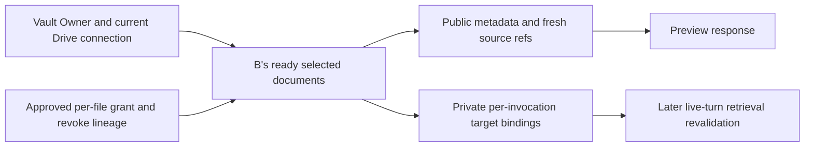

# Drive context envelope v1

## Visual Map

`DriveContextEnvelopeBuilder` assembles a metadata-only eligibility snapshot for
one authenticated private-agent turn. `POST /api/one/agent-chat/drive-context/preview`
accepts exactly `{}` with a current Vault Owner token and issues its own preview
turn ID. It returns no document text, filename, provider ID, stable fingerprint,
OAuth credential, or private target binding. Responses are `private, no-store`.
The preview does not call a model, decrypt chunks, contact Google, enqueue work,
or change sharing state.

The public schema is versioned as `envelope_version: 1`. Each document has a
random `source_ref` minted again on every assembly, constant label `Document`,
`origin` (`own_selection` or `shared_grant`), nullable owner display and period,
nullable grant/revocation revisions for own selections, and the caller's current
connection generation. Owner display is currently null: selected Drive metadata
has no verified original-owner field. Both period fields are null: a request's
desired period and a review's request-level coverage are not per-document facts.
The constraints array is descriptive; authorization is enforced by code.

The service's `assemble(user_id, turn_id)` returns only this public projection.
`assemble_for_invocation(user_id, turn_id)` additionally returns a private
`DriveContextAssembly` with `resolve(ref, actor_user_id, turn_id)`. The map is
held by that one in-process invocation and is discarded by preview. No
persistent handle store or resolve endpoint exists. A future chat or voice
consumer must assemble for its trusted actor and turn, retain the private map
only until that turn ends, revalidate connection/index versions and every grant
and revocation dependency before decrypting content, and constrain citations
to refs from that same assembly. The envelope alone is never a permission.

Assembly reads selected, ready, processing-enabled rows for the caller's
verified current Drive connection. It checks the selected-file registry policy
and `google_drive_chat_reads` admission. A's and B's stored source fingerprints
are user-keyed; matching an A grant to B's selected target requires B's sealed
file metadata and the sharing operation's global file lock, then validation of
the sealed grant plan, approved review, current request recipient, B's verified
Google account binding, and exact revoke parent lineage. A grant targets only
B's own selected document row. `succeeded` and `preexisting` grants qualify;
successful or absent revoke outcomes suppress them. Uncertain lineage returns
`incomplete_authority`. A request's 30-day expiry limits new dispatch, not an
already settled Google permission. `review_revision` and
`revocation_revision` are distinct counters.

The implementation uses a read-only PostgreSQL repeatable-read transaction and
bounded queries: at most 100 selected rows and 1,025 operation rows are read,
with overflow refused. Migration 239 indexes the existing server-keyed file
lock for this bounded lookup without adding a new authority record. It emits
at most 25 deduplicated documents and 16 KiB
of serialized UTF-8 JSON; overflow returns `narrow_selection_required` with no
partial envelope. `connect_required`, `connection_changed`, and
`incomplete_authority` are typed `409` responses; feature-off is `403`; storage
unavailability is `503`. A healthy admitted account with no eligible rows gets
an empty `200` envelope.

## Known boundary before retrieval integration

Request erasure keeps an owner-only management context, but removes the
recipient identity and approved review. Its surviving operation can fence a
matching selected file, never positively authorize it. The current selected
metadata also does not prove original ownership, and owner-account deletion
removes settled operation lineage. A durable negative provenance or verified
original-ownership prerequisite is required before Task 2 treats every
`own_selection` handle as a complete revocation-safe retrieval grant across
that deletion boundary. Task 1 preview has no content resolution path.

Task 2 owns chat retrieval and coverage, Task 3 owns conversational requests,
and Task 4 owns derived-index retention after revocation. None is implemented
by this envelope.
