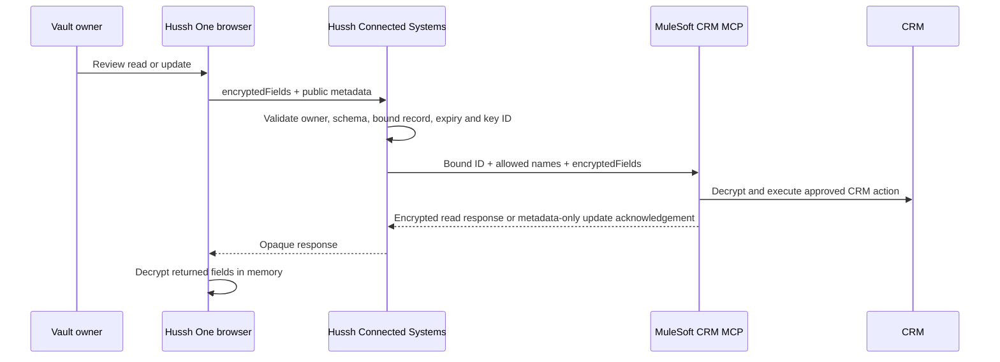

# MuleSoft trusted connector and encrypted CRM fields

## Decision

Hussh has two separate MuleSoft lanes. They do not share grants, keys, or
authority.

1. Consent MCP/PCHP is a connector-only information-export lifecycle.
2. Connected Systems is an owner-approved CRM workflow.

This document describes the Connected Systems contract. It is not a PCHP
variant and does not alter consent-export cryptography.

## Current external CRM contract

`crm-encrypted-fields.v1` is the sole encrypted-fields profile for external
CRM reads and updates. The browser encrypts CRM field values for MuleSoft;
Hussh validates the owner, allowed field names, expiration, configured public
key, and server-bound record ID but never decrypts those values.

## Visual Map



The profile uses X25519, `SHA-256(X25519 shared secret)`, and AES-256-GCM. It
uses no HKDF, AAD, owner signature, response signature, or MuleSoft
approval-proof validation. Its security claim is precise: CRM field values are
opaque to Hussh on bound reads and updates. It is not a signed,
replay-proof zero-knowledge protocol.

## Operation model

| Operation | Hussh responsibility | MuleSoft responsibility | Values at Hussh |
| --- | --- | --- | --- |
| Discovery | Derive verified email/phone server-side and accept exactly one CRM match; return binding metadata only | Query the CRM using the governed connector | Narrow server-side identity lookup exception; no values returned to browser |
| Read | Resolve the existing owner-bound CRM ID and allowed return fields | Decrypt request, read CRM, encrypt `{ "returnFields": { ... } }` to the browser’s fresh X25519 key | Never decrypted or persisted |
| Update | Persist a ciphertext-only pending intent; enforce user confirmation, record binding, schema, expiry and idempotency | Decrypt exactly the reviewed `{ "additionalFields": { ... } }`, mutate CRM, return metadata-only acknowledgement | Never decrypted or persisted |
| Create | Existing reviewed plaintext lifecycle; HushhTech may create `Account`/Person Account where the registry permits | Create the registered object type | Current lifecycle |
| Delete | Existing reviewed plaintext lifecycle | Delete only the server-bound object record | Current lifecycle |

An Account/Person Account ID is never copied into a Contact binding. If a
Contact update is needed after an Account create, Hussh performs its narrow,
server-derived verified identity lookup and binds the exact one Contact result
before update. The browser never supplies a CRM ID.

## Exact MCP payloads

MuleSoft receives a registered tool call with no CRM URL, OAuth credentials,
client secret, token URL, arbitrary target, browser-selected record ID, or
request-supplied public key.

Read tool `read-crm-record-encrypted`:

```json
{
  "profile": "crm-encrypted-fields.v1",
  "operation": "read",
  "objectType": "Contact",
  "id": "<server-bound-record-id>",
  "returnFields": ["FirstName", "LastName", "Email", "Phone"],
  "encryptedFields": {
    "profile": "crm-encrypted-fields.v1",
    "direction": "read_request",
    "recipientKeyId": "mulesoft-sandbox-key-1",
    "clientOperationId": "cef_<random>",
    "expiresAtMs": 0,
    "clientPublicKey": "<base64-x25519-public-key>",
    "wrappedPayloadKey": "<base64>",
    "wrappedKeyIv": "<base64-12-byte-iv>",
    "wrappedKeyTag": "<base64-16-byte-tag>",
    "payloadIv": "<base64-12-byte-iv>",
    "payloadTag": "<base64-16-byte-tag>",
    "ciphertext": "<base64>"
  }
}
```

Update tool `update-crm-record-encrypted` adds `intentId`, `approvalId`,
`clientOperationId`, and allowed `fieldNames`; it carries the same
`encryptedFields` shape with `direction: "update_request"`. MuleSoft returns
only `{ "status": "accepted", "accepted": true, "operationId": "<opaque-id>" }`.

## Credential and key custody

- Hussh authenticates to the registered Omni Gateway endpoint with runtime
  gateway credentials. These are never MCP tool arguments.
- MuleSoft owns CRM OAuth/connection credentials in its secret store and
  resolves the CRM connection from the deployed connector configuration.
- Hussh stores only MuleSoft’s registered X25519 public key, key ID, and
  fingerprint. MuleSoft’s private key never leaves its KMS/HSM or approved
  crypto runtime.
- The browser keeps its fresh X25519 private key only in memory. Reload or
  expiry means a fresh bound read; it is never persisted.

## Activation and UAT gate

The profile is default-off and sandbox/UAT-only until MuleSoft verifies exact
request/response vectors, malformed ciphertext/key failures, expiry,
idempotent update retry, key rotation, Account-create/Contact-binding
separation, and database/log/trace evidence that no CRM values or credentials
were recorded by Hussh.

`crm-zk.v1` and `crm-zk-uat.v1` are retired runtime profiles. Their applied
migrations remain immutable database history; no current route, UI flow, or
registry activation selects them.
