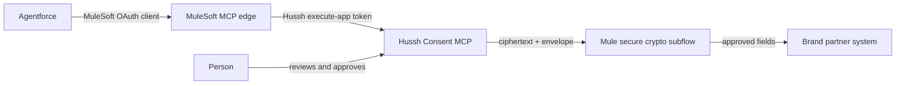

# MuleSoft and Agentforce secure consent relay

## Visual Context

Canonical visual owner: [consent-protocol](../README.md).



## Decision at a glance

Hussh has one MCP endpoint and one canonical five-tool consent contract. Do
not create a second Hussh endpoint, a reduced Hussh manifest, or a parallel
consent lifecycle for Agentforce.

The encrypted export is deliberately **not an Agentforce action**. It is a
connector-only step inside MuleSoft after a grant has been approved. Agentforce
does not receive a connector private key, ciphertext envelope, plaintext
information, or a Hussh credential.

This is the required topology:

```text
Agentforce
  -- MuleSoft-owned OAuth client credentials --> MuleSoft MCP endpoint
  -- Hussh execute-app OAuth credentials ----> Hussh /mcp/
  -- approved grant + registered public key --> encrypted export
  -- private key in MuleSoft KMS/HSM --------> decrypt in a Mule secure subflow
  -- approved, purpose-bound delivery -------> brand partner system
```

The two OAuth hops are intentionally different identities. The first protects
the Salesforce-to-MuleSoft connection. The second identifies the provisioned
partner application to Hussh. Neither credential is a person identity and
neither replaces a person's consent.

## Current Agentforce gate

Salesforce documents that Agentforce MCP supports Streamable HTTP and OAuth
2.0 client credentials, but does not support user-level authentication or use
cases requiring an individual identifier or personalized response. That is a
host-product limitation, not a Hussh authentication defect. See Salesforce's
[MCP considerations](https://help.salesforce.com/s/articleView?id=ai.agent_mcp_considerations.htm&language=en_US&type=5).

Therefore:

- Direct Agentforce identities are catalog-only in Hussh. A direct
  personalized call returns `REQUIRES_SECURE_CONSENT_FLOW` and does not invoke
  a consent handler.
- A MuleSoft relay can authenticate to Hussh with its own operations-provisioned
  execute application, but it does **not** turn an unsupported Agentforce
  personalized-response use case into a supported one.
- The production gate is written confirmation from Salesforce that the exact
  Agentforce and MuleSoft topology is supported for the proposed branded
  experience. Until that exists, test the personal lifecycle only as a
  MuleSoft-to-Hussh UAT flow, not as an Agentforce production capability.

This boundary is intentional. Do not weaken Hussh's catalog-only protection to
work around an Agentforce host limitation.

## What remains five tools, and what Agentforce sees

Hussh always publishes these five tools, in this exact order:

1. `search-user-scopes`
2. `prepare-campaign-context`
3. `request-consent`
4. `check-consent-status`
5. `get-encrypted-scoped-export`

The generated Exchange file remains a five-tool **registration projection**.
It is the only file uploaded to MuleSoft Exchange and is not hand-edited.

MuleSoft must use its MCP Global Access policy at the Agentforce-facing edge:

| Boundary | Tools exposed | Reason |
| --- | --- | --- |
| Hussh canonical endpoint | All five | One public contract and one complete consent lifecycle. |
| MuleSoft internal Hussh client | All five | The secure connector needs the approved encrypted export. |
| Agentforce action surface | No personalized lifecycle actions by default; if Salesforce approves the UAT topology, only tools 1–4 | Tool 5 is ciphertext delivery and cannot be interpreted or decrypted by an LLM. |

The policy is an access projection, not a second manifest. MuleSoft's MCP
Global Access policy filters both `tools/list` and blocked `tools/call`
requests, which is exactly what is needed here. Its Tool Mapping policy may
improve descriptions, but must not change the Hussh names, arguments, output
meaning, or lifecycle semantics. See MuleSoft's [Global Access
policy](https://docs.mulesoft.com/gateway/latest/policies-included-mcp-global-access)
and [policy ordering](https://docs.mulesoft.com/gateway/latest/policies-mcp-access-control-together).

The four control-plane tools are not confusing when configured with these
Agentforce instructions:

- Use `search-user-scopes` before selecting a scope.
- Use `prepare-campaign-context` only for an offer/context journey. Do not use
  it and `request-consent` as two independent requests for the same purpose.
- Use `request-consent` after a scope and purpose are selected.
- Use `check-consent-status` only with the returned `request_ref` and at the
  returned interval.
- Never call, display, parse, or describe `get-encrypted-scoped-export` in an
  Agentforce prompt. MuleSoft invokes it only in the secure connector subflow
  after it has verified an approved grant.

## Sovereignty and information boundary

The correct sovereignty statement is precise:

- Hussh governs application identity, consent, scope, grant status, expiry,
  revocation, audit references, and encrypted-export issuance.
- Hussh receives and delivers **ciphertext** plus the public recipient-key
  binding. Hussh does not receive the connector private key or readable export
  information.
- MuleSoft is not merely transport once it decrypts. It becomes a minimal
  trusted connector delivery boundary and must meet the brand partner's key,
  retention, access-control, and audit requirements.
- A VPC/private network protects the route. It is not consent, key custody, or
  authorization. Consent and cryptographic key separation remain mandatory
  inside a VPC.

Do not state that no information may touch Hussh at all: consent metadata and
ciphertext necessarily do. The enforceable boundary is that readable scoped
information and the private key never enter Hussh or an LLM context.

## MuleSoft build requirements

### 1. Provision two app identities and one connector key

1. **Salesforce to MuleSoft**: create MuleSoft-owned OAuth client credentials
   for the Agentforce connection. Store those only in Salesforce Named
   Credential/connection configuration.
2. **MuleSoft to Hussh**: Hussh provisions a separate `partner_crm` execute
   developer application with OAuth `client_credentials`, consent entitlement,
   and one registered X25519 public key. Store its client secret only in
   Anypoint Secrets Manager or an approved external secret manager.
3. **Connector key pair**: generate and retain the X25519 private key in the
   approved MuleSoft/brand KMS, HSM, or reviewed external crypto service.
   Register only its public key, key ID, and fingerprint with Hussh. Never put
   the private key in a DataWeave file, Exchange asset, property file, log,
   ticket, request argument, or Agentforce configuration.

Use a distinct Hussh execute application per brand partner. Rotation,
revocation, audit attribution, and a connector-key change then remain isolated
to that partner.

### 2. Keep the app-exchange registration simple

1. In Exchange choose **Upload MCP file**, not Fetch MCP URL.
2. Upload the generated
   `packages/hushh-mcp/gateway/hushh-mulesoft-exchange-mcp-schema.json` file.
   It intentionally contains only Exchange-supported MCP fields and the five
   canonical definitions. Its `protocolVersion` is `2025-06-18` deliberately:
   that is the Exchange/Mule policy-compatible registration revision. Hussh's
   runtime also accepts that revision; it is not a second endpoint or lifecycle.
   The file contains no URL, authentication block, or secret.
3. Publish the brand partner's MuleSoft MCP endpoint to API Catalog.
4. In Agentforce, create the connection to the **MuleSoft endpoint** using the
   MuleSoft OAuth identity-provider URL, scope, client ID, and client secret.
   Do not enter the Hussh client into Salesforce.
5. Add only approved actions from the Asset Library. For the default
   production-safe configuration, do not add the personal lifecycle actions.
   For a Salesforce-approved UAT, allow tools 1–4 only. Tool 5 remains hidden
   and rejected at the Agentforce-facing edge.

The generated `hushh-agentforce-mcp-manifest.json` is a diagnostic artifact,
not the Exchange upload file. The full `hushh-mcp-gateway.json` is the
canonical partner contract, not a Salesforce configuration file.

### 3. Build a secure Mule consent workflow

Implement this as a Mule orchestration flow, not as Agentforce prompt logic:

1. Exchange the MuleSoft-to-Hussh client credentials for a short-lived access
   token and cache it only until shortly before expiry.
2. Call Hussh over Streamable HTTP with `Authorization: Bearer <access token>`.
   Preserve JSON-RPC IDs and Hussh lifecycle references.
3. For the proposed purpose, call either the normal
   `search-user-scopes -> request-consent -> check-consent-status` path or the
   distinct `prepare-campaign-context -> check-consent-status` offer path.
   Do not use both request creators for one purpose.
4. On `pending`, give the person the Hussh Consent Center route through the
   approved experience and poll only at `poll_after_seconds`. A pending result
   is a valid lifecycle outcome, not an error.
5. On `granted`, verify the grant reference, expected scope, expiry, connector
   key ID/fingerprint, and envelope binding before the delivery step.
6. Invoke `get-encrypted-scoped-export` **inside MuleSoft only**. Do not
   forward its output to Agentforce or a model.
7. Decrypt, validate and scope-narrow inside the protected crypto runtime;
   immediately send only the approved fields to the brand partner system.
8. Emit a metadata-only delivery receipt. Respect expiry/revocation and the
   brand partner's approved retention/deletion policy.

The flow must be idempotent by Hussh request/grant reference. Retrying a
network request must not create a duplicate consent request, duplicate
delivery, or untracked persistence event.

### 4. Implement the exact envelope cryptography

The Hussh envelope is `X25519-AES256-GCM`. It is not an interchangeable
password-based encryption pattern.

```text
shared_secret = X25519(connector_private_key, sender_public_key)
wrapping_key  = SHA-256(shared_secret)

export_key = AES-256-GCM.decrypt(
  key=wrapping_key,
  ciphertext=wrapped_export_key || wrapped_key_tag,
  iv=wrapped_key_iv,
  aad=canonical_json(export_envelope)
)

plaintext = AES-256-GCM.decrypt(
  key=export_key,
  ciphertext=ciphertext || payload_tag,
  iv=payload_iv,
  aad=canonical_json(export_envelope.aad)
)
```

`canonical_json` is recursively key-sorted, compact UTF-8 JSON. Validate the
envelope's application binding, grant, expected scope, revision, expiry,
recipient key ID/fingerprint, and AAD digest before delivery. Do not replace
this with PBKDF2, AES-CBC, a guessed HKDF, an AES key-wrap variant, or a custom
AAD representation.

MuleSoft's standard Cryptography module must not be assumed to implement the
required X25519 envelope procedure. The team must provide a reviewed Java
crypto module or approved external crypto service with X25519 and AES-256-GCM
support, key material held outside the Mule application, test vectors, and a
security review. MuleSoft's [Cryptography module
reference](https://docs.mulesoft.com/cryptography-module/latest/cryptography-module-reference)
is the starting point for supported primitives, not proof of this complete
protocol implementation.

## Result and error handling

For a successful Hussh tool result, MuleSoft treats `structuredContent` as the
one canonical result. `content[0].text` is the serialized compatibility mirror
and must not be sent to Agentforce as a second answer.

After validating and decrypting a financial-documents export, the trusted
connector can apply Hussh's fixed `financial_statement_bundle.v1` projection.
It produces top-level `statements` and `holdings` arrays joined by
`statement_ref`, omits unavailable optional values, and performs no LLM call or
request-time schema mapping. The connector's separate Agentforce-facing action
returns that normalized object as `structuredContent` and an exact compact JSON
mirror in `content[0].text`. This projection is connector output; it does not
change the encrypted `get-encrypted-scoped-export` result or the five-tool
consent lifecycle.

For a tool execution error, Hussh returns `isError: true` and one safe JSON
text content item. It intentionally omits `structuredContent`: error fields
such as `error_code` and `next_action` cannot conform to a tool's strict
success output schema. Parse that text only in the Mule transport layer and
map it to a safe, user-facing brand response. Never surface internal errors,
credentials, connector-key details, supplied identifiers, ciphertext, or
plaintext.

## Required telemetry and audit boundary

All parties use the same correlation reference but record only metadata:

| Owner | Required record | Prohibited record |
| --- | --- | --- |
| Hussh | app identity, hashed lifecycle reference, scope, envelope/key fingerprint, result, correlation, timestamps | private key, plaintext information, raw supplied identifier |
| MuleSoft | correlation, policy version, grant/scope validation outcome, key ID/fingerprint, delivery target alias, result, deletion/retention event | private key, ciphertext, plaintext, access token |
| Brand partner | lawful purpose, approved destination, access, retention and deletion evidence | broader information than the approved scope |

Redact request/response logs, DataWeave errors, traces, DLQs, prompt payloads,
and analytics. The private key and decrypted payload must never be serialized.

## UAT acceptance checklist

Do not call the topology ready until all of the following independently pass:

1. MuleSoft exchanges its Hussh execute-app credentials and `initialize` plus
   `tools/list` show the exact five canonical names upstream.
2. The Exchange upload validates and API Catalog registers the MuleSoft
   endpoint with no Hussh-specific manifest fields.
3. Agentforce authenticates only to MuleSoft and sees only its configured
   action subset. Confirm tool 5 is absent and blocked at this edge.
4. The direct Agentforce profile returns `REQUIRES_SECURE_CONSENT_FLOW` for a
   personalized call; this proves the host boundary is not silently bypassed.
5. MuleSoft-to-Hussh UAT completes the approved lifecycle against a synthetic
   user: scope discovery, request, approval, status, encrypted retrieval,
   envelope validation, decrypt, scoped delivery, readback, expiry/revocation
   rejection, and cleanup.
6. Negative tests cover wrong app, expired token, wrong key ID/fingerprint,
   tampered ciphertext/AAD, scope mismatch, revoked grant, duplicate delivery,
   and a blocked Agentforce `tools/call` to tool 5.
7. Salesforce confirms in writing that the intended branded Agentforce
   experience is permitted before any production personal-information path is
   enabled.

## Brand partner reuse model

For each new brand partner, reuse this exact architecture. Only these inputs
change: MuleSoft deployment identity, its separate Hussh execute application,
registered connector public key, partner destination alias, purpose copy,
retention/deletion policy, and allowed scope set. The Hussh endpoint, five
tool definitions, consent semantics, error contract, and envelope algorithm
do not change.

This preserves a single governing Hussh protocol while allowing each brand
partner to have isolated credentials, cryptographic key custody, audit, and
delivery controls.
