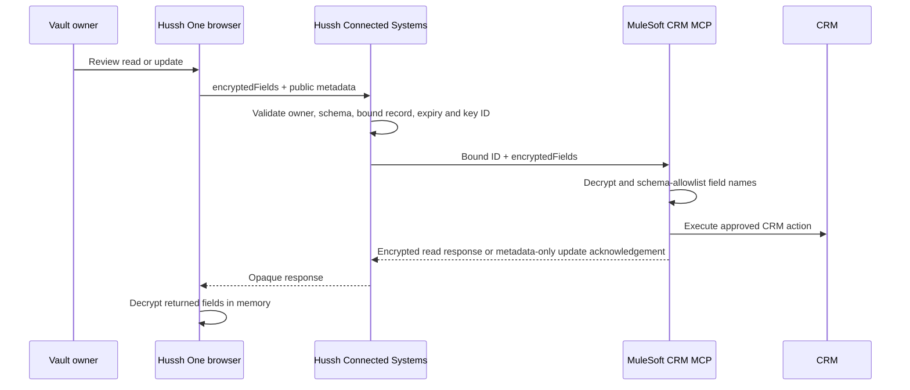

# MuleSoft trusted connector and encrypted CRM fields

## Decision

Hussh has two separate MuleSoft lanes. They do not share grants, keys, or
authority.

1. Consent MCP/PCHP is a connector-only information-export lifecycle.
2. Connected Systems is an owner-approved CRM workflow.

This document describes the Connected Systems contract. It is not a PCHP
variant and does not alter consent-export cryptography.

## Current external CRM contract

`crm-encrypted-fields.v1` is the sole encrypted-fields profile for external
CRM reads and updates. The browser encrypts CRM field values for MuleSoft;
Hussh validates the owner, browser-declared field names, expiration, configured
public key, and server-bound record ID but never decrypts those values. Because
this simplified profile has no AAD or signature, MuleSoft must independently
reject every decrypted update key outside the registered CRM schema. Hussh
cannot cryptographically prove that the declared names and ciphertext match.

## Visual Map



The profile uses X25519, `SHA-256(X25519 shared secret)`, and AES-256-GCM. It
uses no HKDF, AAD, owner signature, response signature, or MuleSoft
approval-proof validation. Its security claim is precise: CRM field values are
opaque to Hussh on bound reads and updates. It is not a signed,
replay-proof zero-knowledge protocol.

## Operation model

| Operation | Hussh responsibility | MuleSoft responsibility | Values at Hussh |
| --- | --- | --- | --- |
| Discovery | Derive verified email/phone server-side and accept exactly one CRM match; return binding metadata only | Query the CRM using the governed connector | Narrow server-side identity lookup exception; no values returned to browser |
| Read | Resolve the existing owner-bound CRM ID and allowed return fields | Decrypt request, read CRM, encrypt `{ "returnFields": { ... } }` to the browser’s fresh X25519 key | Never decrypted or persisted |
| Update | Persist a ciphertext-only pending intent; enforce user confirmation, record binding, declared field names, schema, expiry and idempotency | Decrypt `{ "additionalFields": { ... } }`, enforce the CRM schema allowlist, mutate CRM, return metadata-only acknowledgement | Never decrypted or persisted |
| Create | Existing reviewed plaintext lifecycle; HushhTech may create `Account`/Person Account where the registry permits | Create the registered object type | Current lifecycle |
| Delete | Existing reviewed plaintext lifecycle | Delete only the server-bound object record | Current lifecycle |

An Account/Person Account ID is never copied into a Contact binding. If a
Contact update is needed after an Account create, Hussh performs its narrow,
server-derived verified identity lookup and binds the exact one Contact result
before update. The browser never supplies a CRM ID.

## Exact MCP payloads

The external CRM MCP uses MuleSoft's dynamic-registry contract. Hussh adds a
server-owned CRM connection bundle to each tool call: target, CRM base URL,
CRM MCP path, OAuth client ID/secret, and token URL. These values come only from
the encrypted enterprise registry and never from a browser request. The
external gateway has its own Secret Manager credential profile, separate from
the shared Omni Gateway credentials. A browser still cannot select a CRM URL,
credential, target, recipient key, or record ID.

The registry maps the encrypted profile to deployed MuleSoft tools. For the
current external CRM endpoint, use the existing `read-crm-record` and
`update-crm-record` names; no second tool catalogue is required. The connector
must recognise this profile and reject a plaintext fallback when
`encryptedFields` is present.

Read tool `read-crm-record`:

```json
{
  "target": "Hussh",
  "crmBaseUrl": "<server-registry-value>",
  "crmMcpEndpoint": "<server-registry-value>",
  "clientId": "<server-registry-secret>",
  "clientSecret": "<server-registry-secret>",
  "crmTokenUrl": "<server-registry-value>",
  "objectType": "Contact",
  "id": "<server-bound-record-id>",
  "returnFields": ["FirstName", "LastName", "Email", "Phone"],
  "encryptedFields": {
    "client_public_key": "<base64-x25519-public-key>",
    "wrapped_payload_key": "<base64>",
    "wrapped_key_iv": "<base64-12-byte-iv>",
    "wrapped_key_tag": "<base64-16-byte-tag>",
    "payload_iv": "<base64-12-byte-iv>",
    "payload_tag": "<base64-16-byte-tag>",
    "ciphertext": "<base64>"
  }
}
```

The browser-facing Hussh API uses camelCase and carries profile, direction, key
ID, client operation ID, and expiry as Hussh control metadata. MuleSoft's
strict tool schema accepts only the seven snake_case cryptographic fields shown
above. For update, `update-crm-record` receives `objectType`, the server-bound
`id`, and `encryptedFields`; Hussh retains intent, approval, idempotency, and
declared-field metadata internally. MuleSoft does not receive that metadata in
the current strict tool schema, so its decrypted-field schema allowlist is a
mandatory activation condition. MuleSoft returns only
`{ "status": "accepted", "accepted": true, "operationId": "<opaque-id>" }`.

## Credential and key custody

- Hussh authenticates to the registered Omni Gateway endpoint with runtime
  gateway credentials. The external CRM endpoint uses isolated
  `OMNIGATEWAY_EXT_CRM_*` secrets; these are never MCP tool arguments.
- For the current external CRM endpoint, Hussh decrypts the registered CRM
  OAuth/connection bundle only in backend memory and supplies it directly to
  MuleSoft's tool contract. It is never exposed to the browser, logs, audit
  rows, or API responses.
- Hussh stores only MuleSoft’s registered X25519 public key, key ID, and
  fingerprint. MuleSoft’s private key never leaves its KMS/HSM or approved
  crypto runtime.
- The browser keeps its fresh X25519 private key only in memory. Reload or
  expiry means a fresh bound read; it is never persisted.

## Activation and UAT gate

The profile is default-off and sandbox/UAT-only until MuleSoft verifies exact
request/response vectors, malformed ciphertext/key failures, expiry,
idempotent update retry, key rotation, Account-create/Contact-binding
separation, and database/log/trace evidence that no CRM values or credentials
were recorded by Hussh. The ignored activation descriptor must contain an
operator-reviewed `partnerConformance` attestation with a SHA-256 digest of the
evidence, confirmation that strict MCP schemas were tested, and confirmation
that decrypted update keys are schema-allowlisted. The activation probe checks
every registry-owned object type; the Hussh cross-object flow therefore proves
both `Account` and `Contact` schemas. Schema proof alone cannot enable a
write-capable row; the operator must also provide a safe fixture that proves
every declared cross-object operation without reusing an Account ID as a
Contact ID.

The read response is authenticated only by the selected TLS/gateway trust
model; it is not signed. Hussh restores request-held operation metadata around
the strict seven-field MuleSoft response. This is an intentional limitation of
the simplified profile and must not be presented as independent response
authenticity.

`crm-zk.v1` and `crm-zk-uat.v1` are retired runtime profiles. Their applied
migrations remain immutable database history; no current route, UI flow, or
registry activation selects them.
