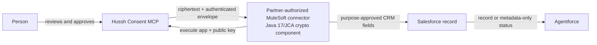

# MuleSoft trusted connector for Salesforce and Agentforce

## Visual Context

Canonical visual owner: [consent-protocol](../README.md).

## Decision

Hussh retains one `/mcp/` endpoint, one canonical five-tool consent lifecycle,
and the existing envelope-v2 `X25519-AES256-GCM` profile. Salesforce does not
receive a second endpoint, reduced catalog, alternate consent flow, or
Salesforce-specific cryptographic profile.

The selected enterprise delivery target is a partner-authorized MuleSoft
connector with a separately reviewed Java 17/JCA crypto component. The
connector authenticates as a dedicated `partner_crm` execute application,
uses a partner-controlled key through approved key custody, and calls the five
Hussh tools internally. After approval it validates and decrypts the scoped
export outside every model context, writes only the purpose-approved CRM
fields, and returns metadata-only status.

Agentforce reads the resulting Salesforce record or delivery status. It never
receives tool 5, an export envelope, a connector private key, or a broad
decrypted export. AgentExchange may distribute a Salesforce action or user
experience, but it is not required for decryption when MuleSoft owns that
boundary.

The existing MuleSoft-backed Connected Systems mutation path is current. The
Java/JCA consent-export decryptor and an encrypted Connected Systems mutation
envelope remain proposed and require partner UAT before production use.



## Boundaries that do not change

1. Hussh publishes exactly five tools: `search-user-scopes`,
   `prepare-campaign-context`, `request-consent`, `check-consent-status`, and
   `get-encrypted-scoped-export`.
2. Direct Agentforce access remains catalog-only. It must not receive a
   synthetic Hussh user identity or execute personalized consent calls.
3. `get-encrypted-scoped-export` is connector-only. It is not an Agentforce
   planner action and its result is not model context.
4. Application authentication, person consent, information delivery, and CRM
   mutation are separate authorities. One cannot substitute for another.
5. Hussh receives only the connector public key, key ID, algorithm, and
   fingerprint. It never receives the connector private key or readable scoped
   information.
6. No HKDF, forward-secrecy, envelope-version, or wire-shape change is part of
   this decision.

## One runtime, two authority lanes

MuleSoft may host both lanes, but they do not share authority:

| Lane | Authority | Current state |
| --- | --- | --- |
| Consent delivery | Partner execute app, exact approved scope, active grant, connector key binding | Hussh lifecycle and encrypted export are current; MuleSoft/JCA decryptor is UAT-gated |
| Connected Systems mutation | Signed-in vault owner, typed CRM intent, trusted confirmation, bound CRM record, idempotent execution and readback | Existing MuleSoft-backed mutation sends readable fields over TLS; encrypted mutation delivery is a target |

Each lane keeps independent policy, correlation, idempotency, audit, and
recovery. A `grant_ref` never authorizes a CRM mutation. Reusing the same
partner-controlled connector and key-custody runtime does not require a second
key channel, but a future mutation envelope must bind its distinct lane,
purpose, destination, and confirmation receipt in authenticated metadata.

The target mutation sequence is:

1. Register and pin the MuleSoft connector public key and key fingerprint.
2. Keep the existing typed intent, owner-bound CRM record, and trusted
   confirmation as the mutation authority.
3. After confirmation, seal only the approved fields with the existing
   `X25519-AES256-GCM` construction.
4. Bind `connected_systems_mutation`, intent ID, approval receipt, connector,
   operation, object type, bound record, field names, expiry, key fingerprint,
   and idempotency reference into authenticated metadata.
5. Let the trusted MuleSoft connector decrypt outside model context, mutate the
   CRM, read it back, and return a metadata-only settlement.

Sealing inside FastAPI protects only the Hussh-to-MuleSoft application leg
because Hussh has already received and staged readable fields. End-to-end
browser-to-MuleSoft confidentiality requires client-side sealing and
ciphertext-only pending-intent storage. That is a larger change and must not be
represented as already shipped.

## Connector identity and key custody

Each partner environment receives a dedicated Hussh `partner_crm` execute
application and connector key identity. The MuleSoft connector generates or
imports an X25519 key pair in customer-controlled KMS/HSM custody or another
reviewed crypto runtime. Only the public bundle reaches Hussh:

```json
{
  "connector_public_key": "base64-x25519-public-key",
  "connector_key_id": "partner-crm-key-2026-07",
  "connector_wrapping_alg": "X25519-AES256-GCM"
}
```

The private key must never enter an MCP argument, Agentforce, an SObject,
prompt, Flow variable, DataWeave log, trace, ticket, or Hussh system. Key
rotation is explicit: retain an old key only for bounded active exports, then
create fresh consent/export bindings for the new key.

The public key is authenticated, registered, and pinned per connector
environment. Hussh does not trust a new public key fetched independently during
each delivery or mutation. The same registered key-custody runtime may serve
both authority lanes, but each envelope carries its own purpose and lifecycle
binding.

## Consent-delivery lifecycle

The trusted connector performs this deterministic lifecycle:

1. Authenticate as the partner's Hussh execute application.
2. Call `search-user-scopes`, choose the narrowest useful scope, and call
   `request-consent` with a clear purpose and the registered public key.
3. Treat `pending` as valid. The person approves in Hussh, and the connector
   polls only at `poll_after_seconds`.
4. After `check-consent-status` returns an approved `grant_ref`, call
   `get-encrypted-scoped-export` inside trusted connector code only.
5. Validate app, grant, expected scope, revision, expiry, key
   ID/fingerprint, algorithm, envelope, and AAD.
6. Decrypt and narrow outside all model contexts, map only approved fields to
   the destination action, write the CRM record, and read it back.
7. Return only metadata such as status, delivery reference, destination
   collection, and records written.

The connector is idempotent by consent/grant and destination operation
reference. A retry cannot create a duplicate request, delivery, or CRM write.

## Durable READ audit

Every successful inline release through the raw Developer API or hosted MCP
records a metadata-only `READ` event before ciphertext is returned. Audit
failure fails the release closed with `EXPORT_AUDIT_UNAVAILABLE`.

The event records the app, grant reference, exact scope, export ID/revision,
connector key ID/fingerprint, delivery surface, result, and correlation
reference. It never records ciphertext, wrapped keys, envelope JSON,
credentials, connector public/private keys, supplied identifiers, or decrypted
information. `READ` is state-neutral and does not change consent status.

The event proves Hussh issued the encrypted export. It does not claim the
connector successfully decrypted it or completed a CRM write; those outcomes
belong to connector and destination receipts.

## Exact cryptography remains unchanged

```text
shared_secret = X25519(connector_private_key, sender_public_key)
wrapping_key  = SHA-256(shared_secret)

export_key = AES-256-GCM.decrypt(
  key=wrapping_key,
  ciphertext=wrapped_export_key || wrapped_key_tag,
  iv=wrapped_key_iv,
  aad=canonical_json(export_envelope)
)

plaintext = AES-256-GCM.decrypt(
  key=export_key,
  ciphertext=ciphertext || payload_tag,
  iv=payload_iv,
  aad=canonical_json(export_envelope.aad)
)
```

`canonical_json` is recursively key-sorted compact UTF-8 JSON. Do not replace
this with PBKDF2, AES-CBC, guessed HKDF, an AES key-wrap variant, or a different
AAD representation. Reference code is in the [Developer API decryption
guide](./developer-api.md#decrypt-an-encrypted-export-locally). A runnable
[Java 17/JCA sample](../../examples/java17-jca-export-decryptor/README.md)
implements the same envelope and includes a cross-language brokerage vector.

This export design uses a long-lived recipient key and therefore does not claim
Signal-style forward secrecy. Compromise of that connector private key can
expose retained historical ciphertext. The compatibility-preserving controls
are partner-controlled KMS/HSM custody, bounded export expiry and ciphertext
retention, explicit key rotation, and revocation. A forward-secrecy redesign
would require a separately versioned protocol and is not needed for this flow
to remain operational.

## Compatibility-preserving hardening

The next security work does not require a new crypto profile or MCP schema:

1. Validate base64 encoding and exact X25519/AES-GCM key, IV, and tag lengths
   before accepting an export.
2. Require connector verification against expected app, grant, scope, revision,
   expiry, recipient fingerprint, algorithm, envelope, and AAD.
3. Make revocation target the exact app/grant instead of an ambiguous
   user-and-scope match.
4. Export metadata-only READ and connector settlement events to the controlled
   audit/SIEM plane with retention, time synchronization, access controls, and
   audit-failure alerting.
5. Give CRM mutation a durable idempotency and reconciliation ledger for the
   case where Salesforce commits a write but the response is lost.

These controls harden validation, audit, and recovery around the current
envelope. They do not change `X25519-AES256-GCM`, add HKDF, introduce a second
key channel, or require AgentExchange decryption.

## Required UAT proof

Before enabling personal-information delivery through MuleSoft:

1. Prove the connector uses its dedicated execute app and unique public-key
   fingerprint while Hussh has no private key.
2. Run all five tools through request, approval, polling, encrypted retrieval,
   Java/JCA validation and decrypt, deterministic field mapping, Salesforce
   write/readback, expiry/revocation, and cleanup.
3. Prove Agentforce sees only the authorized record or metadata-only status.
4. Prove no prompt, log, trace, queue, or telemetry event contains plaintext,
   ciphertext, key material, credentials, or complete envelopes.
5. Run wrong-app, wrong-key, tampered-AAD/ciphertext, stale-revision,
   scope-mismatch, revocation, duplicate-delivery, timeout, and key-rotation
   cases.

Across Salesforce, HubSpot, Sierra, Oracle, and other connectors, the endpoint,
consent meaning, encryption profile, and five-tool catalog remain identical.
Only partner identity, key custody, destination schema, mapping, purpose,
retention, and allowed scopes vary.
