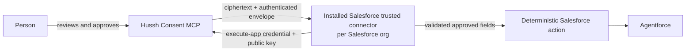

# Salesforce AgentExchange trusted connector

## Visual Context

Canonical visual owner: [consent-protocol](../README.md).

## Decision

Hussh has one Streamable HTTP endpoint and one canonical five-tool consent
contract. A Salesforce integration does not create a reduced Hussh endpoint,
an Agentforce-specific consent lifecycle, or a different encryption protocol.

An AgentExchange package is a distribution mechanism. The installed,
customer-specific connector runtime is the trust boundary: it owns its own
X25519 key pair, sends only the public key to Hussh, and performs decryption
outside Agentforce's language-model context. MuleSoft is not part of the
selected Salesforce integration.



## Boundaries that do not change

1. Hussh publishes exactly these five tools:
   `search-user-scopes`, `prepare-campaign-context`, `request-consent`,
   `check-consent-status`, and `get-encrypted-scoped-export`.
2. A direct Agentforce MCP profile remains catalog-only. It must not receive a
   synthetic Hussh user identity or run personalized consent calls.
3. `get-encrypted-scoped-export` is a trusted-connector operation, never an
   Agentforce planner/LLM action. The model receives neither ciphertext, a
   connector private key, nor a decrypted export.
4. OAuth application authority, the person's consent authority, and the
   encryption-recipient key are separate controls. A client credential does
   not replace consent and a public key does not widen a scope.
5. Hussh receives only the connector public key, key ID, algorithm, and
   fingerprint. It does not receive a connector private key or readable scoped
   information.

Salesforce documents that external MCP tool support has host constraints. The
package route therefore needs a Salesforce UAT rehearsal in the target org;
the existence of an AgentExchange listing is not proof that a personalized
consent workflow is permitted. See Salesforce's [MCP
considerations](https://help.salesforce.com/s/articleView?id=ai.agent_mcp_considerations.htm&language=en_US&type=5)
and [API Catalog guidance](https://help.salesforce.com/s/articleView?id=platform.api_catalog_manage_mcp_servers.htm&language=en_US&type=5).

## Per-org connector identity and key custody

Each installed Salesforce org gets its own Hussh `partner_crm` execute app and
its own connector key identity. The connector generates or imports an X25519
key pair after installation in a customer-controlled KMS/HSM or reviewed
connector crypto runtime. It retains the private key there.

Only this public bundle reaches Hussh:

```json
{
  "connector_public_key": "base64-x25519-public-key",
  "connector_key_id": "salesforce-org-key-2026-07",
  "connector_wrapping_alg": "X25519-AES256-GCM"
}
```

The current contract supports two safe modes:

| Mode | `request-consent` key fields | Intended use |
| --- | --- | --- |
| Registered key | Omit the fields; Hussh resolves the app's active registered key. If supplied, all three must exactly match it. | Production default: one active public key per partner/org app. |
| Per-request key bundle | Supply all three fields on every request. | Compatibility/UAT for an unregistered standard/flat execute app. |

Never put the private key in an MCP argument, AgentExchange package artifact,
Custom Metadata/Custom Setting, SObject, Named Credential field, prompt,
Flow variable, trace, DataWeave, log, ticket, or Hussh system. Do not ship a
universal private key in a managed package.

Key rotation is explicit: retain the old key only long enough to complete or
revoke exports bound to it, register the new public key with an explicit key
ID, and create fresh consent/export bindings. Do not silently rebind a grant
to a new key.

## Lifecycle implemented by the trusted connector

The package's deterministic connector code, not an Agentforce prompt,
performs this lifecycle:

1. Authenticate as that org's Hussh execute application using its protected
   bearer credential or short-lived OAuth client-credentials token.
2. Call `search-user-scopes`, choose the narrowest returned scope, then call
   `request-consent` with a clear purpose and the registered key (or complete
   per-request public bundle).
3. Treat `pending` as a valid state. Direct the person to the Hussh Consent
   Center and poll only at `poll_after_seconds`.
4. Once `check-consent-status` returns an approved `grant_ref`, call
   `get-encrypted-scoped-export` inside the trusted connector only.
5. Validate app binding, grant, exact expected scope, export revision, expiry,
   recipient key ID/fingerprint, algorithm, envelope, and AAD before decrypting.
6. Decrypt and scope-narrow deterministically outside every model context.
   Validate and write only the approved fields required for the named CRM
   action, then emit a metadata-only delivery receipt.

The connector must be idempotent by Hussh request/grant reference. A retry
cannot create a duplicate request, delivery, or CRM mutation.

## Tool visibility is an integration policy, not a second contract

The trusted connector uses all five tools. Agentforce receives the connector's
single deterministic action result, not individual personalized Hussh tools.
Hussh does not publish a four-tool variant.

Regardless of that policy, tool 5 stays internal to trusted connector code and
is blocked from the Agentforce planner. Its response is an encrypted export
package, not a CRM record and not model context.

The generated `hushh-agentforce-mcp-manifest.json` is a diagnostic contract,
not a package to upload. Its `salesforceAgentExchangeHandoff` object is the
current non-secret integration guide. The older
`mulesoftAgentforceHandoff` object is retained for existing Mule relay users.

## Approved output to Salesforce and Agentforce

After decryption, connector code may produce an action-specific, flat,
deterministically validated object for Salesforce. This is a separate action
result, not a change to the encrypted export tool or its five-tool lifecycle.
For example, the fixed financial-documents projection produces top-level
`statements` and `holdings` arrays joined by `statement_ref`.

The connector must not pass raw PKM, envelope metadata, credentials, or an
arbitrary decrypted blob to an Agentforce prompt. Its action contract declares
the minimal fields it returns. Agentforce compatibility is proven in the
target-org UAT using that action schema and a synthetic approved export.

## Exact envelope cryptography

The envelope is `X25519-AES256-GCM`:

```text
shared_secret = X25519(connector_private_key, sender_public_key)
wrapping_key  = SHA-256(shared_secret)

export_key = AES-256-GCM.decrypt(
  key=wrapping_key,
  ciphertext=wrapped_export_key || wrapped_key_tag,
  iv=wrapped_key_iv,
  aad=canonical_json(export_envelope)
)

plaintext = AES-256-GCM.decrypt(
  key=export_key,
  ciphertext=ciphertext || payload_tag,
  iv=payload_iv,
  aad=canonical_json(export_envelope.aad)
)
```

`canonical_json` is recursively key-sorted compact UTF-8 JSON. Do not replace
this with PBKDF2, AES-CBC, guessed HKDF, an AES key-wrap variant, or a new AAD
representation. Reference code and response-field details are in the
[Developer API decryption guide](./developer-api.md#decrypt-an-encrypted-export-locally).

## Required UAT proof

Before enabling personal-information delivery in any installed Salesforce org:

1. Prove the connector uses its own execute app and a unique public-key
   fingerprint; Hussh has no private key.
2. Run all five tools against a synthetic user through request, approval,
   polling, encrypted retrieval, envelope validation, decrypt, deterministic
   action output, CRM readback, expiry/revocation, and cleanup.
3. Prove tool 5 is absent from Agentforce planner/model context and that no
   prompt, log, or telemetry record contains ciphertext, plaintext, key
   material, identifier, access token, or export envelope.
4. Run negative cases: wrong app, wrong key ID/fingerprint, tampered
   ciphertext/AAD, stale export revision, scope mismatch, revoked grant,
   duplicate delivery, and key rotation.
5. Verify the target Salesforce org's Agentforce/API Catalog/Named Credential
   configuration supports the exact installed package boundary before production.

The only variable pieces across Salesforce, HubSpot, Sierra, Oracle, and other
connectors are the tenant app identity, connector public key, trusted runtime,
destination action schema, purpose, retention, and allowed scopes. Hussh's
endpoint, consent semantics, envelope, and five-tool catalog stay identical.
