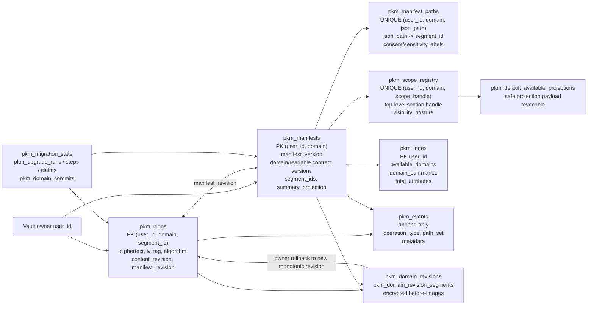
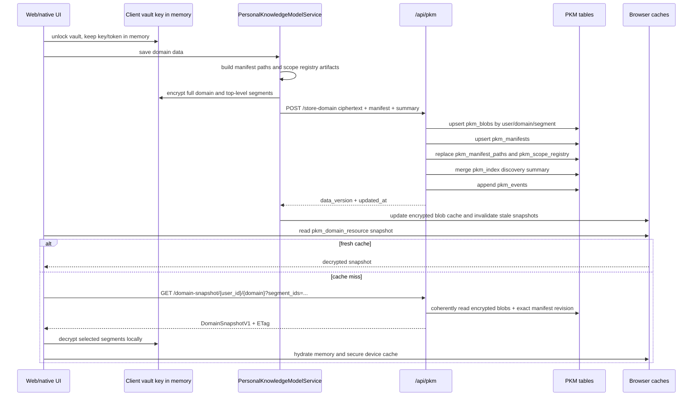
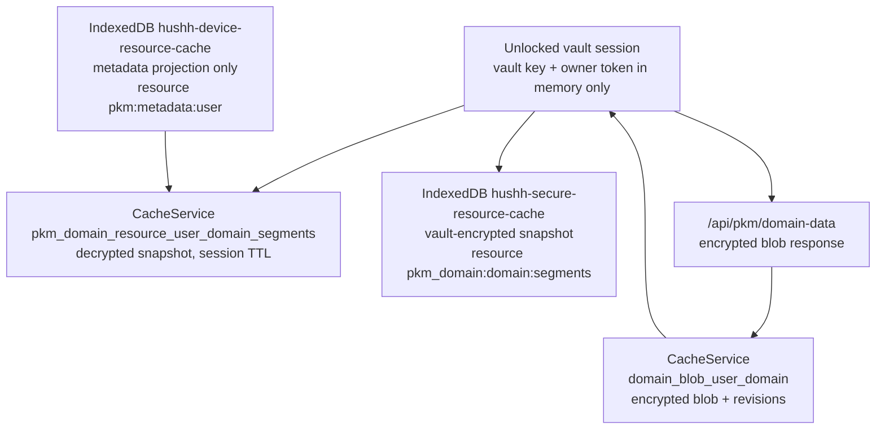
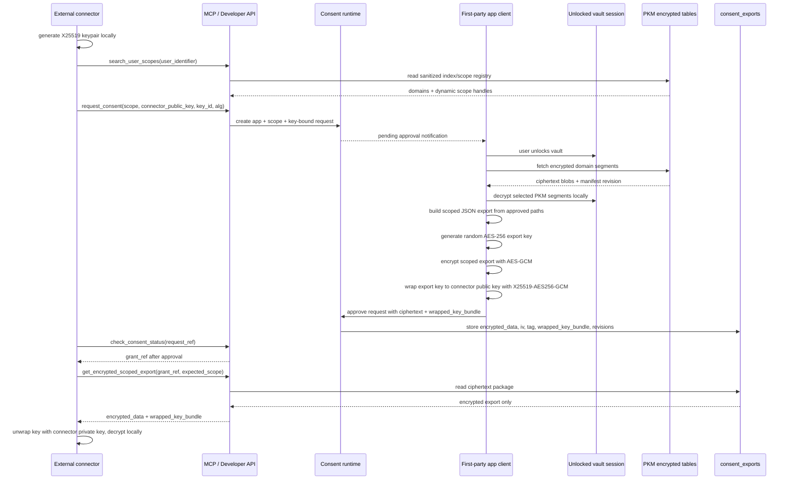

# Personal Knowledge Model


## Visual Map

Canonical visual owner: [consent-protocol](../README.md). Use that map for the top-down system view; this page is the narrower detail beneath it.

The Personal Knowledge Model (PKM) is the current checked-in encrypted user-memory architecture. One is the product ownership target for relationship memory; current implementation evidence still comes through finance-specialist and Kai-era compatibility runtime docs because Kai remains the shipped finance specialist and generated action authority.

The approved product direction is One-owned relationship memory with specialist slices beneath it:

- One owns cross-domain relationship memory such as context, preferences, trusted people, decisions, and previously answered questions.
- Kai owns finance memory and finance reasoning over the protected finance lane.
- Nav owns privacy, consent, vault, deletion, and scope-review memory once Nav runtime surfaces are implemented.

Until that migration lands, do not describe One-owned PKM as current-state runtime behavior. Use the One/Nav roadmap for future-state claims about portable One memory, user-private action receipts, BYO model execution, or no platform-controlled recovery.

### PKM table map



### PKM read/write and cache map





## Canonical tables

Structure-preview manifests preserve nonempty sensitivity labels from the adopted
structure decision for paths that survive payload normalization. The structural
walk still owns actual paths and segments; it must not overwrite the agent's
sensitivity assessment. Scope sensitivity tiers are derived after those labels
are applied. A label alone never enables exposure or grants consent.

The browser prepared-domain writer rebuilds structure from the full merged
payload, retaining valid consent labels and sensitivity from same-domain,
surviving, same-type manifest paths. Previous metadata precedes the reviewed
manifest; the current structure decision's sensitivity takes precedence for the
same source path, before aggregation into collection paths. Partial sibling
updates cannot supersede a different sibling or a prior collection assessment.
Conflicting collection assessments and custom concrete labels that cannot
represent the collection require review before persistence. Concrete default
titles retain the collection's canonical title rather than an entity identifier.
The older merged-domain writer preserves previous metadata when rebuilding;
complete caller artifacts bypass unused fallback generation in both writers.
Metadata overlays do not copy scope handles, exposure flags, or missing paths.
An explicitly different manifest owner is excluded. This source contract still
requires separate encrypted-save/readback acceptance; preview tests alone do
not certify it.

- `pkm_index`
  Sanitized discovery/readable-summary projection. It can carry coarse summaries,
  counters, freshness, and capability flags, but it is not raw PKM and is not the
  user-memory authority.
- `pkm_blobs`
  Encrypted PKM payload segments keyed by `user_id + domain + segment_id`.
- `pkm_manifests`
  Private encrypted-first structure metadata per user/domain.
- `pkm_manifest_paths`
  Private queryable manifest paths for first-party runtime and consent expansion.
- `pkm_scope_registry`
  Public queryable scope handles and coarse exposure metadata. Registry rows carry
  a protocol-owned `visibility_posture`: `private` or `consent_required`.
  No raw internal PKM paths should be exposed outside
  first-party authenticated tooling.
- `pkm_default_available_projections`
  Compatibility storage for owner-published public-profile projections. Each
  active row has explicit publication provenance and an opaque public-profile
  handle. It is a separate public-resource plane, not a PKM scope or encrypted
  consent authority; it never contains raw encrypted PKM blobs, `pkm.read`,
  workflow artifacts, or unrestricted domain payloads.
- `pkm_events`
  Append-only PKM mutation and replay ledger.
- `pkm_migration_state`
  Cutover state for legacy encrypted users awaiting repartition on vault unlock.
- `pkm_upgrade_runs`
  Generic client-side PKM upgrade runs for post-cutover schema and readability evolution.
- `pkm_upgrade_steps`
  Per-domain resumable checkpoints for generic PKM upgrades. No plaintext or key material is stored here.
- `pkm_upgrade_claims`
  Short-lived server-issued authority bound to owner, run, domain, source revisions,
  exact target contracts, commit id, and expiry.
- `pkm_domain_commits`
  Idempotent commit receipts and aggregate preservation results. No user values or
  persistent value hashes are stored here.
- `pkm_domain_revisions` and `pkm_domain_revision_segments`
  Immutable encrypted before-images plus the exact manifest/path/scope/index metadata
  needed to restore the domain without revision rollback or information loss.

## PKM information planes

| Plane | Contains | Excludes |
| --- | --- | --- |
| Encrypted core | One canonical copy of owner-authored facts, preferences, goals, relationships, entities, and durable decisions | Parser output, raw documents, debug fields, workflow state, market caches |
| Encrypted source artifacts | Original statements, normalized extracts, receipts, and immutable source evidence addressed by content id | Agent-ready summaries and duplicate canonical holdings |
| Derived views | Private-agent memory cards, Kai compatibility views, summaries, embeddings, analytics, and consent projections | New authoritative owner information |
| Control and audit | Manifests, revisions, scope registry, coarse events, claims, and aggregate upgrade receipts | Plaintext values, prompts, model output, and raw extracts |
| Recovery and quarantine | Lifetime encrypted origin snapshot, rolling rollback revisions, and uncertain legacy information | Private-agent context, MCP discovery, or public projections |

### Reserved Source Library domain

`source_library` is a fixed, canonical PKM capability boundary owned by the
Source Library writer. It is not a consent scope, cloud-file catalog, raw-source
store, or generic user domain. Semantic structure agents cannot select, create,
redirect, or repurpose it.

The mounted Google Drive, iCloud Drive, or local file remains the authoritative
blob. Source Library keeps private encrypted `SourceLibraryMemoryV2` semantic
and control memory for items, collections, reviewed knowledge, relationships,
and logical roots. Its
profile-scoped SQLite store is a rebuildable mapping and operations plane: it may
hold opaque references, revisions, lifecycle state, timestamps, keyed lookup
tokens, and encrypted device-local locators, but never document bytes, extracted
text, plaintext paths or titles, recipient emails, provider identifiers, or raw
content hashes.

Hermes seals that local Source Library state with versioned AES-GCM keys derived
from the unlocked vault key and a separate local-custody secret. The latter is a
macOS Data Protection Keychain generic-password item configured for
`WhenUnlockedThisDeviceOnly` and local user presence; it is cached only for the
unlocked bridge session and is zeroized on lock, revocation, profile change, or
disconnect. It is not an enclave-resident `SecKey`: the implementation must not
claim Secure Enclave storage until a non-exportable `SecKey` adapter and its
device re-enrollment lifecycle are shipped. Missing local custody with existing
ciphertext fails closed as recovery/rebuild required rather than rotating a key.
SQLite uses sealed fields and keyed lookup tokens, not full-page database
encryption; its opaque mapping state remains rebuildable.

Every `attr.source_library.*` form is non-discoverable, non-requestable, and
non-authorizing. Source Library manifests expose no top-level consent scopes or
externalizable paths, and the public-profile projection plane remains disabled.
Sharing addresses a pinned file revision or reviewed knowledge artifact through
an opaque `share_ref` and an owner-bound mounted share target. The provider file
remains the source of truth; a SQLite share row is only local mapping state and
never proves access, completes publication, or revokes a previously published
file. Provider ACL administration and verified recipient-email roles are outside
this mounted-filesystem contract.

No field is deleted because it appears noisy. It must be classified into one of these
planes. Unknown or conflicting information is preserved in an encrypted, private,
non-exportable quarantine until deterministic local proof can place or restore it. The
reserved encrypted segment id is `__quarantine_v1`; it is rejected if any manifest path
makes it externalizable or any scope registry entry references it.

## Upgrade safety contract

1. Load `DomainSnapshotV1`; decrypt only ciphertext bound to its content and manifest revisions.
2. Transform locally and classify every JSON occurrence as preserved, moved,
   equal-value deduplicated, quarantined, or rejected.
3. Accept only a complete aggregate `PreservationReceiptV1` with zero rejected occurrences.
4. Obtain `UpgradeClaimV1`; commit with its exact idempotency key before the claim expires.
5. Archive the active encrypted revision and commit the new active state atomically.
6. On ambiguous transport failure, succeed only when `latest_upgrade_commit_id` matches
   the claim commit id.
7. Rollback restores ciphertext and metadata into a new monotonic revision and refreshes
   affected encrypted exports. Owner-published public-profile projections are not
   automatically republished; they remain owner-approved snapshots.

The mandatory gate rehearses synthetic historical versions 0 through 4 (and the
reserved-branch relocation below), heterogeneous
arrays, sparse and unknown keys, financial statement/Plaid/KYC memory, Gmail-derived
memory, private scopes, retired aliases, encryption round trips, idempotency, and rollback.
For selected protected UAT releases, the gate additionally requires the
transaction-rolled-back PostgreSQL RPC rehearsal in
`db/verify/pkm_v7_zero_loss_rehearsal.sql`, using
`PKM_UPGRADE_POSTGRES_REHEARSAL_URL` or complete PostgreSQL connection variables.
The live PKM/Kai/RIA route audit requires `PKM_UPGRADE_RUNTIME_AUDIT_BASE_URL` or
explicit postdeploy deferral. Decrypted reviewer-shape artifacts are prohibited
in CI; use the postdeploy BYOK rehearsal. Paid structure-agent evaluation is
optional and requires explicit `PKM_UPGRADE_STRUCTURE_AGENT_EVAL=1` locally, or
UAT's `run_live_model_checks=true` for the synthetic candidate job. A skipped
model evaluation does not prove semantic quality. Financial v7 readers may ship while the server policy
remains `off`; v7 writes require explicit cohort eligibility and an inactive kill switch,
which is rechecked when the commit reaches the API rather than only when a claim is issued.

## Authority and sync model

PKM is local-first and encrypted-first. The user-memory authority is:

1. encrypted domain payloads in `pkm_blobs`
2. per-domain structure and version truth in `pkm_manifests`
3. append-only mutation history in `pkm_events`
4. client-side cache write-through after vault unlock

`pkm_index` is a cloud discovery projection. It can summarize available domains,
safe counters, freshness, and coarse capability flags, but it is not the source
of user memory truth. If local-only, offline, or on-device runtime paths are
active, the app may read from local encrypted cache and reconcile cloud
projection later.

Cloud writes to `pkm_index.domain_summaries` must therefore be treated as sync
projection updates. They should be atomic and repairable, but they must not make
local saves fail solely because the cloud projection is temporarily unavailable.

## Private-agent automatic memory saving

Automatic memory saving is a **per-vault** preference stored only in the
encrypted internal runtime-settings domain. The product default is enabled, and
an owner can disable it. When enabled, One may save only backend-approved
create or extend memories with no active sharing recipients.
Low-confidence, ambiguous, duplicate, new-domain, corrective, deletion,
financial-normalization, secret, government-ID, and shared-memory candidates
are not written automatically. They are skipped by the chat auto-save path;
that path must not manufacture a review request or imply that they were saved.
An explicit owner request to save a supported KYC identifier uses the separate
fixed-schema KYC flow instead: the value is encrypted as a `restricted` PKM
field, never added to One's automatic context packet, and requires the owner's
direct confirmation for that save. Passwords, PINs, card security values,
authentication tokens, and bank credentials remain ineligible for PKM capture.
Each automatic write carries an `owner_auto_save_policy` receipt that records
the enabled policy version rather than claiming that the owner reviewed that
individual memory.

### Explicit saves from chat

When the owner asks One to save something ("save this to my memory"), One calls
`add_to_pkm`. The tool saves nothing itself: it returns `status: handed_to_device` with
`saved: false`, and for a pasted document (`whole_message=true`) the browser reads the
owner's own message instead of a copy in the tool argument. The device then:

1. prepares the text one source section per proposal (`granularity: "section"`, a
   300 second budget), so a long document is not packed into six-section chunks the
   eight-fact segmenter can only answer with "split";
2. sends each section with up to ten of the owner's existing details most related
   to it (`simulated_state.memories`: entity id, scope, and a summary clipped to 200
   characters, chosen on the device by word overlap from the unlocked working set),
   so the merge agent can choose extend, correct or no_op instead of creating a
   second copy. This is the same owner information One's chat already receives as
   consented turn information; nothing is stored server-side;
3. leaves unsaved only what the segmentation agent reports in `not_memory` (an exact
   duplicate line or a pure disclaimer such as "Information not known"), exact duplicates
   of what is already stored, and restatements the merge agent matched to a stored detail
   (`no_op` with a target), which count as already known; every one of them still appears
   in the line coverage with its reason;
4. writes every remaining card with an `owner_confirmed` receipt, sensitive details (pay,
   equity, immigration, a housing deposit) included, labelled sensitive. A card that still
   carries a raw identifier value, and a detail that would change what the owner already
   shares, wait for the owner's tap on the receipt card. A Secrets placeholder is a
   reference, never an identifier; secret values are never written here;
5. reports a receipt built only from server-acknowledged commits (a `data_version`):
   saved, updated, merged, already known, skipped as not facts, waiting for the owner,
   failed, and sections not read. A section that could not be prepared is reported; it
   does not stop the prepared sections from saving.

One is told that receipt on the next turn, as counts and category names only, and its
instruction forbids claiming a save without one. Every capture job has a deadline and
settles to a terminal outcome. Explicit Save keeps its progress and failure visible;
automatic preparation adds a line to an ordinary answer only after a confirmed
save, so a general question does not acquire an unrelated Memory error or a
stuck "Checking for details worth remembering" line.

Live evidence, 2026-09-29 (Gemini 3.6, synthetic 10,290 character context transfer
with 16 sections, the real proposal service and the real client merge path with only
storage and encryption stubbed): the first save prepared 17 sections in 175 seconds and
saved 85 details, skipped 12 that were not facts (the "Information not known" section
produced none), and held one for the owner's tap. Every one of its 97 cards was
`confirm_first`, so the previous auto-save filter could never have saved any of them,
and 97 of 97 were `create_entity` because no existing details were offered. A second
paste with six changed facts produced: 9 new, 8 updated (15 earlier values kept in
history, including the promotion, the salary, the move and the vendor switch), 1 merged,
78 already known, 3 skipped, 3 sections unread after the 45 second per-proposal budget,
and no duplicate details. A vault-unlocked browser run was not performed.

### Keeping everything the owner stated

Phase 4 of the reserved-branch plan (2026-10-02). The memory agents decide a place for
everything the owner states: work context, company, product, tech stack, infrastructure,
vendors, people, repository metrics, AI tooling and non-secret technical identifiers
(project ids, environment variable names, OAuth URLs, app ids). A fact about another person
or organization is kept and attributed to them. Each segment carries `context_quotes`, the
exact headings that attribute it, and the segmentation agent returns
`not_memory[]: {quote, reason: duplicate | disclaimer}` for every line it does not select
(`preview_summary.not_memory` on `/api/pkm/memory/proposals`; the device maps both onto the
line coverage). The Financial Guard Agent was removed: the intent agent alone tells a live
`command` ("optimize my portfolio") from a memory, and a money preference lands in
`financial.agent_memory` through the reserved registry.

Four loss points closed with it:

- the structure agent is skipped only for an intent `no_op` or `command`; a statement that
  needs confirmation is structured, no longer filed through a fallback record clipped to 240
  and 500 characters;
- a quote that does not match the owner's text is dropped alone and counted
  (`unmatched_quote_count`); quotes are matched after folding Markdown and dash variants and
  stored as the owner's exact span, instead of one bad quote discarding the whole section;
- a model domain named after a protocol namespace a person could mean as a subject
  (`agents`, `mcp`, `system`) is kept in the intent's domain or `professional`
  (`protocol_domain_name_remapped`) instead of refused;
- a write whose response was lost is confirmed with `POST /api/pkm/commits/lookup`
  (owner-scoped, existence and `data_version` only) before the save job retries it or
  reports it "not yet saved".

Proof: `consent-protocol/tests/services/test_context_transfer_is_kept.py` runs a synthetic,
founder-shaped 16 KB document (20 sections) through the real preview pipeline with scripted
agents and checks the recorded answers; `hushh-webapp/__tests__/services/pkm-save-job.test.ts`
replays them through the resumable save job: every line saved or `not_memory`, zero
unaccounted, with a negative control that loses lines without `not_memory`.

**Re-preparing lines inside a saved step** (2026-10-02). A step can commit while lines
inside it stay unaccounted: the agents dropped a segment, or its quote did not match
(`unmatched_quote_count`, now kept on the step). The receipt's "Retry N lines" used to
re-run only failed steps, so those lines read "not yet saved" for good. Retry
(`retryPkmSaveJobLines`, called by `resumeExplicitPkmSaveJob` with `retry`) now also runs
`addPkmSaveJobReprepareSteps`: each unaccounted line belongs to the deepest step covering
it, and every contiguous run of such lines in a committed or needs-owner step becomes a
child step over exactly those lines, carrying the heading chain that attributes them
(`pkmSourceRunChunk`). The child's id is `sha256(jobId, "reprepare", parentId, run)`, so
its commit scopes never collide with the parent's: the parent's saved cards are not sent
again, and a second Retry before the child settles finds it and adds nothing. Proof, with
the earlier Retry as the negative control: `hushh-webapp/__tests__/services/pkm-save-job.test.ts`
("re-preparing lines a committed step left unaccounted").

### Memory evolves: superseded values stay in history

A memory write whose merge agent chose create, extend or correct keeps the stored
information current without losing any of it. When a stated value changes, the new
value is current and the earlier one moves to a sibling `superseded` list with the time
it was replaced (`hushh-webapp/lib/pkm/pkm-supersede-merge.ts`). Lists extend by union;
a correction replaces a list and keeps the old one in history. A correction whose
payload is not entity-shaped is applied (it used to be dropped while the save reported
success). `superseded` is an internal branch in `contracts/pkm/internal-path-keys.v1.json`:
it is encrypted with the domain, recoverable by the owner, and never requestable or
shareable. Memory cards and One's context packet skip it too, so an earlier value is
never presented as a current fact.

Sensitivity of saved details: the client manifest walk labels a path `restricted` or
`confidential` when its canonical path, its concrete path (entity ids) or its stated
value names a sensitive topic from `contracts/consent/field-sensitivity.v1.json`
(pay, immigration, identity, health, tax, credentials). The server's
`scope_sensitivity` reads the same topic table. Only the label leaves the device, and
labels only escalate, so a salary saved under a general profile scope makes that
scope sensitive for consent sharing. Structured writers (runtime settings, connectors, financial replace) pass no
memory merge decision and keep their plain merge, so no credential accumulates history.

KYC onboarding has a separate first-party owner-confirmed path. It requires an
unlocked private vault before the identity form is shown; an account without a
vault is first sent through the vault-create flow. The person's `Save &
Continue` action may then advance the UI immediately while the client organizes
the submitted free-form narrative into private encrypted PKM facts in the
background. It does not persist the raw narrative as an `about_me` value, and
it never auto-writes a card with active sharing recipients. The action is
recorded as an individual owner confirmation, not as the per-vault automatic
memory policy above. The submitted KYC step remains complete even if background
fact organization needs a retry; a transient PKM failure must never reopen KYC
and make an owner repeat onboarding.

## Information about the person, never application state

The PKM's whole claim is that it holds what is true about someone. Whether that
person finished a setup wizard is true about the app. The two had been drifting
into the same store, because the onboarding flow wrote its own progress beside
the answers it collected.

Measured 2026-09-11 for one person's `financial` domain: twenty-four stored leaf
values, of which eight were information about anybody. The other sixteen were six
routing-telemetry rows, five timestamps recording when each answer was given, and
five wizard checkpoints, one of which had been initialised and never set. All
twenty-four were being offered to that person as things they could share with
someone else.

**The rule.** A stored key becomes a declared, requestable path only if it is a
record about the person. Application state, routing telemetry, and the timestamp
of an answer are not, and must not reach a catalogue.

**Where it is enforced.** At the manifest walk, which is the moment a stored key
first becomes a declared path. That is deliberately upstream of display: filtering
the catalogue stops a person being OFFERED their own checkpoints, but a store that
holds them is already wrong even if nothing renders them.

**How the two sides agree.** `contracts/pkm/internal-path-keys.v1.json` is one
hand-authored truth table read by both implementations,
`hushh-webapp/lib/pkm/internal-path-keys.ts` and
`hushh_mcp/consent/internal_path_keys.py`. Same precedent as
`contracts/pkm/segment-humanization.v1.json`, and for the same reason: two
implementations of one rule drift, a shared table cannot.

**Two near-misses worth remembering**, because each looked correct alone:

1. The catalogue filter already knew `domain_intent` was structural, but compared
   only the first path segment, so `profile.domain_intent.primary` published
   freely while `domain_intent` was blocked.
2. A field initialised to `null` and never written was recorded as
   exposure-eligible, because the walk returned early only on `undefined`.

**Not yet done:** the cleanup of already-stored records. The rule stops new
application state entering the model and stops the existing rows being offered;
evicting what is already stored is an upgrade step that has not run.

## Reserved branches: what an app feature owns

Some branches exist because an app feature needs them to work: Finance holdings
and sources, RIA picks and regulator facts, Location saved places and visit
ratings, the KYC identity profile and documents, communication preferences,
Wallet, Gmail receipts, KYC internals and runtime credentials. Only that
feature's own controls should change them. The private agent's memory pipeline
should keep a chat fact about one of these areas in the area's `agent_memory`
sibling instead, and offer to open the feature's screen.

**The contract.** `contracts/pkm/reserved-branches.v1.json` is a hand-authored
truth table, copied byte-for-byte into `consent-protocol/contracts/pkm/` (the
backend image is built from `consent-protocol/`) and `hushh-webapp/contracts/pkm/`.
It holds two things:

- `writers`: the closed catalogue of writer ids. A writer id is the `source` of
  a PKM write authorization, which reaches the server as `mutation_plan.writer_id`.
  Each writer has a `class`: `feature` (an app feature's own control),
  `memory_agent` (chat saves, auto-capture and connector memory review), or
  `migration` (the upgrade gate, authorized by its server-verified upgrade claim).
- `entries`: one per reserved branch, with the writers allowed to change it, the
  `agent_memory_sibling`, the `offer_action` route (checked against the route
  orchestration index and the action gateway), and the declared `shareable` and
  `send_to_model` policies.

**The rule.** A write is refused when it touches a reserved branch and its writer
is unknown, is a `memory_agent`, is not listed on that entry, writes under an
auto-save authorization, or lacks the capability its catalogue entry requires
(Location's finalize authority; the KYC reply's information-request authority).
`migration` writers are never refused by this registry. Both loaders implement the
same rule: `hushh_mcp/consent/reserved_branches.py` and `hushh-webapp/lib/pkm/reserved-branches.ts`.

**The switch.** The contract's own `"enforcement"` value, `shadow` or `enforce`, decides
what happens with a refusal. It is a reviewed contract value, not an environment flag,
so the server and the device read one answer. It shipped as `shadow`; the migration
release (Phase 2, below) moved agent-written entries to their siblings and set it to
`enforce`.

- `shadow`: the server logs `pkm.reserved_would_refuse domain=<d> branch=<b> writer=<w>
  reason=<r> source=<declared|manifest_diff>` and the device counts the same; nothing is
  refused. The `source` separates what a client claimed from a manifest that changed
  under a reserved branch, so manifest-path drift is visible before the flip.
- `enforce`: the server refuses on `/api/pkm/store-domain`, `/store-domain/validate` and
  both whole-domain delete routes, and `store_domain_data` re-checks as defense in depth.
  - 403 `PKM_RESERVED_BRANCH_WRITER_FORBIDDEN` with `{code, domain, branch, reason,
    owner_feature, agent_memory_sibling, offer_action, registry_version}`;
  - 422 `PKM_WRITER_UNKNOWN` for an uncatalogued writer;
  - 409 `PKM_RESERVED_REGISTRY_OUTDATED` only for an old client whose writer the catalogue
    does not know (the old-client policy below). The version rides on the mutation plan
    as `client_version` because the plan reaches the server whole from the web proxy and
    both native plugins.

  The device returns `blocked_reserved_branch` from `PkmWriteCoordinator` before anything
  is encrypted or sent, and a failure of the check itself fails closed.

**What each side can see.** The server judges what a write changes: the plan's
`proposed_scope`, the structure decision's paths the stored manifest does not already
hold, and the manifest-path diff against the stored manifest (a path that appears or
disappears under a reserved branch, whatever the scope claims). A merged save's structure
decision lists every branch of the whole domain, so judging those paths as-is refused a
chat save into `location.agent_memory` as a write to `saved_places`; with no stored
manifest every path is new and is judged. The device
diffs every reserved branch's VALUE before and after the write
(`assertReservedBranchesUntouched`), which catches a change smuggled behind an innocent
scope: the server cannot, because each write re-encrypts the whole domain.
`PersonalKnowledgeModelService.storeDomainData` adds a writer-versus-scope check (the
declared scope) for the Wallet and runtime-secret paths, which do not go through the
coordinator; `store_domain_data` on the server re-checks the declared scope the same way.

**Old clients.** Builds already in TestFlight and the App Store send no `client_version`.
A blanket 409 would have broken their Finance and Location saves, so instead:

- the writer catalogue still applies: a `memory_agent` writer is refused on a reserved
  branch, and a feature writer listed on the entry is accepted;
- only the checks that depend on the client's own code are skipped: the structure-path
  novelty and the manifest diff, which compare a manifest built by that build's (older)
  builder with one a newer builder stored, and the device value diff it cannot run;
- 409 `PKM_RESERVED_REGISTRY_OUTDATED` is returned only when the writer is unknown and the
  client is old (on store, validate and the plan-carrying whole-domain delete).

The residual risk is a memory-agent write from an old build that changes a reserved branch
behind an `agent_memory` scope: no old-build path does this, and raising
`min_client_version` once those builds age out closes it. Every old-client write to a
domain with a reserved branch logs `pkm.reserved_legacy_client_write domain writer
refused` (labels only), which is the count that decides when.

**The KYC reply capability.** `agent_chat_kyc_owner_confirmed` may write identity
information only with a `kyc_reply_authorization`: an HMAC token for one owner and one
open information request, minted by
`POST /api/one/email/information-requests/{id}/pkm-reply-authorization` and verified at
`/store-domain` with a live check that the request is still open
(`hushh_mcp/consent/kyc_reply_authorization.py`). The keyword route that also used this
writer (`isExplicitKycIdentitySaveRequest`) is retired.

**Agents keep the fact, the app commits it.** The structure prompt carries the reserved
table. A model target inside an app-owned branch is moved to that branch's
`agent_memory_sibling` and recorded as `reserved_target_rerouted_to_sibling`; a branch
with no sibling, or a correction of an app-owned record, is `do_not_save`. See the
declaration in `backend-semantic-boundary.md`. The card carries a `reserved_offer`, and the
chat's save receipt shows it as a row ("Add as Home in Location"). Tapping it opens the
registry route and hands a prefill to that screen in memory only
(`hushh-webapp/lib/pkm/reserved-offer.ts`: owner-bound, 15 minutes, taken once), never in
the URL. Location saved places (category and name) and Wallet (nickname) take a prefill;
the other areas open their screen without one. The owner commits there, with that
feature's own writer.

**The Memory screen.** `"memory_screen_policy": "read_only_reserved"` makes an item inside
a reserved branch read-only in Memory, with "Open in <app>" from the entry's offer route;
the owning screen edits or removes it. Items in `agent_memory` siblings stay editable.
Setting the value to `editable` restores Memory editing (its writers are then refused in
enforce mode, since no entry lists them).

Neither side logs a stored value.

**Keeping the catalogue honest.** `hushh-webapp/__tests__/lib/pkm/reserved-branches.test.ts`
parses the webapp source, collects every writer label (including labels forwarded
through `WalletService`, saved-locations, portfolio-source and connector-review
helpers), and fails when a label has no registry entry or a registry writer has no
code behind it. `consent-protocol/tests/test_reserved_branches.py` covers the
copies, the shared rules and the server log line. A new writer means a new
registry entry in the same change.

### Phase 2: moving agent entries out, then enforcing

**The migration.** Every upgrade of a domain in `RESERVED_BRANCH_MIGRATION_DOMAINS`
(financial, identity, location, professional, ria, shopping, wallet; the TypeScript and
Python lists are parity-tested) runs one device-side relocation,
`hushh-webapp/lib/personal-knowledge-model/reserved-branch-migration.ts`, after its
version steps. It runs through the ordinary upgrade gate: writer `pkm_upgrade_orchestrator` (class `migration`), an
`upgrade_claim`, and a `preservation_receipt` with occurrence lineage. It classifies each
member of an `entities` map inside a reserved branch:

| Classification | Rule | Outcome |
|---|---|---|
| Agent-written | key is a memory-agent id (`mem_<hex>`, `_stable_entity_id`), or the value has the whole `_build_entity_record` shape (`summary`, `kind`, `observations`) | moved to the entry's `agent_memory` sibling, at the same path below the branch; equal copies already there are deduplicated |
| App-written | no agent marker | kept exactly in place |
| Ambiguous | partial shape (`observations` without `summary`/`kind`), a `mem_` key on a non-object, an agent shape stamped with a feature writer's `source`/`writer_id`/`source_agent`, a list item carrying `observations`, a different value already at the sibling target, or a sibling in another domain (Wallet's is `financial.agent_memory`) or none | preserved under `__quarantine_v1.reserved_branch_migration_v1`, keyed by source pointer, with its reason |

Provenance is the decrypted blob's own writer labels: `pkm_events` records a
`source_agent` and a path set but no per-path writer, and no client route reads it. A
supersede history (`entities.superseded.<id>`, and the entity's own `superseded`) moves
with its entity. A list item that leaves a list shifts the app items after it; that shift
is recorded as lineage, never assumed. The step is idempotent on its own output.

The quarantine was half-built before this release: the server's commit already required a
`__quarantine_v1` segment for any receipt with `quarantined > 0`, but the client stripped
the underscores from segment ids, so such an upgrade would have been refused and the key
renamed on read. The segment id now keeps its spelling, and the manifest treats
`__quarantine_v1` as an opaque private branch (no path walk, never exposable).

**Why a marker and not a version bump.** The plan bumped the domain contract version.
Every build since 2026-07-14 refuses to write a domain whose stored
`domain_contract_version` is newer than its own (`ensureWritableVersion` in
`pkm-write-coordinator.ts`: "Update the app before changing it"), and current clients
stamp their version on every write. A bump would have locked a person's TestFlight or App
Store build out of Finance and Location the moment the web app touched those domains. So
the domain version stays at 4, and completion is the manifest summary marker
`reserved_branch_migration_version` (1). Old builds never read it.

The server owns the marker: only an upgrade-claim commit records it, and an ordinary
write keeps the prior manifest's value and cannot set or clear it
(`_normalize_manifest_payload`). `build_status` schedules an upgrade for a migration
domain whose manifest lacks it, for current clients only: without `x-hushh-client-version`
on the upgrade and metadata routes a client is a legacy build, whose upgrade would be a
copy that never records the marker and would rerun on every entry. The web proxy forwards
the header (semver only) and keys its hot cache on it. Current clients reach the
relocation before their first write to such a domain, because a write first runs any
scheduled upgrade.

**Readiness, as proven on the Phase 2 copy before the flip.**

- Historical corpus (`hushh-webapp/__tests__/fixtures/pkm/historical-corpus.v1.json`),
  five new fixtures through decrypt, transform, lineage proof, encrypt, decrypt, compare,
  rollback and idempotency (`pkm-historical-rehearsal.test.ts`, in
  `scripts/ci/pkm-upgrade-gate.sh`): mixed `financial.profile` (2 moved: the entity and its
  map-level history), `location.saved_places` note (1 moved), `identity.identity_profile`
  fact with an equal sibling copy (1 deduplicated), mixed `professional.profile` (2 moved,
  4 quarantined, 2 app occurrences re-indexed), `ria.advisor_package` (unchanged
  byte-for-byte). Every receipt is complete with zero rejected occurrences; app-branch
  exposable paths after the upgrade equal the original minus exactly the relocated nodes;
  no previously exposable top-level scope disappears; the quarantine is never exposable
  and survives the segment round trip under its own key.
- Every writer listed on an entry replays clean against that entry, in both loaders and
  through `/store-domain` for current and old clients (capability writers through their
  own authority tests).
- The Phase 0 and Phase 1 suites pass with the contract at `enforce`.

**Rollback.** Set `"enforcement"` back to `"shadow"` in `contracts/pkm/reserved-branches.v1.json`
and copy it to both mirrors (the parity tests require all three). Nothing refuses after
the next backend and web deploy; the shadow log lines resume. No data changes: migrated
entries stay in their siblings, which every reader already shows, and quarantined
entries stay private and restorable from their source pointers. Because no domain
contract version moved, reverting the whole release is also safe for every client: an
older server ignores the marker, and no build is told its information is newer than it.
## The Secrets area: kept, never sent to a model

API keys, passwords, tokens and private keys the owner types, pastes or asks One
to save are kept in the reserved `secrets` domain and are never sent to the AI.
Card numbers and government id numbers (passport, SSN, Aadhaar) are held there
too, with an offer to file them in Wallet or the KYC identity documents. Things
that only NAME a secret (environment variable names, a secret-store path, a GCP
project id, an OAuth URL, an app id) are not secrets and are saved as ordinary
work context.

**One contract, two loaders.** `contracts/pkm/secret-patterns.v1.json` (with
byte-identical copies in `consent-protocol/contracts/pkm/` and
`hushh-webapp/contracts/pkm/`) lists each pattern with its `kind`, the place the
owner may file it (`file_to`: `wallet`, `kyc_identity_documents` or `none`), and
shared cases, positive and negative, that both loaders run:
`hushh-webapp/lib/pkm/secret-patterns.ts` and
`consent-protocol/hushh_mcp/consent/secret_patterns.py`. The fixtures are
assembled from parts, so the repository holds no credential-shaped literal. The
root and backend `.gitignore` files carry an exact-path exception for this file
under their `*secret*.json` rule.

**The device guard runs first.** `hushh-webapp/lib/pkm/secret-span-guard.ts`
runs in the chat composer's send path (typed text and every pasted attachment,
including "Edit and send again" and a queued edit) before anything reaches chat,
a memory proposal, history or telemetry. Each secret span is saved through the
feature writer `secrets_vault` (an owner-confirmed plan through
`PkmWriteCoordinator`, `hushh-webapp/lib/pkm/secrets-vault-service.ts`) and
replaced by `⟦secret:<id> <label>⟧`. The label is built on the device from the
words before the secret, with the value masked ("GitHub token ending 4f2a"). The
text is rendered only after the save settles; if the vault is locked or the save
fails, nothing is sent and the draft is restored. `streamAgentChat`, the queued
input transport and `previewAgentPkmMemory` refuse any text that still holds a
raw secret (`UnguardedSecretError`), before a request exists.

**The server is the second net.** `PKMAgentLabService._contains_sensitive_secret`
now delegates to `secret_patterns.find_secret_spans`, which returns offsets and
kinds and has no way to return a value. A `/store-domain` write to `secrets`
must carry a bookkeeping-only plaintext summary
(`hushh_mcp/services/secrets_domain_validation.py`); a label, an item, nested
content or a secret-shaped string is refused with
`422 SECRETS_SUMMARY_ENVELOPE_INVALID`.

**Label only, everywhere a model reads.** Any branch whose registry entry says
`send_to_model: label_only` (`secrets.*`, `wallet.*`,
`identity.identity_documents`) reaches One's context packet and the merge
agent's reconciliation candidates only as `Secret exists: <label>`
(`hushh-webapp/lib/agent/agent-pkm-context-store.ts`). A detail saved before
this release that still holds a raw secret is printed with `[hidden secret]` in
its place. `secrets` is identifier-class in all three `field-sensitivity.v1.json`
copies (`identifier_domains`).

**Reveal and sharing.** The value is decrypted on the device only after the
vault is unlocked, held in component memory, hidden after 45 seconds, on Hide or
when the app leaves the screen, and copied only after a second, confirming tap
(`hushh-webapp/components/secrets/`). The `secrets` sharing policy
(`domain_contracts.py`) makes nothing requestable: no wildcard, no branch, no
exact path. The only shareable unit is one item, `attr.secrets.items.<sec_id>`
(`pkm_scope_policy.is_owner_item_grant_scope`), in a grant the owner starts;
the owner-initiated grant flow itself is not built yet, so today every
`attr.secrets.*` scope is refused at approval and export.

**Filing offers.** "Add this card to Wallet" and "Add passport to Identity
documents" hand a reference (owner and secret id, never the value, never the
URL) in memory to the Wallet add form, or to the identity-documents filing card
on the Profile Secrets list (`hushh-webapp/lib/pkm/secret-offer-handoff.ts`,
`SECRET_OFFER_ROUTES`). The target decrypts the value itself, and the owner
commits with that feature's writer: `one_wallet_add`, or
`kyc_identity_document_file` for `identity.identity_documents`. The filing card
lives on Profile because the `/one/kyc` screen was retired on 2026-09-27.

**Identity facts open Mail's KYC tab** (2026-10-02). The `identity.identity_profile`,
`identity.identity_documents` and `professional.profile` entries offer
`/one/gmail?workspace=kyc` (action `route.one_gmail_kyc`, "Review {label} in Mail"), so
a chat fact for those branches is kept in its `agent_memory` sibling and offered there,
and Memory shows "Open in Mail" on a reserved identity item. The link names the tab only
(`buildGmailWorkspaceRoute` and `gmailDeepLinkWorkspace` in
`hushh-webapp/lib/navigation/routes.ts`); identity takes no prefill. When Gmail is not
connected the KYC tab shows its own "Connect Gmail to manage identity" entry instead of
the general Mail status card, so the link is never a dead end
(`hushh-webapp/components/gmail/mail-kyc-connect-entry.tsx`); a status error keeps the
card because it carries the retry. A same-screen tab is not a route-index entry (the
index keeps a query-qualified route only when it changes the screen), so the registry
test accepts such an offer only when its path is indexed and the gateway declares that
exact route on a wired route action whose screen is the path's own.

## Storage rules

- New writes are PKM-only.
- Unstructured, user-authored memory from Agent chat and the KYC external-agent
  import uses the shared `POST /api/pkm/memory/proposals` pipeline before that
  free-form content is written to PKM. Its Flash segmentation agent proposes independently reviewable
  facts and dynamic domains (up to eight per proposal chunk); the client rejects a
  truncated proposal rather than silently dropping details, then encrypts and
  saves each confirmed candidate through the ordinary PKM write coordinator.
- An explicit valid empty segmentation is a successful no-op, not a provider
  failure. Missing, malformed, or wholly rejected source quotes fail closed;
  the product proposal route returns a recoverable unavailable response when
  no preview can be prepared. Degraded previews are not cached as successful
  results. An exact-bound retry may reuse only schema-valid earlier decisions
  when a later intent, merge, or structure stage times out; the failed stage
  and every downstream stage run again. Owner, credential, draft, state, instruction, and
  runtime changes invalidate that in-memory preparation prefix. No fallback
  decision or preview card is retained as a successful result.
- Large free-form imports are split client-side below the proposal request
  limit and recursively narrowed when the segmentation model detects more than
  eight facts. Diagnostic events carry only a correlation id, chunk index,
  character count, card count, timing, and status; they never include the
  imported text, vault key, or owner token.
  Structured writers
  (for example, KYC verification fields, portfolio records, workflow state,
  and runtime settings) stay on their typed contracts and never send decrypted
  domain data back through this semantic-ingestion path.
- A scope-exposure update is one atomic metadata commit: the manifest, scope
  registry, index projection, event, and encrypted blob manifest revision move
  together. Coherent reads fail closed rather than treating mismatched revisions
  as an empty profile.
- Encrypted payloads are segmented by top-level domain and segment id.
- Payload ciphertext remains opaque:
  - `ciphertext`
  - `iv`
  - `tag`
  - `algorithm`
  - `content_revision`
  - `manifest_revision`
  - `size_bytes`
- Exact raw JSON paths remain private to first-party authenticated tooling after vault unlock.
- Public/runtime discovery must use scope handles and coarse metadata, not raw internal PKM paths.
- Sharing posture is a two-state encrypted-consent contract:
  - `private`: not discoverable or exportable to external connectors.
  - `consent_required`: discoverable safe label only; data still requires consent and a strict-ZK encrypted export.
- Public profile publishing is an independent owner-controlled projection. It
  does not downgrade vault encryption, expose `pkm.read`, or grant access to
  non-consumer-visible data.

### Private runtime-provider references

Runtime-setting mutations distinguish an authoritative absent domain/manifest
from failed reads. Read or decryption failures stop the write; conflict recovery
must reread successfully before rebuilding. Only transient send failures replay
the identical commit. A recovery failure never retries the already-stale payload
or replaces sibling settings with an empty domain.

The runtime-settings artifact builder also supports a private `connectors`
branch. Its manifest describes only that fixed branch; individual registration
IDs, names, endpoints and credentials remain inside the browser-encrypted
payload. The branch is internal-only, non-externalizable and has no enabled
consent exposure. This is a storage contract, not proof that Settings or hosted
ADK already uses vault-backed connector registration.

`lib/connections/custom-connector-configuration.ts` provides the browser-side
typed load/save/remove boundary over this writer. Each saved record gets a fresh
revision and is stored whole under its validated opaque connector ID. The writer
checks the 32-record bound again after conflict recovery. The client keeps no
module-level decrypted cache; consumers must still fence results against the
current owner and vault session. Client URL syntax checks are not SSRF admission:
the hosted MCP boundary must independently validate every endpoint and credential.
Connector edits/removals name the revision the owner reviewed. The client rejects
a mismatch, and the writer rechecks the exact serialized prior record whenever
it reapplies a mutation after a domain conflict. Malformed non-null settings roots
fail closed rather than becoming a new empty domain. Runtime-setting writes load
one coherent domain snapshot and carry its content revision as both the mutation
plan source revision and the server's expected data version. Conflict recovery
loads another snapshot; it never pairs older ciphertext with a separately fetched
newer manifest. Only authoritative absence permits a revision-zero create.
These client checks complement, rather than replace, the server's atomic commit
authority.

Connections-owned Gemini configuration uses the existing encrypted PKM store,
not a new database table or native secret store. The primary references are
`pkm:runtime_secrets.llm.credential_mode` and
`pkm:runtime_secrets.llm.gemini_api_key`. For a `byok` Gemini connection,
`pkm:runtime_secrets.llm.gemini_transport` selects either `developer_api` or
`vertex_api_key`; the latter also stores the selected Google Cloud project and
Vertex location in encrypted runtime configuration references.

The browser resolves a user key only after the canonical vault unlock and uses
it for the current private-agent turn or the first authenticated voice relay
bootstrap. The backend may validate or use that in-memory request value but
never persists it in application state, a relay ticket, logs, telemetry, or a
model prompt. A user may supply a Google Cloud Vertex API key with an explicit
project and location; it is routed only to Vertex endpoints and is never
guessed from key shape. OAuth grants and service-account JSON are not accepted.
Managed background workflows continue to use Hussh workload identity.

## Partner and CRM boundary

PKM is not a partner CRM mirror.

Enterprise systems such as Salesforce may store CRM-native contact or workflow metadata, consent receipt ids, scope labels, audit references, and narrowly approved fields when a workflow has a clear business or legal purpose. They should not receive raw PKM, KYC documents, full email bodies, vault data, user keys, or broad personal profiles by default.

If plaintext PII is handed to a partner system, that copy is outside the Hussh zero-knowledge boundary. The handoff must be explicit, scoped, auditable, minimized, and covered by retention, encryption or masking, access control, and deletion policy. The canonical personal memory remains encrypted PKM unless a consented encrypted PKM write records a derived fact back into Hussh.

## Why JSONB is not the encrypted payload layer

We explicitly reject `jsonb { plaintext_key: ciphertext_value }` as the primary PKM storage model.

Why:

- it leaks semantic PKM structure
- it weakens the zero-knowledge posture
- it increases write amplification
- it complicates nested object and array storage
- it does not make encrypted value queries meaningfully better

JSONB is still useful for:

- `pkm_index.summary_projection`
- manifest metadata
- scope registry metadata
- sanctioned counters and capability flags

## Retrieval path

1. Read `pkm_index` for discovery and freshness.
2. Resolve allowed scope handles through `pkm_scope_registry`.
3. Fetch only the required `pkm_blobs` segments.
4. Decrypt only those segments in the authenticated trusted boundary.
5. Cache decrypted segments by `user + domain + segment + content_revision`.

The server does not inspect plaintext PKM payloads.

## PKM to MCP encrypted export flow

This is the current strict zero-knowledge export path used by the Developer API
and hosted MCP tool `get_encrypted_scoped_export`. In this context, "zero-knowledge"
means Hussh server-side surfaces store and return ciphertext plus wrapped-key
metadata only for the scoped export payload. It is not a mathematical ZK-proof
protocol.



### Layer examples

All examples below are synthetic and use placeholder identifiers.

| Layer | Example data shape | What can be plaintext there | What must not be plaintext there |
| --- | --- | --- | --- |
| Unlocked first-party client | `buildConsentExportForScope({ userId, scope, vaultKey, vaultOwnerToken })` | Scoped PKM data in memory while the vault is unlocked | Persisted vault key, connector private key, broad partner profile |
| PKM encrypted storage | `pkm_blobs(user-123, financial, portfolio)` | Non-secret row keys, revisions, ciphertext metadata | Decrypted portfolio, holdings, KYC documents, user keys |
| PKM discovery | `pkm_index.available_domains`, `pkm_scope_registry.scope_handle` | Sanitized domains, handles, labels, posture | Raw PKM values or unrestricted internal JSON path exposure |
| Consent request | `scope=attr.financial.profile.*`, `connector_public_key=<base64-x25519-public-key>` | App identity, reason, scope, connector public key | Connector private key, decrypted user payload |
| Consent export storage | `consent_exports.encrypted_data`, `iv`, `tag`, `wrapped_key_bundle` | Ciphertext package, key id, revisions, refresh status | Plaintext export key or plaintext scoped export |
| MCP response | `get_encrypted_scoped_export(...)` | Same ciphertext package plus grant metadata | Decrypted PKM or plaintext export key |
| External connector | Connector-held private key unwraps the export key locally | Plaintext only after local connector decryption | Any claim that Hussh server retained plaintext after export |
| Partner CRM or workflow app | Consent receipt id, expiry, narrow approved workflow fields | Only explicitly approved, purpose-bound fields | Raw PKM mirror, vault data, KYC documents, full broad profile |

Connector request example:

```json
{
  "user_id": "user_123",
  "scope": "attr.financial.profile.*",
  "reason": "Build an approved risk-profile summary for this user",
  "connector_public_key": "base64-x25519-public-key",
  "connector_key_id": "connector-key-2026-05",
  "connector_wrapping_alg": "X25519-AES256-GCM"
}
```

First-party client scoped export payload before export encryption:

```json
{
  "profile": {
    "risk_profile": "balanced",
    "risk_score": 72
  },
  "__export_metadata": {
    "scope": "attr.financial.profile.*",
    "source_domain": "financial",
    "manifest_version": 4,
    "approved_paths": ["profile.risk_profile", "profile.risk_score"],
    "approved_segment_ids": ["profile"],
    "export_timestamp": "2026-05-28T18:30:00Z"
  }
}
```

Returned encrypted export shape:

```json
{
  "status": "success",
  "user_id": "user_123",
  "granted_scope": "attr.financial.profile.*",
  "expected_scope": "attr.financial.profile.*",
  "coverage_kind": "exact",
  "encrypted_data": "base64-ciphertext",
  "iv": "base64-iv",
  "tag": "base64-tag",
  "wrapped_key_bundle": {
    "wrapped_export_key": "base64-wrapped-export-key-ciphertext",
    "wrapped_key_iv": "base64-wrapping-iv",
    "wrapped_key_tag": "base64-wrapping-tag",
    "sender_public_key": "base64-ephemeral-hussh-public-key",
    "wrapping_alg": "X25519-AES256-GCM",
    "connector_key_id": "connector-key-2026-05"
  },
  "export_revision": 3,
  "export_refresh_status": "current"
}
```

The storage row may also retain non-secret source revision metadata such as
`source_content_revision` and `source_manifest_revision` for refresh and
staleness tracking. The Developer API and MCP response surfaces stay focused on
the ciphertext package, grant metadata, and refresh status.

When `granted_scope` is broader than `expected_scope`, Hussh still returns the
canonical broader encrypted export package. The connector must narrow the
decrypted JSON locally to the requested subtree before partner use.

## Generic PKM upgrades

After legacy cutover, PKM still evolves. Those upgrades are a separate system from `pkm_migration_state`.

- `pkm_migration_state` remains only for legacy-to-PKM repartition.
- Generic PKM upgrades are driven by:
  - global `pkm_index.model_version`
  - semantic `pkm_contract_version` and `readable_projection_version`
  - per-domain `pkm_manifests.domain_contract_version`
  - per-domain `pkm_manifests.readable_summary_version`
- Domain contract targets are dynamic-domain defaults. Domain-specific adapters are optional compatibility overrides, not the primary upgrade policy.
- The generic upgrade pipeline rebuilds manifest normalization, readable summaries, scope registry shape, consumer visibility, semantic counts, and externalizable path metadata from the current manifest/data shape.
- The client plans upgrades after vault unlock, decrypts locally, rewrites one domain at a time, re-encrypts, and stores new PKM rows with optimistic concurrency.
- Upgrade run state and checkpoints are stored server-side as non-secret metadata only.
- If the app loses the unlocked session mid-upgrade, the next resume must reacquire access locally through the user’s normal vault unlock method.

### Reviewer-backed upgrade evidence

PKM protocol-version bumps require evidence against the current reviewer fixture from runtime env.

- Use `REVIEWER_UID` as the vault-owner user under test; do not substitute copied recipients, counterparties, or older fixture ids.
- Use `../../scripts/audit_active_pkm_shape_readonly.py` to decrypt active reviewer `pkm_blobs` locally in memory and emit only redacted structural shape, counts, and presentation painpoints.
- If the local maintainer env lacks reviewer secrets, run the audit with `--gcp-secret-project hushh-pda-uat` so Secret Manager values are loaded into process memory only.
- Use `../../scripts/eval_pkm_structure_agent.py --phase fresh_chain_60` or deeper phases to run natural prompt chains against the reviewer-shaped manifest/scope surface.
- Treat duplicate branches, `changes` noise, oversized arrays, deep key-value nesting, and developer metadata paths as upgrade/presentation inputs for the dynamic capability pipeline.
- Never print plaintext PKM values or send decrypted reviewer payloads to backend ADK/model calls as part of upgrade evidence.

## Financial protected lane

Kai Finance remains a protected mature PKM domain during cutover.

Protected behaviors:

- onboarding
- Plaid
- portfolio import
- dashboard
- debate
- optimize
- analysis history

Freeform chat must not invent arbitrary new canonical financial structures that conflict with the governed financial contract.

### Linked accounts: records for syncing, a view for people

The bank-connection lane (`hushh-webapp/lib/kai/plaid-vault/`) keeps its records in
`connections_v1` .. `derived_v1`, keyed by Plaid's own ids and typed with Plaid's
codes, because refresh and de-duplication need exactly that. Browsed directly they
read as `Accounts V1 > <random id>`, repeated once per re-link. Measured 2026-09-27
on one owner's UAT memory: 479 declared finance paths, of which the six record
branches are single opaque nodes, while Memory walked the decrypted records and
titled every account, holding and transaction with a humanized Plaid id.

`linked_accounts` is the same information for a person to browse, rebuilt from the
records on every change:

```text
Finance > Linked Accounts > Bank Accounts | Investments | Credit Cards | Loans | Totals
        > {institution, e.g. Tartan Bank} > Accounts > {Plaid Checking ••0000}
        > Account Type: Checking, Current Balance, Available Balance, Transactions
```

- Lists, not id-keyed maps: every entry is named by its `name`, so no provider id is
  ever a path segment. Plaid account, subtype and security codes become plain words.
- A re-linked account appears once (`duplicate_of`).
- Private, like its source: denied by the financial sharing policy, and one opaque
  manifest node, because manifest paths are plaintext on the server and walking it
  would publish which kinds of account a person holds. It mints no scope handle and
  moves no existing externalizable path.
- Memory skips the six record branches and shows this view; its cards are read-only
  there, because the next refresh would restore anything edited or forgotten.
- The private agent's context packet is unchanged: it keeps the records and skips
  this view, because the packet formats list items without their names and would
  lose which balance belongs to which account. Changing what One reads is a
  separate, measured change.
- Memory saved before the view existed gets it on the next unlock through the
  existing refresh path (`refreshVaultConnections`): one recompute-only,
  `owner_connected_source_sync` write with source `plaid_vault_view_upgrade`, no
  Plaid call, so it also reaches an owner whose every connection needs a relink.
  It leaves the portfolio and source copies alone, and a person's own refresh that
  read nothing still reports failure rather than this write.
  It is additive: every stored occurrence is kept, and removing `linked_accounts`
  restores the prior domain exactly.
- The PKM structure agents never write `linked_accounts`, `summary` or a `*_v1`
  branch (`FINANCIAL_SOURCE_MANAGED_BRANCHES`); their Finance hierarchy lives in the
  `pkm_structure` system instruction.

## Migration truth

Legacy encrypted storage can only be fully repartitioned after a user unlocks their vault at least once.

Cutover sequence:

1. Fresh users write PKM only.
2. Legacy metadata is backfilled into `pkm_index`.
3. Legacy users are marked `awaiting_unlock_repartition`.
4. On next authenticated vault unlock, the client decrypts the legacy blob, repartitions it into PKM segments, re-encrypts, writes PKM rows, and marks migration complete.
5. After the bounded migration window, legacy tables and adapters are deleted.

Legacy names survive only inside migration internals and must not be used for new product work.
