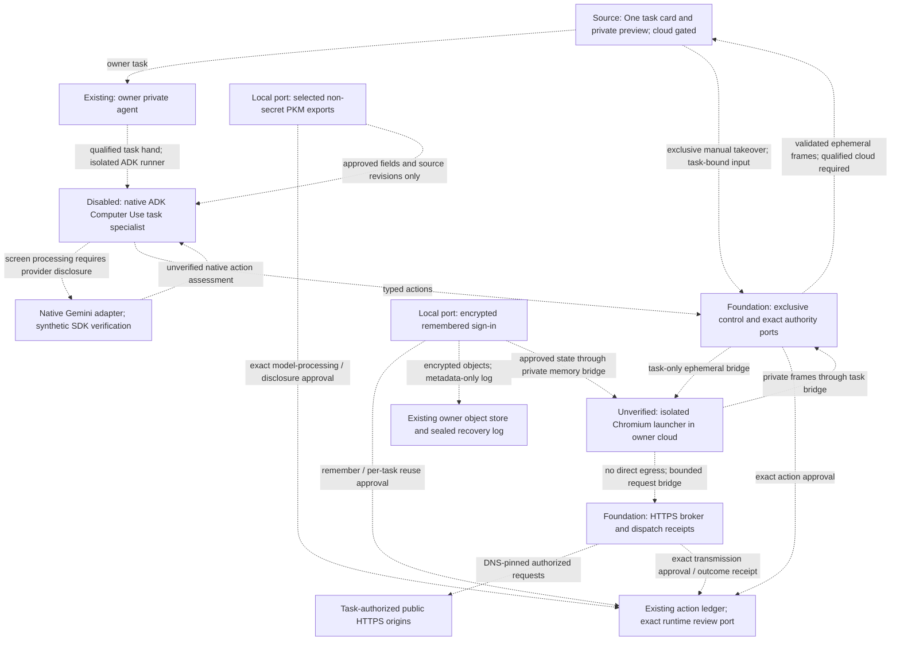

# Private browser runtime

## Status and evidence

**2026-10-06 — disabled pilot; not a usable owner browser capability.**
The committed information/session foundation is `f407f849b`. The resumed working
candidate composes authenticated owner task routes, exact reviews, ephemeral
preview, takeover and remembered-session controls with an isolated native ADK
runner. One exposes only a metadata-returning task hand from a qualified runtime;
its transcript never receives screenshots, selected values or website sessions.
Neither cloud has a qualified launcher/bridge, so default startup provides no
browser runtime. No owner pod or serving image changed in this implementation slice.

The [agent-development procedure](./agent-development.md) owns registration;
the [readiness memo](../../../docs/reference/quality/adk-orchestration-docs-audit.md)
owns acceptance. Source checks are not cloud isolation or deployment evidence.

## Visual Map

Target topology; all dashed paths remain gated and unavailable.



## Implemented foundation

| Owner | Current contract |
| --- | --- |
| `hushh_mcp/agents/computer_use/agent.yaml` | Manifest-owned task instructions; development only, discovery withheld, rollout off. Invocation, observation and control are distinct declarations, not issued grants. |
| `one_adk/computer_use_agent.py` | Requires the gate, exact native Gemini transport and task-bound processing terms. ADK observations pause during owner control; only approved-origin frames and origin-only URLs reach the model. No function-only fallback. |
| `services/pod_browser/control.py` | Owner/incarnation/expiry checks, sequence fencing, exclusive takeover and explicit handback, dispatch-before-execution, uncertain-outcome stop. Sixty agent calls or fifteen active minutes require continuation; unattended observation cannot extend the ten-minute idle grace. |
| `services/pod_browser/network.py` | Exact-origin HTTPS policy, public DNS/IP enforcement through the existing transport, bounded request/response sizes, no ambient proxy or automatic retry. Redirects and subresources need their own admission. Transmission commitments cover destination, method, headers and body. |
| `services/pod_browser/mailbox_executor.py` | Task-bound strict envelopes and an out-of-band termination port. Host-side receipt checks reject unresolved network effects even if the sandbox returns a valid screenshot. |
| `services/pod_browser/playwright_executor.py` | One page, Chromium sandbox enabled, service workers/WebSockets blocked, downloads disabled. Chromium Fetch interception brokers each redirect hop and preserves response-header multiplicity. Frames/workers/objects are restricted; multi-target authentication is unqualified. No direct or unsandboxed fallback. |
| `services/pod_browser/worker_identity.py` | Before worker IPC or Chromium, require the fixed non-root identity, zero permitted/effective/ambient capabilities and `no_new_privs`. Refuse unavailable privilege dropping; never run the browser as root. |
| `browser_runtime/Dockerfile` | Browser-only probe definition, pinned Playwright, explicit source copies and fixed UID/GID. No core pod, recovery, provider SDK or credentials. The earlier probe image was built; the revised identity guard is not image-qualified. |
| `services/pod_browser/information.py`, `consent.py` | Typed selected-field exports and exact private commitments over the existing ledger. Export revision, PKM content revision and PKM manifest revision are distinct. Authenticated runtime routes require injected authoritative export/review ports; cloud startup remains gated. |
| `services/pod_browser/session_state.py`, `sessions.py` | Bounded encrypted persistent sign-in objects, current-admission reuse, metadata-only recovery, CAS publication and generation-fenced Forget. Owner-only retention routes and controls remain cloud gated. |
| `services/pod_browser/scratch.py`, `mailbox.py` | Require Linux tmpfs on the actual open descriptor, private task scratch, and command/network cleanup on close. macOS fixtures do not qualify native cloud scratch. |

The broker's authority ports must be backed by the **existing** approval/action
ledger. Synthetic test adapters are not runtime authority. A typed `completed`
model result is not a verified submission receipt. Pending/uncertain effects
must survive recovery and prohibit replay.

## Information and sign-in boundary

One's manifest instructs the specialist to select the task's non-secret fields.
`ScopedProjectionReader` requires a current V2 scoped export from the existing
grant owner: exact owner/task/incarnation, recipient, scope, export revision,
source content/manifest revisions, expiry and revocation. The pilot accepts
bounded scalar projections only; Secrets, runtime credentials, wallet and identity
domains are refused. Neither a replica nor conversational memory authorizes reads.
The production loader must perform these checks against its authoritative sources.

Model processing and website disclosure are independent exact reviews. Private
values stay in pod/browser memory; the action ledger stores keyed commitments.
Processing binds the provider/transport and screen origins. Disclosure additionally
binds the destination, source revisions, action sequence/control epoch and request
commitment. Changed terms need renewed approval, including autosaving input.
No pod principal can confirm a review. Cached task approvals recheck current
admission and their consumed ledger receipt; website disclosure is single use.

Manual takeover suppresses model screenshots, URLs, page text, tools and errors.
Only explicit handback and a fresh observation allow processing again. Model URLs
contain the origin only, excluding callback codes. Runtime routes must use the
owner-only session control port, never expose state through ADK tools, and drain
browser tasks through the existing update permit before replacing an image.

Remembering requires opt-in for the selected origins/account. The initial adapter
retains persistent cookies and local storage, preserving cookie scope/security and
website expiry. Session-only cookies remain live and end with the browser. There
is no product expiry extension or keepalive. IndexedDB, passkeys, profiles, caches,
popups, iframe/worker authentication and arbitrary SSO recipients are unsupported.
Each additional SSO origin needs admission and processing consent. Restored state
is stored sign-in information; website rejection still requires owner login.

Serialized state is limited to **1 MiB**, then AES-GCM sealed with a browser-purpose
key derived from existing owner custody. Bounded cloud reads reject excess bytes
before materializing the body. Oversized retention fails without stopping the
current browser task. No session values enter model context, hub storage, telemetry
or the sealed log; that log holds opaque intents, object references and lifecycle
metadata. Publication uses the observed log sequence. Lost publication responses
retain inventoried ciphertext until quiescent cleanup can establish its status.

Forget immediately blocks reuse and closes affected live contexts, then records
a generation tombstone and requests deletion of every inventoried object, including
failed saves. Pending saves/restores cannot supersede it. The receipt distinguishes
live fencing, durable persistence and deletion requests. Physical removal remains
subject to cloud retention; Forget does not remotely log out a website. Erasure
inventory includes these objects and requires drained/fenced writers.

Same-custody restart can rebuild metadata and restore current encrypted objects
with fresh admission and per-task site/account reuse approval. Record-only
cross-custody migration and standby synchronization **refuse browser-session
history on both send and receive**, including forgotten history, until encrypted
object/key transfer is qualified. This blocks those operations; it does not claim
update/recovery parity. Update drain, object continuity, and orphan cleanup still
need runtime integration and immutable-image acceptance.

## Local verification

The nearest browser/ledger/erasure suites exercise exact processing/disclosure,
revocation, owner/incarnation mismatch, login observation suppression, approved
screen origins, altered ciphertext, bounded state, Forget races and restart
metadata. A separate synthetic Chromium fixture verifies redirect interception,
multiple `Set-Cookie` headers, official expiry, local-storage restoration and
unapproved recipients without owner credentials or real network responses. It
also proves that an admitted secondary origin cannot load an embedded frame under
the pilot's conjunctive CSP:

```bash
cd consent-protocol
# Optional local tool: pinned Playwright 1.63.0 and its Chromium must be installed.
.venv/bin/python scripts/ops/browser_privacy_fixture.py
```

The fixture uses the browser image's namespace packages and does not hydrate the
core pod's environment. Its pinned SDK can also run in an isolated local tool
environment; it is not a dependency installed on the private agent.

The original fixture failed because Playwright route interception missed redirect
hops; Chromium Fetch interception corrected it. These results qualify the local
adapter only. They do not prove native sandbox isolation, owner-cloud storage/IAM,
real login/SSO compatibility, provider retention or live update acceptance.

## Isolation gate

### GCP

The native Cloud Run sandbox can read the launcher's filesystem. Install the
browser-only launcher in a separate container with no private mounts, secrets,
provider credentials or recovery material. Never enable sandbox direct egress.
The candidate task-only mailbox must be memory-backed, excluded from snapshots
and artifacts, and erased on every terminal path before private use.

`gcp_probe.py` is a controlled native probe, not a service deployment recipe.
It checks a synthetic bind-mount round trip, Chromium startup/frame capture,
and denied host-loopback, metadata and direct-public sockets. Timeouts do not
count as network-denial evidence. It does not prove broker browsing, private
sessions, live preview, teardown, provider transport or component provenance.

Local invocation:

```bash
cd consent-protocol
.venv/bin/python -m hushh_mcp.services.pod_browser.gcp_probe
```

Outside a native Cloud Run sandbox launcher this returns
`GCP_NATIVE_SANDBOX_REQUIRED`, exit 2. That is an unavailable result, not a pass.
The existing operator identity ran an isolated synthetic job under a temporary
identity without project roles. No owner pod was changed. Build
`053c57b0-5325-4ee9-bd0f-c9eebd454121` succeeded for the earlier seven-file digest
`sha256:f88b082d4c438e647a5fc751af7bc836f865e11fd16880efb898f5a0de1a43ed`.
The seven-file source commitment is
`18bbea69af3354e941e6aa853d0eb4a67ac2194592023718aa84e871e729fc24`.

**First gate failed; Computer Use remains unavailable.** These executions used
that immutable image; diagnostic process success is not browser acceptance:

| Execution | Actual outcome |
| --- | --- |
| `browser-probe-20261006-4d7b-cfls5` | Original `/bridge` destination failed before execution: `FetchSpec failed: loading container: file does not exist`. |
| `browser-probe-20261006-4d7b-pw5kc` | Native `/bin/echo` control passed in 164 ms. This is sandbox invocation, not browser startup latency. |
| `browser-probe-20261006-4d7b-nm2lm` | Write and environment flags passed; every nonexistent `/bridge` mount failed. |
| `browser-probe-20261006-4d7b-zdncq` | Existing/same-path mount invocation passed. Chromium refused root with sandboxing enabled; no frame was produced. |
| `browser-probe-20261006-4d7b-9rlhw` | Clearing supplementary groups refused with `EPERM`. |
| `browser-probe-20261006-4d7b-tv4gn` | Native real/effective/saved UID/GID were all 0, supplementary groups empty; fixed UID/GID change still refused with `EPERM`. Launcher help exposes no user-selection flag. |

Source corrects the mount path and explicitly checks the worker identity before
IPC/browser initialization. This is a fail-closed guard, not proof of a working
privilege drop on this substrate. The observed root identity differs from the
provider's documented non-root behavior. A supported native identity mechanism
and Chromium namespace compatibility need provider-backed evidence before the
probe can progress. Direct-egress denial, mailbox round trip, frame/preview,
resource peaks and teardown remain unverified. No sandbox was exported or saved.
After retaining the synthetic receipts, the task-owned job, temporary identity,
probe image/tag and source archive were removed. Existing owner resources,
release channels and application traffic were unchanged.

### Azure

The earlier Early Access blocker is stale: Azure Sandboxes reached general
availability in September 2026. Fresh read-only stable `2026-07-01` and preview
SandboxGroups requests succeed; the subscription has no groups. The legacy
`SandboxPreview=NotRegistered` flag does not prove current unavailability.

The 2026-10-06 bounded probe created a native group, qualified data-plane read
access and created a synthetic sandbox. Exact egress-policy readback was refused
before execution; sandbox and group deletion were confirmed. Sandboxed Chromium,
deny-by-default egress with **Full** inspection, a private task-only broker bridge
and browser lifecycle remain unqualified. No alternate executor or unsandboxed
fallback is permitted. A synthetic probe cannot authorize real owner information
or remembered logins.

Native cloud contracts: [GCP sandbox execution](https://docs.cloud.google.com/run/docs/code-execution),
[GCP resource allocation](https://docs.cloud.google.com/run/docs/configuring/services/sandboxes),
[Azure SandboxGroups](https://learn.microsoft.com/en-us/azure/container-apps/sandboxes-overview),
[Azure network controls](https://learn.microsoft.com/en-us/azure/container-apps/sandboxes-egress-policies).

## Remaining release gates

1. Prove each cloud's isolation, ephemeral bridge, immutable image, bounded
   teardown and resource use. Readiness is trusted-side evidence; it must never
   be supplied by a browser, model or client-selected cloud.
2. Qualify the composed signed admission, browser permissions, exact reviews,
   update draining, recovery and cancellation against the installed cloud image.
   Native Gemini screenshots must remain ephemeral: do not widen the sealed
   session record budget or persist screens in One transcripts or hub storage.
3. Expose the composed task hand only after the native model and cloud capability
   pass. Source includes task status/preview/control routes, the responsive One
   task card, takeover and observation suppression; these still need installed
   cloud acceptance. Handback requires a fresh observation. Frames are separate
   from model calls and preview leases must expire.
4. Qualify the composed encrypted session/information ports and grant loader
   against cloud account erasure, orphan cleanup and update continuity. Bounded
   background and budget continuation and scoped Files transfer need installed
   evidence. Local cookie/redirect fixtures pass; real owner preview,
   authentication and cloud recovery remain unverified. No customer login or
   retention is enabled.
5. Prove controlled research, preparation and reviewed submission, uncertain
   outcomes, revocation/recovery, malicious pages, cross-owner refusal, update
   draining and idle wake. Measure cold/warm latency, 429 outcomes, memory,
   preview bandwidth and actual cost components separately on both clouds.

One active task/page per owner remains the pilot target. GCP 2 vCPU / 3 GiB
combined and Azure 1 vCPU / 2 GiB browser budgets require an owner-visible offer;
they are unmeasured probe allocations, not minimums or changes to existing pods.
The controlled-fixture p95 input-to-frame target is 250 ms, not a result.
Warnings do not shut down service. No main/UAT/production or stable release is
authorized by this implementation record.
