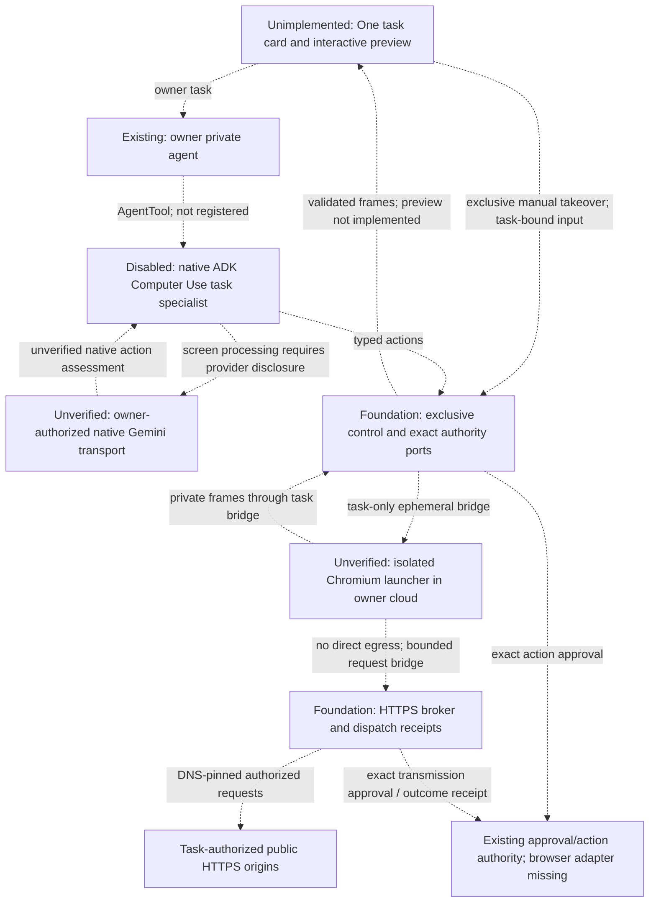

# Private browser runtime

## Status and evidence

**2026-10-06 — disabled foundation; not a usable browser capability.**
Inspected infrastructure base: `1d8b74998141db83b0dbe5d4c87fc6fd61601719`.
The accompanying changes add an experimental manifest, native ADK adapter,
typed execution/control boundary, restricted HTTPS broker and sandbox-only
Chromium runner. They do not register a One child, issue browser scopes, expose
routes, provision owner resources or provide an owner preview. Isolated synthetic
probe resources were created only to test the first gate.

The [agent-development procedure](./agent-development.md) owns registration;
the [readiness memo](../../../docs/reference/quality/adk-orchestration-docs-audit.md)
owns acceptance. Source checks are not cloud isolation or deployment evidence.

## Visual Map

Target topology; all dashed paths remain gated and unavailable.



## Implemented foundation

| Owner | Current contract |
| --- | --- |
| `hushh_mcp/agents/computer_use/agent.yaml` | Manifest-owned task instructions; development only, discovery withheld, rollout off. Invocation, observation and control are distinct declarations, not issued grants. |
| `one_adk/computer_use_agent.py` | Requires the explicit gate and exact native Gemini model/transport readiness. Uses pinned ADK `BaseComputer` / `ComputerUseToolset`; no function-only provider fallback. |
| `services/pod_browser/control.py` | Owner/incarnation/expiry checks, sequence fencing, exclusive takeover and explicit handback, dispatch-before-execution, uncertain-outcome stop. Sixty agent calls or fifteen active minutes require continuation; unattended observation cannot extend the ten-minute idle grace. |
| `services/pod_browser/network.py` | Exact-origin HTTPS policy, public DNS/IP enforcement through the existing transport, bounded request/response sizes, no ambient proxy or automatic retry. Redirects and subresources need their own admission. Transmission commitments cover destination, method, headers and body. |
| `services/pod_browser/mailbox_executor.py` | Task-bound strict envelopes and an out-of-band termination port. Host-side receipt checks reject unresolved network effects even if the sandbox returns a valid screenshot. |
| `services/pod_browser/playwright_executor.py` | One fixed viewport/page, Chromium sandbox enabled, service workers and WebSockets blocked, downloads disabled. Routed requests must use the broker; there is no direct or unsandboxed fallback. |
| `services/pod_browser/worker_identity.py` | Before worker IPC or Chromium, require the fixed non-root identity, zero permitted/effective/ambient capabilities and `no_new_privs`. Refuse unavailable privilege dropping; never run the browser as root. |
| `browser_runtime/Dockerfile` | Browser-only probe definition, pinned Playwright, explicit source copies and fixed UID/GID. No core pod, recovery, provider SDK or credentials. The earlier probe image was built; the revised identity guard is not image-qualified. |

The broker's authority ports must be backed by the **existing** approval/action
ledger. Synthetic test adapters are not runtime authority. A typed `completed`
model result is not a verified submission receipt. Pending/uncertain effects
must survive recovery and prohibit replay.

## Isolation gate

### GCP

The native Cloud Run sandbox can read the launcher's filesystem. Install the
browser-only launcher in a separate container with no private mounts, secrets,
provider credentials or recovery material. Never enable sandbox direct egress.
The candidate task-only mailbox must be memory-backed, excluded from snapshots
and artifacts, and erased on every terminal path before private use.

`gcp_probe.py` is a controlled native probe, not a service deployment recipe.
It checks a synthetic bind-mount round trip, Chromium startup/frame capture,
and denied host-loopback, metadata and direct-public sockets. Timeouts do not
count as network-denial evidence. It does not prove broker browsing, private
sessions, live preview, teardown, provider transport or component provenance.

Local invocation:

```bash
cd consent-protocol
.venv/bin/python -m hushh_mcp.services.pod_browser.gcp_probe
```

Outside a native Cloud Run sandbox launcher this returns
`GCP_NATIVE_SANDBOX_REQUIRED`, exit 2. That is an unavailable result, not a pass.
The existing operator identity ran an isolated synthetic job under a temporary
identity without project roles. No owner pod was changed. Build
`053c57b0-5325-4ee9-bd0f-c9eebd454121` succeeded for the earlier seven-file digest
`sha256:f88b082d4c438e647a5fc751af7bc836f865e11fd16880efb898f5a0de1a43ed`.
The seven-file source commitment is
`18bbea69af3354e941e6aa853d0eb4a67ac2194592023718aa84e871e729fc24`.

**First gate failed; Computer Use remains unavailable.** These executions used
that immutable image; diagnostic process success is not browser acceptance:

| Execution | Actual outcome |
| --- | --- |
| `browser-probe-20261006-4d7b-cfls5` | Original `/bridge` destination failed before execution: `FetchSpec failed: loading container: file does not exist`. |
| `browser-probe-20261006-4d7b-pw5kc` | Native `/bin/echo` control passed in 164 ms. This is sandbox invocation, not browser startup latency. |
| `browser-probe-20261006-4d7b-nm2lm` | Write and environment flags passed; every nonexistent `/bridge` mount failed. |
| `browser-probe-20261006-4d7b-zdncq` | Existing/same-path mount invocation passed. Chromium refused root with sandboxing enabled; no frame was produced. |
| `browser-probe-20261006-4d7b-9rlhw` | Clearing supplementary groups refused with `EPERM`. |
| `browser-probe-20261006-4d7b-tv4gn` | Native real/effective/saved UID/GID were all 0, supplementary groups empty; fixed UID/GID change still refused with `EPERM`. Launcher help exposes no user-selection flag. |

Source corrects the mount path and explicitly checks the worker identity before
IPC/browser initialization. This is a fail-closed guard, not proof of a working
privilege drop on this substrate. The observed root identity differs from the
provider's documented non-root behavior. A supported native identity mechanism
and Chromium namespace compatibility need provider-backed evidence before the
probe can progress. Direct-egress denial, mailbox round trip, frame/preview,
resource peaks and teardown remain unverified. No sandbox was exported or saved.
After retaining the synthetic receipts, the task-owned job, temporary identity,
probe image/tag and source archive were removed. Existing owner resources,
release channels and application traffic were unchanged.

### Azure

The current subscription reports `Microsoft.App/SandboxPreview` as
`NotRegistered`. API metadata alone does not establish Early Access enrollment.
No SandboxGroup adapter or resource exists in this change. Enrollment,
owner-scoped launch/termination, deny-by-default egress with Full inspection,
and the restricted broker transport each require independent proof.

Native cloud contracts: [GCP sandbox execution](https://docs.cloud.google.com/run/docs/code-execution),
[GCP resource allocation](https://docs.cloud.google.com/run/docs/configuring/services/sandboxes),
[Azure SandboxGroups](https://github.com/microsoft/azure-container-apps/blob/main/docs/early/sandboxes-overview.md),
[Azure network controls](https://github.com/microsoft/azure-container-apps/blob/main/docs/early/sandboxes-egress-policies.md).

## Remaining release gates

1. Prove each cloud's isolation, ephemeral bridge, immutable image, bounded
   teardown and resource use. Readiness is trusted-side evidence; it must never
   be supplied by a browser, model or client-selected cloud.
2. Bind signed admission, dedicated permissions and exact browser approvals to
   existing authorities. Integrate update permits, recovery and cancellation.
   Native Gemini screenshots must remain ephemeral: do not widen the sealed
   session record budget or persist screens in One transcripts or hub storage.
3. Register the child only after the native model and cloud capability pass.
   Add task status/preview/control through existing pod routes, a responsive
   One task card and explicit takeover. Pause model observation during login;
   explicit handback requires a fresh observation. Render frames separately
   from model calls and enforce preview lease expiry.
4. Implement opt-in encrypted site retention, forgetting/expiry, bounded
   background continuation, explicit budget continuation and scoped Files
   transfer. No credential entry, remembered session or download is supported
   by the foundation. Cookies and redirect behavior require real-browser tests.
5. Prove controlled research, preparation and reviewed submission, uncertain
   outcomes, revocation/recovery, malicious pages, cross-owner refusal, update
   draining and idle wake. Measure cold/warm latency, 429 outcomes, memory,
   preview bandwidth and actual cost components separately on both clouds.

One active task/page per owner remains the pilot target. GCP 2 vCPU / 3 GiB
combined and Azure 1 vCPU / 2 GiB browser budgets require an owner-visible offer;
they are unmeasured probe allocations, not minimums or changes to existing pods.
The controlled-fixture p95 input-to-frame target is 250 ms, not a result.
Warnings do not shut down service. No main/UAT/production or stable release is
authorized by this implementation record.
