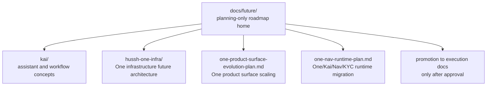

# Hussh Future Roadmap

> Planning-only home for future-state concepts, R&D assessment, and promotion criteria.

## Visual Map

## Purpose

Use `docs/future/` for:

- future-state architecture concepts
- R&D risk assessments
- architecture options and dependency maps
- promotion criteria before execution starts

Do not use this home for:

- durable product thesis
- current implementation contracts
- package-local technical references

## Boundary Model

| Layer | Purpose | Home |
| --- | --- | --- |
| Vision | durable north stars and product thesis | `docs/vision/` |
| Future roadmap | planning-only future-state concepts and R&D assessment | `docs/future/` |
| Execution | active implementation contracts and package docs | `docs/reference/`, `consent-protocol/docs/`, `hushh-webapp/docs/` |

## Promotion Rule

A document may move out of `docs/future/` only when:

1. the concept is approved for execution
2. the execution owner is known
3. the implementation surfaces are known
4. the content can be split into execution-owned docs instead of remaining a speculative concept note

Promotion targets:

- cross-cutting execution contracts -> `docs/reference/...`
- backend execution docs -> `consent-protocol/docs/...`
- frontend/product execution docs -> `hushh-webapp/docs/...`

## Current Domains

- [kai/README.md](./kai/README.md): Kai future-state concepts and superseded planning history that has not yet moved
- [hussh-one-infra/README.md](./hussh-one-infra/README.md): planning-only One infrastructure architecture for Founder Wiki validation, Salesforce/MuleSoft partner boundaries, private compute, BYOA, and code-persona alignment
- [one-product-surface-evolution-plan.md](./one-product-surface-evolution-plan.md): planning-only product-surface evolution path for One, Kai, Nav, KYC, PCHP, PKM, OpenClaw/LLM Wiki-style projections, signature, brokerage, and brand-side access
- [one-nav-runtime-plan.md](./one-nav-runtime-plan.md): planning-only migration path from the current One Voice/Kai compatibility runtime to the One/Kai/Nav/KYC ontology
- [pkm-slice-marketplace-plan.md](./pkm-slice-marketplace-plan.md): planning-only phased plan for a PKM data-slice subscription marketplace under One (backend-led, user-set price per slice, reuses default_available/consent/export)
- [information-marketplace-agent-plan.md](./information-marketplace-agent-plan.md): Information Marketplace conversational agent — what's built on `feat/personal-information-agent` plus the product-grade forward path (persist requests end-to-end, approve/deny over One A2A, inline publish-for-offers nudge)
- [email-agent-nudges-plan.md](./email-agent-nudges-plan.md): planning-only email nudge model for One
- [one-location-consent-center-integration-plan.md](./one-location-consent-center-integration-plan.md): planning-only path for folding One Location grants into the consent center
- [one-mac-knowledge-base-app.md](./one-mac-knowledge-base-app.md): planning-only Mac on-device knowledge-base concept
- [one-meta-glasses-ambient-agent-plan.md](./one-meta-glasses-ambient-agent-plan.md): planning-only ambient wearable agent concept
- [one-meta-glasses-dat-execution-plan.md](./one-meta-glasses-dat-execution-plan.md): planning-only DAT execution path for the wearable concept
- [one-docusign-fund-setup-plan.md](./one-docusign-fund-setup-plan.md): planning-only vendor-neutral agreement execution and fund-setup workflow under One, with Nav/Connections authorization, trusted action confirmation, and MuleSoft/DocuSign provider options

## References

- [../vision/README.md](../vision/README.md): durable Hussh north stars
- [../reference/operations/documentation-architecture-map.md](../reference/operations/documentation-architecture-map.md): canonical docs-home map
- [../reference/operations/docs-governance.md](../reference/operations/docs-governance.md): docs placement and promotion rules
