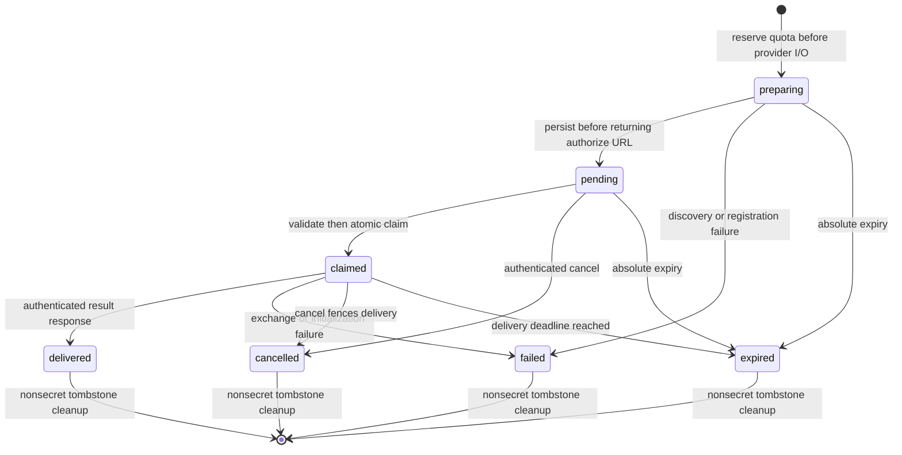

# Custom MCP OAuth shared attempt storage design

Status: design proposal, 2026-10-07. Implementation, key provisioning, migration application, and deployment are not complete. This describes a future contract; current custom OAuth remains process-local.

## Outcome and scope

Allow a custom connector authorization begun on one worker to complete on another worker or after a restart, provided the provider token exchange has not started. Preserve owner authorization, public endpoint admission, SDK OAuth behavior, and browser-vault ownership of final credentials.

Backend owns the attempt-store port, Postgres adapter, and SDK continuation adapter. Security review owns temporary secret custody and key policy. Frontend owns callback correlation, authenticated delivery, and vault persistence. Repository operations owns additive migration and release evidence.

Exclude durable custom connector credentials, background refresh, provider-specific dispatch, model access to OAuth material, and automatic replay after an ambiguous exchange. A browser refresh or lost completion response after exchange may still require reconnecting.

## Current evidence and blocker

- [Custom connection and registry](../../consent-protocol/hushh_mcp/one_adk/mcp_oauth_connection.py) hold a task, callback future, and live SDK flow. Attempts expire after 300 seconds and are bounded to 128 per worker and two per owner.
- [Custom SDK admission and ephemeral storage](../../consent-protocol/hushh_mcp/one_adk/mcp_oauth_storage.py) enforce state, issuer, endpoint admission, registered-client binding, setup-only MCP operations, and request-secret cleanup.
- [Custom routes](../../consent-protocol/api/routes/external_connectors.py) require vault-owner authorization and return credentials directly to the authenticated browser with no-store responses.
- [Curated lifecycle persistence](../../consent-protocol/hushh_mcp/services/external_connector_lifecycle_store.py) already implements transactional claim and retention patterns. Its catalog connector foreign key cannot represent browser-owned custom connector IDs. Reuse persistence ownership and patterns, not the curated row schema.
- [Existing connector encryption](../../consent-protocol/hushh_mcp/services/external_connector_credentials_service.py) is deployment-decryptable. Reusing its credential key for custom secrets would expand that key's authority.
- The pinned [MCP Python SDK 1.28.1 source](https://raw.githubusercontent.com/modelcontextprotocol/python-sdk/v1.28.1/src/mcp/client/auth/oauth2.py) generates state and PKCE verifier as local variables in `_perform_authorization_code_grant`. `TokenStorage` and `OAuthContext` do not export the suspended grant. Replacing the registry dictionary with Postgres is insufficient.

The required seam is an explicit, typed grant preparation/resume adapter. SDK 1.28.1 has no public continuation export API. A narrowly version-pinned adapter must reuse SDK PKCE generation, token exchange, and token response parsing, with parity tests and a dependency-upgrade tripwire. Do not serialize tasks, futures, generators, transports, or MCP session IDs; do not globally monkeypatch PKCE generation.

Current correctness issue to address during implementation: registry completion removes the attempt before callback state/issuer validation. A bad callback from the matching owner can consume the attempt. The new claim contract must validate callback authority before consuming it.

## Storage and cryptographic contract

Use a separate temporary Postgres table, provisionally `custom_mcp_oauth_attempts`, behind an async attempt-store port. Follow existing backend DB offload patterns; synchronous DB clients must not block the event loop.

| Concern | Proposed contract |
| --- | --- |
| Data class | Temporary authentication secrets and minimal owner correlation metadata |
| Plaintext columns | Random attempt ID, owner ID, connector ID, reviewed revision, snapshot version, encryption version, creation/expiry timestamps, status and claim ID |
| Ciphertext | Admitted resource/OAuth metadata and origins; endpoint and redirect URI; exact issuer and callback issuer requirement; SDK grant state and PKCE verifier; registered client information including any secret; chosen scope/resource/protocol context required for exchange |
| Encryption | AES-256-GCM with random 12-byte nonce, canonical versioned encoding, and AAD binding schema version, attempt ID, owner, connector, revision, and absolute expiry |
| Key | Dedicated environment-isolated, versioned attempt key; workers share it through deployment secret provisioning. Exactly 32 decoded bytes; missing/unknown key fails closed |
| Access | Authenticated owner plus exact connector/revision binding; backend runtime role only; no model, public query, or analytics access |
| Primary access | Point lookup/claim by attempt ID and owner; indexed expiry cleanup and owner deletion |
| Bounds | 300-second absolute lifetime, maximum two preparing/pending/claimed attempts per owner, initial 128 live attempts and 1,024 total retained rows per deployment, proposed 128 KiB encrypted snapshot ceiling |
| Growth | Live rows capped by admission transaction; nonsecret terminal tombstones retained at most 24 hours; the 1,024-row hard admission ceiling bounds churn as well as concurrent attempts |
| Deletion | Scrub ciphertext on claim after obtaining the in-memory snapshot, cancellation, expiry, or terminal failure; hard-delete expired tombstones in bounded cleanup batches; owner deletion purges all rows |

The snapshot ceiling is a proposal to validate against admitted SDK metadata and registrations, not a claim that current storage accepts that size. Reject oversized snapshots before returning an authorization URL. Store only an explicit allowlist of continuation fields, never an arbitrary SDK object or complete HTTP response.

Reserve a short-lived preparing row before metadata discovery or dynamic registration. Use a transactionally locked quota record/admission seam to enforce per-owner and deployment limits across workers; a count followed by an unlocked insert is unsafe. Count preparing, pending and claimed as live until terminal/expiry; enforce the separate total retained-row ceiling before reservation, including tombstones. Cleanup backlog at the hard ceiling must reject new begin requests safely. Reclaim expired active rows during admission, so correctness does not depend on a scheduled janitor. Cleanup should use bounded batches and `SKIP LOCKED`, following the existing retention owner.

Temporary state is operator-decryptable during its lifetime. This is an explicit change from process-local request secret custody, not browser-vault zero knowledge. Neither the vault key, vault-owner authorization token, nor runtime person key enters the table. Do not inherit `EXTERNAL_CONNECTOR_CREDENTIAL_KEY`; use separate purpose and access policy. Rotate by retaining old key versions only through outstanding attempt TTL plus bounded exchange time, then scrub unreadable leftovers and require reconnect.

## State machine and worker behavior

1. **Begin:** authenticate owner, atomically reserve preparing quota with an absolute deadline, admit custom endpoint and discovered metadata, validate optional registered client against exact advertised issuer and redirect URI, and prepare the SDK grant without waiting on an in-process callback. Encrypt and transition the reserved row to pending before returning the existing opaque handle and authorization URL. Failure to persist returns a safe setup error and no usable authorization URL.
2. **Complete validation:** authenticate owner, fetch the exact binding, decrypt and schema-validate the snapshot, check database time, constant-time state comparison, required callback issuer, connector and reviewed revision. Invalid owner/state/issuer/revision cannot consume another pending attempt. Do not log callback code or decrypted data.
3. **Claim:** atomically transition the still-pending row to claimed with a random claim ID. Recheck expiry, owner-deletion fence, and cancellation in the transaction. Compare the exact immutable snapshot identity validated outside the transaction (row version/digest, encryption version, schema version and authority binding); a changed row cannot be claimed using stale validation. Clear persisted snapshot ciphertext after the winning worker obtains its validated in-memory copy. Duplicate callbacks receive a safe conflict; claims are never released for automatic retry.
4. **Resume:** reapply current public endpoint/DNS admission to every OAuth/MCP request, reconstruct the minimum admitted SDK context, perform SDK token exchange/parsing, and initialize the MCP connection. Apply existing setup-only restrictions and response bounds. Never execute a product tool during setup.
5. **Delivery:** recheck owner lifecycle, cancellation, claim ID and absolute deadline immediately before committing the delivery state. Return credentials only through the authenticated no-store browser response; frontend must recheck its owner session, pending reference, connector revision and unlocked vault before storing. Clean up all in-memory request secrets in `finally` paths.
6. **Cancel/expire:** idempotently fence the attempt and scrub ciphertext. A worker with an in-flight exchange checks the fence before delivery and discards any late result. Provider requests already in flight cannot be undone; use revocation only where the admitted provider supports it. Cancellation linearizes against the delivery transition; it cannot retract an HTTP response already delivered.

Use database time for persisted deadlines and a bounded exchange timeout no later than that deadline. A worker restart between begin and callback is supported. A crash after claim, an ambiguous token POST, or a lost HTTP result requires a fresh authorization. Do not promise exactly-once provider side effects. Adding retryable encrypted result delivery would be a separate custody and acknowledgement protocol.

Custom connector revision is supplied by the authenticated owner browser; the server has no plaintext canonical copy of encrypted PKM configuration. Bind and compare it exactly, but do not describe it as independently server-attested. Browser delivery must reject results after local removal/edit or account switching.

Account deletion must use the existing lifecycle authority to serialize deletion with admission/claim/delivery. A new row foreign key alone is insufficient to prevent reinsertion after deletion. Declare the purge/write fence in the account lifecycle contract before enabling the store.

## API and service boundaries

Keep current begin/complete/cancel route shapes and no-store credential result. Attempt IDs remain opaque, random, owner-bound handles. Codes, state and issuer remain request-body inputs, never trusted merely because a handle exists. Expired, consumed and cancelled attempts return the existing safe reconnect/conflict behavior without provider diagnostics or secret-bearing URLs.

Proposed port operations: `reserve_preparing`, `publish_pending`, `read_for_validation`, `claim_validated`, `cancel`, `finish_delivery`, `purge_expired`, and `purge_owner`. Each mutating operation explicitly carries owner/binding and lifecycle fencing. Snapshot validation and endpoint policy stay in the custom OAuth service/adapter; the store owns atomicity, quotas, expiry and scrubbing. Keep routes thin.

Postgres is the first shared adapter. A future Redis/Memorystore adapter must preserve atomic claim/cancel, cross-worker quotas, authenticated encryption and owner deletion semantics; cache TTL alone does not replace these contracts. Do not add a cache dependency in the first slice.

## Implementation slices and acceptance

1. **SDK seam proof:** a synthetic provider demonstrates grant preparation, serialization, fresh-adapter resume, token parsing and initialization parity with pinned 1.28.1. Compare scope/resource, registration/issuer, redirect URI, PKCE S256, token authentication and error handling. Reject unsupported grant paths explicitly. Upgrade tripwire fails until parity is rerun.
2. **Persistence:** additive table/index migration with tested down path and release manifest; update runtime DB data-plane and account deletion contracts. Test against real Postgres with two independent service instances, restart before callback, claim/cancel/expiry races, quotas and janitor interruption. No SQLite/fake-only certification.
3. **Security negatives:** wrong owner, state, issuer, revision, corrupt ciphertext/AAD, unknown key/version, expired row, replay, DNS rebinding, unsafe redirect, oversized metadata and cancellation during exchange. Verify invalid callbacks preserve valid pending attempts and no secrets reach logs or audit payloads.
4. **Browser integration:** settings and chat callbacks, desktop and native return, locked vault, account switch, removed/changed configuration and lost response. Prove final credentials are written only into the intended owner's encrypted vault and temporary backend state is scrubbed.
5. **Release proof:** provision dedicated key and compatible schema before enabling; deploy two workers in UAT and exercise an authenticated exact custom connector flow across workers and across restart. Record serving revision, TTL cleanup, safe failure behavior, and rollback evidence. Local tests do not establish deployed resilience.

Estimate: three bounded implementation slices (SDK seam; shared store/lifecycle; browser and UAT proof). Schedule depends first on the SDK seam passing parity and availability of a real Postgres test environment, then dedicated key provisioning and authenticated UAT connector access.

## Rollout and rollback

Default the shared mode off until schema, key and SDK parity checks pass. During rollout use an explicit handle version or shared routing namespace so workers never guess which store owns an attempt. A shared-handle callback on an incompatible worker must fail safely; it must not fall back to the process-local registry.

Expand schema first, then deploy compatible readers/writers, then enable shared begin. Rollback disables new shared attempts while compatible completion readers drain at most the attempt TTL plus bounded exchange time; if rolling back readers too, require reconnect and scrub rows. Leave the additive table in place during code rollback. Apply its tested down migration only after readers have drained and temporary secrets are purged. No historical migration edits, runtime DDL, or durable credential backfill.
