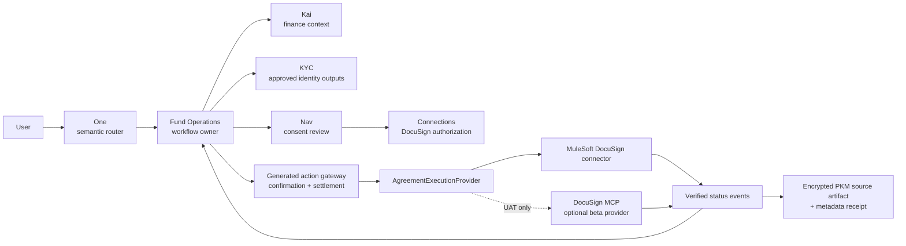

# One DocuSign and Fund Setup Workflow Plan

> Status: future roadmap, planning only. No DocuSign runtime, fund-signing
> action, or production connector is shipped by this document.

## Visual Map

## Current truth

- One is the only semantic router. It proposes actions but does not execute a
  model-originated action without the existing trusted confirmation and
  settlement contract.
- Nav owns consent. Connections, as Nav's child, is the right owner for
  DocuSign connection readiness, authorization status, and revocation.
- Hussh has no current DocuSign manifest, generated action, connector, webhook
  consumer, or signing workflow.
- The private-agent work on
  `claude/hushh-infrastructure-analysis-7o991c` is branch-only and feature
  flagged off. It proves a backend-neutral compute seam and a bounded GCP
  deployment loop, but official per-user A2A routing, remote revocation
  enforcement, sensitive-action step-up, live Anypoint provisioning, and
  concrete pod storage remain incomplete.
- Signature Vault is a north-star consent pattern, not a shipped e-signature
  service. DocuSign remains the signing system until a separately verified
  native signing capability exists.
- Fund setup is a legal and operational workflow. DocuSign can execute and
  evidence agreements, but it cannot establish entities, decide fund terms,
  perform KYC/AML, determine investor eligibility, or approve legal documents.

## Recommendation

Do not create a top-level "DocuSign Agent." Create a vendor-neutral agreement
execution capability beneath a stateful Fund Operations workflow.

- One understands the request and explains progress.
- Fund Operations owns the fund-setup state machine.
- KYC supplies only approved identity and eligibility workflow outputs.
- Kai supplies finance context only when the workflow requires it.
- Nav presents exact information and action consent.
- Connections owns DocuSign account connection and permission posture.
- An agreement adapter executes bounded DocuSign operations.
- DocuSign performs the signing ceremony and retains its system-of-record
  agreement evidence.

This preserves the product ontology if DocuSign is replaced or supplemented by
another agreement provider later.

## Why MuleSoft is the primary execution lane

The MuleSoft DocuSign Connector exposes the eSignature API v2.1 surface,
including envelopes, templates, recipients, tabs, views, documents, audit
events, updates, and related administration. It supports Authorization, JWT,
and OAuth Authorization Code connection providers.

The DocuSign MCP Server is useful as a blueprint and optional provider. Its
published beta catalog includes envelope, template, recipient, reminder,
Workflow Builder, and Agreement Manager tools. It currently requires
Confidential Authorization Code Grant access tokens and carries explicit beta
and human-confirmation cautions.

Therefore:

1. Use the MuleSoft connector or direct eSignature API as the initial
   deterministic production adapter.
2. Put it behind `AgreementExecutionProvider`, so the workflow is not coupled
   to MuleSoft.
3. Admit the DocuSign MCP provider only through the same capability catalog,
   schemas, confirmation policy, and settlement gateway.
4. Keep the beta MCP provider read-only or UAT-only until its live `tools/list`,
   authorization, latency, error, and mutation semantics pass rehearsal.
5. Never expose the provider's broad raw tool catalog directly to One.

The per-user private-agent pod may orchestrate this workflow later, but connector
credentials and webhook verification remain in the enterprise connector plane.
The pod receives only connection readiness, exact attenuated authority, bounded
inputs, and safe settlement results. It never receives DocuSign OAuth secrets or
a broad `pkm.read` grant.

## Fund setup lifecycle

### 1. Readiness

One starts a Fund Operations workflow and returns a specific readiness state:

- `legal_documents_required`
- `counsel_approval_required`
- `kyc_required`
- `docusign_connection_required`
- `recipient_information_required`
- `ready_to_prepare`

The workflow must fail closed when the approved legal documents or current
template versions do not exist. An LLM cannot invent fund terms or substitute
for counsel approval.

### 2. Information assembly

The workflow requests exact scopes for the fields required by the approved
template and recipient roles. It may use intelligence to propose field bindings
from sanitized descriptors, but deterministic code validates:

- every source is inside the approved scope
- every destination tab exists in the selected template revision
- required values are present
- no value is inferred or fabricated
- no broad PKM or raw KYC document is transferred

The consent screen identifies DocuSign as the external recipient and explains
that approved information and agreement documents will exist outside the Hussh
zero-knowledge boundary.

### 3. Draft preparation

The provider creates a draft envelope only. The workflow binds:

- workflow ID and revision
- approved template and document hashes
- DocuSign account and envelope ID
- recipients, roles, routing order, and authentication requirements
- exact field-binding revision
- consent receipt references

Draft creation and sending are separate actions.

### 4. Review and confirmation

One presents the exact documents, recipients, roles, routing order, and
material fields. The user reviews through a DocuSign sender or recipient view.

Sending requires:

- unchanged workflow and document revisions
- fresh trusted activation
- fresh step-up authentication for legally consequential actions
- one-time directive identity
- an idempotency key

Typed or spoken phrases alone are not confirmation. A materially changed draft
invalidates the prior confirmation.

### 5. Send and signing

After confirmation, the provider sends the envelope. DocuSign owns the
signature ceremony. Hussh does not inject a stored signature, simulate a click,
or claim that its confirmation is the legal signature.

### 6. Settlement and events

Use verified DocuSign Connect events when available, with guarded polling as a
recovery lane. Event processing must:

- authenticate the sender and verify the event signature
- reject replay and cross-tenant envelope references
- deduplicate by event identity
- enforce monotonic state transitions
- correlate every transition to the same user, workflow, envelope, and revision
- record metadata only in telemetry

Expected terminal states are `completed`, `declined`, `voided`, `expired`, and
`failed`.

### 7. Completed package

After completion, retrieve the final documents and certificate of completion.
Re-encrypt the package for the user's vault before persistent Hussh storage.
Store it as an encrypted PKM source artifact, while keeping only bounded
metadata in the workflow and audit planes.

## Vendor-neutral capability surface

Do not expose raw provider operations. Project them into stable capabilities:

| Capability | Behavior | Confirmation |
| --- | --- | --- |
| `agreements.connection.status` | Read connection and permission readiness | No |
| `agreements.templates.list` | List approved template metadata | No |
| `agreements.envelope.prepare_draft` | Create a draft bound to reviewed inputs | Yes |
| `agreements.envelope.review` | Open a bounded review view | No |
| `agreements.envelope.send` | Send the unchanged draft | Yes plus step-up |
| `agreements.envelope.status` | Read envelope and recipient status | No |
| `agreements.envelope.remind` | Send a reminder to pending recipients | Yes |
| `agreements.envelope.correct_recipients` | Change recipients or routing | Yes plus step-up |
| `agreements.envelope.void` | Void an in-flight envelope | Yes plus step-up |
| `agreements.envelope.retrieve_completed` | Retrieve the completed package | Yes for disclosure |

Every mutation uses the existing action directive, confirmation receipt, and
settlement contract. Chained mutations remain:

`proposal -> confirmation -> settlement -> refreshed workflow state -> new proposal`

## Reliability and security requirements

- Use tenant-bound OAuth or JWT configuration selected from the actual
  DocuSign account ownership model. Do not choose a grant type from convenience.
- Keep credentials in the connector trust domain, never in agent prompts,
  browser caches, PKM plaintext, or private-agent pods.
- Make draft and send idempotent by workflow, operation, and revision.
- Pin approved templates and documents by immutable revision and hash.
- Do not log documents, tab values, recipients, access tokens, or webhook
  bodies. The MuleSoft example logs full payloads; production must not copy that.
- Separate invocation, information, and action authority at every hop.
- A provider outage must leave the workflow in a recoverable state and must
  never cause an automatic replay after an observable side effect.
- Revocation blocks future reads and actions but does not pretend to erase a
  legally completed agreement from DocuSign.

## Delivery plan

1. **Contract rehearsal**
   - Use DocuSign demo and synthetic documents.
   - Capture actual Mule connector and DocuSign MCP schemas.
   - Verify OAuth, draft, review, send, status, completed-document retrieval,
     webhook/poll recovery, and error behavior.
2. **Provider seam**
   - Add `AgreementExecutionProvider` with an inert default.
   - Implement MuleSoft first.
   - Keep DocuSign MCP behind a separate UAT flag.
3. **Workflow and authority**
   - Add Fund Operations workflow state.
   - Add exact consent scopes and vendor-neutral capabilities.
   - Reuse the generated action gateway and durable settlement ledger.
4. **Connections and Nav**
   - Add DocuSign connection readiness and revoke UX under Connections.
   - Add Nav disclosure and action-consent review.
5. **End-to-end UAT**
   - Use approved synthetic templates and test recipients.
   - Rehearse duplicate events, stale confirmations, changed documents, wrong
     tenant, revocation, provider outage, decline, void, and completion.
6. **Legal production gate**
   - Require counsel-approved templates and workflow wording.
   - Require production DocuSign account configuration, retention policy,
     incident ownership, and rollback.
7. **Private-agent portability**
   - Move orchestration into a per-user private runtime only after official A2A
     routing, remote revocation enforcement, step-up, durable sessions, and
     connector settlement are proven.

## Promotion criteria

This plan may move into execution only when:

1. The owning Fund Operations workflow and product surface are approved.
2. Counsel-approved document and template ownership is explicit.
3. The DocuSign account ownership and OAuth/JWT model are decided.
4. Exact consent scopes and external-disclosure language are approved.
5. Send, void, reminder, and recipient-correction actions pass trusted
   confirmation and stale-revision tests.
6. Event verification, idempotency, and completed-package encryption pass UAT.
7. The provider abstraction proves that the workflow does not depend on raw
   MuleSoft or DocuSign MCP tool names.

## Sources

- [MuleSoft DocuSign Connector](https://docs.mulesoft.com/docusign-connector/latest/)
- [MuleSoft DocuSign Connector examples](https://docs.mulesoft.com/docusign-connector/latest/docusign-connector-examples)
- [MuleSoft DocuSign Connector reference](https://docs.mulesoft.com/docusign-connector/latest/docusign-connector-reference)
- [DocuSign MCP Server](https://developers.docusign.com/platform/mcp-server/)
- Internal Hussh agent hierarchy, consent, PKM, action-safety, and private-agent architecture references.
