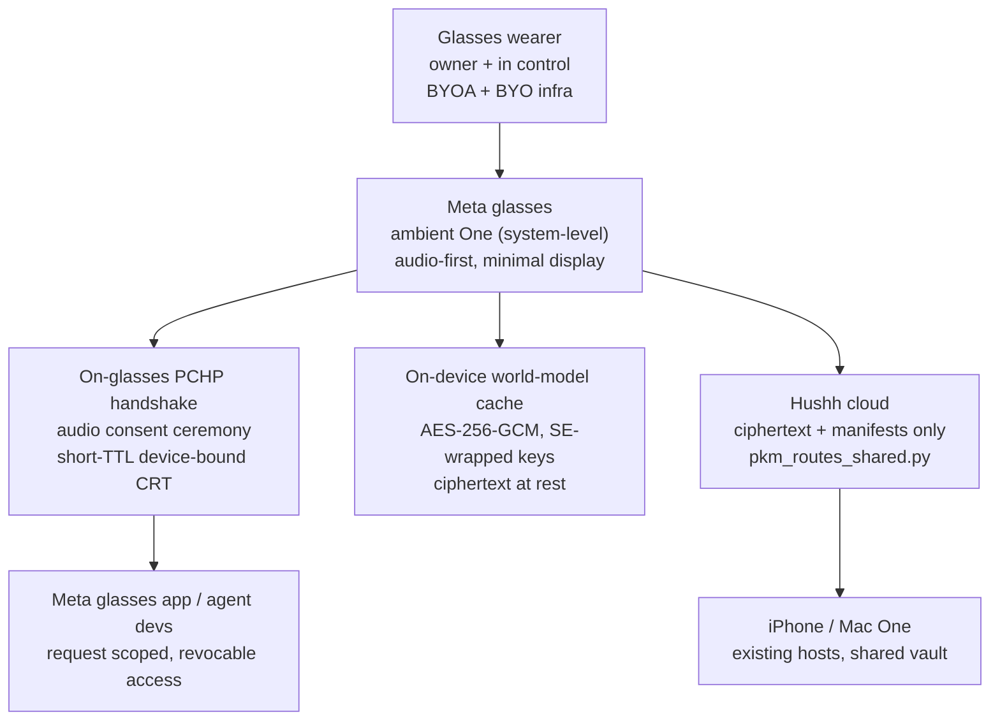

# One on Meta Glasses — Ambient Private Agent Plan

Status: **founder-approved — promoting to execution.** The founder has taken this up as real work, so it is no longer a speculative note: the in-our-control work streams are being promoted to tracked execution now, while the platform-level dependencies (Meta SDK entitlement, partnership/distribution) remain external blockers named below. This doc is the durable rationale + edge analysis the execution work references; it is not a current-state implementation contract, and no Meta Wearables / glasses SDK integration exists in this repo today. Classification: **founder-approved execution** (promoting out of `docs/future/` as owners land the work). Founder approval satisfies promotion criterion 1; criteria 2–5 below still gate the platform-dependent pieces.

## Framing

> **Hussh = `[hu]man [s]ecure [s]ocket [h]ost`.**
>
> One for macOS is the planned *host* on the Mac; the iPhone One is the host in your pocket. Meta glasses are proposed as a third host surface: the one you *wear*. One runs **ambiently in the background** as a private, system-level agent for the person wearing the glasses — available whenever they need it, silent when they do not — with the human always the owner and in control, and every read of their data completing a [PCHP](../../consent-protocol/docs/reference/consent-protocol.md) handshake.

The ask has two halves, and they must not be conflated:

1. **The owner's agent, on the glasses.** One works *for the wearer*, on-device, on their behalf — a private life-general-contractor that listens, remembers, decides, and acts, under the wearer's consent.
2. **A developer ecosystem.** Meta glasses agent and application developers can build against One's consent surface out of the box, so any third-party glasses app can *request* scoped, revocable access to the wearer's world model through PCHP instead of harvesting it.

Both halves sit on the same non-negotiable: the wearer owns their data; nothing leaves the wearer's control without a consent receipt.

## Visual Map

## Classification and scope

- **This is future roadmap, not vision.** The durable thesis (human-owned data, consent-first, BYOA, on-device) already lives in `docs/vision/`; this doc does not restate or change it. It assesses one *surface* for that thesis.
- **In scope:** the trust/architecture assessment, the reuse map, the missing primitives, and the promotion criteria.
- **Out of scope (deliberately):** any claim that a Meta partnership, SDK entitlement, or distribution channel exists; any commitment to a ship date; any execution-owned technical spec (those are written only after promotion).

## Current Overlap (what the repo already gives us)

The glasses host is a *port* of primitives that already exist, not a greenfield build:

- **The consent protocol itself.** [`consent-protocol/hushh_mcp/consent/token.py`](../../consent-protocol/hushh_mcp/consent/token.py) (the `HCT:` bearer format `user_id|agent_id|scope|issued_at|expires_at[|commercial]`) and the shipped consent MCP surface (`discover_user_domains`, `request_consent`, `check_consent_status`, `get_encrypted_scoped_export`, `validate_token`, `list_scopes`) are transport-agnostic — a glasses client speaks them the same way the iPhone does. The public spec is now on the website at `/research/pchp-specification`.
- **The world model / PKM shapes.** [`consent-protocol/api/routes/pkm_routes_shared.py`](../../consent-protocol/api/routes/pkm_routes_shared.py) and `personal_knowledge_model_service.py` (`DomainSummary`, `PersonalKnowledgeModelIndex`) define the encrypted per-domain model the glasses cache would mirror, so the cloud stays a ciphertext-redundant mirror.
- **The One-for-macOS host precedent.** [`docs/future/one-mac-knowledge-base-app.md`](./one-mac-knowledge-base-app.md) already worked out the host pattern — local encrypted index, secure socket, device-pairing CRT ceremony, OpenClaw reference target. The glasses host reuses that design language; it does not re-derive it.
- **Voice-first runtime.** The One voice runtime (`consent-protocol` voice config + the ADK live WebSocket surface under `api/routes/one/`) is the natural interaction model for a screenless device; a glasses host is voice-first by necessity, not choice.
- **On-device / BYOK posture.** The vault encryption (`consent-protocol/hushh_mcp/vault/encrypt.py`, AES-256-GCM, server holds ciphertext only) already assumes the key lives with the user — exactly what a wearable with a Secure-Enclave-class keystore needs.

## Missing Primitives (what must be built before this is real)

1. **A Meta Wearables / glasses SDK integration layer.** The single biggest unknown. Needs a capabilities audit of the actual SDK: background/system-level agent entitlements, audio-in/out access, on-device compute budget, display primitives, and whether a persistent ambient agent is even permitted by the platform. *Nothing in this repo touches this today.*
2. **An ambient attention model.** When does One wake? Explicit wake word vs. context trigger vs. always-listening — each has a very different consent and battery profile. Always-listening on a body-worn camera/mic device is the sharpest privacy edge and needs its own assessment (below).
3. **An audio-first PCHP consent ceremony.** The handshake today assumes a screen (tap + biometric). On glasses there may be no screen; the Offer→Consent phases need a spoken, legible, unspoofable ceremony (who is asking, exactly what, for how long) with an owner approval credential (voice + on-device biometric / paired-phone confirmation).
4. **A short-TTL, device-bound CRT profile.** A `glasses_ambient_session` consent scope (sibling of the planned `local_mcp_session`) in `consent-protocol/hushh_mcp/constants.py`, with device binding and a short lifetime, so a lost/stolen pair of glasses cannot replay grants.
5. **A low-power on-device world-model cache** mirroring the PKM shapes, sized for wearable storage/compute, with SE-wrapped keys and ciphertext at rest.
6. **A developer SDK surface for Meta glasses app/agent devs.** A thin client that lets a third-party glasses app call `request_consent` / `get_encrypted_scoped_export` against the wearer's One — the "out of the box developer ecosystem" — with a conformance harness. This is the PCHP brand-side/requester story applied to wearables.
7. **A trust-state clarity model for a screenless device.** How does a wearer *know* an agent is active, what it can see, and how to revoke — with audio and minimal display only? Revocation must be a single, always-available gesture/phrase.
8. **A pairing ceremony** that provisions the glasses as a device against the existing vault (QR/audio + biometric), issuing a per-device key envelope recorded in both a local `device_pairings` store and the cloud device registry — reusing the One-mac desktop-pairing design.
9. **A partnership / distribution path with Meta.** Purely commercial/legal, out of engineering scope, but a hard dependency: a "system-level agent available to all Meta glasses users" requires platform-level placement that only Meta can grant.

## Edge-case assessment (per future-planner skill)

- **Trust and authority boundaries.** The wearer is the owner. A body-worn device that can see and hear *other people* raises third-party consent questions the phone does not: bystanders are not parties to the wearer's PCHP grants. Any capture/inference about non-wearers must be out of scope for v1, or gated by its own explicit posture. This is the single most important boundary and must be resolved before any capture feature.
- **BYOK / zero-knowledge compatibility.** Compatible in principle — the cache is ciphertext at rest with SE-wrapped keys — but wearable key custody (no full Secure Enclave equivalent on all glasses hardware) is an open hardware question. If the platform cannot hold an owner key securely, the glasses become a *thin client* to the phone's vault rather than a host, and the design must degrade to that.
- **PKM vs runtime memory separation.** Ambient capture is runtime memory; it must NOT silently become durable PKM. A promotion step (owner-approved) must gate anything moving from ephemeral runtime buffer into the durable world model — the same PKM-vs-runtime line the rest of the system enforces.
- **A2A / delegated execution.** A glasses One acting on the wearer's behalf toward another agent is a PCHP handshake like any other; no new protocol, but the *initiator* is now ambient, so delegation must be explicitly bounded (what may the ambient agent initiate without a fresh confirmation?).
- **Connector permissions / on-demand consent.** Third-party glasses apps are requesters outside the trust boundary; they get scoped, revocable reads via PCHP, never standing access — identical to the web/app requester model.
- **User-facing trust-state clarity.** Hardest on a screenless device; item 7 above. If we cannot make "what can see me / how do I revoke" instantly legible in audio, the feature should not ship.

## What already exists · what is missing · what should stay out of scope

- **Already exists:** the consent protocol, PKM shapes, host precedent (One-mac), voice runtime, BYOK/ZK posture.
- **Missing new primitives:** the Meta SDK layer, ambient attention model, audio-first consent ceremony, device-bound glasses CRT scope, wearable world-model cache, developer SDK surface, screenless trust-state model, glasses pairing ceremony.
- **Out of scope (for now):** any bystander/third-party capture or inference; any always-listening default; any claim of a Meta partnership; any durable-PKM write without owner-approved promotion.

## Execution promotion (Founder Vision Execution Lane)

The founder has approved this as real work, so per the future-planner Founder Vision Execution Lane, the streams grounded in existing primitives are promoted to tracked execution now, each with a named owner:

| Work stream | Execution owner | First milestone | Gate |
| --- | --- | --- | --- |
| Wearable PCHP client + `glasses_ambient_session` device-bound CRT scope | consent/IAM (`iam-consent-governance`) + backend | scope + short-TTL device-bound token profile in `hushh_mcp/constants.py` and `token.py`, with tests | none — start now |
| Developer SDK / requester surface for Meta glasses apps | MCP developer surface (`mcp-developer-surface`) | thin requester client calling `request_consent` / `get_encrypted_scoped_export`, with a conformance harness | none — start now |
| On-device world-model cache (ciphertext, SE-wrapped) | backend + mobile-native | cache schema mirroring the PKM shapes, key-custody spike | needs key-custody answer (criterion 3) |
| Audio-first PCHP consent + revocation ceremony | frontend / native surface owner | prototype spoken Offer→Consent→revoke with anti-spoof bar | none — start now |
| Meta Wearables SDK integration + ambient runtime | (no glasses execution owner skill exists yet; owner assigned once the platform gate clears) | SDK capabilities audit | **blocked** on Meta SDK entitlement + partnership (criteria 2, 4, 5) |

The bottom row is honest: there is no glasses execution owner skill today, and the platform pieces depend on Meta. Those stay blocked and named, not pretended-started.

## Remaining external gates

Founder approval cleared the future-planner "approved for execution" gate, which is why the in-our-control streams start now. These five platform/trust gates still block the platform-dependent streams (the bottom row of the table); the in-our-control streams do not wait on them:

1. A Meta Wearables / glasses SDK capabilities audit confirms a background/system-level private agent is *technically permitted*, with the entitlements enumerated.
2. The bystander / third-party-consent posture for a body-worn device is decided and written down (not just deferred).
3. A wearable key-custody answer exists (true on-device key custody → host; otherwise → thin client to the phone vault), so the ZK posture is real, not aspirational.
4. An audio-first PCHP consent + revocation ceremony is prototyped and passes a legibility/anti-spoof bar.
5. A distribution path with Meta is at least in principle available (partnership or public SDK placement).

On promotion, split into execution-owned docs: the SDK/client work → a package under `apps/` with its execution doc; the new consent scope + pairing route → `consent-protocol/docs/...`; the developer SDK surface → the MCP developer-surface owner; the trust-state UX → `hushh-webapp/docs/...` or the native surface owner. Do not promote this doc as a whole; it is a concept note, not a contract.

## Sources

- [PCHP / consent protocol](../../consent-protocol/docs/reference/consent-protocol.md) — the handshake the glasses host speaks.
- [One for macOS — Knowledge-Base App Plan](./one-mac-knowledge-base-app.md) — the host pattern this reuses.
- [Personal Knowledge Model reference](../../consent-protocol/docs/reference/personal-knowledge-model.md) — the world-model shapes the on-device cache mirrors.
