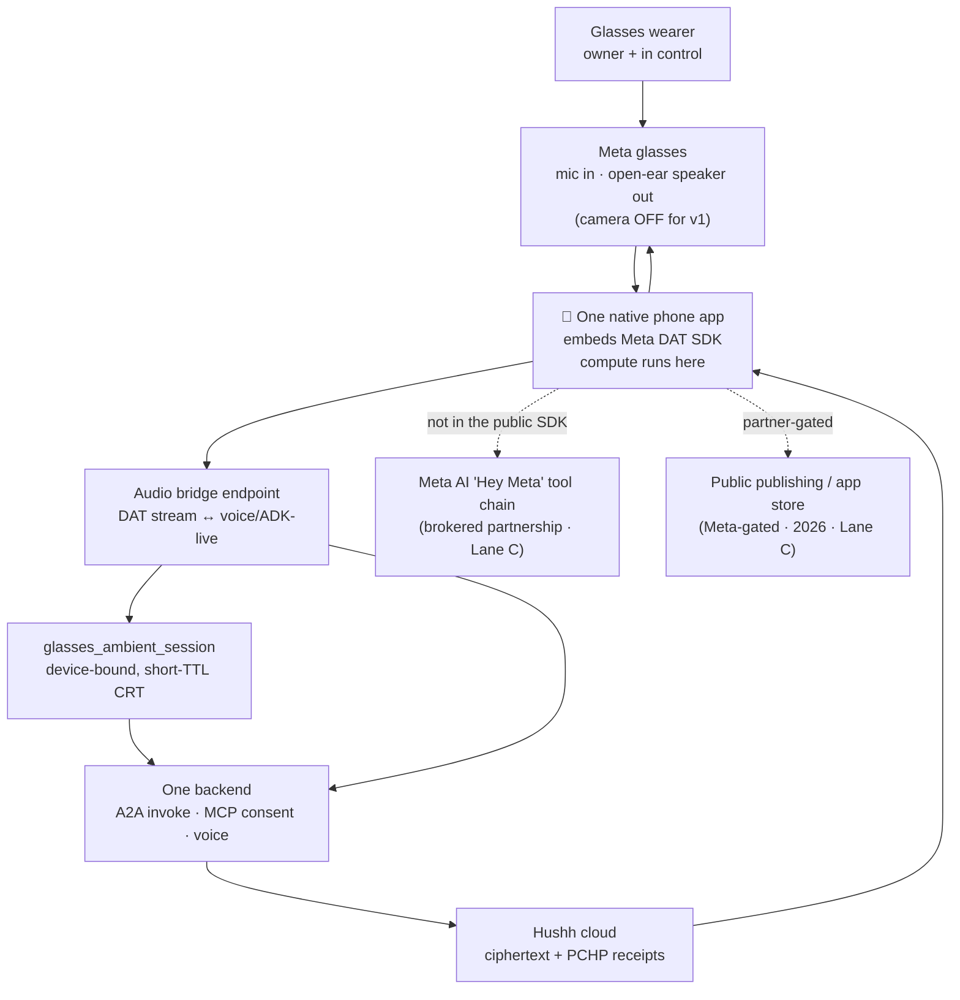

# One on Meta Glasses — DAT Integration Execution Plan

Status: **founder-approved — promoting to execution.** This is the concrete, research-grounded execution plan the founder asked for: get a working ambient 🤫 Private Agent One onto Meta glasses as fast as honestly possible, and set the path to reaching every Meta glasses user. It is the execution companion to the concept + trust rationale in [One on Meta Glasses — Ambient Private Agent Plan](./one-meta-glasses-ambient-agent-plan.md); read that first for the durable "why" and the full edge analysis. This doc adds the verified platform reality and a critical-path plan with named owners and gates.

## Visual Map

Lane A (wearer → glasses → phone → bridge → consent → One → cloud) is buildable now. The dotted paths to Meta AI and public publishing are Lane C: Meta-gated, named honestly, not pretended-started.

## What the research changed about the ambition

The founder's goal was "🤫 Agent One callable via Meta AI as part of its tool chain, available to every Meta glasses user, Monday if possible." A deep research pass against Meta's own developer docs and Connect 2025 material forces two honest corrections, and one real opportunity.

**Correction 1 — there is no self-serve "Meta AI tool chain" for third-party agents yet.** The **Meta Wearables Device Access Toolkit (DAT)** is the public SDK, and in its current preview it exposes only the glasses **camera, microphone, and speaker** to a developer's own phone app. It does **not** let a third party register as a callable tool inside Meta AI, and it does **not** expose "Hey Meta" voice invocation. The "Hey Meta, Be My Eyes…" routing that looks like a tool chain is a **separately negotiated, Meta-brokered partnership**, not something the SDK grants. So "callable via Meta AI" is a *partnership* outcome, not an *SDK* outcome.

**Correction 2 — "every user, Monday" is not reachable through the SDK.** DAT is a **v0.5 Developer Preview**. During preview, apps can only run on the developer's own glasses (developer mode) or be shared to testers inside the developer's org via invite-only release channels. **Public publishing to end users is limited to select partners; general public publishing is not available until later in 2026.** There is no glasses app store today.

**The real opportunity — a working ambient One on our own glasses this week, with no Meta approval to build.** DAT lets us build a phone-tethered app that streams the glasses microphone to our own backend and speaks answers back through the glasses' open-ear speaker. Everything One already exposes (the MCP consent server, the A2A invoke surface, the voice/ADK-live runtime) is the backend for exactly that. That is buildable, testable on real glasses in developer mode, and demo-ready fast. It is **not** "every user" — that stays gated behind Meta's partner program and 2026 public publishing, named honestly below.

## Verified platform reality (what we build against)

Every line here is from the sources listed at the end; treat it as the design contract, and re-verify against the live docs before each milestone because the preview is moving.

- **DAT is a phone-app SDK, not an on-glasses runtime.** Apps run on a paired iOS (15.2+) or Android (10+) phone and reach the glasses over the SDK. Compute is on the phone; results are sent back to the glasses for audio (or, on Display hardware, limited output). Official SDKs and samples are on GitHub (`facebook/meta-wearables-dat-ios`, `facebook/meta-wearables-dat-android`).
- **Capabilities exposed:** camera POV video / real-time frame streaming and in-stream image capture, microphone audio input, open-ear speaker audio output. Per-app user permission is required for each.
- **Not exposed (initial preview):** Meta AI / "Hey Meta" invocation, the Ray-Ban Display HUD imagery surface, Neural Band gestures, custom hardware-button triggers, and any "run my LLM inside Meta AI" hook. Developers using their own AI model must continuously stream sensor data to it, which costs battery.
- **Hardware supported:** Ray-Ban Meta (Gen 1 & 2), Ray-Ban Meta Display, Oakley Meta HSTN, Oakley Meta Vanguard.
- **Access + developer mode:** register via an interest form with a Meta Managed Account to reach the Wearables Developer Center (`wearables.developer.meta.com`). Enable developer mode by tapping the app version five times in the Meta AI app (Settings → App Info) and toggling Developer Mode; developer-mode apps appear under Meta AI settings → App connections. A **Mock Device Kit** simulates the glasses so we can build before hardware arrives (Mock does not cover Display).
- **Distribution:** no public app store during preview; test on own device or invite-only release channels; public publishing is partner-gated until later 2026.
- **How launch partners actually integrated:** camera + audio use cases (Be My Eyes, Microsoft Seeing AI, Aira, OOrion, HumanWare for accessibility; Twitch + Streamlabs for first-person streaming; Disney Imagineering and 18Birdies for contextual POV), all voice-forward. None of them are agentic Meta-AI tool calls; the agentic "Hey Meta, [partner]" routing (Be My Eyes) was a brokered deal, first shown at Connect 2024.

## What the repo already gives us (this is a port, not a greenfield)

The glasses-facing backend is largely already shipped; the integration is mostly wiring, not new invention.

- **One is already invocable as an agent, with consent.** [`consent-protocol/api/routes/one/a2a.py`](../../consent-protocol/api/routes/one/a2a.py) serves an A2A agent card (`/api/one/a2a/card`) and an invoke endpoint (`/api/one/a2a/message`) gated by the `cap.one.invoke` scope with user-approved invocation tokens. A glasses phone-app is just another A2A requester.
- **One is already an MCP server.** [`consent-protocol/mcp_server.py`](../../consent-protocol/mcp_server.py) (published as `@hushh/mcp`) exposes the consent tools to any MCP host, so a phone client can discover domains, request consent, and pull a scoped export the same way every other host does.
- **One already has a voice / live runtime.** [`adk_live.py`](../../consent-protocol/api/routes/one/adk_live.py) is the screenless interaction surface a glasses mic-to-speaker loop needs.
- **The consent primitives are shipped.** The HCT token ([`consent-protocol/hushh_mcp/consent/token.py`](../../consent-protocol/hushh_mcp/consent/token.py)) and the `ConsentScope` enum ([`consent-protocol/hushh_mcp/constants.py`](../../consent-protocol/hushh_mcp/constants.py)) are where the new device-bound glasses scope lands.
- **A developer/requester model exists.** [`developer_registry_service.py`](../../consent-protocol/hushh_mcp/services/developer_registry_service.py) already models third-party requester apps, so the glasses phone-app registers as a requester like any other.

The genuinely new pieces are: a device-bound short-TTL consent scope, an audio bridge between a DAT stream and the voice runtime, and a thin **native** phone app (One is a web app today; DAT requires a native iOS/Android host).

## The plan, in three lanes

Each lane names what it delivers, its owner, and its gate. The whole point is that Lane A moves now with no Meta dependency.

### Lane A — Buildable now, entirely on our side (no Meta approval to build)

The target is a working ambient loop: speak to the glasses → One hears it → One answers through the glasses speaker, every read gated by a consent handshake. Claude can build the backend end-to-end and scaffold the native client.

| Work stream | Owner | First verifiable milestone | Gate |
| --- | --- | --- | --- |
| `glasses_ambient_session` device-bound, short-TTL CRT scope | consent/IAM (`iam-consent-governance`) + backend | scope value in `constants.py` + a device-bound token profile in `token.py` (short TTL, device id claim, replay-safe), with tests | none — start now |
| Audio bridge: DAT mic stream ↔ voice/ADK-live ↔ speaker reply | backend | a WebSocket/relay endpoint that accepts a phone audio stream, runs the existing One voice loop under a `glasses_ambient_session` grant, returns audio, with a fixture-driven test | none — start now |
| DAT phone-app client (native iOS/Android shell) | mobile-native | a minimal app embedding the DAT SDK that streams mic to the bridge and plays the reply, tested first on the **Mock Device Kit** | needs a Meta Managed Account for the SDK; buildable against Mock without hardware |
| Audio-first PCHP consent + revocation ceremony (screenless) | frontend / native surface owner | spoken Offer→Consent→revoke prototype with an anti-spoof bar (voice + paired-phone confirmation) | none — start now |
| Conformance harness for the glasses requester | MCP developer surface (`mcp-developer-surface`) | a test that drives `request_consent` / `get_encrypted_scoped_export` as the glasses app and asserts scope enforcement | none — start now |

Claude builds the first two, the fourth, and the fifth in this repo directly. The native shell (third row) is code Claude can scaffold, but building, signing, and running it on device is a human Xcode/Android Studio step.

### Lane B — Business + platform access, start in parallel (human, this week)

| Action | Owner | Outcome |
| --- | --- | --- |
| Submit the DAT interest form + create a Meta Managed Account | founder / bizdev | reach the Wearables Developer Center and pull the SDK |
| Acquire developer glasses (Ray-Ban Meta Gen 2 and/or Display) and enable developer mode | ops | real-hardware testing beyond Mock |
| Apply to the Meta wearables partner track for public publishing | founder / bizdev | the only path off "developer mode only" to real users |
| Open the brokered-integration conversation for a "Hey Meta, ask 🤫 One" routing | founder / partnerships | the only path to the Meta-AI tool-chain outcome (like Be My Eyes) |

### Lane C — Meta-gated, cannot be pretended-started

| Outcome | Blocked on |
| --- | --- |
| Public publishing to end users | Meta partner selection + general publishing (later 2026) |
| "Hey Meta, ask 🤫 One" as a Meta-AI tool call | a Meta-brokered partnership; no public SDK path today |
| Display HUD output, Neural Band gestures, hardware-button triggers | Meta exposing these APIs (not in the v0.5 preview) |

## Edge-case assessment (per the concept doc, sharpened by the SDK reality)

- **Bystander / third-party capture is now the sharpest line, because camera POV is the SDK's headline capability.** For v1 the ambient loop is **audio-only**; camera stays off. Any future camera use is its own gated posture, never a default, and never captures identifiable bystanders without an explicit, separate ceremony. This is the single most important constraint and it is a design rule, not a preference.
- **Continuous streaming vs. privacy and battery.** DAT wants a continuous sensor stream to an external model; that is both a battery cost and a privacy surface. The ambient attention model must be **wake-word or explicit-tap gated**, not always-listening, so audio only leaves the glasses after the wearer starts a turn — which also fits the `glasses_ambient_session` short-TTL grant.
- **Key custody / zero-knowledge.** Compute is on the phone, not the glasses, so the phone (which already holds the One vault posture) is the trust anchor; the glasses are a thin audio peripheral. This side-steps the open "can the glasses hold an owner key" question for v1 — the glasses never hold plaintext or keys.
- **PKM vs runtime memory.** Ambient turns are runtime memory; nothing becomes durable PKM without the same owner-approved promotion step the rest of the system enforces.
- **Trust-state clarity on a screenless device.** With no HUD in the preview, "what can hear me and how do I stop it" must be fully legible in audio: a spoken active-state cue and a single always-available revoke phrase/tap. If we cannot make that legible, the feature does not ship.

## Critical path to a working demo (the honest "Monday")

The fastest real result is **ambient One answering through our own Meta glasses in developer mode**, not "every user." Ordered:

1. Lane B access started (interest form + Managed Account) so the SDK and Mock Device Kit are in hand.
2. Backend `glasses_ambient_session` scope + audio bridge built and tested (Claude, Lane A rows 1–2).
3. Native DAT shell app streaming mic → bridge → speaker, first on Mock, then on real glasses in developer mode (Lane A row 3).
4. Spoken consent + revoke ceremony wired in (Lane A row 4).
5. Demo: "🤫, what's on my plate today?" answered hands-free on the glasses, every read carrying a PCHP receipt.

Realistically, steps 2 and 4 (backend + ceremony) can land in days because the runtime already exists; step 3 depends on the Managed Account and, for on-glasses testing, hardware. If hardware or account access slips, the Mock Device Kit still gets us an end-to-end demo without glasses. "Every Meta glasses user" is Lane C, targeted at Meta's 2026 public publishing, and is honestly out of our unilateral control.

## Promotion note

Per the future-planner Founder Vision Execution Lane, founder approval satisfies the "approved for execution" criterion, so Lane A promotes to tracked execution now. On landing, the scope + token work moves into `consent-protocol/docs/...`, the native client into an `apps/` package with its own execution doc, and the trust-state UX to the native surface owner. This doc stays the rationale + gate record until the platform lanes clear.

## Sources

- [Meta Wearables Device Access Toolkit — developer docs](https://wearables.developer.meta.com/docs/develop/dat/) — capabilities, architecture, getting started.
- [Introducing the Meta Wearables Device Access Toolkit](https://developers.meta.com/blog/introducing-meta-wearables-device-access-toolkit/) — Connect 2025 announcement, launch partners, access model.
- [Explore what's possible with the Wearables Device Access Toolkit](https://developers.meta.com/blog/explore-whats-possible-with-wearables-device-access-toolkit/) — sensor access and use cases.
- [`facebook/meta-wearables-dat-ios`](https://github.com/facebook/meta-wearables-dat-ios) and [`meta-wearables-dat-android`](https://github.com/facebook/meta-wearables-dat-android) — official SDKs, samples, and the v0.5-preview maintainer notes.
- [Getting started with the toolkit](https://wearables.developer.meta.com/docs/develop/dat/getting-started-toolkit/) — Managed Account, developer mode, Mock Device Kit, version dependencies.
- [Build for display glasses](https://developers.meta.com/blog/build-for-display-glasses/) — Ray-Ban Display specifics and current output limits.
- [Ray-Ban Meta glasses: new AI features and partner integrations (Meta newsroom, Sept 2024)](https://about.fb.com/news/2024/09/ray-ban-meta-glasses-new-ai-features-and-partner-integrations/) — the brokered "Hey Meta, Be My Eyes" partnership model.
- [Be My Eyes + Meta accessibility functions](https://www.bemyeyes.com/news/be-my-eyes-and-meta-launch-new-accessibility-functions/) — a brokered, non-self-serve partner integration, for contrast.
