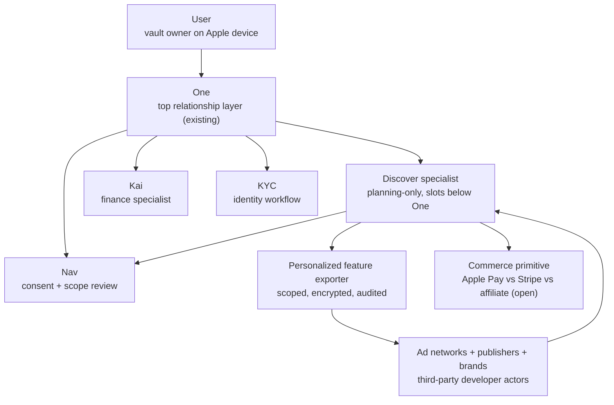

# One Personalized Content Roadmap

Status: planning-only future-state concept. This is not a current-state implementation contract and not an approved direction. The Hussh actor model today does not include advertisers, brands, publishers, or ad networks; this doc explores what would have to change before that capability could exist, and is parked here per [README.md](./README.md) until promotion criteria are met.

Classification: **future roadmap** (not [vision](../vision/README.md), not execution).

## Visual Map

## Concept

A user-facing surface that, on Apple-signed-in devices, presents a unified feed of "the most interesting things going on in my life" composed from publisher articles, brand promotions, and personalized ads from networks like Google Ads and Meta Ads, with one-click purchase from a product image. The feed is curated by a new specialist (working name **Discover**, final name to be selected) that One frames and Nav scope-reviews. Ad networks and publishers participate as third-party developer actors that receive scoped, encrypted personalization signals from the user's vault and return content under a named consent grant.

The shorthand is: One holds the relationship, Nav holds the consent boundary, Discover holds the personalized-content craft, and ad networks/publishers/brands operate only inside scoped grants. No actor receives plaintext PKM. No content is ingested into the vault uninvited.

## Current Overlap

What exists in repo that this concept can build on:

- Agent One manifest with an extensible `specialists` array under `consent-protocol/hushh_mcp/agents/one/`. Adding a fourth specialist follows the Kai/Nav/KYC pattern.
- `HushhAgent` base class wrapping Google ADK's `LlmAgent` with consent enforcement at agent entry and per-tool invocation, under `consent-protocol/hushh_mcp/hushh_adk/`.
- `ConsentScope` enum and `DynamicScopeGenerator` for `attr.{domain}.*` scopes under `consent-protocol/hushh_mcp/consent/`.
- Developer API consent flow: third party requests scopes via the developer-API endpoint, user approves, encrypted export is delivered. See `consent-protocol/docs/reference/developer-api.md`.
- `consent_audit` table tracks every token operation; the commercial-token attribute is the existing monetization hook described in `docs/reference/iam/architecture.md`.
- Frontend Kai market-preview feed as a working pattern for personalized lists under `hushh-webapp/components/kai/` and `hushh-webapp/lib/kai/`.
- Capacitor native bridge with Sign in with Apple already wired under `hushh-webapp/lib/services/` and `hushh-webapp/lib/capacitor/`, plus FirebaseMessaging push notifications.
- Centralized route registry under `hushh-webapp/lib/navigation/` for adding new feed/commerce routes when promoted.
- Persona context provider under `hushh-webapp/lib/persona/` as a precedent for persona-aware UI shells.

The gap is not capability existence in the agent runtime; the gap is that the trust model, scope namespace, ad-network actor class, ATT/IDFA primitive, and commerce primitive are all absent.

## Missing Primitives

Before a Discover specialist becomes feasible, the repo needs:

1. **Actor model expansion.** Decide whether advertisers, brands, publishers, and ad networks are first-class actors or remain third-party developer actors using the existing `/api/v1/request-consent` flow. Ratify in `docs/reference/iam/architecture.md` before any code change.
2. **Scope namespace for personalized content and commerce.** Proposal: reserve `attr.discover.*` for user-side personalization signals, `attr.commerce.*` for purchase intent and history, and per-network external scopes such as `external.ads.google` and `external.ads.meta` for outbound personalization grants. Final names owned by `iam-consent-governance`.
3. **Discover specialist slot in the agent ontology.** Add specialist row to `docs/vision/agent-ontology.md`, including `speaker_persona` id, voice descriptor, owned action namespace, and tone copy. Per the ontology rule in `docs/vision/agent-ontology.md` ("Future specialists slot below One. Do not add a second top-level personal agent."), this slots **below** One.
4. **ATT/IDFA Capacitor plugin contract.** No plugin exists today. Needs `ios/App/` native bridge implementing `ATTrackingManager.requestTrackingAuthorization`, a TypeScript interface in `hushh-webapp/lib/capacitor/types.ts`, a web fallback at `hushh-webapp/lib/capacitor/plugins/`, and Nav-owned consent UX copy explaining what identifier sharing means for the user.
5. **Ad-network connector pattern.** The only existing third-party connectors are Alpaca (brokerage), Plaid (banking), and Gmail (email). Google Ads and Meta Ads APIs require their own connector module under `consent-protocol/hushh_mcp/integrations/`, plus partner credential management. The pattern must enforce: no plaintext PKM ever leaves the vault, only scoped derived signals; every outbound call writes a `consent_audit` row; commercial-token attribute is set when monetary value moves.
6. **Personalized signal export contract.** Concrete shape of what the user is sharing with each ad network. This must be auditable and human-readable in Nav's consent-review surface. Likely lives in a new `contracts/discover/` family parallel to `contracts/kai/`.
7. **Content ingestion model.** Inbound publisher articles, brand promos, and ads need to be discoverable without violating the no-unsolicited-ingestion rule. Likely model: ad networks return content in response to a user-initiated pull, not push.
8. **Commerce primitive choice.** Apple Pay (physical goods, native sheet), Stripe (web checkout), Shop Pay, or affiliate link-out. Open question; choice has different trust, native plugin, and revenue implications.
9. **"Tap an image -> buy" surface.** No commerce route, component family, or checkout shell exists in `hushh-webapp/`. Needs route under `lib/navigation/routes.ts`, component family parallel to `components/kai/`, and modal/sheet UX patterns.
10. **Per-device Apple identity model.** "Across all my Apple-signed-in devices" implies either an iCloud / device-graph primitive or per-device sign-in with a server-side device list. Sign in with Apple alone does not give a device graph today.

## Trust-Boundary Edge Risks

This concept must respect every Hussh trust invariant, and the planning doc names each risk explicitly:

- **BYOK.** Ad networks must never hold the vault key. Personalization signals must derive from scoped, decrypted-on-client features and be sent out under a named scope, never as plaintext PKM.
- **Zero-knowledge.** Server stores ciphertext only. Personalization features must be computed client-side or through a hardened ephemeral path that does not persist plaintext.
- **Scope-gated execution.** Every ad-network read or write must require a consent token bound to a specific scope, validated at agent entry and per tool invocation, audited in `consent_audit`.
- **No unsolicited ingestion.** The developer-API pattern is discovery + approval + encrypted export. Brands cannot push content into the vault uninvited; user-initiated pulls are the only sanctioned path.
- **Persona ontology invariant.** Discover is a specialist below One. It must not be promoted to a second top-level agent. Founder copy and shell greetings stay One-owned.
- **ATT and IDFA.** Identifier sharing requires an explicit ATT prompt; Nav owns the consent-review copy. Defaulting to share is not allowed.
- **Commercial-token attribute.** Any monetary action must set the existing `commercial` attribute on the consent token and pass `require_commercial=True` enforcement.
- **Audit completeness.** Inbound content selection, outbound signal export, and one-click purchase each generate independent audit rows.

Risk tags to surface for `./bin/hushh codex audit`: `trust-model-overreach`, `vision-boundary-drift`, `future-planning-drift`.

## Open Questions

To be answered before any promotion request:

1. Specialist final name (Discover, Vibe, Curator, or other).
2. Are advertisers, brands, publishers, and ad networks a new first-class actor class, or do they remain third-party developer actors using the existing `/api/v1/request-consent` flow?
3. Commerce primitive (Apple Pay, Stripe, Shop Pay, affiliate link-out, or hybrid).
4. Is the existing commercial-token attribute sufficient for revenue share with ad networks, or does Hussh need a settlement primitive?
5. Does "across all my Apple-signed-in devices" require an iCloud or device-graph primitive, or is per-device sign-in plus a server-side device list sufficient?
6. Does the user want personalization signals computed client-side only, or is a hardened server-side ephemeral path acceptable?
7. Is there a partnership story with at least one ad network that fits the scoped-consent model, or does this concept require greenfield partner outreach first?

## Out of Scope (this round)

The user limited Apple-surface scope to ATT and IDFA. The following are explicitly deferred to follow-up planning rounds and must not appear in any execution work that derives from this doc:

- Apple Pay and Wallet
- In-App Purchase and StoreKit 2
- Photos and PhotoKit on-device matching
- iCloud-backed device graph
- A Discover voice persona inside the Kai voice gateway

Also out of scope this round: founder copy changes, edits to `docs/vision/`, edits to `docs/reference/`, and any runtime code under `consent-protocol/` or `hushh-webapp/`.

## Promotion Criteria

This document may move out of `docs/future/` only when, per the rules at [docs/future/README.md](./README.md):

1. The concept is approved by founder and product as a Hussh direction.
2. The advertiser/brand/publisher/ad-network actor question is ratified in writing.
3. Scope namespace decisions (`attr.discover.*`, `attr.commerce.*`, `external.ads.*`) are ratified by `iam-consent-governance` and added to `docs/reference/iam/consent-scope-catalog.md`.
4. Discover specialist row is added to `docs/vision/agent-ontology.md` with a final name, voice descriptor, and `speaker_persona` id.
5. ATT/IDFA Capacitor plugin contract is drafted by `mobile-plugin-contracts` and reviewed by `security-audit`.
6. At least one ad-network partner agreement exists that fits the scoped-consent model.
7. Commerce primitive is chosen and reviewed by `security-audit` and `mobile-plugin-contracts`.
8. Execution owner skill assigned per surface; likely splits across `backend-agents-operons`, `iam-consent-governance`, `mobile-plugin-contracts`, `frontend`, and `streaming-contracts`.

## References

- [../vision/README.md](../vision/README.md) - durable Hussh north stars.
- [../vision/agent-ontology.md](../vision/agent-ontology.md) - persona ontology, including the rule forbidding a second top-level personal agent.
- [./README.md](./README.md) - planning-only home rules and promotion criteria.
- [./one-nav-runtime-plan.md](./one-nav-runtime-plan.md) - precedent for adding specialists below One.
- [./one-email-intake-roadmap.md](./one-email-intake-roadmap.md) - precedent for a One-framed, Nav-reviewed, specialist-executed workflow.
- [../reference/iam/architecture.md](../reference/iam/architecture.md) - consent token, commercial-token attribute, A2A delegation.
- [../reference/iam/consent-scope-catalog.md](../reference/iam/consent-scope-catalog.md) - scope namespace conventions.
- [../../consent-protocol/docs/reference/personal-knowledge-model.md](../../consent-protocol/docs/reference/personal-knowledge-model.md) - PKM storage, encrypted-domain payloads, scope discovery.
- [../../consent-protocol/docs/reference/developer-api.md](../../consent-protocol/docs/reference/developer-api.md) - third-party developer consent + export pattern.
