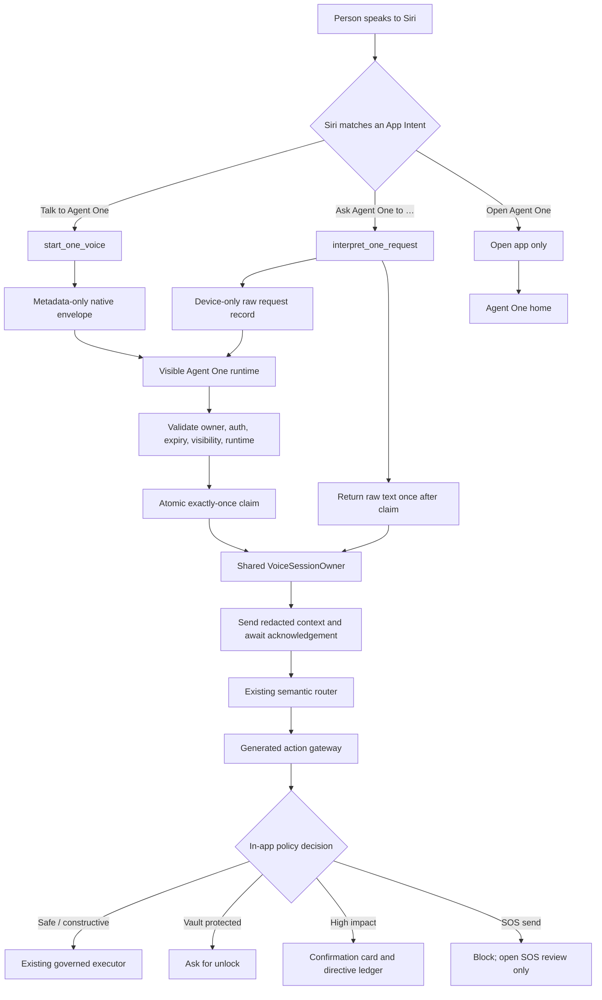

# Agent One Voice — Siri Handshake and Voice Handoff PRD

> Superseded for the command experience by the [Location command runtime](../reference/one/one-voice-runtime-architecture.md). Live conversation and local model-pack requirements below are historical context, not active release gates.

Status: implementation contract for the Siri entry adapter and the existing
private voice runtime.

## Implementation status

This document is an active implementation contract, not a claim that every
phase is shipped.

| Area | Current state | Release implication |
| --- | --- | --- |
| Siri Talk/Ask handoff | Implemented through the existing native coordinators and shared Agent Bar owner | AppIntent boundary and downstream handoff are automated; Siri's phrase ranking remains probabilistic |
| Request preservation and safety | Implemented with one-time owner-bound claim, context barrier, typed proposals, directive ledger, and SOS-send refusal | Safe to continue hardening through automation |
| Shared iOS/browser transcript path | Implemented as a common `TranscriptEvent` adapter seam; final adapter turns enter the local resolver before Gemini | iOS can use on-device Apple Speech when supported; browser local selection is wired but remains disabled until a verified runtime pack is configured |
| Generated local intent resolution | Implemented as a bounded catalog candidate generator plus asynchronous resolver contract, session-local ONNX worker preparation, generated slot extraction, and a trained MiniLM pair-ranker pack builder | Publication/activation and promotion evidence are still deployment gates; the model cannot execute or authorize an action |
| Runtime/model-pack foundation | Implemented with metadata-only capability discovery, resumable verified storage, activation, rollback, signed/expiring URL enforcement, and privacy-safe observer events | No weights or runtime artifacts are committed; deployment must publish signed HTTPS packs |
| Portable local ASR | Adapter, worker lifecycle, audio ownership, verified pack handoff, pinned sherpa-onnx WASM runtime, and explicit fallback are implemented | A signed production `.data` model pack still must be published; without it the capability endpoint fails closed and no local transcript is emitted |
| Location slots/entities | Reusable local normalization, bounded duration parsing, redacted permission/location/share state, and existing governed Location handlers are wired | Contact/Circle identity matching remains inside the governed Location handlers; the local resolver passes spoken candidates only and never receives private entity lists |
| iOS FluidAudio optimization | Adapter and pinned `v0.15.6` dependency are implemented behind the existing speech contract | The app now targets iOS 17, but shipping remains disabled until the NVIDIA-licensed model has legal approval, a verified on-demand pack is active, and hardware benchmarks qualify it; Apple Speech remains the fallback |
| Hardware capture SLO | Automation harness and telemetry exist; physical-device p95 evidence is still required | G1 is not yet a release pass |

The implementation is therefore intentionally usable in its current safe mode,
but the portable local-ASR and trained semantic-ranker phases remain open. A
provider-backed fallback is not relabeled as on-device just to make the plan
look complete.

## FluidAudio release decision

The shipping app, test targets, and Capacitor deployment configuration now
target iOS 17, which satisfies the reviewed FluidAudio `v0.15.6` package
requirement. The generated Capacitor package manifest can retain the upstream
iOS 15 value because sync rewrites it; the app target is the production
compatibility boundary.

FluidAudio is linked only as an optional speech provider behind the existing
microphone owner and `TranscriptEvent` contract. Its model is not embedded in
the app. It downloads only through the verified on-demand pack store, resumes
only against a fresh short-lived URL, and is enabled only when all of the
following agree:

1. The exact model notice records legal approval and release enablement.
2. The app's native release and benchmark switches are enabled.
3. A checksum-verified pack is active and the physical-device benchmark gate
   has passed for the release source.

Until then, Apple on-device Speech is the default and fallback. This avoids
mistaking dependency linkage for approval to distribute the NVIDIA-licensed
streaming model. The web and Siri boundaries remain unchanged.

## Product boundary

Siri is an entry adapter, not an Agent One capability engine. It may recognize
an explicit invocation, capture bounded raw request text, open Agent One, and
start the existing voice owner. Agent One remains responsible for context,
semantic assessment, consent, Vault policy, action selection, confirmation,
execution, and settlement.

| Siri may do | Siri must not do |
| --- | --- |
| Match `Talk to Agent One` or `Ask Agent One` | Inspect the current Agent One screen |
| Capture raw speech/text as a parameter | Decide which Agent One action the person means |
| Open the app and trigger a native handoff | Read Vault contents or private-agent memory |
| Return a short handoff status | Select consent or Vault scopes |
| Ask for a missing request parameter | Execute mutations or send an SOS |

The reliable user contract is:

- “Hey Siri, talk to Agent One” starts live voice.
- “Hey Siri, ask Agent One to …” passes the raw request into Agent One.
- “Hey Siri, open Agent One” opens the app without automatically listening.

App Shortcut phrases improve discoverability but do not guarantee every
paraphrase. The explicit `Agent One` application token remains in every phrase
family. Action Button behavior and deterministic App Shortcuts are separate
surfaces and are not redesigned here.

## User stories

### Live conversation

When a person says “Hey Siri, talk to Agent One”, Siri opens the app and queues
`start_one_voice`. Native and web enforce the same 25-second app-acceptance
deadline; the five-minute TTL is cleanup only. The visible Agent One runtime claims the handoff and the
existing Agent Bar owns one microphone, one relay, one session, and one
follow-up conversation. Siri does not need to know the route, action inventory,
Vault state, or consent state.

### One-shot request

When a person says “Hey Siri, ask Agent One to enable location”, Siri stores the
raw request only in device-only native handoff state, opens the app, and returns
the text once from a successful owner-bound claim. Agent One then starts the
existing voice session, sends the text as one real `user_text` turn after setup
and context acknowledgement, and evaluates the current redacted runtime
context through its existing semantic router and generated action gateway.

The text is not Siri's interpretation. It is untrusted user input. A request
such as “handle my location” must produce clarification rather than a guess
between enabling, disabling, sharing, pausing, or opening settings.

### Open only

“Hey Siri, open Agent One” is an app-open operation. It does not create a
pending request and does not open the microphone automatically.

## Visual Map



## Handoff contract

Existing identifiers remain stable:

```ts
type AgentConversationRequest = {
  source?: "siri_app_shortcut" | "agent_chat";
  requestId?: string;
  initialRequestText?: string;
};
```

Native envelopes preserve:

- `kind: "start_one_voice"` or `kind: "interpret_one_request"`
- `source: "siri_app_shortcut"`
- `id`, `createdAt`, `expiresAt`
- `ownerBinding` for request invocations
- `protocolVersion: "one.request.v1"`

The lifecycle metadata is:

- `handoffDeadlineAt`: latest time the visible app may accept the handoff;
- `claimedAt`: written only after an atomic native claim;
- `appOwnedAt`: written when the visible runtime accepts the request;
- `detached`: Siri disconnected before app ownership;
- `outcome`: a typed state, never a flattened success/failure string.

For request invocations, the native bridge exposes:

```ts
claimRequestInvocation({ id: string }): Promise<{
  claimed: boolean;
  requestText?: string;
}>;
```

`requestText` is returned only after id, owner, expiry, and claim checks pass.
It is never placed in URLs, logs, screenshots, browser storage, analytics, or
availability events. It crosses the native-to-WebView bridge once, remains in
memory, and is then released into the existing voice request path.

## Lifecycle and failure posture

```text
requested → foreground_wait → validated → claimed → app_owned → dispatched → settled
```

Failure states are `expired`, `cancelled`, `owner_mismatch`, `ambiguous`,
`voice_disabled`, `runtime_unavailable`, `handoff_timeout`, and
`provider_unavailable`.

Pending requests are cleaned up after five minutes. App acceptance uses the
unified handoff deadline. A duplicate id cannot create a second microphone
session or duplicate user turn. If Siri detaches before app ownership, the
claim is cancelled and no mutation may occur. Detachment after app ownership
does not stop the in-app session. Sign-out or owner change cancels pending
native state. Existing live sessions are reused or coalesced.

No Vault key, provider credential, consent token, decrypted information,
coordinates, or contact details cross the Siri boundary.

## Implementation phases and exit checks

1. **Safety and audit closure.** Destructive and backend-direct action ids use
   the existing directive ledger; model-writable `confirmed` slots do not grant
   execution; the browser uses the server-filtered executable inventory; unknown
   actions retry once through the generated catalog and then report
   `report_no_app_action`; SOS voice-send remains impossible.
2. **Siri boundary.** `TalkToHusshOneIntent` remains the live entrypoint and
   `AskOneRequestIntent` remains the free-text entrypoint. Phrase arrays stay
   inline for Xcode metadata extraction, with common Ask/Tell/Speak/Talk aliases
   and the explicit application token.
3. **Native-to-app handoff.** Talk and request handoffs share native
   owner/expiry/deadline checks and detach semantics. The request handoff is
   mounted in the app provider, claims atomically, forwards
   `initialRequestText` to the existing voice owner, and shows a visible
   fallback when the app cannot accept it.
4. **Fast capture.** Microphone opening precedes relay setup. A bounded
   in-memory PCM buffer preserves onset audio until the existing setup and
   context acknowledgement complete. One headless voice owner remains above
   route transitions, with duplicate ownership and deadline reconciliation
   tests.
5. **Local semantic routing.** Generated action and route-orchestration
   contracts remain authoritative. Runtime filtering, bounded slot extraction,
   authored disambiguation, shadow-mode accuracy fixtures, and forbidden
   predictions are required before local routing becomes authoritative.
6. **Transcript parity.** If native speech recognition is enabled, the privacy
   declaration must exist first. Native transcription is only an adapter into
   the same One Voice transcript and semantic-routing path; it is not a second
   store or router.
7. **Device release verification.** Physical-device coverage includes Talk,
   Speak, Ask, Open, empty/ambiguous requests, auth/Vault/provider failures,
   expiry, duplicate delivery, detachment, an existing session, destructive
   requests, and “Send an SOS”. SOS must open review without sending.

## Observability and acceptance

Only redacted lifecycle information is recorded: request id, handoff kind,
lifecycle state, elapsed milliseconds, request length, runtime readiness, and
outcome category. Request text, transcript content, credentials, Vault
material, coordinates, contacts, and consent tokens are never recorded.

The feature is accepted only when Siri launches and hands off, Agent One makes
the semantic assessment, the same voice owner serves Talk and Ask, raw Ask text
is delivered exactly once after claim, generated actions and in-app confirmation
remain authoritative, all handoff failures fail closed, and existing Action
Button/deterministic Shortcut behavior remains unchanged.

## Cross-platform implementation boundary

Siri is only one entry adapter. iOS native voice, browser voice, Siri Ask text,
and future Hussh agents use one transcript and resolution contract:

```text
platform speech adapter
  -> TranscriptEvent
  -> redacted Agent One context
  -> local generated-catalog resolver
  -> proposal / consent / ledger
  -> verified settlement
```

The repository now provides the shared transcript types, bounded in-memory
transcript/PCM buffers, browser adapter, iOS on-device-first Speech adapter,
and a Location-first local resolver. The live voice transport starts the
platform adapter before relay setup, holds final transcripts behind the
redacted-context barrier, and sends known adapter turns through that resolver.
The resolver understands authored natural variations such as “make a circle
called Family” and “turn location sharing on”, asks for a missing Circle name,
answers Circle counts only from redacted governed state, and blocks voice SOS
sending. It does not execute actions or replace the existing gateway.
For actionable results, it submits a typed proposal only after the live
context barrier; the relay validates the generated action and creates the
normal directive-ledger record before the existing browser executor runs.
The browser never creates local authorization.

The browser local-first adapter, pinned sherpa-onnx/ONNX workers, and model-pack
verification path are implemented. Until approved signed model metadata is
published, capability discovery fails closed and the explicit provider-backed
PCM Live path remains the fallback (`onDevice: false`). The fallback is never
relabelled as on-device merely because local mode is enabled.
Gemini remains available for low-confidence/open conversation only when a
transcript adapter is active; it cannot authorize or settle a generated Hussh
action.

The iOS adapter also passes up to 100 short, generated action-catalog
`contextualStrings` to Apple Speech. This boosts product terms during ASR while
leaving semantic assessment and action authority in the shared Agent One
runtime.
