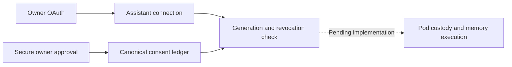

# Consumer MCP implementation record

Status: **In progress; not available for consumer acceptance.**

## Visual Map

GitHub action item: [#6719 Build consumer Hussh MCP with owner-pod memory and Puppy interoperability](https://github.com/hushh-labs/hushh-research/issues/6719). Board intake is Inbox; implementation is active. Local standing-consent checkpoint: `253e89abe`.

## Baseline and boundaries

- Worktree: sibling `hushh-consumer-mcp`; branch `feat/consumer-mcp`.
- Committed private baseline: `883327eaf57c3e78d62197d899811f5360262481` (11 September 2026).
- Original workspace and ADK worktree are independently active and remain untouched.
- No deployment, main promotion, production activation or marketplace submission has occurred in this workstream.
- Working source is implementation evidence, not installed-runtime or host acceptance evidence.

## Approved product contract

External assistants authenticate as owner-bound clients. Registered Puppy devices retain their distinct native authority. One owner approval permits reads, routine additions and corrections of current and future personal memory until the client is disconnected. Credentials remain short-lived. Deletion, permission changes and consequential external actions require fresh confirmation. Secrets are never personal memory.

Provisioning, recoverable owner-pod vault custody and client access are separate approvals in one setup journey. The universal MCP gateway may handle approved results in transit but cannot persist payloads or hold vault keys. Optional direct transport uses the same capabilities. Canonical encrypted PKM commits own successful saves; pod replicas are derived.

## Checkpoints

| Checkpoint | Status | Next evidence |
|---|---|---|
| Isolation and committed baseline | Done | Baseline above; clean source when created |
| Consumer capability coverage | Inventory complete; implementation pending | Baseline table below; no executable coverage claimed |
| OAuth owner/client/resource binding | Local checks pass | 55 focused checks; live host acceptance pending |
| Owner connection review and disconnect | Local checks pass | 34 backend and 8 frontend checks; typecheck, ESLint and surface-map generation passed |
| Standing memory consent | Implemented; local checks pass | Durable binding, secure review, revoke/commit race and full erasure/rollback exercised in disposable PostgreSQL |
| Resumable onboarding and provisioning | Pending | Compose existing setup jobs, custody approval and no duplicate infrastructure |
| Pod custody and canonical memory | Pending | Authenticated enrollment, encrypted commit, CAS and replacement recovery |
| Consumer tools and Puppy adapters | Pending | Typed operation execution, receipts and common records |
| Direct/universal transport parity | Pending | Isolation, revocation races and non-persistence |
| Host acceptance and submission packages | Pending | Real Claude and ChatGPT journeys, operational receipts |

## Verification and rollback

Run focused checks for each changed contract. Run the combined release gate on the final candidate. Keep legacy developer consent/export semantics unchanged. Do not claim an operation works because a UI action or catalog entry exists.

No deployed rollback is needed yet. Future rollback must retain canonical revisions, tombstones and revoked grants; never restore a runtime that ignores revoked authority.

## Source-derived consumer inventory

The baseline action gateway has 214 authored actions (186 wired, 28 unwired). Of these, 78 refer to routes, 96 to local handlers, five to Kai commands, five to voice tools and two to controls. These are interaction counts, **not executable MCP coverage**.

| Family | Existing owner | Consumer MCP disposition at baseline |
|---|---|---|
| Account and vault setup | `account.py`, trusted-device and vault services | Secure owner handoff required |
| Deployment | `personal_agent.py`, `byoc_setup_job_service.py` | Adapt existing resumable job; retain cost approval and disabled-hosted refusal |
| PKM | `pkm.py`, canonical mutation/write engine | Semantic reads/writes require approved pod custody and canonical encrypted commits |
| Agent memory | `pod_memory.py`, memory store and resolver | Adapt inspection, recall, correction, export and erasure; retain tombstones |
| Files / Source Library | Existing provider file service and Source Library contracts | Upload and organization require explicit service adapters; share confirmation remains separate |
| Connections | `ConnectionsService`, `one/connections.py` | Service-backed directory and proposal operations; device contact permission remains a handoff |
| Calendar | `GoogleCalendarService`, `one/calendar.py` | Read/availability/proposal services exist; OAuth and action confirmation remain secure handoffs |
| Email / identity | `one/email.py`, Gmail routes, `OneEmailKYCService` | Adapt tracked read/draft workflows; approval is distinct from successful external delivery |
| Location | Location services and `PodLocationReadPort` | Adapt supported reads/proposals; device acquisition/background permission remains native |
| Finance | Kai portfolio/analysis services | Existing MCP UI intents do not execute analysis; real job/results adapter required |
| Consent / sharing | Consent ledger, exports, information-request services | Preserve current five-tool developer flow; add owner review and revocation without vault-key disclosure |
| Delegated private-agent work | `pod_turn.py`, shared fleet and specialist runtime | Add bounded task tracking and cancellation; no shared runtime fallback |
| Puppy and recovery | Trusted-device services and Hermes local PKM bridge | Retain device proof and local custody; common canonical records must be proven |
| Wallet / profile / support | Existing wallet-card, profile and support services | Separate public operations from protected reveals; native wallet installation is a handoff |
| Marketplace / RIA | Existing marketplace and RIA services | Consumer ownership must not grant advisor/business-operator roles |

The topology generator remains the existing coverage join: `scripts/ops/generate_runtime_topology_index.py`. A future MCP mapping must classify every authored consumer capability without making this projection a router.

## Current correction and receipts

- OAuth now retains verified owner, registered client, authorization identity, scopes and optional MCP resource. These fields do not themselves grant memory access.
- Resource-aware code exchange and refresh require the original configured audience. Access rejects mismatched deployments, revoked clients and orphaned/denied authorizations.
- New protected-resource discovery and 401 challenges use `CONSENT_API_PUBLIC_ORIGIN`; missing configuration refuses resource discovery rather than advertising an unusable audience.
- Existing unbound developer connections retain their five-tool consent/export behavior. Client-credentials and registry credentials never receive an owner identity.
- Parked dev migration `937_consumer_mcp_oauth_resource.sql` adds the nullable resource column; old offline SQLite schemas also upgrade additively. No live migration applied.
- Verification: 55 tests passed across `test_mcp_oauth_owner_binding.py`, `test_developer_oauth.py`, `test_mcp_remote_endpoint.py`, `test_mcp_public_contract_v030.py`, and `test_mcp_encrypted_scoped_export_tool.py`; Ruff and whitespace checks passed. Tests use synthetic local SQL, not live hosts.
- Next: connect standing-consent admission to the existing consent ledger, then resumable setup and pod custody. OAuth identity is not an implementation of these pending authorities.
- Foundation commit: `7864eb92c`; existing entitled-tool dispatch fix: `f18fb5de0`. The dispatch defect was reproduced before correction: private RIA/Kai names were advertised but rejected as unknown. The fix retains exact-name, schema and entitlement checks; 19 affected tests passed.
- OAuth session management uses the existing authorization identity. Owner-scoped session deletion atomically marks it denied, revokes its credentials and records the event. Late credentials cannot revive it. A standing assistant connection must survive a new authenticated OAuth session; it is a separate binding to the canonical consent ledger.
- Approval UI shows the registered client and checks the existing authenticated-session generation after asynchronous work. Request changes abort pending requests; already accepted server-side approvals cannot be undone by browser cancellation.
- `get_hussh_connection` now dispatches through the existing MCP server for owner/resource-bound OAuth only. It returns secure setup/review links; it neither grants permission nor claims memory execution. Registered developer credentials keep their existing catalog.
- Standing consent uses `consumer_mcp_connections` for identity/generation and `consent_audit` for grant decisions. Generic revocation, OAuth reuse and canonical SQL operations share the fence. Dormant pre-disconnect OAuth sessions cannot join a newly approved generation.
- Full account erasure and late-failure rollback passed with the real lifecycle service and migration 201 in disposable PostgreSQL; another owner's grant remained usable. Reset/persona cleanup retains revocation decisions instead of deleting the authority history.
- Local receipts: 111 focused backend checks passed before MCP tool wiring; 18 affected PostgreSQL/MCP checks passed after wiring. Twelve frontend approval/proxy checks, typecheck, targeted ESLint and surface-map generation passed. No skipped live checks were counted as passes.
- Final slice checks: 132 backend tests passed across consumer connections, IAM, Source Library scope policy and developer API routes. Documentation parity, package documentation/config checks and release-migration alignment passed; no release migration was added. Independent architecture review found no remaining blocker in this slice.
- Original workspace rechecked before commit: still `claude/hushh-infrastructure-analysis-7o991c` at `883327eaf`; no intervening private-branch commits to integrate.
- Next: extend resumable setup with explicit pod custody and canonical encrypted memory. Profile disconnect discovery, remote execution fencing, cross-host acceptance and signed receipt-mirror reconciliation remain incomplete.

## Active custody slice

- Reused the existing X25519/SHA-256/AES-GCM key-unwrapping primitive; 19 export compatibility checks passed. No vault key enrollment is exposed yet.
- Added a synchronous internal commit-log precondition evaluated against the captured, verified HEAD history on every CAS attempt. Existing 113 log tests and four new race/corruption cases passed. This is an atomic persistence seam, not completed custody authority.
- Independent vault/identity review found no blocking defect. The custody consumer must still commit writer activation to HEAD, enforce signed approval and key binding, seal recoverable custody under owner-project protection, and clean orphan encrypted objects during erasure.
- Original private branch advanced to `4ba7cae5a` during work (four commits covering pod build restoration, test isolation, merge protection and client-env checks). It remains untouched. None changes this slice's files; review these explicit dependencies before integration or deployment.
- GitHub #6719 was created and read back on Hussh Action Items; no owner, delivery date or completion status was invented.
