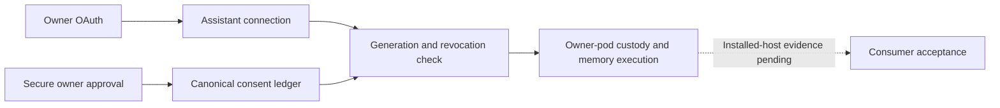

# Consumer MCP implementation record

Status: **In progress; not available for consumer acceptance.**

## Visual Map

GitHub action item: [#6719 Build consumer Hussh MCP with owner-pod memory and Puppy interoperability](https://github.com/hushh-labs/hushh-research/issues/6719). Board status is In Progress; assigned to `kushaltrivedi5`. Local standing-consent checkpoint: `253e89abe`.

## Baseline and boundaries

- Worktree: sibling `hushh-consumer-mcp`; branch `feat/consumer-mcp`.
- Latest source slice: `8a62ef979` (12 September 2026; published on `origin/feat/consumer-mcp`); the branch adds durable owner-pod task start/status/result/cancellation through the existing sealed commit log, alongside the earlier email workflow and bounded finance capabilities. Task snapshots are owner/client bound, idempotent and fail closed on replacement or cancellation; uncertain work is never replayed. Puppy tasks receive the same hub-minted short-lived device grant as synchronous turns, carried only in memory. The pod task route refuses caller-supplied credentials outside the Puppy lane and refuses bare Puppy requests. Focused checks, Ruff, topology validation, package docs/config checks, packed-runtime verification and whitespace checks pass locally. No deployment or hosted migration has been performed. The previously installed dev evidence remains `d11a5f62d`; this branch has not been deployed.
- Original workspace and ADK worktree are independently active and remain untouched.
- No deployment is authorized in this workstream: no candidate image, hosted migration, main promotion, UAT/production activation or marketplace submission has occurred for this branch. Consumer live acceptance remains incomplete because owner custody, full capability coverage, Puppy parity and external-host acceptance are not proven.
- Working source is implementation evidence, not installed-runtime or host acceptance evidence.

## Approved product contract

External assistants authenticate as owner-bound clients. Registered Puppy devices retain their distinct native authority. One owner approval permits reads, routine additions and corrections of current and future personal memory until the client is disconnected. Credentials remain short-lived. Deletion, permission changes and consequential external actions require fresh confirmation. Secrets are never personal memory.

Provisioning, recoverable owner-pod vault custody and client access are separate approvals in one setup journey. The universal MCP gateway may handle approved results in transit but cannot persist payloads or hold vault keys. Optional direct transport uses the same capabilities. Canonical encrypted PKM commits own successful saves; pod replicas are derived.

## Checkpoints

| Checkpoint | Status | Next evidence |
|---|---|---|
| Isolation and committed baseline | Done | Baseline above; clean source when created |
| Consumer capability coverage | Mechanically classified; 32 executable, 8 secure handoffs, 0 missing adapters, 1 not applicable | Generated topology check validates every executable/handoff tool against its definition, handler and server registration; live acceptance remains open |
| OAuth owner/client/resource binding | Local checks pass | 55 focused checks; live host acceptance pending |
| Owner connection review and disconnect | Local checks pass | Portal disconnect plus confirmation-gated MCP self-disconnect are fenced by owner, client and generation |
| Standing memory consent | Implemented; local checks pass | Durable binding, secure review, revoke/commit race and full erasure/rollback exercised in disposable PostgreSQL |
| Resumable onboarding and provisioning | Existing setup job; custody handoff wired in source | Compose the setup job, owner-session custody approval and no duplicate infrastructure on an installed pod; MCP status now returns the opaque `job_id` and `updated_at` for host-side correlation |
| Pod custody and canonical memory | Ceremony and local adapter implemented; live custody pending | Durable key/KMS configuration, authenticated envelope enrollment, encrypted commit, CAS and replacement recovery on an installed pod |
| Consumer tools and Puppy adapters | Typed memory, receipt, disconnect, bounded private-agent delegation, owner-device readiness projection, Calendar/Gmail/email-workflow-status/people reads, viewer-relative profiles, confirmed connection-request review/actions and secure email workflow owner handoff wired to existing owner-pod/trusted-device/ConnectionsService/OneEmailKycService seams; Puppy parity pending | Common capability execution and Puppy device acceptance |
| Direct/universal transport parity | Local relay adapter implemented; live parity pending | Isolation, revocation races and non-persistence across installed transports |
| Host acceptance and submission packages | Pending | Real Claude and ChatGPT journeys, operational receipts |

## Verification and rollback

Run focused checks for each changed contract. Run the combined release gate on the final candidate. Keep legacy developer consent/export semantics unchanged. Do not claim an operation works because a UI action or catalog entry exists.

Historical dev rollback targets are backend `consent-protocol-00087-8zb` and frontend `hushh-webapp-00058-h77`; they are retained as dated rollback evidence only. This branch-only milestone performs no deployment. Any future rollback must preserve canonical revisions, tombstones and revoked grants and never restore a runtime that ignores revoked authority.

## Source-derived consumer inventory

The baseline action gateway has 214 authored actions (186 wired, 28 unwired). Of these, 78 refer to routes, 96 to local handlers, five to Kai commands, five to voice tools and two to controls. These are interaction counts, **not executable MCP coverage**.

| Family | Existing owner | Consumer MCP disposition at baseline |
|---|---|---|
| Account and vault setup | `account.py`, trusted-device and vault services | Secure owner handoff required |
| Deployment | `personal_agent.py`, `byoc_setup_job_service.py` | Adapt existing resumable job; retain cost approval and disabled-hosted refusal |
| PKM | `pkm.py`, canonical mutation/write engine | Semantic reads/writes require approved pod custody and canonical encrypted commits |
| Agent memory | `pod_memory.py`, memory store and resolver | Adapt inspection, recall, correction, export and erasure; retain tombstones |
| Files / Source Library | Existing provider file service and Source Library contracts | Upload and organization require explicit service adapters; share confirmation remains separate |
| Connections | `ConnectionsService`, `one/connections.py` | Service-backed directory and proposal operations; device contact permission remains a handoff |
| Calendar | `GoogleCalendarService`, `one/calendar.py` | Read/availability/proposal services exist; OAuth and action confirmation remain secure handoffs |
| Email / identity | `one/email.py`, Gmail routes, `OneEmailKYCService` | Adapt tracked read/draft workflows; approval is distinct from successful external delivery |
| Location | Location services and `PodLocationReadPort` | Adapt supported reads/proposals; device acquisition/background permission remains native |
| Finance | Kai portfolio/analysis services | `analyze_hussh_finance` delegates a bounded, read-only operation through the existing owner-pod One task seam; durable task lifecycle is now available through the sealed pod log |
| Consent / sharing | Consent ledger, exports, information-request services | Preserve current five-tool developer flow; add owner review and revocation without vault-key disclosure |
| Delegated private-agent work | `pod_turn.py`, shared fleet and specialist runtime | Synchronous delegation plus `start_hussh_task`, `get_hussh_task` and `cancel_hussh_task` use a separate `cap.one.invoke` grant and sealed pod task snapshots; replacement marks uncertain work interrupted and never replays |
| Puppy and recovery | Trusted-device services and Hermes local PKM bridge | Retain device proof and local custody; common canonical records must be proven |
| Wallet / profile / support | Existing wallet-card, profile and support services | Separate public operations from protected reveals; native wallet installation is a handoff |
| Marketplace / RIA | Existing marketplace and RIA services | Consumer ownership must not grant advisor/business-operator roles |

The topology generator remains the existing coverage join: `scripts/ops/generate_runtime_topology_index.py`. A future MCP mapping must classify every authored consumer capability without making this projection a router.

The current topology receipt now records the consumer MCP coverage ledger in
`config/runtime-topology-maintenance.json` and emits it in
`contracts/architecture/runtime-topology-index.v1.json`. The generator rejects
an executable or handoff row whose canonical definition, handler, or server
registration is missing. This closes the classification gap; it does not claim
that installed-host or marketplace acceptance is complete.

The branch also exposes read-only owner-scoped email workflow status through the existing `OneEmailKycService`. MCP projections include workflow state, safe labels, draft/send/writeback status and timestamps while excluding mailbox bodies, provider identifiers, sender addresses, consent exports and credentials. Draft, send and archive actions remain in the authenticated secure owner flow; direct consumer-side mutation is intentionally not exposed because those consequential actions require the existing owner confirmation boundary.

## Current correction and receipts

- OAuth now retains verified owner, registered client, authorization identity, scopes and optional MCP resource. These fields do not themselves grant memory access.
- Resource-aware code exchange and refresh require the original configured audience. Access rejects mismatched deployments, revoked clients and orphaned/denied authorizations.
- New protected-resource discovery and 401 challenges use `CONSENT_API_PUBLIC_ORIGIN`; missing configuration refuses resource discovery rather than advertising an unusable audience.
- Existing unbound developer connections retain their five-tool consent/export behavior. Client-credentials and registry credentials never receive an owner identity.
- Parked dev migration `937_consumer_mcp_oauth_resource.sql` adds the nullable resource column; old offline SQLite schemas also upgrade additively. No live migration applied.
- Verification: 55 tests passed across `test_mcp_oauth_owner_binding.py`, `test_developer_oauth.py`, `test_mcp_remote_endpoint.py`, `test_mcp_public_contract_v030.py`, and `test_mcp_encrypted_scoped_export_tool.py`; Ruff and whitespace checks passed. Tests use synthetic local SQL, not live hosts.
- Standing-consent admission, resumable setup status, and pod-custody routes are now source-wired; installed-host custody and owner-journey evidence remain pending.
- Foundation commit: `7864eb92c`; existing entitled-tool dispatch fix: `f18fb5de0`. The dispatch defect was reproduced before correction: private RIA/Kai names were advertised but rejected as unknown. The fix retains exact-name, schema and entitlement checks; 19 affected tests passed.
- OAuth session management uses the existing authorization identity. Owner-scoped session deletion atomically marks it denied, revokes its credentials and records the event. Late credentials cannot revive it. A standing assistant connection must survive a new authenticated OAuth session; it is a separate binding to the canonical consent ledger.
- Approval UI shows the registered client and checks the existing authenticated-session generation after asynchronous work. Request changes abort pending requests; already accepted server-side approvals cannot be undone by browser cancellation.
- `get_hussh_connection`, the read-only `get_hussh_setup_status`, `list_hussh_capabilities`, `list_hussh_connections`, and `list_hussh_receipts` now dispatch through the existing MCP server for owner/resource-bound OAuth only. The first returns secure setup/review links; the second reads the existing resumable setup job with sanitized stages; the third projects authored execution boundaries; the fourth returns owner-scoped connection metadata and current memory-access state without tokens; the fifth reads bounded non-bearer consent receipts. `disconnect_hussh_connection` is a separate confirmation-gated, self-only revoke: it requires the current OAuth binding and generation, then fences late credentials without deleting the private agent or its information. None grants permission, starts provisioning, or claims memory execution. Registered developer credentials keep their existing catalog.
- Connection discovery now requires both a valid signed runtime credential and an unexpired ledger expiry. An expired token is reported as unavailable instead of `memory_access=true`; the regression is covered without mutating the append-only consent audit.
- Standing consent uses `consumer_mcp_connections` for identity/generation and `consent_audit` for grant decisions. Generic revocation, OAuth reuse and canonical SQL operations share the fence. Dormant pre-disconnect OAuth sessions cannot join a newly approved generation.
- Full account erasure and late-failure rollback passed with the real lifecycle service and migration 201 in disposable PostgreSQL; another owner's grant remained usable. Reset/persona cleanup retains revocation decisions instead of deleting the authority history.
- Local receipts: 111 focused backend checks passed before MCP tool wiring; 18 affected PostgreSQL/MCP checks passed after wiring. Twelve frontend approval/proxy checks, typecheck, targeted ESLint and surface-map generation passed. No skipped live checks were counted as passes.
- Final slice checks: 132 backend tests passed across consumer connections, IAM, Source Library scope policy and developer API routes. Documentation parity, package documentation/config checks and release-migration alignment passed; no release migration was added. Independent architecture review found no remaining blocker in this slice.
- The original private workspace and ADK worktree retain their own active edits; this consumer-MCP worktree did not modify either. Cross-host acceptance and signed receipt-mirror reconciliation remain incomplete.

## Active custody slice

- Reused the existing X25519/SHA-256/AES-GCM key-unwrapping primitive; 19 export compatibility checks passed. No vault key enrollment is exposed yet.
- Added a synchronous internal commit-log precondition evaluated against the captured, verified HEAD history on every CAS attempt. Existing 113 log tests and four new race/corruption cases passed. This is an atomic persistence seam, not completed custody authority.
- Independent vault/identity review found no blocking defect. The custody consumer now has owner-session challenge/enrollment routes; it still requires durable pod key/KMS configuration and installed-host exercise before acceptance.
- Original private branch advanced to `4ba7cae5a` during work (four commits covering pod build restoration, test isolation, merge protection and client-env checks). It remains untouched. None changes this slice's files; review these explicit dependencies before integration or deployment.
- GitHub #6719 was created and read back on Hussh Action Items; no owner, delivery date or completion status was invented.

## Custody implementation continuation

- Added internal recoverable custody and signed enrollment adapters over the existing sealed log. Key versions bind to fingerprints; old versions or changed keys under the same version refuse. Historical encrypted keys remain until lifecycle erasure; revocation is logical, not cryptographic destruction.
- Pod startup activates the custody writer before publishing readiness, only with configured KMS custody and durable identity. Authenticated enrollment binds owner, environment, deployment, subject/version, recipient key, incarnation, challenge, envelope digest and explicit recoverable-custody purpose. The caller must validate the key against canonical vault records.
- Eighteen focused custody/enrollment tests pass, including actual startup replacement, generation races, altered ciphertext context, wrong-purpose signature, revoked subjects and key-validation failure. These are synthetic local tests, not installed runtime or browser/host acceptance.
- Added paginated owner-scoped connection discovery through the existing OAuth API/proxy. Revoked connections remain discoverable without exposing credentials. Disconnect UI remains to be connected.
- Added typed `read_hussh_memory`, `save_hussh_memory`, `correct_hussh_memory` and `export_hussh_memory` contracts. Each call is admitted through the existing standing-consent generation fence and carries only verified owner/deployment/connection metadata to the owner pod. The default transport now resolves the owner registry row and reuses the existing authenticated pod relay; it refuses missing, mismatched or non-HTTPS deployments and never falls back to shared memory. The pod route revalidates the short-lived grant against the hub, recovers existing custody, and commits through `PodPkmStore` using AES-256-GCM, CAS and sealed-log persistence.
- The consumer memory body now carries the verified connection ID and generation. The pod compares those values with the consent token's server-returned `agentId` (`consumer_mcp:<connection>:<generation>`) before custody recovery or PKM access, closing cross-client token reuse; the focused pod/consent suite covers the rejection path.
- The pod data plane also re-runs the bounded typed memory validator before recovering custody, so direct pod callers cannot bypass gateway limits or turn malformed requests into storage/provider work.
- Added local executor, route-surface and transport tests. The focused consumer/pod slice has 86 passing tests in locked Python 3.13 before the custody-route additions; the expanded pod/session suite has 107 passing tests. This is source and synthetic evidence only: installed-pod custody, live owner memory journey, Puppy parity and host acceptance remain incomplete.

## Runtime credential fence

- Added dev-only parked migration `939_consumer_mcp_runtime_tokens.sql`. A standing `cap.consumer.memory` approval remains append-only until disconnect; each pod request receives a renewable 15-minute HCT credential recorded as `CONSUMER_TOKEN_ISSUED` under the same owner, connection and generation. The receipt remains a non-bearer identifier.
- Renewal is serialized by the existing connection row/advisory fence. Revocation or generation replacement becomes the latest ledger decision, so old credentials fail the existing database-backed token check and late remote results are rejected by the post-operation generation/token comparison.
- The typed transport now receives the verified short-lived credential separately from the receipt. No vault key, prompt body, or shared-memory fallback enters the gateway. Migration `939` must be present before enabling this slice in dev; no hosted migration has been applied.
- Verification: 14 focused consumer memory/connection tests plus 5 executor/transport tests pass, including signed-token scope/agent binding, ledger receipt separation, revocation fencing, owner isolation, encrypted commit shape, CAS conflict handling and deployment binding. Pod route/server checks also pass (86 total in the focused slice); Ruff, repository pre-commit and whitespace checks pass. The live pod relay, secure setup ceremony, installed custody and host acceptance remain incomplete.

## Owner-pod memory adapter

- Commit `a171afbe8` adds the first executable owner-pod data-plane seam. `OwnerPodConsumerMemoryTransport` resolves the owner’s registry endpoint and forwards only typed operation arguments plus the renewable `cap.consumer.memory` token through the existing relay. The connection receipt remains non-bearer metadata.
- `/api/one/pod/consumer/memory` is mounted in the allowlisted pod app surface. It rechecks the token and owner against the pod’s `HUSSH_ID`, requires active pod custody, recovers the owner key only inside the operation, and uses the existing rebuildable `PodPkmStore` rather than a hub database or new memory backend.
- `/api/one/pod/custody/challenge` and `/api/one/pod/custody/enroll` reuse the existing owner app session, durable X25519 recipient and `PodVaultEnrollment`. The hub sees only a key fingerprint/version validation request; it never receives the envelope or plaintext key. A non-durable key, unavailable authority, mismatched owner, replayed challenge or invalid envelope fails closed.
- Save/correct use existing content revisions, idempotency commit IDs and sealed commit-log writes. Reads and exports are bounded to 20 records; provider, execution target and revision are returned without exposing the owner ID or vault material.
- This adapter requires the pod’s existing local PKM/custody configuration and parked migration `939`; no hosted migration or deployment was applied in this branch. A missing or unhealthy pod returns an explicit unavailable result and cannot route to shared/cloud intelligence. The initial ceremony accepts key version `1` because the current canonical vault record exposes a hash but no independent version field; rotation remains a follow-up contract.
- Latest focused source checks: `60` pod-consent-authority tests, `9` pod-hub data-path tests, and `20` Puppy relay/local-transport tests passed under locked Python 3.13. The three new vault-fingerprint cases prove owner binding, foreign-owner refusal before key lookup, and fail-closed authority errors. This remains synthetic source evidence; it is not installed-host or marketplace acceptance.
- Read-only cross-repository Puppy evidence: Hermes `7fc0fcab7` passed `tests/gateway/test_puppy_inference_relay.py` (`14 passed`). The Hermes worktree has active uncommitted changes, so this is compatibility evidence only; no Hermes files were modified or integrated by this branch.
- The consumer catalog now includes `get_hussh_setup_status`, a read-only projection of the existing BYOC setup-job state. It returns no bootstrap credentials and does not create a second provisioning coordinator; the focused consumer/MCP contract checks pass.
- The consumer catalog also includes `list_hussh_capabilities`, derived from the existing tool definitions and labeled `owner_pod`, `consent_service`, or `secure_handoff`; it is discovery metadata, not a second routing authority.
- The consumer catalog also includes `list_hussh_connections`, a paginated owner-only projection of external-assistant connection IDs, generations, display names, and current memory-access state. It reuses `ConsumerMcpConnections.list_connections`; no new registry, token surface, or routing authority was added.
- The consumer delegation seam now carries an explicit, validated Puppy lane: `delegate_hussh_task` accepts `runtime_provider=puppy` only with a registered `puppy_device_id`, propagates both through the existing owner-pod relay, and rejects arbitrary providers or incomplete device selection. The hub relay verifies the trusted device is active, mints the existing short-lived `cap.puppy.inference` grant bound to `device:<id>`, and ignores caller-supplied Puppy credentials before the pod/provider admission. This reuses the pod's provider/capability authority instead of adding a consumer-side router; focused task, connection and pod-turn checks pass `23` tests.
- `list_hussh_receipts` reads the existing `consent_audit` ledger through the owner-bound connection fence, returning only receipt reference, action, timing, and event class. Bearer token IDs and private payloads are excluded; the new receipt regression passes against disposable PostgreSQL.
- `disconnect_hussh_connection` reuses the same `consent_audit` and connection-generation fence for the current external assistant. An assistant cannot revoke another client, omit confirmation, or replay an older generation; the private agent and canonical PKM remain intact.
- `delegate_hussh_task` is a bounded, typed handoff to the existing owner-pod turn. It requires a separate owner-approved `cap.one.invoke` token for the external assistant, derives the deployment from the current OAuth binding, forwards no external bearer to the pod, and rejects a revocation or generation change before releasing a late result. It does not create a second router, durable task queue, automatic replay, or shared/cloud fallback; task status and cancellation remain a separate incomplete surface.
- The task adapter now consumes the canonical relay response field (`text`) and rejects an empty result; a regression uses the same response shape emitted by `pod_turn.py`. This is source-level evidence only. The 120-second bounded MCP call remains synchronous, and durable status/cancellation is still deliberately unimplemented until an existing owner-task seam is identified.
- `get_hussh_setup_status` now projects the existing durable setup record's opaque `job_id` and `updated_at` alongside its sanitized state. This lets an external host correlate and resume the already-authorized setup operation without exposing bootstrap credentials or adding a second coordinator; the focused consumer contract test covers the projection.
- Read-only Cloud Run inspection succeeded for `hushh-pda-dev` in `us-central1`: backend revision `consent-protocol-00084-xj9` is ready with image digest `sha256:7b105896bf5747785dc45112bf4e6a8d648fcd6bfb9c75e70c639968d20cf797` and runtime service account `consent-protocol-runtime@hushh-pda-dev.iam.gserviceaccount.com`; web revision `hushh-webapp-00059-bw7` is ready with its recorded digest. These are the installed dev baseline, not this branch: no hosted migration, candidate deployment, or owner-pod custody journey was performed.
- Fresh read-only inspection on 11 September 2026 found dev backend revision `consent-protocol-00085-f6h`, image `gcr.io/hushh-pda-dev/consent-protocol@sha256:ff9745e5f8bc8893b3cbefab32f5f88e2cc79ea849e9082a09885a29fa653a41`, tag `dev-bd81d88cf98baafafb5001eaad048ee0979368b4` (private-infrastructure commit `bd81d88cf`), and web revision `hushh-webapp-00060-5s9` with the matching dev tag. The active gcloud context is UAT, so these explicit project reads do not authorize deployment. The installed images are not consumer candidate `c685c0cb0`; no migration, candidate deployment, or owner-pod custody journey was performed.
- A read-only dev deployment preflight for candidate `65072cea1` on `feat/consumer-mcp` was refused before credentials or Cloud Run mutation because GitHub returned no `CI Status Gate`, `Queue Validation`, or `Main Post-Merge Smoke Gate` check for that SHA. This is a release-evidence blocker, not a deployment attempt; no candidate image or migration was installed.
- The earlier combined local gate recorded `259` owner/pod/custody/Puppy tests and `51` MCP protocol/contract tests; it remains historical evidence for the previous candidate.
- Fresh final-tree evidence on `9a028feb5`: the expanded owner/pod/custody/Puppy gate passed `333` tests in 32.28 seconds under locked Python 3.13, and the MCP OAuth/endpoint/resource/entitlement contract gate passed `53` tests in 2.58 seconds. The warnings are existing dependency deprecations and experimental notices, not failures. These are local synthetic checks and do not substitute for installed-host or marketplace acceptance.
- Package-surface evidence on `e3388a48e`: the generated README/docs check, gateway manifest check, seven npm tests, packed-runtime verification, print-config, and root documentation verification passed. The package documentation now distinguishes the deployed UAT developer catalog from the private owner-bound consumer catalog.
- Repository-wide `./bin/hushh protocol test-ci` also ran to completion on this candidate: `6,720` passed, `79` skipped, `30` failed and `30` errored. The failures cluster outside this consumer slice in branch-freshness-sensitive deploy/build contracts, ADK tree expectations, relay identity, and environment-dependent hooks; the command was not used as a release pass. The branch remains intentionally separate and `130` commits behind `origin/main` at the latest evidence refresh, so those failures are recorded rather than fixed by importing main or changing UAT/production behavior.

- Subsequent validation: 47 focused backend checks passed before the recipient/async-validation additions; all eight enrollment checks then passed. Four frontend proxy tests, frontend typecheck and docs/runtime parity passed. No combined final release or live acceptance gate has run.

## Historical branch gate evidence

- Branch head `c685c0cb09a3b5321092a6dbd31f45158370571f` is pushed to `origin/feat/consumer-mcp`; the original workspace, ADK worktree, Hermes worktree, `main`, UAT and production remain untouched. The branch is intentionally separate and currently behind the moving `origin/main`; no main merge was performed.
- Governance correction `1637a0e9c` aligned the planning-board manifest with its canonical unittest check and refreshed the platform-source inventory hash. Governance correction `b5ec94aeb` made the canonical client-env parity checker follow the shared iOS UAT materializer. Both fixes pass the local governance gate.
- Security correction `7e8b925ef` documents the two fixed internal SQL fragments used by owner connection pagination and disconnect. Follow-up corrections `fe4e09bb3` and `6a5ddbf14` bind pod memory grants to connection generations and revalidate typed memory requests at the pod door. `db2fd991b` serializes the process-local custody enrollment ceremony and covers concurrent challenge submission. The private-pod corrections restore the dev-only pod image build, fail closed on unsupported Puppy capabilities, preserve intro-turn output, evict stale device links and recover acknowledged memory generations. The current focused MCP/consent/pod/custody suite passes `188` tests and the Puppy/pod recovery suite passes `377`; `uv run bandit -r hushh_mcp -ll` reports no issues.
- Branch CI run [`34654410698`](https://github.com/hushh-labs/hushh-research/actions/runs/34654410698) ran against the earlier `7e8b925ef` source and passed governance, secret scan, upstream sync, preflight, MCP package and integration lanes, but `Protocol (Python)` failed in unrelated branch-freshness/deployment and ADK contract tests (29 failed, 30 errors, 6,723 passed, 79 skipped). The failures include missing current pod-image build markers, deployment-script test fixtures, duplicated Vertex-region contract text and ADK scope fixtures; they are outside the consumer-MCP slice and were not fixed by importing `main`. The governed deploy preflight therefore refuses the consumer branch until an owning green release gate exists; no dev credentials, candidate image or migration have been installed.

- Read-only owner-cloud baseline on 11 September 2026: authenticated `kushaltrivedi1711@gmail.com` inspection of project `hussh-one-pod` found service `one-pod-ha1-7o6wt3s4mtydneyytqfswsxtafdlpjwz`, revision `one-pod-ha1-7o6wt3s4mtydneyytqfswsxtafdlpjwz-00005-2jf`, 100% traffic, `minScale=0`, `maxScale=1`, and image digest `sha256:fa7757c40d98825c2f66ecee3f380bd3316076900071359f2b70f353df24b417`. The service has IAM-only invocation (anonymous access was refused with HTTP 403); its runtime service account is `one-pod-ha1-7o6wt3s4m-h6q2cl4x@hussh-one-pod.iam.gserviceaccount.com`. Vertex AI is enabled, and the service account has `roles/aiplatform.user` plus `roles/iam.serviceAccountUser`. Sanitized environment inspection confirms `HUSHH_DEPLOY_ENV=dev`, owner-project Vertex ADC, `POD_LOCAL_PKM_ENABLED=true`, `POD_DURABLE_IDENTITY_ENABLED=true`, `PUPPY_RELAY_ENV=dev`, and the configured Puppy/ADK model lanes. This revision is not the consumer-MCP candidate; no service mutation, migration or credential value was read.
- Final-tree protocol gate on `39521c4e0`: the repository-wide protocol suite completed with `6,824` passed, `79` skipped and one local-clone hook-path failure. The failure was caused by this linked worktree inheriting the original checkout's `core.hooksPath`; the worktree-local hook path was corrected without changing tracked code or the original checkout, and the authoritative failing test then passed (`8 passed, 1 skipped`). This is a local gate result, not installed-host or marketplace acceptance evidence.
- Exact-branch CI receipt on `47fa7bfb0`: [run `34657762917`](https://github.com/hushh-labs/hushh-research/actions/runs/34657762917) completed successfully. Protocol, MCP package, web core and targeted contracts, integration, iOS native, governance, secret scan, and `CI Status Gate` all passed; event-only PR/base-freshness checks were skipped by the manual branch dispatch. This clears the branch CI gate but does not prove live owner-pod custody, hosted migrations, deployment, or marketplace acceptance.

## Latest execution evidence — 12 September 2026

- The first governed dev attempt used source `47fa7bfb0` in run [`34658935610`](https://github.com/hushh-labs/hushh-research/actions/runs/34658935610). Cloud Build completed the backend and pod image build (`6de10ed5-7789-4ac4-9072-31a197946ab0`) and the frontend build (`6701f3b8-dbb4-4473-b449-8b9fe34c6188`). Backend candidate `consent-protocol-00087-8zb` and frontend candidate `hushh-webapp-00061-rkg` passed health, provenance, schema and semantic checks; the workflow correctly ended **blocked** because the branch parity verifier crashed on the dispatcher’s `--require-calendar` argument before inspecting runtime mounts. No rollback step ran, and no UAT/production service was touched.
- The compatible parity correction from the private branch is now committed as `d11a5f62d` on `feat/consumer-mcp`. It adds Calendar OAuth secret/callback/runtime checks while preserving the branch’s stricter Connected Systems credentials. `consent-protocol/tests/test_verify_env_secrets_parity.py` passes `10/10`; `--help` exposes `--require-calendar`.
- Branch CI was dispatched for `d11a5f62d` as run [`34660116071`](https://github.com/hushh-labs/hushh-research/actions/runs/34660116071) and completed **successfully**. Governance, secret scan, preflight, protocol, targeted web, MCP package, web core, iOS native, integration and CI status lanes passed; event-only merge/base checks were skipped by the manual branch dispatch.
- The follow-up governed dev deployment used exactly `d11a5f62d` in run [`34661001554`](https://github.com/hushh-labs/hushh-research/actions/runs/34661001554) and completed **healthy**. Backend Cloud Build `355a2b5d-0059-4c3b-8c9c-e69ff7aacb49` and frontend Cloud Build `eed2a6ee-ad37-447c-ba72-f3b86c6788f4` passed; migrations, parity, provenance, semantic verification and traffic promotion passed. No UAT/production service was touched.
- Installed dev backend is `consent-protocol-00088-pfr`, serving 100%, image `gcr.io/hushh-pda-dev/consent-protocol@sha256:e03cbe7a6eadb5c249c299846e983b6204e93840ffca0bc0d53a2fab37ade350`. Installed dev frontend is `hushh-webapp-00062-kmz`, serving 100%, image `gcr.io/hushh-pda-dev/hushh-webapp@sha256:d5538312b344944e19fd815098972714e398b2f39eff83fea4c542ebe9204337`. Rollback targets remain backend `consent-protocol-00087-8zb` and frontend `hushh-webapp-00058-h77`.
- The release artifact’s `final.frontend_revision` field recorded the old tagged `hushh-webapp-00058-h77` because the workflow read `status.traffic[0]`; direct Cloud Run inspection and candidate provenance confirmed 100% traffic on `hushh-webapp-00062-kmz`. The branch now replaces all dev predeploy/current/final `traffic[0]` reads with `scripts/ci/resolve-cloud-run-serving-state.py`, and its deployment contract suite passes `49/49`; this workflow correction is committed on the feature branch but was not needed to mutate the already healthy deployment.
- Dev parity reported no missing secrets or classifications. The post-deploy smoke verified backend health, frontend login, smoke authentication and Gmail configuration. Voice relay remains `agent_not_ready` and RIA remains `provider_unavailable`; these are qualified provider/readiness findings and are not consumer MCP owner-pod acceptance.
- The latest dev artifact records backend build time of 446 seconds and frontend build time of 139 seconds. It does not measure owner onboarding, pod custody, external-client memory execution, Puppy parity, or marketplace host behavior; those remain open gates.
- The Claude infrastructure ref was refreshed at `f84a200b5`. Two relevant, independently reviewed fixes were carried to this branch: `4fd85a899` refuses to persist a plan-mode pod upgrade before claiming a lease (two focused pod-upgrade tests pass), and `e1bc743ae` plus `c6ee56b00` make reviewer continuity polling settle correctly while keeping contract doubles fast (12 focused reviewer tests pass). The unrelated Claude operator runbook was not copied.
- After the healthy `d11a5f62d` deployment, branch-only commits `cf0388cd1`, `4fd85a899`, `e1bc743ae`, `c6ee56b00` and `f194fe0ed` were pushed without another deployment. Final branch CI [`34662690144`](https://github.com/hushh-labs/hushh-research/actions/runs/34662690144) passed protocol, iOS native, web, MCP package, integration, governance and secret-scan lanes; event-only merge/base checks were skipped by manual dispatch. The installed Cloud Run revisions and rollback targets above remain unchanged.

## Latest branch-only validation — 11 September 2026

- Candidate `5e03fbdf4` is clean and pushed to `origin/feat/consumer-mcp`. Focused local evidence is green: `82` owner-memory/task/connection/pod-door checks, including deterministic save-retry identity and setup-job receipt projection, plus Ruff, whitespace, MCP documentation checks and the package's seven npm tests.
- Exact CI run [`34668741794`](https://github.com/hushh-labs/hushh-research/actions/runs/34668741794) completed successfully for the idempotent-memory candidate. Protocol, iOS native, targeted web contracts, web core, MCP package, integration, governance, secret scan, preflight and `CI Status Gate` all passed; event-only DCO/base-freshness/merge-fidelity checks were skipped by the manual branch dispatch.
- This is source and CI evidence only. No deployment, migration, owner OAuth/custody journey, Puppy host acceptance, Claude/ChatGPT host acceptance or marketplace submission was performed. The branch remains intentionally separate from `main`, the ADK worktree, Hermes, UAT and production.

## Latest branch-only validation — 11 September 2026 (head `a6d23dcb1`)

- Focused local evidence remains green: `82` owner-memory/task/connection/pod-door checks, including deterministic save-retry identity and setup-job receipt projection, plus Ruff, whitespace, MCP documentation checks and the package's seven npm tests.
- Exact manual branch CI run [`34669509719`](https://github.com/hushh-labs/hushh-research/actions/runs/34669509719) completed successfully. Protocol, iOS native, targeted web contracts, web core, MCP package, integration, governance, secret scan, preflight and `CI Status Gate` all passed. Event-only DCO/base-freshness/merge-fidelity checks were skipped by the manual branch dispatch. The upstream-sync annotation reports that the consent-protocol subtree is ahead of its upstream mirror; this is advisory and does not authorize a subtree push or main merge.
- This remains source and CI evidence only. No deployment, migration, owner OAuth/custody journey, Puppy host acceptance, Claude/ChatGPT host acceptance or marketplace submission was performed. The branch remains intentionally separate from `main`, the ADK worktree, Hermes, UAT and production.

## Latest branch-only validation — 12 September 2026 (source `8f70aa114`; branch receipt `260e74555`)

- Added the first typed consumer integration family through the existing `GoogleConnectionService`: `list_hussh_integrations` returns owner-scoped status without credentials, `connect_hussh_integration` starts a short-lived user-completed PKCE handoff, and `disconnect_hussh_integration` requires explicit confirmation before disabling one service grant. No provider router, token store, migration or deployment was added.
- The owner OAuth identity is still required before status, handoff or disconnect. The MCP catalog and capability projection expose the same execution boundaries, and the package README plus `mcp-setup.md` document the secure handoff and separate provider-action gate. Google email, scopes, tokens and provider payloads are excluded from results.
- Focused verification passed: `83` consumer/pod tests, `59` MCP contract/OAuth tests, Ruff, package README generation/check, docs parity, encryption compliance and whitespace checks. The new regression covers owner binding, credential-free status, approval URL handling and confirmation-gated disconnect.
- Exact branch-only CI run [`34671219222`](https://github.com/hushh-labs/hushh-research/actions/runs/34671219222) passed the source and documentation receipt head. This remains source and branch-CI evidence only. No hosted migration, deployment, owner OAuth/custody journey, Puppy host acceptance, Claude/ChatGPT host acceptance or marketplace submission was performed. Remaining blockers are full capability-family coverage, durable delegated-task status/cancellation, installed pod custody, Puppy/direct-transport parity and live external-host acceptance.

## Latest branch-only validation — 12 September 2026 (source `0524d4f0c`)

- Added `list_hussh_devices`, a read-only consumer capability that joins registered owner-device records with the existing Puppy relay status authority. It reports `ready`, `busy`, `offline`, `revoked` or `unavailable`, an explicit `inference_ready` flag, the actual execution target, the configured model when available, and a fixed allowlist of model capabilities. Device keys, grants, local endpoints and credentials are never returned.
- Ready-device guidance points a host to the existing bounded `delegate_hussh_task` path using the returned `device_id`; enrollment, revocation and grant issuance remain in the authenticated owner surface. No second router, provider, registry, Redis dependency, migration or deployment was introduced.
- Focused verification passed: `84` consumer connections/tasks/memory/pod-memory checks, plus Ruff, generated package README/docs checks, docs parity, encryption compliance and whitespace checks. The regression covers active Puppy readiness, revoked-device refusal and key-field non-disclosure.
- Branch-only CI run [`34675998423`](https://github.com/hushh-labs/hushh-research/actions/runs/34675998423) completed successfully against this exact source. Protocol, governance, secret scan, preflight, MCP package, integration and CI Status Gate lanes passed; backend scope skipped unrelated web/iOS lanes, and manual-dispatch event-only merge/base checks were not run. The run is source/CI evidence only. No hosted migration, deployment, owner OAuth/custody journey, Puppy host acceptance, Claude/ChatGPT host acceptance or marketplace submission was performed.

## Latest branch-only validation — 12 September 2026 (source `35491e4e9`)

- Added `list_hussh_calendar_events` and `find_hussh_calendar_openings`. Both require owner-authenticated MCP OAuth, use the existing Google Calendar service and provider grant, bound all request/result fields, and never mutate events or expose provider credentials.
- Calendar errors are converted to stable reauthorization, permission, invalid-request or unavailable responses; caller-supplied owner IDs and arbitrary provider routing are rejected before provider access.
- Focused verification passed: `86` consumer connections/tasks/memory/pod-memory checks, Ruff, generated package README/docs checks, docs parity, encryption compliance and whitespace checks. The new tests cover owner binding, bounded event normalization, openings projection and invalid-input refusal.
- Branch-only CI run [`34676891196`](https://github.com/hushh-labs/hushh-research/actions/runs/34676891196) completed successfully against this exact source. Protocol, governance, secret scan, preflight, MCP package, integration and CI Status Gate lanes passed; backend scope skipped unrelated web/iOS lanes, and manual-dispatch event-only merge/base checks were not run. No hosted migration, deployment, owner OAuth/custody journey, Puppy host acceptance, Claude/ChatGPT host acceptance or marketplace submission was performed.

## Latest branch-only validation — 12 September 2026 (source `19ffe2794`)

- Added `search_hussh_people` and `list_hussh_people_connections` using the existing owner-scoped `ConnectionsService`. Both are read-only, bounded and owner-derived from consumer OAuth; raw user IDs, connection IDs, unmasked email and provider credentials are excluded from MCP output. Mutating connection requests and scope changes remain in the existing confirmed owner surface.
- Focused consumer verification passed: `88` tests across consumer connections, tasks, memory and pod-memory routes. Ruff, whitespace, package README generation/check and repository docs parity also passed.
- This is source evidence only. No deployment, migration, owner OAuth/custody journey, Puppy host acceptance, Claude/ChatGPT host acceptance or marketplace submission was performed. Remaining blockers are the same live custody, full capability-family, Puppy/direct-transport parity, durable delegated-task and external-host acceptance gates recorded above.

## Latest branch-only validation — 12 September 2026 (source `eb5acd7a2`)

- The prior branch CI receipt for `c96f533a4` is [34677748576](https://github.com/hushh-labs/hushh-research/actions/runs/34677748576), which completed successfully across the selected backend lanes and CI Status Gate. The event-only base freshness, DCO and merge-fidelity checks were skipped by manual branch dispatch.
- Added `list_hussh_connection_requests` through the existing read-only `ConnectionsService.list_requests`. Results are bounded opaque request references, counterpart labels, direction, status, message and scope count; accepting, rejecting, sending and changing scopes remain confirmed owner actions.
- Focused verification passes: `91` tests across consumer connections, tasks, memory and pod-memory routes. Ruff, package README generation/check, docs parity and whitespace checks pass. This candidate has not been deployed; its branch CI will be recorded after publication.

## Latest branch-only validation — 12 September 2026 (source `ed32a9a05`)

- The connection-request read slice was published to `origin/feat/consumer-mcp` with a clean worktree. The exact branch CI receipt is [run `34678459695`](https://github.com/hushh-labs/hushh-research/actions/runs/34678459695), which completed successfully for Secret Scan, Governance, Upstream Sync, Preflight, Scope Resolution, Protocol (Python), Integration and MCP Package; unrelated web/iOS lanes and event-only merge/base checks were skipped by the manual branch dispatch.
- Focused verification remains `91` tests across consumer connections, tasks, memory and pod-memory routes. Ruff, package README generation/check, docs parity, whitespace and `git diff --check` pass.
- No deployment, hosted migration, credential mutation, main/UAT/production promotion, Hermes change or ADK worktree change occurred. Live owner custody, resumable onboarding, remaining capability families, Puppy/direct-transport parity, durable delegated tasks and Claude/ChatGPT host acceptance remain incomplete.

## Latest branch-only validation — 12 September 2026 (source `7a0aea8de`)

- Added `get_hussh_connection_request`, `send_hussh_connection_request`, `accept_hussh_connection_request`, `reject_hussh_connection_request` and `cancel_hussh_connection_request`. They use the existing `ConnectionsService`; send and state-changing actions require `confirm=true`, accepting a scoped request requires explicit selected handles, and all results exclude raw participant IDs, contact details and provider payloads.
- Focused affected verification passed: `36` tests across consumer connections, MCP entitlement dispatch and the public contract. Ruff, pre-commit lint, package README generation/check, docs parity and whitespace checks pass. A broader developer API command had nine environment-dependent failures because this worktree has no external `DB_USER`/`DB_PASSWORD`/host credentials; those tests failed before the changed MCP paths and are not counted as passes.
- The source candidate is pushed to `origin/feat/consumer-mcp`; no deployment, hosted migration, credential mutation, main/UAT/production promotion, Hermes change or ADK worktree change occurred. The fresh branch CI receipt is recorded below. Live owner custody, resumable onboarding, remaining capability families, Puppy/direct-transport parity, durable delegated tasks and Claude/ChatGPT host acceptance remain incomplete.

## Branch CI receipt — 12 September 2026 (head `8221d0d3d`)

- Exact manual branch run [`34680770945`](https://github.com/hushh-labs/hushh-research/actions/runs/34680770945) completed successfully. Protocol (Python), iOS native, web core and targeted contracts, MCP package, integration, governance, secret scan, upstream sync, preflight, scope resolution and CI Status Gate passed. Event-only PR/base-freshness, DCO and merge-fidelity checks were skipped by manual dispatch.
- This receipt validates the branch source and contract gates only. It does not prove live owner custody, first-user onboarding, hosted migration, deployment, Puppy/Hermes canonical-record parity, marketplace host behavior or production-scale capacity. The user-requested boundary remains branch push only; no deployment was performed.

## Latest branch-only validation — 12 September 2026 (source `1d57b5b11`)

- Added `get_hussh_person_profile` through the existing `PersonProfileService`. It returns only the viewer-relative public projection, relationship state, bounded requestable scope labels and current grant status; raw connection/request identifiers and consent tokens are not returned.
- Focused affected verification passed: `37` tests across consumer connections, MCP entitlement dispatch and the public contract. Ruff, pre-commit lint, package README generation/check and whitespace checks pass. No deployment, hosted migration, credential mutation, main/UAT/production promotion, Hermes change or ADK worktree change occurred; a fresh branch CI receipt is still required for this source.

## Post-push verification — 12 September 2026 (head `f8d637b2e`)

- The focused affected suite passed `37` tests: `tests/test_consumer_mcp_connections.py`, `tests/test_mcp_entitled_dispatch.py` and `tests/test_mcp_public_contract_v030.py` under locked Python 3.13. Existing dependency deprecation and experimental warnings did not fail the run.
- This verifies source behavior only. No deployment, hosted migration, credential mutation, main/UAT/production promotion, Hermes change or ADK worktree change occurred.

## Branch documentation receipt — 12 September 2026 (head `f8d637b2e`)

- Updated this execution record and the action-item references to identify the viewer-relative profile slice and the current branch head. The code was unchanged from `1d57b5b11`; its affected 37-test result and branch CI receipt remain the authoritative validation evidence. `e39224a01` remains the implementation-documentation checkpoint, while `f8d637b2e` is the later documentation-only branch head.
- This documentation-only commit was pushed to `origin/feat/consumer-mcp`. No deployment, hosted migration, credential mutation, main/UAT/production promotion, Hermes change or ADK worktree change occurred.

## Branch CI receipt — 12 September 2026 (implementation head `e39224a01`)

- Manual run [`34681590817`](https://github.com/hushh-labs/hushh-research/actions/runs/34681590817) completed successfully. Protocol (Python), iOS native, web core and targeted contracts, MCP package, integration, governance, secret scan, upstream sync, preflight, scope resolution and CI Status Gate passed. Event-only PR/base-freshness, DCO and merge-fidelity checks were skipped by manual dispatch.
- This receipt validates the implementation source and repository gates only. It does not prove live owner-pod custody, first-user onboarding, hosted migration, deployment, Puppy/Hermes canonical-record parity, marketplace host behavior or production-scale capacity. The branch-only deployment boundary remains in force.

## Latest branch-only validation — 12 September 2026 (source `72757d94b`)

- Added read-only `list_hussh_email_workflows` and `get_hussh_email_workflow` plus secure-handoff `open_hussh_email_workflow` through the existing owner-scoped `OneEmailKycService`. The projection preserves status, safe labels, draft/send/writeback state and timestamps while excluding mailbox bodies, provider identifiers, sender addresses, consent exports and credentials. The handoff opens the authenticated owner flow and never approves, sends or archives by itself.
- Focused verification passed: 64 consumer/pod/MCP tests, including catalog classification for the new secure handoff. Ruff, generated runtime-topology validation, package README/docs/config checks and `git diff --check` passed.
- This is branch source evidence only. The branch was pushed to `origin/feat/consumer-mcp`; no deployment, hosted migration, credential mutation, main/UAT/production promotion, Hermes change or ADK worktree change occurred. Remaining blockers are finance analysis, durable delegated-task lifecycle, live custody/onboarding, Puppy/direct-transport parity and Claude/ChatGPT host acceptance. Consequential email actions remain available through the authenticated owner handoff rather than a direct MCP mutation adapter.

## Packaged runtime correction — 12 September 2026 (implementation `414532f84`)

- The email workflow service is now imported lazily from the owner-only handlers. The npm package intentionally omits the backend `api/` package, so eager import had caused public MCP startup to fail before tool discovery.
- `HUSHH_MCP_PYTHON=consent-protocol/.venv/bin/python npm run verify:package` passed: docs and gateway checks, seven npm tests, packed runtime initialization/tool-list/authentication checks, and `npm pack --dry-run`.
- This remains branch-only source/package evidence. No deployment, hosted migration, main/UAT/production promotion, Hermes or ADK worktree change occurred.

## Latest bounded capability slice — 12 September 2026 (finance adapter)

- Added typed `analyze_hussh_finance` for owner-bound MCP clients. It validates a bounded ticker, risk profile, conversation and timezone, then delegates a fixed read-only analysis request through the existing owner-pod `cap.one.invoke` seam. The caller cannot select a provider, trade, mutate holdings or bypass One orchestration; no queue, router, Redis dependency or new persistence authority was added.
- At this historical finance slice, the generated topology recorded `29` executable consumer capabilities, `8` secure handoffs, `1` missing adapter and `1` not applicable entry. The current head supersedes that intermediate receipt: the generated ledger now records `32` executable capabilities, `8` secure handoffs, `0` missing adapters and `1` not applicable entry.
- Focused verification passed: `66` owner/pod/MCP tests, Ruff, runtime-topology generation/check, package docs/gateway checks, seven npm tests, packed-runtime verification, npm pack dry-run and whitespace checks. The package gate requires the repository Python environment because the canonical contract imports `jsonschema`.
- This is branch-only source evidence. No deployment, hosted migration, credential mutation, main/UAT/production promotion, Hermes change or ADK worktree change occurred. Live owner custody/onboarding/replacement recovery, durable delegated-task status/cancellation, full Puppy/Hermes parity and Claude/ChatGPT host acceptance remain incomplete.

## Latest bounded capability slice — 12 September 2026 (implementation `8a62ef979`)

- Added `start_hussh_task`, `get_hussh_task` and `cancel_hussh_task`. The owner pod persists task snapshots in its existing sealed commit log; no queue, Redis dependency, gateway persistence or second router was introduced.
- Task creation is idempotent, requires the separate owner/client `cap.one.invoke` grant, and returns only bounded owner-pod projections. A pod restart or replacement marks running work `interrupted`; uncertain inference and external actions are never replayed. Cancellation records intent and discards late results.
- Puppy task starts now receive the hub-minted, device-bound `cap.puppy.inference` grant and pass it ephemerally to the pod turn; the grant is never persisted in the task snapshot. A relay regression proves the grant and `cap.one.invoke` token cross the authenticated hop.
- The pod route now rejects a runtime credential unless the request explicitly uses the Puppy lane, and requires a grant for every Puppy task. This prevents a task caller from turning the durable lane into a generic credential proxy.
- Focused verification passed `107` tests across relay, task storage, consumer task lifecycle, finance, memory, connection, pod architecture and public MCP contracts. Ruff, generated topology validation and whitespace checks passed. The package README/catalog now includes the lifecycle tools; the package gate passed with documentation/gateway checks, seven npm tests, packed-runtime verification and npm pack dry-run.
- This is branch-only source evidence. No deployment, hosted migration, credential mutation, main/UAT/production promotion, Hermes change or ADK worktree change occurred. Live owner custody/onboarding/replacement recovery, full Puppy/Hermes parity and Claude/ChatGPT host acceptance remain incomplete.

## Read-only live-evidence refresh — 12 September 2026

- The active gcloud identity is `claude-code-gcp-operator@hussh-developer-platform.iam.gserviceaccount.com` with default project `hushh-pda-uat`. Explicit read-only inspection of `hushh-pda-dev` found backend revision `consent-protocol-00088-pfr`, 100% traffic, image tag `dev-d11a5f62d73e6038ef0181e1cd3b5f3b421f8f95`, and runtime identity `consent-protocol-runtime@hushh-pda-dev.iam.gserviceaccount.com`. This installed image is not the consumer-MCP branch head and was not changed.
- The same identity was denied `run.services.list` for owner project `hussh-one-pod`. Therefore live owner custody, Puppy connection, pod replacement and real owner MCP acceptance cannot be verified from this session. This is an access/evidence blocker, not a source-level pass or a deployment attempt; no hosted resource was mutated.
- A read-only retry with the existing owner account `kushaltrivedi1711@gmail.com` succeeded. The owner service is ready with 100% traffic on revision `one-pod-ha1-7o6wt3s4mtydneyytqfswsxtafdlpjwz-00010-m9f`; revision-level inspection reports image digest `sha256:7bef8f48b0ad8d1c9729447c92b0412f6e8536469cec0beabe9643fd78a75f29`, `500m/1Gi`, `minScale=0`, `maxScale=1`, and the expected owner-project identity/custody configuration. The service IAM policy grants invocation only to `consent-protocol-runtime@hushh-pda-dev.iam.gserviceaccount.com`; no owner MCP request was attempted.
- The service template currently names digest `sha256:bd541305ba767169e3f2d0a5f06b6624bfbcc011addb608f585d2847f7b853d9`, while the serving revision resolves to `sha256:7bef8f48b0ad8d1c9729447c92b0412f6e8536469cec0beabe9643fd78a75f29`. This desired-template/serving-revision mismatch is deployment drift and must be reconciled before treating any owner-pod acceptance as evidence. No reconciliation or deployment was performed.
- Read-only HTTP probes using an identity token minted for the IAM-listed UAT runtime service account returned `403` for both `/health` URL forms. This means the current session cannot establish runtime readiness or `/pod/info` truth even though the Cloud Run service and revision are administratively readable. No request carrying owner information or inference was sent.

## Branch-only evidence reconciliation — 12 September 2026 (head `cba6dad14`)

- The current generated coverage ledger is authoritative: `32` executable capabilities, `8` secure handoffs, `0` missing adapters and `1` not applicable entry. Earlier paragraphs that report `29` capabilities or missing adapters are retained as dated historical slices and are explicitly superseded by the current ledger.
- A read-only retry using `kushaltrivedi1711@gmail.com` can describe the owner service but cannot mint an audience-bound identity token (`gcloud auth print-identity-token --audiences` rejects user accounts). The only invocation binding visible in the owner service policy is `consent-protocol-runtime@hushh-pda-dev.iam.gserviceaccount.com`; probes using that UAT runtime identity returned `403` for both advertised Cloud Run URLs. This is an unresolved access/reachability evidence blocker, not an IAM change or deployment attempt.
- No source, hosted migration, credential, IAM, main/UAT/production, Hermes or ADK worktree mutation occurred during this refresh. The branch remains clean and synchronized with `origin/feat/consumer-mcp` at `cba6dad14`.
