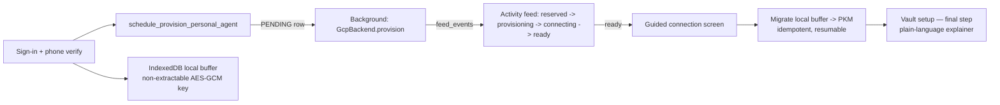

# Dev-live execution plan — real per-developer pods, local-first onboarding, vault last

**Status as of 2026-07-29:** authoritative, unexecuted. Nothing in this document has been
built. It is written so any engineer or agent can execute it end to end without further
context — every file path, env var, and command below was read from the live repository at
`claude/hushh-infrastructure-analysis-7o991c`, not inferred.

## Sources

- Companion architecture: [`ARCHITECTURE.md`](./ARCHITECTURE.md), [`ROADMAP.md`](./ROADMAP.md),
  [`BYOC-USER-GCP.md`](./BYOC-USER-GCP.md), [`SECURITY-REVIEW.md`](./SECURITY-REVIEW.md)
- This is a Tier-B doc under the Tier-A index [`README.md`](README.md) (`## Visual Map`
  lives there per the docs-governance gate; this file adds `## Visual Context` linking back).
- Kernel: `AGENTS.md` (Principal Craft Kernel + Bacterial Software Architecture Gate) —
  every workstream below inherits it by pointer, not by restatement.
- Standing practice: `skills/verify-before-claim/SKILL.md` (canonical skill center).

## Visual Context

Canonical visual owner: [personal-agent Visual Map](./README.md).



---

## 0. Why this document exists

Today, phone verification provisions **nothing**, for three independent, verified reasons:

1. `PERSONAL_AGENT_ENABLED` defaults `False` —
   `consent-protocol/hushh_mcp/runtime_settings.py` (`personal_agent_enabled()`, line 296
   as of this writing). The hook
   `schedule_provision_personal_agent()` in
   `consent-protocol/hushh_mcp/services/actor_identity_service.py`
   (`schedule_provision_personal_agent()`, starting line 86 as of this writing) returns on
   its first line (line 95-96) when this is off.
2. `PERSONAL_AGENT_BACKEND` defaults `""` → `resolve_compute_backend()` returns
   `NullBackend()` — `consent-protocol/hushh_mcp/services/compute_backend.py`
   (`resolve_compute_backend()`, line 167 as of this writing).
3. The six tables this surface needs do not exist in **any** environment. Five migrations
   sit in `consent-protocol/db/migrations/parked/` (900–904), absent from
   `consent-protocol/db/release_migration_manifest.json`, which
   `consent-protocol/db/migrate.py` resolves by flat filename join
   (`MIGRATIONS_DIR / filename`, `:1090`) against `ordered_migrations` — never a directory
   scan. Nothing under `parked/` is ever applied.

The dev deploy of this branch is green and the service is live at `dev.one.hushh.ai` and
`consent-protocol-aqahj4iyha-uc.a.run.app` — but that only proves the code loads and serves.
**No provisioning path has ever executed.** This document is the plan to close that gap,
honestly and incrementally, in `hushh-pda-dev` only.

## 1. Founder decisions (binding — do not relitigate mid-execution)

| Decision | What it means for this plan |
|---|---|
| Migrations are **dev-only** until a human explicitly promotes them | Cannot renumber 900–904 into the release manifest — that changes UAT/prod schema on their next deploy. Needs a parallel, dev-scoped manifest (Workstream A). |
| **Every** signed-in dev user gets a pod — no allowlist | No eligibility gate to build. Cost containment must come from pod-level economics (min-instances, caps, reaping), not from restricting who qualifies. |
| **Minimum onboarding friction**; vault is the **final** step with plain-language explainer screens | No passphrase or passkey ceremony up front. Local-first buffer, then background provisioning, then vault last. |

## 2. The two blockers that make this plan non-trivial

### 2.1 The migration manifest is global (verified against the gate itself)

`scripts/ops/verify_release_migration_contract.py`:
- `:35-36` resolves the repo's migration set via `MIGRATIONS_DIR.iterdir()` filtered to
  `path.is_file()` — **subdirectories are invisible to it**, which is why parking worked
  without breaking this gate.
- `:52` requires `highest_manifest_version == highest_repo_version` (manifest head must
  equal repo head).
- `:60` requires the UAT contract's `expected_migration_version` to equal the manifest
  head.

There is no way to add these tables to the release manifest without moving UAT/prod's
expected schema forward. **Workstream A therefore builds a second, dev-only migration
manifest and applier — additive to the existing tooling, not a replacement.**

### 2.2 No pod image exists anywhere (verified — confirmed absent)

`consent-protocol/Dockerfile.pod` and `consent-protocol/pod_server.py` exist as source, but
`grep -rln "Dockerfile.pod\|pod-image\|hushh-pod" .github/workflows/ deploy/ scripts/`
returns **zero matches**. No workflow builds or pushes a pod image to Artifact Registry.
`GcpBackend.provision()` reads the image reference from `HUSSH_ONE_POD_IMAGE`
(`gcp_backend.py:93`) — if that variable points at nothing that exists, every real
provision call fails at the Cloud Run API. **This is Workstream B's first blocking task.**

### 2.3 Cost lever that must not be missed

`GcpBackend.__init__` sets `HUSSH_POD_MIN_INSTANCES` default = **1**
(`gcp_backend.py:104-105`), documented at `:100-103` as intentional — "no cold start on the
agent endpoint." With **every signed-in dev user** getting a pod and min-instances = 1 by
default, N developers signing in means **N always-on billable Cloud Run instances**, not
N scale-to-zero services. This must be an explicit, informed choice for the dev tier, made
in Workstream B step 3 — not an accident of an unset env var.

---

## Workstream A — Dev-only migration lane

**Goal:** the six tables exist in `hushh-pda-dev`'s Postgres, and nowhere else, via a path
that is governed and auditable rather than a manual `psql` session.

### A1. Add a dev-scoped manifest

Create a new file `dev_migration_manifest.json` under `consent-protocol/db/`, same shape as
`release_migration_manifest.json` (verify the exact shape by reading that file's top-level
keys before writing — as of this doc: `manifest_name`, `ordered_migrations`, `groups`):

```json
{
  "manifest_name": "hushh-dev-extra-migrations",
  "ordered_migrations": [
    "parked/900_personal_agent_registry.sql",
    "parked/901_agent_prompt_versions.sql",
    "parked/902_personal_agent_tombstone_hushh_id_index.sql",
    "parked/903_webauthn_credentials.sql",
    "parked/904_consent_audit_receipts.sql"
  ]
}
```

Apply in this exact order — 902 adds an index onto a table 900 creates; 901/903/904 are
independent of each other and of 900, but keep the file order above since it matches the
numbering and was the order the tables were designed in.

### A2. Extend `migrate.py` with an additive `--dev-extra` flag

Read `consent-protocol/db/migrate.py` in full before editing — do not guess its structure.
Confirm the exact signature of `_load_release_manifest` (`:89`) and how
`migration_path = MIGRATIONS_DIR / filename` (`:1090`) is used, then add a parallel
`_load_dev_manifest()` that resolves `MIGRATIONS_DIR / "parked" / filename` and an
`apply_dev_extra()` step that runs **after** the release set, gated behind a new
`--dev-extra` CLI flag (default off, so every existing invocation is unchanged). Do not
change the default `--release` code path in any way — this is purely additive.

### A3. Wire only the dev deploy workflow

In `.github/workflows/deploy-dev.yml`, locate the step named "Apply dev DB migrations and
predeploy schema gate" (read its current invocation of `migrate.py` before editing) and add
`--dev-extra` to that one call. **Do not touch `deploy-uat.yml` or `deploy-production.yml`
in any way** — those files are in `protected_pipeline_paths` per `CLAUDE.md` and are
edit-restricted to the maintainer cohort regardless.

### A4. Fix the data-plane contract lifecycle status (already partially done)

`docs/reference/architecture/runtime-db-data-plane-contract.json` was corrected in commit
`e459487d6` to mark these tables `"lifecycle_status": "planned"`. Once A1–A3 land and the
tables are live in dev, update the entry for each table to reflect dev reality precisely —
e.g. `"lifecycle_status": "dev_only"` if that value is valid in the contract's schema, or
add a `"environments": ["dev"]` field if the schema supports one. **Read the contract's own
JSON structure first** — do not invent a field the validators do not expect. Regenerate
`contracts/architecture/runtime-topology-index.v1.json` via
`python3 scripts/ops/generate_runtime_topology_index.py` afterward, exactly as was required
after the previous contract edit.

### A5. Document the promotion path (write, do not execute)

Add a "Promotion to UAT/production" section to this document's own repo location once
written, or to `EXECUTION-LOG.md`, stating the exact manual steps for the day a human
decides to promote: renumber `900–904` → `122–126` (the next free slot after
`122_trusted_device_repair.sql`, confirm the actual next-free number at execution time
since main moves fast), `git mv` into `migrations/` proper, append to
`release_migration_manifest.json`, bump `expected_migration_version` in the UAT contract.
**Do not perform these steps as part of this workstream.**

### A execution note (known hazard)

A previous session hit a classifier that blocked `git mv` on migration files. If that
recurs: `git add` the new path, then `git rm` the old path, in two operations, rather than
retrying `git mv`.

### A verification

```bash
# 1. Reproduce the gate locally at CI-pinned behavior before touching prod-adjacent config
python3 scripts/ops/verify_release_migration_contract.py
# must still report: manifest head 121 (or whatever main's current head is), UAT match, no violations

# 2. Apply against dev Cloud SQL (requires dev DB credentials / Cloud SQL proxy — see
#    consent-protocol/docs/reference/dev-environment-setup.md for the proxy pattern)
python3 consent-protocol/db/migrate.py --release --dev-extra

# 3. Confirm the six tables exist in dev only
psql "$DEV_DB_URL" -c "\dt personal_agent_registry personal_agent_deletion_tombstones agent_prompt_versions webauthn_credentials webauthn_challenges consent_audit_receipts"

# 4. Confirm UAT/prod are untouched — the release contract must still pass unmodified
python3 scripts/ops/verify_release_migration_contract.py
echo "exit code must be 0 with manifest head unchanged from before this workstream"
```

---

## Workstream B — Real provisioning in dev

**Goal:** signing into dev as any hushh developer results in a real Cloud Run service in
`hushh-pda-dev`, attributed to the shared billing account, labeled for cost tracking, with
a hard fleet ceiling so a test loop cannot run away.

### B1. Build and push the pod image (the confirmed blocker — do this first)

No existing workflow does this. Add a new step or a new small workflow
(`.github/workflows/deploy-dev.yml` extension is simplest, to keep it in the same
governed dispatch path) that builds `consent-protocol/Dockerfile.pod` and pushes to the
same Artifact Registry repo the main backend image already uses in
`deploy/backend.cloudbuild.yaml` (read that file first to match its exact registry path,
tagging convention, and build-arg pattern rather than inventing a new one). Tag the pushed
image with the deploying SHA, mirroring how the main backend image is tagged.

Set `HUSSH_ONE_POD_IMAGE` in `deploy-dev.yml`'s env block to the resulting image URI.

### B2. Flip the three gates, dev-only

In `.github/workflows/deploy-dev.yml` env block (or via `sync_backend_runtime_secrets.py`
if that is the established path for this environment — check how the existing dev flags in
that step are set before choosing):

```
PERSONAL_AGENT_ENABLED=1
PERSONAL_AGENT_BACKEND=gcp
HUSSH_GCP_BACKEND_LIVE=1
HUSSH_ONE_POD_SERVICE_ACCOUNT=<a real dev-scoped SA — see B4>
```

Do **not** set these anywhere in `deploy-uat.yml` or `deploy-production.yml`.

### B3. Cost containment — make the min-instances decision explicit

Given every signed-in user gets a pod (founder decision), the default `min_instances=1`
(§2.3) means unbounded always-on cost as headcount grows. Set, in dev only:

```
HUSSH_POD_MIN_INSTANCES=0
HUSSH_POD_MAX_INSTANCES=1
```

This trades a cold start (~10s per the code comment at `gcp_backend.py:101-102`) for
bounded cost — the correct trade for a dev validation tier where instant response is not
the point. State this trade-off explicitly in the PR description when this ships; it is a
deliberate reversal of the code's own stated default rationale, and a future reader must
not think it was accidental.

Additionally add, as new settings alongside the existing ones in `runtime_settings.py`
(follow the exact pattern of `personal_agent_enabled()` — `_bool_from_value` /
`_clean_env`, default OFF or a numeric default, docstring explaining the fail-safe):

- `PERSONAL_AGENT_MAX_PODS` (e.g. default `50` for the dev team size) — checked in
  `personal_agent_provisioning_service.py` before calling `backend.provision()`; on breach,
  do not raise into the phone-verify path (it is fire-and-forget) — instead record a
  `provisioning_capped` feed event (Workstream C) and leave the registry row `pending`.

### B4. Service account and IAM (verify before first live call)

`gcp_backend.py:96-99` reads `HUSSH_ONE_POD_SERVICE_ACCOUNT`. Before flipping B2 live,
confirm in `scripts/ops/` (search for existing service-account provisioning scripts
following the pattern used for `consent-protocol-runtime@hushh-pda-dev.iam.gserviceaccount.com`,
which is already used by the main dev deploy per `.github/workflows/deploy-dev.yml`) whether
a pod-scoped SA already exists or must be created. The identity dispatching this workflow
needs `roles/run.admin` and `roles/iam.serviceAccountUser` scoped to that SA — verify the
current dev deploy SA's role bindings before assuming they're sufficient for creating a
second class of Cloud Run service.

### B5. Cost-attribution labels

`gcp_backend.py:163-168` already sets `app`, `hushh-space-id`, `hushh-tier` labels on every
created service. Extend that dict (same call site) with:

```python
"hushh-env": "dev",
"hushh-purpose": "dev-validation",
```

Do not add a per-user label containing PII (email, raw phone) directly on the GCP resource
— `hushh-space-id` already exists as the non-PII identifier; use it for cost attribution
per developer via Cloud Billing export joined against the registry table server-side,
not via GCP labels.

### B6. Fleet hygiene

Model a `personal_agent_reconcile_worker` on `consent-protocol/hushh_mcp/services/revocation_worker.py`
(read that file's `start_revocation_loop` pattern in full before writing this — reuse its
loop/backoff/logging shape exactly). It should:
- Sweep `personal_agent_registry` rows in `provisioning_failed` and retry.
- Sweep pods idle beyond a threshold (define via a new `HUSSH_POD_IDLE_REAP_HOURS`,
  default e.g. `168` = 7 days) and deprovision them — the registry row survives, only the
  Cloud Run service is torn down; re-provisioning on next activity is intentional.
- Emit feed events for both actions (Workstream C).

Add a GCP budget alert on the `hushh-pda-dev` project as an ops action (not code) —
document the exact console steps or `gcloud billing budgets create` invocation in
`docs/reference/operations/dev-fast-lane.md` once B is live.

### B verification

```bash
# 1. Confirm the pod image exists post-build
gcloud artifacts docker images list <registry-path-from-B1> --project hushh-pda-dev

# 2. Sign in as a real dev user in the dev webapp, verify phone
# 3. Confirm exactly one Cloud Run service was created, with the correct labels
gcloud run services list --project hushh-pda-dev --filter="labels.hushh-env=dev" --format=json

# 4. Confirm the registry row
psql "$DEV_DB_URL" -c "select user_id, hushh_id, status, anypoint_agent_id, a2a_route from personal_agent_registry order by provisioned_at desc limit 5;"

# 5. Idempotency: repeat sign-in/verify for the SAME user; assert still exactly one service, one row
# 6. Teardown: delete the account; assert the Cloud Run service is gone and a tombstone row exists
psql "$DEV_DB_URL" -c "select * from personal_agent_deletion_tombstones order by created_at desc limit 5;"

# 7. Fleet cap: provision past PERSONAL_AGENT_MAX_PODS; assert the (N+1)th stays 'pending', not an error surfaced to the user
```

---

## Workstream C — Background provisioning surfaced in the activity feed

**Goal:** every state transition of provisioning is visible in the existing One activity
feed. Reuse the existing event system completely — do not build a second one.

### C1. Reuse `FeedService.record_event`

Signature and write path: `consent-protocol/hushh_mcp/services/feed_service.py`
(`record_event()`, line 47 as of this writing), which inserts into the `feed_events` table
(line 67). Read the full method signature (parameters,
required fields) before calling it — do not assume its shape from this description.

Call `record_event()` from the provisioning lifecycle points already present in
`personal_agent_provisioning_service.py` and `actor_identity_service.py`:
`reserved` (registry row created, before any backend call) → `provisioning` (backend
`provision()` call started) → `connecting` (Cloud Run service created, waiting on health)
→ `ready` (health check passed, `a2a_route` resolvable) → on any failure, a distinct
`provisioning_failed` event carrying a user-safe reason (never a raw exception message —
apply the same fail-safe posture already used at `personal_agent.py:66-68`, which catches
and logs rather than leaking internals to the response).

### C2. Extend the feed's typed event vocabulary

`hushh-webapp/lib/feed/feed-item-renderers.tsx` renders by a `switch (item.event_type)`
(`:58` onward, cases like `consent_requested`, `location_share_created`). Add new cases for
`personal_agent_reserved`, `personal_agent_provisioning`, `personal_agent_connecting`,
`personal_agent_ready`, `personal_agent_failed` following the exact `FeedItemPresentation`
shape the existing cases return (read 2–3 existing cases fully before writing the new ones,
to match title/body/icon/action conventions precisely).

### C3. Read path — already built, no changes needed

`GET /api/one/feed`, `/feed/unread-count`, `/feed/read` at
`consent-protocol/api/routes/one/feed.py` (`list_feed`/`feed_unread_count`/`mark_feed_read`,
lines 20, 32, 40 as of this writing) and the client at
`hushh-webapp/lib/services/feed-service.ts` and
`hushh-webapp/lib/feed/use-feed-unread-count.ts` already implement the full read/poll/mark-read
cycle. Confirm the frontend feed list component that renders `presentFeedItem()` output
before assuming a new UI surface is needed — it is very likely an existing feed view just
starts showing new cards once C1/C2 land.

### C4. Extend `GET /api/one/personal-agent/status`, do not duplicate it

`consent-protocol/api/routes/one/personal_agent.py` (`personal_agent_status()`, lines 55-80
as of this writing) already implements a deliberately
ungated, fail-safe status endpoint (`state: reserved | active`). Extend its `state`
vocabulary to include the intermediate states (`provisioning`, `connecting`) by reading the
same registry row's `status` column, rather than adding a second endpoint.
`hushh-webapp/components/dashboard/one-agent-presence.tsx` is the existing consumer — read
its current state-handling switch before adding new states so the UI degrades sensibly for
states it doesn't yet render.

### C verification

- Trigger a real provision (Workstream B done); assert `feed_events` gains one row per
  transition, each visible in the frontend feed within one poll interval.
- Kill a provision mid-flight (revoke SA permission temporarily in a test project, or use
  the injectable `client=` param on `GcpBackend` in a unit test) and confirm exactly one
  `provisioning_failed` event, not a silent stall.

---

## Workstream D — Local-first onboarding, vault last

**Goal:** zero added friction during sign-up. Data lives client-side, encrypted, until the
pod is `ready`; then it migrates into PKM; vault setup is the last screen, explained so
plainly a child could follow it.

### D1. Local store — reuse, do not reinvent

`hushh-webapp/lib/services/secure-resource-cache-service.ts` already opens an IndexedDB
database (`window.indexedDB.open(DB_NAME, DB_VERSION)`, `:24-29`) and exports
`SecureResourceCacheService` (`:97`). Read this file in full before extending it. Add a
user-scoped object store or key-namespace (bind every record to the Firebase UID) so
records cannot leak across accounts on a shared device — verify the current schema does not
already assume single-user-per-browser before adding this.

### D2. Local encryption key

Generate a **non-extractable** AES-GCM `CryptoKey` via `crypto.subtle.generateKey` with
`extractable: false`. Persist only the key's storage handle (IndexedDB's own key-object
support, or `crypto.subtle.wrapKey` if a wrapping key is needed for cross-tab access — read
`hushh-webapp/lib/one-location/encryption.ts` first, since it already implements
AES-GCM helpers in this codebase and the new code should match its function signatures and
error-handling conventions rather than introduce a second crypto style). This key never
leaves the browser and requires no user interaction — the entire point is zero friction.

### D3. Buffer → PKM migration (idempotent, resumable)

On the feed reaching `ready` (Workstream C), show a single guided-connection screen, then
migrate every buffered record into PKM via the existing PKM write path (locate the current
PKM write service — likely under `hushh-webapp/lib/services/` given the naming pattern of
`kyc-pkm-write-service.ts` found during exploration; confirm its exact export before
calling it). Each buffered record needs a stable client-generated ID so a retried migration
after a partial failure does not duplicate; only clear the local IndexedDB record after the
server acknowledges the write for that specific ID.

### D4. Vault — resequence, do not rewrite

`hushh-webapp/lib/services/vault-bootstrap-service.ts` and
`hushh-webapp/components/vault/vault-flow.tsx` already implement multi-mode bootstrap
(native biometric, native passkey, web PRF — read the full type union at
`vault-bootstrap-service.ts:18-33` before touching call sites). The only change is **when**
this flow is entered: move its trigger from wherever it currently sits in the onboarding
sequence to the point immediately after D3 completes. Locate the current onboarding
step-sequencing component first (search for the screen that currently invokes
`vault-flow.tsx`) and change only the sequencing, not the vault logic itself.

### D5. Explainer screens

Plain language, one idea per screen, per `CLAUDE.md`'s Apple-bar and emoji-policy rules
(only 🤫 and country flags in customer-facing copy). Minimum three screens: (1) what the
vault is — "a locked box only you can open"; (2) why only the user can open it — "we never
see inside, not even us"; (3) what happens if skipped — set an honest expectation rather
than hiding the consequence. Write copy as if narrating to a six-year-old without being
condescending to an adult — short sentences, no jargon, no hedging.

### D verification

- With the backend network call mocked to fail, confirm data persists in IndexedDB and
  inspect the raw stored bytes in browser devtools to confirm ciphertext, not plaintext.
- Restore the network; confirm every buffered record lands in PKM exactly once (assert via
  a duplicate-ID check server-side).
- Confirm no vault-related network call fires until D3 has completed for that user.
- Walk all three vault bootstrap modes end to end from the resequenced entry point.

---

## Workstream E — Dev as a production-grade environment

- Dev already runs the identical `CI Status Gate` used for PRs (secret scan, DCO,
  governance, base freshness, protocol, web core/targeted, integration, MCP package) —
  confirmed via this branch's own CI runs. Keep every one of these on for this work; do not
  add a bypass.
- Extend `GET /health/ready` (`consent-protocol/api/routes/health.py`) with an optional
  pod-fleet health signal — e.g., count of `provisioning_failed` rows beyond a threshold —
  so a broken fleet shows in the existing readiness check rather than needing a separate
  dashboard. Read the current `/health/ready` gate structure in full before adding to it,
  to match its existing dependency-check pattern.
- Add a "Pod fleet" section to `docs/reference/operations/dev-fast-lane.md` covering:
  how to list the fleet, how to force-reap a specific pod, how to read the reconcile
  worker's logs, and the manual rollback procedure (flip `PERSONAL_AGENT_ENABLED=0` in
  `deploy-dev.yml` and redeploy — confirm this alone is sufficient to stop new
  provisioning without needing to touch existing pods).

---

## Workstream F — Future Planner skills: live, not speculative

**Goal:** the skills that talk about this workstream describe it as real and running in
dev, not as a planning exercise; and they trigger on both keyword match and contextual
understanding of what's being asked.

### F1. The specific reframe needed

`.codex/skills/future-planner/SKILL.md` currently states its own scope as:

> "Trigger on future roadmap concepts, R&D architecture notes, assistant-evolution ideas,
> external trend fit questions, and **planning-only concept docs that must stay separate
> from `vision` and active implementation**."

That last clause is precisely backwards for this workstream once Workstreams A–E ship: this
plan is not a planning-only concept, it is an active-implementation document with a real
deployment target. Do not edit `future-planner`'s scope to claim ownership of live
infrastructure — instead, once A–E are live, this document and its companions in
`docs/future/personal-agent/` should be **moved or re-indexed** out of the "future" framing
(the directory name itself, `docs/future/`, signals speculative — confirm with the founder
whether the whole `personal-agent` cluster should relocate once dev-live, rather than doing
this unilaterally, since it changes a well-established documentation map).

### F2. Keyword + contextual triggering

Per `AGENTS.md`, skills inherit the kernel by pointer, not by restatement — so this is
about the skill's own `description` field, not about copying kernel doctrine into it. Read
`.codex/skills/codex-skill-authoring/` in full to get the exact schema contract for a
`SKILL.md` description before editing any skill, and read
`.codex/skills/agent-orchestration-governance/scripts/delegation_router.py` to understand
exactly what it scores on (keywords, `risk_tags`, `required_reads` — confirm the real field
list from the script itself) before writing new trigger text for any skill, including
`future-planner` and `planning-board`. Do not write speculative trigger text — verify what
the router actually reads and matches against.

### F3. Generated-file hazard (binding constraint, verified this session)

`.claude/agents/*.md` are **generated** from `agents/*.toml` via the sync script at
`.codex/skills/agent-orchestration-governance/scripts/sync_claude_agents.py`, run with
`--write`. **Never hand-edit a file under `.claude/agents/`.** Edit the
source `.toml` and re-run the sync script; a hand-edit to the generated `.md` silently
disappears on the next sync and is a wasted, invisible change.

### F verification

- Run the delegation router against 3–5 sample prompts that use no exact keyword from the
  skill's `description` but are clearly about this workstream in context (e.g. "why hasn't
  my dev pod started"), and confirm it still routes to the correct lane. If it does not,
  the trigger text needs contextual phrasing added, not just more keywords.
- Confirm `sync_claude_agents.py --check` (or equivalent dry-run flag — read the script to
  find it) reports no drift after any `agents/*.toml` edit.

---

## Sequencing and dependencies

```
A (migration lane) ──┬─→ B (real provisioning) ──┬─→ C (feed events)
                      │                            │
                      └────────────────────────────┴─→ D (local-first + vault last)
                                                         (D does not block on C, but the
                                                          "guided connection" screen in D3
                                                          reads richer if C ships first)
E and F run in parallel with D — no code dependency, but F2/F3 should be verified against
whatever new skill/agent text A–E's own execution produces, so the trigger set stays current.
```

**A must complete before B** — provisioning against non-existent tables fails at the first
`INSERT`. **B must complete before C has anything real to report on.** **D is independently
buildable** (IndexedDB + vault resequencing touch no backend surface) but its value is
partial until C exists to tell the user their pod is ready.

## Global success criteria

1. `verify_release_migration_contract.py` still reports UAT/prod manifest head unchanged —
   dev-only held.
2. A real hushh developer, signing into dev with no prior account, ends up with: a local
   IndexedDB buffer during onboarding, a live Cloud Run pod with correct cost labels, feed
   events for every transition, PKM records migrated exactly once, and a vault created only
   at the very end via an unmodified `vault-bootstrap-service.ts`.
3. Deleting that account removes the Cloud Run service and leaves a tombstone.
4. All existing CI gates remain green: `scripts/ci/repo-governance-check.sh`,
   `scripts/ci/docs-parity-check.sh`, `scripts/ci/protocol-check.sh`.
5. Nothing in `deploy-uat.yml`, `deploy-production.yml`, or the release migration manifest
   changed.

## Explicit non-goals (do not do these as part of this plan)

- Do not promote the parked migrations to the release manifest.
- Do not implement the Anypoint or `user_gcp` (BYOC) backends beyond their current
  scaffolding — both still raise `NotImplementedError` live (`anypoint_backend.py:176`,
  `user_gcp_backend.py:247`) and are out of scope here.
- Do not add a per-user PII label to any GCP resource.
- Do not hand-edit any file under `.claude/agents/`.
