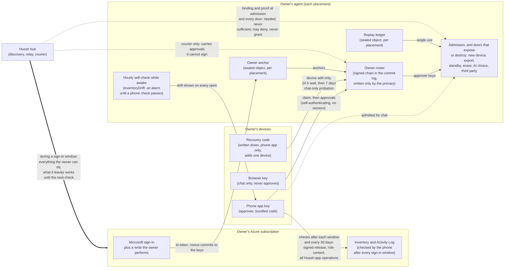

# Owner co-signature: from "Hussh does not read your agent" to "cannot"

**Status:** design only, revised 2026-10-06 (fifth round, after an independent security
review refused the fourth). The founder asked for the work to be completed. Nothing here
is built. Inherits `docs/reference/architecture/private-agent-north-star.md` by pointer;
where this page and the north star disagree, the north star wins and this page moves.
Builds on `docs/reference/architecture/byoc-azure.md`,
`docs/reference/architecture/bring-your-own-ai.md`,
`docs/reference/architecture/pod-migration.md` and
`docs/future/personal-agent/STANDBY-SYNC.md`.

**What changed in the fourth revision, in one paragraph.** The third revision still
overclaimed in five places, and the fourth fixed each. Code a sign-in window installs keeps running after
the window, so the phone now checks a release signature in stage 1, not only stage 2, and
every stage 1 "Cannot" says that what a window leaves behind works until the next check
finds it (B1; L10 moves into stage 1). Hussh's own custom roles can be rewritten to give
its standing app full control without changing a single role assignment, so the checks now
compare role *content*, and also look for delegation to Hussh's tenant (B2). A device added
with the recovery code could revoke every owner phone after 24 hours; it now gets a chat
ceiling with no revoke, config, update or file-delete scope, and removing someone else
needs a phone approval (B3). An operator that locked first could add the owner's phone and
hide; the phone now accepts a lock only if it can trace it to its own claim (B4). A sign-in
Hussh's server builds can ask for a refresh token, and a sign-in the owner already consented
to can complete with no screen at all, so the app pins the whole request, every check now
reviews everything since the last one, and stage 2 "can't read" requires that no Hussh app
still holds the owner's Azure consent (B5). Effort rises again (16).

**What changed in the fifth revision.** The fourth could show a reassurance while the
agent itself was reporting evidence of compromise: when the agent's own check found a
Hussh role widened (`inventoryDrift`), the phone still showed the stage 1 sentence, and
that sentence did not require Hussh to lack standing deploy rights, so a Google Cloud
agent could earn it against F5. Now drift is an alarm that sends the owner to run a check,
it stays set until a phone check passes and the phone signs that it saw the new state, and
the stage 1 sentence needs Azure, no drift and no standing code write (B-new-1, 4.8, 13).
Also: the template check now compares against an env contract carried in the signed
release instead of whatever the hub's process environment happens to hold (4.8 item 1);
the phone pins the release signer's repository, branch and workflow path (12.2); the agent
signing secret Hussh's server generates at setup is named as a window leftover no check can
see, and no locked-agent authority may rest on it (R13); roster approvals need no session,
and the public chain view shows pending resets (4.9, 8.1); a per-route table says what a
browser or recovered device may still do (7.6); consent removal covers every owner-lock
sign-in, including the grant that removal itself uses (12.2); the sign-in request check
names `state` and `code_challenge_method` (4.3); and the calendar is recomputed. Stage 1
is now 31.75 to 33.25 engineer-days (16).

---

## Visual Map



---

## One-page summary (read this first)

**The problem in one sentence.** Today your agent decides who "you" are by trusting a
note that Hussh's server signs, so a compromised or dishonest Hussh server could add
its own device, ask your agent questions as you, or copy everything out. We can promise
Hussh *does not*; we cannot yet promise Hussh *cannot*.

**The fix in one sentence.** The Hussh app on your phone locks your agent to your phone's
key, checked against your own Microsoft (or Google) account, and from then on anything
that could expose or destroy your records needs your phone's approval. Hussh's signature
alone stops being enough for anything that matters.

**The one condition that runs through everything.** Whoever can write your agent's Azure
resources can replace its code, and new code can ignore any lock. Hussh's server can
write them whenever it holds a Microsoft sign-in you gave it: in stage 1 that is every
setup, update, re-create, teardown and standby setup (a *sign-in window*, 2.3), plus any
Microsoft sign-in for Hussh that a web page opens in a browser where you are signed in to
Microsoft, which can happen with no screen at all (R8). Inside a window, Hussh *can*. What
a window leaves behind (different code, a back door, a rewritten role) **keeps working
after the window closes, until your phone's next check finds it**. The phone checks right
after every update and at least every 30 days, reviews everything done in your Azure by a
Hussh app since its last check, and verifies the agent runs a signed release. So every
"Cannot" below means: cannot outside a window, and anything a window left behind is found
at the next check, though what was read before then stays read. Stage 2 moves every window
onto your phone and has you remove Hussh's standing Azure consent, so a sign-in for Hussh
outside the phone app then shows a Microsoft consent screen you can refuse (R8).

**What you will notice**

| Moment | What you see |
|---|---|
| Setup | One extra step in the Hussh phone app at the end of setup: "Lock your agent to this phone." A Microsoft sign-in, a recovery code to write down, then done. |
| New phone or browser | "Approve this device from your phone." The new device shows a code; your phone shows the same code; you tap Approve. |
| An update (stage 1) | Same as today, but started from the phone app; then "Check your agent" on the phone: a Microsoft sign-in right after the update, and one more the next day. |
| Every month or so | "Check your agent": one Microsoft sign-in, a few seconds. Skipping it for 30 days drops the wording to "doesn't read"; skipping it for 90 leaves a gap that can never be checked. |
| Moving or deleting your agent, changing your AI key | Same as today, plus a confirm on your phone. |
| Lost every device | Type your recovery code into the Hussh app on a new phone. After 24 hours it can read and chat (nothing more); after 7 more days it can approve. Or sign in to Microsoft and wait 72 hours. Your phone, if you still have it, can cancel either. |

**It arrives in two stages, and the wording follows the stage.** "Window" means a sign-in
window (2.3), including one a web page opens (R8). "Next check" means the phone's check
(12.3), run after every update and at least every 30 days.

| A compromised Hussh server tries to... | Today | After stage 1 | After stage 2 |
|---|---|---|---|
| Add its own device and read your records | Can | Cannot outside a window; what a window leaves behind works until the next check | Cannot, once no Hussh app holds your Azure consent (F13), unless you accept a Hussh consent screen outside the phone app (R8) |
| Ask your agent questions as you, through Hussh's relay or the third-party door | Can | same as above | same as above |
| Copy your whole agent out (move or standby copy) | Can | same as above | same as above |
| Change which AI key your agent uses | Can | same as above | same as above |
| Undo your removal of a lost device | Can | same as above | same as above |
| Delete your agent | Can | same as above (only you, or whoever owns your cloud account) | same as above |
| Anything you can do in Azure: put different code in your agent, copy its Azure identity, rewrite Hussh's own role, give itself access to its key | Can | **Can during a window, and what it leaves keeps working until the next check.** The check verifies a signed release and the exact shape of every grant, and names every operation by a Hussh app that your phone did not start (12.3). It cannot undo a read | **Only through R8**, then found by the next check the same way |
| Lock a new agent to its own keys before your phone does | n/a | **Can during a window.** Your phone knows whether the lock is its own, even if the other lock later adds your phone, and tells you to delete the agent (4.9) | Cannot: your phone writes your key into the agent when it creates it (4.10) |
| Remove the lock, so the agent looks unlocked again | n/a | **Can during a window** (it can rewrite the agent's storage). Your phone remembers the lock and raises an alarm (4.9) | Only through R8, then the same |
| Start a cloud reset that takes over in 72 hours | n/a | **Can from a window.** Shown on your phone for 72 hours; your phone can cancel two in 30 days (F7) | Only through R8, then the same |
| Use your recovery code | n/a | Hussh's servers keep no copy. Whoever has the code can read and chat with your agent if no phone of yours cancels within 24 hours; it cannot remove your phones, change settings or delete files; it can approve things after 8 days unless a phone removes it (R3) | same |
| Confirm a connector write the agent proposed (mail, Drive) | Can | Can (outside this promise; listed, R10) | Can (same) |
| Read what a web browser you use reads, by changing the page for one visit | Can | **Can** | **Can** (only the phone app is fixed per release) |
| Ship a bad release to everyone | Can | Can | Can, but it is signed and on a public log (R1) |
| Stop your agent working | Can | Can | Can (we never promise availability) |
| Read things Hussh holds for you anyway (mail logins, managed voice, calendar and mail reads that run through Hussh) | Can | Can | Can (outside this promise; the agent lists them, R10) |

**What we may say, and when** (the agent and the phone compute this; section 13)

| When | Sentence |
|---|---|
| Today, and any agent not locked | "Hussh does not read your agent." |
| Stage 1, Azure only, locked, last check passed within 30 days, every day since setup reviewed, the agent reports no drift, and Hussh holds no standing deploy right | "Hussh's servers can't add a device to your agent, copy it, delete it or talk to it as you without your phone's approval, except while they hold an Azure sign-in you gave them. Anything such a sign-in leaves behind is found by your phone's next check; the last one passed on *date*." Not "can't read". |
| Stage 1 as above, but the setup is older than Azure's 90-day record | The stage 1 sentence plus "Your agent's setup on *date* is too old for Azure's records, so it could not be checked. Set it up again to close this." (N3) |
| Stage 2, locked, every check passed, no web browser admitted, nothing run through Hussh, no Hussh app holds your Azure consent | "Hussh can't read your agent." Always shown with three limits: a Microsoft consent screen for Hussh anywhere but the phone app is a warning, refuse it (R8); act on a recovery alert within a day (R3); releases are public and the same for everyone (R1). |
| Stage 2 as above, but you use features that run through Hussh | "Hussh can't read your agent, except what you use through Hussh: *list*." Same three limits. |
| Any stage, a web browser admitted | Stage 1 sentence at most, plus "A browser can read your agent, and web pages are code Hussh serves on each visit." |
| Your phone found someone else's lock, a lock that vanished, or a failed check | No reassurance at all; the reason in plain words and what to do. |
| Your agent reports a change in its own Azure setup that no phone check has looked at yet (`inventoryDrift`) | No reassurance at all: "Your agent noticed a change in its Azure setup: *what*. Check your agent now." It stays until a check passes. |
| A Google Cloud agent, or any agent Hussh can still deploy to at will | "Hussh does not read your agent." (F5) |

**Honest limits, stated once**

1. **Sign-in windows (R9).** In stage 1, every setup, update, re-create, teardown and
   standby setup hands Hussh's server your Azure sign-in, and with it everything you can
   do in Azure. What it leaves behind works until the phone's next check. The phone
   detects; it does not prevent.
2. **Hussh controls its own Microsoft app registrations (R8).** While a Hussh app holds
   your Azure consent, any web page that sends your browser to Microsoft, in a browser
   where you are signed in to Microsoft, can hand Hussh your Azure sign-in with no screen
   at all, including any visit to Hussh's own web app. Stage 2 has you remove that
   consent, so the same attempt then shows a Microsoft consent screen naming Hussh, which
   you refuse anywhere but the phone app. The checks find any window either way, later.
3. **Recovery (R3).** A recovery code someone else holds lets them read and chat with your
   agent if none of your phones cancels within 24 hours, and approve after 8 days if none
   removes the device. Hussh's servers keep no copy of it.
4. **Hussh writes the software (R1).** Co-signature stops a compromised Hussh *server*.
   It does not stop a bad *release*. From stage 1 every agent release is signed and
   publicly logged and the phone refuses an unsigned one, and phone app releases go
   through store review, so a bad release is traceable. It can still behave differently
   for one person, which only someone reading the image would notice.
5. **Web pages (R7).** Hussh can change them for one person on one visit. A browser can
   chat with a locked agent but never approve, and while one is admitted the agent will
   not say "cannot".
6. **Azure first.** Google Cloud keeps "does not" until Hussh's standing deploy
   permission there becomes per-use (lane L12). Hussh's hosted and shared tiers never say
   "cannot".
7. **The agent's signing secret (R13).** Setup generates the agent's `APP_SIGNING_KEY` on
   Hussh's server. Nothing can show whether the server kept a copy. So on a locked agent
   no admission step, owner door or approval accepts anything signed with it, and a test
   holds that line; it still signs mail receipts on the connector-write path, which is
   outside the promise anyway (R10).

**Effort, honestly.** The co-signature mechanics I first quoted at 2 to 4 days are lanes
L1, L3 and L4 (now 7.5 engineer-days with tests). **Stage 1 is 31.75 to 33.25
engineer-days, about 12.5 working days with three engineers, up to 13.5 with ordinary
slippage, plus one App Store and Play review.** It grew from 28.75 because the template
check needs a signed env contract (1.5 to 2 days), signer pinning in the release check
needs certificate rules and a trust-root update path (0.5), and the per-route ceilings,
the drift alarm and its acceptance step add about a day. **Stage 2 adds 17.75
engineer-days** (19.25 once STANDBY-SYNC is built, which is its own uncosted project),
most of it moving about 2,800 lines of Azure setup and update code from Hussh's server
onto the phone and building re-create and teardown, which do not exist today: **about 21
to 23 working days in all, plus a second store review.** Treat every figure as a floor:
twenty-three behaviours are still unmeasured (section 17).

**Decisions this design asks you to confirm** (each has a recommendation)

| # | Decision | Recommendation |
|---|---|---|
| F1 | A locked agent talks to you only directly from your devices, never through Hussh's relay. | Yes. Otherwise the relay is a back door. |
| F2 | Locking starts your device list fresh; each other device is approved once. | Yes. Earlier devices were vouched for by Hussh alone. |
| F3 | Recovery: a code you write down, never stored in the Vault or typed into a browser. After 24 hours the recovered phone reads and chats, with no power to revoke devices, change settings, update or delete files; after 7 more days it approves. With only a cloud sign-in, 72 hours. | Yes. Keeping the key in the Vault let Hussh reach it through the web Vault page (R3). |
| F4 | If your Hussh sign-in disappears, Hussh no longer erases a locked agent in your cloud; it removes its own access and leaves your resources to you. | Yes. |
| F5 | Google Cloud agents keep "does not" until L12, and never show the stage 1 sentence while Hussh holds standing deploy rights (13, rule 4). | Yes. |
| F6 | Only the Hussh phone app can lock the agent or approve anything. Browsers can chat but never approve. | Yes. A browser runs code Hussh can change per visit. |
| F7 | Your devices can cancel a cloud reset twice in 30 days; a third reset in that period runs its 72 hours and cannot be cancelled. | Yes, knowing the cost: a dishonest Hussh with three sign-in windows in 30 days could complete one, shown on your phone the whole time (R9). Whoever owns your cloud account can already replace the agent's code, so a device list cannot honestly outrank them. |
| F8 | The third-party agent door (`/api/one/a2a/message`) is closed on a locked agent until owner-signed grants exist (L13). | Yes. It currently runs your agent on Hussh's word alone. |
| F9 | Stage 1 asks for two phone checks after every update or other sign-in window (one right after, one the next day) and one check at least every 30 days, each reviewing everything Hussh's apps did since the previous check. | Yes. A sign-in Hussh's server held can stay usable for about 28 hours, and a window opened by a web page (R8) is known only from the log. Azure keeps the log 90 days, so a longer gap can never be reviewed. |
| F10 | Stage 2 moves the agent from a separate Azure identity to one built into the agent itself (system-assigned). | Yes. A built-in identity cannot be given to other machines or trusted to another sign-in issuer, which closes two back doors outright. |
| F11 | Signed releases (L10) move into stage 1, so the phone can tell a real release from substituted code at every check. | Yes. Without it, code a window installed passes every stage 1 check (B1). Adds 3.5 to 4.5 days to stage 1, including the signer pins of 12.2. |
| F12 | On a locked agent, every hub-run window starts from the phone app, never from a web page. | Yes. The app's check of the Microsoft sign-in request (4.3) only means something when the app runs it; a web page running the same check is code Hussh serves. |
| F13 | Stage 2 "can't read" requires that no Hussh app still holds your Azure consent; the phone removes it after each phone-run window, or tells you how. | Yes. While a consent stands, any page load can open a window silently (R8). |
| F14 | Reviewed connector writes the agent proposes (mail, Drive), which run once Hussh's action ledger says "consumed", stay outside the promise for now and are listed in custody whenever a connector is in use. | Yes, for now, knowing the cost: on a locked agent Hussh's server could confirm a write the owner never saw. An owner-signed confirm from the phone closes it (L16, 1.5 days, after stage 1). |

---

## 1. What the code does today (verified 2026-10-05 and 2026-10-06)

Every finding below was read in source on branch
`claude/hushh-infrastructure-analysis-7o991c` (first at `99808cdb7`, rechecked at
`5988efbde` for items 15 to 27, and in the working tree at `fd35ac439` for items 28 to
30).

1. **Who the owner is comes from the hub.** `PodBindingService.issue`
   (`consent-protocol/hushh_mcp/services/pod_binding_service.py`, line 250) signs a
   `pod_binding_v1` for any *active* trusted device of the account, Ed25519 under the
   consent-token key. The trusted-device list is the hub's own database, and
   `/api/account/trusted-devices/self-enroll` adds a key on the strength of a Firebase
   sign-in (`hushh-webapp/lib/services/owner-pod-endpoint.ts`,
   `ensureAppEnrollmentUnlocked`). Hussh can mint a Firebase custom token for any uid, so
   a Firebase sign-in is not independent of Hussh.
2. **The agent admits whatever the hub signed.** `PodSessionAuthority.verify_binding`
   (`consent-protocol/hushh_mcp/services/pod_session_authority.py`, line 378) checks the
   hub signature, owner, environment, deployment, role, expiry, tombstone and version,
   then `admit` (line 456) records trust and mints a 12-hour `pst1.` session. An `app`
   role carries `files.read`, `files.manage`, `pkm.read`, `pod.config`, `pod.status`,
   `pod.revoke`, `pod.upgrade` (`APP_SCOPES`). So a hub-minted binding for a hub-held key
   is a direct read of the agent.
3. **A revoked device comes back on the hub's word.** The replay rule in
   `consent-protocol/hushh_mcp/services/pod_authority_store.py` (line 22): "a newer
   hub-signed binding (version above the tombstone) re-admits the subject". The passing
   test `test_a_higher_version_binding_readmits_a_tombstoned_subject` encodes it.
4. **Owner turns through the relay trust the hub as the consent oracle.**
   `pod_turn_route` (`consent-protocol/api/routes/one/pod_turn.py`, line 898) accepts
   `X-Consent-Token` and `_validate_consent` (line 234) asks the hub whether it is valid
   (`consent-protocol/hushh_mcp/services/pod_consent_client.py`). `pod_memory.py` and
   `pod_live_relay.py` use the same header. `pod_commands.py` uses a different transport
   with the same oracle: `require_owner_scope` (line 241) on a token from the body or the
   bearer header. A dishonest hub answers "valid" and asks the agent "what do you remember
   about me?".
5. **Export opens on hub proof alone.** `POST /pod/migration/export`
   (`consent-protocol/api/routes/one/pod_migration.py`, line 340) checks
   `_require_hub_caller` (line 99) and seals every record to the caller-supplied
   `recipientPublicKey`.
6. **Standby export is a full export too.** `POST /pod/sync/export`
   (`consent-protocol/api/routes/one/pod_sync.py`, line 168) seals the records after
   `base_seq` to `standby_public_key`, always up to the current head; with `base_seq = 0`
   that is everything.
7. **Role change is hub-only.** `POST /pod/sync/set-role` (line 315) can demote a primary
   to standby pinned to any primary signing key, after which `POST /pod/sync/import`
   (line 250) appends a range that key signed (STANDBY-SYNC E5 names this residual).
8. **Erasure is hub-only.** `fence_erasure` (line 231), `crypto_erase_pod` (line 246) and
   the two memory routes share `_require_erasure_caller`: hub proof plus matching
   service and revision.
9. **AI selection already refuses hub tokens, but not hub-minted sessions.**
   `_owner_local_door` (`consent-protocol/api/routes/one/pod_ai_selection.py`) returns
   `403 OWNER_SESSION_REQUIRED` for a hub token, but the session it accepts comes from
   point 2.
10. **There is a working precedent for owner signatures.** The tombstone courier
    (`PodBindingService.courier_tombstone`, `pod_binding_service.py` line 430, and
    `apply_pending_tombstones`, `pod_session_authority.py` line 678) carries an intent
    signed by an app-role device key, and the agent verifies it against its *own* trust
    record. It has no freshness check: an intent is applied whenever it arrives.
11. **Cloud authority differs by provider.**
    * Azure: Hussh's standing role is "read plus revision restart" and an ABAC-limited
      access-removal role (`byoc-azure.md`, *Trust matrix*). The agent's managed identity
      holds five data roles and **no Reader**
      (`consent-protocol/hushh_mcp/services/azure_setup_roles.py`).
    * Google Cloud BYOC: the hub keeps `roles/iam.serviceAccountTokenCreator` on a
      bootstrap account holding `roles/run.admin`, `roles/cloudkms.admin`,
      `roles/resourcemanager.projectIamAdmin` and more until the owner revokes it
      (`user_gcp_backend.py`, `user_gcp_bootstrap.py`).
12. **The Entra sign-in is run by the hub.** `azure_entra_authorizer.py` builds the
    authorize URL, derives the PKCE verifier from server state and redeems the code
    server side, returning to a web page (`redirect_uri()`, line 107, from
    `HUSSH_AZURE_OAUTH_REDIRECT_URI`). No nonce is used. The app registration lives in
    Hussh's tenant, so Hussh's operators can change its redirects. `begin` (line 185)
    asks for no `offline_access` today (comment at line 213), but the server builds the
    URL, so nothing outside the server enforces that. The ARM leg sends `login_hint`
    and no `prompt` (lines 219 to 221), "so Microsoft does not ask again". It is the
    same app registration as Hussh's standing service principal (`byoc-azure.md`,
    *Microsoft Entra, the Hussh app registration*), so the hub's delegated calls and
    its standing calls carry one app id.
13. **Browser device keys are WebCrypto P-256, non-extractable, in IndexedDB**
    (`owner-pod-endpoint.ts`, `ensureAppKey`). Puppy (Hermes on macOS) keeps its P-256 key
    in the Keychain (`PUPPY-DEVICE-BINDING-SPEC-2026-09-10.md`, section 2).
14. **The Vault wraps keys the hub stores.** The vault key is wrapped by a passphrase, a
    passkey PRF or a recovery key (`HRK-...`), and the hub stores the wrapped copies
    (`hushh-webapp/lib/vault/prf-auth.ts`, `hushh-webapp/lib/vault/passphrase-key.ts`).
    The web Vault page that unwraps them is served by Hussh on each visit. Side
    observation for the Vault owners: `generateRecoveryKey` draws 16 random bytes but the
    `HRK-` format keeps 8 (64 bits), and the PBKDF2 salt is the fixed string
    `hushh-recovery-salt`.
15. **Every Azure setup and update gives Hussh's server write access for that job.**
    `consent-protocol/api/routes/one/byoc_azure.py` redeems the sign-in on the server and
    calls `_start_upgrade(firebase_uid, token)`; the docstring of
    `consent-protocol/hushh_mcp/services/azure_agent_upgrade.py` says the update runs
    "under the person's JIT token", and the hub's server performs the image import
    (`import_image_step`, line 189) and the container app PUT (line 229). Setup works the
    same way. So code a window installs keeps running after the window closes. The `byoc-azure.md` trust matrix assigns
    the owner's token to the hub for re-create and full teardown too; neither flow is built
    yet (*Known gaps*). STANDBY-SYNC sets a standby up under the owner's sign-in to the
    second cloud.
16. **A third-party door accepts a hub token.** `consent-protocol/pod_server.py` (line 51)
    mounts the router from `consent-protocol/api/routes/one/a2a.py`.
    `agent_one_a2a_message` accepts a hub-signed `cap.one.invoke` consent token
    (`validate_token_with_db`) plus a developer principal, then runs the orchestrator for
    that user.
17. **The phone apps run bundled code.** `hushh-webapp/capacitor.config.ts` serves the
    native shells from the bundled `webDir` ("Native runtime must use bundled web assets",
    no `server.url`), and no live-update plugin is in `hushh-webapp/package.json`. Code in
    the phone apps changes only with an App Store or Play release. The web app is served
    live on each visit.
18. **The client follows a higher hub-signed address on its own.** Since `5988efbde`,
    `hushh-webapp/lib/services/pod-app-access.ts` raises `EndpointAdvancedError` and calls
    `refreshEndpointFromHub`, which accepts a new URL or pod key at a higher version
    without the person pressing Reconnect. Pin rules (no rollback, same owner and
    environment) and the new agent's admission proof still apply.
19. **The agent runs as a separate (user-assigned) Azure identity.** Setup creates it in
    the agent's resource group (`azure_setup_plan.py`, `Scopes.identity` line 195, step
    `creating_identity` line 259), and the container app references it
    (`azure_container_app_renderer.py` line 168, `"type": "UserAssigned"`), also for the
    registry pull and the Key Vault secret reference. `_role_steps` (line 381) gives it
    Key Vault Crypto Service Encryption User on the key, Key Vault Secrets User on the
    signing secret, Storage Blob Data Contributor on the container, AcrPull and, with a
    model, Cognitive Services OpenAI User. Whoever can mint a token as this identity can
    unwrap the agent's key and read its storage without touching the agent. Azure lets a
    user-assigned identity trust another sign-in issuer (a federated credential) and be
    attached to other machines; neither is a role assignment.
20. **The phone apps register these return addresses today.** iOS
    (`hushh-webapp/ios/App/App/Info.plist`): schemes `hushh` and the reversed Google
    client id; associated domains `one.hushh.ai`, `uat.one.hushh.ai`, `dev.one.hushh.ai`
    (`App.entitlements`). Android (`hushh-webapp/android/app/src/main/AndroidManifest.xml`):
    `hushh` for connector returns, the Google client scheme, and verified https App Links
    on `one.hushh.ai` and `uat.one.hushh.ai` (dev only in the debug manifest). The previous
    revision's `com.hushh.app://owner-lock` is not registered anywhere. The two apps have
    different ids: iOS `com.hushh.app` (`PRODUCT_BUNDLE_IDENTIFIER`), Android
    `com.hussh.app` (`hushh-webapp/android/app/build.gradle`, line 28).
21. **Some agent reads run through the hub.** `PodHubClient.read_specialist`
    (`consent-protocol/hushh_mcp/services/pod_hub_client.py`, line 260) sends calendar,
    mail, marketplace and command read parameters to the hub, which runs the read on the
    owner's project and returns the result. Hussh sees both.
22. **The agent's model calls keep no copy at the model provider.** The Responses
    transport sends `"store": False`
    (`consent-protocol/hushh_mcp/runtime_providers/openai_responses_transport.py`,
    line 211).
23. **Hussh's two Azure roles are custom definitions the setup writes into the owner's
    group.** `_role_steps` (`azure_setup_plan.py`, line 381) PUTs "Hussh Pod Observer" and
    "Hussh Access Removal" as `roleDefinitions` (body: `role_definition_body` in
    `azure_setup_roles.py`, actions list, empty `notActions`, `assignableScopes` the
    group), then assigns Access Removal to Hussh's principal at the group (line 401) and
    Observer at the environment; `agent_steps` (line 423) adds Observer at the container
    app. `removal_condition` (`azure_setup_roles.py`, line 62) conditions only
    `roleAssignments/delete`: every other action the definition lists is unconditioned.
    Whoever can write the definition can widen it without touching the assignment.
24. **A session with `pod.revoke` can revoke anyone.** `POST /session/revoke`
    (`consent-protocol/api/routes/one/pod_session.py`, line 228) takes any `subjectId`
    from a session with role `app` and scope `pod.revoke`. `pod.config` gates
    `POST /config` (line 363), `pod.upgrade` gates upgrade control, and `files.manage`
    gates file changes in `pod_files.py` and in turns (`pod_turn.py`, line 945).
25. **Reviewed connector writes run on the hub's word.** `PodMcpApprovalPort.consume`
    (`consent-protocol/hushh_mcp/services/pod_mcp_approval.py`, line 298) executes once the
    hub's `/api/one/pod/mcp-approval/consume` answers `{"status": "consumed"}`; the module
    docstring says "Only the authenticated browser route can confirm". The confirming
    authority is the hub's action ledger.
26. **The agent mounts a hub-backed prompt route.** `consent-protocol/pod_server.py` (line
    53, mounted at line 118) includes `api/routes/one/agent_prompt.py`, which in pod mode
    reads through `HubPromptRepo` (`personal_agent_prompt_repo.py`, line 53), whose
    integrity rests on the hub's own signature. The pod turn does not read it today.
27. **STANDBY-SYNC is not built** (its own status line, 2026-10-03), so the Azure standby
    window of 2.3 does not exist yet.
28. **Hussh's server generates the agent's signing secret.** `AzureSetupApplier.apply`
    (`consent-protocol/hushh_mcp/services/azure_setup_applier.py`, line 132) sets
    `signingSecretValue` to `secrets.token_urlsafe(48)` in the hub's memory, writes it to
    the Key Vault secret `pod-signing-key` (`azure_setup_plan.py`, line 169), and drops it
    at the end of the job (line 139). The container app reads it as `APP_SIGNING_KEY`
    through a secret reference (`azure_container_app_renderer.py`, line 126). On the agent
    that key verifies HMAC consent tokens (`consent/token.py`, line 303, through
    `validate_token_with_db` in `pod_live_relay.py` and `a2a.py`), so whoever holds a copy
    can mint tokens those doors accept. Nothing records whether the server kept one.
29. **The rendered template depends on the hub's process environment.**
    `_shared_env` (`azure_container_app_renderer.py`, line 92) calls
    `GcpBackend.render_deploy_config`, whose `_env` (`gcp_backend.py`, line 1225) reads
    `HUSSH_HUB_BASE_URL`, `CORS_ALLOWED_ORIGINS`, `CONSENT_ED25519_PUBLIC_KEYS` and feature
    flags from `os.getenv` on the hub. The same release renders differently on two hubs,
    so "matches what the renderer produces" is not something the phone can compute.
30. **Some owner-direct routes need less than the chat ceiling removes.**
    `DELETE /api/one/pod/agent-chat/conversations/{id}` (`pod_agent_chat.py`, line 238)
    is admitted by `PodChatContext` on `pkm.read` alone (`one_adk/pod_agui_context.py`,
    line 29). `POST /api/one/pod/memory/provider-consent` (`pod_memory.py`, line 603) is
    admitted on the app role with no scope; granting also needs a hub-minted
    `cap.memory.provider.process` grant checked against the hub, withdrawing needs nothing
    more. A conversation close and the catch-up review in a turn may forget or supersede a
    fact only when the session carries `pod.revoke` (`memory_review.AdditiveOnlyReviewSink`,
    the comment block above `PodMemoryRevokeRequest`).

---

## 2. Threat model

### 2.1 The adversary

A **compromised or dishonest Hussh server and its operators, at run time**. It holds:

| Capability | Examples |
|---|---|
| H1 Hub database | trusted-device rows, registry rows, wrapped vault keys, pending tombstones |
| H2 Hub signing keys | consent-token Ed25519 key (signs `pod_binding_v1`, `pod_endpoint_v1`), `APP_SIGNING_KEY` |
| H3 Hub runtime identity | the Google service account behind `X-Hussh-Hub-Proof`; Azure observer and restart role, and whatever those two custom roles are rewritten to grant (finding 23); Google Cloud bootstrap impersonation |
| H4 Network position | relay, discovery, courier of every hub-mediated request; can drop, delay, replay or substitute anything it carries, including push notifications |
| H5 Firebase admin | can mint a Firebase session for any account |
| H6 Owner tokens it is handed | the owner's Azure token in every sign-in window (2.3), and any copy it kept of the agent signing secret it generated at setup (finding 28) |
| H7 Web serving | can serve altered page code to one person on one visit (finding 17), including the web Vault page (finding 14) |
| H8 Its Microsoft and Google app registrations | can add a redirect to any of them, and can send any browser the owner uses to Microsoft from any page it serves, including its own web app (R8) |

**Out of model (named residuals, 2.5):** a bad release published to everyone, a
compromised owner device, a compromised cloud provider, an owner who shares their
recovery code.

### 2.2 The single rule

> **On a locked agent, Hussh's statements may deny but never grant.** A hub signature,
> hub proof or hub consent verdict is still checked where it is checked today, so the
> hub can still refuse, revoke or narrow. It is never sufficient on its own to admit a
> device, open an owner door, export, change role, erase or change the AI choice. Those
> need an owner approval verified against keys the agent pinned itself.

**Where the rule does not reach yet.** Three places where the agent *asks* the hub and
acts on the answer are outside the rule and listed in custody when in use (R10): reviewed
connector writes confirmed by the hub's action ledger (finding 25, F14, L16), reads the
agent asks the hub to run (`read_specialist`, finding 21), and the hub-backed prompt route
(finding 26), which no turn reads today. The route inventory test (14.2) covers these
outbound calls as well as inbound routes, so a new one cannot appear unclassified.

**What the rule cannot bind.** It binds the agent's code. It cannot bind whoever can
replace that code, or mint tokens as the agent's identity, which anyone with write on the
agent's Azure resources can do. Section 2.3 says when Hussh has that write.

### 2.3 Sign-in windows

A **sign-in window** is any time a Hussh server holds a Microsoft access token that can
write the owner's Azure subscription.

| Window | Today | Stage 1 | Stage 2 |
|---|---|---|---|
| Setup | hub-run (`byoc_azure.py`, `azure_setup_job.py`) | hub-run, started from the phone app, then two phone checks | phone-run |
| Update | hub-run (`azure_agent_upgrade.py`) | same | phone-run |
| Re-create after the agent is gone | not built; trust matrix gives the token to the hub | same | phone-run |
| Full teardown | not built; same | same | phone-run |
| Setting up a standby or a move destination in Azure | standby not built (finding 27); designed to give the owner's token to the hub | same, once built | phone-run, once built |
| A Microsoft sign-in for Hussh that a web page opens, in a browser holding a Microsoft session | possible, silent while a Hussh app holds the owner's consent | same (R8) | possible, but shows a consent screen once the owner's consent is removed (F13, R8) |

**Hub-run windows start only from the phone app on a locked agent (F12).** The phone opens
the Microsoft sign-in itself, checks the request (4.3), records the window's start, kind
and target release in its journal (12.3), and the hub refuses to start a setup, update,
re-create or teardown job for a locked agent without the phone's window id. The web app
offers "Open the Hussh app to update". A hub-run sign-in started anywhere else is, by
definition, unexpected, and the next check flags its operations.

**What Hussh's server can do inside one:** anything the owner can do in that
subscription. None of the following is a role assignment on the agent's group or a second
container app, so a check that looks only for those misses all of them:

* put different code in the agent (container write is read authority, `byoc-azure.md`);
* add a federated credential to the agent's identity (finding 19) trusting an issuer
  Hussh controls, then mint tokens as the agent;
* attach that identity to a container group, job or virtual machine in any resource group
  the owner can write, then mint tokens as the agent from there;
* give a principal of its own a Key Vault or storage data role at the key, secret or
  container scope, below the resource group;
* switch the vault to access policies, turn on shared-key access to storage, add an
  object replication policy, or send the agent environment's logs to a workspace it reads;
* run a shell in the agent (`containerApps/getAuthToken`, exec);
* **rewrite Hussh's own custom role definitions** (finding 23), for example Access Removal
  to `actions: ["*"]`, so that Hussh's standing service principal controls the group
  after the window closes while every role assignment, its id and its ABAC condition stay
  byte-identical;
* delegate the subscription or the group to a principal in Hussh's tenant through Azure
  Lighthouse (`Microsoft.ManagedServices` registration definitions and assignments),
  which no role assignment listing in the owner's tenant shows (believed; 17, item 15);
* using the agent's identity, rewrite the agent's own storage: the anchor, the ledger and
  a re-signed commit log, for example one with no roster, so the agent reports
  `unclaimed`, or one with a different genesis;
* lock an unlocked agent to its own keys (4.9), or start a cloud reset of a locked one
  (6.2), which then runs on after the window closes;
* in the setup window, **keep a copy of the agent's signing secret** it generated
  (finding 28). This one leaves no trace in Azure at all: remembering a value is not an
  ARM operation, so no check can find it (R13).

The agent cannot stop any of this while it happens, and **every lasting item keeps
working after the window closes** until a check finds it: different code, a back door, a
widened role, a delegation, a forged lock. A kept signing secret is never found, so the
design makes it worthless on a locked agent instead (R13).

**How long a window lasts.** Until every token Hussh's server received has expired and
anything it left behind has been found and removed, not when the job ends. For the tokens:
Entra issues ARM tokens for 60 to 90 minutes, but a client that declares continuous access
evaluation can receive one valid for up to about 28 hours, and a dishonest server can
declare it (17, item 8). A token minted as the agent's identity through a back door lasts
24 hours (`byoc-azure.md` measured 86,399 s). **If the sign-in request carried
`offline_access`, Microsoft also issues a refresh token, and the window lasts until the
owner revokes Hussh's consent**, not 28 hours. The server builds the Connect Azure request
(finding 12), so only the phone app's check of that request (4.3) keeps `offline_access`
out, and only for sign-ins the phone app starts (F12). A window opened by a web page (R8)
can carry it. That is why the checks review everything since the previous check, not
only the window's own hours (12.3).

**What still holds in a window:** Hussh's server still cannot sign as a phone, so it
cannot write an approval or a roster record that chains from the owner's claim. A forged
lock must therefore change the genesis or drop the roster, and the phone, which keeps its
own claim receipt, notices either (4.9). And every lasting change, and every change made
and undone, is an ARM write or action recorded in the subscription's Activity Log under
the app that made it (believed; 17, item 7). Data-plane reads (a key unwrap, a blob read)
are not in the Activity Log, but each needs a role or code change first, which is.

**The check rule (stage 1, F9, 12.3).** After every hub-run window the phone runs the
inventory check (4.8) plus a review of every Activity Log entry by a Hussh app since its
previous review: once when the job ends, and again at the first phone sign-in at least 28
hours after the window opened. Outside windows it runs the same check at least every 30
days, and the app asks for it from day 25. Until the second check after a window passes,
the custody report shows `windowOpen` and the app shows no stage 1 sentence. A gap longer
than the 90 days Azure keeps the log can never be reviewed, and custody records it as
`unreviewedGaps` for good (13). The checks find what a window left behind or did; they
cannot undo a read made during it. **For a window, the promise is detection, never
prevention.**

### 2.4 Before and after, per hub capability

| Attack | Today | Stage 1 | Stage 2 | What stops it |
|---|---|---|---|---|
| Self-enroll a key, get a binding, admit, read records | Works (H1, H2) | Refused `SUBJECT_NOT_APPROVED` | same | roster gate in admission (7.6) |
| Relay a turn, memory, command or live request with a hub token | Works (H2, H4) | Refused `OWNER_DIRECT_REQUIRED` | same | 8.2 |
| Invoke the agent through `/api/one/a2a/message` with a hub token | Works (H2) | Refused `OWNER_GRANT_REQUIRED` | same | 8.2; L13 adds owner grants |
| Migration export to a hub key | Works (H3) | Refused `OWNER_APPROVAL_REQUIRED` | same | `export.migration` binds the recipient key |
| Sync export with `base_seq = 0` to a hub key | Works (H3) | Refused `STANDBY_NOT_PAIRED` | same | owner pairing (section 9) |
| `set-role`, then import planted records | Works (H3) | Refused | same | `role.set` and pairing approvals |
| Swap the AI key | Works through a planted session | Refused | same | no planted sessions; `ai.select` per write |
| Re-admit a revoked device | Works (H2) | Refused | same | re-admission is a fresh `device.add` |
| Crypto-erase or fence | Works (H3) | Refused | same | `erase` approval |
| Claim with an id token from one of the hub's own sign-in flows, as built | n/a | Refused | same | different `aud`; write-action proof (4.3) |
| Operator adds a redirect to the owner-lock app, or uses a window, and claims an unlocked agent with its own keys, then adds the owner's phone as an approver to hide | n/a | **Works** inside a window; the phone finds it because the genesis is not its own claim (4.9) | Refused `CLAIM_GENESIS_MISMATCH` (4.10); the attempt still needs a window (R8) | 4.9, 4.10 |
| Install different code, or plant a back door (federated credential, identity attached elsewhere, data role below the group), during a window | Works (H6) | **Works, and keeps working after the window** until the next check finds it: signed-release check, template shape, inventory, log review (12.3) | Works only through R8; found the same way | 4.8, 12.3; L10; F10 removes two back doors |
| Rewrite Hussh's own custom role (for example Access Removal to `*`), then act through its standing app outside any window | Works (H6, then H3) | Works inside a window. While the real code runs, the agent's self-check (on wake and hourly while awake) sets `inventoryDrift`, and from then on the phone shows no reassurance, only "Check your agent now", until a phone check passes and the phone accepts the new state (4.8, 13). The phone check compares role content exactly and the log review flags every standing-app operation beyond restarts. Reads made before the check stay made | Only through R8; found the same way | 4.8 item 2, 4.8 self-check, 12.3, 13 |
| Mint a consent token with the agent signing secret kept from setup | Works (H6) | Refused: every door that verifies such a token locally is closed to tokens on a locked agent (8.2), and the route inventory test fails if an approval-gated or owner-direct door accepts one | same | 8.2, 14.2, R13 |
| Delete conversations, or switch on provider processing, from a browser or a recovered device | Works (any app session) | Refused for chat-ceiling sessions; withdrawal of provider processing stays open (7.6) | same | 7.6 per-route table |
| Delegate the group to Hussh's tenant (Lighthouse) | Works (H6) | Works inside a window; found by 4.8 item 10 and the log review | Only through R8; found the same way | 4.8 item 10 |
| Rewrite the agent's storage so the lock disappears or changes | n/a | Works inside a window; the phone remembers its claim and alarms (4.9) | Only through R8; same | 4.9 |
| Plant an extra writer or reader during setup | Works (H6) | Claim refuses `CLAIM_UNEXPECTED_ACCESS` | same | 4.8 item 2 |
| Start a cloud reset from a window | n/a | Works; shown 72 hours, cancellable twice in 30 days | only through R8 | 6.2, F7 |
| Ask for a refresh token in a hub-run sign-in, to keep the window open | n/a | Refused for sign-ins the phone app starts (the app pins the request, 4.3); a web-opened sign-in can still do it, and the log review finds what it does with it | same, plus no standing consent to reuse silently | 4.3, 12.3, F13 |
| Point a device at a fake agent | Works (H2, H4) | First claim: address from ARM. After: pinned key, also on auto-follow | same | 4.6 |
| Substitute its key in a device request it carries | n/a | Detected | same | pairing code or QR (5.2) |
| Use the recovery path | n/a | Needs the written code; Hussh's servers hold no copy. With it: reads and chats after 24 hours unless cancelled, with no revoke, config, update or file-delete scope; approves after 8 days unless removed | same | 6.1, 7.3 |
| Revoke the owner's phones from a recovered or browser session | Works (any `pod.revoke` session) | Refused: non-approvers carry no `pod.revoke`, and revoking anyone but yourself needs a `device.remove` approval | same | 7.6, 8.1 |
| Confirm a reviewed connector write the owner never saw | Works (H1) | **Works** (outside the promise, F14) | same until L16 | L16 |
| Serve a page that reads what an admitted browser reads | Works (H7) | **Works** | **Works** | not prevented; custody says so (R7) |
| Serve a page that approves with a browser key | Works (H7) | Refused: browsers never approve | same | F6 |
| Deny service | Works | Works | Works | not promised |
| Read hub-held logins, managed voice, hub-run reads, metadata | Works | Works | Works | outside the claim; listed in custody (R10) |
| Deploy code on Google Cloud BYOC | Works (standing grant) | Works; custody shows `hubStandingCodeWrite` and the wording stays "does not" (F5) | Works, same wording | L12 |

### 2.5 Residuals, stated where they are claimed

* **R1 Code supply.** Hussh builds the agent image and the apps. A bad release can do
  anything the code it replaces could do. From stage 1 (F11, L10) every agent release is
  signed with keyless signing tied to Hussh's release workflow and recorded on a public
  log, and the phone refuses at every check a running image that is not such a release;
  phone app releases go through store review. A bad release is then **traceable**: it is
  the same bytes for everyone and leaves a public record. It is not "never targeted": a
  signed release can carry behaviour that triggers only for one `hushhId`, which is
  targeted in effect and visible only to someone who audits the image. Hussh's
  maintainers control the release workflow, so a dishonest maintainer can sign a release;
  the public log is what makes that visible. The phone accepts a signature only from
  Hussh's repository, its `main` branch and the one release workflow path (12.2), so an
  image built from a feature branch or another workflow is refused even though Hussh's
  own CI signed it. A maintainer who can merge to `main` can still get a release signed.
* **R2 What the checks cannot see.** The inventory check (4.8) runs with the owner's own
  token. It does **not** see everything: it misses data-plane operations (key unwraps,
  blob reads), which the Activity Log does not record either; anything in a subscription
  or tenant the owner's token cannot list; and any delegation or grant kind the check
  does not enumerate. It now enumerates role assignments *and the content of every custom
  role they reference* (finding 23), Lighthouse delegations, federated credentials,
  identity attachments, policy assignments with an identity, and the container app's full
  template against a signed release. A change made and undone between two checks is seen
  only by the Activity Log review (12.3), which rests on the log recording every write and
  action with its calling app (17, item 7) and is limited to the 90 days the log keeps.
  Every gap the spikes find is named as not covered, never assumed covered.
* **R3 Recovery code.** The recovery code is written down by the owner and typed only
  into the phone app; Hussh's servers never hold it or a wrapped copy, and the web build
  has no screen that accepts it. Anyone who gets the code (a photo, a note in a browser,
  the owner choosing to keep it in the Vault, which the app advises against) can add one
  device. That device waits 24 hours, then **can read and chat**, under a ceiling with no
  `pod.revoke`, `pod.config`, `pod.upgrade` or `files.manage` (7.6), so it cannot remove
  the owner's phones, change settings, start an update or delete files; then after 7 more
  days it can approve. Every phone app open shows the pending add and offers Cancel, read
  directly from the agent; a hub push also announces it, which H4 can drop. **So someone
  holding the code reads your agent if no phone of yours opens the app and cancels within
  24 hours, and takes it over if none removes the device within 8 days.** An owner with no
  phone left has no one to cancel, which is the case recovery exists for.
* **R4 Cloud co-owners.** Anyone with write on the agent's resources can claim, reset or
  replace the code; that set already has read authority. The claim now refuses while any
  user other than the claiming person holds access (4.8 item 2), and later additions are
  found by the next check and, while the agent is awake, by its own self-check at its group,
  which stops the phone reassuring at once (4.8, 13).
* **R5 Fail-closed availability.** A locked agent with no reachable approver and no
  recovery is unreachable until a 72-hour cloud reset completes.
* **R6 Declared platform.** The agent cannot prove a key lives in the phone app; the
  approver flag is granted only by an existing phone approver, on a sheet that names the
  platform and warns. The `platform` field in a claim is also self-declared. Hardening
  option, not costed: App Attest and Play Integrity backed approver keys.
* **R7 Web pages.** A browser admitted for chat runs code Hussh serves on each visit, so
  it can read whatever that session can read. No protocol fixes this. Signed web bundles
  pinned by a service worker were considered and rejected for "cannot": first install is
  trust on first use and a hard reload bypasses the worker. The custody rule refuses
  "cannot" while any browser is admitted.
* **R8 Any page load in a browser holding a Microsoft session.** Every Entra app Hussh
  uses (Connect Azure, owner lock) is registered in Hussh's tenant, and Connect Azure
  already has a web redirect that the hub redeems on its server (finding 12). While the
  owner's consent to a Hussh app stands, **any top-level navigation to Microsoft, from any
  page in a browser where the owner is signed in to Microsoft, can return a code with no
  visible sign-in at all**: a link in an email, an ad, or any visit to Hussh's own web app
  (H7), which can redirect and come back in a blink. With `offline_access` in that request
  the hub also gets a refresh token (2.3). The same works for the owner-lock app once an
  operator adds a redirect: an id token with the right audience and a nonce of the
  operator's choosing, plus an ARM token that performs the write proof. That defeats the
  three claim guards of 4.3 and opens a window the owner cannot see happen, so the owner
  cannot be asked to "notice" it. **What actually limits it:** (1) every check reviews all
  Activity Log entries by a Hussh app since the previous review and flags each one the
  phone's journal does not account for (12.3), so a window opened this way is found at the
  next check, at most 30 days later, though what was read is read; (2) stage 2 has the
  owner remove every standing Hussh consent for Azure (F13), after which the same page
  load shows Microsoft's consent screen naming Hussh, which the owner refuses anywhere but
  the phone app; (3) stage 2 writes the owner's key into the agent at creation, so a
  silent claim has nothing to race (4.10); (4) the phone recognises a lock that is not its
  own (4.9). Option not costed: the owner registers the lock app in their own directory.
* **R9 Sign-in windows.** In stage 1 every hub-run window gives Hussh everything the owner
  can do in Azure, for at least about 28 hours (2.3), and what it leaves behind keeps
  working until the next check. The checks detect what it left behind or did; they cannot
  undo a read during the window, nor a read by something it left behind before the check
  found it. A cloud reset started in a window runs on afterwards: the phone shows it and
  can cancel two in 30 days, so three windows in 30 days can complete one (F7). Stage 2
  leaves only R8.
* **R10 Things that run through Hussh by design.** Hub-held connector logins, managed
  voice, reads the agent asks the hub to run (`read_specialist`, finding 21), reviewed
  connector writes the hub's ledger confirms (finding 25, F14), and the hub-backed prompt
  route if a client ever reads it (finding 26). Hussh sees, or decides, these. They are
  outside the promise, and the custody report lists each one in use.
* **R11 Windows older than the log.** Azure keeps the Activity Log for 90 days. An agent
  set up before this design, or a gap of more than 90 days between checks, leaves a
  period no check can ever review. The phone can still verify what is there now
  (inventory, signed release, the lock chain), but not what happened then. Custody records
  the gap (`unreviewedGaps`), the stage 1 sentence says so, and "can't read" is never
  shown for such an agent; re-creating it ends the gap (N3).
* **R12 Between a window and the next check.** A window's leftovers run until found. For a
  hub-run window the first check is at the job's end, so that is minutes; for a window
  opened by a page load (R8) it is up to 30 days in stage 1. Nothing in this design
  shortens that below the owner's check cadence, except the agent's own self-check, which
  catches role and federated-credential changes at its group only while the real code
  still runs, and only when the agent is awake: it runs on every wake before the first
  owner request and hourly while awake, and an agent scaled to zero checks nothing. When
  it finds a change, the phone stops reassuring at once (13), but what was read before
  then is read.
* **R13 The setup-time signing secret.** Hussh's server generates the agent's
  `APP_SIGNING_KEY` during setup (finding 28) and could keep a copy. No ARM read, log entry
  or check can show that it did, so this leftover is **undetectable**, unlike every other
  window leftover. The design does not try to detect it; it makes it worthless on a locked
  agent: no approval-gated or owner-direct door, no admission step and no roster record
  accepts anything signed with that key (the doors that verify consent tokens locally,
  `pod_live_relay.py` and `a2a.py`, are closed to tokens by 8.2), and the route inventory
  test (14.2) fails if one ever does. What stays reachable with a kept copy is what hub
  tokens reach on a locked agent anyway, status-only and transport routes, plus one thing
  outside the promise already: the agent signs short-lived mail observation receipts with
  the same key (`pod_mail_observation.py`), which belong to the reviewed connector-write
  path of R10 and F14, so a kept copy could forge one there. Rotating it is
  a hardening option, not a guarantee, because the phone would have to write the secret
  through ARM and the agent's identity cannot (17, item 21); a window can change it again,
  which the log review sees.

---

## 3. Design overview

Four objects, one rule (2.2).

| Object | Where it lives | Written by | Purpose |
|---|---|---|---|
| **Owner anchor** `owner_anchor_v1` | sealed object `authority/owner-anchor.bin` in each placement's own storage, compare-and-swap, never in the commit log | the claim and the cloud reset, on that placement; the self-check writes only its drift record, and `inventory.accept` only its snapshot | who locked *this placement*, which roster state it was anchored to, and the self-check's snapshot and drift |
| **Owner roster** | record kinds in the sealed commit log (7.4) | only a **primary** placement, only under an owner approval or its own claim or reset | approver keys and admitted device keys, as a signed chain |
| **Replay ledger** `owner_ledger_v1` | sealed object `authority/owner-ledger.bin` in each placement's storage, compare-and-swap, beside `pod_role_v1` | the placement that consumed the approval | single-use approval ids, pruned after expiry |
| **Owner approval** `owner_approval_v1` | travels with a request | an approver key | one action, one placement, one window |

Why this split. A standby's log changes only by sync import (STANDBY-SYNC E1), and a
migration destination's log is whatever it imported. So nothing a placement writes for
itself may go in the log: the anchor and the ledger are per-placement sealed objects, and
the roster is written only where the log is written, on the primary. Approvals name the
placement's `podKeyId`, so a ledger only ever needs to cover its own placement and never
has to replicate or move.

**Placement roles** come from `pod_role_v1` (STANDBY-SYNC). A placement with no role
record is a primary, as today.

**States** (advertised in section 10):

* `unclaimed`: no anchor and no roster in the log. Today's behaviour, byte for byte.
  Every agent created before stage 2 starts here, older agents stay here, hosted and
  shared tiers never leave.
* `claimed`: anchor present and readable, and the roster at the head verifies from the
  anchored state (9.2). Rule 2.2 is in force.
* `reset_pending`: claimed, with a cloud reset or recovery add waiting out its delay.
* `roster_unanchored`: the log carries a roster, but there is no valid anchor (a standby
  or migration destination not yet claimed, an anchor confirmed missing, or a reset in the
  log that removed every anchored key). **Fails closed**: refuses admission, every owner
  door and promotion; accepts only sync import, `GET /pod/info`, and an anchor-only claim
  (4.7). It never falls back to `unclaimed`.
* `anchor_unreadable`: any anchor read failure other than a confirmed not-found. Fails
  closed like `roster_unanchored` (the same rule as `pod_role_v1`, STANDBY-SYNC E3).

There is **no environment flag** (founder rule 2026-09-10). The claim is the per-agent
switch, and a release that cannot claim does not advertise the capability.

---

## 4. The key ceremony (claim)

### 4.1 Azure (the first target)

Runs in the **Hussh phone app** (F6), offered as the last step of setup and on every open
until done, so an unlocked agent exists for minutes rather than days (R8). Precondition:
setup has finished, the agent is `unclaimed`, owner-direct ingress is verified
(`directReadiness.verified`), and the agent advertises `ownerCosign.version >= 1`.

1. **The phone makes its keys.** Its non-extractable P-256 app key (`ensureAppKey`, in the
   bundled code) is the first approver. It also makes a **recovery code** and derives the
   recovery key from it (7.8). The code is shown once, with "Write this down. Hussh does
   not keep a copy. Don't save it in the Vault or a browser." The phone confirms two
   groups of it, signs the commitment with the derived key, and drops both.
2. **One Microsoft sign-in, run in the app.** The "Hussh owner lock" Entra app, used only
   for claims, resets and the phone's checks: a public client with a native redirect
   (4.11), authorization code with PKCE generated in the app, authority
   `https://login.microsoftonline.com/{tid}`, scopes
   `openid profile https://management.azure.com/user_impersonation` and nothing else (no
   `offline_access`, so no refresh token), the nonce from step 4, `prompt=select_account`,
   in an ephemeral browser session (iOS `prefersEphemeralWebBrowserSession`; Android a
   Custom Tab the app clears afterwards) so the sign-in leaves no Microsoft session behind
   for a later page load to reuse (R8). Tokens stay in app memory and are dropped when the
   ceremony ends. A code intercepted from *this* ceremony cannot be redeemed, because the
   verifier is in the app. That does not stop an operator from running a ceremony of its
   own after adding a redirect to the app (R8).
3. **The phone runs the inventory check** (4.8) with that ARM token, and takes the agent's
   address from ARM (`properties.configuration.ingress.fqdn`). The resource group name
   comes from the hub and must carry the `hussh-setup-nonce` tag. For an agent set up
   before this design, the phone grants the agent's identity **Reader** on its own
   resource group (role id `acdd72a7-3385-48ef-bd42-f606fba81ae7`, to confirm). Every ARM
   write the phone makes here and in step 5 sends an `x-ms-client-request-id` it chose and
   is recorded in the phone's journal (12.3), so the log review can tell the phone's own
   operations from an operator's operations through the same app id.
4. **The phone builds the commitment** (7.2) and computes
   `nonce = b64url(sha256(canonical_json(commitment)))`. (In practice the commitment is
   built before step 2 so the nonce can go into the sign-in; the address and digest it
   names are confirmed in step 3 and the claim refuses on any mismatch.)
5. **Write-action proof.** With the same ARM token the phone sets the resource group tag
   `hussh-owner-lock` to the nonce. Only a principal holding write on the group can do
   this. Hussh holds such write in every window and can obtain it through R8, so this
   proof keeps out an outsider with a stolen id token, not Hussh (4.3).
6. **The phone talks to the agent at the ARM address** and checks that
   `GET /pod/public-key` returns the commitment's `podKeyId` and that `GET /pod/info`
   still reports `unclaimed`; otherwise 4.9.
7. **The phone sends** `POST /api/one/pod/owner/claim` directly to that address with the
   commitment, the id token, and P-256 signatures over the commitment by the device key
   and the recovery key.
8. **The agent verifies, in order, with no call to the hub:**
   1. commitment shape, `hushhId`, `podKeyId`, `environment`, `issuedAtMs` within 10
      minutes, both signatures; if the agent carries a genesis value (4.10), the
      commitment's keys must hash to it;
   2. id token: RS256 against Microsoft's keys fetched by the agent; `iss`
      `https://login.microsoftonline.com/{tid}/v2.0`; **`aud` equals the owner-lock
      client id** for this environment, a constant in the image; `tid` equals the tenant
      in the agent's own identity token; `nonce` equals the commitment hash; `iat` within
      10 minutes; `exp` in the future; a user token (`oid` present, no `idtyp=app`);
   3. write-action proof: with its Reader identity the agent reads its resource group
      and requires tag `hussh-owner-lock` to equal the nonce;
   4. cloud authority: role assignments for that `oid` at the resource group and above
      must include, for `principalType = User` and without an ABAC condition, a role
      granting `Microsoft.App/containerApps/write` or
      `Microsoft.Authorization/roleAssignments/write` (or `*`) not cancelled by
      `notActions`; and no other user may hold any role at the group, above it or on a
      resource in it (`CLAIM_UNEXPECTED_ACCESS`, naming them);
   5. single use: `sha256(jti)` not already in the anchor history.
9. **The agent writes**, under the incarnation fence (`require_held`):
   * **if the log carries no roster and this placement is a primary**: the anchor
     (compare-and-swap from absent), then the roster genesis record (7.4) with the same
     keys and tombstones for every trusted subject that is not the ceremony device (F2).
     If it stops between the two, the next request on a primary with an anchor and no
     roster writes the genesis from the anchor, so the claim completes exactly once;
   * **otherwise**: the anchor-only claim of 4.7;
   * a claim receipt signed with the agent's Ed25519 signing key, returned to the phone,
     naming the anchor, the genesis record's hash and its roster keys;
   * a snapshot of its own group's role assignments, the full content of every custom
     role definition they reference, and its identity's federated credentials, for its
     self-check (4.8).
10. **The phone pins** the agent (4.6), stores the claim receipt and the genesis record
    hash as this agent's **trust root** (4.9), removes the tag (journalled), and records
    the check result.

What a person sees: "Lock your agent to this phone. Sign in to Microsoft once so your
agent knows it's you. After this, Hussh's servers can't add devices to your agent or copy
it, except while they hold an Azure sign-in you gave them. Your phone checks after each
one and at least once a month, and tells you if anything was left behind." Buttons: "Lock it" / "Not now". Progress: "Waking your agent...", "Checking
your Azure...", "Checking with Microsoft...", then "Your agent now answers only to your
devices." A refusal names its reason in plain words, for example "Something other than
you can change this agent: *name*. Remove it in Azure, then try again."

### 4.2 Google Cloud BYOC (built, but "cannot" waits for L12)

Same shape: a dedicated Google OAuth client for the lock with a native redirect, scopes
`openid email https://www.googleapis.com/auth/cloud-platform`, the raw Google id token
(never a Firebase token, H5), address and image digest read from `run.googleapis.com`,
write-action proof as a label on the agent's Cloud Run service set to the nonce, and
cloud authority from `projects.getIamPolicy` (the bootstrap grants the agent
`roles/iam.securityReviewer`) accepting `user:{email}` holding `roles/owner`,
`roles/editor`, `roles/run.admin` or `roles/resourcemanager.projectIamAdmin` directly
(groups fail closed, `CLAIM_OWNER_NOT_DIRECT_MEMBER`). Custody shows
`provider: "gcp"` and `hubStandingCodeWrite: true` while Hussh holds the bootstrap grant,
and either one keeps the wording at "Hussh does not read your agent" (13, F5): the lock
still closes the hub-token doors, but Hussh can deploy new code at will, so no stage 1
sentence is earned. The Google client is in Hussh's project, so R8 applies to it the same
way.

### 4.3 What keeps hub-run sign-ins away from the claim, and what does not

Three guards. Against an outsider, or against Hussh's server reusing a token from one of
its own flows as built, each one is enough:

* **Different audience.** Setup, update approval and teardown use Hussh's Connect Azure
  app; the agent accepts only the owner-lock client's `aud`.
* **Write-action proof.** A claim also needs a write on the group (4.1 step 5).
* **App-supplied nonce and a pinned request.** On a locked agent, hub-run flows start in
  the phone app (F12) and take their nonce from it. The app parses the authorize URL the
  hub returns and refuses to open it unless **every** parameter is one it expects, which
  for today's `begin` (`azure_entra_authorizer.py`, lines 209 to 224) is: `client_id`
  equal to the Connect Azure client id bundled in the app; `redirect_uri` equal to the
  bundled value; `response_type=code`; `response_mode=query`; `state`, opaque to the app
  (the hub needs it to find its own record, and it carries no authority the app relies
  on); `code_challenge` present and `code_challenge_method=S256` exactly; the authority
  path for the owner's tenant; `scope` exactly equal to the set for that leg
  (`openid email profile` for discovery, `https://management.azure.com/user_impersonation`
  alone for the ARM leg, nothing more and in particular **no `offline_access`**);
  `prompt=select_account` on every leg, with `login_hint` allowed only beside it (no bare
  `login_hint` that lets Microsoft skip the account screen); and `nonce` equal to the one
  it supplied **on legs that return an id token**, which is the discovery leg only. The ARM
  leg asks for no `openid`, so Microsoft returns no id token and a nonce there binds
  nothing; the app requires it absent there rather than pretending it protects anything.
  An unknown or repeated parameter refuses too. The hub's server change is small: `begin`
  takes the nonce for the discovery leg and always sets the prompt.

This guard means something only because the phone app runs it with bundled code. A web
page running the same check is code Hussh serves on that visit (H7), which is why F12
moves the start of every hub-run window on a locked agent into the app. It also cannot
stop the server from redeeming the code with different token parameters; whether Microsoft
issues a refresh token when the authorize request lacked `offline_access` is measured in
17, item 16.

**Against Hussh's operators none of them holds**, and they are not independent: the
operator controls the owner-lock app, so one completed link gives it the right `aud`, its
own nonce and an ARM token that performs the write proof (R8). Inside a window it already
holds the ARM token and needs only the id token. So in stage 1 an operator can lock an
unlocked agent to its own keys, or start a reset of a locked one. The design's answer is
detection on the phone (4.9, 12.3), the 72-hour announced reset (6.2), and in stage 2 a
genesis fixed at creation (4.10). It does not claim prevention.

### 4.4 What a claim does not need

No hub signature, no hub database row, no Firebase token. The hub only tells the app the
resource group name; if it lies, the ARM read fails or the checks refuse.

### 4.5 Fail-closed choices

* The claim requires direct ingress, because after it the relay is closed for owner
  turns (F1). A Google Cloud agent on internal ingress gets `CLAIM_NEEDS_DIRECT_ACCESS`.
* An `unclaimed` agent is exactly today's agent, so a diverted ceremony leaves the real
  agent where it is today.
* `POST /api/one/pod/owner/claim` accepts only commitments whose `platform` is `ios` or
  `android`, and the owner-lock client is registered with no web redirect. This keeps
  Hussh's own web build from offering a lock (F6). It is not a guard against operators,
  who can declare any platform and add a redirect (R6, R8).

### 4.6 Re-claim and the endpoint pin

The phone pins `podKeyId`, the signing key id, the ARM address and the roster version.
After a claim, **the pin overrides the automatic follow of finding 18**:

* a hub-signed endpoint record at a higher version that keeps the pinned `podKeyId` and
  signing key but changes the URL is accepted only after the agent at the new URL answers
  a fresh challenge signed by the pinned signing key; otherwise
  `ENDPOINT_CHANGED_AFTER_CLAIM`;
* a record that changes `podKeyId` is a new incarnation and is refused until a re-claim
  from the phone, which reads the address from ARM again and runs the inventory check.

A *claimed* placement is re-anchored only by the cloud reset (6.2), never a second plain
claim.

### 4.7 Anchor-only claim (standby, migration destination, lost anchor)

When the placement's log already carries a roster, the claim writes **only the anchor**,
nothing in the log. It runs the same checks as 4.1 and additionally requires the ceremony
device key to be a **current approver** in the roster at the placement's head (not merely
in the genesis), not pending and not on probation. The anchor records
`anchoredRosterVersion` and `anchoredRecordSha` (the head record it verified).

**It carries no recovery key.** The commitment uses purpose `hussh-owner-anchor-v1`,
which has no recovery fields (7.2), and the body is `{commitment, idToken,
deviceSignature}`. The phone no longer holds the recovery key after the first claim
(4.1 step 1), and the placement takes the recovery key, and whether it is suspended,
from the roster it verified. A commitment that carries recovery fields under this purpose
refuses `APPROVAL_MALFORMED`.

### 4.8 The inventory check

Run by the **phone** with the owner's own ARM token: at the claim, twice after every
hub-run window (12.3), at least every 30 days, and whenever the owner taps "Check my
agent". Each failing item refuses (at the claim) or raises an alarm (afterwards), naming
the item in plain words.

1. **Code (signed release, from stage 1).** The resource group holds exactly one container
   app, in single-revision mode with exactly one active revision, and no container app
   jobs. Every container and init container image in the running revision is pinned by
   digest, and each digest is in a release manifest whose signature and public-log
   inclusion the phone verifies with the root and signer identity bundled in the app (L10,
   F11); a hub-served manifest is never trusted. The digest is the release the phone's
   journal says the owner approved for the last window, or a later signed one, never an
   earlier one. The template must match the release's **signed template contract** in
   every field that changes behaviour: container set, `command` and `args` absent (an
   override could run other code from a signed image), environment variable names and
   values, volume and secret mounts, identity, ingress and scale. This is what makes
   "keeps working until the next check" end at the next check: substituted code cannot
   pass it.

   **Where the expected values come from.** Not from re-running the renderer: its output
   depends on the hub's process environment (finding 29), so a dishonest hub could render
   a different "expected" template. The release manifest instead carries an **env
   contract**, produced by the release workflow and signed with the image (L10): the
   exact set of variable names the template may hold, and for each one its kind and
   source:
   * **fixed**, a value written in the contract (flags, `POD_STORAGE_BACKEND`,
     `POD_IDLE_GRACE_SECONDS`, `GOOGLE_GENAI_USE_VERTEXAI`);
   * **per environment**, a value per `environment` written in the contract, chosen by the
     environment in the owner's claim, never by the hub: `HUSSH_HUB_BASE_URL`,
     `CORS_ALLOWED_ORIGINS`, `CONSENT_ED25519_PUBLIC_KEYS`, `HUSSH_POD_HUB_CALLER_EMAILS`.
     A window that adds a key to `CONSENT_ED25519_PUBLIC_KEYS` or an origin to
     `CORS_ALLOWED_ORIGINS` therefore fails the check;
   * **topology**, a value the phone derives from its own ARM reads of the group, never
     from the hub: `POD_STORAGE_AZURE_BLOB_URL` from the storage account, `HUSSH_POD_KEY_VAULT_KEY`
     from the vault's key, `AZURE_CLIENT_ID` from the agent identity,
     `AZURE_OPENAI_ENDPOINT` and `AZURE_OPENAI_DEPLOYMENT` from the model account, each
     resource being one that items 2 to 7 already verify;
   * **secret reference**, a name and Key Vault secret URI only, never a value:
     `APP_SIGNING_KEY` must reference `pod-signing-key` in the agent's own vault (R13).

   Any variable not in the contract, any value that differs, or a contract whose
   signature or signer does not verify, fails. A CI test (14.2) renders the template for
   a fixture with a fixed environment and asserts it satisfies the contract the same
   workflow emits, so renderer drift breaks the build rather than every owner's check.
   The verifier is part of L14.
2. **Access, by content, not by presence.** Role assignments listed at the resource group
   with no scope filter, which returns those at the group, above it and on every resource
   inside it. Allowed: the claiming person's `oid` (any role); the agent's identity holding
   exactly the roles and scopes of `_role_steps`, plus Reader at the group; Hussh's
   principal holding Observer at the environment and at the container app, and Access
   Removal at the group under exactly the `removal_condition` text. **For every custom
   role definition any allowed assignment references, the phone reads the definition and
   requires** `actions` exactly `OBSERVER_ACTIONS` or `REMOVAL_ACTIONS`, empty
   `notActions`, no `dataActions` or `notDataActions`, and `assignableScopes` exactly the
   group (finding 23). Built-in roles are compared by their well-known id. **Anything
   else, including another user, any principal with a data role on the key, secret or
   storage container, or a Hussh role whose content differs, fails**
   (`CLAIM_UNEXPECTED_ACCESS` at the claim, `ROLE_CONTENT_CHANGED` afterwards).
3. **Identity trust.** The agent identity has no federated credentials
   (`.../userAssignedIdentities/{name}/federatedIdentityCredentials`, list must be
   empty). With F10 (system-assigned identity) this item cannot fail.
4. **Identity attachment.** An Azure Resource Graph query over every subscription the
   owner's token can see finds exactly one resource whose `identity.userAssignedIdentities`
   names the agent identity: the container app. Hussh's server held the owner's token, so
   it could only attach the identity somewhere that token can see. With F10 this item
   cannot fail.
5. **Key Vault.** RBAC authorization on, no access policies, purge protection on; the key
   is RSA with `wrapKey` and `unwrapKey` only and no release policy.
6. **Storage.** Shared-key access off, no object replication policy, cross-tenant
   replication off, public blob access off.
7. **Environment.** Logs destination none (or a destination the owner chose, shown to
   them); no storage mounts or components the setup did not create; no other app in it.
8. **Tags.** `hussh-owner-lock` absent, except during a claim the phone is performing.
9. **Diagnostic settings** on the vault, storage account, model account and environment
   that setup did not create are listed for the owner. They do not fail the check (none
   of those logs carries record content; finding 22 covers the model), but they are named.
10. **Delegation to another tenant.** Azure Lighthouse registration assignments
    (`Microsoft.ManagedServices/registrationAssignments`, with their definitions
    expanded) at the subscription and at the group: none may exist that covers the
    group, unless the owner created it and confirmed it on the phone, which then names
    the managing tenant (believed listable with the owner's token; 17, item 15).
11. **Policy with an identity.** Policy assignments at the subscription and the group
    that carry a managed identity (`deployIfNotExists` or `modify` can deploy content on
    their own) are listed, and any that setup did not create and the owner has not
    confirmed fails.

**The agent's own self-check.** With its Reader identity the agent compares its group's
role assignments, **the content of every custom role definition they reference** (so a
`REMOVAL_ACTIONS` list or `removal_condition` text that differs from
`azure_setup_roles.py` is a change), and its identity's federated credentials with the
claim-time snapshot. It runs on every wake before serving the first owner request and
hourly while awake; an agent scaled to zero checks nothing, and custody carries
`inventoryCheckedAtMs` so the phone can see how old the last look is.

Any change sets **`inventoryDrift`**, and drift is an **alarm, not a note**:

* **It is sticky.** The agent records the first difference (what, and when it saw it)
  in its anchor object and keeps reporting it even if the change is later undone, because
  a role widened and restored between two looks is exactly the case a window would use.
* **The phone shows no reassurance while it is set** (13): "Your agent noticed a change
  in its Azure setup: *Hussh's access role now allows more than it should*. Check your
  agent now." The button runs the full check (4.8 and 12.3) at once.
* **Only a passing phone check clears it.** After the inventory check passes and the log
  review covers the time the agent first saw the drift, the phone signs
  `inventory.accept` (7.3) naming the digest of the state it verified. The agent re-reads
  its group, re-takes its snapshot, and clears drift only if its own read hashes to that
  digest. If the check fails instead, the drift stays and the phone shows the 12.3 failure.
  A change the owner made on purpose (for example, giving themselves another role) is
  accepted the same way, after the phone has named it.

A widened Hussh role is therefore found within the hour while the real code runs and the
agent is awake, and the phone stops reassuring from that moment. The self-check cannot see
attachments outside its group, cannot run while scaled to zero, and code that replaced it
would not run it, so the phone's check is still the one that counts; the self-check only
ever makes the wording more cautious, never less.

### 4.9 A lock that is not yours

The previous revision raised the alarm only when none of the agent's approvers was a key
this phone held. That can be bypassed: an operator that claims first with its own key
can then sign a `device.add` making the owner's phone an approver (the hub knows the
phone's public key from its trusted-device rows), and the phone would see itself listed
and stay quiet. So the phone no longer asks "am I listed?". It asks **"can I trace this
lock to my own claim?"**

**The phone's trust root per agent** is one of:

* its own claim receipt and the genesis record hash it named (4.1 step 10);
* for a phone added later by another phone, the genesis record hash received through the
  pairing code (5.2), which binds it so the hub cannot substitute it;
* for a phone added by recovery, the recovery key it derived from the code: the genesis,
  or a later `owner_recovery_rotate_v1`, must name that key.

**On every open** the phone reads `GET /pod/info` and the roster chain
(`GET /api/one/pod/owner/roster`, or the public chain view below before it is admitted)
from the agent's ARM address directly, and verifies, with bundled code:

1. the chain starts at the genesis its trust root names, record for record;
2. every approver at the head was added by a record signed by a key that was itself an
   approver at that point, tracing back to the genesis keys; a key it cannot trace this
   way raises the alarm, even if this phone's own key is also listed. A completed cloud
   reset (`owner_roster_reset_v1`) is the one record not signed by an approver; the phone
   shows it, whoever started it, as "Your agent was reset through your Azure account on
   *date*. If that wasn't you, treat what it holds as seen by someone else", and a phone
   that started the reset takes the new genesis as its trust root;
3. **a lock it pinned is still there**: the state is still `claimed` (or `reset_pending`
   with a reset it can see), `rosterVersion` has not gone down, and the claim receipt
   still verifies against the agent's signing key and genesis. A pinned agent that now
   reports `unclaimed` or `roster_unanchored`, a lower `rosterVersion`, or a different
   genesis is a **removed or replaced lock** (N2): someone with storage, Key Vault and
   signing-secret access rewrote the agent's state, which only a window allows. The one
   benign case is a rollback the owner approved to a release without the lock: the
   phone's journal names that window's target, and the wording drops instead of alarming.

If any of these fails, or the agent is claimed and this phone has no trust root for it
at all (it never claimed it and was never paired into it), the phone shows: "Your agent was
locked by a device that isn't yours, at 9:14 on Tuesday. Treat what it holds as seen by
someone else." (or, for a vanished lock, "Your agent's lock was removed without your
phone. Treat what it holds as seen by someone else.") and custody records `foreignClaim`
or `lockRegressed`. The agent cannot tell which lock was the owner's; the phone can,
because it keeps its own receipt.

**Public chain view.** Before admission the phone cannot read the roster through a
session, so `GET /pod/info` also carries the genesis record hash and, on
`GET /api/one/pod/owner/roster/chain`, the roster records themselves with their
signatures and public keys only (no labels beyond the platform, nothing from the records
store). A roster is a list of public keys and signatures, so serving it unauthenticated
discloses only how many devices the owner has. The same view also lists **every pending
item**: a cloud reset waiting out its 72 hours (with its `effectiveAtMs` and the digest of
the attestation that started it) and a recovery add in pending or probation (with its key
id and times). A phone that has lost its session, or was never admitted, still sees what
is about to take over and can sign `pending.cancel` against it, because approvals need no
session (8.1). The view needs no binding and no session, and serves nothing from the
records store. **Multi-phone owners** need every phone
to hold a trust root: a phone added through the pairing flow receives the genesis hash
inside the pairing code's inputs (5.2), so it can run the same check.

What to do, in the order the app offers it: delete the agent's resource group yourself in
the Azure portal and set up again (the new setup is a window and gets its own checks); or
a cloud reset (6.2), which the foreign approver can cancel twice in 30 days (F7), so up to
about a month during which it keeps reading. The app recommends deleting, because the
records should already be treated as read.

### 4.10 The owner's key fixed at creation (stage 2)

When the phone creates the agent (L11), it puts
`HUSSH_OWNER_GENESIS = b64url(sha256(canonical_json({"purpose":
"hussh-owner-genesis-v1", "hushhId", "environment", "deviceKeyId", "recoveryKeyId"})))`
in the agent's environment in the same write that creates the container app. From its
first boot the agent accepts a claim only for a commitment whose keys hash to that value
(`CLAIM_GENESIS_MISMATCH`). There is no unlocked moment to race. Changing the value needs
a container write, which is a window (R8) and shows in the Activity Log. Agents created
before stage 2 keep the race, covered by 4.9.

### 4.11 The return address for the lock sign-in

Not registered today (finding 20). The two apps have different ids (iOS `com.hushh.app`,
Android `com.hussh.app`), and each address uses its own. The design uses:

* **iOS:** `ASWebAuthenticationSession` with Entra's iOS convention
  `msauth.com.hushh.app://auth`, added to `CFBundleURLTypes`, with
  `prefersEphemeralWebBrowserSession` set. The session delivers the callback only to the
  session that started it.
* **Android:** a verified https App Link,
  `https://one.hushh.ai/one/owner-lock/return` (and the `uat` host; `dev` in the debug
  manifest), added to the existing `autoVerify` intent filter, with `assetlinks.json`
  naming package **`com.hussh.app`** and its signing certificate fingerprint. A custom
  scheme, including Entra's Android form `msauth://com.hussh.app/<signature hash>`, can be
  declared by any other installed app.

Either way the code is useless without the PKCE verifier, which only the app holds; the
redirect choice protects against another app on the phone, not against an operator.
Hussh serves `assetlinks.json` and the iOS association file, so it decides which apps
verify (R8). Cost: 0.5 day inside L7.

---

## 5. Adding a device

### 5.1 Flow

1. The new device signs in to Hussh, makes its key, self-enrolls and asks for a binding
   as today. Admission refuses `SUBJECT_NOT_APPROVED`.
2. It posts a **device request** to the hub: public key, declared platform, label, and a
   pairing commitment (5.2). The hub keeps it for 10 minutes and pushes "New device
   waiting" to the owner's phone approvers.
3. On the phone: "Chrome on a Mac wants to use your agent. Does it show **482 913**?"
   Buttons: "Approve" / "Not me". A phone with a camera can scan the new device's QR code
   instead, which skips the code comparison and the hub entirely; for a new phone, the
   approving phone then shows its own QR carrying the genesis hash `g` (5.2) for the new
   phone to scan. The sheet shows only
   what the phone computed or verified itself; the hub's label is shown as "Hussh says
   this is: ...".
4. Approve signs a `device.add` (7.3). Browsers are added with `approver = false` and the
   chat ceiling (7.6: no `pod.revoke`, `pod.config`, `pod.upgrade` or `files.manage`).
   Making a device an approver is a separate toggle offered only for `ios` and `android`,
   with "Only turn this on for a phone with the Hussh app" (R6). An approver gets the full
   app ceiling once its add is applied.
5. The phone sends the approval **directly to the agent** (`POST
   /api/one/pod/owner/roster`), with no session needed: the approval is its own
   credential (8.1). If it cannot reach the agent, the approval rides the hub's courier
   slot beside `pendingTombstones` (5.4); the hub can drop it, never alter it.
6. The new device retries admission and is admitted. Optionally the phone hands over the
   Vault key with the existing trusted-device handoff
   (`hushh-webapp/lib/vault/trusted-device-passkey-handoff.ts`).

Puppy (Hermes) devices use the same flow with `role = device`, `approver = false`,
ceiling `puppy.inference`. Puppy keys never approve.

### 5.2 The pairing code

The hub carries the request, so it could swap in its own key and grind keys against a
plain code. So the code uses a commitment, the numeric-comparison idea Bluetooth uses:

1. new device: picks 32 random bytes `r`, sends `commit = sha256("hussh-pair-v1" || spki || r)`;
2. phone: sends 32 random bytes `n` and the 32-byte genesis record hash `g` of its trust
   root (4.9) back through the hub;
3. new device: reveals `spki` and `r`; the phone checks the commitment;
4. both show `code = (uint32 of first 4 bytes of sha256("hussh-pair-code-v1" || spki || r || n || g)) mod 1,000,000`, zero-padded.

The hub must fix its key before it sees `n`: one chance in a million per attempt. Because
`g` is inside the code, a hub that substitutes the genesis hash changes the code too, so
a matching code also tells a new phone which lock is the owner's; the new phone keeps `g`
as its trust root once admitted. A mismatch cancels the request on both devices; the hub
limit is 5 requests per account per hour.

### 5.3 Removing a device

The existing tombstone intent keeps working; on a locked agent its signer must be a
current approver. A removed approver can sign nothing after its removal record. The last
phone approver cannot be removed (`ROSTER_WOULD_BE_EMPTY`); the recovery key and a device
on probation do not count, because they cannot approve.

### 5.4 Approvals carried while the agent sleeps

Azure agents scale to zero, so a couriered approval may wait. Rules:

* only `device.add` and `device.remove` may ride the courier; every other action must
  reach the agent directly;
* a couriered approval may carry a window of up to **24 hours**; at the agent it is
  checked against `expiresAtMs` and against `issuedAtMs` being no more than 5 minutes in
  the future, not against the 5-minute freshness of a direct approval;
* the hub wakes the agent when it queues one (the existing wake path), and the phone
  shows "Waiting for your agent to wake" until the roster version moves;
* single use still holds through the ledger, and `rosterVersion` must still equal the
  current version, so two couriered adds cannot both apply against the same version.

---

## 6. Recovery

### 6.1 With the recovery code (lost every device)

1. New phone: install the app, sign in to Hussh, choose "I have my recovery code", type
   it. The phone derives the recovery key (7.8) in memory. The web build has no such
   screen.
2. It signs a `device.add` for its own key with the recovery key. Optionally it adds a
   **cloud attestation**: the same owner-lock sign-in and write-action proof as a claim,
   with the nonce set to the hash of the `device.add` envelope (7.2).
3. **The agent decides by the signer, not by the parameters.** A recovery-key signer may
   sign only `device.add`; anything else refuses `RECOVERY_KEY_LIMITED`. Whatever the
   request says, the agent sets `pendingUntilMs = now + 24 h` and
   `approverFromMs = now + 8 days`:
   * **pending** (first 24 hours): not admitted, signs nothing;
   * **probation** (next 7 days): admitted for reading and chat at the **chat ceiling**
     (7.6), never the app ceiling: no `pod.revoke`, `pod.config`, `pod.upgrade` or
     `files.manage`. It signs nothing, cannot revoke or remove other devices (the
     `session/revoke` route refuses it, 8.1), cannot change settings, start an update or
     delete files, and cannot rotate the recovery key;
   * **approver** after that, unless a phone approver cancelled the add or removed the
     device. The agent widens its ceiling to the app ceiling at `approverFromMs`; a
     session minted before then keeps the chat ceiling until it is renewed.
4. **One recovery slot.** A second recovery add while one is pending or on probation
   refuses `RECOVERY_ADD_ALREADY_PENDING`, with one exception: an add that carries a
   cloud attestation replaces one that does not. The replaced add is recorded as
   cancelled, and the owner is asked to rotate the recovery code once the replacement can
   approve. Between two attested adds the first stands, and the owner falls back to the
   72-hour reset. This stops someone who has only the code from holding the slot against
   an owner who has the code and their Microsoft account.
5. The agent announces it in the roster and custody report, which the phone app reads
   directly from the agent on every open, and by hub push to every approver: "Someone
   used your recovery code to add an iPhone. It can read your agent tomorrow at 9:14. Not
   you? Cancel." Any phone approver can sign `pending.cancel` during pending or
   `device.remove` during probation; either also **suspends the recovery key** until the
   owner rotates it (a new code, the old key removed by a signed record). Where the phone
   OS allows background refresh, the app also checks for a pending add without being
   opened; that is best effort and not counted.
6. When the device becomes an approver, the app asks for the recovery code to be rotated.

What the recovery code can do in the worst case (R3): add one device that reads and chats
a day after an announcement, and can do nothing else that day or the next seven: it
cannot shut out the owner's phones, which can still cancel or remove it throughout. It
can approve after 8 days if none of them did.

### 6.2 With only the cloud account (lost devices and the recovery code)

The ceremony of 4.1 against a locked agent becomes a **reset**: same sign-in, same
write-action proof, same cloud authority, purpose `hussh-owner-reset-v1` with a new
recovery key. The agent records the pending reset in its anchor object (new anchor keys,
attestation digest, `effectiveAtMs = now + 72 h`) and announces it as in 6.1. A phone
approver can sign `pending.cancel`. **Cancels are capped (F7):** after two cancelled
resets in 30 days, a third reset in that period runs its 72 hours and cannot be
cancelled, and every approver is warned for the whole wait. At `effectiveAtMs` the agent
replaces the anchor (compare-and-swap) and, on a primary, writes
`owner_roster_reset_v1`, whose keys become the new genesis; every older approver and
subject is tombstoned.

**A reset needs ARM write, and Hussh has ARM write in every window and through R8.** So a
reset is also how a window's effect outlasts the window. That is why it waits 72 hours, is
announced on every phone open, and is cancellable; and why F7 carries a cost: three
windows in 30 days can complete one (R9). The window review (12.3) also flags a reset the
phone did not start.

On a **standby** a reset re-anchors only (its log is import-only): it succeeds when the
new key is a current approver at its head, which is the case once the primary's reset
record has synced. If the primary is gone and every approver is lost, the standby's reset
may carry `promote: true`: after the 72-hour wait the standby asks the hub to promote it
through the normal epoch fence (the hub may refuse, never grant), and only once it is the
primary does it write the reset record.

Someone who has lost every device, the recovery code and the cloud account has lost the
agent. The app says so in setup: "Keep your recovery code somewhere safe and offline. If
you lose every device and the code, only your Microsoft account can unlock your agent,
after 72 hours."

---

## 7. Wire formats

All signed bytes are UTF-8 `canonical_json` exactly as
`consent-protocol/hushh_mcp/services/pod_session_authority.py` defines it (sorted keys,
`(",", ":")` separators, `ensure_ascii=False`) and `canonicalJson` in
`hushh-webapp/lib/services/owner-pod-crypto.ts`. Every object has an exact key set; an
extra or missing key refuses (`APPROVAL_MALFORMED`). Base64url is unpadded and canonical.
Device signatures are ECDSA P-256 over SHA-256, DER, standard base64, verified by the
existing `verify_subject_proof`.

### 7.1 Key ids

`ownerKeyId = "ok_" + first 32 hex of sha256(spki_base64_ascii)`, the construction of the
agent's `pods_` signing key id.

### 7.2 Commitments

Claim and reset (`purpose` `hussh-owner-claim-v1` or `hussh-owner-reset-v1`):

```json
{
  "ceremonyId": "occ_<24 b64url>",
  "deviceKeyId": "ok_...",
  "devicePublicKey": "<base64 DER SPKI>",
  "environment": "dev",
  "hushhId": "...",
  "imageDigest": "sha256:...",
  "issuedAtMs": 1759700000000,
  "platform": "ios",
  "podKeyId": "podk_...",
  "provider": "azure",
  "purpose": "hussh-owner-claim-v1",
  "recoveryKeyId": "ok_...",
  "recoveryPublicKey": "<base64 DER SPKI>"
}
```

Body `{commitment, idToken, deviceSignature, recoverySignature}`.

Anchor-only claim (`hussh-owner-anchor-v1`): the same keys **without**
`recoveryKeyId` and `recoveryPublicKey`; body `{commitment, idToken, deviceSignature}`.

Cloud attestation on a recovery add: `{idToken}` beside the approval envelope, where the
id token's `nonce` is `b64url(sha256(canonical_json(approval)))`, plus the same tag-based
write-action proof with that nonce.

`platform` is `ios` or `android`.

### 7.3 Owner approval

```json
{
  "approval": {
    "action": "export.migration",
    "approvalId": "oap_<24 b64url>",
    "environment": "dev",
    "expiresAtMs": 1759701800000,
    "hushhId": "...",
    "issuedAtMs": 1759700000000,
    "kind": "owner_approval_v1",
    "params": { "...": "action specific, exact keys" },
    "podKeyId": "podk_...",
    "rosterVersion": 7,
    "signerKeyId": "ok_..."
  },
  "signature": "<base64 DER ECDSA P-256>"
}
```

Transport: header `X-Hussh-Owner-Approval: <b64url(canonical_json(envelope))>`, at most
8 KiB, on hub-mediated routes (beside `X-Hussh-Hub-Proof`) and owner-direct routes
(beside the `pst1.` session).

**Signer classes**, decided from the roster, never from `params`:

| Class | Who | May sign |
|---|---|---|
| phone approver | roster key with `approver = true`, past `approverFromMs` if it has one, not pending | every action |
| recovery | the roster's recovery key, not suspended | `device.add` only, always forced through pending and probation (6.1) |
| probation device | a recovery-added key between `pendingUntilMs` and `approverFromMs` | nothing (admitted at the chat ceiling) |
| anything else | browsers, Puppy, pending keys | nothing (browsers at the chat ceiling, Puppy at `puppy.inference`, pending not admitted) |

Checks, in order: shape; `kind`; `hushhId`, `environment`, `podKeyId` equal this
placement; signature by `signerKeyId`; signer class allows the action; time (direct:
`issuedAtMs` within 5 minutes either way; couriered: 5.4); window within the action's
limit; `rosterVersion` equals the current version for `device.*` and is at most the
current version otherwise; ledger (single use); then the action's own checks.

| `action` | `params` (exact keys) | Max window | Replay rule |
|---|---|---|---|
| `device.add` | `subjectPublicKey`, `subjectKeyId`, `platform`, `role` (`app` or `device`), `approver` (bool, only with `ios` or `android`), `label` (max 64), `scopeCeiling` (list) | 10 min direct, 24 h couriered | single use |
| `device.remove` | `subjectKeyId`, `atVersion` | 10 min direct, 24 h couriered | single use |
| `export.migration` | `recipientKeyId`, `recipientPublicKeySha256`, `recipientWrappingAlg`, `destinationPodKeyId` | 30 min | single use |
| `standby.pair` | `placementId`, `standbyPodKeyId`, `standbyPublicKeySha256`, `standbySigningKeyId` | 30 min | single use; pairing stands until `standby.unpair` |
| `standby.unpair` | `placementId`, `standbyPodKeyId` | 30 min | single use |
| `role.set` | `role`, `epoch`, `targetPodSigningKeyId`, `primarySigningKeyId` | 60 min (`SET_ROLE_MAX_HORIZON_SECONDS`) | single use per epoch |
| `erase` | `attemptId`, `service`, `purposes` (subset of `fence`, `crypto-erase`, `memory-binding`, `memory-reconcile`) | 7 days | bound and repeatable for the same `attemptId` |
| `ai.select` | `operation` (`put` or `delete`), `selectionId`, `envelopeSha256` | 10 min | single use |
| `puppy.enable` | `subjectKeyId`, `enabled` | 10 min | single use |
| `pending.cancel` | `pendingId`, `kind` (`recovery_add` or `cloud_reset`) | 72 h | single use |
| `inventory.accept` | `snapshotSha256`, `driftFirstSeenMs`, `checkId` (the journal id of the passing check, 12.3) | 10 min | single use; refused unless the agent's own fresh read hashes to `snapshotSha256` |
| `update.approve` (stage 2) | `targetDigest`, `releaseVersion`, `manifestSha256` | 60 min | single use |

For `erase`, the time check applies at first use; the ledger records the first use
against `attemptId`, and retries check signature, parameters and `expiresAtMs`.

`*Sha256` fields are lowercase hex of SHA-256 over the exact base64 string bytes as sent.
A single-use id is written to the ledger before the action's effect is committed; a crash
between them leaves the approval spent and the action undone, and the app asks again.

### 7.4 Roster records (in the sealed commit log, primary only)

| Kind | Payload | Rule |
|---|---|---|
| `owner_roster_genesis_v1` | `rosterVersion: 1`, `keys` (approver and recovery), `attestationDigest`, `ceremonyId`, `claimReceipt` | written once by a primary claim; equals that anchor's keys |
| `owner_roster_add_v1` | the `device.add` envelope verbatim, `rosterVersion`; for a recovery signer also `pendingUntilMs`, `approverFromMs`, `cloudAttested`, `replacesPendingId` (set by the agent) | signer allowed at the previous version |
| `owner_roster_remove_v1` | the `device.remove` envelope or a verified tombstone intent | same |
| `owner_recovery_rotate_v1` | new recovery key, signed by a phone approver | same |
| `owner_pending_cancelled_v1` | the `pending.cancel` envelope, or `replacedBy` for a slot replacement (6.1 step 4); suspends the recovery key when an approver cancels a recovery add | same |
| `owner_roster_reset_v1` | reset keys, attestation digest, the cancel count in its 30-day period | becomes the new genesis |
| `owner_standby_pairing_v1` | the `standby.pair` or `standby.unpair` envelope | section 9 |

No standby and no import ever writes one of these. Replay is self-verifying: each record
carries the signature that authorised it, so a reader rebuilds the roster without trusting
the writer. `rosterVersion` increments on every record except pairing.

### 7.5 Anchor object

`authority/owner-anchor.bin`: AES-256-GCM under a key derived from the pod DEK with HKDF
info `hussh/pod-owner-anchor/v1`, plaintext the canonical JSON of `{v: 1, hushhId,
podKeyId, keys, attestation: {provider, issuer, tenantOrProject, subjectSha256,
jtiSha256, iat}, ceremonyId, anchoredRosterVersion, anchoredRecordSha, pendingReset,
resetCancels: [ms...], history: [jtiSha256...], inventorySnapshotSha256,
inventoryDrift: null | {firstSeenMs, items: [...]}, writtenAtMs}`. The drift record is set
by the self-check and cleared only by `inventory.accept` (4.8); the phone also remembers
any drift it has shown, so a window that rewrites the anchor to erase the record does not
erase the alarm on that phone.
No raw email, `oid` or token. Compare-and-swap writes. A confirmed not-found means
`unclaimed` only if the log carries no roster; otherwise `roster_unanchored`.

### 7.6 Admission gate

`verify_binding` keeps every check. On a claimed placement, `admit` also requires the
subject key to be an admitted roster key, past `pendingUntilMs`, and **mints the session
with the intersection** of the binding's scopes and the key's ceiling, decided by the
agent from the roster, never from the binding or the `device.add` params:

| Roster class | Ceiling (session scopes) |
|---|---|
| phone approver | the app ceiling, `APP_SCOPES` (finding 2) |
| probation device, browser, any other non-approver `app` key | the **chat ceiling**: `files.read`, `pkm.read`, `pod.status`, plus owner-direct turns. Never `pod.revoke`, `pod.config`, `pod.upgrade` or `files.manage` |
| Puppy device | `puppy.inference` |
| pending | not admitted |

A `device.add` whose `scopeCeiling` asks for more than its class allows is recorded with
the class ceiling (the agent narrows, never widens). Turns that would manage files
(`files.manage` in `pod_turn.py`, line 945) refuse on a chat-ceiling session with
`403 SCOPE_NOT_PERMITTED`, and the app says "Only your phone can change files". The
binding stays necessary, not sufficient. Sessions minted before the claim for non-roster
subjects are tombstoned by the claim.

**Per route, what a chat-ceiling session may still do.** Scopes alone do not settle it,
because some routes ask for less than the ceiling removes (finding 30). On a claimed
agent:

| Route | Admitted today on | Chat ceiling (browser, probation device) | Phone approver |
|---|---|---|---|
| owner-direct turns, stream, cancel, live | app session | allowed | allowed |
| `POST /conversation/{id}/close` and the catch-up review inside a turn | app role, no scope; review narrowed without `pod.revoke` | allowed, but the review is **additive only**: it may remember and propose, never forget or supersede, and it holds the checkpoint so those records wait for a phone session (`AdditiveOnlyReviewSink`). Accepted cost: a browser or recovered device cannot make the agent forget anything | full review |
| `POST /api/one/pod/memory/revoke` | `pod.revoke` | refused `SCOPE_NOT_PERMITTED` | allowed |
| `DELETE /api/one/pod/agent-chat/conversations/{id}` | `pkm.read` (finding 30) | **refused** `SCOPE_NOT_PERMITTED`: deleting history is a destructive act, gated by roster class in `owner_direct_guard.py`, not by scope, since `pkm.read` is inside the ceiling | allowed |
| `POST /api/one/pod/memory/provider-consent`, grant | app role plus the hub's `cap.memory.provider.process` grant | **refused** `SCOPE_NOT_PERMITTED`: switching on provider processing widens who sees memory, and the hub's grant may narrow but never grant (2.2) | allowed, still with the hub's grant |
| `POST /api/one/pod/memory/provider-consent`, withdraw | app role | allowed: turning processing off must keep working | allowed |
| `GET /api/one/pod/memory/status`, files read, `GET` conversations | `pkm.read` or `files.read` | allowed | allowed |
| `POST /api/one/pod/session/revoke` | `pod.revoke` | itself only (8.1) | itself, or another subject with `device.remove` |
| `POST /api/one/pod/config`, upgrade control, file changes | `pod.config`, `pod.upgrade`, `files.manage` | refused | allowed |

The route inventory test (14.2) requires every owner-direct route to carry a row like
these, so a new route that destroys or widens cannot arrive with only a scope check.

### 7.7 Replay ledger object

`authority/owner-ledger.bin`: sealed like the anchor with HKDF info
`hussh/pod-owner-ledger/v1`, plaintext `{v: 1, podKeyId, used: [{approvalId, action,
paramsSha256, expiresAtMs}], erasures: [{attemptId, firstUseMs}]}`. Entries are pruned
once `expiresAtMs` has passed by more than the clock skew allowance (an expired approval
is refused anyway). Unreadable fails closed for every approval-gated door
(`OWNER_LEDGER_UNREADABLE`).

### 7.8 Recovery code

* **Code:** 160 random bits from the platform's secure random source, written as
  `HOR-` plus 32 Crockford base32 characters in eight groups of four, plus a 4-character
  checksum (`b32(sha256(bits))[0:4]`) that catches a mistyped group. Not the Vault's
  64-bit `HRK-` format (finding 14).
* **Key:** `d = (int(HKDF-SHA256(ikm = bits, salt = "hussh-owner-recovery-v1", info =
  hushhId, 48 bytes)) mod (n - 1)) + 1` on P-256, so the same code always yields the same
  key and the key is never stored.
* **Storage:** none by Hussh. Not a Vault runtime secret, not on the hub, not in phone
  storage after the ceremony. The previous revision's sealed copy under the vault key is
  dropped (R3).

---

## 8. Agent routes that change

### 8.1 Doors that need an owner approval on a locked agent

| Route | Today | After claim | Refusal |
|---|---|---|---|
| `POST /api/one/pod/session/admit` | hub binding plus possession proof | plus roster gate (7.6) | `403 SUBJECT_NOT_APPROVED` |
| `POST /api/one/pod/owner/claim` (new) | n/a | claim (4.1), anchor-only claim (4.7), or reset when claimed (6.2) | `403 CLAIM_*` codes |
| `GET /api/one/pod/owner/roster` (new) | n/a | owner-direct session, `pod.status` | |
| `POST /api/one/pod/owner/roster` (new) | n/a | `device.*`, `pending.cancel`, `inventory.accept`, recovery rotation, attested recovery add. **Needs no binding and no session**: each approval authenticates itself by its signature against the roster (7.3), so a phone whose session lapsed, or a phone the hub refuses to bind, can still cancel a takeover. Rate-limited per source and capped at 8 KiB like the header | typed approval codes |
| `GET /api/one/pod/owner/roster/chain` (new) | n/a | public chain view (4.9): roster records, genesis hash and every pending reset or recovery add; no binding, no session, nothing from the records store | |
| `GET /api/one/pod/owner/custody` (new) | n/a | section 13, owner-direct session | |
| `POST /pod/migration/export` | hub proof | plus `export.migration`; body's recipient key must hash to the approval's | `403 OWNER_APPROVAL_REQUIRED`, `403 APPROVAL_RECIPIENT_MISMATCH` |
| `POST /pod/migration/import` | hub proof, empty log only | unchanged on an unclaimed destination; a claimed destination refuses | `409 DESTINATION_ALREADY_CLAIMED` |
| `POST /pod/sync/export` | hub proof | plus a standing owner pairing for `standby_key_id` and `standby_public_key` | `403 STANDBY_NOT_PAIRED` |
| `POST /pod/sync/set-role` | hub proof | `role.set` verified at that placement; the pinned primary key must belong to a paired placement; refused in `roster_unanchored` | `403 OWNER_APPROVAL_REQUIRED` |
| `POST /pod/sync/import` | hub proof, standby only, pinned primary signature | unchanged, plus the writer rule of 9.2 for roster records | `ROSTER_RECORD_FOREIGN_WRITER` |
| `POST /pod/sync/head` | hub proof | unchanged | |
| `POST /pod/migration/erasure/fence`, `/crypto-erase`, `/memory/binding`, `/memory/reconcile` | hub proof plus incarnation | plus `erase` for that purpose and `attemptId` | `403 OWNER_APPROVAL_REQUIRED` |
| `PUT` and `DELETE /api/one/pod/ai-selection` | owner-direct session | plus `ai.select` matching the sealed envelope | `403 OWNER_APPROVAL_REQUIRED` |
| `POST /api/one/pod/session/revoke` | any `app` session with `pod.revoke`, any `subjectId` (finding 24) | a session may revoke **itself** (sign out) with no approval; revoking **any other subject** needs a `device.remove` approval from a phone approver naming that subject, and also removes it from the roster. Non-approver sessions carry no `pod.revoke` at all (7.6) | `403 OWNER_APPROVAL_REQUIRED`, `403 SCOPE_NOT_PERMITTED` |
| `POST /api/one/pod/config`, upgrade control, file management | `app` session with `pod.config`, `pod.upgrade`, `files.manage` | unchanged for phone approvers; refused for every chat-ceiling session (7.6) | `403 SCOPE_NOT_PERMITTED` |
| tombstone courier (`apply_pending_tombstones`) | signer: any trusted app subject | signer: a phone approver | logged `pod_tombstone.signer_not_approver` |
| Puppy inference binding | hub `puppyAccess` record | plus roster entry with `puppy.inference` | `403 SUBJECT_NOT_APPROVED` |

### 8.2 Doors closed to hub tokens on a locked agent (F1, F8)

* `POST /api/one/pod/turn`, `/turn/stream`, `/turn/cancel`, `/live`, the routes in
  `pod_memory.py` and `pod_live_relay.py` (`X-Consent-Token`), and the routes in
  `pod_commands.py` (`require_owner_scope` on a body or bearer token) refuse any token
  that is not an owner-direct local session, with `403 OWNER_DIRECT_REQUIRED`. One shared
  dependency generalises `_owner_local_door` (new module, so `pod_turn.py`, already 1,183
  lines, does not grow). This also closes every door that verifies a consent token
  locally under the agent's `APP_SIGNING_KEY` (`validate_token_with_db` in
  `pod_live_relay.py` and `a2a.py`), which is what makes a copy of that key kept from
  setup worth nothing on a locked agent (R13).
* `POST /api/one/a2a/message` with a consent token refuses `403 OWNER_GRANT_REQUIRED` on a
  locked agent. L13 restores it with an `owner_grant_v1` (action `grant.thirdParty`,
  params `requesterAppId`, `scopes`, `grantId`, `expiresAtMs`) signed on the phone and
  verified at the agent, with the hub's verdict able only to narrow. Its no-token branch,
  which creates or reports a consent request and returns status only, stays open;
  `GET /api/one/a2a/card` and the well-known card stay open (metadata).
* `GET /pod/info` stays open to the relay; it carries capabilities and public key ids,
  not records.
* Hub-triggered maintenance (`/pod/tick`, wake, heartbeat) stays, provided responses carry
  status and never record content.

### 8.3 Outbound calls where the hub's answer decides

These are calls the agent makes to the hub and then acts on. Rule 2.2 does not cover them
yet, so each is classified and listed in custody when in use (R10):

| Call | What the hub decides | Classification |
|---|---|---|
| `/api/one/pod/mcp-approval/consume` (`PodMcpApprovalPort.consume`, finding 25) | whether a reviewed connector write runs | outside the promise until L16 adds an owner-signed `connector.confirm` from the phone (F14) |
| `read_specialist` (finding 21) | the content of calendar, mail, marketplace and command reads | outside the promise; Hussh sees parameters and results |
| the prompt route `/api/one/agent-prompt` (finding 26) | the agent's prompt text, through `HubPromptRepo` | hub-steerable; not read by the pod turn today. A guard test fails if the pod turn starts reading it; stage 2 pins prompts in the signed release instead |

The route inventory test (14.2) fails if any route on the agent server is not classified
as owner-direct, approval-gated, hub-narrow (status only) or transport-only, **and** if any
outbound `PodHubClient` call is not on a classified list of hub-authority calls like the
one above.

---

## 9. Standby sync under co-signature

The founder's decisions stand: sync every few hours with no owner present, promotion only
on the owner's tap (STANDBY-SYNC). The standby never writes its own log (E1).

### 9.1 Pairing and locking a standby

1. The owner adds the standby as STANDBY-SYNC describes (their own sign-in to the second
   cloud). On Azure in stage 1 that sign-in goes to Hussh's server, so it is a window with
   its two checks; in stage 2 the phone sets the standby up itself. It starts `unclaimed`
   with role standby.
2. On the phone, the app reads the standby's address, pod key and signing key id from the
   second cloud with the owner's own token (as in 4.1 step 3), and the owner signs
   `standby.pair` on the **primary**. The primary records `owner_standby_pairing_v1`.
3. The hub's sweep runs with hub proof alone. The primary exports only to the paired key,
   always up to its head, so the first import already carries the roster genesis. From
   that import on, the standby is `roster_unanchored` and fails closed.
4. The owner runs the anchor-only claim (4.7) on the standby from the phone: its key must
   be a current approver at the standby's head. Only the anchor object is written. Sync
   keeps working because the standby's log is untouched.

Until step 4 the standby refuses admission and promotion, so a hub cannot promote a
standby that carries the owner's records before it is locked. A standby that has
imported nothing holds nothing to read.

### 9.2 What a placement trusts

A placement honours the roster at its head only if it verifies, record by record, from
the state its anchor names (`anchoredRosterVersion`, `anchoredRecordSha`). Records after
that point are self-verifying, and the range itself is signed by the paired primary.

**Each replayed roster record must come from the copy that wrote its range.** The
approval inside a roster record names the `podKeyId` of the placement that accepted it,
and that must be the placement whose signing key signed the range carrying the record:
the primary named by the pairing or `role.set` in force for that range, or, for an
imported migration history, the source that wrote it. A record lifted from another copy's
log (an old primary after a switch, a migration source after the move, another standby)
and placed in a range signed by a different placement refuses
`ROSTER_RECORD_FOREIGN_WRITER`, and the placement moves to `roster_unanchored`. Without
this rule an approval accepted once on one copy could be replayed into another copy's
chain, since each copy's ledger covers only its own `podKeyId`.

A replicated reset record that drops every anchored key moves the standby to
`roster_unanchored` until the owner re-anchors it. A hub cannot hand a placement a roster
it invented: it cannot sign roster records, and it cannot make the anchor.

### 9.3 Switching

Planned switch and failover start with the owner's tap; the phone signs `role.set` for
each placement involved, each verified at its own placement against its own ledger. This
closes STANDBY-SYNC E5's residual.

---

## 10. Compatibility: capability advert, no break

`GET /pod/info` capabilities (`consent-protocol/api/routes/one/pod_capabilities.py`) and
the heartbeat gain:

```json
"ownerCosign": {
  "version": 1,
  "state": "unclaimed",
  "rosterVersion": 0,
  "approverKeyIds": [],
  "genesisRecordSha256": null,
  "claimedAtMs": null,
  "genesisFixed": false,
  "inventoryDrift": false,
  "actions": ["device.add", "device.remove", "export.migration", "standby.pair",
              "standby.unpair", "role.set", "erase", "ai.select", "puppy.enable",
              "pending.cancel", "inventory.accept"]
}
```

The hub keeps it under observed metadata, as it does `aiSelection`, and
`GET /api/one/personal-agent/status` returns it. The phone reads it from the agent
directly for 4.9, never from the hub's copy. An unknown `action` is shown as "available
in a newer version of Hussh".

| Agent | App | Hub | Behaviour |
|---|---|---|---|
| older (no `ownerCosign`) | any | any | exactly today |
| new, `unclaimed` | any | any | exactly today; approval headers are ignored, not rejected |
| new, `claimed` | new phone app | new | full design |
| new, `claimed` | browser | any | chats after a phone approves it, at the chat ceiling (no file changes, settings, updates or revokes of others); never approves; custody says so |
| new, `claimed` | old phone app (store lag) | new | admission refuses `SUBJECT_NOT_APPROVED`; the hub's status carries `ownerCosign.minAppVersion` and the app's update prompt says "Update Hussh to keep talking to your agent". The lock card warns first |
| new, `claimed` | new | old (no approval passthrough) | exports and erasure refuse `OWNER_APPROVAL_REQUIRED`; nothing is weakened. The hub ships first |
| new, `claimed` | any | any, third-party caller | `/api/one/a2a/message` refuses until L13 (F8) |

Old signed artefacts keep their bytes: `pod_binding_v1`, `pod_endpoint_v1`,
`pod_tombstone_intent_v1`, the request-signing vector and the AI-selection vector.

---

## 11. Migrating existing agents

### 11.1 Owner-cloud agents already running (the founder's Azure agent first)

1. The owner approves the update to the first cosign-capable release, from the phone app.
   The agent comes up `unclaimed`; nothing changes. That update is a hub-run window, and
   Hussh's server runs it (finding 15), so nothing about the update itself is trusted:
   the release is signed (L10 ships first), and the claim's inventory check verifies
   the running image against the signature in the phone app, plus the template shape
   (4.8 item 1). A window that installed anything else fails the claim.
2. The phone app shows: "Lock your agent to this phone. Takes a minute."
3. The ceremony of 4.1 runs, including the Reader grant and the inventory check, which is
   the window's first check. Its log review starts at the agent's setup, as far back as
   the 90-day log reaches. The phone asks for the second check the next day.
4. Every previously trusted subject is tombstoned (F2). The app lists the owner's other
   devices from the hub as a reminder; the list grants nothing.
5. **Setup older than the log (N3, R11).** If the agent's setup is more than 90 days old,
   its setup window and every earlier update can never be reviewed. The phone verifies
   what exists now, records the gap in `unreviewedGaps`, and the stage 1 sentence carries
   "Your agent's setup on *date* is too old for Azure's records, so it could not be
   checked. Set it up again to close this." The founder's Azure agent was set up on
   2026-10-05, so its first lock and check must run before 2027-01-03 to avoid the gap.

### 11.2 Migration into the owner's cloud

The destination is created and imports while `unclaimed` (import already refuses a
non-empty log). Creating it is a window (stage 1, two checks) or a phone-run job (stage
2). The source export is approved with `export.migration` naming the destination's pod
key, which the phone read from the destination's own cloud. If the source was locked, the
imported log carries its roster, so the destination is `roster_unanchored` and fails
closed until the owner runs the anchor-only claim (4.7) from the phone; nothing is written
to the imported log, so the head comparison with the source still holds. If the source was
unlocked, the destination is an ordinary `unclaimed` agent and may be locked with the full
claim.

---

## 12. Sign-in windows under co-signature

### 12.1 Stage 1: hub-run, started from the phone, checked twice

Setup, update, re-create, teardown and (once built) Azure standby or destination setup
work as the trust matrix says: the owner signs in, Hussh's server redeems the sign-in and
writes (finding 15). On a locked agent the window starts in the phone app (F12), which
pins the sign-in request (4.3) and journals the window. The custody report shows
`windowPath: "hub_server"` and the app never says "Hussh can't read your agent" while it
is so. Each window is followed by the two checks of 12.3. Teardown has no agent left to
check; its second check confirms that nothing holding the agent's identity or data remains
in the subscription (4.8 items 2 to 4 and 10 with the group gone).

### 12.2 Stage 2: every window on the phone

* **Signed releases (L10, built in stage 1).** The release pipeline signs the agent image
  digest and the release manifest (`deploy/pod-release.json` content, including
  `supportedUpgradeDigests`) with keyless signing tied to the release workflow's identity
  and records it on a public transparency log. The manifest also carries the env contract
  of 4.8 item 1 and the source commit. The hub runtime holds no signing key. Stage 1 uses
  it after the fact (4.8 item 1); stage 2 also uses it before the write. Stage 2 also pins
  the agent's prompts in the signed release (8.3).

  **What the phone pins in the signing certificate.** A keyless certificate names the
  workflow run that asked for it, and "signed by Hussh's CI" is not enough: Hussh's deploy
  lanes run a workflow defined on `main` against `inputs.ref`, which can be any CI-green
  branch. So the phone requires, from the certificate's extensions, all of: the issuer
  `https://token.actions.githubusercontent.com`; source repository URI exactly Hussh's
  repository; source repository ref exactly `refs/heads/main`; build signer URI (the
  workflow path and ref) exactly the one release workflow file at `refs/heads/main`; and
  a source repository digest equal to the `sourceCommit` in the manifest. The certificate
  records the commit the workflow was started on, not whatever it later checked out, so
  the **release workflow must build only its own `github.sha`** and take no ref or SHA
  input. Dev-lane images built from feature branches are either unsigned or signed by a
  different workflow path, and the phone refuses both. Exact extension values for a
  dispatched run are measured in 17, item 22.

  **Rotating what the phone trusts.** Two things can change. The transparency log's own
  root keys rotate on the log operator's schedule: the app bundles an initial trusted root
  and accepts a newer one only through the operator's signed update chain, verified from
  the bundled root, so Hussh cannot substitute one. Hussh's signer identity (a renamed
  workflow, a moved repository) changes only with a store release that accepts the old
  and the new identity side by side for one release cycle; until owners update, releases
  are signed under the old identity.
* **No standing Azure consent (F13, L11).** At the end of **every owner-lock sign-in**,
  not only phone-run windows (the claim, every check of 12.3, a reset, a recovery
  attestation, and every phone-run window), the phone removes the delegated permission
  grants Hussh's apps hold in the owner's directory: the owner-lock app's grant for ARM,
  its grant for Microsoft Graph that carries `openid` and `profile`, and the Connect Azure
  app's from any earlier setup. Each sign-in re-creates a grant, so skipping one leaves
  consent standing and R8 silent again. Removal uses a Graph scope requested only for that
  step, and that scope's own grant is removed **last**, with the token already in memory,
  then the phone reads the grants back with the same token while it is still valid and
  drops it. `azureConsent: "none"` is recorded only when that read-back shows no grant for
  any Hussh app, including the one used for the removal. Where the owner's directory does not let them do this (a work account
  without the right), the app shows how to remove it in the portal and custody shows
  `azureConsent: "present"` until a check reads it gone. Whether a personal account can
  do this, which scope it needs, and whether removing a grant stops a refresh token
  already issued are measured in 17, items 17 and 18. The next window asks for consent
  again, inside the phone app; the app says so: "Microsoft will ask you to allow Hussh.
  That's expected here, and only here." This step is costed in stage 2. In stage 1 every
  check signs in to the owner-lock app and every hub-run window re-consents Connect
  Azure, so consent stands and R8 stays silent, as the stage 1 wording already says.
  Moving the removal into stage 1 would make R8 show a consent screen between windows; it
  is a candidate for stage 1 at the same 1.25 days, not part of the stage 1 figure.
* **Phone-run windows (L11).** All five hub-run window kinds of 2.3 run in the phone app
  with the owner-lock client's ARM token, PKCE in the app. The phone builds the setup plan
  itself from bundled code (the same golden vectors as the Python plan, so a plan the hub
  served could not slip in an extra step), verifies the release signature and log
  inclusion for the target digest, signs `update.approve`, and performs every ARM write,
  including the image import. The hub keeps what needs no write on the owner's cloud: the
  upgrade lease, the pod handoff fence (prepare and idle receipt), status, and the
  15-minute image-reader token for Hussh's own registry (`azure_image_source.py`), which
  is Hussh's credential, not the owner's. A token for the wrong registry or digest fails
  the signature check before import and the read-back after it. Afterwards the phone runs
  the inventory check; a running digest that is not the one approved shows "Your agent is
  not running the version you approved" and stops further approvals until resolved.
* **System-assigned identity (L15, F10).** New agents get an identity built into the
  container app. It cannot hold federated credentials and cannot be attached to other
  resources, so 4.8 items 3 and 4 cannot fail. Its principal exists only after the app is
  created, so setup becomes two steps (create, grant the five roles, then write the
  revision that pulls the image), and existing agents move over in an approved update
  that grants the new principal, verifies, then removes the user-assigned identity and its
  roles. The Access Removal ABAC condition is re-written for the new principal.

The old agent cannot judge the image that replaces it, so the check lives on the phone,
before the write and after it. With all of these, Hussh's server never holds a write token
for the owner's cloud except through R8, R8 is no longer silent because no consent stands,
and the only code that can reach the agent is a signed, publicly logged release the owner
approved (R1).

### 12.3 The checks (stage 1, and in stage 2 for R8)

1. **When.** After every hub-run window: once when the job reports done, and once at the
   first phone sign-in at least 28 hours after the window opened (the longest token
   lifetime of 2.3, absent a refresh token). Outside windows: at least every 30 days,
   asked for from day 25. The phone schedules reminders: "Confirm your agent is as you
   left it. Takes a few seconds." Until the second check after a window passes, custody
   shows `windowOpen: true`.
2. **Inventory.** 4.8 in full, including the signed-release check, role content and
   delegations.
3. **Activity Log review, continuous.** The phone reads the subscription's Activity Log
   (administrative events) **from the end of its previous successful review to now**, not
   only the window's hours, so a refresh token or a page-load window (R8) used days later
   is still seen. It keeps every entry whose caller app id (`claims.appid`, to confirm in
   17 item 7) is a Hussh app. Connect Azure and the standing service principal are one
   app registration (finding 12), so the review separates them by caller: delegated
   entries carry the owner as caller, standing ones carry Hussh's service principal.
   Asynchronous operations log several entries (`Started`, `Accepted`, `Succeeded` or
   `Failed`) under one `correlationId`; the review groups by it and judges the operation
   once. The review always covers the time the agent's self-check first saw any
   `inventoryDrift`, so a drift is never accepted on a review that started after it. Each
   operation must be accounted for:
   * **by the phone's journal**: every ARM write the phone made itself (the claim's Reader
     grant and tag writes, its checks' tag removals, stage 2 window steps) carries an
     `x-ms-client-request-id` the phone chose, and the journal records it with the
     operation and resource id; an entry from the owner-lock app id that is not in the
     journal fails, whatever it looks like;
   * **by a journalled hub-run window**: an operation whose time falls inside a window the
     phone started (F12) and that is in the expected set for that window kind: for setup,
     the plan's steps by resource id and operation, each at most once, with **definition
     content checked by reading it back** in the inventory (a `roleDefinitions` write is
     expected once per Hussh role in setup, and never in an update); for an update, one
     `importImage` and one container app write on the agent; for teardown, the deletes of
     the group's resources; for re-create, the setup set;
   * **by the standing app's allowance**: revision restarts on the agent, and access
     removal deletes during erasure.

   Anything else, **including an operation later undone** (a federated credential created
   and deleted, a role definition rewritten and restored, a container group created and
   removed, a Lighthouse delegation, a reset started), fails with
   `WINDOW_UNEXPECTED_WRITE`, naming the operation and time. A Hussh-app operation
   outside every journalled window is how a page-load window (R8) is found. Operations by
   the owner's own portal or CLI sessions carry other app ids and are listed, not failed.
   **Journal sharing:** each phone posts its journal entries to the agent, signed by its
   device key, and reads the others' back, so an owner with two phones does not see the
   other phone's writes as foreign. The hub carries none of this.
4. **Gaps.** If the previous successful review ended more than 90 days ago, the part of
   the gap the log no longer holds can never be reviewed: custody adds it to
   `unreviewedGaps` permanently and "can't read" is never shown for that agent again
   until it is re-created (R11).
5. **On failure.** "Something changed in your Azure that your phone didn't do and no update
   needed: *operation*, at *time*. Your agent's records may have been read." The app offers
   the same choices as 4.9, and no reassurance of any kind is shown (13, rule 1) until the
   owner resolves it and a later check passes.

### 12.4 Surviving phone suspension (stage 2)

ARM work is long-running on Azure's side (the image import measured 65 s for 455 MiB),
so the phone only issues requests and polls. Every write is idempotent with deterministic
names (as `azure_setup_roles.py` and the plan already are). The phone keeps a local
checkpoint (step index and operation URLs; no token) and, if iOS or Android suspends it,
resumes from the checkpoint when it returns; if the token has expired, it asks for the
sign-in again and replays from the checkpoint. The hub's upgrade lease must outlive a
paused phone (17 item 13). The screen says "Keep Hussh open while your agent updates,
about two minutes. If you leave, it picks up where it stopped."

---

## 13. The custody report: the agent says what holds

`GET /api/one/pod/owner/custody` (owner-direct) returns fields with evidence, computed by
the agent from its own state and cloud reads. The phone app adds the fields marked
*(phone)* from its own checks.

| Field | Meaning |
|---|---|
| `state` | section 3 |
| `recoveryKey` | `owner_held`, `suspended` or `absent` (availability, not secrecy; Hussh never holds it) |
| `phoneApprovers` | count, at least 2 recommended |
| `browserSubjects` | count of admitted browser keys with any read scope |
| `hubTokenDoorsClosed` | true when `claimed` (8.2 is unconditional once claimed) |
| `provider` | `azure` or `gcp`, from the agent's own identity token, never from the hub |
| `hubStandingCodeWrite` | Azure: 4.8 item 2 finds a principal other than the allowed set with write. Google Cloud: true while L12 is open (4.2, F5) |
| `windowPath` | `hub_server` while any window kind of 2.3 still runs on Hussh's server; `device` when all run on the phone |
| `windowOpen` *(phone)* | a hub-run window whose second check has not passed |
| `lastCheck` *(phone)* | time and result of the last inventory check and log review, and where the review ended |
| `unreviewedGaps` *(phone)* | periods no review covered and the log no longer holds (R11), permanent |
| `inventoryDrift` | the agent's self-check found a change since its snapshot, including a changed custom role definition; sticky until `inventory.accept` (4.8), and remembered by the phone once shown |
| `inventoryCheckedAtMs` | when the self-check last read its group (it runs on wake and hourly while awake) |
| `identityKind` | `user_assigned` or `system_assigned` (F10) |
| `foreignClaim` *(phone)* | 4.9: a lock or approver the phone cannot trace to its trust root |
| `lockRegressed` *(phone)* | 4.9: a pinned lock vanished, its version fell, or its genesis changed |
| `releaseVerified` *(phone)* | every running image was verified against a signed release, and the template against the renderer, by the phone at the last check (stage 1 and 2) |
| `azureConsent` *(phone)* | `none`, `present` or `unknown`: whether any Hussh app still holds a delegated Azure consent in the owner's directory (F13) |
| `pending` | waiting recovery add, probation device or reset, with its time |
| `husshManagedFeaturesInUse` | managed voice, hub-held connector logins, hub Gemini key check, each hub-run read door in use (calendar, mail, marketplace, commands; finding 21), reviewed connector writes confirmed by the hub (finding 25), and the hub prompt route if anything reads it (finding 26) |

Wording rule, quoted by marketing and reports instead of a slogan. The rules are tried
**in this order and the first that matches wins**, so an alarm always beats a
reassurance. One shared function implements it on the agent (`owner_custody_report.py`
returns the highest sentence allowed) and on the phone (which adds its own fields and
may only lower that answer, never raise it).

1. **No reassurance, an alarm instead,** when any of these holds:
   * `foreignClaim` or `lockRegressed` (4.9);
   * `lastCheck` failed (12.3);
   * **`inventoryDrift` is set**: the agent itself is reporting a change in its Azure
     setup that no phone check has accepted. Wording: "Your agent noticed a change in its
     Azure setup: *what, in plain words*. Check your agent now." with one button that runs
     the check. Nothing reassuring is shown beside it, not even "doesn't read", until a
     check passes and `inventory.accept` clears it (4.8). If the check then fails, the
     12.3 failure wording replaces this one.
2. **"Hussh can't read your agent"** only when: `provider = azure`; `state = claimed`;
   `hubTokenDoorsClosed`; `hubStandingCodeWrite` false; `windowPath = device`;
   `windowOpen` false; `lastCheck` passed after the most recent window and within 30 days;
   `unreviewedGaps` empty; `inventoryDrift` false; `releaseVerified`;
   `azureConsent = none`; `browserSubjects = 0`; `husshManagedFeaturesInUse` empty.
   Always shown with the three limits of the summary (R8, R3, R1).
3. **"Hussh can't read your agent, except what you use through Hussh: *list*"** when all
   of rule 2 holds except that `husshManagedFeaturesInUse` is not empty.
4. **The stage 1 sentence** (summary) only when **all** of these hold: `provider = azure`;
   `state = claimed`; `hubTokenDoorsClosed`; `hubStandingCodeWrite` false;
   `inventoryDrift` false; `windowOpen` false; `releaseVerified`; and `lastCheck` passed
   within 30 days. It names the first rule 2 condition that fails, in plain words, for
   example "Updates still pass through Hussh's servers", "A browser can read your agent"
   or "Hussh still holds your Azure permission". If `unreviewedGaps` is not empty, it adds
   the N3 clause of the summary.
5. **"Hussh doesn't read your agent"** otherwise, including every Google Cloud agent
   (F5), every agent where Hussh holds standing deploy rights, and every agent not locked.

---

## 14. Test plan

Every behaviour change has a focused test that fails on today's code; the old behaviour
each catches is named.

### 14.1 Golden vectors (both ends assert the same file)

Vector files live in `consent-protocol/tests/fixtures/`.

| Vector | Content | Asserted by |
|---|---|---|
| `owner_claim_commitment_vector_v1.json` | claim, anchor-only and reset commitments, canonical bytes, nonces | Python and `hushh-webapp` vitest |
| `owner_approval_vector_v1.json` | fixed P-256 test key (test only), one envelope per action, canonical bytes, a stored DER signature that must verify, the header form | both |
| `owner_roster_chain_vector_v1.json` | genesis, adds, a recovery add with its forced pending and approver times, a slot replacement, a remove, a rotation, the expected roster and version | both |
| `device_pairing_code_vector_v1.json` | `spki`, `r`, `n`, commitment, code | both |
| `owner_recovery_code_vector_v1.json` | bits, the `HOR-` text with checksum, the derived P-256 public key | both |
| `owner_genesis_vector_v1.json` | the 4.10 input and its value | both |
| `azure_setup_plan_vector_v1.json` (stage 2) | plan inputs and the exact step list | Python plan and the phone's plan |

Signatures in vectors are there to verify, never to reproduce (ECDSA is randomised).

### 14.2 Backend tests (new; the orchestrator registers them in `consent-protocol/scripts/test-ci.manifest.txt`)

* `tests/test_owner_approval.py`: a negative control for each check in 7.3 (wrong action,
  other `hushhId`, `environment`, `podKeyId`, expired, 6 minutes in the future, window too
  long, reused `approvalId`, non-roster signer, removed signer, pending signer, Puppy
  signer, browser signer, extra key, missing key, non-canonical JSON, wrong key, header
  over 8 KiB). **Recovery controls:** a recovery-signed `export.migration`, `erase`,
  `ai.select`, `device.remove`, `role.set`, `standby.pair` and `pending.cancel` each
  refuse `RECOVERY_KEY_LIMITED`; a recovery-signed `device.add` asking `approver = true`
  is recorded pending for 24 hours, then admitted but signs nothing (a probation-signed
  `device.add` and `device.remove` both refuse), then approves after 8 days; a phone
  approver can remove it during probation; a second plain recovery add refuses; an
  attested add replaces a plain pending one, and a plain add does not replace an attested
  one; a suspended recovery key refuses. Couriered approval: accepted 3 hours after issue
  within a 24-hour window; refused if the action is `export.migration`.
* `tests/test_owner_roster.py`: replay from genesis; non-roster subjects tombstoned at
  claim; last phone approver not removable while only the recovery key and a probation
  device remain; re-admission after removal needs a new add (fails today: a higher hub
  binding re-admits, `pod_authority_store.py` line 22).
* `tests/test_owner_claim_attestation.py`: id token with the Connect Azure app's `aud`
  refused (the hub-run-flow case); wrong `iss`, `tid`, nonce, stale `iat`, unknown
  `kid`, service-principal token, reused `jti`; missing or different
  `hussh-owner-lock` tag refused; Azure role check (Contributor user accepted, Reader
  refused, ABAC-conditioned refused, service principal with Owner refused, **a second
  user with any role refused `CLAIM_UNEXPECTED_ACCESS`**); genesis present and
  commitment keys not matching refused `CLAIM_GENESIS_MISMATCH`; anchor-only commitment
  carrying recovery fields refused; `platform` `web` refused; Google direct owner
  accepted, group member refused. JWKS and ARM are fakes at the HTTP seam.
* `tests/test_owner_placements.py` (the B4 controls): a standby that imports a range
  carrying a roster becomes `roster_unanchored` and refuses admission and promotion; its
  anchor-only claim writes no log record (head unchanged, a later import still applies);
  an anchor-only claim with a key that was in genesis but is no longer a current approver
  refuses; one with a key added after genesis succeeds; a migration destination with an
  imported roster is `roster_unanchored`, its claim writes no record and its head still
  equals the source's; a standby's ledger lives in the sealed object, not the log; an
  anchor confirmed missing on a placement with a roster reports `roster_unanchored`, never
  `unclaimed`. **Writer rule (9.2):** a roster record accepted on copy A, inserted into a
  range signed by copy B, refuses `ROSTER_RECORD_FOREIGN_WRITER` and leaves the
  placement `roster_unanchored`; the same record in A's own range, imported intact into a
  migration destination, verifies.
* `tests/test_owner_admission_gate.py`: on a claimed agent a valid hub binding for a
  non-roster key is refused (fails today: admitted); a pending recovery key is refused; a
  probation key is admitted **with exactly the chat ceiling** even when its binding asks
  for `APP_SCOPES` (fails today: full app scopes); a browser key likewise; a phone
  approver gets `APP_SCOPES`; a probation device widens to the app ceiling only after
  `approverFromMs`; unclaimed unchanged.
* `tests/test_owner_session_revoke.py` (B3 controls): on a claimed agent, a probation or
  browser session calling `POST /api/one/pod/session/revoke` for an owner phone's subject
  refuses (fails today: revoked, finding 24); the same session revoking itself succeeds;
  a phone approver session revoking another subject without a `device.remove` approval
  refuses `OWNER_APPROVAL_REQUIRED` and with one succeeds and writes the roster removal;
  a chat-ceiling session refuses `POST /api/one/pod/config`, upgrade control and a
  file-managing turn with `SCOPE_NOT_PERMITTED`.
* `tests/test_owner_route_ceilings.py` (the 7.6 per-route table): on a claimed agent a
  chat-ceiling session's `DELETE /api/one/pod/agent-chat/conversations/{id}` refuses
  `SCOPE_NOT_PERMITTED` (fails today: deleted on `pkm.read`); its provider-consent grant
  refuses even with a valid hub grant (fails today: recorded), and its withdrawal
  succeeds; its conversation close runs an additive-only review that forgets nothing and
  holds the checkpoint; `POST /api/one/pod/memory/revoke` refuses; a phone approver
  session does all of these.
* `tests/test_owner_roster_route.py` (N-new-4): `POST /api/one/pod/owner/roster` with a
  valid `pending.cancel` and **no** `Authorization` header applies it (no binding, no
  session); a bad signature with a valid session refuses; `GET
  /api/one/pod/owner/roster/chain` with no credentials lists a pending cloud reset with
  its `effectiveAtMs` and a recovery add in probation with its times, and returns nothing
  from the records store.
* `tests/test_owner_cosign_doors.py`: migration export with hub proof only refused (fails
  today); approved export to a different recipient refused; sync export to an unpaired key
  refused and to the paired key served with hub proof only; `set-role` without `role.set`
  refused; each erasure purpose without `erase` refused and a same-`attemptId` retry
  accepted; mismatched `envelopeSha256` refused; non-approver tombstone intent ignored.
* `tests/test_owner_direct_only.py`: turn, stream, live, memory and command requests with a
  hub token on a claimed agent refused `OWNER_DIRECT_REQUIRED` (fails today: served);
  `/api/one/a2a/message` with a valid `cap.one.invoke` token refused
  `OWNER_GRANT_REQUIRED` (fails today: runs the orchestrator); `/pod/info` and the a2a
  card still served.
* `tests/test_owner_route_inventory.py`: walks the agent server's route table and fails on
  any unclassified route, and walks every `PodHubClient` call site and fails on any
  outbound hub-authority call not on the 8.3 list (`mcp-approval`, `read_specialist`, the
  prompt route); a second test fails if the pod turn path imports or calls the prompt
  route (finding 26). **Signing-secret rule (R13):** a third test walks every inbound route
  classified owner-direct or approval-gated, plus admission and the roster route, and
  fails if any of them reaches `verify_payload` with `APP_SIGNING_KEY` or
  `validate_token_with_db` on a claimed agent; it drives each with a consent token HMAC'd
  under the agent's own key and asserts a refusal. Whether today's code accepts such a
  token on `/api/one/a2a/message` and the live relay depends on how
  `validate_token_with_db` behaves with no database on the agent ("falls back to
  in-memory check if DB is unavailable", `consent/token.py`, line 411), which the test
  records as its baseline before L5 lands. A fourth asserts every owner-direct route has
  a row in the 7.6 table.
* `tests/test_owner_reset.py`: reset pending 72 hours; cancel by a phone approver; third
  reset in 30 days not cancellable; completes after the delay; standby reset re-anchors
  only.
* `tests/test_owner_inventory_drift.py`: the agent's self-check reports a federated
  credential, a new role assignment at its group, **and the Access Removal definition
  rewritten to `actions: ["*"]` with its assignment byte-identical** as `inventoryDrift`
  (ARM fake); an unchanged definition does not; a `removal_condition` text that differs
  from `azure_setup_roles.py` does. **Drift is sticky:** a role widened and restored
  between two reads still reports drift; `inventory.accept` with a digest that matches
  the agent's fresh read clears it, one that does not refuses and leaves it set, and one
  signed by a browser or probation key refuses. The check runs on wake before the first
  owner request is served.
* `tests/test_owner_custody_wording.py` (B-new-1): the shared wording function returns
  **no reassurance** whenever `inventoryDrift` is set, even with every stage 1 condition
  otherwise met (fails on the previous revision's rule, which returned the stage 1
  sentence); returns "doesn't read" for `provider = gcp` and for `hubStandingCodeWrite`
  true with every other condition met (F5); applies the rules in order, so an alarm beats
  every sentence.
* `tests/test_pod_env_contract.py` (N-new-1): the Azure renderer's output for a fixture,
  under a fixed hub environment, satisfies the env contract the release workflow emits;
  an extra variable, a changed per-environment value (an added key in
  `CONSENT_ED25519_PUBLIC_KEYS`) or a literal `APP_SIGNING_KEY` value instead of a secret
  reference each fail.
* `tests/test_owner_anchor_store.py` and `tests/test_owner_ledger_store.py`:
  compare-and-swap from absent, unreadable fails closed, pruning after expiry.

All backend runs go through the scratchpad `root-pytest.sh` wrapper, never bare pytest.

### 14.3 Frontend tests

`hushh-webapp` vitest: envelope bytes, commitments, nonces, pairing code (with `g`),
recovery code and genesis equal the vectors; the authorize-URL guard refuses a changed
`nonce`, `client_id` or `redirect_uri`, **a `scope` containing `offline_access` or any
extra scope, a missing or different `prompt`, a bare `login_hint`, and any unknown
parameter** (B5); after a claim, an endpoint record at a higher version with a new
`podKeyId` is refused and a new URL is accepted only after a challenge signed by the
pinned key (fails on today's auto-follow, finding 18); the browser build never offers
"Lock", "Approve" or recovery-code entry, never signs an approval, and never starts a
hub-run window on a locked agent (F12).

**Custody wording (B-new-1):** with every stage 1 condition met and `inventoryDrift` set,
the custody screen shows **no stage 1 sentence and no "doesn't read"**, only the drift
alarm and its "Check your agent now" button (fails on the previous revision's rule); the
alarm survives an agent that later reports drift cleared without an `inventory.accept`
this phone signed (the phone remembers what it showed); the stage 1 sentence is absent for
`provider = gcp` and for `hubStandingCodeWrite` true; the phone never shows a sentence
higher than the agent's own answer. **Release signer pins (N-new-2):** a manifest signed
by the right repository from a branch other than `refs/heads/main`, by a different
workflow path, or with a source digest that differs from the manifest's `sourceCommit`
each fail; a trusted-root update not chained from the bundled root is refused. **Env
contract:** a template with an extra variable, a changed per-environment value or a
topology value that differs from the phone's own ARM read fails 4.8 item 1.

**Lock tracing (B4, N2):** an agent whose genesis is an operator key and whose roster then
adds this phone's key as an approver raises `foreignClaim` (fails on the previous
revision's rule); an approver added by a record whose signer was not an approver at that
point raises it; a second phone paired with a substituted `g` sees a code mismatch; a
pinned agent that now reports `unclaimed`, `roster_unanchored`, a lower `rosterVersion` or
a different genesis raises `lockRegressed`, except a rollback the journal records; a
completed cloud reset the phone did not start shows the reset wording.

**Inventory and window review** (ARM, Resource Graph and Activity Log fakes at the HTTP
seam): each 4.8 item fails on its own planted defect (a second user; a data role on the
key for another principal; **Access Removal's definition widened to `*` or to
`federatedIdentityCredentials/write` with the assignment unchanged; Observer's
`assignableScopes` widened**; a Lighthouse registration assignment covering the group; a
policy assignment with an identity; one federated credential; the identity attached to a
container group in another resource group; vault in access-policy mode; shared-key access
on; logs sent to a workspace; **an unsigned digest; an earlier signed digest than the
journal approved; a `command` override on a signed image; a second active revision**);
the log review fails on a federated credential created and deleted inside the window, on
a role definition rewritten and restored, on a reset the phone did not start, on any
Hussh-app operation outside the expected set, **on a Hussh-app write dated outside every
journalled window (the R8 case), and on an owner-lock-app write absent from the phone's
journal**; it passes on the phone's own Reader grant and tag writes found in the journal,
on another phone's journalled writes, and on the owner's own portal writes; it groups
`Started`, `Accepted` and `Succeeded` entries by `correlationId` and judges the operation
once; it starts where the previous review ended; a gap over 90 days lands in
`unreviewedGaps`; the second check is scheduled 28 hours after the window opened and
`windowOpen` clears only when it passes.

Stage 2: a manifest with a bad signature or an unexpected signer identity is refused
before any ARM write; a read-back digest mismatch blocks further approvals; a job
interrupted after each step resumes from its checkpoint to the same end state; the
phone's setup plan equals the Python plan vector. Playwright: lock card, recovery code
screen, approve sheet with the code, waiting screen, check reminder, custody wording at
each stage.

### 14.4 Live acceptance (localhost with the founder first, then dev)

On the 1711 test account's Azure agent, from the phone app:

1. Lock. Custody shows `claimed`, `hubTokenDoorsClosed`, `windowPath: hub_server`, and
   the stage 1 sentence.
2. **Negative control, hub-only device:** self-enroll a throwaway browser key and request a
   binding; the hub issues it; the agent refuses `SUBJECT_NOT_APPROVED`.
3. **Negative control, hub-only export:** an operator export with a valid hub proof and no
   approval returns 403.
4. **Negative control, relay turn:** a relayed turn with a valid hub token returns
   `OWNER_DIRECT_REQUIRED`.
5. **Negative control, recovery key overreach:** a recovery-signed `export.migration`
   returns `RECOVERY_KEY_LIMITED`.
6. **Negative control, window back door** (with the founder's consent, on the test
   subscription): during an approved update, an operator adds a federated credential to
   the agent's identity and deletes it; the first check fails `WINDOW_UNEXPECTED_WRITE`.
   Then an operator attaches the identity to a container group in another resource group;
   4.8 item 4 fails.
7. **Negative control, foreign lock that hides:** on a fresh test agent, an operator
   claims with its own keys first, then signs a `device.add` making the founder's phone
   key an approver; the phone shows the 4.9 alarm anyway.
8. **Negative control, widened role** (test subscription, founder's consent): an
   operator rewrites the Access Removal definition to `containerApps/*` without touching
   its assignment, with the agent awake; the agent reports `inventoryDrift` within the
   hour, the phone at once drops the stage 1 sentence for the drift alarm, the check it
   offers fails `ROLE_CONTENT_CHANGED` and `WINDOW_UNEXPECTED_WRITE`, and the alarm stays
   after the operator restores the definition.
9. **Negative control, recovery overreach:** a recovery-added device in probation tries
   to revoke the founder's phone; refused.
10. Approve a browser with the code; it chats, cannot approve, and custody now shows "A
    browser can read your agent". Re-approve Puppy; a Puppy turn answers, confirmed in the
    LM Studio log.
11. Update and restart: roster, anchor, ledger and sealed AI selection survive; both
    checks pass. **Negative control, substituted code** (test subscription): an operator
    update that installs an unsigned digest, or a signed image with a `command` override,
    fails 4.8 item 1 at the first check (fails on the previous revision's hub-served
    manifest).
12. Stage 2: a phone-run update of a signed release; a deliberately unsigned digest is
    refused before any ARM write; the phone is backgrounded mid-import and the job
    resumes.

---

## 15. Rollout

* **Release path.** The cosign-capable agent ships through `deploy/pod-release.json`,
  qualified by the existing recovery-build rehearsal from the installed digest (identity,
  files, sessions, memory, sealed AI selection survive, the agent comes up `unclaimed`),
  plus a rehearsal from a *claimed* fixture proving anchor, ledger and roster survive.
  Publishing never installs; each owner approves.
* **Order.** Release signing first (L10: the pipeline signs and logs every agent release
  from here on, so the first cosign-capable release is already signed), then the hub
  (approval passthrough, device requests, courier, status field, the phone window id and
  pinned sign-in request), then the web app (chat-only behaviour on locked agents, "Open
  the Hussh app to update"), then the agent release, then the phone apps through store
  review, then the founder's lock and, the next day, the founder's second check. Each step
  is inert until the next arrives. The owner-lock Entra app is created in the dev tenant
  first, with only the native redirects of 4.11.
* **Lanes.** Localhost with the founder, then dev. UAT and production untouched until the
  founder approves, as for every pod surface.
* **Rollback.** An agent can move back to the previous release; older code skips unknown
  record kinds and never reads the anchor or ledger objects, so it behaves as today.
  Rolling back weakens custody, and the app shows the wording drop.
* **Docs.** The same change set updates `private-agent-north-star.md` (custody rule),
  `byoc-azure.md` (trust matrix: lock, Reader, owner-lock app, sign-in windows and the
  two checks, stage 2 phone-run windows, system-assigned identity),
  `bring-your-own-ai.md`, `STANDBY-SYNC.md` (E5 closed; anchor-only standby lock; writer
  rule), `pod-migration.md` (recipient approval; anchor-only destination lock) and
  `SECURITY-REVIEW.md`. The `byoc-azure.md` trust matrix also gains the custom-role
  content rule (finding 23) and the consent-removal step. The
  `docs/future/personal-agent/README.md` index entry for this page is kept current with
  each revision.

---

## 16. Implementation plan

Effort is engineer-days including tests. New modules stay under 500 lines and functions
under 80; files already over 500 lines (`pod_session_authority.py` 831, `pod_turn.py`
1,183, `owner-pod-endpoint.ts` 709, `user_gcp_bootstrap.py` 1,677) must not grow, so
changes call into new modules and extract at least as many lines as they add.

New files are named by basename: backend services in
`consent-protocol/hushh_mcp/services/`, agent routes in `consent-protocol/api/routes/one/`,
web helpers in `hushh-webapp/lib/one/`, vectors in `consent-protocol/tests/fixtures/`.

**Stage 1: Hussh's servers locked out outside sign-in windows, and every window checked**

| Lane | Outcome | Files | Effort | Depends on |
|---|---|---|---|---|
| **L1 Protocol core** | envelope, signer classes including probation, action schemas, windows, roster records and replay with the writer rule, anchor and ledger objects (including the drift record and `inventory.accept`), vectors | new `owner_approval.py`, `owner_roster.py`, `owner_anchor_store.py`, `owner_ledger_store.py`, `owner-approval.ts`; tests 14.1, approval, roster, anchor, ledger | 3.0 | none |
| **L10 Signed releases** (moved from stage 2, F11) | keyless signing of image digest and manifest (with env contract and `sourceCommit`) from a release workflow that builds only its own `github.sha`, public log, verification in the phone app pinning issuer, repository, `refs/heads/main`, workflow path and source digest, trusted-root update chained from the bundled root (12.2) | release pipeline, `deploy/pod-release.json` format, new `release-verify.ts` | 3.5 to 4.5 | none |
| **L2 Azure lock ceremony** | 4.1, 4.3 (pinned request: scope set, prompt, no `offline_access`, unknown parameters refused; phone window id, F12), 4.7, the agent side of 4.9 (claim receipt, genesis hash, public chain view) | new `owner_claim_attestation.py`, `owner_cloud_authority.py`, `pod_owner.py`; `azure_setup_roles.py` (Reader on new setups); `azure_entra_authorizer.py` (app-supplied nonce, prompt always set); hub job routes (window id required on locked agents); owner-lock Entra app (operator change); new `owner-claim.ts` and lock card; placement tests | 3.5 | L1 |
| **L14 Inventory check and log review** | 4.8 items 1 to 11 (signed release, the env-contract verifier for the template, role content, Lighthouse, policy), 12.3 (continuous review, journal and journal sharing, grouping by `correlationId`, expected sets per window kind, gaps), the agent's self-check on wake and hourly including role content, sticky drift, the 4.9 phone logic (trust root, chain tracing, lock regression), reminders | new `owner-inventory-check.ts`, `owner-env-contract.ts`, `owner-window-review.ts`, `owner-journal.ts`, `owner-lock-trace.ts` (ARM, Resource Graph and Activity Log readers), new `owner_inventory_drift.py`; frontend and backend tests of 14.2 and 14.3, including `test_pod_env_contract.py` | 7.0 to 7.5 | L2 (readers and review built against fakes from day 2) |
| **L3 Device approval and pin** | section 5 (pairing code binds `g`), 4.6, 7.6 ceilings by roster class, `session/revoke` gated (8.1) | `pod_session_authority.py` (one call into `owner_roster` in `admit`, ceiling intersection; tombstone signer), `pod_session.py` (revoke gate, via an extracted helper), hub `owner_device_request_service.py` and routes, courier rules, new `device-pairing-code.ts`, approve sheet, `pod-app-access.ts` and `owner-pod-endpoint.ts` (pin over auto-follow, via an extracted helper); Hermes fork shows the code | 3.0 | L1 |
| **L4 Door gating** | 8.1 for migration, sync, erasure, AI selection, Puppy | `pod_migration.py`, `pod_sync.py`, `pod_ai_selection.py`; hub `pod_migration_transport.py`, `pod_sync_transport.py`, `azure_agent_erasure.py`, `account_deletion_lifecycle_service.py` (F4) | 1.5 | L1 |
| **L5 Owner-direct only** | 8.2 including the a2a door; 8.3 outbound classification; the 7.6 per-route ceilings (conversation delete, provider-consent grant, additive review); route inventory over inbound routes and outbound hub calls, with the signing-secret rule (R13) | new `owner_direct_guard.py`; hooks in `pod_turn.py`, `pod_memory.py`, `pod_commands.py`, `pod_live_relay.py`, `pod_agent_chat.py`, `a2a.py` | 2.0 | L1 |
| **L6 Recovery and reset** | section 6: recovery code, pending and chat-ceiling probation, slot replacement with cloud attestation, reset | `owner_roster.py`, `pod_owner.py`, new `owner-recovery-code.ts`, recovery code and entry screens (phone only) | 2.75 | L1, L2, L3 |
| **L7 Phone approver** | F6, F12: lock, approvals and window starts only in the phone apps, browser chat-only; 4.11 return addresses on iOS (`com.hushh.app`) and Android (`com.hussh.app`) (`Info.plist`, `AndroidManifest.xml`, `assetlinks.json`, the iOS association file), ephemeral sign-in sessions | Capacitor shells, approval UI gated to native, browser build without approval, recovery or window-start paths; one store submission | 2.5 | L1, L3 |
| **L8 Custody report and wording** | section 13 including `provider`, `unreviewedGaps`, `lockRegressed`, `azureConsent`, the drift alarm, ordered rules in one shared function on agent and phone, the N3 clause | new `owner_custody_report.py`, `pod_capabilities.py` (`approverKeyIds`, `genesisRecordSha256`, `inventoryDrift`), hub status passthrough, security panel copy | 2.0 | L2, L14 |
| **L9 Release and lock** | 15, 11.1 | `deploy/pod-release.json`, rehearsal fixtures, docs, founder session and next-day check | 1.0 | all above |
| **Stage 1 total** | | | **31.75 to 33.25** | |

**Why L14 is 7.0 to 7.5, not 3.5.** Readers for ARM, Resource Graph and the Activity Log
with paging and throttling (1.0); eleven inventory items, of which role content,
Lighthouse and policy are new (1.5); the env-contract verifier for the template: parsing
the signed contract, deriving every topology value from the phone's own ARM reads, and
the renderer-against-contract CI test (1.5 to 2.0); the log review:
grouping asynchronous entries, expected operation sets for four built window kinds, the
continuous window, the journal and its sharing between phones (2.0); the agent's self-check
with role content, run on wake and hourly, and sticky drift (0.5); trust-root storage, chain tracing and lock regression on
the phone (0.5). The fifth window kind (Azure standby) gets its expected set when
STANDBY-SYNC is built.

**Stage 2: every window on the phone ("can't read" becomes sayable)**

| Lane | Outcome | Files | Effort | Depends on |
|---|---|---|---|---|
| **L11 Phone-run windows** | 12.2, 12.4, 4.10, consent removal after every owner-lock sign-in (F13), for setup, update, re-create and teardown | see the breakdown below | 15.25 | L2, L7, L10, L14 |
| **L15 System-assigned identity** | F10: two-step create, grants after creation, move for existing agents, ABAC condition update | `azure_setup_plan.py`, `azure_container_app_renderer.py`, `azure_setup_applier.py`, `azure_setup_roles.py`, `azure_agent_upgrade.py` (or their phone ports), tests | 2.5 | none (lands in the Python plan first, then the port) |
| **Stage 2 total** | | | **17.75** | |
| Azure standby and move-destination windows, phone-run | only once STANDBY-SYNC is built (finding 27), which is its own project and **not costed here** | | +1.5 | STANDBY-SYNC |

**L11 breakdown.** The Azure work Hussh's server does today is about 2,800 lines in eight
modules (`byoc_azure.py` 468, `azure_agent_upgrade.py` 499, `azure_setup_plan.py` 500,
`azure_setup_job.py` 246, `azure_setup_applier.py` 198, `azure_image_source.py` 345,
`azure_arm_client.py` 318, `azure_container_app_renderer.py` 221), about 3,600 with
`azure_agent_setup.py`, `azure_setup_roles.py`, `azure_setup_template.py` and
`azure_agent_erasure.py`. Not all of it moves (the hub keeps the lease, fence, status and
the registry reader token), but the plan, renderer, applier, ARM client and job runner do.

| Part | Effort |
|---|---|
| ARM client, long-running-operation polling and a resumable job runner in bundled code (checkpoint, idempotent replay, sign-in again on expiry, survives suspension by resuming) | 3.0 |
| Setup plan, roles, template and renderer ported, held to the Python plan by a shared vector | 3.0 |
| Setup applier and image import, with the hub-minted registry reader token; 4.10 genesis written at creation | 2.0 |
| Update: hub keeps lease and handoff fence; phone writes, reads back, runs the inventory check | 2.0 |
| Re-create and full teardown, phone-run (neither exists today, `byoc-azure.md` *Known gaps*) | 2.5 |
| Consent removal after every owner-lock sign-in (claim, checks, reset, recovery attestation, windows) through Microsoft Graph, the removal scope's own grant last, read back, with the portal fallback (F13; depends on 17 items 17 and 18) | 1.25 |
| On-device testing on iOS and Android, including suspension mid-import, and the update UX | 1.5 |
| **Total** | **15.25** |

**After**

| Lane | Outcome | Effort |
|---|---|---|
| L12 Google Cloud per-use setup grant | custody true on Google Cloud | 2.0 |
| L13 Third-party grants | reopens `/api/one/a2a/message` on locked agents with owner grants | 2.0 to 3.0 |
| L16 Owner-confirmed connector writes | `connector.confirm` signed on the phone and checked by `PodMcpApprovalPort.consume` beside the hub's answer, so the hub may refuse but not confirm (F14) | 1.5 |
| Hardening (not costed) | App Attest and Play Integrity approver keys (R6); Secure Enclave and Keystore keys; owner-registered lock app (R8); Vault recovery code strength (finding 14, Vault owners) | |

**Calendar.** Stage 1 with three people, each lane starting only when the lanes it
depends on have finished:

| Stream | Lanes, in working days |
|---|---|
| A | L1 (0 to 3.0), L2 (to 6.5), L5 (to 8.5), L6 (8.5 to 11.25; it needs L3, which ends at 6.5 to 7.5) |
| B | section 17 spikes (0 to 2), L14 against fakes and then joined to L2 once L2 ends (2 to 9 or 9.5, including half a day of integration), L8 (to 11 or 11.5) |
| C | L10 (0 to 3.5 or 4.5), L3 (to 6.5 or 7.5; L1 has ended at 3.0), L7 (to 9 or 10), L4 (to 10.5 or 11.5) |
| all | L9 last, once A, B and C are done (11.5 to 12.5) |

**About 12.5 working days, up to 13.5 with ordinary slippage**, plus one App Store and
Play review for L7 (outside our control). The previous revision started L6 at day 6.5,
before L3 could have ended (L10 runs to day 3 or 4, then L3 takes 3 days); L6 now starts
after L3 and after L5, which fits A without lengthening it. The critical paths are B's
spikes, L14, L8 and L9, and C's L10, L3, L7, L4 and L9; they finish together. Stage 2: the
runner, the plan port and L15 start together; applier, update, re-create, teardown and
consent removal follow; on-device testing last. With three people, about **8.5 to 9.5 more
working days**, so about **21 to 23 in all**, plus a second store review, plus 1.5 days
whenever STANDBY-SYNC exists. Treat every figure as a floor.

---

## 17. Open items to measure before or during L2, L10 and L14

Believed, not verified. Each is a short spike with a recorded result.

1. Entra issues an id token whose `oid` is the guest object in the subscription's
   directory when a personal Microsoft account signs in at the tenant authority.
2. A dedicated Entra public client can request `user_impersonation` for ARM with a native
   redirect for personal accounts, and what consent screen the person sees.
3. Setting a resource group tag needs no container app revision and is visible to the
   agent's Reader identity within the claim window.
4. A managed identity holding Reader at the resource group can list role assignments
   inherited from the subscription for a given `oid` with `assignedTo()`, and the
   federated credentials on its own identity.
5. Cold start (30 to 40 seconds on Azure dev.7) fits inside the 10-minute commitment
   window, and the courier wake reliably wakes a scaled-to-zero agent.
6. Google Identity Services returns the nonce for a native client, and labels on a Cloud
   Run service can be set without a new revision.
7. **The Activity Log records every operation 12.3 relies on, with the caller's app id**
   (`claims.appid`): federated credential create and delete, container group and job
   writes in another group that reference the identity, role assignment writes at key and
   container scope, **custom role definition writes**, Lighthouse registration writes,
   policy assignment writes, `getAuthToken`, tag writes. If an operation is missing, the
   check that depends on it is named as not covered.
8. The longest ARM access token Entra will issue to a client that declares continuous
   access evaluation (believed about 28 hours); the second-check delay follows the
   measurement.
9. Resource Graph returns every resource that names a user-assigned identity, including
   container groups, jobs and virtual machines, and how long a new one takes to appear.
10. The owner's token sees every subscription in which it could attach the identity (the
    argument of 4.8 item 4).
11. A system-assigned identity works for the registry pull and the Key Vault secret
    reference after a two-step create, and how long the role grants take to apply.
12. `ASWebAuthenticationSession` with `msauth.com.hushh.app://auth` and an Android App
    Link return complete an owner-lock sign-in for a personal account.
13. The hub's upgrade lease survives a phone paused for 10 minutes mid-update.
14. Whether a Microsoft sign-in link for an app the owner consented to before completes
    with no prompt at all, for a personal account with a live session. The design now
    assumes it does (R8); the spike confirms or relaxes that.
15. Azure Lighthouse registration assignments covering the subscription or the group are
    listable with the owner's delegated token (`Microsoft.ManagedServices`, definitions
    expanded), and are invisible to a role assignment listing in the owner's tenant
    (confirms B2's second gap and 4.8 item 10).
16. Whether Entra issues a refresh token when the authorize request lacked
    `offline_access` but the confidential client's token request asks for it (bounds what
    the app's pinned request can promise, 4.3).
17. Whether a personal-account owner, as administrator of their own directory, can list
    and delete the delegated permission grants Hussh's apps hold, from the phone, with
    which Microsoft Graph scope, and whether the grant for that Graph scope can itself be
    removed last (F13).
18. Whether deleting a grant revokes refresh tokens already issued under it, and how
    quickly.
19. The Activity Log fields the review relies on: `correlationId`, the client request id,
    and the caller for delegated versus app-only calls under one app registration
    (finding 12), including for asynchronous operations.
20. The agent's Reader identity can read custom role definitions and policy assignments at
    its group, for the self-check.
21. Whether the owner's ARM token can set the `pod-signing-key` secret value through the
    management plane (`Microsoft.KeyVault/vaults/secrets` PUT) with the vault in RBAC
    mode, and how soon a running revision picks up the new value from its secret
    reference. Decides whether rotating the setup-time secret at the claim (R13) is a
    cheap hardening step or needs a revision.
22. The exact certificate extension values a keyless signature carries for a
    `workflow_dispatch` run of a workflow defined on `main` that checks out another ref:
    source repository ref, build signer URI and source repository digest (12.2). If the
    digest names the dispatched commit rather than what was built, the "build only its
    own `github.sha`" rule is what keeps the pin honest; if any value is missing, the pin
    that depends on it is named as not covered.
23. How long the self-check adds to a cold start (one role-assignment list, one
    definition read per Hussh role, one federated-credential list) and whether it fits
    before the first owner request without breaking the 10-minute claim window (4.8).

## 18. Review notes carried into implementation

The fourth independent security review (6 Oct 2026) approved this design with no blocking findings. These ten notes are binding requirements on the lanes in section 16, each to be closed by a test before its lane is done.

1. **A blinded self-check is drift, never silence.** Hussh's standing Access Removal role can delete any assignment held by the agent's identity (`removal_condition`, consent-protocol/hushh_mcp/services/azure_setup_roles.py), including the Reader role the phone grants in 4.1 step 3. Any self-check read failure (403 or 404 on the group, a role definition or the identity's federated credentials) and a missing agent Reader assignment set sticky `inventoryDrift` ("Your agent can no longer see its own Azure setup"). Add it to `test_owner_inventory_drift.py`, a variant of 14.4 step 8, and R12.
2. **Complete the env contract.** `HUSSH_ID`, `HUSSH_BILLING_SPACE_ID`, `HUSSH_REGION`, `HUSSH_RUNTIME_VERSION`, `HUSSH_PROMPT_VERSION` and `HUSHH_DEPLOY_ENV` reach the Azure render from `GcpBackend.render_deploy_config`. Add a "from the claim" kind (`HUSSH_ID` must equal the commitment's hushhId), make `HUSSH_REGION` topology (the ARM location), and either drop the billing and version variables from the Azure render or fix them in the signed contract with a test that nothing behaviour-relevant reads them.
3. **Canonical inventory snapshot.** Define the bytes behind `snapshotSha256` (fields, ordering, normalisation of inherited assignments and role-definition content) with a golden vector `owner_inventory_snapshot_vector_v1.json` in 14.1. An unrelated owner change at subscription scope raises drift, by design.
4. **No cached reassurance.** When the phone cannot fetch custody it shows "can't confirm right now" and no stage 1 sentence. The web build shows at most "Hussh does not read your agent" and points to the phone app.
5. **Authority path.** Either require the owner's tenant on every leg of a locked agent's sign-in (and change `begin`), or allow `common` on the discovery leg only; L2 tests the `login_hint` branch that drops `prompt` today.
6. **Name every use of `APP_SIGNING_KEY` in R13**, adding `PodMcpApprovalPort.terms` (review key) and the keyed audit pseudonyms (metadata exposure only).
7. **Journal sharing (12.3)** gets a route in 8.1, a wire format in 7.x and a signer class: entries are accepted only from keys that were current phone approvers at the time, checked against the roster, so a probation device cannot launder an operator write.
8. **Complete the 7.6 per-route table** with the remaining owner-direct routes (conversation PATCH, connector MCP review, transcriptions and assess, upgrade prepare and release, file upload create, chunk and complete) and their chat-ceiling verdicts; the route-inventory test enforces it.
9. **Effort and test consistency.** Stream B's 2 days of section 17 spikes sit outside the 31.75 to 33.25 engineer-day total (still about 12.5 days for three people). 14.4 step 1 must exempt pre-claim setup from `windowOpen`, or wait for the second check.
10. **Generalise rule 4's N3 wording** so a gap of more than 90 days between checks is not described as a setup problem.

## Sources

* Founder direction 2026-10-05 to complete the owner co-signature work.
* Independent security review of the second revision (round 1 findings BL1 to BL4, N-a
  to N-h), 2026-10-06.
* Independent security review of the third revision (round 2 findings B1 to B5, N1 to
  N9), 2026-10-06.
* Independent security review of the fourth revision (B-new-1, N-new-1 to N-new-8),
  2026-10-06.
* Code read in the working tree at `fd35ac439` for findings 28 to 30:
  `azure_setup_applier.py`, `azure_container_app_renderer.py`, `gcp_backend.py`,
  `azure_entra_authorizer.py` (`begin`), `azure_setup_roles.py`, `pod_agent_chat.py`,
  `one_adk/pod_agui_context.py`, `pod_memory.py`, `consent/token.py`,
  `consent/token_signing.py`, `pod_mail_observation.py`.
* Code read at `99808cdb7` and `5988efbde`: `pod_binding_service.py`,
  `pod_session_authority.py`, `pod_authority_store.py`, `pod_migration.py`, `pod_sync.py`,
  `pod_ai_selection.py`, `pod_turn.py`, `pod_commands.py`, `pod_consent_client.py`,
  `pod_capabilities.py`, `pod_hub_client.py`, `a2a.py`, `pod_server.py`, `byoc_azure.py`,
  `azure_agent_upgrade.py`, `azure_setup_plan.py`, `azure_setup_roles.py`,
  `azure_container_app_renderer.py`, `azure_image_source.py`, `azure_entra_authorizer.py`,
  `openai_responses_transport.py`, `user_gcp_backend.py`, `user_gcp_bootstrap.py`,
  `pod_ai_selection_seal.py`, `azure_setup_roles.py`, `pod_session.py`, `pod_files.py`,
  `pod_mcp_approval.py` (service and route), `agent_prompt.py`,
  `personal_agent_prompt_repo.py`, `hushh-webapp/android/app/build.gradle`,
  `hushh-webapp/lib/services/owner-pod-endpoint.ts`,
  `hushh-webapp/lib/services/pod-app-access.ts`, `hushh-webapp/capacitor.config.ts`,
  `hushh-webapp/ios/App/App/Info.plist`, `hushh-webapp/ios/App/App/App.entitlements`,
  `hushh-webapp/android/app/src/main/AndroidManifest.xml`,
  `hushh-webapp/lib/vault/prf-auth.ts`, `hushh-webapp/lib/vault/passphrase-key.ts`,
  `deploy/pod-release.json`.
* Companion designs: `byoc-azure.md` (trust matrix, known gaps), `bring-your-own-ai.md`,
  `pod-migration.md`, `STANDBY-SYNC.md`, `BYOC-USER-GCP.md`,
  `PUPPY-DEVICE-BINDING-SPEC-2026-09-10.md`.
