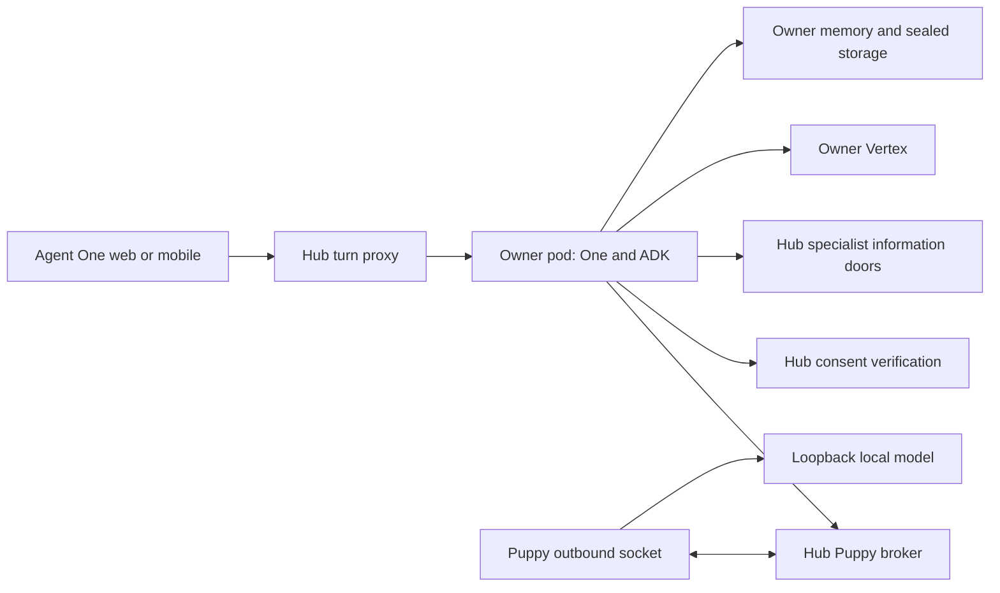
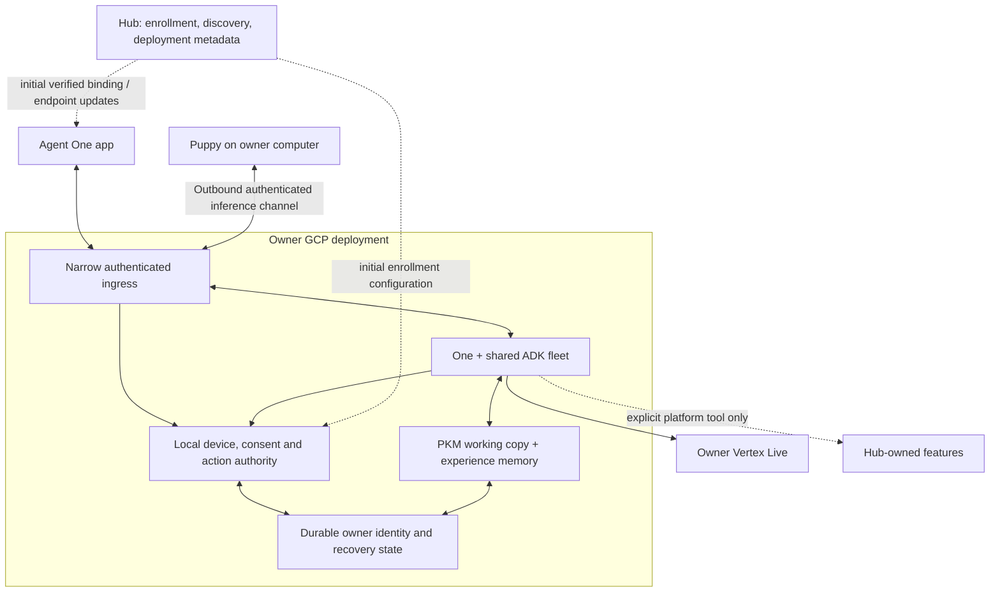
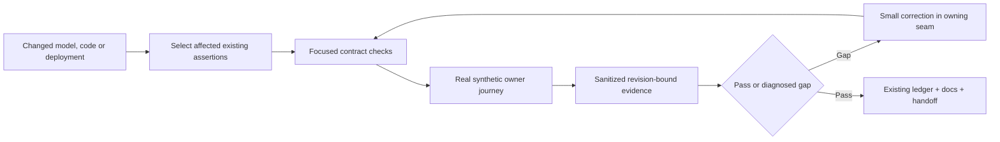

# Owner-pod direct runtime: evidence and implementation handoff

Status: **future implementation plan, grounded in source and read-only deployment inspection on 2026-09-10**. This document does not certify completion. Only this plan was added during this scan; no runtime, repository code, infrastructure or Wiki changes were made.

## Visual Context

Canonical visual owner: [private-agent documentation map](./README.md). Current and intended topology diagrams appear in section 3. The relay entrypoint named below belongs to the Hermes repository, under its scripts directory.

## 1. Outcome and decisions carried forward

Deliver **Agent One app ↔ owner deployment ↔ Puppy**, with One, ADK, tools, specialists and memory executing within the owner deployment. Puppy supplies inference only. Vertex Live uses the owner's configured project and workload identity. The hub establishes initial identity/deployment binding and supplies discovery/configuration updates; it is not a per-turn proxy or a mandatory recurring authority check for owner-local work.

The owner's latest instruction is explicit: an established configuration must continue operating without the hub confirming each request or renewing a short hub lease. Consequently, revocation of local access must be authoritative at the owner deployment. Removing hub checks without replacing their authority is not an implementation of this design.

Fixed boundaries:

- Dev only. Keep private changes on the existing private branch, Puppy changes in Hermes, and ADK/main worktrees intact. No main, UAT or production promotion in this milestone.
- Reuse the authored product-agent manifests, shared fleet dispatch, `runtime_providers`, existing consent/action contracts, pod identity, sealed recovery log and PKM resolver. Do not introduce another semantic router, agent fleet, memory backend or completion ledger.
- No Redis dependency, consumer VPN installation, public local-model endpoint, shell access, runtime package installation or automatic inference fallback.
- PKM remains the information authority. Agent-experience memory does not become a second PKM. Permission to use Puppy does not authorize remote Hermes tools.
- Hosted and user-GCP deployments use the same runtime and ingress implementation, with deployment-specific identities and custody. Success in the owner's GCP does not certify hosted isolation or production scale.
- Reuse manual audit/evaluation workflows. Do not create another scheduled audit job.

## 2. Exact baseline and confidence

| Surface | Observed baseline | Evidence limit |
|---|---|---|
| Private repository | `claude/hushh-infrastructure-analysis-7o991c`, `7be51b7dcd9e96f57e844f49c778b408977b9082`; clean before this plan, nine commits ahead of locally known origin | No fetch or push performed by this scan |
| Hermes repository | `main`, `6d5b3204af06d383f0819174be8d256f93be983b`; clean, three commits ahead of locally known origin | Preserve the existing UAT/production profile and independent work |
| ADK worktree | `.claude/worktrees/adk-orchestration`, branch `feat/adk-orchestration-runtime`, `e3fe61967` | Listed only; not modified or reconciled in this scan |
| Owner | Intended account `kushaltrivedi1711@gmail.com`, isolated `dev-puppy` profile | Email is a lookup hint, not authority; use server identity plus enrolled device proof |
| Owner project | `hussh-one-pod`, `us-central1` | Live Cloud Run inspection used the owner GCP account |
| Owner service | `one-pod-ha1-7o6wt3s4mtydneyytqfswsxtafdlpjwz` | Service UID `a33135b3-1328-4379-9127-5ee9571a2f3a` |
| Serving owner revision | `one-pod-ha1-7o6wt3s4mtydneyytqfswsxtafdlpjwz-00005-2jf`, 100% traffic | Source build tag `dev-195de95d2`, older than current private HEAD |
| Owner image | `us-central1-docker.pkg.dev/hussh-one-pod/one-pod/consent-protocol-pod@sha256:fa7757c40d98825c2f66ecee3f380bd3316076900071359f2b70f353df24b417` | Immutable digest verified in service specification |
| Owner resources | 0.5 vCPU, 1 GiB configured limit; min instances 0, max instances 1 | Limits are not measured utilization; min=0 is not proof of zero idle cost |
| Runtime identity | Dedicated owner-project service account on the service | Binding observed; full least-privilege IAM review is still required |
| Interrupted owner rebuild | Build `e3829002-cbea-4214-a770-b9c805267984` failed in step 0 | Failure verified; image replacement did not happen. Inspect build context before retrying |
| Latest hub fix | Previous execution deployed `7be51b7dc` to dev revision `consent-protocol-00083-jds` | Historical session evidence; re-read traffic before any new rollout |

The previous live frontend-proxy journey returned HTTP 200, `provider=puppy`, `model=local`, `runtimeMode=puppy_relay`, and the expected synthetic response in 10.38 seconds. Pod logs also recorded an earlier successful request with approximately 32.9 seconds to first visible content and a later warm request with approximately 4.0 seconds. These are a few observations, not a latency distribution or direct-path evidence.

Previous focused checks passed: 99 provider/turn/fleet tests, 38 pod/Live/release-probe tests, and 70 tests after the Live grant correction. They overlap and must not be summed into unique coverage. No test suites were rerun in this read-only planning scan.

The Vertex diagnostic and Live-ticket mint passed previously. The Live socket closed before setup; the hub rejected its own expanded specialist-grant set. Commit `7be51b7dc` aligns that allowlist, but the owner image still predates it. Actual bidirectional audio remains unverified.

## 3. Current and intended topology

### Current implementation

The current transport is authenticated but the hub forwards decoded inference frames. This is not evidence of end-to-end payload confidentiality from the hub. The frontend-facing pod-turn route collects a JSON response; internal model deltas do not establish browser streaming.

### Intended owner deployment

“Direct” means no Hussh hub in the conversation/inference path. Internet transport still uses TLS and authenticated endpoints; this does not require a VPN or expose the computer's ports.

**Deployment choice for the implementation:** use a minimal ingress sidecar in the same owner Cloud Run service as the pod runtime, rather than adding a separately active gateway service per owner. Only the ingress container receives external traffic. The runtime listens on a non-ingress port and exposes only explicitly mapped product operations through the sidecar. It remains the same pod runtime image and agent implementation.

This changes the public IAM boundary: the service ingress must permit connections from ordinary app clients, then enforce application authentication. Do not describe the entire resulting Cloud Run service as IAM-private. The runtime/admin routes remain externally inaccessible by ingress allowlist, with separate authenticated operator access. Verify startup ordering, aggregate memory, Cloud Run multi-container support and operator access before rollout. If these cannot preserve the boundary, stop that deployment step and record the precise constraint; do not publish the full `pod_server` router or silently add another billed service.

## 4. Gap register: more than a relay relocation

| Area | Classification and source truth | Required bounded change |
|---|---|---|
| Compute | **already_exists**: owner Cloud Run service and persistent identity/storage | Preserve it; update through existing lifecycle ownership, not a separate deployment registry |
| ADK orchestration | **partially_exists**: One runs in the pod through `ProviderAdkModel`; Puppy is below One | Preserve ADK and dispatch; prove actual tool/result continuation and one representative specialist |
| Complete fleet | **partially_exists**: `pod_specialist_runtime.py` supports bounded adapters; other agents can explicitly refuse | Build a manifest-derived matrix of executable, hub-dependent and unsupported capabilities. Do not equate roster presence with execution |
| Specialist information | **partially_exists**: Location, Email, Nav and Marketplace ports call `PodHubClient` | Keep platform-owned features explicit; move owner-local capability reads to existing owner-scoped ports/PKM replicas where semantics permit |
| Consent | **wrong_direction for independent sessions**: `pod_consent_client.verify_consent` calls `/api/one/pod/consent/verify` | Extend the verifier seam with authoritative owner-local grants/revocation. Do not accept cached hub tokens indefinitely |
| Voice actions | **hub-dependent**: `PodVoiceDirectiveStore` delegates issue/confirm/consume/settle to hub authority | Provide an owner-local implementation of the same action-store contract, preserving one-use confirmation and receipts |
| Device admission | **partially_exists**: relay accepts device-scoped bearer authority; role comes from hello/header | Add device proof of possession and authority-derived roles. A device grant must not let its holder claim pod or owner-admin role |
| Connection ownership | **partially_exists**: broker generations are process-local | Use durable incarnation fencing; max instances=1 and session affinity cannot prove exclusivity across replacement |
| Schema output | **missing in neutral wire**: `NeutralRequest` has no response schema/format requirement | Preserve schema constraints through translation, relay and local executor; reject unsupported capabilities before dispatch |
| Streaming/tools | **partially_exists**: relay and ADK adapter carry deltas/functions; final ADK completion event has no content | Verify ADK history reconstruction, multiple tool calls, partial/final assembly and actual execution before changing behavior |
| Model metadata | **partially_exists**: public response reports `local`; Hermes uses its configured resident model | Advertise actual model/capability metadata through existing provider/status contracts without leaking endpoint or key |
| Encryption | **not established**: examined relay path forwards JSON; no payload sealing in these transport files | Reuse existing authenticated key-exchange/AEAD primitives with bound pod/device keys; never claim TLS alone hides payloads from a courier |
| Memory | **partially_exists**: sealed log, owner checks, hydration and Memory Bank adapter exist | Resolve recorded `MemoryBankUnavailable`/generation-pending results; distinguish sealed-log recall from successful Memory Bank recall |
| App routing | **hub-dependent**: `runPodTurn`, grants and Live URL use existing hub/proxy paths | Resolve and pin owner endpoint, then send requests directly through the existing frontend service abstraction |
| Background work | **needs_verification**: scale-to-zero cannot run a resident worker | Inventory required work; use existing event/job facilities for required jobs, without adding a second scheduler |

Therefore, “agents, memory and ADK are done; only optimize the relay” is **partially true**. The useful foundations exist. Owner-local authority, complete capability wiring and live recovery evidence are still required.

## 5. Implementation sequence and contracts

### A. Freeze and recover the deployment baseline

1. Re-read both repository revisions, dirty state, owner service UID, image digests, traffic and build status. Preserve existing worktrees and profiles.
2. Diagnose the failed owner build. The interrupted command submitted repository-root context while its temporary configuration referenced `Dockerfile.pod` at context root; verify this against the build log. Use the correct context and include root generated contracts, as the canonical build stages do. Do not retry an unexamined command.
3. Record the current serving image as rollback. Do not spend another hub-mediated rollout merely to claim direct-path progress. Retain the useful Live grant correction in the candidate.

### B. Establish durable owner-local authority

- Extend existing enrollment with an explicit owner-signed binding of owner identity, environment, deployment identity, device public key, role and allowed scopes. Transfer only the required public trust configuration to the owner deployment; enrollment must not auto-grant Puppy inference.
- Authenticate each new connection using a fresh challenge and device-key proof. Issue bounded local session credentials, renewable by an enrolled device against the pod without the hub. Local revocation/configuration generation supersedes credentials immediately at that deployment.
- Persist authoritative device status, local consent, action receipts and revocation tombstones using the existing encrypted owner-store/CAS mechanisms, with explicit record types and recovery rules. This is security/workflow state, not agent memory or PKM. No new Postgres or Redis requirement for the consumer.
- Route owner-local checks through the existing verification interface. Hub-issued grants retain their existing semantics for hub-owned resources; there is no precedence rule that silently converts them into local authority.
- Owner app revocation goes directly to the pod and closes current sessions. When unreachable, show pending delivery; never report completed revocation until acknowledged. A hub account change does not secretly revoke independently enrolled local access. Preserve an owner-authenticated recovery path for lost devices.
- Endpoint/configuration updates require a monotonic version and existing trusted signature chain. A stale hub discovery answer cannot replace the pinned owner identity or roll back revocation state.

### C. Move ingress and inference to the owner deployment

- Publish only session admission, status, conversation and existing voice transport operations on the sidecar. No arbitrary target URL forwarding, metadata-server proxy, filesystem, shell or pod-maintenance routes.
- Bind app requests to owner, environment, deployment, device and session before forwarding any information. Native and browser clients use the existing service layer; CORS and allowed origins are explicit, and browser authentication does not rely on custom WebSocket headers.
- Move broker ownership into the owner deployment. Puppy connects outbound to that endpoint; One's provider adapter reaches the broker through the owner-local transport seam. Reuse the established device connection across requests.
- Preserve one active turn/inference by default, explicit busy responses, 1 MiB frames, at most 32 queued response frames and the agreed 120-second inference deadline. Align device/provider/frontend timeouts so one layer does not abandon another silently.
- Fence old and new revisions using durable owner-state CAS and an incarnation/epoch. Publication of results and execution of side effects require current ownership. Storage/ownership uncertainty refuses new work. A socket reconnection is not permission to replay an interrupted request.
- Seal pod–Puppy payloads with authenticated session keys and bind owner/device/session/incarnation/request sequence into the authenticated context. Keep local model keys and endpoint local. Disable wire debug logging and redact credentials/tickets from HTTP/WebSocket access logs.

### D. Complete the existing fleet and memory path

- Extend `NeutralRequest` and existing generated contracts to preserve structured-output requirements, tool IDs, arguments/results, actual model and capability support. Keep the existing chat request semantics and provider selection authority.
- Run one real root-agent tool/result cycle and one supported specialist on Puppy. Inspect whether ADK partial/final events preserve the transcript; use evidence to correct only the adapter defect, if any.
- Produce a matrix for every currently promised specialist: code executes in pod; information source; invocation scope; read/write scope; provider; confirmation owner; live evidence. General Connections tools must retain explicit mutation confirmation and declared connector availability.
- Move local action ledger operations behind the existing store port. The hub must not settle a local action on behalf of a fabricated owner confirmation.
- Preserve existing sealed memory and PKM resolver. Exercise explicit `load_memory` recall without browser-supplied history, contradictory updates, absent facts and revocation. Persist deletion/tombstones so a rebuild cannot restore revoked facts from old logs or derived indexes.
- Qualify Memory Bank separately. A successful sealed-log fallback does not pass a Memory Bank assertion. Confirm model-information processing consent before using owner Vertex memory services.
- Voice reuses the existing Live protocol and local action authority, with owner-project Vertex ADC. Test actual audio, typed input, interruption and a safe confirmed action. Puppy audio is excluded.

### E. Activation, economics and rollout

- App resume uses the cached verified owner endpoint first. Ask the hub only when initial discovery or a verified deployment update is needed. Missing infrastructure shows setup; it never silently provisions or purchases compute.
- Reuse the existing profile control loop for activation discovery when Puppy is awake; do not add another polling scheduler. A sleeping computer stays unavailable. Use the agreed ten-minute grace period after the final foreground client lease expires; expiry must work without a clean app disconnect.
- Inventory required background jobs before enabling shutdown. Required durable work uses existing event/job infrastructure with owner identity, explicit costs and idempotency.
- Preserve locked Cloud Build dependencies, CPU-only packages and immutable images. Image bytes, container limits, measured RSS and billed resource time are different measurements.
- Deploy a no-traffic dev candidate; prove identity, ingress exclusion, local authority and readiness before promotion. Reconnect Puppy to the owner endpoint through the supported profile supervisor, not a task-only token launcher.
- Roll back by disabling new admission and draining/cancelling sessions first. Preserve revocation epochs and state compatibility. Do not roll back authority state or silently restore hub/cloud fallback. Older images that cannot interpret the authority state are not valid rollback targets.

## 6. Verification and learning loops

Existing loops to reuse: `runtime-topology-maintenance`, `config/pod-completion-ledger.yaml`, `consent-protocol/scripts/ops/pod_completion_judge.py`, lifecycle/upgrade/evolution drills, and the Puppy harness's independent quality judge. The shared skills/agent definitions are engineering governance; they do not deploy product specialists.

Missing or incomplete loops to add to those workflows:

| Loop | Smallest meaningful acceptance |
|---|---|
| Hub independence | After valid enrollment, block hub access for the test deployment/client. Fresh locally authenticated sessions, plain chat, local recall and local safe tools still work; measured conversation/inference hub calls are zero |
| Honest dependencies | A marketplace/hub-backed tool reports unavailable while owner-local chat continues. Do not claim every capability is hub-independent |
| Authority | Foreign owner/device/environment, forged role, replayed proof, expired local session and revoked device never reach retrieval or inference |
| Replacement fencing | Overlap two incarnations on disposable resources; old incarnation cannot publish or mutate after ownership transfer; identity and revocations persist |
| Provider compatibility | Same real model: text, schema-constrained response, multiple tool calls/results and one specialist; unsupported capabilities refuse before dispatch |
| Memory learning | Teach synthetic fact, paraphrase recall via observed memory tool, correct it, restart without history, revoke it, restore/replay. Old/revoked facts do not return |
| Voice | Actual owner Vertex setup and audio, interruption, cancellation, local action confirmation and mid-session revocation; ticket mint alone is insufficient |
| Lifecycle | End app uncleanly, lose network, reconnect Puppy, replace pod, erase disposable state and verify retained resources/tombstones |
| Economics | Five fixed synthetic workloads locally and remotely on the same model; cold/warm first-token time, total time, errors, transferred bytes, reconnects, RSS/CPU, idle grace and shutdown |
| Product truth | Frontend service calls and background simulators show actual model/target, busy/offline/revoked states and account-switch isolation; no physical-device claim |

For cost, prioritize removing per-turn hub traffic and DB validation, connection reuse, context/prefill reduction and connected-idle time. Do not promise that shifting traffic to owner GCP lowers total cost. Open Cloud Run WebSockets keep instances active; affinity is best effort. [Google Cloud guidance](https://docs.cloud.google.com/run/docs/triggering/websockets).

The current 470 MB packaging receipt is historical and applies to a recorded image, not every later digest. Re-measure only when packaging changes. The observed cold/warm delay suggests model prefill/context reuse is worth measuring; do not rewrite the canonical persona or drop necessary tools merely to reduce tokens.

Each evidence record should contain repository SHA, relevant source hashes, image digests, deployment identity, capture time, synthetic case IDs, outcomes, measurements, commands and explicit limits. No prompts, tokens, keys or private records. Quality judging must be independent of fixture generation; schema conformance is not correctness.

## 7. Completion, exclusions and efficient executor handoff

Declare **Owner direct-runtime pilot complete within measured limits** only after direct app/pod/Puppy inference, local authority/revocation, hub-outage continuity, representative fleet execution, memory recovery and owner Vertex Live pass on installed images. Report the hosted path separately until its identity/custody deployment and isolation checks pass. Do not label the whole historical audit or all specialists complete.

External dependencies remain explicitly outstanding without pass credit: excluded billing/provider failures and inaccessible legacy-project cleanup. A missing local authority implementation, failed image build or unproven memory recall is internal work, not an external exclusion.

The executor should:

1. Read this plan and the canonical references once; re-read source only where the revision changed.
2. Maintain one compact execution record with active checkpoint, changed seams, completed checks, exact installed images and next action.
3. Implement B–C as one minimum direct vertical slice before broadening capabilities. Reuse existing tool/consent/state ports rather than porting every specialist at once.
4. Run focused checks after each actual correction. Run one combined candidate gate and bounded live acceptance; avoid repeated broad audit suites or single-purpose scratch tests.
5. Finish with committed code on the existing branches, rollback instructions, current ledger receipts, and corrected canonical docs/skills. Reconcile the smallest affected Wiki sections only with verified sanitized evidence, then refresh the CTO artifact. This scan does not authorize extra publication beyond the existing session's scope.

### Source map for the next context

All paths below are relative to the research repository unless marked Hermes:

- Governance: `AGENTS.md`; `docs/reference/architecture/private-agent-north-star.md`; `docs/reference/architecture/runtime-topology-maintenance.md`.
- Pod/runtime: `consent-protocol/pod_server.py`; `consent-protocol/api/routes/one/pod_turn.py`; `consent-protocol/hushh_mcp/one_adk/text_runtime.py`; `consent-protocol/hushh_mcp/services/pod_specialist_runtime.py`.
- Transport/authority: `consent-protocol/api/routes/one/pod_relay.py`; `puppy_relay.py`, `pod_live_relay.py`, `pod_live_store.py` in that same route directory; `consent-protocol/hushh_mcp/services/pod_consent_client.py`.
- Provider: `consent-protocol/hushh_mcp/runtime_providers/{adk_model,translate,puppy_transport}.py`.
- State: `consent-protocol/hushh_mcp/services/{pod_memory_service,pod_memory_bank,pod_commit_log,pod_identity_store,pod_pkm_resolver}.py`.
- App: `hushh-webapp/lib/services/api-service.ts` (`runPodTurn`, Puppy status/grants, Live session/URL).
- Device: Hermes `gateway/puppy_inference_relay.py`, `hussh-one-puppy-inference-relay.py`, `hermes_cli/hussh_one_pkm/client.py` and corresponding existing relay tests.
- Deployment: `deploy/backend.cloudbuild.yaml`; `consent-protocol/Dockerfile.pod`; existing user-GCP lifecycle/rendering services.
- Verification: existing `test_pod_live_*`, `test_pod_turn_*`, provider tests, lifecycle drill and pod completion judge. Select by changed seam; do not invent another completion authority.

Agents: primary only; no subagents. Skills consulted for this scan: repo-context, backend-runtime-governance, puppy-one-harness, docs-governance. Workflow: runtime-topology-maintenance; execution stayed local because this was a bounded source/deployment scan and a single handoff artifact.

## 8. Corrections after execution (2026-09-10, workstream head `1b1ea8ac6`)

Recorded against the source and the owner project after the plan above was executed on
the private branch. Each line names what the plan got wrong or left unsaid; the code and
the runbooks are the source of truth where this document still disagrees.

- **§3 deployment choice.** No ingress sidecar. Cloud Run IAM is service-wide, so a
  sidecar cannot restore per-path protection, and `gcp_run_client.py` and
  `user_gcp_backend.py` assert exactly one container. The pod now carries an in-process
  `PodIngressPolicy` (`consent-protocol/api/middlewares/pod_ingress.py`): the app surface
  is open and then application-authenticated; everything else, including `/pod/info` and
  `/pod/public-key`, requires the hub's OIDC identity. `PodSpec.ingress = direct` renders
  public ingress, a public invoker and a 3600 s request timeout, dev lane only.
- **§4 ADK orchestration and Streaming/tools.** The final-event gap was a real defect:
  with progressive SSE streaming no non-partial content event reached ADK on a Puppy
  turn, so tool calls never executed and only the person's side of each exchange reached
  memory. Fixed by riding ADK's own stream aggregator (`runtime_providers/adk_model.py`);
  function-call ids are paired on the wire; the specialist model-call budget is 60 s on
  `puppy_relay`.
- **§4 Consent.** Two hub-dependent verifiers, not one: `pod_turn._validate_consent` and
  `pod_specialist_runtime.require_access`. Both now accept the owner-local verifier.
- **§4 Complete fleet and Specialist information.** None of the four hub-door reads is
  PKM-derived and the pod's PKM replica has no production feed, so no read moved. The
  first `specialists-run-in-pod` receipt comes from the Location proposal path (zero
  information reads); the capability matrix (`contracts/agents/
  pod-specialist-capability-matrix.v1.json`) declares all 20 manifests; the turn
  response reports each specialist's execution locus, information source and hub reads.
- **§4 Schema output.** The neutral wire also dropped tool choice, `top_p`, stop
  sequences, seed and thinking settings; all are carried now and an unsupported
  capability is refused before dispatch on both sides.
- **§4 Device admission and Connection ownership.** One bearer opened both relay
  roles; the pod never validated `cap.puppy.inference`; the Redis busy fence was off by
  default; the hub broker kept a stale device link across a reconnect. Role now comes
  only from the hub-signed binding; the pod verifies its own sessions; the in-pod broker
  fences by a CAS'd incarnation epoch; the hub broker rebinds per request.
- **§4 Memory.** The gap was larger than "partially exists": no curation, no correction,
  replay resurrected everything, no consent scope or check for provider memory, silent
  fallback, pending generation never backfilled. Memory schema 2 adds curated facts,
  supersessions and tombstones applied in log order; the private agent reviews on
  conversation close and catches up before the next answer on the same model the
  conversation used (a maintenance tick holds no Puppy or BYOK credential, so
  model-driven consolidation is never event-woken); recall keeps the observed
  `load_memory` call as the only credited proof plus a bounded curated digest;
  `cap.memory.provider.process` consent gates Vertex Memory Bank.
- **§5C timeouts.** "The agreed 120-second deadline" was not the binding bound; the
  browser aborted at 60 s below ADK's 90 s. The ladder is now Hermes 60 s per read and
  110 s per request, broker 120 s with cancel, specialist 60 s on Puppy, ADK Puppy
  70/70/150 s, pod route 155 s, hub and Next proxies 160/165 s, app 170 s on the direct
  turn, Cloud Run 3600 s on direct ingress; `tests/test_timeout_ladder.py` pins the order.
- **§5E rollback.** Older images that ignore memory tombstones are not valid rollback
  targets either; `consent-protocol/scripts/ops/pod_upgrade.py` refuses them.
- **§5E Hermes.** There was no supervisor entry and no `dev-puppy` key anywhere in the
  fork. The device side of the binding, session and sealed relay is specified in
  [PUPPY-DEVICE-BINDING-SPEC-2026-09-10](./PUPPY-DEVICE-BINDING-SPEC-2026-09-10.md)
  and not yet implemented; the device does advertise its model and capability profile
  and refuses unsupported requests (fork `8bec4d3f6e`), and Auto-Dream now promotes
  nightly facts into the memory the prompt reads (fork `52aa99b6c1`).
- **§2 baseline.** The failed owner build `e3829002` ran `docker build
  --file=Dockerfile.pod` on a repo-root context; the canonical recipe stages
  `contracts` into `consent-protocol` and builds from there. The serving revision
  `00005-2jf` already has ingress `all` behind a single service-account invoker; the
  project has no parent organization, so a public invoker is not blocked by org
  policy. Whether the installed image carries the memory join is now a drill
  precondition (`memoryJoin` on `/pod/info`).
- **Enrollment.** No longer UAT and production only: `fb4cea41d` added dev; the
  per-account allowlist was removed and its stale documentation line deleted.
- **`pod_live_store.py`** is a store port over the Live transport, not a route.
- **Configuration.** No environment flags were added. Owner-pod behaviour lives in one
  sealed `pod_config_v1` record (defaults are the full experience).
- **Still unmeasured.** Every receipt-kind ledger entry remains pending: no candidate
  image has been built or rolled onto the owner pod, so the live K4 (tool cycle on
  Puppy), K5 (Location receipt), K9 to K14 (memory drill) and K1 to K3 (owner-direct
  acceptance with the hub unreachable) receipts do not exist yet.
