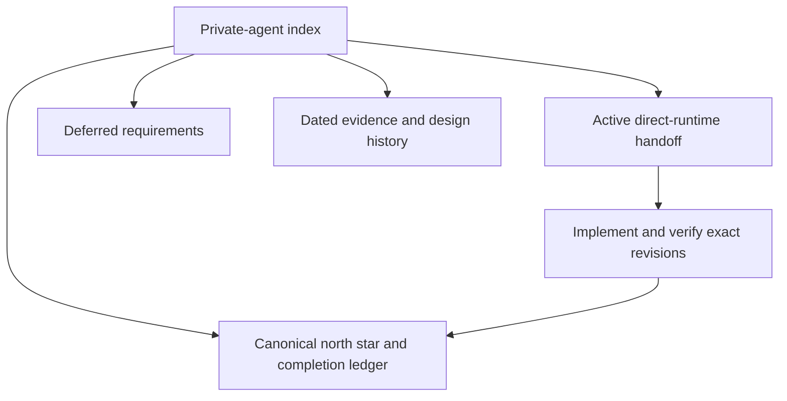

# Private-agent plans and evidence

## Status

Reviewed 2026-09-10. This folder owns future direction and dated design/evidence snapshots, not current deployment instructions.

**Start with the [owner-pod direct-runtime handoff](./OWNER-POD-DIRECT-RUNTIME-HANDOFF-2026-09-10.md).** It records the inspected revisions, current hub dependencies, proposed app ↔ owner pod ↔ Puppy path, and remaining acceptance checks. The direct path is planned, not shipped.

Current requirements and qualified implementation evidence belong in the [private-agent north star](../../reference/architecture/private-agent-north-star.md). Completion assertions belong to [the existing pod ledger](../../../config/pod-completion-ledger.yaml); no old milestone checkmark grants current pass credit.

## Visual Map

## Active planning

| Document | Use |
| --- | --- |
| [Owner-pod direct-runtime handoff](./OWNER-POD-DIRECT-RUNTIME-HANDOFF-2026-09-10.md) | Next execution context; reuse the fleet and memory while removing mandatory hub traffic from owner-local work. |
| [Remaining roadmap](./ROADMAP.md) | Deferred requirements and promotion conditions, without obsolete dates or completed implementation instructions. |

## Historical provenance

These documents preserve earlier decisions, measurements and limitations. Their flags, commands, topology claims and “done” statements apply only to their recorded context. They do not override the current handoff or canonical north star.

| Documents | Retained value |
| --- | --- |
| [Architecture](./ARCHITECTURE.md), [BYOC design](./BYOC-USER-GCP.md) | Earlier backend portability, custody and attestation proposals; generalized deployment remains subject to fresh verification. |
| [Control-plane split](./CONTROL-PLANE-SPLIT.md), [pod–hub information path](./POD-HUB-DATA-PATH.md) | Transitional hub-mediated design and its trust limitations; “hub is the only door” is not the target architecture. |
| [Autoprovision](./POD-AUTOPROVISION.md) | Earlier provisioning fixes and quota observations; not authorization to provision on app launch. |
| [Security review](./SECURITY-REVIEW.md) | Bounded Phase-0 findings, not a current security certification. |
| [M4 validation](./M4-LIVE-VALIDATION.md), [fleet live evidence](./POD-FLEET-LIVE-2026-08-04.md) | Dated deployment and teardown receipts. |
| [Consent-log evidence](./CONSENT-LOG-END-TO-END.md), [multi-pod simulation](./MULTI-POD-DEV-SIMULATION.md) | Historical consent/parity findings and measured simulation limits. |
| [Execution log](./EXECUTION-LOG.md) | Historical changes and evidence pointers. |

## Maintenance and promotion

Remove superseded execution instructions after carrying forward unresolved requirements and useful operational constraints. The July dev-live execution plan was removed on 2026-09-10: image building, migration wiring and provisioning now have implementation owners; its onboarding and rollout gaps remain in the roadmap. Git history retains the old instructions.

Promote a future claim only after code, contracts and revision-bound acceptance evidence agree. Refresh affected canonical references and ledger receipts in the implementing change. Do not infer whole-pilot, production or compliance completion from historical evidence.
