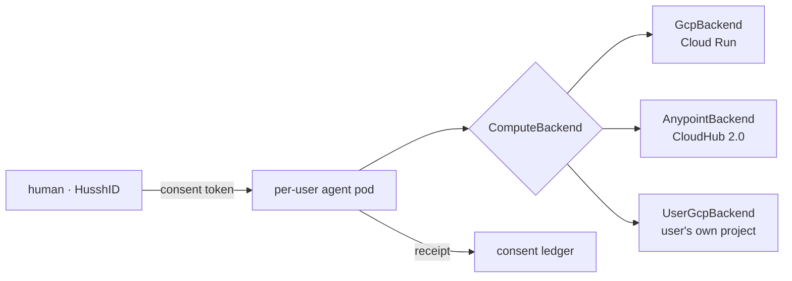

# Personal Agent (Private Cloud Compute) — cluster index

> **Status:** in pursuit, dev-branch only, feature-flagged **OFF**
> (`PERSONAL_AGENT_ENABLED`, default off). The hussh-side foundation is built and the
> **GCP live path is validated end-to-end in `hushh-pda-dev`** (deploy → agents
> orchestrate → teardown); nothing is enabled in released environments.
> Branch: `claude/hushh-infrastructure-analysis-7o991c`.

## Visual Map



Every compute host is interchangeable behind one identity + one consent handshake.
Companion contracts: [ARCHITECTURE.md](./ARCHITECTURE.md), [ROADMAP.md](./ROADMAP.md).

## Documentation map (start here)

| Doc | Role |
|---|---|
| **This README** | Entry point · Phase-0 engineering record · the doc/code map below. |
| [`ARCHITECTURE.md`](./ARCHITECTURE.md) | **Design of record** — one logical architecture, many compute backends (**primary chosen per workload class: Anypoint = general/mass · GCP = FedRAMP-High/regulated**); Apple-PCC mapping; the slim pod + storage seam; parity + divergence registers. |
| [`ROADMAP.md`](./ROADMAP.md) | **Execution plan** — milestones M1–M14, dependencies, risks, honest 1B launch dates. |
| [`SECURITY-REVIEW.md`](./SECURITY-REVIEW.md) | Phase-0 adversarial audit — gate items closed, standing caveats (I1). |
| [`M4-LIVE-VALIDATION.md`](./M4-LIVE-VALIDATION.md) | **Live evidence** — the real deploy/orchestrate/teardown runs, the slim-pod surface proof, and the min-instances (warm-floor) measurements. |
| [`EXECUTION-LOG.md`](./EXECUTION-LOG.md) | **What shipped, when** — the milestone → change → commit → validation ledger. |
| [`BYOC-USER-GCP.md`](./BYOC-USER-GCP.md) | The **user-owned-GCP (BYOC)** tier — the pod in the *user's* cloud via keyless Workload Identity Federation + a least-privilege bootstrap. |
| [`../identity-assurance/README.md`](../identity-assurance/README.md) | M14 companion — WebAuthn/FIDO2 + Titan/YubiKey passkey login + NIST 800-63B AAL mapping. |
| [`../apple-a-plus/PLAN.md`](../apple-a-plus/PLAN.md) | The Apple/Jobs "A+" grading loop for the "your sovereign agent is alive" throughline. |

## What this is

**The customer outcome.** Every 🤫 hussh One user gets their **own always-on private
agent** — their **Private Cloud Compute** instance. Their phone number is the master
key; their data stays theirs (consent-first, zero-knowledge, deletable); and their agent
acts on their behalf to find, access, correct, share, and remove their personal
information wherever it lives.

**The problems we solve, working backwards:**
- **Business** — the durable moats are brand, product, service, and trust. A sovereign,
  consent-first agent is the *trust* moat, the operational arm of the directory /
  marketplace GTM, and an enterprise- and FedRAMP-grade platform play.
- **Technical** — per-user sovereignty at 1B scale **without** 1B warm processes (a
  logical pod on a backend-neutral seam); **zero-knowledge** (we cannot read user data);
  consent enforced **outward** into the world's systems (a PCHP receipt per action);
  backend **portability** (no lock-in); and real-time responsiveness.

**Deployment posture** (see [ARCHITECTURE §2](./ARCHITECTURE.md)). **The primary is chosen
per workload class.** **Anypoint is the primary for general / mass-market deployments** (the
default runtime) — primary because hussh holds **pre-purchased Titanium capacity** (already
paid for → best cost per workload at 1B scale), operated by the dedicated MuleSoft team on
CloudHub 2.0 / Runtime Fabric; it hosts the per-user pod **and** carries the enterprise lane
(`AnypointBackend` renders the AMC descriptor today; **live is gated** — M7, on the critical
path for the general tier; FedRAMP **Moderate**; capacity founder-stated / unreconciled).
**GCP is the primary for the FedRAMP-High / government / regulated tier** — because GCP
carries **FedRAMP High** (a higher compliance ceiling than MuleSoft Gov Cloud's Moderate,
matching the FedRAMP-High + DoD-IL north star) **and** it is the validated, live-wired backend
where the deploy → orchestrate → teardown loop was first proven live (2026-07-21, bounded
scope). **User-owned GCP (BYOC)** and **edge / Puppy One** are the sovereignty tiers. Across
all of them hussh stays the **consent, identity, and audit authority**, and the runtime is
portable behind one provider abstraction. *(This supersedes the 2026-07-13 "MuleSoft =
enterprise lane, not runtime" framing and refines the intermediate 2026-07 "Anypoint-primary"
framing — 2026-07-25 → workload-segmented: Anypoint = general primary, GCP =
FedRAMP-High/regulated primary.)*

Phase 0 landed the backend-neutral hussh-side foundation (identity, consent, zero-knowledge
pod, provisioning brain), entirely behind a kill-switch, so nothing changes until it is
explicitly turned on.

## Governance invariants (why this is safe)

- **Own your data / your agent.** The user's own agent reads the user's own PKM,
  nothing broader.
- **Consent-first, Nav-governed.** The standing read is logged to the **visible**
  consent ledger (`insert_event`), so Nav narrates it in the Consent Center and
  the owner can revoke it through the normal path.
- **Delegation stays attenuated.** The standing read is bound to a dedicated
  `personal_agent` id and one user, so a specialist (different `agent_id`) can
  never present it. Per-hop delegation still requires attenuated authority
  (`hushh_mcp/adk_bridge/contract.py::require_attenuated_authority`), so the
  standing read never crosses the delegation boundary.
- **Zero-knowledge.** The pod holds its own X25519 private key; hussh stores only
  the public key and wraps scoped exports to it, never decrypting.

## What Phase 0 built (all flag-gated, tested)

| Piece | Path |
|---|---|
| Registry + deletion tombstones schema | `consent-protocol/db/migrations/parked/900_personal_agent_registry.sql` |
| Versioned prompt store (hot prompt-sync) | `consent-protocol/db/migrations/parked/901_agent_prompt_versions.sql` |
| Kill-switch flag | `consent-protocol/hushh_mcp/runtime_settings.py` (`personal_agent_enabled()`) |
| Phone to opaque HusshID + phone hash | `consent-protocol/hushh_mcp/services/personal_agent_identity_service.py` |
| Per-agent X25519 public-key contract | `consent-protocol/hushh_mcp/services/pod_connector_keypair_service.py` |
| Standing Nav-governed `pkm.read` grant | `consent-protocol/hushh_mcp/services/personal_agent_grant_service.py` |
| Provision / teardown orchestration | `consent-protocol/hushh_mcp/services/personal_agent_provisioning_service.py` |
| DB-backed registry + tombstone adapter | `consent-protocol/hushh_mcp/services/personal_agent_registry_repo.py` |
| Owner-authorized provision / deprovision route | `consent-protocol/api/routes/one/personal_agent.py` |
| Prompt-sync read adapter + service | `consent-protocol/hushh_mcp/services/personal_agent_prompt_repo.py`, `personal_agent_prompt_service.py` |
| Prompt-sync read endpoint (`GET /api/one/agent-prompt`) | `consent-protocol/api/routes/one/agent_prompt.py` |
| Recycled-phone HusshID generation rotation + tombstone index | `personal_agent_provisioning_service.py`, migration `902_personal_agent_tombstone_hushh_id_index.sql` |
| Live wiring — phone-verify kickoff + account-deletion teardown | `hushh_mcp/services/actor_identity_service.py` (`schedule_provision_personal_agent`), `api/routes/account.py` (`_deprovision_personal_agent`) |
| Tests | `consent-protocol/tests/test_personal_agent_*`, `test_agent_prompt_*` (registered in `consent-protocol/scripts/test-ci.manifest.txt`) |

## Beyond Phase 0 — compute backends, the slim pod, audit/storage, WebAuthn

The layer that turns the Phase-0 registry entry into a running, hosted, real-time
per-user agent. Design in [`ARCHITECTURE.md`](./ARCHITECTURE.md) §5/§7/§7a; live
evidence in [`M4-LIVE-VALIDATION.md`](./M4-LIVE-VALIDATION.md); milestones M1/M4/M4a/M14
in [`ROADMAP.md`](./ROADMAP.md).

| Piece | Path |
|---|---|
| Compute-provider seam (`ComputeBackend` + `NullBackend` + resolver) | `hushh_mcp/services/compute_backend.py` |
| GCP runtime host — **regulated-tier primary + validated** (Apple-PCC-on-GCP; Cloud Run; **warm floor `minScale=1`**; live-wired; FedRAMP High) | `hushh_mcp/services/gcp_backend.py` |
| Live Cloud Run Admin (v1 knative) REST client | `hushh_mcp/services/gcp_run_client.py` |
| Anypoint adapter — **general-tier primary** (prepaid Titanium capacity; AMC / CloudHub 2.0 + Private Space; renders descriptor, live gated) | `hushh_mcp/services/anypoint_backend.py` |
| User-owned GCP (BYOC) adapter + keyless WIF bootstrap plan (inert) | `hushh_mcp/services/user_gcp_backend.py` ([BYOC-USER-GCP](./BYOC-USER-GCP.md)) |
| Slim pod entrypoint (agent + storage only; 4-router allowlist; no control plane) | `consent-protocol/pod_server.py`, `consent-protocol/Dockerfile.pod` |
| Pod-mode (per-user pod skips fleet workers) | `runtime_settings.py` (`pod_mode()` / `HUSSH_POD_MODE`), enforced in `server.py` |
| Pod-access audit (fail-closed owner==caller + visible receipt) | `hushh_mcp/services/pod_access_audit.py` |
| Pod storage/sync seam (cloud-backup ⇄ pod cache ⇄ device, inert) | `hushh_mcp/services/pod_storage.py` |
| WebAuthn/FIDO2 login + AAL (Titan/YubiKey) [M14] | `hushh_mcp/services/webauthn_service.py`, `webauthn_aal.py`, `webauthn_repo.py`, `api/routes/one/webauthn.py`, migration `903_webauthn_credentials.sql` |
| A2A invocation surface (`/card`, `POST /message`; `officialA2A:false`) | `consent-protocol/api/routes/one/a2a.py` |
| Flags — central (`runtime_settings.py`, all default off) | `PERSONAL_AGENT_ENABLED`, `PERSONAL_AGENT_BACKEND`, `ONE_DB_SESSIONS_ENABLED`, `WEBAUTHN_ENABLED`, `HUSSH_POD_MODE` |
| Flags — per-backend live gates (module-local reads, default off/unset) | `HUSSH_GCP_BACKEND_LIVE`, `HUSSH_ANYPOINT_BACKEND_LIVE`, `HUSSH_USER_GCP_LIVE`, `ANYPOINT_PRIVATE_SPACE_ID` |

## Lifecycle

- **Phone-verify kickoff** (`claim_verified_phone` → `schedule_provision_personal_agent`):
  fire-and-forget, flag-gated. Assigns the sovereign HusshID (with recycled-phone
  generation rotation) and records a `pending` registry row — the user becomes
  addressable. No pod key or standing read yet; never blocks phone verification.
- **Provision** (owner-authorized, when the pod materializes): derive the HusshID,
  validate the pod's public key, record the row as `provisioning` **before** minting
  the standing `pkm.read` (visible ledger), then flip to `provisioned` — so a
  registry failure can never orphan a live grant. Idempotent per user.
- **Teardown** (on account deletion → `_deprovision_personal_agent`): revoke the
  standing read (skipped on the account-deletion path, where the cascade already
  wiped `consent_audit` — writing a REVOKED event there would re-create a row for a
  deleted user), write a retained tombstone, delete the registry row. Best-effort:
  never blocks account deletion. Standalone deprovision (keep account) **does**
  revoke, so the read authority dies immediately rather than at its 24h expiry.

The provision and deprovision paths are also reachable through the owner-authorized
route (`POST /api/one/personal-agent/provision` and `/deprovision`), which requires
the owner's VAULT_OWNER token and a verified phone, and returns 404 while the flag
is off. Everything above is a no-op while `PERSONAL_AGENT_ENABLED` is off.

## Prompt-sync (hot prompt changes without redeploy)

A running agent resolves its system prompt at runtime from `agent_prompt_versions`
(migration 901) rather than baking it into the image:

- `GET /api/one/agent-prompt?agent_id=&channel=` returns the single **active** row's
  prompt, its version, a freshly **recomputed** SHA-256 (the stored hash is never
  trusted), and an HMAC signature over `agent_id|channel|version|sha256` under
  `APP_SIGNING_KEY`. Requires a `cap.one.invoke` token (control-plane only, no PKM
  access) and is flag-gated (404 when off).
- Conditional GET is supported: the SHA-256 is the `ETag`, so a caller sending a
  matching `If-None-Match` gets `304 Not Modified` and re-pulls only on change.
- Editing a prompt = insert a new version row and flip its `status` to `active`
  (the migration enforces one active per agent/channel); rollback is flipping the
  prior version back. No redeploy either way. The caller verifies the signature and
  falls back to its last-known-good prompt on any fetch or verification failure.

## Security review

A Phase 0 security review is complete — see [`SECURITY-REVIEW.md`](./SECURITY-REVIEW.md)
(independent adversarial audit + author cross-check). The core authorization and
zero-knowledge design is sound, and **all four gate items are now closed**:
de-externalized prompt-sync auth (M1), revoke-on-deprovision (M2), provision
mint/write ordering (M3), and recycled-phone `generation` rotation (L1) — plus the
cheap LOW/INFO hardening (L2 ASCII digits, I4 tombstone skip-empty, L5 docstring
honesty). The live-path wiring has since landed (see Lifecycle above), still
flag-off. One standing caveat remains — **I1**: when the remote pod transport lands,
the pod's read path must use the DB-backed validator so revocation bites.

## Not yet (next)

- Enabling the flag itself (needs founder sign-off + the remote-transport work).
- Write/rollout controls for `agent_prompt_versions` (Phase 0 is read-only); canary
  percentage selection is stored but not yet used for serving.
- The per-user-agent manifest and giving Agent One a remote (`a2a` / `mcp`)
  transport so it can run as a per-user hosted instance (I1/I2 enforcement lands here).
- L3 (low-order X25519 key rejection) — deferred to the Phase-2 export-to-pod path.

## Running the tests

```bash
cd consent-protocol
bash scripts/ci/orchestrate.sh protocol   # the CI gate: ruff + mypy + bandit + pytest

# or just the personal-agent + prompt-sync tests:
uv run pytest \
  tests/test_personal_agent_identity_service.py \
  tests/test_pod_connector_keypair_service.py \
  tests/test_personal_agent_grant_service.py \
  tests/test_personal_agent_provisioning_service.py \
  tests/test_personal_agent_registry_repo.py \
  tests/test_personal_agent_routes.py \
  tests/test_agent_prompt_service.py \
  tests/test_agent_prompt_routes.py
```

## Deployment discipline

Dev-only. Never merged to `main`, never deployed to UAT or Prod without explicit
founder sign-off. The flag is off by default and every piece is reversible.
