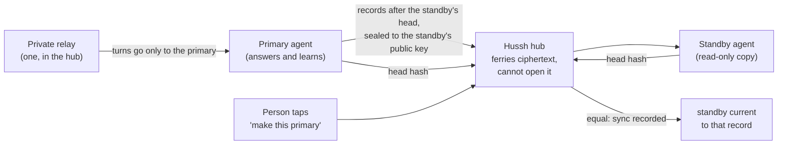

# One agent, two clouds: primary and synced standby

**Status:** design approved by the founder 2026-10-02; engineering decisions settled
2026-10-03; not built. Inherits
`docs/reference/architecture/private-agent-north-star.md` by pointer. Builds on the
cloud-to-cloud move (`docs/reference/architecture/pod-migration.md`) and the Azure
home (`docs/reference/architecture/byoc-azure.md`).

## Visual Map

## Decisions (founder, 2026-10-02)

| Question | Decision |
|---|---|
| How two agents relate | **Primary plus warm standby.** One writer, always. The standby holds a read-only, continuously synced copy. |
| Freshness | **Every few hours**, plus a final sync on every planned switch. A switch after an outage can lose up to one interval of learning. |
| Failover | **Only when the person taps.** The app says the primary is unreachable and offers to promote the standby. |
| What travels | **The sealed memory log and connector logins.** See below: connector logins already follow the person, so nothing secret is copied into a second cloud. |

## Why not two agents that both answer

The agent's memory is one sealed, hash-chained log with a single writer (compare-and-swap
on its head). Two writers in two clouds would fork that history into two agents that
each claim to be the same person's agent, with no correct merge. One writer plus a
standby keeps every guarantee the log already proves (zero-loss is a hash, not a count)
and still gives the person a second home ready in seconds.

## The private relay is not a tunnel, and there is still only one

The private relay (`consent-protocol/api/routes/one/pod_relay.py`) is the hub route that
forwards the owner's requests to the agent's own HTTPS address, recorded by the hub.
With two placements it simply targets the **primary**. The standby receives no turns.
Sync is a separate hub-mediated exchange, not a relay.

## Connector logins follow the person, not the cloud

Verified in code (2026-10-02): connector OAuth credentials are held by the hub,
encrypted (`hushh_mcp/services/external_connector_credentials_service.py`), or in the
person's vault for MCP connections (`hushh_mcp/one_adk/mcp_oauth_storage.py`). The agent
reaches them through the hub's data door. So both placements already use the same
connector logins, a switch needs no re-confirmation, and no live token is ever copied
into a second cloud. "Carry connector logins" is satisfied by construction.

What is per-placement and must move on a switch: owner device bindings
(`pod_binding_v1` names the pod key and address). The hub re-issues them for the new
primary automatically at promotion.

## Model

- **Placements.** The registry row stays the primary's view (every existing reader keeps
  working). A new parked table `personal_agent_standby_placements` holds at most one
  standby per person: target and cloud coordinates, address, pod public keys, the last
  synced sequence and head hash, and the last sync time. A placement epoch increments on
  every promotion.
- **Role is data, not a flag, and it lives outside the log.** The hub tells an agent its
  role in a signed hub proof; the agent stores it as a sealed `pod_role_v1` object in its
  own storage, beside its identity key, never as a log record (see E1). A standby refuses
  turns and every write except sync import.
- **The standby is a full agent.** Same image, its own keys, its own sealed log under its
  own key, its own memory index rebuilt locally (Memory Bank on GCP, keyword recall on
  Azure).

## Sync protocol (every few hours, and before every switch)

1. The hub reads both heads (sequence and hash) through `POST /pod/sync/head`. Equal heads
   record a successful sync with no transfer (E7).
2. It asks the primary to export records **after** that sequence, sealed to the
   standby's published X25519 key. New primitive: a range bundle whose first record
   must chain to the standby's head hash (`seal_bundle` today only carries a whole log
   from sequence 1).
3. The hub ferries the ciphertext (it holds no key for either side, the move's existing
   property, asserted by AST in `test_pod_migration_transport.py`).
4. The standby verifies the primary's signature (E5) and continuity before any append,
   re-seals under its own key, appends with compare-and-swap (E8), and reports its new
   head hash. The chain hash covers plaintext only, so equal heads prove nothing was
   lost or reordered.
5. The hub records the synced sequence, hash and time on the standby placement. A
   mismatch records a failed sync and leaves the standby as it was.

Cadence: a bounded sweep in the reconcile worker, on the existing lease pattern, every
few hours per person. The standby is woken only for the sync (minutes, scale-to-zero
otherwise).

## Switching primary

**Planned (both reachable), one tap:** freeze the primary (the move's existing freeze),
final sync, verify equal heads, bump the epoch, swap primary and standby, re-issue device
bindings, unfreeze the new primary. The old primary becomes the standby and sync reverses
direction. Nothing is lost.

**Failover (primary unreachable), one tap:** the app shows the last sync time ("your
Azure agent has everything up to 3:10 pm"). On the tap, the standby is promoted without a
final sync and the epoch is bumped. When the old primary returns, the hub refuses its
writes (stale epoch on every signed request) and tells it its new role. Records it wrote
after the last sync are kept as a quarantined branch and reported to the person, never
silently merged.

## Engineering decisions (2026-10-03)

Settled from the first build attempt's findings, on the north star's security principles.
None changes a founder decision above.

| # | Decision | Why |
|---|---|---|
| E1 | `pod_role_v1` is a sealed object in the pod's own storage, written with compare-and-swap, never a record in the commit log. The hub never writes any record (config, binding, role) onto a standby; the standby's log changes only by sync import. | Equal heads are the proof that nothing was lost. Any record the standby writes itself forks its chain and breaks every later sync. |
| E2 | The role epoch only moves forward. A set-role proof binds purpose `set-role`, the role, the epoch, an expiry and the **target pod's signing key id**. | Both placements share one HusshID; a proof bound only to it could be replayed at the other placement. |
| E3 | Role reads fail closed. Only a confirmed not-found means "primary" (existing pods unchanged). A 403, transport error, decrypt or unwrap failure refuses turns and writes. A standby is provisioned with `role=standby` written before it can accept anything. | A standby whose role object is unreadable must not promote itself. |
| E4 | The hub fences by key and epoch. Turn and write paths accept only the primary's `pod_signing_key_id`; the standby's key reaches sync paths only. Once a person has a standby or `placement_epoch > 0`, a signed request without `X-Hushh-Pod-Epoch`, or with a stale one, returns `INVALID` (never a new outcome that could fall through to the Google-token path). The header is covered by the signature only when present, so the golden vector stays byte-identical. | Epoch alone cannot tell two placements apart at epoch 0, and an optional header is a downgrade hole. |
| E5 | Ranges are signed by the primary's Ed25519 pod key over (base, head, ciphertext digest). The standby verifies against the primary key id pinned in its role object. | Sealing to the standby gives secrecy but not origin; without a signature the hub could inject chain-valid records. Residual: the pairing is introduced by the hub (pinned once at standby creation). Phase 5 adds the owner's device countersigning the pairing. |
| E6 | Proof audiences bind the request body: `{hub_proof_audience(hushh_id)}:{purpose}:{sha256(canonical body)}`, one definition imported by pod and hub. Range bundles use their own HKDF info (`hussh.pod.sync.range.v1`) with version, recipient key id, base sequence and base head in the AAD. | A captured export proof cannot be redirected to another recipient; cross-replay between whole-log and range bundles fails at decryption, not at a label check. |
| E7 | New pod route `POST /pod/sync/head` (purpose `sync-head`) on both placements. If the primary's head equals the standby's, the sync records success with no transfer. | The hub's own recorded head goes stale after a crash between import and record; an idle person must not read as failing forever. |
| E8 | Import refuses a fork or gap before any append, appends with compare-and-swap on the expected head, and re-importing an applied range returns the same head with no write. The hub lease may expire; the pod-side compare-and-swap is the real fence. | A standby is long-lived and never torn down, so a mismatch must leave it untouched, and two overlapping imports must not both append. |
| E9 | A swap moves the whole placement (target, backend, host, model mode, keys, versions, placement metadata) in one transaction fenced on the observed epoch. It refuses during erasure, an upgrade lease or an unfinished provision, and accepts a `provisioned` or `needs_reinit` primary. Device-keyed `puppy*` keys and `detachedPlacements` stay with the person. | A half-swapped registry row would describe a mixed placement. |
| E10 | Removing a standby keeps its coordinates (never keys or tokens) under `backend_metadata.detachedPlacements`. Account deletion treats a standby exactly like the primary in the external-resource check, at the same point. | No orphaned cloud resources; the registry never holds anything that could decrypt. |

## Phases

| Phase | Outcome | Proof |
|---|---|---|
| 1 | Range bundle (export after a head, continuity-verified import) | unit tests with a forked-chain negative control |
| 2 | Standby placement table, epoch, `pod_role_v1`, standby write refusal | disposable-Postgres tests under the real guard triggers |
| 3 | Sync sweep (every few hours) and on-demand sync | equal heads after sync; a tampered bundle refused |
| 4 | Planned switch and failover switch, device re-binding, stale-epoch fencing | live: switch GCP to Azure and back with a recall question answered after each |
| 5 | App: "add a standby", sync status, "make this primary" | Playwright plus a live run with the founder |

## Known limits

- Freshness is bounded by the sync interval on failover (founder choice: every few hours).
- A standby costs its idle floor (Azure about $5/month list price; GCP cents).
- Erasure must cover both placements; the standby erases through its own cloud's path.
