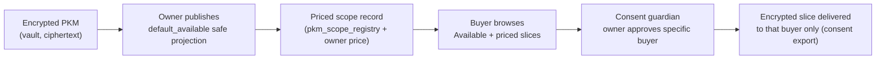

# PKM Data-Slice Marketplace Plan

> Still docs/future, not yet a current-state contract. A working Phase 1 prototype (plus parts of
> Phase 2 and 3) now exists on branch `feat/pkm-slice-pricing-phase1`; see Implementation Status below.
> It has not graduated out of `docs/future/` because the promotion gate is not fully met (buyer
> requests are in-session only, owner-set price is not persisted, tri-flow parity is pending).
> Home rationale: this is a future-facing One product-surface concept, so it lives in `docs/future/`
> under the promotion rules in [README.md](./README.md) and
> [one-product-surface-evolution-plan.md](./one-product-surface-evolution-plan.md).

## Implementation Status (branch `feat/pkm-slice-pricing-phase1`)

Last refreshed 2026-07-01.

### Done on this branch

- Backend pricing engine: pure function `compute_suggested_price` in
  `consent-protocol/hushh_mcp/pricing/slice_pricing.py`, floor-guarded at `$0.10`, with unit tests.
- Backend route: `POST /api/pkm/slice-price` in `consent-protocol/api/routes/pkm.py`, gated by
  `require_pkm_metadata_access`, with a route test. Backend suite: 11/11 green.
- Frontend pricing service and suggested-price display (`lib/services/slice-pricing-service.ts`,
  `components/profile/slice-price-badge.tsx`) shown on `default_available` scopes.
- Marketplace surface under One at `app/one/marketplace/` with three tabs: Owner (price plus posture
  controls), Buyer (browse Available slices, purchasable), and Consent flow and requests (in-session
  approve/deny inbox that shows the real safe-summary preview on approve).
- Real PKM data: the marketplace reads the owner's actual domain manifests and scope registry, not
  hardcoded data.
- Shared publish flow: `lib/personal-knowledge-model/slice-publishing.ts` (`applySlicePosture`) is
  used by both the marketplace and Profile so the vault-write posture flow is not forked.
- Consent-first publish: an explicit owner consent modal before a slice is listed.
- Server-authoritative reflection: after a publish, the UI re-fetches the persisted posture and
  reports the truth, so there is no fake success and no silent revert.
- Buyer privacy: the buyer view shows only safe-summary column names, never real values.
- Backend correctness fix: corrected a malformed `revoked_at IS 'null'` filter to a real `IS NULL`
  (it was causing a 500 on the default-available projection path).
- Nav and route wiring: `ONE_MARKETPLACE` route, One hub tile, route-map, native-route-inventory,
  and generated surface map updated; dashboard test updated.

### Known limitation (by design)

The consent guardrail refuses `default_available` for scopes it tags `restricted` (or structural
blocked keys), even with owner consent. Confidential and public slices publish and persist; restricted
ones stay consent-gated. This is enforced server-side in `_normalize_visibility_posture` and is
intentional. The client cannot yet reliably tell which categories are publishable before trying,
because the served manifest does not always carry a scope's real sensitivity tier (the frontend
defaults a missing tier to `confidential`). Surfacing a backend-computed per-scope publishable flag is
the next honest improvement (see Later).

### Later (not in this branch)

- Backend-computed per-scope publishable/eligible flag surfaced in the manifest, so the marketplace
  shows "can be made available" versus "protected" per category instead of guessing.
- Persisted buyer requests routed through the real consent guardian (current requests are in-session
  demo only and clear on refresh).
- Persisted owner-set price on `pkm_scope_registry` and in the consent/audit trail (today the price is
  computed and displayed, not stored as a purchase term).
- Payment and settlement rail (Phase 4), still out of near-term scope.
- Optional policy decision (Option B): allow an owner to consent-override exposure of their own
  restricted data. Requires consent-owner sign-off and is deliberately not built.
- Tri-flow (web/iOS/Android) parity and the full promotion gate before graduating out of docs/future.

## Visual Map



The storefront adds two things to today's flow: a **price tag** (owner-set) and a **place to browse**.
It never bypasses the owner's per-buyer approval, and it never exposes raw PKM.

## Purpose

Let a user publish safe projections of their PKM as **priced, individually-consentable subscription
slices**, and let a buyer (advertiser or agent) pay for time-boxed scoped access — with the owner
approving each specific buyer through the existing consent guardian. This doc records the verified
current truth, the backend/frontend split, the pricing model, and a phased path that reuses existing
contracts instead of building a parallel trust plane.

Originating brainstorm: the "PKM-Priced Subscription Marketplace" notes, Foundation-styled mockup,
and research-anchored pricing deck (Cheng et al. composite valuation; arXiv 2303.04810 two-part
tariff; arXiv 2111.04427 marketplace price drivers).

## Current Truth (verified in repo)

| Idea piece | Existing primitive | Location (verified) |
| --- | --- | --- |
| Encrypted, portable PKM | Domain-partitioned encrypted PKM + scope registry | `consent-protocol/` (`scope_registry` referenced in `server.py`) |
| Publishing one shareable slice | `default_available` posture ("user-published safe projection only") | consent-protocol migrations + tests (`test_marketplace_visibility_posture_migration.py`) |
| External party requesting scoped access | Consent Protocol Developer API + MCP consent/export flow (PCHP) | consent-protocol (`test_developer_api_routes.py`, `test_consent_exports_ttl_eviction.py`) |
| Owner approving a specific requester | Consent guardian / consent grant + export | `consent-protocol/hushh_mcp/...` (guardian references) |
| Managing who has access | `/consents` UI | `hushh-webapp/app/consents/` |
| Two-sided discovery (today) | `/marketplace` (investor↔RIA only) | `hushh-webapp/app/marketplace/`, [../reference/iam/marketplace-contract.md](../reference/iam/marketplace-contract.md) |
| PKM surface under One | `app/one/pkm` | `hushh-webapp/app/one/pkm/` |
| Frontend→backend pipe for One | One API proxy | `hushh-webapp/app/api/one/[...path]` |
| Brand-side access as a named future lane | PCHP brand-side access row (future-facing) | [one-product-surface-evolution-plan.md](./one-product-surface-evolution-plan.md) §Surface Lanes |

## What Does Not Exist Yet (verified absent)

- No pricing engine, no `price` field on any consent or PKM contract.
- No net-worth-based or dynamic pricing input.
- No general advertiser/agent marketplace (`/marketplace` is investor↔RIA only).
- No per-slice monetary transaction of any kind — consent grants are access grants, not purchases.
- No payment/billing (Stripe or otherwise) rail anywhere in the repo.

## Locked Decisions

1. **Backend-led, not frontend-only.** Consent enforcement and price integrity are trust boundaries.
   A browser can be tampered with, so both must be server-side. The buyer never touches vault
   plaintext — the marketplace sells the `default_available` safe projection only.
2. **User sets the price per slice** (not the platform). The research formula produces a *suggested*
   price computed on the backend; the **owner's chosen value is the source of truth**, floor-guarded
   at `p_f = $0.10`, denominated in USD, and recorded in the consent/audit trail so the buyer
   approves a specific, owner-set price.

## Architecture: Backend vs Frontend Split

| Piece | Layer | Home | Status |
| --- | --- | --- | --- |
| Pricing engine (suggested price) | **Backend** — pure function, single source of truth | `consent-protocol/` | new (self-contained, touches no ciphertext) |
| Priced-scope data shape (owner price + slice = `attr.{domain}.*`) | **Backend** — hangs off scope registry | `pkm_scope_registry` / `default_available` | extend existing |
| Buyer request → owner approval | **Backend** — reuse consent guardian + consent export | consent-protocol consent flow | already exists |
| Owner view (set price, posture, approve/deny) | **Frontend** | `hushh-webapp/app/one/` (beside `app/one/pkm`) | extend |
| Buyer view (browse Available + priced slices) | **Frontend** | `hushh-webapp/app/one/` | new |
| Frontend→backend calls | **Proxy** | `hushh-webapp/app/api/one/[...path]` | reuse |
| Payment / money settlement | **Backend** — new rail | none | out of near-term scope |

## Pricing Model

Reference formula (owner-facing **suggestion**; owner may override down to the floor):

```
suggested(30d) = ( p_f + Σ_c k_c · a_c · richness(n_c) ) × B × F × X × G
p_f = $0.10 (floor)   richness(n) = 1 + ln(n)
B = purchasing-power × buying-mood   F = freshness   X = exclusivity   G = geo/coverage
```

Owner-set price rule: `final_price = max(p_f, owner_input)`, USD, recorded with the scope grant.
Bundling (later) must stay arbitrage-free: `P_bundle ≤ Σ P_slice`.

Per-slice prices are intentionally small (cents to low tens of dollars) — value comes from **scale
and recurrence**, not one large number. Audience band is a user-entered demo input; deriving `power`
from verified financial PKM is a later phase that likely needs its own consent scope.

## Phased Delivery

**Phase 0 — no-code validation. [done]** Walk `/consents` and the `default_available` publish flow as a
test user to confirm the slice-publishing mechanic feels right before adding any pricing logic.

**Phase 1 — smallest shippable slice (recommended first PR). [done]** Backend pricing engine as a pure
function + display the computed **suggested** price on an existing `default_available` slice under
One. No buyers, no money, no new consent scope. Attach point: `app/one/pkm` (display) +
`app/api/one/[...path]` (proxy) + new backend engine module. Prove with unit tests on the pure
function and a route/caller test.

**Phase 2 — owner controls. [partial]** Owner toggles posture (Private / Consent-only / Available)
with a consent-first modal, and approves/denies buyer requests in the marketplace inbox. Done on this
branch. Still pending: price override UI, persisting the priced-scope shape on `pkm_scope_registry`,
routing approve/deny through the real consent guardian, and recording the owner-set price in the
consent/audit trail.

**Phase 3 — buyer-side discovery. [prototype]** A buyer tab lists only `default_available` slices as
purchasable and files a request. Done on this branch as an in-session prototype. Still pending: real
persistence, guardian-routed requests, and consent-export delivery (ciphertext to that buyer only).

**Phase 4 — payment rail (out of near-term scope). [not started]** The first billing integration in the repo.
Money sits **between** owner approval and delivery — an extra gate after consent, never a replacement
for it. Needs its own audit/consent-event trail. Estimated 2–4 weeks; not part of the first slice.

## Trust Boundaries & Promotion Gate

Per [one-product-surface-evolution-plan.md](./one-product-surface-evolution-plan.md), this graduates
from `docs/future/` into current-state docs only when:

- a reachable route/component/backend route/native path exists;
- the owner is clear (One, with backend consent/PKM ownership retained by the consent protocol);
- vault, consent, auth, and audit boundaries are documented — specifically: buyer receives only the
  `default_available` projection, never raw PKM/`pkm.read`/blobs; owner approval is mandatory and
  per-buyer; owner-set price is recorded in the audit trail;
- tests or smoke checks prove the behavior;
- tri-flow (web/iOS/Android) parity is maintained — any new route runs the frontend-native-surface-map
  workflow (`cd hushh-webapp && npm run verify:surface-map`).

## What Not To Build

- A parallel marketplace or trust plane that bypasses the PCHP consent/export flow.
- Any path that hands a buyer raw PKM, `pkm.read`, encrypted blobs, workflow artifacts, hashes, or
  provenance — `default_available` is a safe projection only.
- A pricing value the frontend can set or alter without backend validation and the `p_f` floor.
- A payment rail that settles before, or in place of, the owner's per-buyer consent approval.
- Net-worth-derived pricing that pulls protected financial PKM without its own consent scope.
- A new top-level subsystem — reuse `app/one/`, `app/api/one/[...path]`, `pkm_scope_registry`, and
  the consent guardian/export flow.

## Open Decisions

- **Buyer identity:** human brand/advertiser vs autonomous agent. If autonomous, define what stops an
  agent from buying access to bait or manipulate the owner (abuse-protection design). Does not block
  Phase 1.
- **Verified `power`:** whether net-worth-based pricing must be verified (e.g. via the portfolio
  parser), and whether that needs a new consent scope just to compute a price.

## Related References

- [./one-product-surface-evolution-plan.md](./one-product-surface-evolution-plan.md)
- [./README.md](./README.md)
- [../reference/iam/marketplace-contract.md](../reference/iam/marketplace-contract.md)
- [../reference/architecture/architecture.md](../reference/architecture/architecture.md)
