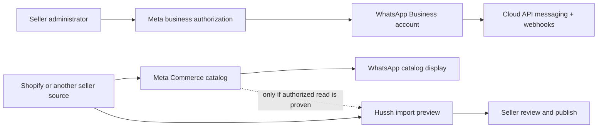

# WhatsApp Business and Seller Catalog Plan

> Status: future roadmap, planning only. This document turns the founder's
> WhatsApp Business requirements into testable work. It does not claim that a
> WhatsApp connector, seller catalog, or Shopify import is shipped. The website
> WhatsApp contact entry point is being handled by a teammate and is out of
> scope here.

## Visual Map

## Problem and intended outcome

Sellers joining Hussh should be able to bring an existing product or service
catalog into their Hussh presence without recreating every item. The founder
also wants Hussh to connect authorized WhatsApp Business accounts, use the
WhatsApp Business Platform for appropriate messaging and verification, and
prepare to onboard other businesses through Meta's partner path. The team
reports that the `Hussh Puppy` Shopify store is live and intended to sell Apple
products. A read-only Shopify audit found one USD 0 order but no revenue order;
product sourcing remains undecided. This store and the founder's WhatsApp
Business account are the first proposed pilot.
A separate business line for each field salesperson, with access to the same
catalog, is a later operational test.

In this plan, **seller** or **field salesperson** means a human business actor.
It does not mean One or another Hussh private agent.

## Commercial validation before the full build

There are two distinct business cases. **Hussh Puppy as Hussh's own store**
would earn product sales margin. One and WhatsApp could help shoppers choose a
product, ask questions, and complete or follow up on a purchase. The store's
economics depend on genuine product sourcing, acquisition cost, price, payment
fees, fulfilment, returns, marketing, WhatsApp, AI, and support. Because there
is no revenue order yet, neither demand nor contribution margin has been shown.
Confirm supplier terms, warranty and returns responsibility, and rights to use
Apple's logo or marketing assets before making authorization claims or
publishing branded promotions.

**Hussh as a platform for other sellers** could earn subscription or
outcome-linked revenue later. The founder/store pilot can prove that the
integrations work, but cannot prove that independent sellers will pay for them.
Shopify-to-WhatsApp catalog sync,
WhatsApp team inboxes, and AI replies are already offered by other products;
Meta also offers Business AI within the WhatsApp Business app in India. Hussh
should therefore test an outcome that sellers can value beyond basic sync:
One helps a consenting buyer discover a relevant seller item or service,
shares only the buyer-approved inquiry, and lets the seller respond through an
authorized business channel. This remains a hypothesis until real buyers and
sellers use it.

For the own-store pilot, first settle sourcing and calculate expected
contribution per order. Then inspect the live Shopify product listings and
checkout, run a small manual WhatsApp selling test, and record attributable
inquiries, completed orders, and support effort. Only automate the steps that
recur and demonstrably improve conversion or save staff time. The full
WhatsApp API and One seller flow are later investments.

Before committing to a broad seller catalog UI, multiple field-sales lines,
or the full Tech Provider onboarding program:

1. Interview at least ten independent sellers in one chosen segment. Record
   their current WhatsApp lead volume, catalog maintenance effort, response
   time, conversion, gross margin, current tools, and current spend.
2. Run three to five limited pilots beyond the founder account. Measure
   catalog setup time, qualified inquiries, attributable orders or bookings,
   seller time saved, and the rate of human handoff. Establish a baseline
   before automating anything.
3. Ask for a paid pilot at a stated price. Continue only if several sellers
   actually pay, or make a concrete paid commitment, and the expected monthly
   revenue per seller exceeds messaging, AI, onboarding, and support costs.
   The exact price and pass threshold are business decisions to set from
   interviews; they are not assumed here.
4. If One has too little buyer demand to create qualified inquiries, test the
   narrower merchant workflow first and defer any marketplace revenue claim.
   If sellers only want basic catalog sync or generic auto-replies, compare a
   partner integration with building those features ourselves.

For each pilot seller, estimate monthly seller value as **incremental orders or
bookings attributable to the pilot × contribution margin + staff time saved −
Hussh fees − messaging costs**. Estimate Hussh's own contribution after Meta
fees, AI usage, infrastructure, and onboarding/support. These measurements,
not catalog size or message count alone, decide whether to expand.

## Current repo truth

- The external connector registry is for curated external MCP servers with
  per-user credentials, OAuth/API-key lifecycle, and disconnection. Its
  authorization and revocation pattern is useful, but it is not a Meta Business
  or WhatsApp Cloud API integration.
- The existing Information Marketplace catalog exposes consent-governed
  personal-information slices. It is not a merchandise catalog and must not be
  reused as seller inventory storage.
- No seller product/SKU model, WhatsApp webhook consumer, Meta business asset
  connection, or Shopify product import was found in the inspected source.
  Shopify is explicitly absent from the current connector panel; the existing
  custom MCP form does not provide a commerce catalog import flow.
- One is the user-facing private agent. Seller business assets and catalog
  records need their own authority, consent, audit, and lifecycle contract;
  they must not be silently converted into a user's PKM or published through
  the Information Marketplace.

## Separate the three integrations

1. **WhatsApp Cloud API:** business messaging, inbound webhooks, delivery
   status, templates, and phone-number assets. This is the platform channel.
2. **Seller authorization:** a business administrator grants Hussh access to
   the relevant Meta business assets. A code received at a phone number shows
   access to that number; it does not establish authority over a brand or
   catalog. Keep personal and business numbers distinct.
3. **Catalog source:** Shopify, an authorized Meta Commerce catalog, or another
   seller-owned feed supplies product data. Whether an app-only WhatsApp
   Business catalog can be read through a documented API remains an explicit
   feasibility question. Do not promise one-click import from every WhatsApp
   catalog until the pilot proves it.

## Start here: founder pilot runbook

The team has chosen a technical-first internal pilot. A private, read-only
Shopify-to-One preview and a Meta test-number conversation can be exercised
before pricing, stock, sourcing, warranty, and returns are confirmed. Those
commercial checks remain mandatory before buyer-facing offers, catalog sync to
Meta, or a live sale. The P0 website work belongs to a teammate.

The first technical sequence is: (1) install a Hussh-owned Shopify app with
`read_products` only; (2) configure five selected product IDs and an exact One
pilot owner UID on the backend; (3) verify `/one/seller-catalog/pilot` displays
the source records privately; (4) add the WhatsApp use case to the Hussh Meta
developer app and use Meta's provided test sender with an opt-in team recipient;
(5) verify one neutral test message and reply, with no product offer; (6)
configure the signed Hussh test webhook on a deployed backend and verify a new
reply reaches it. The user's
recipient number was supplied in chat and must not be copied into this repo.
The operational WhatsApp Business app number stays untouched during this test.

The later commercial and publication gates are:

| Gate | Action | Output |
| --- | --- | --- |
| 0. Confirm retail economics | Before buyer-facing promotion, identify the Apple product supplier and sales model, purchase cost, selling price, warranty and returns responsibility, and rights to use brand assets. Inspect the live Hussh Puppy storefront. | A legitimate supply path and estimated contribution per order after payment, delivery, returns, and marketing costs. |
| 1. Choose a sample | Founder or Shopify administrator picks 5–10 representative items, including a variant, an unavailable item, and a price change if those exist. | A named pilot set and the fields One must preserve: title, image, description, price, currency, availability, variant, source ID, and link. |
| 2. Inventory business assets | Meta administrator confirms Business Portfolio, WhatsApp Business Account, phone number, whether it uses the Business app or Cloud API, and any connected Meta catalog. Shopify administrator confirms the store and existing Meta sales-channel sync. | Asset IDs, ownership, and current connection state recorded in a restricted working note; no tokens or secrets in the roadmap. |
| 3. Prove display | Check whether the chosen Shopify items reach a Meta catalog and appear in the founder's WhatsApp catalog. Record any rejected or missing items and their reasons. | A real item is visible in WhatsApp and its originating Shopify/Meta identifiers are known. |
| 4. Prove authorized read | With the business administrator's grant, test the documented API path to enumerate the linked catalog and read those items. Test an app-only WhatsApp catalog separately if that is the founder's source. | A field-by-field read result and an explicit supported/unsupported/unknown verdict for each source. |
| 5. Select the first One import source | If the Meta catalog read works, compare it with direct Shopify access. If it does not, use an authorized Shopify API or seller-provided feed for One import while keeping WhatsApp messaging as a separate integration. | One source-of-truth decision and a small execution spec for connect, preview, approve, refresh, and disconnect. |

The pilot passes only when a seller-authorized path can reproduce the sample
items accurately and explain what happens after a product changes or disappears.
Do not expand to all items or field-sales lines until that result is repeatable.

### Read-only pilot inventory (2026-10-01 to 2026-10-02)

- A team member has full administrator access to the `Hushh-Agent` Meta
  Business Portfolio.
- The portfolio lists one WhatsApp Business Account. Its only listed phone is a
  pending +1 555 test-style number. The account summary shows business
  verification as unverified and an account review in progress.
- The portfolio has no Meta Commerce catalogues yet. It lists two developer
  apps, `Hushh Metrics` and `hushh-agent-wp`. On October 2, the WhatsApp use
  case was added to `hushh-agent-wp`, Meta's test sender was claimed, and an
  opt-in team recipient was verified. Meta's `Hello World` template was sent
  from the test sender, delivered to the recipient, and the reply `Hi` appeared
  in Meta's test webhook event view. This proves Meta's sandbox conversation;
  it does not yet prove delivery to a Hussh backend webhook. The temporary user
  token is for sandbox testing and must not be used as a production credential.
- A signed webhook handler now exists in the backend code. It accepts only the
  configured test WABA and phone ID and logs event counts without message text
  or sender numbers. It still needs separate Secret Manager credentials,
  deployment, Meta callback registration, and a fresh reply to prove delivery
  to Hussh. The observed `Hi` reply was seen in Meta's test viewer only.
- The founder's operational number is currently in the WhatsApp Business app,
  according to the team. Its relationship to the listed test-style number,
  Meta asset linkage, and catalog source still need to be established.
- Shopify plugin access is connected to `Hussh Shop` (`shop.hushh.ai`), the
  current Shopify store name for the team's `Hussh Puppy` pilot. It is on the
  Advanced plan with USD pricing and a United States store country. The team
  member's individual Shopify user has the Organization Administrator role.
  Recheck account and asset states before configuring the pilot because they
  can change.
- On October 2, a separate `Hussh One Seller Catalog Pilot` developer app was
  released and installed on `Hussh Shop`. Its active version declares only
  `read_products` as an API scope. Shopify's installation consent screen also
  disclosed store-owner contact details; the administrator explicitly approved
  that disclosure. The backend credential is not configured in this repo.
- Shopify reports 97 products and 11 collections, including an Apple collection
  with 18 products. Of the 18 Apple listings inspected, nine are active and
  nine are drafts. The store also lists other vendors and compute products; it
  is not currently an Apple-only catalog. All nine active Apple products show
  quantity five, which needs reconciliation with the still-undecided sourcing
  and actual fulfillable stock before sales are promoted.
- The Apple catalog includes both an active and a draft `iPhone 17 (8 GB,
  512 GB)` listing at different USD prices. Resolve which record is canonical
  before any catalog sync or One import. Keep unreleased and quote-only items
  out of a priced retail pilot unless their availability and purchase path are
  explicitly reviewed.
- Shopify reports one order, number `#1001`: USD 0, paid, and unfulfilled.
  Its value does not establish customer demand or a sale margin. Confirm its
  purpose with the store owner rather than treating it as a paid pilot order.

### Selected Shopify catalog pilot set (2026-10-02)

The team delegated selection of five to ten sample items. These five Apple
records are the **technical import sample** because Shopify currently returns
an active status, a positive USD price, SKU, description, image, and five
available units at one location for each. This verifies the Shopify data
fields, **not** physical stock, supplier rights, exact configuration, pricing
economics, warranty, or permission to promote the items. No item is cleared
for a customer-facing WhatsApp or One sales pilot yet.

| Shopify product | Shopify product ID | SKU | Current USD price | Shopify available |
| --- | --- | --- | ---: | ---: |
| Apple iPhone 17 (8 GB, 512 GB) | `10281892708568` | `APL-IP17` | 929 | 5 |
| Apple iPhone 17 Pro Max (12 GB, 2 TB) | `9470515249368` | `APL-IP17PM` | 1,199 | 5 |
| Apple iPad Pro M5 (16 GB, 2 TB) | `9470521409752` | `APL-IPADPRO-M5` | 1,199 | 5 |
| Apple MacBook Pro 14 M5 Pro (64 GB, 4 TB) | `9470685446360` | `APL-MBP14-M5PRO` | 2,499 | 5 |
| Apple MacBook Pro 16 M5 Max (128 GB, 8 TB) | `9470683676888` | `APL-MBP16-M5MAX-128` | 6,899 | 5 |

This set covers phones, a tablet, and laptops with different price points.
All five are single-default-variant products. For variant-mapping behavior,
use `ASUS Ascent GX10` (`9470699798744`) as a **technical-only** sixth fixture:
Shopify has three priced storage variants and five available units per
variant. Its product title says 4 TB while variants include 1 TB, 2 TB, and
4 TB, so review the title before any customer-facing import. It is outside
the proposed Apple retail assortment.

### Draft One import preview and connection check (2026-10-02)

This is a read-only preview of what a seller would review in One, the private
agent. Nothing was imported into One, published to WhatsApp, or changed in
Shopify. The proposed source of truth for this preview is Shopify store
`Hussh Shop` (`shop.hushh.ai`), under a seller business principal separate
from a buyer's private information. Every row remains `needs_seller_review`;
Shopify's `ACTIVE` status and recorded inventory do not confer sale approval.

| Preview item | Shopify handle | Shopify variant ID | SKU | USD price | Recorded quantity | Primary image |
| --- | --- | --- | --- | ---: | ---: | --- |
| iPhone 17, 8 GB / 512 GB | `iphone-17` | `52545534361816` | `APL-IP17` | 929 | 5 | [View](https://cdn.shopify.com/s/files/1/0839/7039/2280/files/ap-ggaai1w-apple-iphone-17-white-2.jpg?v=1790219485) |
| iPhone 17 Pro Max, 12 GB / 2 TB | `iphone-17-pro-max` | `52419570630872` | `APL-IP17PM` | 1,199 | 5 | [View](https://cdn.shopify.com/s/files/1/0839/7039/2280/files/iphone__bh930eyjnj0i_og.png?v=1789409957) |
| iPad Pro M5, 16 GB / 2 TB | `ipad-pro-m5` | `52419580199128` | `APL-IPADPRO-M5` | 1,199 | 5 | [View](https://cdn.shopify.com/s/files/1/0839/7039/2280/files/Apple_iPad_Pro_M5_13_white.png?v=1790221713) |
| MacBook Pro 14 M5 Pro, 64 GB / 4 TB | `macbook-pro-14-m5-pro-1` | `52419865247960` | `APL-MBP14-M5PRO` | 2,499 | 5 | [View](https://cdn.shopify.com/s/files/1/0839/7039/2280/files/ec21f3e49509-apple-14inch-macbook-pro-m5.webp?v=1790218791) |
| MacBook Pro 16 M5 Max, 128 GB / 8 TB | `macbook-pro-16-m5-max-128gb-1` | `52419857907928` | `APL-MBP16-M5MAX-128` | 6,899 | 5 | [View](https://cdn.shopify.com/s/files/1/0839/7039/2280/files/mac-macbook-pro-specs-select-202601-16inch-spaceblack.jpg?v=1790218845) |

The import contract should preserve the full Shopify product and variant GIDs,
seller business ID, title, vendor, type, sanitized description, all image URLs
and alt text, SKU, variant options, price and currency, recorded inventory,
source handle, source update timestamp, sync time, and review state. Product
links can be derived from `https://shop.hushh.ai/products/{handle}`, but the
pilot must verify each storefront link and sales-channel publication before
showing it to a buyer. Only the iPhone 17 link was opened and checked in this
audit. Price and availability should refresh from Shopify before any buyer
reply; a missing, draft, deleted, or disconnected source item must stop being
offered. A Shopify `Default Title` variant is an internal placeholder, not a
buyer-facing option label. Test variant mapping separately with the ASUS
fixture, and test exclusion with draft, zero-stock `Apple iPad Air M4`
(`10281893527768`, SKU `APL-IPADAIR-M4`); neither belongs in the five-item
Apple sales sample. Price-change refresh remains untested because no product
was edited.

The public iPhone 17 page currently shows **512 GB** in its title and **USD
929** beside enabled `Add to cart` and `Buy it now` buttons, while its own
description says USD 929 is for **256 GB** and 512 GB is USD 1,129. This is
an internal listing contradiction,
independently of any Apple price comparison. Block that row from any buyer
reply or catalog publication until the store owner fixes and verifies the
configuration and price. The iPad Pro title also omits screen size,
connectivity, and glass choice, so the exact 2 TB configuration needs review.
The remaining three descriptions and images still require owner approval for
accuracy and use rights.

Read-only connection check: Shopify Settings lists `Online Store`, `Shop`,
and `Point of Sale` as installed sales channels; `Facebook & Instagram by
Meta` is not listed. Installed apps include the `Shopify ChatGPT MCP App`,
`STOQ`, and `Messaging`, with no Meta catalog sync app listed there. The
`Hushh-Agent` Meta Business Portfolio currently says **No catalogues added**.
These observations do not show an active Shopify-to-Meta catalog sync, so
Gate 3 has not passed. The founder's operational WhatsApp Business app number
and its catalog linkage were not verified in this check; do not infer that
the pending test-style WABA number is the founder's number.

Anoushka, as store owner, is the named reviewer for the five Apple rows.
Before a customer-facing pilot, she should confirm for each SKU: supplier and
right to resell, exact model/configuration, purchase cost and expected margin
after fees, physically fulfillable stock and location, shipping lead time,
warranty and return responsibility, and permission to use each image and brand
asset. She should resolve the iPhone price contradiction and the draft active
duplicate, then approve the corrected titles, descriptions, prices, and
assortment. Record approval against exact Shopify product and variant IDs and
re-run the preview after any edits. Until then, use the five records only for
private technical mapping and review.

A spot check against Apple's current United States store reinforces the price
review: Shopify lists the 512 GB iPhone 17 for USD 929,
while [Apple's direct 512 GB option](https://www.apple.com/shop/buy-iphone/iphone-17)
is USD 1,129. Shopify lists the 2 TB / 16 GB M5 iPad Pro for USD 1,199,
while [Apple's 2 TB / 16 GB configurations](https://www.apple.com/shop/buy-ipad/ipad-pro)
are priced substantially higher and depend on screen size, connectivity, and
glass, which the Shopify title does not specify. A reseller may set different
prices; these comparisons are a prompt to verify sourcing and margin, not a
claim that Shopify's prices are invalid. Also exclude the draft duplicate
`iPhone 17 (8 GB, 512 GB)` and zero-stock drafts from the first import.

## Workstreams and promotion gates

The private technical preview may begin before workstream 0 closes. Workstream
0 still gates any sale, customer-facing recommendation, or product catalog
publication. A neutral Meta test message may use a Meta-provided sender and an
opt-in team recipient without involving the founder's live business number.

| Order | Workstream | Evidence needed before expanding scope |
| --- | --- | --- |
| 0 | Confirm Hussh Puppy product sourcing, retail margins, and a tracked manual WhatsApp sales test. Interview independent sellers separately before a platform build. | A documented supply path, expected contribution per order, own-store demand evidence, and paid interest from external sellers. |
| 1 | Confirm Hussh's Meta Business Portfolio, developer app, WhatsApp Business Account, administrator, business number, billing owner, and test environment. Scope the Tech Provider and App Review requirements; start the full client-onboarding path once the commercial gate passes. | Asset inventory and review requirements recorded without copying credentials into docs. |
| 2 | First preview selected Shopify records privately in One. After commercial review, sync a small product set to a Meta catalog, display it in WhatsApp, and inspect which catalog IDs and fields Hussh can read with explicit authorization. | The private source read is demonstrated first; customer-facing publication waits for an accurate, approved item. |
| 3 | Define seller onboarding and catalog contracts: business principal, authorized assets, personal versus business phone numbers, source-of-truth selection, item mapping, provenance, deduplication, refresh, disconnect, and deletion. | A seller can review the exact import and its authority before any item is published. |
| 4 | Build a narrow WhatsApp Cloud API pilot for a business-owned number: webhook verification, inbound event processing, outbound approved template, message status, retry and idempotency, consent and human handoff. | One authorized message and reply complete end to end with an auditable status. |
| 5 | Pilot one field salesperson's business line and catalog access. Decide whether each representative needs a separate number or one business inbox with assignment. | Real account behavior, catalog visibility, support workload, and costs are measured before broader rollout. |

Meta's Tech Provider path and Embedded Signup are the likely path for a product
that onboards other businesses; the exact account status and required App
Review permissions must be confirmed in Hussh's Meta dashboard. A pilot using
Hussh's own account does not prove that client onboarding is approved.

## Product and trust decisions

- Decide whether Hussh stores a reviewed copy of seller items or displays a
  live external catalog. Identify the source of truth for price, availability,
  images, variants, and removal.
- Decide whether the first seller cohort offers physical products, services,
  or both. Meta and Shopify catalog eligibility can differ by item type and
  market; a service catalog may need a separate import path.
- Record the seller's grant, scopes, business asset IDs, last successful sync,
  and revocation state. A disconnect must stop future reads and sends.
- Obtain recipient opt-in and use approved templates for business-initiated
  WhatsApp messages. Provide a clear human support path for automated replies.
- Keep cost modeling tied to the current Meta rate card, message category,
  recipient market, and any provider fee. Do not use a fixed per-message
  assumption in the product contract.

## Ready for execution when

1. The founder pilot identifies a supported, authorized catalog data source.
2. Product names the first seller cohort, item types, source of truth, and
   whether WhatsApp catalog import or Shopify import is the first release.
3. Hussh's Meta administrator confirms the account and Tech Provider review
   state and grants a safe test environment.
4. Backend and frontend owners agree on the separate seller catalog and
   business connection contracts, including consent, audit, and revocation.
5. The first release's measurable acceptance flow is written: connect,
   preview, approve, publish, refresh, and disconnect; messaging acceptance
   remains a separately gated flow.

## External references

- [Meta WhatsApp Business Platform developer hub](https://whatsappbusiness.com/developers/developer-hub/)
- [Meta Business AI for small businesses in India](https://about.fb.com/news/2026/05/introducing-business-ai-on-whatsapp-for-small-businesses-in-india/)
- [Apple trademark and marketing guidelines](https://www.apple.com/legal/intellectual-property/guidelinesfor3rdparties.html)
- [Meta's official WhatsApp app on the Shopify App Store](https://apps.shopify.com/whatsapp)
- [Interakt's Shopify catalog and messaging app](https://apps.shopify.com/interakt-sales)
- [Zoko's Shopify catalog and messaging app](https://apps.shopify.com/whatsapp-button-chat)
- [Meta Tech Provider and partner path](https://whatsappbusiness.com/partners/become-a-partner/)
- [Meta Embedded Signup collection](https://www.postman.com/meta/whatsapp-business-platform/documentation/du6gzjv/embedded-signup)
- [Shopify product sync to Meta catalog](https://help.shopify.com/en/manual/online-sales-channels/social-commerce/facebook-instagram-by-meta)
- [WhatsApp Business app catalog and connected Meta catalog](https://faq.whatsapp.com/405903568419894/)
- [WhatsApp Business Messaging Policy](https://whatsappbusiness.com/policy/)
