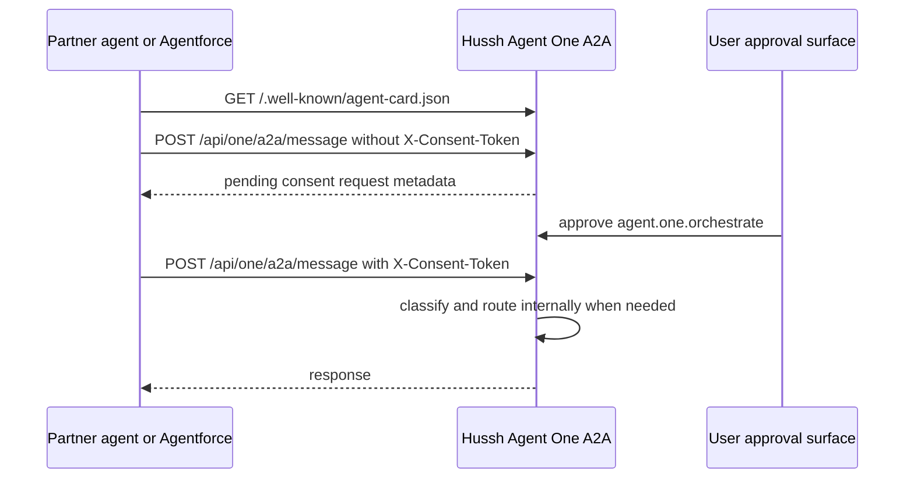

# Agent One A2A External Developer Guide

Status: Current implementation guide, verified against the Agent One A2A route contract on July 6, 2026.

## Visual Context

Canonical API owner: [../reference/architecture/api-contracts.md](../reference/architecture/api-contracts.md). This guide is the shareable integration brief for external developers and partner platforms such as Salesforce Agentforce.



## Credential Sheet

Fill these values for the specific external developer. Do not commit real tokens to Git, CRM records, Salesforce prompts, logs, or screenshots.

| Field | Value to provide |
| ----- | ---------------- |
| Hussh base URL | `https://<hussh-api-host>` |
| Hussh A2A agent id | `agent_one` |
| Required consent scope | `agent.one.orchestrate` |
| Developer app agent id | `<developer-app-agent-id-issued-by-hussh>` |
| Developer token | `<developer-token-issued-by-hussh>` |
| Consent token | `<user-approved-HCT-token-for-agent.one.orchestrate>` |

The developer token authenticates the external app. The consent token authorizes that app to coordinate Agent One for one user under `agent.one.orchestrate`. The runtime rejects a consent token if its app/agent id does not match the authenticated developer token.

The shell snippets below use compatibility-style variable names:

```bash
HUSHH_ONE_BASE_URL="https://<hussh-api-host>"
HUSHH_DEVELOPER_TOKEN="<developer-token-issued-by-hussh>"
HUSHH_ONE_CONSENT_TOKEN="<user-approved-HCT-token-for-agent.one.orchestrate>"
```

## What Agent One Exposes

Agent One is the top private-agent coordination surface. External systems call Agent One with the user's approved request. Agent One may answer directly or route the request internally, but internal routing names are not part of the external integration contract.

The external caller should send the user's natural-language task to Agent One and let One classify the request. Do not build direct internal-agent routing in a partner system.

## Endpoints

| Method | Path | Auth | Purpose |
| ------ | ---- | ---- | ------- |
| `GET` | `/.well-known/agent-card.json` | Public metadata | Standard A2A Agent Card discovery endpoint |
| `GET` | `/api/one/a2a/card` | Public metadata | Hussh compatibility alias for the same Agent Card |
| `POST` | `/api/one/a2a/message` | `Authorization: Bearer <developer-token>` | Create or report a pending consent request when no `X-Consent-Token` is present |
| `POST` | `/api/one/a2a/message` | `Authorization: Bearer <developer-token>` plus `X-Consent-Token: <consent-token>` | Execute Agent One for an approved user |

Use the `Authorization` header for the developer token. A legacy `?token=<developer-token>` query parameter is still accepted, but it can leak through URLs, proxy logs, browser history, and Referer headers.

## Request Body

```json
{
  "message": "Please review my portfolio allocation",
  "userId": "user-one",
  "email": "user@example.com",
  "phoneNumber": "+15551234567",
  "countryIso2": "US",
  "country": "United States",
  "conversationId": "sf-case-500xx0000012345",
  "persona": "investor",
  "reason": "Coordinate this request through Agent One for the approved Salesforce workflow.",
  "approvalTimeoutMinutes": 60,
  "expiryHours": 24
}
```

`message` is required. Provide exactly one stable user lookup when requesting consent: `userId`, `email`, or `phoneNumber` plus country context when needed. When executing with `X-Consent-Token`, the backend derives the user from the signed token and rejects mismatched body identifiers.

## Call 1: Discover The Agent Card

The Agent Card is discovery metadata. It tells the partner where Agent One is, what scope is required, and how to authenticate. The actual user task, such as a KYC account-opening request, belongs in `POST /api/one/a2a/message`.

Other agents use the card's public name, description, required scope, endpoint, and capability hints to decide whether to delegate to Hussh Agent One. Delegate when the user request needs Hussh-managed consent, user-owned personal data, KYC/account-opening data, advisor onboarding context, or privacy and vault coordination. Do not delegate ordinary CRM updates that do not need Hussh user consent or Hussh-held data.

```bash
curl -sS "$HUSHH_ONE_BASE_URL/.well-known/agent-card.json"
```

Expected fields include:

```json
{
  "agentId": "agent_one",
  "name": "Agent One",
  "protocolVersion": "1.0.0",
  "url": "https://api.uat.hushh.ai/api/one/a2a/message",
  "preferredTransport": "HTTP+JSON",
  "supportedInterfaces": [
    {
      "url": "https://api.uat.hushh.ai/api/one/a2a/message",
      "protocolBinding": "HTTP+JSON",
      "protocolVersion": "1.0.0"
    }
  ],
  "capabilities": {
    "streaming": false,
    "pushNotifications": false,
    "stateTransitionHistory": false,
    "extendedAgentCard": false
  },
  "securitySchemes": {
    "developerBearer": {
      "type": "http",
      "scheme": "bearer",
      "bearerFormat": "developer-token"
    },
    "userConsentToken": {
      "type": "apiKey",
      "in": "header",
      "name": "X-Consent-Token"
    }
  },
  "security": [{"developerBearer": []}],
  "securityRequirements": [{"developerBearer": []}],
  "defaultInputModes": ["text/plain", "application/json"],
  "defaultOutputModes": ["application/json", "text/plain"],
  "skills": [
    {
      "id": "account_opening_identity_data",
      "name": "Account-opening identity data",
      "tags": ["identity", "account-opening", "advisor-onboarding", "tax-residency", "government-id"],
      "inputModes": ["text/plain", "application/json"],
      "outputModes": ["application/json", "text/plain"],
      "security": [{"developerBearer": [], "userConsentToken": []}],
      "securityRequirements": [{"developerBearer": [], "userConsentToken": []}]
    },
    {
      "id": "financial_eligibility_data",
      "name": "Financial eligibility data",
      "tags": ["financial-eligibility", "net-worth", "bank-statements", "connected-accounts", "fund-onboarding"],
      "examples": [
        "I need your financial net worth score, so that I can review your eligibility to join my Hedge Fund.",
        "I need your last 3 months bank statement details for each of your connected bank accounts."
      ],
      "inputModes": ["text/plain", "application/json"],
      "outputModes": ["application/json", "text/plain"],
      "security": [{"developerBearer": [], "userConsentToken": []}],
      "securityRequirements": [{"developerBearer": [], "userConsentToken": []}]
    }
  ],
  "requiredScopes": ["agent.one.orchestrate"],
  "endpoints": {
    "message": "/api/one/a2a/message",
    "card": "/api/one/a2a/card"
  },
  "protocol": {
    "developerAuth": "Authorization: Bearer <developer-token>",
    "consentHeader": "X-Consent-Token",
    "requiredScope": "agent.one.orchestrate"
  }
}
```

## Call 2: Request User Consent

Use this when the external app does not yet have an active user-approved consent token.

```bash
curl -sS -X POST "$HUSHH_ONE_BASE_URL/api/one/a2a/message" \
  -H "Authorization: Bearer $HUSHH_DEVELOPER_TOKEN" \
  -H "Content-Type: application/json" \
  -d '{
    "message": "I need your legal name, date of birth, address, tax residency, and government ID details required for account opening.",
    "email": "user@example.com",
    "conversationId": "sf-case-500xx0000012345",
    "reason": "Salesforce Agentforce needs user-approved account-opening identity data.",
    "approvalTimeoutMinutes": 60,
    "expiryHours": 24
  }'
```

Pending response shape:

```json
{
  "agentId": "agent_one",
  "conversationId": "sf-case-500xx0000012345",
  "userId": "user-one",
  "response": "Consent request submitted. User approval is required before Agent One can execute.",
  "delegation": null,
  "consent": {
    "status": "pending",
    "requiredScope": "agent.one.orchestrate",
    "requestId": "req_...",
    "requestUrl": "https://<hussh-app-host>/consents?tab=pending&requestId=req_...",
    "approvalSurface": "/consents?tab=pending",
    "tokenRequired": true
  },
  "isComplete": false
}
```

This call does not execute Agent One and does not return a consent token. It creates or reports a pending user approval. After approval, use the issued active consent token through your secure integration channel.

## Call 3: Execute Agent One

```bash
curl -sS -X POST "$HUSHH_ONE_BASE_URL/api/one/a2a/message" \
  -H "Authorization: Bearer $HUSHH_DEVELOPER_TOKEN" \
  -H "X-Consent-Token: $HUSHH_ONE_CONSENT_TOKEN" \
  -H "Content-Type: application/json" \
  -d '{
    "message": "Please review my portfolio allocation",
    "userId": "user-one",
    "conversationId": "sf-case-500xx0000012345",
    "persona": "investor"
  }'
```

Direct One response shape:

```json
{
  "agentId": "agent_one",
  "conversationId": "sf-case-500xx0000012345",
  "userId": "user-one",
  "response": "Hi, I'm One, your private agent in Hussh...",
  "delegation": null,
  "consent": null,
  "isComplete": true
}
```

Internal routing response shape:

```json
{
  "agentId": "agent_one",
  "conversationId": "sf-case-500xx0000012345",
  "userId": "user-one",
  "response": "Your request is being handled by Agent One.",
  "consent": null,
  "isComplete": true
}
```

## Salesforce Agentforce Pattern

Use Agentforce or Salesforce integration tooling as an HTTPS client to the A2A message endpoint.

Recommended setup:

1. Create a Salesforce Named Credential or equivalent secure HTTP credential for `https://<hussh-api-host>`.
2. Store the Hussh developer token in the secure credential store, not in Apex source, prompt text, custom object fields, or case comments.
3. Pass `Authorization: Bearer <developer-token>` on every call.
4. Pass `X-Consent-Token: <consent-token>` only after the user has approved `agent.one.orchestrate`.
5. Store only workflow metadata in Salesforce: request id, consent status, scope, expiry, user-visible reason, audit references, and narrow approved workflow outputs. Do not store raw PKM, vault data, KYC documents, full email bodies, user keys, connector private keys, or broad personal profiles.

Example Apex-style callout:

```apex
HttpRequest req = new HttpRequest();
req.setEndpoint('callout:Hussh_One_A2A/api/one/a2a/message');
req.setMethod('POST');
req.setHeader('Content-Type', 'application/json');
req.setHeader('Authorization', 'Bearer ' + developerToken);
req.setHeader('X-Consent-Token', consentToken);
req.setBody(JSON.serialize(new Map<String, Object>{
    'message' => 'Please review my portfolio allocation',
    'userId' => 'user-one',
    'conversationId' => 'sf-case-500xx0000012345',
    'persona' => 'investor'
}));

Http http = new Http();
HttpResponse res = http.send(req);
```

For declarative Agentforce actions, model the operation as a POST action with:

```yaml
operationId: invokeAgentOne
method: POST
path: /api/one/a2a/message
headers:
  Authorization: Bearer ${developer_token}
  X-Consent-Token: ${consent_token}
requestBody:
  application/json:
    message: string
    userId: string
    email: string
    phoneNumber: string
    conversationId: string
    persona: string
    reason: string
response:
  agentId: string
  userId: string
  conversationId: string
  response: string
  delegation: object
  consent: object
  isComplete: boolean
```

## Error Handling

| HTTP status | Common cause | Partner action |
| ----------- | ------------ | -------------- |
| `401` | Missing developer token | Add `Authorization: Bearer <developer-token>` |
| `403` | Invalid/revoked consent token, wrong scope, app mismatch, or user mismatch | Re-request consent or verify token ownership |
| `404` | User lookup by email/phone did not find a Hussh account | Ask the user to sign in or provide the correct identifier |
| `410` | Developer API disabled in the target environment | Confirm the target environment and partner enablement |
| `500` | Agent One orchestration failed | Retry only if idempotent; include request id/conversation id in support handoff |

## Security Boundary

- `agent_one` is a coordinator. It does not grant broad data access by itself.
- `agent.one.orchestrate` lets Agent One decide how to handle the request internally. Any downstream workflow still validates consent at its own boundary.
- Developer tokens identify the external app. Consent tokens identify the user-approved authority for a scope.
- Do not put developer tokens or consent tokens into Salesforce prompts, CRM text fields, support transcripts, analytics events, or public logs.
- Do not send raw vault contents, private keys, KYC documents, full email bodies, or broad personal-memory exports through this A2A route unless a separate explicit workflow contract allows it.

## Handoff Checklist

- [ ] Confirm the partner's developer app agent id.
- [ ] Issue or rotate the developer token and deliver it through a secure channel.
- [ ] Confirm the Hussh base URL for the target environment.
- [ ] Confirm the user identifier strategy: `userId`, `email`, or `phoneNumber`.
- [ ] Test `GET /.well-known/agent-card.json`.
- [ ] Test consent-request mode without `X-Consent-Token`.
- [ ] Test execute mode with `X-Consent-Token`.
- [ ] Confirm Salesforce stores only approved metadata and narrow workflow outputs.
