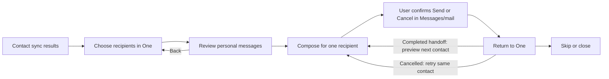

# Personal contact invitations

One's contact results can open an in-app selection and review sheet on web,
iOS and Android. Each contact starts unselected. Each compose action addresses
one recipient, and the person confirms sending in their Messages or mail app.
There is no Select All, background sending, contact upload or delivery receipt.

## Visual Map

## Build and rollback

`NEXT_PUBLIC_CONTACT_INVITATIONS_ENABLED` defaults to true, including when
the variable is absent. New web/native builds enable selection, additional web
email collection and session-local recipient retention. An explicit `false` preserves the original
Google/picker fields and generic invite sharing. It is a build-time flag:
rollback requires rebuilding the affected web/native bundle, not a database
migration. Older native binaries can still share/copy without the new composer.

## Contact and session contract

- The existing exact-match sync API, counters, connection outcomes, batching,
  and 10,000-lookup ceiling are unchanged. Matched/suppressed, self, unknown,
  partially checked and overflow contacts are not invitation candidates.
- A separate optional `onInviteCandidates` callback provides names and
  destinations in device memory; never spread these into sync results,
  observability, API bodies, persistence or PKM. Known account phone/email
  destinations are excluded; unknown alternate identities cannot be inferred.
- No match does not prove non-membership. Email-only web contacts appear under
  “Not checked—email only”, outside the existing unmatched counter. Original
  phone-entry provenance prevents malformed phone records bypassing exclusion.
- Google People reads remain browser-only using the existing read-only scope.
  Email collection is flag-gated. Browser email capability is probed before
  the picker tap; the picker itself is never delayed by a capability await.
- Session generations invalidate reads, referral preparation and old toast
  actions on dismissal, resync, account change, route change, flag disable or
  session-provider unmount. Selection and destinations survive search,
  pagination and review/back within that session. The account/route-scoped
  provider also retains the current step and pending handoff while authentication
  revalidation temporarily unmounts the page. Admission and vault gates continue
  to hide the page until access is verified; invitation state grants no access.
  No contact details enter browser storage or requests.
  Contact names, numbers and row whitespace toggle the associated checkbox;
  contacts with multiple destinations still require an explicit destination.
  The regular matching result still survives Location onboarding Finish.

## Explicit resync after disconnect

A fresh contact sync reconnects an eligible person the requester previously
removed. Repeated syncs keep one canonical connection per pair and refresh the
current list; an already-connected match still participates in that refresh.
Peer-made disconnects, unknown historical actors, hidden/opted-out profiles,
and disconnects made after the server began the sync remain protected. A sync
does not restore revoked location/information grants or named Circle membership.

Migration `205_contact_sync_disconnect_actor.sql` adds nullable actor-side and
revocation-episode fields on the existing `connections` authority table.
Migration `206_contact_sync_disconnect_actor_upgrade.sql` is the append-only
compatibility bridge for environments that applied the earlier user-ID form of
205: it translates only a participant-matching actor on the exact current
revocation episode, leaving unknown or stale history suppressed. Apply the
release lane through 206 before deploying the updated backend. The timestamp
pair also fails closed during a mixed-version rollout when an older writer
removes a connection.
The fields share the connection's retention and account-deletion lifecycle;
the actor side refers to the existing immutable A/B account columns, never
address-book information or a mutable account-ID copy. Migration 201 deletion
guards remain installed on those canonical participant identities.
Postgres remains authoritative; any future Redis invalidation layer must retain
the same transaction/episode checks.

For earlier removals, run `consent-protocol/scripts/backfill_contact_disconnect_actors.py`
in dry-run mode first, then `--apply --expected-database NAME` against the
intended environment. It scans bounded batches and only accepts two agreeing
historical events for the exact current revocation. Missing or conflicting
history stays suppressed. Feed is not used as live reconnection authority.
Roll back backend readers before the matching migration rollback; rollback
preserves graph rows but removes actor annotations. The invitation rollout flag
does not control this separate reconnection policy.

Connect retains rows and shows a refresh retry if the list read fails. Location
waits for a pre-sync read to settle, invalidates, then reads fresh state using the
current search. Neither recovery rereads contacts or repeats a committed sync.

## Delivery contract

`HushhInvitations.getCapabilities()` returns `{ sms: boolean }`.
`composeSms({ recipient: string, body: string })` accepts one E.164 number and
at most 2,000 UTF-16 code units. No new contact or background SMS permission is
requested. iOS uses MessageUI; Android uses ACTION_SENDTO with `smsto:`.

Outcomes are `queued_or_sent`, `opened`, `cancelled`, `failed`, or `unavailable`.
They must never become “delivered”. Web `mailto:` launches use one validated
mailbox and encoded subject/body; launch is only `launch_requested`. The web
SMS action prefills the number; a separate copy control supplies the text.
Share/copy never assumes which recipient the user chose in another app.

Existing referral copy, attribution and generic-link fallback are reused.
Each message adds a greeting using the selected contact's display name, with
an exact preview with selectable text for each
recipient. Missing names use the original invitation text. Names and personalized
messages remain in session memory until the user hands them to another app.
Link preparation has a bounded wait and a retry that preserves selection.
Copy reports an "Invitation copied" toast and keeps the current recipient.
Successful iOS Messages handoff or completed iOS/web sharing advances to the
next contact preview, without opening another composer. Cancel or failure
keeps the current contact for retry or Skip. Android SMS/share and web URL
launches cannot establish whether the person sent or cancelled; these show
"Done with this contact" for explicit advancement. Copy also exposes this
action for invitations pasted manually. No advancement confirms delivery.
If composer, share or clipboard access is unavailable, share/copy alternatives
and selectable preview text remain accessible. Skip and the close button
always provide an exit. External focus changes do not dismiss the sheet.
Receiving an invitation does not grant a connection or location capability.

## Verification and release checklist

Run `npm run verify:contact-invitations`, `npm run verify:connect-search`,
`npm run verify:one-location`, `npm run verify:share-ladder`, typecheck,
service-boundary and native plugin/static checks. Run `npm run cap:build` and
native compilation on supported build hosts.

Before enabling production, use designated test recipients on physical iPhone
and Android devices: prefill one number, Send/Cancel/Retry, app return,
unavailable handler and older-binary fallback. Exercise Google import and
email-only recipients on desktop, plus browser share/copy and missing mail/SMS
handlers. Do not send live invitations from automated tests.

Invitation-return regression checks:

- Select/deselect via name, number, whitespace and checkbox; preserve explicit
  multi-destination choice, deduplication, search and pagination.
- Select two contacts; return from iOS Messages Send and completed sharing:
  show the next personalized preview and open no composer automatically.
- Return using Cancel, X or discard: retain the current recipient and selection.
- Temporarily unmount the page during a pending handoff and settle its promise:
  restore the correct step after validation; never show contacts behind a gate.
- Copy through the clipboard focus fallback: keep the sheet and show feedback.
- Android/web ambiguous handoffs use explicit completion; repeated taps cannot
  start duplicate composers. Retry, Skip and queue completion remain usable.
- Logout, account/route changes, explicit close, resync and flag disable clear
  recipients and ignore late callbacks, including their toasts.

Impact: existing Connect and Location routes and public request/response shapes
are preserved. Migration 205 adds disconnect-actor metadata for the explicit
resync policy above; it must precede deployment of the updated backend. No cache
keys or PKM contracts change. Invitation interfaces are client-local recipient
callbacks and the native composer plugin. Apple requires individualized
contact invitations: [App Review 5.1.2(v)](https://developer.apple.com/app-store/review/guidelines/#data-use-and-sharing).

## Invitation-return follow-up verification (2026-09-10)

- 50 invitation tests, 344 Connect tests (large-list timeout under concurrent
  suite load passed its isolated 17-test rerun), 893 Location tests, 273 account
  session tests and 62 share-ladder tests passed. These suite counts overlap.
- TypeScript, focused ESLint, production web build, service boundary, docs,
  design-system, route orchestration and native plugin/static checks passed.
- Synthetic Chromium rehearsal at 390px and 1440px passed full-row selection,
  Google import and matching, real clipboard with toast, preview/back, share
  cancellation/retry, automatic next preview, email launch and queue cleanup.
  No raw recipients appeared in captured API requests, logs or browser storage.
- Native export remains blocked on this Windows host by `spawnSync npx ENOENT`.
  Physical iOS/Android Send, discard, Cancel and app-return checks on a rebuilt
  native bundle are still required. Automated gate-remount tests cover pending
  handoffs resolving while the page is absent; they do not replace device tests.

## Implementation verification (2026-09-09)

- Flag-on web production build compiled the actual Connect and Location routes,
  passed TypeScript, and generated all 161 static pages.
- Invitation, Connect, Location and share regression suites cover existing
  matching plus selection, per-recipient payloads, cancellation, retry, cleanup
  and feature-off behavior. Native plugin/static and service-boundary checks
  validate registration and the client/server split.
- Chromium at 390px and 1440px exercised synthetic Google People responses
  through the real importer, hashed sync service, results sheet, selection,
  personalized preview, real clipboard, share cancellation/retry and email
  launch request. The test also checked user activation and absence of raw
  recipients in API requests, logs and browser storage. External responses
  were mocked; this is not proof of live Google OAuth or physical SMS delivery.
- Live authenticated route rehearsal is blocked on this Windows host by the
  reviewer preflight's `spawnSync gcloud ENOENT` (the installed launcher is a
  PowerShell script). No reviewer credentials or shared fixtures were changed.
- Native export tooling also hits Windows `npx` launching/path-filtering issues.
  Android compilation is blocked by the existing Google Services configuration
  lacking a client for `com.hussh.app`. iOS compilation and native unit tests
  passed on the GitHub Mac runner for the invitation implementation.
  Physical device Send/Cancel/return tests remain required before rollout.

Browser sharing invokes `navigator.share` directly on the final tap to retain
[the Web Share user-activation requirement](https://developer.mozilla.org/en-US/docs/Web/API/Navigator/share#security).
Web SMS uses the documented number-only
[Apple SMS URL contract](https://developer.apple.com/library/archive/featuredarticles/iPhoneURLScheme_Reference/SMSLinks/SMSLinks.html),
with a separate message-copy action.
