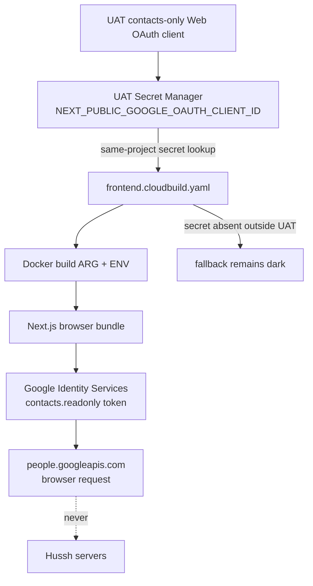

# Enable Google Contacts for web contact sync

Google Contacts is a browser-only fallback for surfaces that cannot read a
device address book, especially desktop browsers and iPhone Safari. The access
token and People API response stay in browser memory. Hussh receives only the
existing contact-match payload: a normalized phone hash plus its last-four
matching bucket, never Google tokens, names, or full phone numbers.

The implementation is production-grade and environment-isolated from the
start. Activation is intentionally staged: complete and accept UAT before
changing production or dev.

## Visual Context

Canonical visual owner: [IAM and consent scopes](../reference/iam/README.md).
The configuration path below applies that trust boundary to the browser-only
Google Contacts fallback without giving Hussh servers a Google token or raw
contact response.

## Current UAT boundary

As verified on 2026-08-24:

- UAT project: `hushh-pda-uat`
- UAT web origin: `https://uat.one.hushh.ai`
- Google Auth Platform audience: External, In production
- People API: enabled
- dedicated Web client: `Hussh Contacts Web - UAT`, with the UAT origin only
  and no redirect URI
- Data Access: exact `contacts.readonly` scope added; review in progress
- Branding: verified; the existing consent-screen app name still does not
  match the homepage name, while the remaining verification checks are under
  review
- `NEXT_PUBLIC_GOOGLE_OAUTH_CLIENT_ID`: Secret Manager version `1` enabled
- the UAT Cloud Build service account already has Secret Manager accessor
  authority; no IAM change was required
- production and dev: out of scope until UAT acceptance

Do not reuse the Gmail or Calendar OAuth client. Create a contacts-only Web
client in each environment's own project. Environment isolation keeps a bad
origin or future grant change in UAT from widening production authority.

## Configuration path



The conditional, same-project build read is load-bearing. UAT requires the
configuration; production/dev remain deployable and dark while their secret is
absent, then use their own client automatically once explicitly provisioned. A
top-level Cloud Build
`availableSecrets` entry is resolved before a step starts and cannot be made
environment-optional. Adding it while production/dev do not have the secret
would break their frontend builds.

## 1. Inspect UAT OAuth scope and client state

Open Google Cloud Console in `hushh-pda-uat`:

```text
Google Auth Platform -> Clients
Google Auth Platform -> Data Access
Google Auth Platform -> Verification Center
```

If a dedicated contacts client already exists, inspect its type and exact
Authorized JavaScript origins. Do not edit an unrelated client to make it fit.

On Data Access, look for the exact scope:

```text
https://www.googleapis.com/auth/contacts.readonly
```

It is a sensitive scope. An External app in production must have sensitive
scope verification before requesting it without an unverified-app warning. If
the UAT project is not verified for this scope, choose one explicit UAT path
before continuing:

- complete Google's sensitive-scope verification; or
- move only this UAT OAuth app back to Testing and allowlist the acceptance
  accounts, after confirming no other UAT client depends on public access.

Testing mode limits who can consent and its non-basic grants expire, so it is a
temporary UAT posture, not the production plan. Do not change publishing status
blindly: Audience applies to every OAuth client in the project.

If it does not exist, create it with this contract:

- Application type: Web application
- Name: `Hussh Contacts Web - UAT`
- Authorized JavaScript origins: `https://uat.one.hushh.ai`
- Authorized redirect URIs: none

Use the public client id ending in `.apps.googleusercontent.com`. The GIS token
flow does not use a client secret or redirect handler. Never put a client secret
in the frontend, repository, issue, chat, build arguments, or Secret Manager
under this key.

If the scope is absent, add it through Data Access -> Add or Remove Scopes only
after the verification/testing decision above. The final consent screen must
show only the contacts read scope for this client.

## 2. Create the UAT build configuration

Store only the public client id in UAT Secret Manager, with no trailing newline:

```bash
PROJECT_ID=hushh-pda-uat
SECRET_ID=NEXT_PUBLIC_GOOGLE_OAUTH_CLIENT_ID
: "${UAT_GOOGLE_CONTACTS_CLIENT_ID:?set the UAT public OAuth client id first}"
case "$UAT_GOOGLE_CONTACTS_CLIENT_ID" in
  *.apps.googleusercontent.com) ;;
  *) echo "The UAT Google Contacts OAuth client id is malformed." >&2; exit 1 ;;
esac

gcloud secrets describe "$SECRET_ID" --project="$PROJECT_ID" >/dev/null 2>&1 || \
  gcloud secrets create "$SECRET_ID" \
    --project="$PROJECT_ID" \
    --replication-policy=automatic

printf '%s' "$UAT_GOOGLE_CONTACTS_CLIENT_ID" | \
  gcloud secrets versions add "$SECRET_ID" \
    --project="$PROJECT_ID" \
    --data-file=-
```

Keep `UAT_GOOGLE_CONTACTS_CLIENT_ID` in process memory and unset it after the
version is added. Verify metadata and an enabled version without printing the
payload:

```bash
gcloud secrets versions list "$SECRET_ID" \
  --project="$PROJECT_ID" \
  --filter='state=ENABLED' \
  --format='value(name)'

unset UAT_GOOGLE_CONTACTS_CLIENT_ID
```

The UAT Cloud Build identity already has same-project Secret Manager access. No
new broad IAM grant is part of this rollout.

## 3. Build and deploy through the governed UAT lane

The repository contract is:

- `deploy/frontend.cloudbuild.yaml` reads a client id only from the current
  deployment project. UAT fails before image creation when its value is absent
  or malformed. Production/dev pass an empty value while unconfigured and use
  their own value automatically after explicit provisioning.
- `hushh-webapp/Dockerfile` exposes the build argument to Next.js at build time.
- `googleContactsAvailability()` remains `unconfigured` when the bundled value
  is empty and always remains `unconfigured` inside native Capacitor shells.

Land changes through the protected PR/main gates. Deploy only the exact landed
`main` SHA with a successful `Main Post-Merge Smoke`, using `scope=auto` in the
governed UAT workflow. Do not use direct Cloud Run deployment or manual traffic
changes.

## 4. Perform acceptance last

Run browser acceptance only after the client, secret, code, green `main` SHA,
and UAT deployment are all in place.

Desktop acceptance on `https://uat.one.hushh.ai`:

1. Connect and Location People offer `Find contacts`. First-run Location
   onboarding offers `Find contacts` followed by `Check my contacts` when a
   contact source is available.
2. The popup opens from the explicit tap. One shows progress while waiting.
   Closing the popup shows a neutral cancellation screen with an account-picker
   retry. A blocked popup, expired access, failed read or missing callback shows
   an actionable error; the OAuth callback has a two-minute timeout.
3. The consent sheet requests only
   `https://www.googleapis.com/auth/contacts.readonly`.
4. A successful read calls `people.googleapis.com` directly from the browser.
5. Hussh requests contain no Google token, name, or full phone number.
6. Matching and invite counts render correctly. Empty saved contacts, contacts
   without usable phone numbers, and checked contacts with no One match have
   separate explanations. The results link to Google Contacts and offer an
   explicit account-choice retry. This source reads saved contacts, not the
   device-only address book or Google's Other contacts.
7. In Connect and Location People, complete Google consent while an active-session
   check temporarily remounts the route. Progress and results must return after
   the gate admits the same account. Repeat from Location onboarding; its contact
   summary must also recover after closing the results sheet.
8. Double-tap the sync action, cancel and retry, change the signed-in One account,
   navigate to a different route, and finish the flow during a read. A single
   account/route owns the memory-only operation. Ended operations abort and ignore
   late Google callbacks. Results and invitation recipients never persist to
   browser storage. Existing auth/vault checks still hide protected content.
9. Verify email-only invitations, exact/canonical phone matching, partial/unknown
   results, connection refresh, and remove-then-resync reconnection using the
   existing matching and invitation suites. Opening a composer is not delivery
   confirmation.
10. From Google results, open `Invite contacts`. Unmatched phone contacts appear
    under `No match found`; contacts with only email appear separately under
    `Not checked—email only`, including when the unmatched phone count is zero.
    No recipients start selected. Select individual rows, review the personalized
    message and referral link, return to selection, and confirm selections remain.
11. For web invitations, `Open email` prepares one recipient and message in the
    mail handler. For a phone recipient, copy the invitation, then use
    `Open Messages` to fill the number and paste the message. `Invitation copied`
    confirms copying. Returning from either handler retains the current contact;
    `Done with this contact` advances because the browser cannot confirm Send or
    Cancel. An unavailable handler still leaves copy/share and Skip available.
12. Cancel Web Share and verify the same recipient remains. Complete a supported
    Web Share handoff and verify the queue advances without claiming delivery.
    If Web Share is unavailable, its copy fallback retains the current contact.
    Repeat a session-check remount during review and during a share handoff: the
    same-account queue must return. Finish clears it; logout or route/account
    changes must also clear it and ignore late handoff completions.

Repeat the same flow on a real iPhone in Safari. Native iOS/Android apps are a
separate path and must continue using the first-party contacts plugin without a
Google popup.

## Production after UAT acceptance

Production is a separate authority transition:

1. Review UAT evidence and unresolved OAuth verification warnings.
2. Enable People API in `hushh-pda` if still disabled.
3. Create a new production contacts-only Web client with only
   `https://one.hushh.ai` as an Authorized JavaScript origin.
4. Add the production project secret version.
5. Deploy through the existing production build gate; no UAT client id or code
   fork is reused.
6. Verify production separately.

Dev follows the same pattern later with its own client. Localhost belongs only
on that non-production client when local browser testing is deliberately
enabled. Never copy the UAT client across environments merely because client ids
are public.

## Never build these shortcuts

- no server-side People API route
- no refresh token for contact matching
- no Google token, contact list, names, or full phone numbers in Hussh logs or
  persistence
- no Gmail/Calendar OAuth client reuse
- no client secret in browser configuration
- no redirect URI for this GIS token flow
- no native custom-scheme origin
