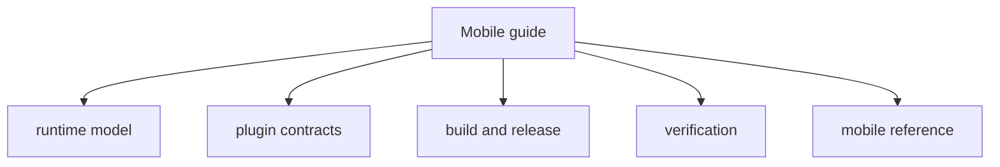

# Mobile Guide

> Native mobile operating entrypoint for iOS and Android.

## Visual Map



## Current Truth

The Hussh mobile app uses a shared React/Next.js UI inside a Capacitor native shell. The native layer owns security-critical platform capabilities through Capacitor plugins; web-only Next.js API routes are proxy routes, not the mobile authority path.

Founder-language mapping:

- `Separation of Duties`: shared React runtime, native plugin boundary, and backend policy enforcement stay separate.
- `Cryptographic Primitives`: vault control remains client-held; backend persistence remains ciphertext-only.
- `Capability Tokens`: `VAULT_OWNER`, Firebase tokens, and consent tokens stay explicit where the runtime contract requires them.

## Start Here

- [mobile/runtime.md](./mobile/runtime.md): native runtime model, route parity, passkey association, Firebase artifact handling, and browser API rules.
- [mobile/plugins.md](./mobile/plugins.md): plugin inventory, method contract, registration rules, and platform-aware service pattern.
- [mobile/build-release.md](./mobile/build-release.md): fresh native builds, static export constraints, App Store release checklist, and signing prerequisites.
- [mobile/verification.md](./mobile/verification.md): parity gates, simulator/device smoke checks, and release verification.

## Canonical References

- [../reference/mobile/capacitor-parity-audit.md](../reference/mobile/capacitor-parity-audit.md): current mobile parity audit.
- [../reference/mobile/capacitor-parity-audit-report.md](../reference/mobile/capacitor-parity-audit-report.md): tracked route evidence and audit output.
- [../reference/kai/mobile-kai-parity-map.md](../reference/kai/mobile-kai-parity-map.md): Kai mobile parity map.
- [../reference/architecture/route-contracts.md](../reference/architecture/route-contracts.md): route governance.
- [native_streaming.md](./native_streaming.md): native SSE streaming patterns.

## Non-Goals

This entrypoint should not duplicate:

- full native plugin source inventories
- current route tables owned by generated manifests or reference docs
- one-off App Store metadata tasks after release
- package-local implementation notes that belong in `hushh-webapp/docs/`

## Minimum Gate

Before calling mobile parity complete:

```bash
cd hushh-webapp && npm run verify:capacitor:cold:audit
./bin/hushh docs verify
```
