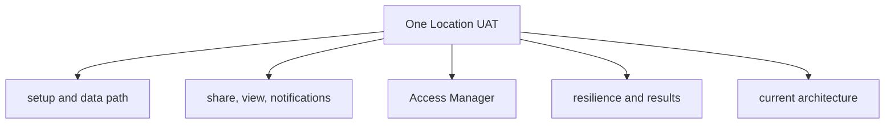

# One Location UAT Test Plan

> Stable entrypoint for UAT verification of One Location sharing.

## Visual Map

## Current Scope

Use this plan before customer release of One Location sharing. It validates the mobile-first hub, full-screen task flows, encrypted location sharing, consent notification routing, Access Manager integration, and graceful degradation.

The current `/one/location` hub has four tabs:

| Tab | Owns |
| --- | --- |
| Now | privacy status, share/ask actions, active shares, device readiness |
| People | trusted circle, invites, ready people, pending invites |
| Links | temporary links and invite links |
| Inbox | incoming requests, shared-with-me views, receipts |

Full-screen task flows:

- Share
- Ask
- Invite trusted person
- Temporary link

## Test Modules

- [one-location-uat/setup-and-data-path.md](./one-location-uat/setup-and-data-path.md): test accounts, environment checks, reset helper, encryption/data path.
- [one-location-uat/share-view-notifications.md](./one-location-uat/share-view-notifications.md): permissions, sharing, viewing, duplicate-notification prevention, dismiss/unwatch, request flow.
- [one-location-uat/access-manager.md](./one-location-uat/access-manager.md): `/one/consent` tabs, actions, counts, coordinate-free consent rows.
- [one-location-uat/resilience-and-results.md](./one-location-uat/resilience-and-results.md): public links, resilience cases, release gate, and result capture.

## Release Gate

The feature is ready for customers only when all critical criteria pass:

1. Share flow works and the recipient sees a live map inline in Inbox.
2. No duplicate notifications on refresh, tab change, or re-login.
3. Re-share to the same person does not create a false removal notification.
4. Genuine revoke and expiry notify once and do not resurrect on refresh.
5. Viewing a share does not require opening a notification.
6. Inline live view survives page refresh.
7. Dismiss hides the share locally, persists across refresh, and silences its notifications.
8. Location consent events appear on the shield/consent surface, not the bell.
9. Access Manager tabs populate location rows with correct status and actions.
10. No coordinates leak into any consent surface or payload.
11. Ask, approve, and decline flows work with one-time notifications.
12. Access Manager actions move rows across tabs with correct counts.
13. One Location and Access Manager degrade gracefully rather than hard-failing.

## Automated Coverage

Automated checks already protect the highest-risk logic:

- `hushh-webapp/__tests__/one-location-notifications.test.ts`
- `consent-protocol/tests/test_one_location_list_state_resilience.py`
- `consent-protocol/tests/test_one_location_center_contributor.py`

Manual UAT is still required for real login, phone OTP, GPS, simultaneous sessions, push-notification delivery, and human inspection of Access Manager tabs.

## Current Architecture

- [One Location Agent](../reference/architecture/one-location-agent.md)
- [API Contracts](../reference/architecture/api-contracts.md)
- [Consent Scope Catalog](../reference/iam/consent-scope-catalog.md)
