# Deploying hushh-research (UAT & Production)

> **TL;DR for agents (Claude Code on the web, Codex, Hermes):** Deploys run on
> **GCP Cloud Build**, NOT GitHub Actions, and consume **zero GitHub Actions
> minutes**. UAT and production are **on-demand only** — they deploy when a
> human/agent deliberately cuts a deploy **git tag**, never automatically on
> push to `main`.

## Visual Context

```mermaid
flowchart LR
  Dev["Operator / Claude Code (web)"] -->|git tag uat-SHA + push| GH["GitHub: hushh-research"]
  GH -->|tag matches uat-*| CBT["Cloud Build tag trigger (hushh-pda-uat)"]
  CBT -->|runs as deployer SA| ORCH["deploy/cloud-build-deploy.sh"]
  ORCH --> S1["1. Gate SHA on main"]
  S1 --> S2["2. Sync runtime secrets"]
  S2 --> S3["3. DB migrate + schema gate"]
  S3 --> S4["4. Build + deploy backend (no-traffic)"]
  S4 --> S5["5. Build + deploy frontend (no-traffic)"]
  S5 --> S6["6. Promote traffic 100%"]
  S6 --> S7["7. Verify health"]
  S7 --> CR["Cloud Run: consent-protocol + hushh-webapp"]
```



No GitHub-hosted runner is in this path; the build runs entirely inside GCP
Cloud Build, so GitHub Actions spending limits never block a deploy.

Canonical visual owner: see [CI & deploy operations](../reference/operations/ci.md)
and [branch governance](../reference/operations/branch-governance.md) for the
authoritative pipeline and branch-flow diagrams.

## Preferred path: deploy by git tag (no credentials needed)

This is how Claude Code on the web deploys. It needs **only its existing git
push access** — no GCP key, no service-account JSON, no bearer token.

```bash
# Deploy a specific green main SHA to UAT:
git tag uat-<full-sha> && git push origin uat-<full-sha>

# Deploy to PRODUCTION (cutting the prod- tag IS the confirmation):
git tag prod-<full-sha> && git push origin prod-<full-sha>
```

A Cloud Build **tag trigger** (`uat-*` on `hushh-pda-uat`, `prod-*` on
`hushh-pda`) sees the tag, checks out that SHA, and runs the full deploy
orchestration **inside GCP** as the deployer SA. No GitHub-hosted runner is
involved, so Actions spending limits never block a deploy.

Why this is safe and clean:
- **No secret in the sandbox** — the only capability used is git push, which
  Claude Code already has.
- **Immutable audit trail** — every deploy is a tag (`uat-<sha>` / `prod-<sha>`).
- **On-demand only** — verified: no workflow listens on `on: push: tags:`, so a
  tag push costs 0 Actions minutes and only the Cloud Build trigger reacts.
- Watch progress: GCP Console → Cloud Build → History (project `hushh-pda-uat`
  / `hushh-pda`).

## Alternative: the one command (operator with gcloud)

For a human authenticated with gcloud (holds `serviceAccountTokenCreator` on the
deployer SA), the same orchestration can be run directly:

```bash
# UAT — latest green main:
deploy/cloud-build-deploy.sh --env uat

# UAT — a specific green main SHA:
deploy/cloud-build-deploy.sh --env uat --sha <git-sha>

# Production — requires explicit confirmation:
deploy/cloud-build-deploy.sh --env prod --sha <git-sha> --confirm-production "deploy production"
```

Optional flags: `--scope all|backend|frontend` (default `all`),
`--skip-migrations`.

## How it works (and why GitHub Actions is not the bottleneck)

The image build already ran inside **GCP Cloud Build** even in the GitHub
Actions workflows (`gcloud builds submit --config=deploy/backend.cloudbuild.yaml`).
GitHub Actions was only the *orchestrator* that authenticated and called
`gcloud`. So when GitHub Actions hits a spending limit, the *real compute*
(Cloud Build + Cloud Run) is unaffected — we just need another way to invoke it.

`deploy/cloud-build-deploy.sh` is that way. It performs the exact same sequence
as `.github/workflows/deploy-uat.yml`:

1. Resolve + gate the SHA (must be on `main`, CI-green).
2. Sync runtime secrets (`scripts/ops/sync_backend_runtime_secrets.py` and `scripts/ops/sync_frontend_runtime_secrets.py`).
3. Run DB migrations + predeploy schema gate via Cloud SQL Auth Proxy.
4. Build + deploy backend (`deploy/backend.cloudbuild.yaml`, no-traffic).
5. Build + deploy frontend (`deploy/frontend.cloudbuild.yaml`, no-traffic).
6. Promote the new revisions to 100% traffic.
7. Verify backend `/health` and the frontend origin.

## Authentication: keyless, reuses the existing workflow SA

The script **impersonates** the same service account the GitHub workflow uses
(`github-actions-uat-deployer@hushh-pda-uat` for UAT). The caller must hold
`roles/iam.serviceAccountTokenCreator` on that SA. No service-account key is
created or stored — this is *more* keyless than the GitHub flow (which still
relied on the `GCP_SA_KEY_UAT` secret).

> The org enforces `constraints/cloudbuild.useBuildServiceAccount`, so a plain
> user `gcloud builds submit` (even as project Owner) returns `PERMISSION_DENIED`.
> Impersonating the deployer SA is the canonical, supported path.

### If you are running this from a sandbox without gcloud auth

You cannot deploy from an environment that has no GCP credentials and no token-
creator grant. That is by design (keyless posture). Either run from a shell
authenticated as a principal with token-creator on the deployer SA, or ask the
operator to run the one command above.

## Optional: a manual Cloud Build trigger (no GitHub runner at all)

To fully decouple from GitHub-hosted runners while keeping on-demand control,
create a **manual** (not push) Cloud Build trigger:

```bash
gcloud builds triggers create manual \
  --name=uat-ondemand-deploy \
  --project=hushh-pda-uat \
  --repo=https://github.com/hushh-labs/hushh-research \
  --repo-type=GITHUB \
  --branch=main \
  --build-config=deploy/uat-trigger.cloudbuild.yaml
```

Do **NOT** create an `--branch-pattern` / push trigger for UAT or prod — that
would auto-deploy on every commit, which is explicitly not wanted.

## Projects, services, instances

| | UAT | Production |
|---|---|---|
| Project | `hushh-pda-uat` | `hushh-pda` |
| Backend service | `consent-protocol` | `consent-protocol` |
| Frontend service | `hushh-webapp` | `hushh-webapp` |
| Region | `us-central1` | `us-central1` |
| Cloud SQL | `hushh-pda-uat:us-central1:hushh-uat-pg` | (prod instance) |
| Frontend origin | `https://uat.kai.hushh.ai` | `https://kai.hushh.ai` |
| Deployer SA | `github-actions-uat-deployer@hushh-pda-uat` | prod deployer SA |
| Image tag | `uat-<sha>` | `prod-<sha>` |
