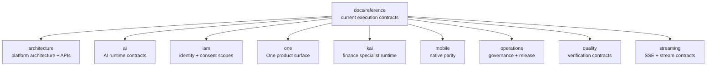

# Reference Hub

> Execution-owned current truth for cross-cutting Hussh contracts.

## Visual Map

Use this hub when a reader needs the current implementation contract rather than a roadmap, design snapshot, or package-local note.

## Classification Boundary

Maintained docs use these labels:

| Classification | Meaning | Home |
| --- | --- | --- |
| `canonical` | Current implementation truth or durable policy | `docs/reference/`, root policy docs, package-local reference docs |
| `pointer/index` | Navigation page that points to canonical owners | `README.md` files and thin root entrypoints |
| `future-plan` | Roadmap or R&D plan that is not shipped truth | `docs/future/` |
| `planning-archive` | Short-lived agentic plan/spec traceability | `docs/superpowers/` |
| `historical-provenance` | Useful history retained only for traceability | Rare, explicitly linked from canonical owner |
| `merge-then-delete` | Stale doc with durable facts that must move first | Temporary cleanup state only |
| `delete` | Redundant or stale doc with no durable owner value | Removed after link sweep |

Default cleanup policy: merge durable facts into a canonical owner, update inbound links, then delete stale maintained docs.

## Current Reference Domains

| Domain | Owner |
| --- | --- |
| Architecture and API contracts | [architecture/README.md](./architecture/README.md) |
| AI runtime and future on-device boundaries | [ai/README.md](./ai/README.md) |
| IAM, consent scopes, and trust boundaries | [iam/README.md](./iam/README.md) |
| One product-surface contracts | [one/README.md](./one/README.md) |
| Kai finance-specialist runtime | [kai/README.md](./kai/README.md) |
| Mobile/native parity | [mobile/README.md](./mobile/README.md) |
| Operations and documentation governance | [operations/README.md](./operations/README.md) |
| Quality and verification contracts | [quality/README.md](./quality/README.md) |
| Streaming contracts | [streaming/README.md](./streaming/README.md) |

## Non-Reference Homes

- Future roadmap and R&D plans live in [../future/README.md](../future/README.md).
- Agentic plan/spec snapshots live only in [../superpowers/README.md](../superpowers/README.md) while active or intentionally retained.
- Backend implementation details live in [../../consent-protocol/docs/README.md](../../consent-protocol/docs/README.md).
- Frontend/native package-local details live in [../../hushh-webapp/docs/README.md](../../hushh-webapp/docs/README.md).

## Recursive Rewrite Contract

Use [operations/documentation-recursive-knowledge-model.md](./operations/documentation-recursive-knowledge-model.md) before broad restructures. It defines the folder-level questions, split rules, north-star filter, and verification sequence for recursively recrafting docs without turning future direction into current implementation claims.
