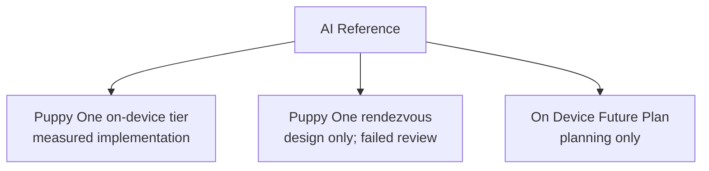

# AI Reference

## Visual Map

Cross-cutting AI strategy references live here.

## Status

This folder contains both measured implementation references and explicitly
unshipped designs. Read each page's status before treating it as runtime truth.
The rendezvous design failed its second review and is not an implementation
guide. The `on-device-future-plan/` subtree remains planning guidance.

When implementation is completed and validated, each plan doc must be replaced or promoted to production-grade reference docs with:

1. Final architecture and contract details from shipped code.
2. Measured benchmark data (not estimates).
3. Operational runbooks and ownership.

## Sections

1. [Puppy One on-device tier](./puppy-one-on-device.md) — measured implementation, with stated limits.
2. [Puppy One outbound rendezvous](./puppy-one-rendezvous.md) — design only; do not build from it yet.
3. [On-Device AI Future Plan](./on-device-future-plan/README.md) — planning only.
