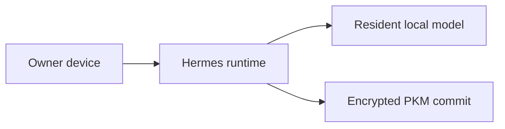

# Puppy One: the on-device tier

**Status:** implemented and measured on real hardware, 2026-08-28; status and
toggle wiring audited and repaired 2026-09-02 (see the last section).

## Visual Map

Puppy One is the edge tier of Hussh One: a personal AI that answers on hardware
the owner already has, instead of renting inference from a vendor.

## Names

Two names, one thing, and they are not interchangeable in code.

| Name | What it refers to | Where it may appear |
| --- | --- | --- |
| **Puppy One** | The product the owner sees | UI copy, docs, marketing |
| **Hermes** | The runtime that implements it | Code, config, schema, env vars |

Identifiers stay `hermes_*`. `HERMES_API_SERVER_KEY`, the `trusted_devices`
table, and every route under `/api/hermes/` keep their spelling. Renaming an
identifier to match the brand silently breaks a config file that already exists
on the owner's machine, and buys nothing.

## The claim, and what enforces it

The claim is that a PKM save runs on the owner's machine and reaches no model
vendor. Three things hold it up:

1. **The provider is pinned.** `model.provider: lmstudio` with an explicit load
   mode, so Hermes verifies the model is resident rather than delegating to
   LM Studio's just-in-time loading.
2. **The fallback chain is gated.** `hussh_one.on_device_only` makes any
   non-local provider resolution refuse rather than reach for the network. This
   is the part that was missing: pinning the main turn never covered auxiliary
   tasks, which defaulted to `provider: "auto"` and fell through OpenRouter,
   Nous and Codex to a paid Gemini default. Compression fires exactly when a
   session accumulates reasoning, which is why a PKM save appeared to think on
   Gemini while the config said otherwise.
3. **The bridge is loopback-only.** Enforced by parsed hostname, in both the
   Next route handler and the benchmark. Substring matching would accept
   `http://127.0.0.1.evil.example`.

### What is NOT on-device yet

**The agent hierarchy.** `consent-protocol/hushh_mcp/agents/` holds **21 agent
packages** — calendar, connected_systems, connections, email, financial_guard,
gmail, kai, kyc, location, memory_intent, memory_merge, memory_segmentation,
nav, onboarding, one, orchestrator, personal_information, pkm_structure,
portfolio_import, realtime_bench, summary_reducer — all extending
`HushhAgent(LlmAgent)` in `base_agent.py`, with a dedicated `orchestrator/`.

Do not describe this as a "five-agent chain". Five of those twenty-one
(`financial_guard → memory_intent → memory_merge → pkm_structure`, plus
`memory_segmentation`) are the sub-chain that
`pkm_agent_lab_service.py:_run_agent_contract` invokes for PKM structuring
specifically. Calling the sub-chain the system makes a large port look small.

They call Gemini directly with Gemini-only `ThinkingConfig` and
`response_schema`. `model_override` swaps the model id, never the provider, so
moving the hierarchy on-device needs a provider abstraction behind
`_run_agent_contract` and an OpenAI-compatible structured-output path.

The goal is that this hierarchy runs **natively inside Hermes**, reusing the
same image structure as the pods that run on the user's own cloud, so the same
agents behave the same way in every environment.

Say this plainly in any status. The stack is not end-to-end on-device.

## Measured, not asserted

`hermes_cli/hussh_one_pkm/benchmark.py` times the real unit on the real model.

Two halves, timed separately and never summed. They scale on different things,
and one blended number would hide which half a regression landed in:

- **T_model**: the local turn that reads an utterance and emits a well-formed
  `save_to_pkm` call. Scales with model size, quant, memory bandwidth.
- **T_commit**: `HusshPkmWriteService.save`. Crypto plus two HTTP round-trips
  plus a DB write. Nearly model-independent.

Latency alone would rank a model that answers in prose above one that does the
work, so validity is scored beside it against the real `save_to_pkm` schema. A
present-but-empty `scope_path` or `merge_patch` counts as missing: it is the
cheapest output available and must not win.

### Results

`Mac16,5 · Apple M4 Max · 128 GB`, 5 cases x 2 reps per model, warm p50:

| Model | Valid calls | Warm p50 | Warm p95 | tok/s | Errors |
| --- | --- | --- | --- | --- | --- |
| `gemma-4-e2b` | **0%** | 2579 ms | 3795 ms | 138.4 | 0 |
| `gemma-4-26b-a4b-qat` | **100%** | 2600 ms | 2965 ms | 94.3 | 0 |
| `gemma-4-12b-qat` | 100% | 4847 ms | 6560 ms | 49.8 | 0 |
| `qwen3.6-35b-a3b` | 100% | 8165 ms | 16855 ms | 79.7 | 2 |
| `gemma-4-31b-qat` | 100% | 9289 ms | 10348 ms | 22.4 | 0 |

Read the first two rows together. **The fastest model on the ladder produces
zero usable PKM saves.** `gemma-4-e2b` is the quickest to finish and the
highest throughput, and every one of its answers was either prose or a call
missing required fields. A latency-only benchmark would have crowned it.

`gemma-4-26b-a4b-qat` is the right default and is what this machine already
runs. It matches e2b's latency to within 1%, and everything it returns is
usable. It is also faster than the 12B and roughly 3.5x faster than the 31B,
because `a4b` means about 4B parameters active per token: 26B-class quality at
4B-class speed. Bigger is not slower by accident here, it is slower because
dense models activate everything.

`qwen3.6-35b-a3b` is correct when it answers, but it failed 2 of 10 turns and
its p95 is more than double its p50. Not a default.

## Memory and eviction

`hermes_cli/lmstudio_manager.py` handles residency, footprint, fit and
eviction. Hermes could load a model and had no unload path at all.

Eviction is deliberately conservative, because reloading weights on an edge
device is expensive:

- only `IDLE` models are candidates, never one serving a session;
- `protect` matches case-insensitively (it is a safety instruction, not a
  string-matching puzzle);
- among plans that fit, the one surrendering the **least** memory wins, so a
  5 GB gap cannot cost a 40 GB resident;
- `ensure_capacity` refuses to act on an impossible fit. `plan_eviction`
  reports the whole evictable set so a caller can see the ceiling, but
  executing that plan would unload every warm model **and still not fit**;
- an unreadable memory figure declines to evict rather than guessing.

## Presence: push, not poll

`hermes_cli/hussh_one_pkm/presence.py`. A fixed poll pays the same whether
anything happened or not, and is wrong both ways: too slow to show a model swap
the owner just made, and still billing every five minutes for a laptop asleep
in a bag.

So: push on transitions (unlock, model loaded or ejected, session start and
end), with a 600s keepalive underneath whose only job is to tell "nothing
changed" apart from "this machine is gone".

Two rules stop it becoming a poll again:

- identical snapshots are not sent; a repeat carries no signal;
- a push never blocks its trigger. Dispatched to a daemon thread, best-effort,
  silent on failure. The dashboard showing a staler reading is a much smaller
  harm than an unlock waiting on a network call.

`post_heartbeat` reads `read_state` and deliberately does **not** call
`auth_headers`, which refreshes the token and runs the revocation check, which
can seal the device. Telemetry must never be able to destroy local data as a
side effect of being sent.

### The coupled constants

`KEEPALIVE_INTERVAL_SECONDS` (600s, presence.py) and `HEARTBEAT_FRESH_MS`
(21 min, `lib/trusted-device/sync-display.ts`) must move together. The reader's
window has to exceed twice the keepalive so one missed beat does not show a
live machine as gone. Shortening one alone is what makes a healthy device read
as offline.

## Machine specs

Brand, processor, total RAM and RAM in use ride the heartbeat allow-list, so
the owner sees the machine their agent runs on.

Names only. Brand and processor **describe** a machine; a serial number,
hostname or MAC **identifies** one, and the dashboard has no use for that. The
two numbers are range-bounded because a device posts them, and out-of-range
values are dropped rather than clamped: clamping invents a reading that was
never taken.

## Tri-Flow declaration

Per the PR template, every layer is covered or explicitly marked N/A with a
reason. Silent omission is not permitted.

| Layer | Status | Reason |
| --- | --- | --- |
| **Web** | Implemented | `/one/puppy`, the AG-UI stream route, the model picker |
| **iOS** | **N/A** | Puppy One requires a loopback connection to the Mac running LM Studio. An iOS shell cannot reach `127.0.0.1` on a different device, and the bearer key is host remote-code-execution, so forwarding it off-machine is refused by design, not unimplemented. |
| **Android** | **N/A** | Same reason. |

Reaching Puppy One from a phone needs the outbound rendezvous described in the
One x Hermes live-bridge design, which is not built. When it is, these rows
become work items rather than N/A.

## Where things are

| Concern | File |
| --- | --- |
| On-device gate | `agent/auxiliary_client.py` (Hermes) |
| Model residency and eviction | `hermes_cli/lmstudio_manager.py` |
| Host hardware | `hermes_cli/host_metrics.py` |
| Benchmark | `hermes_cli/hussh_one_pkm/benchmark.py` |
| Presence push | `hermes_cli/hussh_one_pkm/presence.py` |
| PKM write path | `hermes_cli/hussh_one_pkm/service.py` |
| Chat surface | `hushh-webapp/app/one/puppy/page.tsx` |
| AG-UI translation | `hushh-webapp/app/api/hermes/chat/stream/route.ts` |
| Model picker | `hushh-webapp/components/agent/puppy-model-picker.tsx` |
| Resource monitor | `hushh-webapp/components/agent/puppy-resource-monitor.tsx` |
| Resource proxy | `hushh-webapp/app/api/hermes/resources/route.ts` |
| Puppy One mode in Agent Chat | `hushh-webapp/components/agent/puppy-one-surface.tsx` |
| Heartbeat allow-list | `consent-protocol/hushh_mcp/services/trusted_device_service.py` |

## Puppy One inside Agent Chat

Agent Chat carries a two-chip switch, One and Puppy. It changes which
transcript is on screen and nothing else. The two agents never share a message,
a conversation or a history row: Puppy One brings its own transcript, its own
composer and its own session, and One's transcript and composer are removed
from the page (and from the tab order and the accessibility tree) while it is
showing. The header names the agent actually answering, because that name is
the reader's only guarantee about where an answer came from.

The mode is deliberately not persisted. It resets to One every time the
workspace mounts, so a toggle left on yesterday can never make a cloud answer
look like it was generated on the owner's machine.

The machine's readings are on demand. Above the Puppy transcript, on both
`/one/puppy` and the workspace mode, sits one quiet control, "This machine",
that opens them in a sheet; nothing is polled while that sheet is shut, so a
screen nobody is reading costs the local gateway nothing.

The link banner is the exception, and it is inline and unconditional: a machine
can be enrolled, healthy and still signed out of Hussh One, every other reading
keeps saying "healthy" while that is true, and an owner with no reason to open
anything is exactly the owner who needs to be told. So a `link.session` that is
neither `ok` nor `not_connected` is shown on the page itself, and it is shown
there only — the sheet does not repeat it.

## Status and toggles, audited 2026-09-02

Every status the owner can see and every toggle they can flip, with its source
of truth, after an end-to-end audit of both repositories. The Hermes side is
in the fork at
[hushh-labs/hussh-one-hermes](https://github.com/hushh-labs/hussh-one-hermes).

| Surface | Source of truth | State after the audit |
| --- | --- | --- |
| `/one/puppy` header dot and model name | `GET /api/hermes/status` reading the gateway's `/health/detailed` on loopback | Repaired. The gateway did not name its model in that payload and the route read a field that never existed, so a connected agent showed no model. The gateway now reports `model` and `provider` there and the route reads every shape. |
| Model picker | `GET /api/hermes/models` reading the gateway's `/api/model/options` | Repaired. The gateway names a provider by `slug` and lists models as strings with a capabilities map; the route mapped `id` and `{id}` objects, so every provider and model rendered as an empty string. |
| Model pin | `POST /api/hermes/models` to the gateway's `/api/model/set` | Repaired. That route existed only in the Hermes dashboard, never in the loopback API server, so every pin from One answered "could not change the model". The API server now serves it with the same expensive-model confirmation and next-session semantics. |
| `on-device` / `any model` pill | Browser state, sent per turn as the provider pin | Now remembered per browser. It reset to on-device on every reload while the header kept the last choice. |
| Bridge on/off | `HERMES_API_SERVER_KEY` in the webapp's server-side env, same value as `API_SERVER_KEY` in `~/.hermes/.env` | Documented in `.env.example`. It was absent from every env template, so a localhost stack rendered "not connected" with a healthy gateway beside it. |
| Devices page liveness | `trusted_devices.last_heartbeat_at` and `heartbeat`, posted by the device to the environment it enrolled in | Working, with one consequence to know: a device enrolls in one environment (`api_base` in its identity record), so the founder's machine reports to UAT and is invisible to a localhost or dev stack. |
| Machine specs on the heartbeat | `TrustedDeviceHeartbeatRequest` | Repaired. The request model declared six of the fourteen allow-listed fields, so brand, processor, RAM and battery were dropped before the service saw them. No surface renders them yet. |
| On-device gate | `hussh_one.on_device_only` in the Hermes config, read by the auxiliary client and the egress audit | On for the founder's machine; readable only on the device (`hermes_cli.hussh_one_egress_audit`, the health index). Not exposed to One. |
| Vault while the screen is locked | `hussh_one.vault.lock_with_workstation`, default off | On-device config only. The always-on agent keeps its vault while the console is locked unless the owner opts in. |
| Daily jobs, harness, learning loop | Versioned in the Hermes fork (its scripts/hussh-one-cron directory, not this repo); graded by `hermes puppy jobs`; ledger at `~/.hermes/evolution-ledger.jsonl` | On-device only. Nothing ships the health index, the doctor state, the ledger or the job audit off the machine. |

Two surfaces remain dangling and are recorded rather than hidden:
`/one/profile/preferences/device` (breadcrumb "On-device first") has no panel
behind it, and the Capacitor `HushhAgent` plugin with its `useRemoteLLM` and
`preferredLLMProvider` settings has no callers and no native implementation.
Neither is reachable from a control the owner can see.

What a phone could read today without new plumbing is exactly the heartbeat
record: model, sessions, busy, version, machine specs and power, and the seal
state. Everything else on the device (gate, doctor, ledger, job audit, every
`hussh_one.*` toggle) needs either a new heartbeat field or the outbound
rendezvous the live-bridge design describes.
