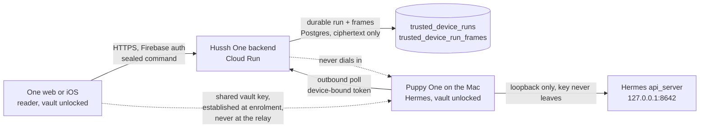

# Puppy One: the outbound rendezvous

> **DO NOT BUILD FROM THIS DOCUMENT YET.** It has been through two adversarial
> reviews. The first found seven high-severity defects and the design was
> rewritten around them. The second, by two independent reviewers reading the
> revision against the actual code, returned **"no, not as written"** from both,
> with seven further high findings. They are listed in section 12 with the
> evidence. Several are not typos in the design, they are places where the
> mechanism does not deliver a guarantee the threat model claims, and at least
> two are product decisions about what Phase 1 should be rather than engineering
> defects. Those need the founder before a third revision is worth writing.
>
> The analysis below is still worth keeping and is heavily verified: the per-lane
> Cloud Run arithmetic, the advisory heartbeat contract, the missing device
> binding in `require_vault_owner_token`, the blind signing at `bridge.py:918`,
> the 300s revocation tick, and the fact that `on_device_only` governs only
> auxiliary tasks were each independently re-confirmed against the code by the
> second round. The queue-over-tunnel choice survived both reviews. What has not
> survived is the key schedule's holder set, the "no tools" claim, the
> completion signal, and Phase 1's scope.

**Status:** design only, 2026-09-03, revised the same day after an adversarial
review found seven high-severity defects in the first draft, then failed a
second review. Nothing here is built. Every claim about current behavior is
cited to code in this repository or in the Hermes fork; every claim about future
behavior is marked as a proposal, and every defence that rests on code that does
not exist yet is called out by name and carries a numbered work item in
section 5.

This is the missing half of [Puppy One: the on-device tier](./puppy-one-on-device.md).
That document explains what a person sees when their machine is not reachable.
This one explains how it becomes reachable, without ever opening a port on it.

Section 11 records what the first review changed and why. Read it if you want
to know which of the claims below were once stated more strongly than the code
could support.

## Visual Map



Two arrows are the point. The one that does not exist is the relay dialling
into the Mac: every line into the Mac is a line the Mac drew itself. The dotted
one that does exist is a secret the browser and the Mac already share and the
relay has never held, which is what makes the relay a courier rather than a
participant.

## 1. The problem

`hushh-webapp/lib/hermes/bridge-config.ts` resolves every Puppy One route to a
loopback address and refuses any other host: it parses the hostname and returns
`null` unless it is one of `127.0.0.1`, `localhost`, `::1`, `[::1]`. That refusal
is correct and must stay. The bearer it carries, `HERMES_API_SERVER_KEY`, is the
same value as `API_SERVER_KEY` in the Hermes profile, and the gateway it opens
accepts `/v1/chat/completions` with the agent's full toolset, so that key is host
remote-code-execution. Forwarding it to any other host would be handing a
stranger the machine. The file says so in its own header: "This is why the bridge
is localhost-only today. A cloud-hosted One cannot reach a loopback service on
your Mac; that requires the outbound rendezvous." The consequence is visible on
`uat.one.hushh.ai` and `one.hushh.ai` today: the heartbeat path
(`consent-protocol/api/routes/account.py`, `trusted_device_heartbeat`) lets a
person SEE their machine from any browser, and the composer stays disabled,
because the only way to TALK to Puppy One is to be sitting at it.

## 2. Threat model

### Who the adversary is

| Adversary | What they want | What the design must deny them |
| --- | --- | --- |
| A stranger on the internet | Reach the Mac at all | There is no listener to reach. The Mac has no inbound port, no forwarded port, no uPnP mapping, no public address. Every connection is outbound and originated by the Mac. |
| A person who has taken the account's Firebase session | Run commands on the Mac | A Firebase session alone must not be sufficient. It cannot grant reachability (section 4.1), cannot claim runs or emit frames as the machine (section 4.3), and cannot produce a frame the Mac will decrypt, because sealing a command needs the person's unlocked vault key (section 4.5). What it can do is enqueue an opaque row and read metadata. |
| A person who has taken the session **and** unlocked the vault | Run commands on the Mac | Not denied. This is the same authority as sitting at the machine with the vault open, and it is the authority the product is for. It is bounded by the closed vocabulary (section 4.4), by the tool policy for remote-origin runs (section 4.4), and by the reachability grant being off by default. |
| Someone who has stolen the Mac's device-bound token | Impersonate the machine to One | The token is device-bound (`agent_id = device:{device_id}`), lives 15 minutes (`consent-protocol/api/routes/consent.py:1357`), and is re-checked against `is_trusted_device_active` on every validation in `consent-protocol/hushh_mcp/consent/token.py`. The rendezvous routes must additionally bind the token's `agent_id` to the path's `device_id`; that binding does not exist today and is work item **W3**. The token still does not let its holder produce readable frames: it moves ciphertext it cannot open. |
| **A compromised or malicious relay tier**, including anyone who reaches our database, logs or backups | Read what a person says to their own agent, **or write commands to it** | Reading is denied by the envelope (section 4.5). Writing is denied by the same envelope, because the sealing key is derived from a secret the relay has never held. This row did not exist in the first draft, and it is the reason the key schedule changed; see section 11. |
| A compromised **app-serving** tier | Everything | Not denied on the web. See the honest limit below. |
| A model vendor | See the person's prompts | Bounded, not eliminated, and not by the mechanism the first draft cited. See below. |

### The model-vendor row, stated correctly

The first draft claimed a model vendor sees nothing because the turn runs
"under `hussh_one.on_device_only`". That reading is wrong.
`agent/auxiliary_client.py:6065` shows the gate refusing a **network fallback
for an auxiliary task**. The fork's own changelog says it in as many words:
"Pinning the provider only ever covered the main turn; auxiliary tasks defaulted
to `provider: auto`." The main turn is governed by `model.provider`, a pinned
config value, and nothing in the gate prevents that pin naming a hosted
provider.

Two consequences, both load-bearing:

- The truthful claim is: **a remote turn is answered wherever the machine's
  pinned provider says**. On a machine configured as the on-device doc
  describes (`model.provider: lmstudio`, gate on), that is the resident local
  model and no vendor sees anything. On a machine pinned to a hosted provider,
  the rendezvous changes nothing about who sees the prompt, and the reader
  should not imply otherwise.
- `model.pin` therefore cannot be in the remote vocabulary. `POST /api/model/set`
  (`gateway/platforms/api_server.py:3474`) accepts any already-configured
  provider and model, and although it refuses `base_url`, `api_key` and
  `profile`, it will happily repoint the main turn at a configured cloud
  provider. A remote command that can move the main turn off-device is a remote
  command that can defeat the on-device claim. It is removed from the Phase 1
  vocabulary (section 4.4) rather than left as an open question.

### What the relay is trusted with, and what it is not

The relay is our own Cloud Run backend. It is trusted with **delivery and
ordering-visible metadata, and nothing else**. The first draft said "delivery
and nothing else", which was too generous to itself: a courier that can inject
is trusted with far more than delivery, and the first design let it inject.

**The relay can see:** that a person exists, which `device_id` they addressed,
`run_id`, the epoch of every enqueue, claim, frame and acknowledgement, the
number of frames, the ciphertext byte counts, the poll cadence of each machine
(and therefore, coarsely, when a machine is awake), and the terminal state of
each run. That is a real metadata leak and it is not hidden by anything below.
A traffic-analysis adversary with the database learns a person's working hours.

**The relay can do:** delay, drop, reorder at the transport level, or refuse.
Availability is entirely in its hands. It cannot make the Mac accept a delayed
or reordered frame as valid, because the AAD binds sequence and run identity
(section 4.5), but it can make a run never arrive. The design's answer to that
is honesty, not prevention: section 4.8 gives every undelivered state a sentence.

**The relay cannot see, and cannot write:** the prompt text, the answer text,
tool names, file paths, model output, session titles, or anything else in a
frame body, and it cannot construct a frame body the Mac will accept. Frames are
AEAD ciphertext under a key derived from the person's vault key, which the Mac
and the browser both already hold and the relay never has. If the frame table
were dumped in full, it would yield no plaintext. If the relay tier were fully
owned, it could stop the product working and learn who talks to their machine
when; it could not put words in the person's mouth.

**Honest limit one: the serving tier.** The relay tier does not hold the key,
but the same organisation serves the JavaScript that does. End-to-end encryption
in a web client served by the relay's owner is a real defence against the storage
tier, its logs, its backups, its operators and a database breach. It is not a
defence against a compromised or malicious app-serving tier, which can simply
ship different JavaScript. Say that plainly rather than claiming more. The claim
gets stronger in the native iOS shell, where the reader is a signed binary the
person installed, and that is a reason to want the iOS reader.

**Honest limit two: the enrolment window.** The shared secret this design relies
on is the person's vault key, delivered to the Mac at enrolment by the existing
passkey handoff (`hushh-webapp/lib/vault/trusted-device-passkey-handoff.ts` and
`hermes_cli/hussh_one_pkm/client.py:_decrypt_vault_handoff`), or by the native
masked passphrase ceremony when the handoff is unavailable. The backend mediates
the authorization record in that flow, so a malicious backend **at enrolment
time** is the residual key-substitution risk. This is a narrow, one-off,
already-accepted window rather than a per-run key-distribution endpoint the
relay controls, and it is strictly smaller than the first draft's exposure. The
person can close it by comparing the vault-key fingerprint shown by
`/hussh-one status` against the one in the machine sheet, which is a comparison
of a value both ends derived independently, not of a value the relay served.

**Honest limit three: an unlocked vault is the precondition.** The Mac can only
answer while its vault is open, and the browser can only compose or read while
the person's vault is open. That is not a weakness of the design, it is the
design: a locked Puppy One is not remotely reachable, and a reader who has not
unlocked sees ciphertext. It does mean the person unlocks to read an answer
they left waiting, which is a real cost in use and is stated as one in section
4.5 rather than hidden.

### The invariants this design is bound by

| Invariant | How it is honored |
| --- | --- |
| **BYOK** | No new key custody in the cloud, and, after the revision, no new long-lived key material at all. The Mac keeps its vault key, its wrapping key and its signing key exactly where they are today (macOS keychain, via `MacOSKeychain`). The rendezvous key is **derived** from the vault key on both ends, so it exists only while the vault is open and is destroyed by the same seal. |
| **Consent-first** | Remote reachability is a separate, explicit, per-device consent, default OFF, granted on the machine over a device-signature-verified route (section 4.1). Enrolling a device as trusted was never consent to accept commands from a phone. Withdrawal is deliberately easier than grant. |
| **Tri-Flow** | Section 8. The reader is a web and native surface; the design is what turns two N/A rows in the on-device doc into work items. |
| **Minimal browser storage** | The browser stores nothing new. It does not pin a per-device public key, because there is no per-device public key to serve: the key schedule is symmetric and derived from a secret both ends already have. The vault key remains memory-only for the tab's lifetime, exactly as today. |

## 3. The three candidate designs

### 3.1 Candidate A: a WebSocket reverse tunnel held open by the Mac

**How it works.** The Mac opens a WebSocket to the backend, authenticates it with
a short-lived relay ticket exactly the way `consent-protocol/api/routes/one/adk_live.py`
already does for voice (mint over HTTPS, consume once, Postgres-backed nonce so
single-use holds across instances), and holds it open. The browser's request is
forwarded down that socket. Frames come back up it. This is the design most
people reach for first, and the backend already terminates WebSockets on
Cloud Run, so the plumbing exists.

**What it costs.** One Cloud Run request slot per awake Mac, permanently. That is
the number that kills it. Read out of `deploy/backend.cloudbuild.yaml` and the
per-lane substitutions in the deploy workflows, which override the file's
defaults and do not agree with each other:

| Lane | Concurrency | Max instances | Backend request slots | SQLAlchemy pool + overflow |
| --- | --- | --- | --- | --- |
| Dev | 80 (file default) | 3 | **240** | 2 + 2 |
| UAT | 20 (`deploy-uat.yml`) | 5 | **100** | 3 + 0 |
| Production | 80 (file default, not overridden) | 5 | **400** | 4 + 0 |

A WebSocket is one request in flight for its whole life; the file's own comment
says it: "instances with open WebSockets stay active for the connection's
lifetime". So one hundred awake Macs consume the entire UAT backend and every
ordinary API request queues behind them. Four hundred consume production. Long
before that, the pinned instances remove all autoscaling headroom, because an
instance holding connections cannot be scaled down. At list price a 1 vCPU /
1 GiB instance held active is roughly $0.096 per hour, so pinning all five is on
the order of $350 a month, which is affordable; the capacity is not. Treat those
dollars as arithmetic from published prices, not a measured bill.

**How it fails.** Cloud Run's request timeout is 3600s, hardcoded in
`deploy/backend.cloudbuild.yaml`, so every tunnel dies at least hourly and must
reconnect, and a revision rollout or a scale-down kills them all at once with
about ten seconds of grace. Session affinity is best-effort, so nothing
guarantees the browser's request lands on the instance holding that Mac's
socket; making that work needs either a shared broker or an instance-routing
scheme, and the repo has already been burned by exactly this class of bug.
`consent-protocol/api/routes/kai/analyze_run_store.py` documents it: an
in-memory per-instance singleton meant `/stream` landed on an instance that had
never seen the run, 404 in production, invisible in UAT because UAT ran a single
instance.

**Verdict: not the pick.** It is the right shape at a scale this backend is not
configured for, and it fails first in the lane where it is hardest to see.

### 3.2 Candidate B: a durable queue with the Mac as consumer

**How it works.** The browser enqueues a run. The Mac polls for work with its
device-bound token, claims a run, answers it against its own loopback gateway,
and posts frames back. The browser reads frames from a durable table over the
existing resumable-stream pattern. Nothing is held open anywhere.

**What it costs.** Request volume instead of request slots. Three loads, not
one, and the first draft counted only the first:

1. **The claim poll.** With an adaptive interval (1s while a conversation is
   live, backing off to 30s when idle), a thousand idle machines produce about
   33 requests per second of one indexed query each. Each poll occupies a slot
   for milliseconds rather than hours, so a thousand machines occupy well under
   one slot on average.
2. **The token refresh cycle**, which the first draft omitted entirely. The
   device-bound owner token lives **15 minutes**
   (`expires_in_ms=15 * 60 * 1000`, `consent-protocol/api/routes/consent.py:1357`),
   and the device refreshes at 30 seconds of remaining life
   (`hermes_cli/hussh_one_pkm/bridge.py:904`). Each refresh is two HTTPS
   requests (challenge, then token) plus a Firebase token refresh, and on the
   server it is a challenge insert, a conditional consume update, and a token
   issue or reuse. `_issue_or_reuse_vault_owner_token` reuses a token with more
   than a quarter of its life left, which damps the issue path but not the
   challenge path. A thousand machines is therefore about 2.2 requests per
   second of **write** traffic on top of the read-only polls, against a pool of
   3 in UAT and 4 in production with `DB_SQLALCHEMY_MAX_OVERFLOW=0`. That is
   the number to watch, and it is the one that must appear in the load proof.
3. **The reader stream**, which costs a **frontend** slot, not a backend one,
   unless it is routed around the Next proxy. See section 4.2.

At Cloud Run's request price the compute is single-digit dollars a month. The
database is the constraint, so the poll must be one indexed query and never a
fan-out.

**How it fails.** Latency is bounded below by the poll interval, so an idle
machine answers a first message a few seconds late. Every frame is a row, so an
unbounded answer is an unbounded write path and needs hard caps. And a queue is
a place where ciphertext sits, so it needs a retention rule and a sweeper.

**Verdict: this is the pick**, for a reason beyond cost. A queue is the honest
model of the actual situation. An asleep Mac is the common case, not an error,
and a queue is what a message to an asleep machine IS. A tunnel design has to
bolt a queue on anyway to handle the normal case; this design starts from it.

### 3.3 Candidate C: WebRTC data channel, browser to Mac directly

**How it works.** The backend is signaling only. The browser and the Mac
exchange SDP through it, then ICE finds a path, and the conversation flows
directly with DTLS. When both sides are behind symmetric NAT, a TURN relay
carries the bytes.

**What it costs.** A WebRTC stack in a Python CLI (aiortc or equivalent), a TURN
deployment or a vendor, and a permanent signaling channel that has the same
"how does the Mac learn a call is waiting" problem as everything else, so it
does not remove the need for candidate B, it sits on top of it.

**How it fails.** ICE fails, and when it does it fails in a way nobody can debug
from a support ticket. A meaningful fraction of corporate and mobile networks
force TURN, at which point the "direct" design is a relay design with more moving
parts and a third party in the path. It also cannot answer the offline case at
all: WebRTC has no concept of a message to a machine that is asleep.

**Verdict: not the pick**, and specifically not the pick for the case that
matters most. It optimises latency for the situation where the Mac is awake and
the network is friendly, and it has nothing to say about the situation that is
actually common.

### 3.4 Candidate D, considered and held in reserve: a broker outside Cloud Run

**How it works.** Move the long-lived connection off our request path entirely.
The Mac opens a Firestore real-time listener on a document path scoped to its own
`user_id`, authenticated by the Firebase ID token it already holds
(`HusshIdentityClient.id_token`). The backend writes a wake marker; Google's
infrastructure holds the socket and delivers it; the Mac then does an ordinary
HTTPS claim against the queue of candidate B.

**Why it is attractive.** It gives instant wake with zero Cloud Run slots held,
and it reuses the Firebase identity the device already has.
`google-cloud-firestore` is already a declared dependency in
`consent-protocol/requirements.txt`.

**Why it is not Phase 1.** Firestore is currently unused in this codebase. There
is no schema, no rules file, no billing history and no operational experience
with it here, and adopting a second datastore to save a few seconds of latency
before anyone has confirmed the product is worth using is the wrong order. It
becomes the right answer the moment measured wake latency is the complaint, and
the design keeps that door open by making the wake signal a separate concern
from the queue (section 5, Phase 4). Note also that a wake marker is metadata
only: under the key schedule of section 4.5 the broker never carries a frame
body, so adopting it does not widen the confidentiality boundary.

## 4. The recommended design

**Phase 1 is queued one-shot commands, not an interactive session.** Argue with
that only after reading section 4.9, which is where the cost of an interactive
session is stated in numbers.

Phase 1 is also **no tools**, and that is not a temporary simplification. See
section 4.4, which is the part of this design that changed most under review.

### 4.1 Consent: reachability is opt-in, per device, granted on the machine, over a signed route

A person who ran `/hussh-one connect` consented to their agent talking to Hussh
One. They did not consent to Hussh One handing their agent instructions from
anywhere else. So remote reachability is a distinct grant.

**Where the first draft was wrong.** It carried `remote_enabled` on the
heartbeat. That is a Firebase-authed route with no device signature whose own
docstring says "Purely advisory telemetry ... enforcement never consults it.
Trust stays decided by status and `is_trusted_device_active`"
(`consent-protocol/api/routes/account.py:478-489`). Its body is reduced to an
allow-list of scalars by `_safe_heartbeat`
(`consent-protocol/hushh_mcp/services/trusted_device_service.py:512`), whose
`_HEARTBEAT_BOOL_FIELDS` today holds only `busy`, `battery_charging` and
`on_ac`. The draft's own Phase 0 was to add `remote_enabled` to that list, and
the allow-list makes no distinction between a bool the device sent and a bool
anyone with the session sent. So anyone holding a stolen browser session could
have POSTed `{"remote_enabled": true}` and granted themselves reachability
without touching the Mac. That is exactly the cloud
toggle the section says must not exist, and the draft built it while arguing
against it. The heartbeat stays advisory.

**The rule, restated.** Consent is **asymmetric**. Granting authority requires
proof at the machine; withdrawing it requires only the account. Anything else
either makes the grant forgeable or makes the person helpless when they are
away from the Mac and worried.

| Direction | Who may do it | What proves it | Where it is stored |
| --- | --- | --- | --- |
| Turn reachability **ON** | Only the machine | A P-256 device signature over a challenge whose purpose string is `rendezvous-reachability` (section 4.3), verified by the server the same way `verify_challenge` verifies the vault-owner capability today | A dedicated `trusted_devices` column, written only by the signature-verified route |
| Turn reachability **OFF** | The machine, **or** any authenticated session of the person, **or** implicitly by any revoke or seal | Firebase auth is enough. Withdrawal only reduces authority | The same column |

- Default OFF. A device that has not been opted in is never offered as a target,
  and an enqueue addressed to it is refused with a named code.
- Turned on **at the machine**, with `hermes` (proposed: `/hussh-one remote on`),
  because the risk lands at the machine and consent should be expressible where
  the risk is.
- Turned off from anywhere, including the machine sheet in One, on a phone, on
  a borrowed laptop. A person who thinks they are compromised must be able to
  cut reachability without the destructive act of revoking the device, which
  seals the vault and destroys the local PKM replica. The first draft had no
  such path, which meant "revoke the whole device" was the only remote remedy.
  That is a bad remedy and people will not use it.
- The device reads the flag back on every claim and refuses to serve runs when
  the server says off, so the off switch does not depend on the device
  cooperating with a push it never received.

None of these routes or columns exist. They are work items **W1** (signed
reachability route and column) and **W2** (the cloud-side off switch).

### 4.2 The connection lifecycle

There is no connection. That is the design. There are four request shapes, none
of which is held open:

| Step | Who calls | Where | Holds open |
| --- | --- | --- | --- |
| Enqueue | Browser | `POST /api/account/trusted-devices/{device_id}/runs` | No |
| Claim | The Mac | `POST /api/account/trusted-devices/{device_id}/runs/claim` | No, returns immediately with a run or with a backoff hint |
| Emit | The Mac | `POST .../runs/{run_id}/frames` | No, one call per batch of frames |
| Read | Browser | `GET .../runs/{run_id}/frames?after=` (Phase 1) or `GET .../runs/{run_id}/stream` (SSE, Phase 2) | Bounded, see below |

The Mac's claim carries `poll_interval_hint_ms` back from the server. The server
returns a small number while a run is queued or in flight for that device, and a
large one when the device has been idle. The Mac obeys it, clamped locally to a
floor and a ceiling it decides for itself, so a compromised server cannot turn a
person's laptop into a request generator.

**The reader's transport is a decision, not a detail, and it costs a frontend
slot.** On web, `ApiService` resolves to relative paths and every call goes
through a Next route handler (`hushh-webapp/app/api/account/[...path]`), so an
open reader stream pins a **frontend** Cloud Run request slot for its whole
life. The frontend ceilings, from `deploy/frontend.cloudbuild.yaml` and the
workflow substitutions, are tighter than most people assume and, again, differ
by lane:

| Lane | Frontend concurrency | Max instances | Frontend request slots | Frontend request timeout |
| --- | --- | --- | --- | --- |
| Dev | 80 (file default) | 10 | **800** | 120s (file default) |
| UAT | 10 (`deploy-uat.yml`) | 10 | **100** | **300s** (`deploy-uat.yml`) |
| Production | 80 (file default, not overridden) | 10 | **800** | 120s (file default) |

Two corrections to the first draft fall out of that table. The 120s figure it
quoted is the file default and is right for production and dev, but **UAT runs
300s**, so a stream tuned to reconnect just under two minutes will be correct
everywhere and merely conservative in UAT. And UAT's frontend concurrency of 10
means **one hundred concurrent readers exhaust the UAT frontend**, which is the
same order as the tunnel design's backend ceiling that this document rejected
candidate A over. Holding a stream open through the Next proxy reintroduces the
problem in a different tier.

The design's answer, in two parts:

- **Phase 1 does not stream.** The reader polls `GET .../frames?after=` on the
  same adaptive cadence as the device. A poll occupies a frontend slot for
  milliseconds. This is one of the reasons Phase 1 is smaller than the first
  draft made it.
- **Phase 2's stream must bypass the Next proxy**, using the existing
  `getDirectBackendUrl()` escape hatch in
  `hushh-webapp/lib/services/api-service.ts`, whose own comment reads "Direct
  Backend URL for streaming (bypasses Next.js proxy)". Then the stream costs a
  backend slot, where the ceilings are 100 in UAT and 400 in production, and it
  is subject to the backend's 3600s timeout instead of the frontend's. It still
  must reconnect with a cursor, because every frame is durable and a dropped
  stream must cost nothing. That property is not optional and is the direct
  lesson of `consent-protocol/api/routes/kai/analyze_run_store.py`.

Routing the reader stream direct to the backend is work item **W9**, and it
brings CORS and auth-header handling with it that the proxy does today.

### 4.3 Authentication, on both ends, and what does not come for free

**The Mac proves it is the Mac** with the credential it already mints:

1. `POST /api/account/trusted-devices/{device_id}/challenge` returns a nonce and
   a `signing_payload` (Firebase-authed).
2. The device signs it with the P-256 key in the macOS keychain
   (`HusshIdentityClient.sign`).
3. `POST /api/consent/vault-owner-token/device` returns a device-bound
   `vault.owner` token whose `agent_id` is `device:{device_id}`, valid 15
   minutes.

This is what `HusshOneBridge.acquire_vault_owner_token` does today for the PKM
device-sync channel. Two properties the first draft assumed are **not** true,
and both are work items rather than inheritances.

**The device binding is not enforced by the dependency.** The draft said the
rendezvous routes "take the same dependency" and that revocation therefore comes
for free. `require_vault_owner_token`
(`consent-protocol/api/middleware.py:187`) validates any `vault.owner` token for
the user. The `is_trusted_device_active` recheck in
`consent-protocol/hushh_mcp/consent/token.py` fires only when
`agent_id.startswith("device:")`, and `POST /api/consent/vault-owner-token`
issues a token with `agent_id` defaulting to `"self"`
(`consent-protocol/api/routes/consent.py:1270`) to any Firebase session. Written
as the draft described, a taken browser session could claim the person's queued
runs and post `from_device` frames: the cloud impersonating the Mac to One, with
no device recheck ever running. Nothing in the draft bound the path's
`device_id` to the token's `agent_id` either, so device A's token could act on
device B's run.

The rendezvous device routes therefore take a **new, explicit** dependency, not
the existing one. The contract, stated as code because the exact assertion is
what matters:

```python
async def require_rendezvous_device_token(
    device_id: str,
    token_data: dict = Depends(require_vault_owner_token),
) -> dict:
    """Admit only a device-bound owner token for THIS device.

    require_vault_owner_token admits any vault.owner token for the user,
    including the agent_id="self" token a browser session mints for itself,
    and the is_trusted_device_active recheck in token.py fires only for
    agent_id values starting with "device:". Both assertions below are the
    difference between "the machine is talking" and "someone holding the
    account is pretending to be the machine".
    """
    agent_id = str(token_data.get("agent_id") or "")
    if not agent_id.startswith("device:"):
        raise _auth_error("RENDEZVOUS_DEVICE_TOKEN_REQUIRED")
    if agent_id != f"device:{device_id}":
        raise _auth_error("RENDEZVOUS_DEVICE_MISMATCH")
    return token_data
```

That is work item **W3**, and it carries two negative controls: a `self` token
gets 403 on claim and on frames, and device A's token gets 403 on device B's run.

**The device must stop blind-signing.** `hermes_cli/hussh_one_pkm/bridge.py:918`
is `signature = self.identity.sign(str(challenge["signing_payload"]))`. The Mac
signs whatever string the server hands back, with no local check of purpose,
`user_id` or `device_id`. Today exactly one purpose string exists
(`"vault-owner-capability"`, hardcoded at
`trusted_device_service.py:902`) and the server reconstructs the payload
canonically when it verifies, so nothing is currently exploitable. The moment
this design adds a second purpose string, that changes: a compromised relay
answers a routine vault-owner-token challenge with a
`rendezvous-reachability` payload, the Mac signs it verbatim, and the attacker
holds a device-signed reachability grant the person never made. The draft's own
caution ("so a signature for one capability can never be replayed as the
other") was true of the verifier and false of the signer.

So before signing anything, the device must parse `signing_payload` and assert
that `purpose` is the one it just asked for, and that `user_id` and `device_id`
equal its own state. A device that cannot parse the payload refuses to sign.
That is work item **W4**, and it is a **prerequisite for W1**: the second
purpose string must not exist in production before the signer checks purposes.
Its negative control is to hand the device a mismatched purpose and confirm it
refuses.

**The browser proves it is the person** with the Firebase session it already
holds, the same way `fetchPuppyLink` in
`hushh-webapp/lib/services/puppy-one-service.ts` reads the device list today.
The enqueue route additionally requires that the named device is active, opted
in, and belongs to the caller. But note what the session alone buys: it enqueues
an opaque row. It does not compose a command, because composing one requires the
vault key (section 4.5). Firebase auth is the outer envelope, not the
authorisation.

**Nothing anywhere carries `HERMES_API_SERVER_KEY` off the machine.** The Mac
calls its own loopback gateway itself, with its own key, from inside its own
process. The rendezvous does not relax the refusal in
`hushh-webapp/lib/hermes/bridge-config.ts`; it makes that refusal survivable.

### 4.4 The command vocabulary is closed, and `chat.turn` is still RCE-equivalent

A generic HTTP proxy over this channel would be host remote-code-execution with
extra steps, so there is no proxy. There is a fixed, versioned set of named
commands, each with a typed payload, each mapped on the device to one specific
gateway call. Anything not on the list is rejected by the device, not by the
server, because the device is the party that must not be tricked.

**The vocabulary is not, by itself, a bound on authority.** The first draft
presented the closed vocabulary as the mitigation for a taken session and then
put `chat.turn` in it, which maps to the full agent with its full toolset. A
closed vocabulary of one command that can do anything is not a closed
vocabulary. Three facts in the fork make that concrete:

- **`always` approvals are a persistent global allowlist.** `tools/approval.py`
  calls `approve_session(...)`, then `approve_permanent(pattern_key)`, then
  `save_permanent_allowlist(_permanent_approved)` on an `always` choice, and the
  module header names itself "Permanent allowlist persistence (config.yaml)".
  Every dangerous command the owner ever answered "always" to while sitting at
  the keyboard is pre-approved for a remote turn with nobody at the machine.
- **Non-dangerous tools were never gated at all.** The approval layer fires on
  pattern-matched dangerous commands. Reading files, sending mail through a
  configured toolset, and writing to the PKM are not in that category.
- **The promised typed `needs_approval` outcome does not exist on the chat
  path.** `_handle_session_chat_stream`
  (`gateway/platforms/api_server.py:5056`) never calls
  `register_gateway_notify`; that call exists only on the `/v1/runs` path
  (`api_server.py:8203`). With no notify callback registered, the approval code
  falls through to a CLI prompt on a TTY that a launchd-run gateway does not
  have, and the run blocks until timeout instead of terminating cleanly.

So the design changes shape rather than footnoting this.

| Command | Maps to | Phase | Notes |
| --- | --- | --- | --- |
| `chat.turn` | `POST /v1/runs` on loopback, **tools disabled** | 1 | RCE-equivalent if tools are on. Phase 1 runs it with no toolset at all |
| `status.read` | `GET /health/detailed` | 1 | Read only |
| `models.list` | `GET /api/model/options` | 2 | Read only. Deferred because Phase 1 has nothing to do with the answer |
| `chat.turn` with an explicit per-run tool allowlist | `POST /v1/runs` with a scoped toolset | 3 or never | A separate consent surface. Not a parameter of the Phase 1 grant |
| `model.pin` | `POST /api/model/set` | **removed** | It can move the main turn to a configured cloud provider, defeating the on-device claim from a phone. See section 2 |

Four consequences to build:

1. **`chat.turn` targets `/v1/runs`, not `/api/sessions/{id}/chat/stream`.**
   `/v1/runs` is the path that already has an approval lifecycle: a
   `waiting_for_approval` run status, an `approval.request` SSE event, and
   `POST /v1/runs/{run_id}/approval` to resolve. Building the remote path on
   the endpoint that has no approval plumbing, and then promising a typed
   approval outcome, is how the first draft ended up promising something that
   could not happen.
2. **Phase 1 disables tools for remote-origin runs.** Toolsets today are
   resolved per platform from `config.yaml` `platform_toolsets.api_server`
   (`gateway/platforms/api_server.py:3197`), not per request, so "a turn with
   no tools" is **new work in the fork**, not a flag that exists. Work item
   **W5**.
3. **Approval state must be scoped by origin.** A remote-origin run ignores the
   persisted permanent allowlist entirely. "I approved this once at my desk" is
   not "I approve this from a phone with nobody at the machine". Work item
   **W6**. Until W5 and W6 both exist, no remote turn runs with tools, in any
   lane, behind any flag.
4. **A remote turn that reaches an approval terminates**, with a typed
   `needs_approval` outcome the reader can render as "this turn needs you at
   that machine". It must not auto-approve and must not hang. Work item **W7**.

Relaying an approval decision is a consent surface of its own and belongs in a
later phase or never.

### 4.5 The message envelope, and the encryption

Every frame in either direction is one row:

```
{
  "v": 1,
  "run_id": "...",
  "seq": 0,
  "direction": "to_device" | "from_device",
  "alg": "HKDF-SHA256-AES256-GCM",
  "kdf_salt": "<base64 32 bytes, first frame of a run only>",
  "iv": "<base64 12 bytes>",
  "ct": "<base64 ciphertext>",
  "tag": "<base64 16 bytes>"
}
```

Nothing outside that envelope carries meaning. The command name, the prompt, the
model id, the answer, the tool names and the error text are all inside `ct`.

**The key schedule changed under review, and this is the most important change
in the document.** The first draft had the browser generate a per-run ephemeral
X25519 pair and do ECDH against a device public key the relay served. That gives
confidentiality from the relay and **no sender authentication whatsoever**:
anyone who knows the device's public key, which the relay publishes, can
generate their own ephemeral pair, derive a valid run key, and seal a
`chat.turn` frame whose AAD values the relay itself chooses. The Mac would
decrypt it and execute it against its own unlocked vault. A courier that can
forge the letters it carries is not a courier.

The fix uses a secret that already exists on both ends and has never been at the
relay: **the person's vault key**. The browser holds it in memory after an
unlock (`VaultService`, with `vaultKeyHash` as its identity check). The Mac
holds the same key, delivered at enrolment by the passkey handoff
(`hushh-webapp/lib/vault/trusted-device-passkey-handoff.ts` to
`hermes_cli/hussh_one_pkm/client.py:_decrypt_vault_handoff`) or by the native
passphrase ceremony, and stored wrapped by a device wrapping key in the keychain
(`bridge.py:enroll_vault_key`, `wrap_local_vault_key`).

1. **Never use the vault key directly.** Both ends derive a rendezvous root
   once per device pairing:
   `K_rdv = HKDF-SHA256(ikm = vault_key, salt = device_id, info = "hussh-one-rendezvous-root-v1")`.
   One key, one purpose. The vault key itself never appears in this protocol,
   and a flaw in the rendezvous cannot become an oracle on the vault.
2. **Derive a run key per run**, salted so two runs never share a key:
   `K_run = HKDF-SHA256(ikm = K_rdv, salt = kdf_salt, info = "v1|" + user_id + "|" + device_id + "|" + run_id)`.
   The initiator generates `kdf_salt` and puts it on the first frame.
3. **Every frame's AAD binds** `(version, user_id, device_id, run_id, seq, direction)`,
   pipe-joined and versioned, the way `trustedDeviceVaultHandoffAad` already
   does for the handoff. This is what stops the relay reordering frames,
   replaying a frame from one run into another, or cross-wiring two devices.
4. **The receiver validates the AAD against its own state**, not against what
   the relay told it. The Mac asserts `device_id` is its own and `user_id` is
   its own before it will even attempt a decryption, and refuses a `run_id` it
   has already claimed and completed. Every AAD value in the first draft was
   relay-chosen and relay-checked, which is the same as unchecked.
5. **Refuse an unknown `alg` rather than guessing**, exactly as
   `_decrypt_vault_handoff` does today.

What this buys, stated precisely:

- **Sender authentication in both directions.** The AEAD tag is now a proof that
  the sender held `K_rdv`, which only the machine and a person who has unlocked
  their vault can derive. A compromised relay cannot forge a `to_device`
  command, and cannot forge a `from_device` answer either. The symmetric key
  means the machine and the person are indistinguishable **to each other**,
  which is acceptable here because a run's direction is bound in the AAD and
  the two ends are the only two parties.
- **There is no key-distribution endpoint.** The relay serves no public key, so
  the first draft's "a malicious relay could serve its own key and sit in the
  middle" problem disappears, and the browser pins nothing. The residual is the
  one-off enrolment window described in section 2.
- **Multi-browser read, and reading after the tab is closed, work in Phase 1.**
  Any browser of the person derives the same `K_rdv` after unlocking the vault.
  This is the finding that killed the first draft's headline claim; see below.
- **Seal destroys the ability to read, for free and by construction.** The
  rendezvous key is derived, not stored, so it exists only while the vault key
  does. `bridge.seal` removes the local vault and then disconnects with
  `remove_device_key=True` (`client.py:764-771`), which destroys the vault key
  and therefore `K_rdv` with it. A separately stored X25519 private key, as the
  first draft proposed, would have survived the seal unless someone remembered
  to add it to the destroy list, and the draft's claim that queued frames were
  "unreadable ciphertext at that point anyway" would have been false. Deriving
  rather than storing is what makes that sentence true.

**The honest cost, and the claim it forces us to shrink.** The first draft's
Phase 1 headline was "close the tab, the answer is waiting", while its own key
rule kept the reader private key memory-only for the tab's lifetime. Those two
statements cannot both be true: closing the tab destroyed the only key that
could read the answer. Under the vault-derived schedule the answer really is
waiting, but **the person unlocks their vault to read it**. That is a passkey
touch or a passphrase, on whichever device they come back to. Say that in the
product copy. It is a smaller and truer claim than the first draft's, and it is
the claim the key rule can actually support.

The same rule cuts the other way and must be stated: **a Mac whose vault is
locked cannot answer.** It can claim a run, but it cannot derive `K_rdv` to
decrypt the command. `hussh_one.vault.lock_with_workstation` defaults to off, so
in the common configuration the vault stays open with the screen locked, which
is what makes the product work and is also the subject of open question 1.

### 4.6 Backpressure

The relay stores ciphertext in Postgres, so unbounded output is an unbounded
write path against a 3 or 4 connection pool with zero overflow. Hard limits, all
enforced server-side and all mirrored on the device:

- One in-flight run per device. The Mac's local model serves one turn at a time
  anyway, and it already reports `busy` and `active_sessions` on the heartbeat.
- A per-device queue depth cap (proposed: 8). Past it, the enqueue is refused
  with a reason the composer can show. Refusing is honest; accepting silently is
  not.
- A frame ciphertext cap (proposed: 16 KB) and a per-run total cap (proposed:
  1 MB). Past the run cap the device seals a truncation marker and stops, so the
  reader learns the answer was cut rather than seeing it stop mid-sentence.
- Frames posted in batches, so a fast local model does not become one insert per
  token. One insert per batch, never per frame, and never a query per frame.
- Enqueue rate limits per device and per user, through the existing rate-limit
  storage.
- The token refresh cycle counted in the budget, not just the polls. Two
  requests and three database operations per device per fifteen minutes
  (section 3.2) is a floor that exists whether or not anyone sends a message.

### 4.7 Retention

Frames are deleted when the run reaches a terminal state and the reader has
acknowledged its cursor, and unconditionally at a hard TTL (proposed: 24 hours)
whether acknowledged or not. A queued run that is never claimed expires at the
same horizon and is reported as never delivered, with the reason. This mirrors
the six-hour retention already chosen for Kai runs, lengthened because an asleep
Mac is normal and six hours is a working day.

### 4.8 Revoke, seal, and offline

**Revocation stops reachability immediately. The seal is not immediate, and the
first draft said it was.** Two separate clocks, and conflating them produced a
negative control that would have failed:

| What happens | When | Enforced by |
| --- | --- | --- |
| The device's next claim or frame POST is refused | Immediately, on the next request | `is_trusted_device_active` recheck in `consent-protocol/hushh_mcp/consent/token.py`, returning `TRUSTED_DEVICE_REVOKED` |
| Queued runs marked undeliverable, frames deleted | Immediately, server-side | The revoke handler |
| The device **seals**: vault envelope, wrapping key, encrypted PKM replica and Source Library custody destroyed, `post_seal_ack`, `sealed_at` stamped | Up to **five minutes** later | `bridge._revocation_tick`, driven by `REVOCATION_POLL_INTERVAL_SECONDS = 300` |

The gap exists because a 401 or 403 on the owner-token path calls `self.lock()`,
not `self.seal()` (`bridge.py:acquire_vault_owner_token`). Locking is correct
there: an ambiguous auth failure must never destroy user data, and only an
explicit `revoked` from the device-status endpoint may
(`bridge.py:1041`, "Only an explicit `revoked` destroys anything").

The design does not paper over the five minutes. It shortens them: a
`TRUSTED_DEVICE_REVOKED` code on a rendezvous claim should **schedule the
revocation tick immediately** rather than waiting out the interval, so the
rendezvous poll becomes a faster revocation detector than the five-minute timer,
not a slower one. It still routes the destruction through the existing
`device_status` confirmation, so an ambiguous failure still cannot seal. That is
work item **W8**, and until it lands the honest statement is "reachability stops
at once, the seal completes within five minutes".

This remains a concrete advantage of the queue over the tunnel. A held-open
socket survives a revoke until something actively closes it, which means writing
and testing a second enforcement path. A poll cannot survive one, because the
check that already exists runs on it.

**An offline or asleep Mac is the common case.** The rules:

| Situation | What the person sees before they send | What happens to the message |
| --- | --- | --- |
| Heartbeat fresh, opted in | Normal composer | Delivered in about one poll interval |
| Heartbeat stale (the "Quiet" row in the on-device doc) | The composer stays usable and says the machine is asleep and the message will be waiting when it wakes | Queued, delivered on the next claim, and the person is told when |
| Never reported, or reachability off | The composer is disabled and names the remedy, which is a command at the machine | Not accepted. Refusing beats a message that vanishes |
| Vault locked in this browser | The composer is disabled and asks for an unlock | Not accepted. There is no key to seal it with |
| Queued and the TTL expires | The run shows as never delivered, with the machine it was waiting on | Deleted, and said so |
| Revoked while queued | The run shows as undeliverable because the device was unlinked | Deleted |

Never silently drop, never pretend delivered, and never leave a message in a
state with no sentence attached to it.

**Multiple devices** are addressed one at a time. A run names exactly one
`device_id`. With one active opted-in device it is chosen automatically; with
several the person picks, and the picker shows each machine's liveness. Never
broadcast: two Macs are two agents with two different local states and two
different sessions, and answering the same prompt on both is not a feature.

**The same device from several browsers** is answered by the run being a
server-side resource, not a socket. Any browser of the person can see any run's
metadata and status, and any browser of the person can read the content after a
vault unlock, because `K_rdv` is derived rather than held.

### 4.9 Why not just hold a session open, in numbers

Because the numbers are already decided by files in this repository, and they
differ per lane:

- Backend request slots: 240 dev, 100 UAT, 400 production (section 3.1).
- Frontend request slots: 800 dev, **100 UAT**, 800 production (section 4.2).
- 3600s backend request timeout, so every held backend connection dies at least
  hourly.
- 120s frontend request timeout in dev and production, 300s in UAT, so an
  interactive stream through the Next proxy dies at two minutes in the lanes
  that matter most.
- 3 or 4 database connections per instance with zero overflow in UAT and
  production, so anything that fans out per frame starves the instance.

An interactive session design has to solve all five before the first person can
use it. The queue design has to solve none of them, and the first person can use
it in Phase 1.

## 5. The phased plan

Each phase is useful on its own and can be stopped after. Phase 1 is smaller
than the first draft's Phase 1, deliberately: the cryptography moved earlier and
the tools moved later.

### The work items

These are the things the design depends on that **do not exist in the code
today**. None of them is an inherited property. Nothing in Phase 1 ships until
its prerequisites are green.

| # | Work item | Where | Blocks |
| --- | --- | --- | --- |
| **W1** | Device-signature-verified reachability route and a dedicated `trusted_devices` column. Not the heartbeat | `consent-protocol` | Phase 0 |
| **W2** | Cloud-side reachability OFF switch, Firebase auth only, honored by the device on every claim | `consent-protocol`, `hushh-webapp`, fork | Phase 0 |
| **W3** | `require_rendezvous_device_token`: reject non-device-bound owner tokens, assert `agent_id == device:{path device_id}` | `consent-protocol/api/middleware.py` | Phase 1 |
| **W4** | Device verifies `signing_payload` (purpose, `user_id`, `device_id`) before signing. Prerequisite for W1 | fork `hermes_cli/hussh_one_pkm/bridge.py` | Phase 0 |
| **W5** | Per-run toolset scoping so a remote turn can run with no tools. Toolsets are per-platform config today | fork `gateway/platforms/api_server.py` | Phase 1 |
| **W6** | Approval state scoped by origin; remote-origin runs ignore the persisted permanent allowlist | fork `tools/approval.py` | Phase 1 |
| **W7** | Typed `needs_approval` terminal outcome on the remote path, wired to the `/v1/runs` approval lifecycle | fork | Phase 1 |
| **W8** | `TRUSTED_DEVICE_REVOKED` on a rendezvous claim schedules the revocation tick immediately, still routed through `device_status` | fork `bridge.py` | Phase 1 |
| **W9** | Reader stream direct to the backend, bypassing the Next proxy, with cursor-resumable reconnect | `hushh-webapp` | Phase 2 |
| **W10** | Vault-key fingerprint of at least 64 bits, shown by `/hussh-one status` and in the machine sheet | fork, `hushh-webapp` | Phase 0 |

W10 exists because the first draft proposed an eight-character fingerprint.
Eight hex characters is 32 bits, and grinding a key whose fingerprint collides
with a target at 32 bits is hours of commodity GPU time, so a fingerprint that
short is a comparison ritual rather than a check. Under the revised key schedule
the fingerprint is no longer the only defence, since the relay serves no key,
but a fingerprint worth showing should be worth trusting.

### The phases

| Phase | What ships | What it proves | What it does not yet do |
| --- | --- | --- | --- |
| **0. Reachability, declared** | W4, then W1, W2, W10. `/hussh-one remote on` at the machine over the signed route, the cloud-side off switch, the vault-key fingerprint shown on both sides | That consent can be expressed at the machine, cannot be forged from a browser session, and can be withdrawn from anywhere, before a single byte is relayed | Nothing is relayed |
| **1. One-shot queued turn, no tools, encrypted from the first byte** | W3, W5, W6, W7, W8. Enqueue, claim, frames, cursor-polled read. `chat.turn` with tools disabled, and `status.read`. The vault-derived envelope (section 4.5) | That a person on a phone can ask their asleep Mac a question, walk away, unlock their vault later on any device, and read the answer. And that a full dump of the frame table yields no plaintext | No streaming, no tools, no approvals, no `model.pin`, no `models.list` |
| **2. It feels live** | Adaptive poll hint, batched frame emission, W9's resumable direct-to-backend SSE stream, truncation markers, `models.list` | That remote time-to-first-token is within a stated multiple of local, measured separately and never blended | Wake latency is still bounded by the poll floor |
| **3. Tools, if the founder says so** | A per-run explicit tool allowlist as its own consent surface, and either relayed approvals or a documented refusal to build them | That a remote turn with tools is a grant a person made knowingly and narrowly, not a side effect of a chat box | Nothing here ships without an answer to open question 2 |
| **4. Instant wake, if measured latency demands it** | Move only the wake signal to a broker outside Cloud Run (candidate D) | That sub-second wake is reachable without holding a Cloud Run slot | Only if Phase 2's measurements say it is needed |

Phase 1 is the one that matters. If it ships and nobody uses it, phases 2 to 4
should not be built. Note that the first draft's Phase 3 no longer exists as a
phase: its cryptography moved into Phase 1 because Phase 1's own claims could
not stand without it, and a "real end-to-end" phase that arrives after people
are already using a plaintext-to-the-relay channel is a phase that ships the
wrong thing first.

## 6. What this deliberately does not do

- **No inbound anything.** No port on the Mac, no port forwarding, no uPnP, no
  public listener, no reverse SSH, no ngrok, no vendor tunnel.
- **No forwarding of `HERMES_API_SERVER_KEY`.** The refusal in
  `hushh-webapp/lib/hermes/bridge-config.ts` stays exactly as it is. This design
  exists so that refusal costs nothing.
- **No generic HTTP proxy** to the loopback gateway. A closed command vocabulary
  or nothing.
- **No tools on a remote turn in Phase 1**, and no tools ever without a separate
  grant. The persisted "always" allowlist never applies to a remote-origin run.
- **No `model.pin` from a phone.** A remote command that can move the main turn
  to a cloud provider defeats the on-device claim.
- **No relayed tool approvals** in Phase 1. A turn that needs a person at the
  machine says so.
- **No consent carried on the heartbeat.** The heartbeat stays advisory
  telemetry, as its own docstring promises.
- **No cloud custody of any key** that can read or write a frame.
- **No new long-lived key material anywhere.** The rendezvous key is derived
  from a secret both ends already hold, so it is created and destroyed with the
  vault key rather than needing its own lifecycle.
- **No third-party TURN, STUN or tunnel vendor.**
- **No replacement for the loopback bridge** when the person IS at the machine.
  That path stays, is faster, and is the one that keeps working when Hussh One is
  down.
- **No hiding of metadata.** The relay knows when a machine is awake. That is
  stated, not mitigated.

## 7. Open questions the founder must answer

1. **May a remote turn run while the Mac's console is locked?** Today
   `hussh_one.vault.lock_with_workstation` defaults to off, so the vault stays
   available with the screen locked. Combined with this design, a prompt from a
   phone would run against an unlocked vault with nobody at the machine. That is
   either the entire point of an always-on agent or the sharpest new risk in the
   design, and it is a product decision, not an engineering one. It is the
   question to answer first. Note that under section 4.5 the answer is
   mechanical as well as philosophical: if the vault is locked, the Mac cannot
   decrypt the command at all, so "no" is enforceable by doing nothing.
2. **Does the vocabulary ever include tool-using turns?** Phase 1 answers "no"
   by construction. Phase 3 exists only if the answer is "yes, under a separate
   and narrower grant". A conversation that can send email, touch the vault or
   write to the PKM from a phone is a much larger grant than a conversation that
   can only talk, and the persisted approval allowlist means the larger grant is
   larger than it looks.
3. **Retention.** Is 24 hours right for undelivered ciphertext in our database,
   or should an undelivered run expire far sooner?
4. **Default target with several active machines.** Most recently seen, most
   recently used, or always ask?
5. **How much unlock friction is acceptable?** Reading an answer requires a
   vault unlock in whichever browser the person returns to. That is the price of
   the relay never holding a readable key. If it proves too heavy in practice,
   the alternatives are all worse, and the right response is a better unlock, not
   a weaker key.

The first draft's third open question, "is a first-party relay acceptable for
Phase 1 with encryption arriving in Phase 3", has been withdrawn. The review
showed that the unencrypted variant also had no sender authentication, which
made it a remote-execution channel a compromised relay could drive. There is no
version of this worth shipping without the envelope, so the question is settled
by the threat model rather than by preference.

## 8. Tri-Flow declaration

Per the PR template, every layer is covered or explicitly marked N/A with a
reason.

| Layer | Status | Reason |
| --- | --- | --- |
| **Web** | Proposed, Phase 1 | The reader is the existing Puppy One surface, with the composer enabled on a deployed origin once the vault is unlocked |
| **iOS** | Proposed, Phase 1 | This design is precisely what turns the on-device doc's N/A row into a work item. The native shell is also where the end-to-end claim is strongest, because the reader is a signed binary rather than JavaScript the relay's owner serves |
| **Android** | Proposed, Phase 1 | Same reader contract |

The Mac side is not a Tri-Flow layer. It is the Hermes fork.

## 9. How we would know it works

Every phase gets a proof and a negative control. A proof without a negative
control is a demonstration, not evidence.

| Phase | Proof | Negative control |
| --- | --- | --- |
| **0** | On a UAT-enrolled machine, `/hussh-one remote on` flips the dedicated column through the signed route, and the vault-key fingerprint shown by `/hussh-one status` matches the machine sheet character for character | Three, and all three must pass. (a) A Firebase session posts `{"remote_enabled": true}` to the heartbeat and the column does not move. (b) A Firebase session posts directly to the reachability route without a device signature and gets 401. (c) The relay answers a vault-owner challenge with a `rendezvous-reachability` payload and the device **refuses to sign** (W4) |
| **1** | From a phone browser on `uat.one.hushh.ai`, with the Mac's lid shut, send a prompt. Close the tab. Open the lid. Open One in a **different** browser, unlock the vault, and the answer is there. Record enqueue-to-claim and claim-to-terminal separately, never summed, for the same reason the on-device doc refuses to sum `T_model` and `T_commit`: they scale on different things | Four. (a) Revoke the device between the enqueue and the wake: the run ends undeliverable, reachability stops on the first refused claim, `sealed_at` is stamped within five minutes (or immediately once W8 lands), and a `grep` of the frame table for the prompt string returns nothing. (b) An `agent_id="self"` vault.owner token gets 403 on claim and on frames, and device A's token gets 403 on device B's run (W3). (c) A frame sealed with a key derived from anything other than the person's vault key is rejected by the Mac, unopened. (d) A remote turn that names a tool gets no tool (W5), and a pattern previously answered "always" at the keyboard is still refused remotely (W6) |
| **2** | p50 and p95 time-to-first-token, remote versus local, same prompt set and same model, on the same machine as the on-device benchmark. Report the rendezvous overhead as its own column | Put the Mac to sleep mid-answer. The reader must show a truthful interrupted state, and the run must resume or terminate cleanly on wake, never hang. Separately, confirm the reader stream does not traverse the Next proxy, by watching frontend Cloud Run concurrency stay flat while a stream is open (W9) |
| **3** | A tool-using remote turn runs only after a named, narrow, separately granted allowlist, and the grant is visible in the audit trail | A turn requesting a tool outside the allowlist terminates with `needs_approval` rather than prompting a TTY that does not exist (W7) |
| **Load, before any lane carries real people** | N synthetic devices polling at the idle interval **and refreshing their 15-minute owner tokens**. Measure Cloud Run concurrent-request utilisation on both the backend and the frontend, and confirm each stays under a stated fraction of its own ceiling (100 backend and 100 frontend in UAT; 400 backend and 800 frontend in production), and that database pool checkouts stay strictly under the pool size (3 in UAT, 4 in production) for the whole run | The same run with the poll floor misconfigured to 100 ms, to confirm the server's hint clamp and the device's local floor both hold, and that neither side can be made to hammer the other |

The load proof is not optional and it is not last. This repository has already
lost time to a design that was correct in UAT and wrong in production because
UAT ran one instance, and to a first-run path that fanned fourteen routes across
a four-connection pool. Both failures were arithmetic that nobody did in advance.
The token-refresh row is in the load proof specifically because the first draft
did the poll arithmetic and forgot the refresh arithmetic, which is the same
class of omission.

## 10. Where things are

Everything cited above, in one place. The Hermes paths are in the fork,
[hushh-labs/hussh-one-hermes](https://github.com/hushh-labs/hussh-one-hermes).

| Concern | File |
| --- | --- |
| The loopback refusal this design works around | `hushh-webapp/lib/hermes/bridge-config.ts` |
| Heartbeat route, and its "enforcement never consults it" contract | `consent-protocol/api/routes/account.py` |
| Heartbeat allow-list, challenge, `signing_payload`, seal, revoke | `consent-protocol/hushh_mcp/services/trusted_device_service.py` |
| Device-bound token revocation re-check, and the `device:` prefix condition | `consent-protocol/hushh_mcp/consent/token.py` |
| Vault-owner token dependency that does **not** require device binding | `consent-protocol/api/middleware.py` |
| `agent_id="self"` token issuance, and the 15-minute device token | `consent-protocol/api/routes/consent.py` |
| Trusted-device schema | `consent-protocol/db/migrations/121_trusted_devices.sql` |
| Sync state and seal columns | `consent-protocol/db/migrations/176_trusted_device_sync_state.sql` |
| Heartbeat columns | `consent-protocol/db/migrations/189_trusted_device_heartbeat.sql` |
| Durable run store, and the multi-instance lesson | `consent-protocol/api/routes/kai/analyze_run_store.py` |
| Relay ticket pattern, single-use across instances | `consent-protocol/api/routes/one/relay_auth.py` |
| WebSocket on Cloud Run, in production today | `consent-protocol/api/routes/one/adk_live.py` |
| Device-sync pull, the existing outbound read channel | `consent-protocol/api/routes/pkm_routes_shared.py` |
| Backend Cloud Run shape: 3600s timeout, concurrency, instances, pool | `deploy/backend.cloudbuild.yaml` |
| Frontend Cloud Run shape, and the per-lane overrides that change it | `deploy/frontend.cloudbuild.yaml`, `.github/workflows/deploy-uat.yml`, `.github/workflows/deploy-production.yml`, `.github/workflows/deploy-dev.yml` |
| Reader surfaces | `hushh-webapp/app/one/puppy/page.tsx`, `hushh-webapp/components/agent/puppy-one-surface.tsx` |
| Link state the composer already reads | `hushh-webapp/lib/services/puppy-one-service.ts`, `hushh-webapp/lib/trusted-device/sync-display.ts` |
| Next proxy the reader goes through today, and the direct-backend escape hatch | `hushh-webapp/app/api/account/[...path]`, `hushh-webapp/lib/services/api-service.ts` |
| Passkey PRF and the vault key in the browser | `hushh-webapp/lib/vault/prf-auth.ts`, `hushh-webapp/lib/services/vault-service.ts` |
| Vault handoff to the device, browser side and AAD shape | `hushh-webapp/lib/vault/trusted-device-passkey-handoff.ts` |
| Vault handoff, device side, and the "refuse an unknown algorithm" rule | `hermes_cli/hussh_one_pkm/client.py` (fork) |
| Blind signing of `signing_payload`, owner token cache, seal, 300s revocation tick | `hermes_cli/hussh_one_pkm/bridge.py` (fork) |
| Outbound push that already works | `hermes_cli/hussh_one_pkm/presence.py` (fork) |
| Loopback gateway the device calls itself, `/v1/runs` approval lifecycle, `/api/model/set` | `gateway/platforms/api_server.py` (fork) |
| Persistent "always" allowlist, and the missing notify callback | `tools/approval.py` (fork) |
| What `hussh_one.on_device_only` actually gates | `agent/auxiliary_client.py` (fork) |

## 11. What the first review found

This document has survived one hostile pass. An adversarial review of the
2026-09-03 draft found seven high-severity defects and several medium ones, each
cited to code. Everything below was verified against the code again before the
change was made, so the entries record what the code says, not what the review
said about it.

| What the first draft said | What the code says | What changed |
| --- | --- | --- |
| Reachability consent rides on the heartbeat as `remote_enabled` | The heartbeat is Firebase-authed only, takes no device signature, and its docstring says "enforcement never consults it". `_safe_heartbeat` would keep an attacker-supplied bool as readily as a real one | Consent moved to a device-signature-verified route and a dedicated column (W1). A cloud-side OFF switch added (W2), because "revoke the whole device" was otherwise the only remote remedy and it seals the vault |
| The rendezvous routes take `require_vault_owner_token`, so revocation comes for free | That dependency admits any `vault.owner` token, including the `agent_id="self"` one a browser session mints. The `is_trusted_device_active` recheck fires only for `device:` prefixes, and nothing bound the path's `device_id` to the token | New explicit dependency asserting device binding and path match (W3), with negative controls for both bypasses |
| Per-run ephemeral X25519 against a relay-served device public key | Confidentiality without sender authentication. Anyone knowing the public key, which the relay serves, can seal a valid `to_device` command with relay-chosen AAD | Key schedule replaced with HKDF from the vault key both ends already hold. Sender-authenticated in both directions, no key-distribution endpoint, nothing pinned in the browser |
| The closed vocabulary bounds what a remote turn can do | `chat.turn` maps to the full agent. "Always" approvals persist to `config.yaml` as a global allowlist, non-dangerous tools were never gated, and `_handle_session_chat_stream` never registers a notify callback, so the promised typed `needs_approval` could not happen | `chat.turn` named as RCE-equivalent. Phase 1 runs it with no tools (W5), ignores the persisted allowlist for remote origin (W6), targets `/v1/runs` for its real approval lifecycle, and gets a typed terminal outcome (W7) |
| A second purpose string keeps signatures from being replayed across capabilities | True of the verifier, false of the signer. `bridge.py:918` signs whatever the server returns | The device parses and checks purpose, `user_id` and `device_id` before signing (W4), and W4 is a prerequisite for W1 |
| Phase 1: "close the tab, the answer is waiting" | Phase 1's own rule kept the reader key memory-only for the tab's lifetime, so closing the tab destroyed the only key that could read the answer | The claim now includes its price: the answer waits, and you unlock your vault to read it, on any device. The cryptography that makes this true moved from Phase 3 into Phase 1 |
| "A model vendor sees nothing" because of `hussh_one.on_device_only` | That gate governs auxiliary tasks. The main turn follows the pinned provider, and the fork's own changelog says so | Row rewritten to say a remote turn is answered wherever the pin says. `model.pin` removed from the vocabulary, since it can move the main turn to a cloud provider from a phone |
| The frontend request timeout is 120s | 120s is the file default and holds in dev and production. UAT runs 300s, and UAT's frontend concurrency of 10 gives it only 100 slots | Per-lane frontend table added. Phase 1 polls instead of streaming; Phase 2's stream bypasses the Next proxy (W9) |
| Queued frames are "unreadable ciphertext anyway" after a seal | A separately stored X25519 private key would have survived `seal`, which destroys the vault key, the device signing key and the local vault but knows nothing about a new keychain entry | Deriving rather than storing makes the sentence true by construction. This is now an argument for the key schedule, not a footnote |
| The device seals on its first poll after a revoke | A 401 or 403 on the owner path calls `lock()`, not `seal()`. The seal runs on a separate 300-second tick, and only an explicit `revoked` from `device_status` destroys anything | Two clocks stated separately. `TRUSTED_DEVICE_REVOKED` on a claim schedules the tick immediately (W8), still routed through `device_status` so an ambiguous failure cannot seal |
| A thousand idle machines cost about 33 requests per second | True for the polls, and it omitted the refresh cycle: the device owner token lives 15 minutes, so each device also costs two requests and three database operations per quarter hour, which is write traffic against a pool of 3 or 4 with zero overflow | Refresh cycle added to the cost model, the backpressure budget, and the load proof |
| An eight-character key fingerprint | 32 bits, grindable in hours | At least 64 bits (W10), and no longer the only defence, since the relay serves no key |

Two things the review did **not** overturn, and that this revision keeps
deliberately: the queued-command shape over a held-open tunnel, together with
the per-lane arithmetic that justified it; and reachability as a grant separate
from trust, expressed where the risk lands. Both survived contact with the
findings intact, and the findings made each of them stronger rather than weaker.

## 12. What the second review found, and why this is not ready

Two independent reviewers read the revision above against the actual code, one
assuming a fully compromised relay plus a stolen browser session, one asking
whether a staff engineer could build Phase 1 from it. Both returned **no, not
as written**. Their seven high findings are recorded here rather than quietly
fixed, because at least two are questions for the founder and not defects a
third draft can decide on its own.

**1. The key schedule's holder set is wrong.** `K_rdv` is derived from the
person's vault key, and the vault key is held by *every device ever enrolled*,
not by "the browser and the Mac". A revoke never removes it from a device that
stays offline, because the seal only runs when that device next checks in. So
"a compromised relay cannot write" is false the moment any previously enrolled
device's copy exists in the wrong hands.

**2. The purpose-bound challenge does not exist.** Work items W1 and W4 and the
entire Phase 0 gate rest on a device challenge parameterised by purpose. There
is no such thing anywhere in consent-protocol, and the verifier the design
proposes to reuse cannot tell two purposes apart. Phase 0 is therefore not
buildable as written, which matters because Phase 0 is the gate for everything
after it.

**3. Remapping `chat.turn` to `POST /v1/runs` reopens the hole `model.pin` was
removed to close.** That endpoint honours a per-request provider and model, so
the same remote caller who may no longer pin a model can simply name one per
turn.

**4. Run completion is relay-owned metadata.** Nothing seals a terminal marker,
so a compromised relay can truncate a partial answer and present it to the
reader as complete. The design's own promise that a relay "could not put words
in the person's mouth" does not hold against a relay that chooses where the
sentence ends.

**5. The AEAD nonce discipline is unspecified.** One symmetric key serves both
directions with no IV construction rule, and the natural sequence-derived
implementation collides at `seq 0`, which voids the sender authentication the
whole envelope exists to provide.

**6. "Phase 1 runs `chat.turn` with no tools" is not expressible.** The
resolver the design points at re-adds platform-native toolsets, unknown plugin
toolsets and every globally enabled MCP server after any explicit list is
applied, so "no tools" cannot be said in the vocabulary the code actually has.

**7. Phase 1 cannot deliver the value it advertises.** Which makes its own stop
rule dangerous: "if it ships and nobody uses it, do not build phases 2 to 4"
would produce a false negative about the product rather than about the phase.

### What the founder has to decide before a third revision

- **What is Phase 1, honestly?** If a tools-disabled turn is not useful and a
  tool-enabled remote turn is RCE-equivalent, then the first useful phase may be
  neither. It may be a read-only surface (status, transcript, scheduled work)
  with no remote turn at all.
- **Is the vault key the right root?** It solved the sender-authentication and
  seal problems elegantly and created finding 1. A rendezvous-specific key,
  registered per device and destroyed on revoke, costs an enrolment step and
  removes the shared-holder problem.
- **Is a remote turn allowed to run tools at all?** Everything downstream of
  that answer changes shape.

Until those are settled, the sections above are analysis, not a specification.
