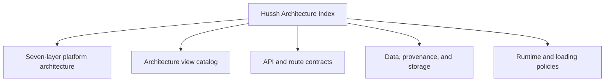

# Hussh Architecture Index

## Visual Map

Use this as the north-star entrypoint for the Hussh platform stack, its integration contracts, and the supporting runtime/data references.

The architecture docs use the founder-language dual-label contract defined in [founder-language-matrix.md](./founder-language-matrix.md): founder terms lead when describing system meaning, and implementation labels remain explicit when a reader needs route, token, package, or runtime precision.

Brand and compatibility rules live in [../operations/brand-and-compatibility-contract.md](../operations/brand-and-compatibility-contract.md).

## References

- [private-agent-north-star.md](./private-agent-north-star.md): **the single architectural source of truth for the Private Agent workstream.** Every other document here inherits it by pointer. Read it first; where an implementation diverges from it, the implementation moves.
- [architecture.md](./architecture.md): canonical seven-layer Hussh platform architecture, plus integration, deployment, and runtime sequence model.
- [mega-map.md](./mega-map.md): the Hussh Mega Map — one source-grounded picture of the whole platform, published as a living SVG. Generated by `hussh-mega-map.gen.py`, which prints the authoritative layer and flow counts on every run. (The count is deliberately not restated here: an earlier copy said "ten" while the generator defined thirteen flows, eleven public. A number a document does not state cannot go stale.)
- [architecture-view-catalog.md](./architecture-view-catalog.md): C4 + ISO 42010 architecture views for system landscape, context, containers, components, dynamic flows, deployment/network/physical topology, and data boundaries.
- [founder-language-matrix.md](./founder-language-matrix.md): canonical founder-term to implementation-term mapping and audit checklist.
- [api-contracts.md](./api-contracts.md): API surface and proxy/backend contracts.
- [preference-subscription-fabric.md](./preference-subscription-fabric.md): the Personal World Model (`/api/pwm`) and the PCHP RFC-002 Preference Subscription Fabric (`/api/fabric`) — grants, the pairing handshake, subscriber reads, and the hash-chained receipt ledger.
- [route-contracts.md](./route-contracts.md): app route inventory and parity governance.
- [runtime-topology-maintenance.md](./runtime-topology-maintenance.md): generated cross-contract index, maintenance profiles, compatibility lifecycle, and destructive-retirement boundary.
- [schema-migration-discipline.md](./schema-migration-discipline.md): expand/contract rules for Postgres schema changes — additive first, destructive last and alone, tested down paths.
- [../one/README.md](../one/README.md): current One-owned product contracts, including One Voice.
- [../one/one-agent-hierarchy.md](../one/one-agent-hierarchy.md): current One-led app agent hierarchy from product surface through A2A specialists, operons, services, and consent boundaries.
- [one-email-kyc.md](./one-email-kyc.md): current One-led KYC mailbox, consent, draft, send, and PKM writeback contract.
- [frontend-native-surface-map.md](./frontend-native-surface-map.md): generated route/API/native/plugin/voice mapper scaffold.
- [interaction-runtime.md](./interaction-runtime.md): shared React, One Voice, and Capacitor interaction-ordering contract.
- [loading-policy.md](./loading-policy.md): canonical loading and empty-state policy.
- [cache-coherence.md](./cache-coherence.md): cache invalidation and freshness model.
- [data-model-governance.md](./data-model-governance.md): maintainer SOP for schema, data classes, retention, deletion, and table-family changes.
- [runtime-db-fact-sheet.md](./runtime-db-fact-sheet.md): runtime storage facts and boundaries.
- [crd-scraping-api.md](./crd-scraping-api.md): CRD scraping and financial-verification provider contract behind the `/api/ria` facade.
- [one-location-agent.md](./one-location-agent.md): One Location agent v1 implementation contract.
- [pkm-storage-adr.md](./pkm-storage-adr.md): decision record for PKM storage shape.
- [runtime-db-data-plane-contract.json](./runtime-db-data-plane-contract.json): machine-readable table-family ownership, retention, deletion, and trust-boundary contract used by the data-model audit.
- [data-provenance-ledger.md](./data-provenance-ledger.md): provenance and audit data model.
- [pkm-cutover-runbook.md](./pkm-cutover-runbook.md): PKM cutover and compatibility rules.
