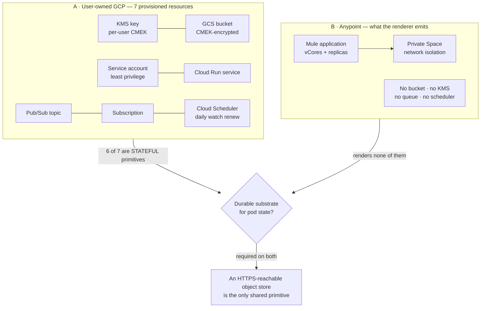

# Anypoint vs user-owned GCP — what each production path can and cannot do

**Dated 2026-08-06.** Both are production paths under
[the north star](./private-agent-north-star.md): **A** is the person's own GCP project with
their own Vertex ADC; **B** is Anypoint with their own AI key and user-controlled
infrastructure. The hussh-managed pod is the simulation tier and appears here only as the
reference implementation everything else is measured against.

**Stated once, up front:** neither column has production evidence. No pod has served a turn,
in any environment, for anyone. `AnypointBackend._execute` still raises when live.
`UserGcpBackend.provision` no longer does — it creates the pod through the same
`GcpRunClient` the managed tier uses, on a short-lived impersonated token — but it has not
yet run against a real user project, so "implemented" is the claim and "proven" is not.
This compares two designs, one of which is further along.

## What earns a pod, per path — the rule, and why it differs

`ai_connection_gate` holds the standing rule: **a working AI connection earns a pod; a
login never does.** That is unchanged. What it did not previously say is *which* connection
counts, and the answer is not the same on both paths — because they do not have the same
model access available. The rule now lives in
[`model_access_policy`](../../../consent-protocol/hushh_mcp/services/model_access_policy.py)
and the gate consults it, so provisioning and activation cannot drift apart.

| | Model access | What earns a pod | Activation mode |
|---|---|---|---|
| **Anypoint (B)** | The user's own key, per turn. CloudHub is not GCP: no metadata server, no ambient Google identity, and `AnypointBackend` renders `GOOGLE_GENAI_USE_VERTEXAI=false` deliberately. | A **verified BYOK connection** — a key that answered a real generation request. A managed-Vertex selection is **refused outright**, not deferred to a flag. | `byok_per_turn` |
| **BYO GCP (A)** | The user's own Vertex ADC, on the pod's service account in **their** project — their identity, their quota, their bill. BYOK also available. | Either a verified BYOK key, or **Vertex established in their project**: the API enabled and the pod SA holding `roles/aiplatform.user` (`byoc_vertex_preconditions`). Then the pod is provisioned and agents come up in `AGENT_ACTIVATION_ORDER`. | `user_adc` or `byok_per_turn` |
| **hushh-managed** | The fleet's shared ADC. | Same as BYO GCP, except the managed route additionally requires `pod_managed_model_enabled` — because the identity being borrowed is hushh's, not the user's. | `fleet_adc` |

Two consequences worth stating plainly, because both were wrong before:

* **The fleet flag does not govern BYOC.** `pod_managed_model_enabled` decides whether a pod
  may borrow *hushh's* identity. On BYO GCP the Vertex is the user's own, so tying the two
  together would let a hushh-side switch disable a capability the user owns outright.
* **Anypoint refuses managed on its own merits.** Previously the gate asked only
  "managed or BYOK?" and consulted that one flag, with no idea which backend the pod would
  run on. An Anypoint deployment with the flag on would have provisioned a pod onto a
  connection the platform can never serve — the exact failure the gate exists to prevent,
  one level further up.

**What "established" honestly means on BYOC.** A BYOK key proves itself by answering a real
generation request. Vertex ADC *inside a pod* cannot be proven that way before the pod
exists, so requiring it would be circular. The precondition check therefore verifies the two
conditions whose absence makes ADC impossible — API enabled, pod SA bound — and that is a
weaker claim than "a key answered". It is stated as such rather than dressed up as the same
thing. An unrecognised backend fails closed.

## Visual Map

## The headline: Anypoint has no viable durable substrate today

The commit log exists *because* of Anypoint. Its opening rationale is explicit: CloudHub 2.0
has **no managed database and no attachable volume** — replicas get ephemeral disk and can be
rescheduled — so any design needing a durable disk fails the mass tier outright, and *"the
one primitive every target shares is an HTTPS-reachable bucket."*

That premise is right. The implementation does not yet meet it, and all three candidate
substrates are ruled out by the repo itself:

| Candidate | Status on CloudHub | Why |
|---|---|---|
| `LocalObjectStore` | **unsuitable** | Scopes itself to *"one machine"* — CAS is an `flock` generation sidecar. A rescheduled replica is precisely not one machine. |
| `GcsObjectStore` | **no credential path** | Authenticates keylessly via the **GCE metadata server**. `anypoint_backend.py` states there is *"no ambient Google identity to borrow"* on CloudHub. |
| MuleSoft Object Store v2 | **explicitly ruled out** | The partner spec rejects it on size and TTL limits. |

**So: an object store is required. GCS specifically is not** — the `ObjectStore` Protocol is
four async methods with no GCS types, and already has two implementers with entirely
different mechanics. But the resolver hard-codes exactly two constructors and raises on
anything else, and the semantic constraint a third must satisfy is a **numeric-generation
CAS**. Nothing in the repo discusses whether an S3/Azure `ETag` conditional write maps onto
that. Anypoint needs either a third implementation or a credentialled GCS path, and that is
the single largest gap between the two production paths.

## Answering the backup and recovery question directly

**Is GCS required or recommended for agent state backup, memory recovery, disaster
recovery, pod restoration, and data recovery?**

*Required:* an object store, on both paths. It is the system of record; the SQLite index is
a rebuildable projection over it.
*Not required:* GCS specifically — but it is the only implementation that exists, so on
path A it is effectively the answer and on path B something must be built.

Before either path can claim a backup story, four things are true today and have to be said:

- **`backup()` stores a pointer, never bytes.** It appends one `storage_pointer` record
  naming a blob — ref, wrapping key id, algorithm, size. **Nothing anywhere writes the blob
  it points at.** It is a manifest, not a backup.
- **`NullPodStorage.backup` writes nothing and returns a success-shaped result** whose
  `status` field is the only thing distinguishing it from a real write. A caller that does
  not inspect that field cannot tell the inert default from a completed backup.
- **The whole durability stack is dark by configuration.** Neither renderer emits
  `POD_STORAGE_BACKEND`, `HUSSH_POD_LOG_KEY`, `HUSSH_POD_MEMORY_KEY` or
  `HUSSH_POD_PRIVATE_KEY`. On every deployed pod on **both** targets the key is ephemeral,
  memory is off, storage is Null, and the commit log is never constructed.
- **The BYOC bootstrap plans a per-user KMS key and CMEK bucket and never points
  `POD_STORAGE_GCS_BUCKET` at it.** Path A's substrate is designed and unconnected.

## Capability comparison

### Fully supported on Anypoint

Per-pod identity slots (`HUSSH_ID`, `HUSSH_SPACE_ID`, runtime and prompt pins, hub URL,
consent public keys), secret-by-reference via Mule `${secure::…}` placeholders, network
isolation through a Private Space, internal-only ingress, and BYOK model access — which the
renderer declares honestly as `GOOGLE_GENAI_USE_VERTEXAI="false"`, satisfied at runtime
rather than deploy time. Sizing shares one profile with GCP via `pod_vcores()`, so the two
cannot silently diverge again.

### Requires additional infrastructure on Anypoint

| Capability | Gap |
|---|---|
| **Durable state** | No bucket, no KMS, no object store. See the headline. |
| **Memory / RAM** | Not rendered **at all** — the descriptor states `vCores` only. |
| **Single-writer bound** | `replicas: 1` is a plain count, not the correctness-asserted `maxScale` the storage engine depends on. |
| **Health probing** | No startup probe of any kind. GCP pins an explicit HTTP `/health` probe precisely because a container binds its port before its workers boot. |
| **Liveness** | The handle carries no `livenessMode`; the heal path reads `project`, `region` and `url` from backend metadata and Anypoint sets none, so probe returns False and heal is skipped. |
| **Observability** | `K_SERVICE` is Cloud Run-injected. A `SERVICE_NAME` fallback exists and **neither renderer sets it**, so on CloudHub every pod would log as `consent-protocol` — collapsing the per-pod attribution alerts depend on. |
| **Alerting** | The fleet policy selects `metadata.user_labels."app"="hussh-one-pod"`. Anypoint renders labels as a flat **string list**, so nothing matches. |
| **Tracing** | The only exporter wired is Cloud Trace. |
| **Fleet ops** | `pod_fleet.py` is GCP-only. There is no Anypoint lister, probe adapter, or alert policy. |
| **Attestation** | `attestation_ref=None` — no Confidential Space equivalent. |
| **Lifecycle** | `provision`, `deprovision` and `get` all raise when live, pending Connected-App credentials and a written MuleSoft capacity confirmation. |

### Exclusive to user-owned GCP

The BYOC bootstrap provisions **seven** resources in the person's own project: a per-user
KMS key, a CMEK-encrypted GCS bucket, a least-privilege pod service account, the Cloud Run
service, a Pub/Sub topic, a subscription, and a Cloud Scheduler job that re-arms the Gmail
watch before its 7-day expiry.

**Six of the seven are stateful primitives.** Anypoint renders none of them, and the repo
names no CloudHub equivalent for any. That, more than any single missing field, is the
difference between the two paths.

Also GCP-only: Confidential Space attestation, scale-to-zero with a warm-floor option,
startup CPU boost, CPU-between-requests, and keyless workload identity federation — which is
what lets hussh be federated *in* without a service-account key ever leaving the person's
project.

### Trade-offs

**Anypoint's real advantages** are pre-purchased Titanium capacity — best cost at scale —
and a dedicated operations team. Its FedRAMP posture is Moderate.

**GCP's** is that everything the persistent-agent design needs already exists there and is
already designed: object storage with generation-based CAS, per-user CMEK, an event source
to wake a sleeping pod, and attestation. Its posture is FedRAMP High.

The honest summary: **Anypoint is the cheaper path for a stateless workload and the harder
path for a stateful one**, and the north star has made the agent stateful by definition.

## What the parity test does not cover

`REQUIRED_SLOTS` is **two entries long** — the hub URL and the consent public keys. There is
no memory, scale, probe, liveness, label or persistence parity. And `_extract_amc` reduces
only `properties`, `secureProperties` and `http.inbound`, so `vCores`, `replicas` and
`labels` are outside the comparison entirely.

The file already names the shape: *"a comparison cannot see what both sides get wrong."* It
learned that when GCP rendered 500m CPU and Anypoint rendered an independent `"0.1"` literal
— the same pod sized five times differently — and both sides passed a presence check.

**The forcing function is to add the persistence slots to `REQUIRED_SLOTS`.** The test goes
red until every backend answers, which is the cheapest way to make the gaps above
unskippable rather than merely documented.

## Mitigation, in dependency order

1. **Decide Anypoint's object store.** A third `ObjectStore` implementation over whatever
   the customer controls, or a credentialled GCS path. Nothing else on this list matters
   until state can persist.
2. **Render the persistence configuration** on both paths, and add those slots to
   `REQUIRED_SLOTS` so all backends must answer together.
3. **Point the BYOC bootstrap's bucket at `POD_STORAGE_GCS_BUCKET`.** Path A's substrate
   exists in the plan and is not connected to the pod.
4. **Set `SERVICE_NAME`** in both renderers so per-pod attribution survives off Cloud Run.
5. **Anypoint descriptor gaps** — memory, an asserted single-writer bound, a health probe,
   key/value labels.
6. **Anypoint lifecycle**, which is gated on an external dependency and should not start
   before the question below is answered.

## Open question that blocks any Anypoint work

`anypoint_backend.py` asserts *"The SAME image runs here as on Cloud Run."* CloudHub 2.0 runs
Mule applications; `Dockerfile.pod` bakes a gunicorn entrypoint, and the Anypoint descriptor
renders no `HUSSH_POD_MODE`. The parity test compares **descriptors**, not runtimes, so a
shared omission stays invisible. **Confirm what CloudHub actually executes before building
anything on path B.**

## Sources

- Verified reading of the compute backends, the pod storage and commit-log seam, the deploy renderers, the observability middleware and alert policies, and the backend parity test, 2026-08-06.
- Companion records: [the north star](./private-agent-north-star.md) and [the plan of record](./private-agent-one-plan-of-record.md) in this directory.
