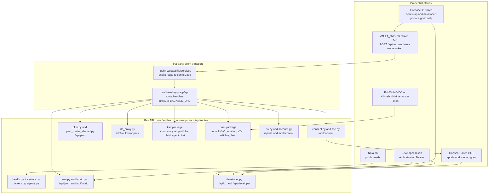

# API Contracts

> Complete endpoint reference, authentication model, and developer integration guide.

---

## Token Hierarchy

All data access is gated by consent tokens. Firebase auth is only used to bootstrap the initial VAULT_OWNER token.

Founder-language note:

- `Capability Tokens` are the architecture headline
- this file keeps the runtime labels `VAULT_OWNER`, `consent-token`, and `developer token` because readers need the exact wire contract
- `PCHP` maps here to the `/api/v1/request-consent`, `/api/v1/consent-status`, and `/api/v1/scoped-export` flow

```
Firebase Sign-In
      │
      ▼
POST /api/consent/vault-owner-token  (Firebase Bearer)
      │
      ▼
  VAULT_OWNER Token (24h)
      │
      ├── All vault/data operations
      ├── Agent operations
      └── Can delegate scoped tokens to MCP agents (7d)
```

| Token Type            | Purpose                            | Duration | Auth Format                    |
| --------------------- | ---------------------------------- | -------- | ------------------------------ |
| Firebase ID Token     | Identity verification only       | 1 hour   | `Bearer <firebase-id-token>`   |
| VAULT_OWNER Token     | Consent + identity for all data  | 24 hours | `Bearer <vault-owner-token>`   |
| Agent Scoped Token    | Delegated MCP agent access       | 7 days   | `Bearer <consent-token>`       |
| Developer Token       | External API and remote MCP access | N/A    | `Authorization: Bearer <developer-token>` only |

---

## Visual Map

Which credential plane authorizes which FastAPI route family, and how first-party
clients reach them through the Next.js proxy layer.



---

## Route Categories

### Public (No Auth)

| Method | Path | Description |
| ------ | ---- | ----------- |
| GET | `/health` | Detailed health check with agent list |
| GET | `/api/kai/health` | Kai subsystem health |
| GET | `/api/investors/search?q={name}` | Fuzzy search investors by name |
| GET | `/api/investors/{investor_id}` | Full investor profile by ID |
| GET | `/api/investors/cik/{cik}` | Investor profile by SEC CIK |
| GET | `/api/investors/stats` | Investor database statistics |
| GET | `/api/tickers/search?q={query}&limit={n}` | Public ticker search with enrichment metadata |
| GET | `/api/tickers/all` | Full ticker universe export with enrichment metadata |
| POST | `/api/validate-token` | Validate a consent token |
| GET | `/api/app-config/review-mode` | Review mode toggle (enabled only) |
| POST | `/api/app-config/review-mode/session` | Mint Firebase custom token for `REVIEWER_UID`; non-production smoke may use `REVIEWER_VAULT_PASSPHRASE` |

### Developer API (Developer Token / Developer API Enabled)

| Method | Path | Description |
| ------ | ---- | ----------- |
| GET | `/api/v1` | Developer API root summary (`410` when developer API disabled) |
| GET | `/api/v1/list-scopes` | Generic dynamic scope catalog (`410` when developer API disabled) |
| GET | `/api/v1/tool-catalog` | Public-beta or app-filtered tool visibility |
| GET | `/api/v1/user-scopes/{user_id}` | Discover materialized dynamic user scopes for one user; reserved empty PKM shapes are omitted (requires `Authorization: Bearer <developer-token>`) |
| GET | `/api/v1/consent-status` | Check app-scoped consent status by scope or request id |
| POST | `/api/v1/request-consent` | Create or reuse consent for one currently materialized/discovered `attr.*` scope or approved capability such as `cap.one.invoke`; empty dynamic scopes fail before pending/active reuse while static capabilities are unaffected (requires `Authorization: Bearer <developer-token>`) |
| POST | `/api/v1/public-profile-export` | Read an owner-published public-profile resource by opaque handle; records audit metadata and never returns raw PKM |
| POST | `/api/v1/scoped-export` | Fetch encrypted consent export metadata and ciphertext for an approved developer grant |

### Developer Portal (Firebase Sign-In / Self-Serve)

| Method | Path | Description |
| ------ | ---- | ----------- |
| GET | `/api/developer/access` | Read the self-serve developer workspace for the signed-in Kai account |
| POST | `/api/developer/access/enable` | Create the self-serve developer app and first active token |
| PATCH | `/api/developer/access/profile` | Update the app identity shown during Kai consent review |
| POST | `/api/developer/access/rotate-key` | Revoke the current developer token and issue a replacement |

### Debug (Dev Only)

| Method | Path | Description |
| ------ | ---- | ----------- |
| GET | `/debug/diagnostics` | Registered route diagnostics (returns `404` in production) |
| GET | `/debug/consent-listener` | Consent listener diagnostics (returns `404` in production) |
| GET | `/api/_debug/firebase` | Firebase debug endpoint (returns `404` in production) |

### Firebase Auth (Bootstrap)

| Method | Path | Description |
| ------ | ---- | ----------- |
| POST | `/api/consent/vault-owner-token` | Issue VAULT_OWNER token |
| POST | `/api/consent/vault-owner-token/device` | Issue a 15-minute device-bound VAULT_OWNER token after Firebase auth and a signed one-time device challenge |
| POST | `/api/account/trusted-device-authorizations` | Approve a UAT-flagged PKCE-bound Hermes installation for the signed-in account |
| POST | `/api/account/trusted-device-authorizations/exchange` | Consume a one-time PKCE code and return a Firebase custom token, registered device identity, and server-verified account email for local trusted-device display |
| GET | `/api/account/trusted-devices` | List signed-in account device metadata and revocation status |
| POST | `/api/account/trusted-devices/{device_id}/challenge` | Create a short-lived device proof-of-possession challenge |
| DELETE | `/api/account/trusted-devices/{device_id}` | Revoke the device and its device-bound owner capabilities |
| POST | `/api/notifications/register` | Register FCM push token |
| DELETE | `/api/notifications/unregister` | Unregister FCM tokens (logout) |
| POST | `/api/kai/consent/grant` | Grant consent for Kai scopes |

### One Runtime Configuration

| Method | Path | Auth | Description |
| ------ | ---- | ---- | ----------- |
| POST | `/api/one/runtime/gemini/validate` | Firebase Bearer | Run a bounded, non-persistent Gemini generation probe before encrypted BYOK storage; validates Google AI Studio or explicit Vertex project/location access and distinguishes invalid credentials, IAM, API-enablement, quota/rate-limit, billing, model, and temporary failures without logging or storing the credential |

`POST /db/vault/bootstrap-state` and `POST /db/vault/pre-vault-state` also
carry the strict non-secret `oneRuntimeSetupChoice` setup enum. It is limited to
managed Gemini or `byok_pending_vault`; a Gemini key is never accepted by this
pre-vault contract. A selected setup credential is process-memory-only: it may
be request-validated before the vault but is encrypted through the existing
vault-owner PKM mutation path only at Finish setup.

### One Email KYC

One mailbox intake is One-led and approval-gated. KYC workspace routes require
a VAULT_OWNER token plus a matching `user_id`; mailbox maintenance routes use
Pub/Sub OIDC or the One maintenance token, not user Firebase auth. Strict
client-side ZK means the backend never decrypts consent exports, never builds
review drafts, and never persists review draft plaintext. Dev/UAT One Email now
uses deterministic multi-scope disclosure intake: after resolving the vault owner,
the backend matches email intent against that user's consumer-visible dynamic
scope inventory, stores detected domains, candidate scopes, thread metadata,
hashes, and consent/writeback/send metadata only; the vault-unlocked client
confirms scopes and builds the final draft from approved encrypted exports. When
the user approves a reply, the client may submit both plain text and sanitized
HTML; Gmail send uses multipart/alternative while preserving the plain-text
fallback and original-thread reply headers. The
`agent_kyc.approved_disclosure_formatter.v1` contract owns the render model;
the vault-unlocked browser executes it against decrypted scoped exports. The
maintained architecture reference is [One Email KYC](./one-email-kyc.md).

Inbound user resolution uses exact verified sender evidence. The resolver binds
an actionable request only to the `From` sender when that sender matches a
verified Hussh identity or verified email alias. `To`, `Cc`, distribution-list,
and `Reply-To` recipients are reply-thread context only; they do not authorize a
request for a copied user. Apple private relay addresses are not inferred to
original emails; original addresses must be verified as aliases before they can
resolve intake.

Mailbox automation is explicit opt-in. The account-scoped backend preference is
the authority for clients and asynchronous intake; missing state is disabled.
The Pub/Sub `emailAddress` and the fetched message recipient headers must match
the configured canonical `one@hushh.ai` mailbox before the sender can be
resolved or a workflow can be created. Workflow insertion atomically rechecks
that opt-in remains enabled after classification. Webhook `accepted: true`
acknowledges Pub/Sub delivery; `handled: true` is returned only when at least
one eligible request actually creates or advances work.

| Method | Path | Auth | Description |
| ------ | ---- | ---- | ----------- |
| POST | `/api/one/email/webhook` | Pub/Sub OIDC | Receive Gmail Pub/Sub notifications for the delegated One mailbox |
| POST | `/api/one/email/watch/renew` | `X-Hushh-Maintenance-Token` | Renew the Gmail watch for the delegated One mailbox |
| POST | `/api/one/email/sync/recent` | VAULT_OWNER Bearer | Bounded catch-up scan of recent One mailbox messages, used by Email refresh when Pub/Sub delivery or history state lags |
| GET | `/api/one/kyc/preferences/automatic-response-preparation?user_id={user_id}` | VAULT_OWNER Bearer | Read the server-authoritative account preference; a missing row returns disabled |
| PATCH | `/api/one/kyc/preferences/automatic-response-preparation` | VAULT_OWNER Bearer | Explicitly enable or disable automatic processing of canonical One mailbox requests for the authenticated vault owner |
| GET | `/api/one/kyc/client-connector?user_id={user_id}` | VAULT_OWNER Bearer | Read registered public client connector metadata |
| POST | `/api/one/kyc/client-connector` | VAULT_OWNER Bearer | Register public client connector metadata after vault unlock; private key remains client/vault-only |
| GET | `/api/one/kyc/workflows?user_id={user_id}` | VAULT_OWNER Bearer | List One KYC workflows for the vault owner |
| GET | `/api/one/kyc/workflows/{workflow_id}?user_id={user_id}` | VAULT_OWNER Bearer | Read one workflow and metadata-only draft state for the vault owner |
| POST | `/api/one/kyc/workflows/{workflow_id}/scope-selection` | VAULT_OWNER Bearer | Confirm or narrow backend-detected candidate scopes before consent requests are created |
| POST | `/api/one/kyc/workflows/{workflow_id}/refresh` | VAULT_OWNER Bearer | Refresh workflow state after consent approval; returns encrypted export metadata for client-side draft generation |
| GET | `/api/one/kyc/workflows/{workflow_id}/consent-export?user_id={user_id}` | VAULT_OWNER Bearer | Return the encrypted wrapped-key export package for this ready workflow without exposing the consent token to the browser |
| GET | `/api/one/kyc/workflows/{workflow_id}/consent-exports?user_id={user_id}` | VAULT_OWNER Bearer | Return all selected encrypted wrapped-key export packages for multi-scope client-side draft generation |
| POST | `/api/one/kyc/workflows/{workflow_id}/send-approved-reply` | VAULT_OWNER Bearer | Transiently send the user-approved final email body as Gmail reply-all in the original thread; accepts required `approved_body` plain text and optional sanitized `approved_html` for multipart Gmail rendering; persist metadata/hashes and thread verification only |
| POST | `/api/one/kyc/workflows/{workflow_id}/writeback-complete` | VAULT_OWNER Bearer | Record encrypted PKM writeback status and artifact hash |
| POST | `/api/one/kyc/workflows/{workflow_id}/approve-draft` | VAULT_OWNER Bearer | Deprecated; returns gone because server-side draft approval is disabled |
| POST | `/api/one/kyc/workflows/{workflow_id}/reject-draft` | VAULT_OWNER Bearer | Reject and block the workflow |
| POST | `/api/one/kyc/workflows/{workflow_id}/redraft` | VAULT_OWNER Bearer | Record typed or voice-originated redraft instruction metadata; draft revision is client-local |
| POST | `/api/one/kyc/retention/purge` | `X-Hushh-Maintenance-Token` | Redact terminal workflow drafts after the retention window |

### One Location Agent

One Location Agent is One-owned live-location sharing for trusted people. The
authenticated route family is ciphertext-only for approved live-location reads.
Snapshot-backed public links are explicit, duration-bounded bearer links created
by the owner to show one captured public location directly. Request-only public
links without an owner-attached snapshot remain metadata-only and route the
workflow back to owner approval. Public links must not expose private grants,
ciphertext, movement trails, raw owner identity, or reverse-geocoded enrichment.
The maintained architecture reference is
[One Location Agent](./one-location-agent.md).

Save My Soul grants preserve the ordinary `location_share_created` notification
contract and add emergency presentation metadata when `share_kind=sos`:
`notification_profile=one_location_sms_emergency` and
`notification_category=ONE_LOCATION_SMS_EMERGENCY`. Clients must recognize the
explicit profile and retain `share_kind=sos` as a compatibility fallback.
Presentation is intentionally platform-specific: the visible web/native shell
uses the shared red alarm card, Android routes through the dedicated
`one_location_sms_emergency_v1` high-importance channel, and iOS background
delivery uses the matching category plus `one_location_sms_alarm.wav`. The
profile does not authorize Do Not Disturb bypass or Apple Critical Alerts.

The older KAI location route family is transitional prototype history and is
not the product owner for live location.

| Method | Path | Auth | Description |
| ------ | ---- | ---- | ----------- |
| GET | `/api/one/location/state` | VAULT_OWNER Bearer | List eligible recipients, named Circle summaries, incoming targeted Circle invitations, owner grants, received grants, pending requests, and referrals for the authenticated user |
| POST | `/api/one/location/sms-contacts` | VAULT_OWNER Bearer | Idempotently add an active, location-ready connection or named-Circle co-member to the authenticated owner's Save My Soul contacts; Circle eligibility and selection are committed under the same membership locks |
| DELETE | `/api/one/location/sms-contacts/{recipient_user_id}` | VAULT_OWNER Bearer | Idempotently remove one owner-scoped Save My Soul contact without changing the underlying connection |
| GET | `/api/one/location/recipients` | VAULT_OWNER Bearer | List active connections and active named-Circle co-members excluding self, with masked labels and public-key readiness only |
| POST | `/api/one/location/recipient-keys` | VAULT_OWNER Bearer | Register/rotate the authenticated user's recipient public key under the recipient-key transaction lock; private key remains device-local, a key id cannot be rebound to different material, and active grants bound to replaced keys are revoked atomically |
| POST | `/api/one/location/maps/autocomplete` | VAULT_OWNER Bearer | Search provider places for explicit owner-entered fallback text, optionally biased to the current request-only point; results are not persisted |
| POST | `/api/one/location/maps/nearby-places` | VAULT_OWNER Bearer | Return at most 20 operational, de-duplicated Google places inside the fixed 500 m check-in area, with structured name/address/category metadata and server-verified distance ordering. Provider coordinates are used only for server-side radius validation and are not returned. Optional category filters query the same boundary without fan-out; the one-shot point and results are not persisted |
| POST | `/api/one/location/maps/place-details` | VAULT_OWNER Bearer | Resolve one selected provider place in request memory; place details are not persisted by the Maps route |
| POST | `/api/one/location/maps/reverse-geocode` | VAULT_OWNER Bearer | Transiently resolve captured coordinates to display copy and an ISO alpha-2 `countryCode`; the service does not persist coordinates or reverse-geocoded output |
| POST | `/api/one/location/nearby-presence/check-in` | VAULT_OWNER Bearer | Non-production simulation only: capture one fresh foreground point, verify the owner is plausibly at the selected public place (within 500 m, widened by reported accuracy up to a 2 km cap), then persist only that **place's** coordinates as short-lived authenticated ciphertext plus an opaque candidate token, and publish presence for 30, 60, or 120 minutes; the captured point and its accuracy are never persisted; fixed radius 500 m, Connect requests default off |
| GET | `/api/one/location/nearby-presence` | VAULT_OWNER Bearer | Non-production simulation only: return the caller's active posture and one stable maximum-20 projection of mutually active check-ins whose independently selected places are at most 500 m apart; never returns peer coordinates, place, distance, contact details, or stable user ids; response is `private, no-store` |
| DELETE | `/api/one/location/nearby-presence` | VAULT_OWNER Bearer | Idempotently check the caller out, clear encrypted anchor/index material immediately, and remove them from discovery; available even when discovery is disabled |
| POST | `/api/one/location/nearby-presence/connection-request` | VAULT_OWNER Bearer | Non-production simulation only: resolve a rotating alias supplied in the JSON body, revalidate both active presence versions and exact radius, then create only the canonical pending Connect request if the target still opts in |
| POST | `/api/one/location/public-invites` | VAULT_OWNER Bearer | Create a duration-bounded public request link; the raw token is returned once and only its hash is stored |
| GET | `/api/one/location/public-invites/{public_token}` | Public | Resolve safe owner label, status, duration, expiry, and the attached `publicLocation` snapshot when the owner created a public location link |
| POST | `/api/one/location/public-invites/{public_token}/submit` | Public | Legacy/request-only visitor intake; submit visitor name, phone, and optional message as metadata-only request intent for links without public location snapshots |
| DELETE | `/api/one/location/public-invites/{invite_id}` | VAULT_OWNER Bearer | Revoke an active public request link |
| POST | `/api/one/location/circle-invites` | VAULT_OWNER Bearer | Create a hash-only Invite to One link; claiming never grants live location access directly |
| GET | `/api/one/location/circle-invites/{public_token}` | Public | Resolve safe owner label, status, duration, expiry, and optional owner message for an Invite to One link |
| POST | `/api/one/location/circle-invites/{public_token}/claim` | VAULT_OWNER Bearer | Claim an Invite to One link after sign-in, phone verification, and vault unlock; creates a one-way trusted edge in `trusted_connections` (claimer→inviter) so SOS and check-in have recipients |
| DELETE | `/api/one/location/circle-invites/{invite_id}` | VAULT_OWNER Bearer | Revoke an active Invite to One link |
| GET | `/api/one/location/circles` | VAULT_OWNER Bearer | List the authenticated user's active named Circles and membership role |
| POST | `/api/one/location/circles` | VAULT_OWNER Bearer | Create a bounded named Circle and its owner membership atomically |
| GET | `/api/one/location/circles/{circle_id}` | VAULT_OWNER Bearer | Return Circle metadata, viewer capabilities, the safe active-member roster, and the current shared invite code to an active member under `Cache-Control: private, no-store`; recipient public keys support explicit Circle expansion, while no private key, coordinates, grant, or SMS authority is returned |
| PATCH | `/api/one/location/circles/{circle_id}` | VAULT_OWNER Bearer | Owner-only rename/type update |
| DELETE | `/api/one/location/circles/{circle_id}` | VAULT_OWNER Bearer | Owner-only soft delete; cancels pending targeted invitations and revokes the active code, Circle connection origins, and Circle-sourced grants while preserving other connection origins |
| POST | `/api/one/location/circles/{circle_id}/invite-code` | VAULT_OWNER Bearer | Active-member idempotent ensure/read of the shared reusable 72-hour code; `?rotate=true` is authorized only by canonical `circle.owner_user_id`, responses are `private, no-store`, and only a keyed HMAC digest plus derivation metadata is persisted. An unreadable legacy active code returns `LOCATION_CIRCLE_CODE_ROTATION_REQUIRED` until the owner explicitly rotates it |
| DELETE | `/api/one/location/circles/{circle_id}/invite-code` | VAULT_OWNER Bearer | Owner-only revoke of the active code |
| GET | `/api/one/location/circles/{circle_id}/eligible-connections` | VAULT_OWNER Bearer | Active-member list of that caller's own active `direct_request` connections who are not active Circle members or covered by a pending invitation. Owner-removed users are offered only to the canonical Circle owner; `remainingCapacity` is bounded by both Circle capacity and the caller's pending-invitation quota |
| POST | `/api/one/location/circle-member-invites` | VAULT_OWNER Bearer | Active-member batch create or idempotent reuse of targeted, expiring invitations for the caller's selected direct connections; actor identity comes only from the token. Non-owners may hold at most five pending invitations, terminal invitees have a 12-hour Circle-wide cooldown aligned with terminal-record retention, and only the canonical owner may re-invite an owner-removed user. Creation grants no membership, location, SMS, trusted edge, or capability |
| GET | `/api/one/location/circle-member-invites` | VAULT_OWNER Bearer | List the authenticated user's incoming invitations or outgoing invitations authored by that member; Circle owners may also see outgoing invitations for moderation |
| POST | `/api/one/location/circle-member-invites/{invite_id}/accept` | VAULT_OWNER Bearer | Invitee-only acceptance after Circle-first locking and revalidation that the actual inviter remains an active Circle member and their direct connection remains active; only an owner-authored invitation may restore an owner-removed membership. Acceptance atomically joins and creates source-aware connection origins without location/SMS/trusted authorization |
| POST | `/api/one/location/circle-member-invites/{invite_id}/decline` | VAULT_OWNER Bearer | Invitee-only decline of a pending targeted Circle invitation |
| DELETE | `/api/one/location/circle-member-invites/{invite_id}` | VAULT_OWNER Bearer | Circle owner/inviter cancellation of a pending targeted Circle invitation |
| POST | `/api/one/location/circle-codes/resolve` | VAULT_OWNER Bearer | Resolve safe Circle preview metadata for a bounded human-entered code |
| POST | `/api/one/location/circle-codes/join` | VAULT_OWNER Bearer | Treat the signed-in user's confirmed Join action as membership consent; atomically joins and creates source-aware canonical connection origins with active members, but no trusted edge, SMS selection, location grant, envelope, or capability token |
| DELETE | `/api/one/location/circles/{circle_id}/members/me` | VAULT_OWNER Bearer | Leave a member role, revoke the shared bearer code and that member's pending authored invitations, revoke matching Circle origins/grants, and preserve direct and other-Circle origins |
| DELETE | `/api/one/location/circles/{circle_id}/members/{member_user_id}` | VAULT_OWNER Bearer | Owner-only member removal with the same shared-code, authored-invitation, source-aware connection, grant, and SMS cleanup |
| POST | `/api/one/location/grants` | VAULT_OWNER Bearer | Create a duration-bounded owner-approved grant for one eligible recipient identity/key; Circle eligibility, grant replacement, and its audit event commit atomically, and Circle-only eligibility always persists exact `sourceCircleId` provenance |
| POST | `/api/one/location/grants/with-envelope` | VAULT_OWNER Bearer | Idempotently create/replace one owner-approved grant and persist its first recipient-encrypted envelope in one locked database transaction; serializes against recipient-key rotation, requires the reviewed-point confirmation timestamp, stores only the fixed `check_in` reason code for Check-In shares, and emits the metadata-only share notification only after durable success |
| POST | `/api/one/location/grants/{grant_id}/envelopes` | VAULT_OWNER Bearer | Store the owner-device encrypted latest-location envelope; backend receives ciphertext and metadata only. Save My Soul notifies from this route rather than at grant creation, so for that share kind the response also carries `recipientAlerted`: whether the recipient had a device the alert could be delivered to. It is reachability, not FCM's eventual delivery result, and is absent for every other share kind — an absent field means "not reported" and must never be rendered as a delivery failure |
| GET | `/api/one/location/grants/{grant_id}/envelope` | VAULT_OWNER Bearer | Return ciphertext only to the exact approved recipient while grant is active |
| DELETE | `/api/one/location/grants/{grant_id}` | VAULT_OWNER Bearer | Revoke an active owner grant immediately |
| POST | `/api/one/location/requests` | VAULT_OWNER Bearer | Create metadata-only request for owner approval |
| POST | `/api/one/location/requests/{request_id}/approve` | VAULT_OWNER Bearer | Owner approves request and creates a fresh recipient grant |
| POST | `/api/one/location/requests/{request_id}/deny` | VAULT_OWNER Bearer | Owner denies pending request |
| POST | `/api/one/location/grants/{grant_id}/refer` | VAULT_OWNER Bearer | Recipient refers another verified user into a request flow; no access is forwarded |
| POST | `/api/one/location/retention/purge?older_than_hours=12` | `X-Hushh-Maintenance-Token` backed by dedicated `ONE_LOCATION_RETENTION_TOKEN` | Scrub due nearby-presence anchor material, then delete terminal expired/revoked location grants, nearby-presence metadata, ciphertext envelopes, terminal requests, referrals, public request-link submissions, Invite to One links, expired/revoked named-Circle codes, terminal targeted Circle-member invitations, and related events after the retention window; the hourly hosted scheduler is a release prerequisite |

### Agent One invocation preview (not official A2A v1)

Agent One currently exposes a contained Hussh invocation-preview contract at
`/api/one/a2a/card` and `/api/one/a2a/message`. It intentionally does not publish
`/.well-known/agent-card.json`, `supportedInterfaces`, a protocol version, or
official Task semantics. Official A2A v1 remains release-blocked because the
pinned ADK 2.4 dependency range is incompatible with `a2a-sdk` 1.x. The preview
must not expose internal routing targets. It has two paths:

1. With `X-Consent-Token`, the caller must also authenticate as the developer
   app with `Authorization: Bearer <developer-token>`; the consent token is
   DB-validated for `cap.one.invoke`, must belong to that same app, and
   the route derives `userId` from the signed token. Any mismatched body
   `userId`, `email`, or `phoneNumber` is rejected before Agent One runs.
2. Without `X-Consent-Token`, an authenticated developer caller can create or
   check a pending `cap.one.invoke` consent request for a resolved
   `userId`, `email`, or `phoneNumber`. This path does not execute Agent One
   and does not return a consent token.

`cap.one.invoke` can only create or resume the relationship. Downstream private
data and actions require exact attenuated authority and otherwise return an
auth-required response.

| Method | Path | Auth | Description |
| ------ | ---- | ---- | ----------- |
| GET | `/api/one/a2a/card` | Public metadata | Return the contained Hussh invocation-preview metadata and its release blocker |
| POST | `/api/one/a2a/message` | Developer bearer token plus `X-Consent-Token` scoped `cap.one.invoke` | Frame or resume an Agent One request; exact downstream authority remains mandatory |
| POST | `/api/one/a2a/message` | Developer `Authorization: Bearer <token>` | Create or report pending invocation consent for a resolved user; returns consent request metadata only |

### VAULT_OWNER (Consent-Gated)

#### Consent Management

| Method | Path | Description |
| ------ | ---- | ----------- |
| GET | `/api/consent/pending` | List pending consent requests |
| GET | `/api/consent/pending/lookup` | Resolve specific pending consent requests by canonical `request_id` for cross-linked product surfaces |
| POST | `/api/consent/pending/approve` | Approve consent (zero-knowledge export) |
| POST | `/api/consent/pending/deny` | Deny consent request |
| POST | `/api/consent/cancel` | Cancel pending request |
| POST | `/api/consent/revoke` | Revoke active consent |
| GET | `/api/consent/history` | Paginated consent audit history |
| GET | `/api/consent/active` | Active (non-expired) tokens |

#### RIA And Relationship Sharing

| Method | Path | Description |
| ------ | ---- | ----------- |
| GET | `/api/ria/clients` | Advisor-facing list limited to investors with an active explicit RIA capability |
| GET | `/api/ria/clients/{investor_user_id}` | Advisor-facing relationship detail, including explicit scoped grants |
| GET | `/api/ria/workspace/{investor_user_id}` | Advisor workspace over investor-consented data plus relationship-share status |
| GET | `/api/ria/picks` | Read the signed-in advisor's encrypted-PKM-backed Picks bootstrap; legacy uploads are intentionally unavailable |
| POST | `/api/ria/picks` | Sync an already encrypted `ria.advisor_package` projection to currently authorized explicit Picks share artifacts |
| GET | `/api/kai/market/insights/{user_id}` | Investor market home payload with rights-gated `pick_sources[]` and RIA feed share metadata |
| GET | `/api/one/connections/directory` | Paginated, privacy-filtered Connect directory; display-name search only, with masked email/phone labels when available so same-name candidates remain distinguishable without exposing raw identifiers |
| GET | `/api/one/connections/{counterpart_user_id}/scope-catalog` | Server-authorized metadata and opaque handles available for a bilateral proposal |
| POST | `/api/one/connections/requests` | Create a connection request with `requested_scope_handles[]` and `offered_scope_handles[]` |
| POST | `/api/one/connections/requests/{request_id}/cancel` | Requester cancels a pending connection request and its pending proposals |
| GET | `/api/one/connections/requests/{request_id}/scopes` | Participant-visible scope statuses and immutable proposal history |
| POST | `/api/one/connections/requests/{request_id}/accept` | Accept with separate selected requested/offered opaque handles |

RIA relationship bundle note:

- investor private information -> RIA stays on explicit scope consent
- RIA active picks feed -> investor is the reserved bilateral capability (`ria_active_picks_feed_v1`)
- connection acceptance is social only; it grants no information access
- advisor picks require a current proposal, active relationship-share grant, and active share artifact with matching lineage
- legacy RIA Picks uploads were product-authorized clean-start retirement; they have no read, migration, fallback, or access route

#### Personal Knowledge Model

| Method | Path | Description |
| ------ | ---- | ----------- |
| POST | `/api/pkm/store-domain` | Store encrypted PKM domain data + update index; accepts optional non-sensitive `write_projections[]` for derived read models such as decision history |
| GET | `/api/pkm/data/{user_id}` | Get full encrypted PKM payload |
| GET | `/api/pkm/domain-data/{user_id}/{domain}` | Get encrypted PKM domain data |
| DELETE | `/api/pkm/domain-data/{user_id}/{domain}` | Compatibility deletion path for existing first-party callers |
| POST | `/api/pkm/delete-domain` | Delete a PKM domain with an owner-confirmed `PkmMutationPlanV2`, current sharing-impact check, and expected content revision |
| GET | `/api/pkm/device-sync/{user_id}` | List metadata-only upsert/delete events after a monotonic cursor; trusted devices fetch ciphertext through the domain snapshot contract |
| GET | `/api/pkm/metadata/{user_id}` | Get PKM metadata for UI |
| POST | `/api/pkm/domains/{domain}/scope-exposure` | Set a top-level PKM section posture: private or consent-required |
| POST | `/api/pkm/domains/{domain}/public-profile-projection` | Vault-owner publishes a client-generated public-profile projection independent of encrypted consent posture |
| GET | `/api/pkm/domains/{domain}/public-profile-projections?user_id={user_id}` | Vault-owner lists active public-profile handles and metadata only; never projection payloads |
| DELETE | `/api/pkm/domains/{domain}/public-profile-projection` | Vault-owner revokes one exact public-profile handle |
| GET | `/api/pkm/upgrade/status/{user_id}` | Get generic PKM upgrade status + resumable run metadata |
| POST | `/api/pkm/upgrade/start-or-resume` | Start or resume a client-side PKM upgrade run |
| POST | `/api/pkm/upgrade/runs/{run_id}/status` | Update run-level PKM upgrade status |
| POST | `/api/pkm/upgrade/runs/{run_id}/steps/{domain}` | Update per-domain PKM upgrade checkpoint |
| POST | `/api/pkm/upgrade/runs/{run_id}/complete` | Mark a PKM upgrade run completed |
| POST | `/api/pkm/upgrade/runs/{run_id}/fail` | Mark a PKM upgrade run failed |
| GET | `/api/pkm/scopes/{user_id}` | Get available PKM scope handles for the user |
| POST | `/api/pkm/get-context` | Get user context for analysis |

#### Connected Systems

Connected Systems are registry-driven. Safe registry listing is signed-in;
schema, binding, and record operations are vault-owner authenticated. Every
active CRM declares one primary object, enabled operation names, direct
Streamable HTTP MCP tool/endpoint mappings, timeout/retry policy, and a
validated non-secret response contract per operation. Cloud Run reaches
MuleSoft Managed Omni Gateway, which owns the CloudHub Private Space network
boundary; no Hussh GCP VPC connector or ResourceLink transport belongs to this
integration.

The schema response is normalized from its registered object and field paths
into `objectMetadata` and `fields[]` descriptors with `name`, `label`,
`dataType`, `required`, `readable`, `identityField`, `immutable`,
`createable`, `updateable`, derived `writable`, and portable constraints such
as `allowedValues` and `maxLength`. A missing operation response mapping fails
closed. Field access flags are optional refinements: an explicit `false` is
enforced, while an absent flag does not create a separate authorization gate.
List responses expose only the exact active row's capabilities; schema
responses expose `schemaStatus`, `schemaFingerprint`, freshness, refresh
guidance, and `effectiveActions`. The UI cannot expose a record action that
those effective capabilities do not authorize.

Read and search requests use generic `searchFields` and `returnFields` and
return only normalized, requested, explicitly readable fields. Create and
update use `recordFields`; email, phone, name, and `additionalFields` remain
Macy's compatibility aliases only and are routed through the same schema
validation. Create, update, and delete are auditable, idempotently approved
intents. Only intent approval issues the registered direct MCP mutation.

`crm-encrypted-fields.v1` is the sole default-off external CRM encrypted
profile. It is sandbox/UAT-gated and uses X25519, direct SHA-256 of the shared
secret, and AES-256-GCM without AAD. It encrypts bound read responses and
reviewed update `additionalFields`; Hussh relies on owner authentication,
server-side binding, schema allowlists, intent approval, and authenticated
gateway transport. It must not be described as independent cryptographic
authorization, replay-proof, or production-ready.

A successful exact-bound-id read with a valid registered response contract and
an empty record collection returns `bindingStatus=remote_record_missing`.
Malformed responses and transport, authorization, timeout, or MCP tool failures
never enter that state. The active binding remains in place until the owner
confirms local unlink; unlink transitions only the local pointer to
`disconnected`, preserves intent/audit history, and never calls the remote
delete operation. New record preparation and approval both fail while another
active binding exists.

| Method | Path | Description |
| ------ | ---- | ----------- |
| GET | `/api/connected-systems` | List active registry systems with `registryRevision` and per-system `configurationRevision`; signed-in metadata only |
| GET | `/api/connected-systems/{system_id}/schema?objectType={primary_object}&forceRefresh=false` | Return the normalized schema catalogue, fingerprint, freshness, refresh guidance, and exact `effectiveActions` |
| GET | `/api/connected-systems/record-bindings` | Return owner-scoped binding statuses for every active CRM in one request; no CRM record IDs or values |
| GET | `/api/connected-systems/{system_id}/record-binding?objectType=Contact` | Return the current One user binding for this external CRM record, or `unbound` |
| DELETE | `/api/connected-systems/{system_id}/record-binding?objectType=Contact` | Idempotently disconnect the authenticated owner's current local binding; the request accepts no record ID and does not delete the remote CRM record |
| POST | `/api/connected-systems/{system_id}/records/read` | Read the exact owner-bound record using `{ objectType, returnFields }`; returns a sanitized normalized projection or explicit `remote_record_missing` recovery state |
| POST | `/api/connected-systems/{system_id}/records/search` | Search and bind the One user when the registered record id mapping resolves a record |
| POST | `/api/connected-systems/{system_id}/records/create-intents` | Create a pending schema-validated `{ objectType, recordFields }` intent |
| POST | `/api/connected-systems/{system_id}/records/update-intents` | Create a pending schema-validated `{ objectType, id, recordFields }` intent; verified create/search mapping fields are binding keys and cannot be updated |
| POST | `/api/connected-systems/{system_id}/records/delete` | Compatibility path that creates a reviewable delete intent; it never deletes immediately |
| POST | `/api/connected-systems/{system_id}/intents/{intent_id}/approve` | Idempotently approve and execute a pending mutation through its registered MCP tool |
| POST | `/api/connected-systems/{system_id}/intents/{intent_id}/reject` | Reject a pending intent without calling MCP |
| GET | `/api/connected-systems/{system_id}/encrypted-fields/config` | Return the registry-pinned sandbox recipient key for `crm-encrypted-fields.v1`; never accepts a request-supplied key or connector configuration |
| POST | `/api/connected-systems/{system_id}/records/read-encrypted` | Relay a bound encrypted read using `{ objectType, returnFields, encryptedFields }`; Hussh supplies the existing record binding and returns opaque fields for browser-memory decryption |
| POST | `/api/connected-systems/{system_id}/records/update-intents-encrypted` | Create a ciphertext-only pending update intent from `{ objectType, fieldNames, encryptedFields }`; no record ID or field value is browser-controlled plaintext |
| POST | `/api/connected-systems/{system_id}/intents/{intent_id}/approve-encrypted` | Execute the already-reviewed opaque update once through Hussh's authenticated, idempotent approval lifecycle; accepts no approval proof body and returns a metadata-only acknowledgement |

Registry activation is not an API. Operators use the local, ignored
`crm-registry.v1` descriptor with
`scripts/ops/configure_crm_registry.py check|probe|apply|deactivate`. A CRM is
activated only after its declared MCP tools and operation response contracts
pass; CRUD descriptors additionally pass an isolated create/read/update/read/
delete/absent lifecycle with cleanup.

#### Kai Chat

| Method | Path | Description |
| ------ | ---- | ----------- |
| POST | `/api/kai/chat` | Conversational Kai endpoint |
| POST | `/api/kai/agent/chat/stream` | Gemini-backed Agent text chat SSE stream; emits `token` plus live `tool_start` / `tool_waiting` / `tool_result` events and stores encrypted text history only |
| GET | `/api/kai/agent/chat/conversations/{user_id}` | List recent encrypted Agent chat conversations for the vault owner |
| PATCH | `/api/kai/agent/chat/conversations/{conversation_id}` | Rename an authenticated vault owner's encrypted Agent chat conversation |
| DELETE | `/api/kai/agent/chat/conversations/{conversation_id}` | Delete an authenticated vault owner's Agent chat conversation and its encrypted messages |
| GET | `/api/kai/agent/chat/history/{conversation_id}` | Read decrypted Agent chat history for the authenticated conversation owner |
| POST | `/api/one/adk/relay-session` | Mint a short-lived opaque One ADK live relay ticket over HTTPS so Firebase bearer tokens are not placed in WebSocket URLs |
| WS | `/api/one/adk/live` | One ADK live relay WebSocket; bridges the browser wire envelope onto `Runner.run_live` (the only full-duplex voice transport) |
| GET | `/api/kai/chat/history/{conversation_id}` | Conversation history |
| GET | `/api/kai/chat/conversations/{user_id}` | List all conversations |
| GET | `/api/kai/chat/initial-state/{user_id}` | Initial chat state |
| POST | `/api/kai/chat/analyze-loser` | Analyze a specific loser |

#### One Voice

There is no `/api/one/voice/*` router. The product-facing voice wrapper described
in earlier plans was never registered: `consent-protocol/api/routes/one/` has no
`voice.py`, and no `/api/one/voice/...` path exists in the codebase.

The real full-duplex voice transport is the ADK live pair in
`consent-protocol/api/routes/one/adk_live.py`, listed under Kai Chat below:

| Method | Path | Description |
| ------ | ---- | ----------- |
| POST | `/api/one/adk/relay-session` | Mints a single-use relay ticket over HTTPS |
| WS | `/api/one/adk/live` | Consumes that ticket once and carries the live session |

#### Kai Portfolio

| Method | Path | Description |
| ------ | ---- | ----------- |
| POST | `/api/kai/portfolio/import` | Import brokerage statement (CSV/PDF) |
| POST | `/api/kai/portfolio/import/stream` | Streaming import with deterministic Gemini extraction, thought telemetry, and strict quality-gate aborts |
| GET | `/api/kai/portfolio/summary/{user_id}` | Portfolio summary from PKM discovery metadata |
| GET | `/api/kai/dashboard/profile-picks/{user_id}` | Real profile-based picks for dashboard cards (`symbols`, `limit`) |
| POST | `/api/kai/portfolio/analyze-losers` | Analyze losers vs Renaissance |
| POST | `/api/kai/portfolio/analyze-losers/stream` | Streaming losers analysis (SSE, deterministic config, cash-excluded investable universe) |

#### Kai Plaid Brokerage Connectivity

Plaid is the read-only brokerage connectivity layer for Kai. It supports Link/OAuth, holdings, investment transactions, refresh, and connection health. It does not place trades.

| Method | Path | Description |
| ------ | ---- | ----------- |
| GET | `/api/kai/plaid/status/{user_id}` | Load Plaid aggregate status, active source, items, holdings, and transactions summary |
| POST | `/api/kai/plaid/link-token` | Create a new Plaid Link token for investment connectivity |
| POST | `/api/kai/plaid/link-token/update` | Create an update-mode Plaid Link token for reconnect/add-account flows |
| POST | `/api/kai/plaid/oauth/resume` | Resume a web OAuth Link flow using an active opaque resume session |
| POST | `/api/kai/plaid/exchange-public-token` | Exchange Plaid `public_token`, sync holdings + investment transactions, and aggregate the read-only source |
| POST | `/api/kai/plaid/refresh` | Start a manual refresh run for one or more connected Plaid Items |
| GET | `/api/kai/plaid/refresh/{run_id}` | Inspect a Plaid refresh run status |
| POST | `/api/kai/plaid/source` | Persist the active Kai portfolio source (`statement`, `plaid`) |
| POST | `/api/kai/plaid/webhook` | Receive Plaid webhook updates for holdings refresh and item health |

Operational note:

- webhook URLs are supplied to Plaid during Link token creation via backend configuration, not dashboard allowlisting
- if `PLAID_WEBHOOK_URL` changes after Items exist, existing Items need a one-time `/item/webhook/update` maintenance pass

#### Kai Support Messaging

| Method | Path | Description |
| ------ | ---- | ----------- |
| POST | `/api/kai/support/message` | Send a profile-originated bug report, support request, or developer reachout through the Gmail-backed support inbox |

#### Kai Analysis

| Method | Path | Description |
| ------ | ---- | ----------- |
| POST | `/api/kai/analyze` | 3-agent investment analysis |
| GET | `/api/kai/analyze/stream` | SSE streaming debate analysis |
| POST | `/api/kai/analyze/stream` | SSE streaming with context body |
| POST | `/api/analysis/analyze` | Deep fundamental analysis |

#### Kai Market Home

| Method | Path | Description |
| ------ | ---- | ----------- |
| GET | `/api/kai/market/insights/{user_id}` | Token-gated market home payload (cache-backed, provider-fallback aware) |

#### Kai Decisions

| Method | Path | Description |
| ------ | ---- | ----------- |
| GET | `/api/kai/decisions/{user_id}` | Decision history from PKM `decision_projection` events with summary fallback only for legacy users |

#### Kai Personalization

Kai personalization no longer uses dedicated `/api/kai/preferences/*` endpoints.
Optional intro fields are persisted in encrypted PKM path `financial.profile`.
Frontend reads/writes these fields through the centralized onboarding/profile flows that call PKM APIs.

#### Account & Sync

| Method | Path | Description |
| ------ | ---- | ----------- |
| POST | `/api/account/identity/refresh` | Refresh backend identity shadow from Firebase Auth |
| POST | `/api/account/phone/claim` | Persist a secondary Firebase phone-session token as the signed-in actor's verified app-level phone claim, then delete the safe phone-only secondary Firebase user when it differs from the signed-in UID |
| GET | `/api/account/email-aliases` | List vault-owner account email aliases |
| POST | `/api/account/email-aliases/verification/start` | Start explicit email alias verification; dev/UAT review mode may echo the code |
| POST | `/api/account/email-aliases/verification/confirm` | Confirm an email alias before it can match One Email KYC intake |
| DELETE | `/api/account/delete` | Delete user account and all data; full-account deletion also removes the primary Firebase Auth UID and any safe phone-only orphan UID for the verified phone |

Reserved future surface:

- broker execution will live under a separate `/api/kai/brokers/*` or `/api/kai/execution/*` family
- no live-trading routes exist today
- trade execution will require distinct consent scopes, approval, and audit logging

#### Vault Key Metadata (Setup/Get)

Vault setup/get now use a multi-wrapper `VaultState` contract:
- `vaultKeyHash`
- `primaryMethod`
- `recoveryEncryptedVaultKey`
- `recoverySalt`
- `recoveryIv`
- `wrappers[]` with:
  - `method`
  - `encryptedVaultKey`
  - `salt`
  - `iv`
  - `passkeyCredentialId` (nullable)
  - `passkeyPrfSalt` (nullable)
  - `passkeyRpId` (nullable)
  - `passkeyProvider` (nullable)
  - `passkeyDeviceLabel` (nullable, friendly label captured at enrollment when available)
  - `passkeyLastUsedAt` (nullable)

Method-management semantics:
- Passphrase wrapper is mandatory for every vault.
- Recovery wrapper is mandatory for every vault.
- Optional quick methods (native biometric/web PRF passkey) add wrappers for the same DEK.
- Primary method only controls default unlock UX; fallback wrappers remain valid.
- Wrapper deletion is a vault-key-verified mutation: `POST /db/vault/wrapper/delete` requires `vaultKeyHash`, refuses passphrase removal, and moves primary unlock to an enrolled fallback when the removed wrapper was primary.
- Additional endpoints: `POST /db/vault/wrapper/upsert`, `POST /db/vault/wrapper/delete`, `POST /db/vault/primary/set`.

Security invariant:
- No plaintext-at-rest path is allowed.
- PKM encryption/decryption always uses the same DEK regardless of unlock method.
- Generic PKM upgrades remain client-side after unlock; the backend only stores resumable run metadata and ciphertext.
| POST | `/api/sync/vault` | Disabled in regulated cutover (`501`, `SYNC_DISABLED`) |
| POST | `/api/sync/batch` | Disabled in regulated cutover (`501`, `SYNC_DISABLED`) |
| GET | `/api/sync/pull` | Disabled in regulated cutover (`501`, `SYNC_DISABLED`) |

### Consent Token (MCP Data Access)

| Method | Path | Description |
| ------ | ---- | ----------- |
| GET | `/api/consent/data` | Legacy consent-token encrypted export path; Developer API and MCP integrations should prefer `/api/v1/scoped-export` or `get_encrypted_scoped_export`, which return ciphertext plus `wrapped_key_bundle` for connector-local decryption. The MCP tool carries ciphertext directly; raw HTTP retains its resource endpoint for compatibility. |

### SSE (Server-Sent Events)

| Method | Path | Description |
| ------ | ---- | ----------- |
| GET | `/api/consent/events/{user_id}` | Disabled in production unless `CONSENT_SSE_ENABLED=true` |
| GET | `/api/consent/events/{user_id}/poll/{request_id}` | Deprecated and disabled (`410`, `CONSENT_POLL_DEPRECATED`) |
| GET | `/api/v1/consent-events?user_id={user_id}&request_id={request_id}` | Developer-authenticated SSE for the outside agent; prefer `Authorization: Bearer <developer-token>`; emits `snapshot`, `consent_update`, and `heartbeat`; scoped to the developer app that owns the consent request |

### Deprecated (410 Gone)

| Method | Path | Replacement |
| ------ | ---- | ----------- |
| POST | `/api/v1/food-data` | `GET /api/pkm/domain-data/{uid}/{discovered_domain}` after runtime domain discovery, or the publishable flow `/api/v1/user-scopes/{uid}` → `/api/v1/request-consent` → `/api/v1/scoped-export` |
| POST | `/api/v1/professional-data` | `GET /api/pkm/domain-data/{uid}/{discovered_domain}` after runtime domain discovery, or the publishable flow `/api/v1/user-scopes/{uid}` → `/api/v1/request-consent` → `/api/v1/scoped-export` |
| DELETE | `/api/pkm/attributes/{uid}/{domain}/{key}` | Client-side BYOK operation |
| POST | `/api/kai/decision/store` | `POST /api/pkm/store-domain` with domain=`financial`; first-party flows now attach `write_projections[]` instead of relying on legacy summary inference |
| GET | `/api/kai/decision/{id}` | `GET /api/kai/decisions/{user_id}` |
| DELETE | `/api/kai/decision/{id}` | `POST /api/pkm/store-domain` with domain=`financial` |
| `*` | `/api/identity/*` | Removed from app surface; compatibility stubs return `410` |

Notes:
- First-party PKM writes are version-aware through the frontend `PkmWriteCoordinator`; stale domains may trigger resumable client-side PKM upgrade before save.
- Debate/analysis history remains encrypted in `financial.analysis_history` and mirrors a privacy-safe `decision_history_v1` projection for backend/read-model consumers.
- Current history retention is `3` saved versions per ticker, newest first.

---

## Kai Market Insights v2 Payload (Additive)

`GET /api/kai/market/insights/{user_id}` returns additive sections for `/kai`:

- `layout_version`
- `hero`
- `watchlist`
- `movers`
- `sector_rotation`
- `news_tape`
- `signals`
- `meta.symbol_quality`
- `meta.filtered_symbols`
- `meta.provider_status`

Backward-compatible sections remain present while migration is active:
- `market_overview`
- `spotlights`
- `themes`

### Kai Market News Feed (Cursor Snapshot)

`GET /api/kai/market/news/baseline/{user_id}` serves the authenticated public baseline feed. `GET /api/kai/market/news/{user_id}` serves a vault-owner-scoped feed for up to three validated symbols. Both return the same bounded envelope:

- `items`: normalized provider headlines only (`symbol`, `title`, optional `summary`, `url`, `published_at`, `source_name`, `provider`)
- `next_cursor` and `has_more`: opaque cursor pagination over one server-side snapshot
- `snapshot_id`: must match the snapshot encoded in `next_cursor`; a changed snapshot returns `409`, so a client restarts at page one instead of mixing editions
- `cache`: bounded cache tier/age/hit metadata and `stale`
- `provider_status`: provider health metadata only

The server resolves at most three symbols with bounded fanout, caches the normalized bundle for ten minutes fresh and thirty minutes stale, and slices later pages from that cached bundle. Paging must not trigger a second provider fanout. Provider resolution is strict priority fallback (Finnhub, then PMP/FMP, NewsAPI, Google News RSS); PMP/FMP news calls share the FMP request budget and honor provider cooldowns.

### Ticker Enrichment Fields (`/api/tickers/search`, `/api/tickers/all`)

Each ticker row can include:

- `sic_code`
- `sic_description`
- `sector_primary`
- `industry_primary`
- `sector_tags`
- `metadata_confidence`
- `tradable`

### Analyze Stream Terminal Decision Metadata

Terminal `decision` events from `/api/kai/analyze/stream` include:

- `short_recommendation`
- `analysis_degraded`
- `degraded_agents`
- `company_strength_score` (0-10 deterministic score)
- `market_trend_label`
- `market_trend_score` (0-10 deterministic score)
- `fair_value_label`
- `fair_value_score` (0-10 deterministic score)
- `fair_value_gap_pct`
- `analysis_updated_at` (UTC ISO-8601)
- `stream_id`
- `llm_calls_count`
- `provider_calls_count`
- `retry_counts`
- `analysis_mode`

These fields are additive to the canonical decision payload and mirrored in `raw_card` where applicable.

### Portfolio Import Stream Terminal Diagnostics (V2)

Terminal payload from `POST /api/kai/portfolio/import/stream` now includes:

- `portfolio_data_v2` (canonical app-consumed portfolio payload)
- `raw_extract_v2` (raw single-pass LLM extraction snapshot)
- `analytics_v2` (materialized dashboard/debate/optimize metrics)
- `quality_report_v2` (deterministic quality report and gate output)
- `timings_ms` (phase timings, includes `total_ms`)
- `token_counts` (phase -> `{chunks, thoughts}`; import thoughts are suppressed for investor-facing output)
- `coverage_metrics` (positions availability coverage checks)
- `quality_gate`:
  - `passed`
  - `holdings_count`
  - `placeholder_symbol_count`
  - `account_header_row_count`
  - `core_keys_present`
  - `rows_with_symbol_pct`
  - `rows_with_market_value_pct`

If import cannot proceed, terminal events are:

- terminal `error` with `code=IMPORT_JSON_INVALID` (invalid/non-JSON extractor output)
- terminal `error` with `code=IMPORT_SCHEMA_INVALID` (missing required top-level keys)
- terminal `error` or `aborted` with `code=IMPORT_NO_HOLDINGS` (no confirmed holdings available)

No silent success is emitted on terminal failures.

---

## External Developer API

### Consent Flow

External developers (MCP agents, third-party apps) use the `/api/v1` endpoints:

```
1. GET /api/v1/user-scopes/{user_id}
   Header: Authorization: Bearer <developer-token>
   → Returns: { user_id, available_domains, scopes, scope_entries }

2. For an owner-provided public-profile handle, POST /api/v1/public-profile-export
   Header: Authorization: Bearer <developer-token>
   Body: { user_id, public_profile_handle }
   → Returns: { projection_payload, projection_hash, projection_version }
   → This resource is independent of PKM discovery and encrypted consent; an audit event is recorded.

3. POST /api/v1/request-consent
   Body: { user_id, scope, reason, approval_timeout_minutes, connector_public_key, connector_key_id, connector_wrapping_alg }
   → Returns: { request_id, status: "pending" } or an immediate reuse payload with
     { requested_scope, granted_scope, coverage_kind, covered_by_existing_grant }.

4. Optional realtime wait: GET /api/v1/consent-events
   Header: Authorization: Bearer <developer-token>
   Query: ?user_id=<user_id>&request_id=<request_id>
   → SSE events:
     - `snapshot`: current request state
     - `consent_update`: request state change, including `consent_token` only when `status="granted"`
     - `heartbeat`: keepalive while waiting
   → The stream is bound to the authenticated developer app and closes on terminal consent states.
   → Query-string authentication is rejected.

5. User receives FCM notification → approves in app

6. Poll fallback: GET /api/v1/consent-status
   Query: ?user_id=<user_id>&request_id=<request_id>
   → Returns pending/granted/denied/expired status. `consent_token` is null until granted.

7. POST /api/validate-token
   Body: { token: "<consent-token>" }
   → Returns: { valid, user_id, scope, expires_at }

6. POST /api/v1/scoped-export
   Header: Authorization: Bearer <developer-token>
   Body: { consent_token, expected_scope, connector_id, connector_public_key, connector_key_id }
   → Returns: { encrypted_data, iv, tag, wrapped_key_bundle, export_revision, export_refresh_status }
   → Connector unwraps and decrypts locally, then narrows to the approved workflow payload before any partner handoff
```

For MCP hosts, the recommended consumption surface is:

`search_user_scopes` → `request_consent` → `check_consent_status` → `get_encrypted_scoped_export(expected_scope=original_scope)`

The MCP lifecycle keeps caller identity as input-only information. It returns
`request_ref` while approval is pending and `grant_ref` after approval; consent
tokens and internal user identifiers stay inside the backend. The raw HTTP
contract above remains available for direct integrations.

Coverage rules:

- broader active grant → narrower ask: reuse immediately
- narrower active grant → broader ask: requires fresh approval
- exact duplicate pending request → reuse the existing request_id
- broader-token reuse must still return the narrower requested slice when `expected_scope` is supplied
- partner persistence is not implied by export access; partner CRMs may store consent/audit metadata and narrow approved workflow fields only under explicit purpose, consent, retention, masking/encryption, deletion, and audit policy

Production policy:
- `/api/v1/*` is enabled in production, matching UAT (`DEVELOPER_API_ENABLED=true`, sourced from `BACKEND_RUNTIME_CONFIG_JSON`; see [env-and-secrets.md](../operations/env-and-secrets.md)).
- When the developer API is off in a given environment, every `/api/v1/*` route returns `410` with `{"error_code":"DEVELOPER_API_DISABLED_IN_PRODUCTION","message":"Developer API is disabled in production."}` (or the non-production variant of that error code).
- Developer principals are DB-backed records issued via the registry service (`hushh_mcp/services/developer_registry_service.py`), not a static `DEVELOPER_REGISTRY_JSON` env var.

### Available Scopes

```
pkm.read
pkm.write
attr.{domain}.*
attr.{domain}.{subintent}.*
attr.{domain}.{subintent}.{attribute}
```

Scope strings are dynamic. Do not hardcode domain keys. Discover user-available scopes via:

- `GET /api/pkm/scopes/{user_id}`
- `GET /api/v1/user-scopes/{user_id}` with `Authorization: Bearer <developer-token>`
- `search_user_scopes(user_identifier, query?, domain?)` in MCP; omit `query` to list all available scopes with pagination

### Token Format

```
HCT:<base64(user_id|agent_id|scope|issued_at|expires_at)>.<hmac_sha256_signature>
```

### Error Responses

| Status | Meaning | Action |
| ------ | ------- | ------ |
| 401 | Missing or invalid token | Re-authenticate or re-request consent |
| 403 | Insufficient scope | Request additional scopes |
| 404 | Resource not found | Verify user_id or resource exists |
| 410 | Endpoint deprecated | Use the replacement endpoint |
| 429 | Rate limited | Back off and retry |

---

## Response Format

Backend returns **snake_case**. Frontend transforms to **camelCase** in the service layer.

```
Backend:  { "user_id": "abc", "domain_summaries": {...} }
Service:  { userId: "abc", domainSummaries: {...} }
React:    Uses camelCase throughout
```

Plugins requiring camelCase transformation: PersonalKnowledgeModel, Kai.

---

## How to Add a New Endpoint

1. Create route function in `consent-protocol/api/routes/{module}.py`
2. Add auth dependency (`require_vault_owner_token` / `verify_firebase_bearer`)
3. Use service layer for all DB access (never direct SQL)
4. Register router in `server.py`: `app.include_router(router)`
5. Create Next.js proxy: `hushh-webapp/app/api/{path}/route.ts`
6. Create Capacitor plugin: iOS Swift + Android Kotlin
7. Add service method: `hushh-webapp/lib/services/{name}-service.ts`
8. Update app navigation truth when needed: `hushh-webapp/lib/navigation/routes.ts`
9. Verify route/docs alignment: `bash scripts/ci/docs-parity-check.sh`

See [Architecture: Tri-Flow](./architecture.md#tri-flow-architecture) for the full pattern.

---

## See Also

- [Architecture](./architecture.md) -- System overview and tri-flow
- [Personal Knowledge Model](../../../consent-protocol/docs/reference/personal-knowledge-model.md) -- Data storage endpoints
- [Consent Protocol](../../../consent-protocol/docs/reference/consent-protocol.md) -- Token lifecycle
