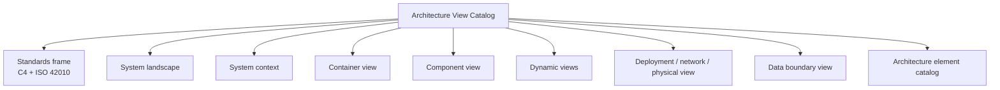

# Hussh Architecture View Catalog

Status: canonical engineering architecture view catalog. This document organizes Hussh architecture views using C4 as the primary diagram frame and ISO/IEC/IEEE 42010 as the view-governance frame.

## Visual Map

## Purpose

This catalog gives engineers, operators, and reviewers one standard vocabulary for Hussh architecture diagrams. It complements the seven-layer platform architecture in [architecture.md](./architecture.md) by defining the actual views we maintain, the stakeholder concern each view answers, and the source documents that must be checked before changing a diagram.

All diagrams in this document use GitHub-native Mermaid only: `flowchart` and `sequenceDiagram`. Do not use Mermaid C4 extension syntax here; keep C4 as the architecture framing, not the renderer syntax.

The primary method is:

- C4 model for software architecture structure: system landscape, system context, container, component, dynamic, and deployment views.
- ISO/IEC/IEEE 42010 for architecture-description discipline: each view names stakeholders, concerns, notation/model kind, source anchors, and current-versus-future-state status.

TOGAF and ArchiMate terms are supporting enterprise vocabulary only. In this repo, `catalog` means an inventory/list of architecture elements; `technology/deployment view` means runtime infrastructure and communication topology; `physical view` means deployed nodes, environments, data locations, and physical/logical runtime boundaries.

## Standards References

- C4 model: https://c4model.com/
- ISO/IEC/IEEE 42010: https://www.iso.org/standard/74393.html
- TOGAF Standard, 10th Edition: https://www.opengroup.org/togaf-standard-10th-edition-downloads
- UML deployment diagrams: https://support.microsoft.com/en-us/visio/create-a-uml-deployment-diagram
- OSI basic reference model: https://standards.iteh.ai/catalog/standards/iso/dd6368a0-cd9f-468b-94a3-7418626f4ee0/iso-iec-7498-1-1994

## Current-State Contract

- Current: One Voice product surface, Kai finance-specialist runtime, Consent Protocol, Developer API, hosted MCP, `@hushh/mcp`, PKM/vault, consent/export, Cloud Run deploy lanes, Firebase identity, Cloud SQL/Postgres data plane, RIA Intelligence provider lane, and governed UAT/production deploy workflows.
- Source-backed on this branch: the **per-user private-agent pod** and the fleet control plane that provisions, hears heartbeats, and reconciles it after the person's AI connection verifies. Dev serving state for this integrated revision requires a dated live readback. UAT and production remain separate rollout decisions.
- Approved direction with checked-in manifests but not default app runtime everywhere: One, Nav, KYC, delegated specialist handoffs, and memory-agent structure.
- Future-state only: Salesforce, MuleSoft, Agentforce, Flex Gateway, OpenClaw/local MCP, full One/Nav default runtime, and broad BYOA/on-device private-compute lanes.
- Partner systems must not be drawn as canonical PKM, vault, key, or durable-memory stores. They may appear only as workflow endpoints that receive consent/audit metadata and narrow approved fields.

## View Catalog

| View | C4 / standard frame | Primary stakeholders | Concern answered | Current status |
| --- | --- | --- | --- | --- |
| [System Landscape](./views/system.md) | C4 supporting diagram | founders, partners, engineering | Which people, systems, providers, and future-state channels surround Hussh? | current + future-state labels |
| [System Context](./views/system.md) | C4 level 1 | founders, product, security, partners | What is inside the Hussh platform boundary and what is outside? | current + future-state labels |
| [Container View](./views/runtime.md) | C4 level 2 | engineering, platform, reviewers | What deployable/runtime containers make up Hussh? | current |
| [Component View](./views/runtime.md) | C4 level 3 | backend, frontend, security, agent engineers | What major components exist inside the Consent Protocol runtime and approved specialist direction? | current + approved-direction labels |
| [Dynamic Views](./views/flows.md) | C4 dynamic diagrams / sequence diagrams | engineering, partners, security | How do key flows move through consent, agents, exports, and writeback? | current + flow-specific future-state labels |
| [Deployment / Network / Physical View](./views/deployment.md) | C4 deployment + UML deployment vocabulary | platform, ops, security | Where do artifacts run and how do environments communicate? | current where repo-backed |
| [Data Boundary View](./views/information-boundary.md) | ISO 42010 data/security view | security, partners, platform | Where can plaintext, ciphertext, metadata, keys, and CRM fields live? | current policy |

## System Landscape

See [System Landscape](./views/system.md).

## System Context

See [System Context](./views/system.md).

## Container View

See [Container View](./views/runtime.md).

## Component View

See [Component View](./views/runtime.md).

## Dynamic View: Consented Encrypted Export

See [Dynamic View: Consented Encrypted Export](./views/flows.md).

## Dynamic View: One / Kai Specialist Delegation

See [Dynamic View: One / Kai Specialist Delegation](./views/flows.md).

## Dynamic View: Portfolio Import

See [Dynamic View: Portfolio Import](./views/flows.md).

## Dynamic View: One Email KYC

See [Dynamic View: One Email KYC](./views/flows.md).

## Dynamic View: Assigned Pod Provisioning and Standard First Turn

See [Dynamic View: Assigned Pod Provisioning and Standard First Turn](./views/deployment.md).

## Dynamic View: Puppy Inference Through the Owner's BYOC Relay

See [Dynamic View: Puppy Inference Through the Owner's BYOC Relay](./views/deployment.md).

## Deployment / Network / Physical View

See [Deployment / Network / Physical View](./views/deployment.md).

## Data Boundary View

See [Data Boundary View](./views/information-boundary.md).

## Architecture Element Catalog

| Element | Classification | Current role | Source anchor |
| --- | --- | --- | --- |
| `hushh-webapp` | container | Next.js, React, Capacitor experience runtime | `hushh-webapp/` |
| Consent Protocol | container | FastAPI backend, consent, PKM, IAM, Kai, RIA, MCP runtime | `consent-protocol/` |
| Developer API | interface | REST lane for scope discovery, consent, status, and scoped export | `consent-protocol/docs/reference/developer-api.md` |
| Hussh MCP | interface/container | Hosted remote MCP and npm bridge for consent tool access | `packages/hushh-mcp/README.md` |
| PKM / Vault | data boundary | Encrypted user memory, manifests, scope registry, discovery-safe index | `consent-protocol/docs/reference/personal-knowledge-model.md` |
| Agent One | agent | Top private-agent direction and strict product manifest | `consent-protocol/hushh_mcp/agents/one/agent.yaml` |
| Kai | agent | Finance specialist and current mature runtime surface | `consent-protocol/hushh_mcp/agents/kai/agent.yaml` |
| Nav | agent | Privacy and consent guardian manifest | `consent-protocol/hushh_mcp/agents/nav/agent.yaml` |
| KYC | agent | Identity/KYC workflow specialist manifest | `consent-protocol/hushh_mcp/agents/kyc/agent.yaml` |
| Portfolio Import Agent | agent | Statement/CSV/PDF/image import specialist | `consent-protocol/hushh_mcp/agents/portfolio_import/agent.yaml` |
| Memory agents | agents | PKM segmentation, intent, merge, structure, summary reduction | `consent-protocol/hushh_mcp/agents/*/agent.yaml` |
| Private Agent One pod | container / deployment node | One Cloud Run service per person, `one-pod-<HusshID>`; hub-only ingress by default, separately gated dev direct mode. Managed fleet uses a shared zero-role SA; BYOC uses scoped owner-project IAM for storage, KMS, and optional Vertex. No hub Postgres credential. Dev lane only. | `consent-protocol/hushh_mcp/services/gcp_backend.py`, `consent-protocol/hushh_mcp/services/user_gcp_backend.py`, `consent-protocol/pod_server.py` |
| Pod fleet control plane | component | Provisions after the AI connection verifies, pulls the pod key on heartbeat, reconciles stalled rows, tears down on account deletion | `consent-protocol/hushh_mcp/services/personal_agent_registry_repo.py`, `consent-protocol/api/routes/one/pod_heartbeat.py` |
| Compute backend seam | interface | One contract, many hosts: `gcp` (FedRAMP-High tier, live-wired), `anypoint` (mass tier, plan-mode), `user_gcp` (BYO-Compute), `null` (inert default) | `consent-protocol/hushh_mcp/services/compute_backend.py` |
| Dev Cloud Run lane | deployment node | `hushh-pda-dev`, `us-central1`, `consent-protocol`, `hushh-webapp`, plus the per-user pod fleet. Any CI-green ref; never promotes. | `.github/workflows/deploy-dev.yml`, `docs/reference/operations/dev-fast-lane.md` |
| UAT Cloud Run lane | deployment node | `hushh-pda-uat`, `us-central1`, `consent-protocol`, `hushh-webapp` | `.github/workflows/deploy-uat.yml` |
| Production Cloud Run lane | deployment node | `hushh-pda`, `us-central1`, `consent-protocol`, `hushh-webapp` | `.github/workflows/deploy-production.yml` |
| RIA Intelligence API | provider/runtime dependency | Standalone CRD and advisor verification provider consumed through `RIA_INTELLIGENCE_*` configuration | `docs/reference/architecture/crd-scraping-api.md` |
| Salesforce/MuleSoft | future-state external system | Partner workflow channel only; not shipped implementation | `docs/future/hussh-one-infra/salesforce-mulesoft-brief.md` |

## Standards Glossary

| Term | Use in Hussh docs |
| --- | --- |
| Catalog | Inventory/list of architecture elements, views, components, interfaces, or data boundaries. |
| [System Landscape](./views/system.md) | C4 supporting diagram showing the larger ecosystem around Hussh. |
| [System Context](./views/system.md) | C4 view showing Hussh as the system of interest and its users/external systems. |
| Container | C4 deployable/runtime unit such as web app, backend, MCP server, database, or external service. |
| Component | Internal structural unit inside a container, such as IAM, PKM export service, agent runtime, or workflow service. |
| Dynamic View | Sequence or flow view showing runtime behavior across components or containers. |
| Deployment View | Runtime view showing where artifacts run and how environments/services connect. |
| Network View | Runtime communication path/topology. In this repo it is not OSI packet-level detail unless explicitly stated. |
| Physical View | Deployed nodes, environments, data locations, device/runtime boundaries, and infrastructure placement. |
| Future-state | Future or partner architecture lane without current implementation proof. |
| Current | Repo-backed implementation, deploy workflow, runtime contract, or checked-in manifest with clear boundary. |

## Maintenance Rules

1. Update this catalog when a canonical view, runtime container, major agent, deploy lane, or data boundary changes.
2. Keep current and future-state nodes visually distinct.
3. Do not add partner systems as trust authorities or memory stores.
4. Do not include secrets, local absolute paths, row payloads, HCT values, or inline developer tokens.
5. Do not invent cloud-network internals. Add VPC, subnet, load-balancer, or firewall details only after repo or live read-only evidence exists.
6. Prefer updating source-specific docs first, then this catalog as the cross-cutting view index.
