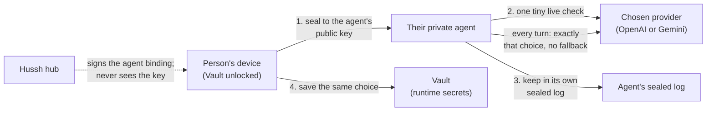

# Bring your own AI: the person's own model key on their own agent

**Status:** built on the dev workspace branch (2026-10-04) with unit evidence; not
on `main`, UAT or production. Agent release `2026.10-dev.6` (image
`sha256:3a7bb679…2feb4c`, source `8a8494a73`) was qualified from the installed
`sha256:a313b9f7…194126d` by recovery build `7a7751ae-4b3a-4165-b885-bdc713d18898`:
identity, file bytes, encrypted sessions, memory, PKM summary and the sealed AI
selection all survived the update and a restart, with no tested plaintext marker in
the encrypted artifacts. This proves isolated compatibility, not a live
installation. Agent release `2026.10-dev.7` (image `sha256:ace34069…f14a`, source `060ece8c0`:
working tool turns on the person's Azure OpenAI model and on Puppy One) was
qualified the same way from `sha256:3a7bb679…feb4c` by recovery build
`c11ba209-4c41-43d1-a550-e84c6e57e1a0` on 2026-10-05: all four steps passed and the
sealed AI selection was recovered. The rehearsal uses the local object store,
so it proves format compatibility, not Azure Blob storage. Inherits `private-agent-north-star.md` by pointer;
where this page and the north star disagree, the north star wins and this page
moves.

## Visual Map

## What the person is promised

*"Whatever I selected is what my agent uses. My key goes to my agent and my Vault,
never to Hussh, and if my provider refuses it I am told, not quietly switched."*

## How it works

- **Selection.** Provider (`openai` or `gemini`), optional model, key, and for
  Gemini the transport. Saved in the Vault's runtime secrets
  (`llm.openai_api_key`, `llm.selected_provider`, `llm.selected_model`,
  `llm.credential_mode = byok`) under catalogued writer ids.
- **Sealed to the agent.** The device seals the selection with
  X25519-HKDF-SHA256-AES256GCM to the agent's public key, taken only from the
  hub-signed `pod_binding_v1` the app already verifies. The AAD binds purpose,
  HusshID, agent key id, issue time (within 10 minutes) and a selection id; an older
  selection can never replace a newer one, even after a clear. Contract and golden
  vector: `consent-protocol/hushh_mcp/services/pod_ai_selection_seal.py`,
  `consent-protocol/tests/fixtures/ai_selection_seal_vector_v1.json`,
  `hushh-webapp/lib/one/ai-selection-seal.ts`.
- **Owner-only doors.** `PUT`, `GET` and `DELETE /api/one/pod/ai-selection` open
  only for the agent's own app-role session (`pod.config` plus a held incarnation
  for writes, `pod.status` for reads). A hub-relayed consent token is refused with
  `403 OWNER_SESSION_REQUIRED` even when valid: anyone can seal to a public key, so
  a hub-admitted write could swap in a key the person never chose.
- **Checked by the agent.** The agent opens the envelope and makes one bounded call
  (8 s, 16 output tokens) before it stores anything. Refusals:
  `KEY_REFUSED`, `QUOTA_EXCEEDED`, `MODEL_UNAVAILABLE`, `PROVIDER_UNREACHABLE`,
  `PROVIDER_UNSUPPORTED`, `STALE_SELECTION`, `BAD_ENVELOPE`. The key never appears
  in a response, log line, error or repr.
- **Every turn.** A stored selection wins over every other model path on the turn,
  agent chat and close-review doors and for specialists. OpenAI runs on the
  Responses API at `api.openai.com` (stateless, `store: false`), default
  `gpt-5.6-luna` (the same model id measured inside Azure at 54 of 60 on the
  harness). A provider refusal mid-turn is `409 OWNER_AI_KEY_REFUSED` or
  `OWNER_AI_QUOTA_EXCEEDED` with the provider name, and the app links to Bring your
  own AI. A selection the agent cannot read refuses with
  `503 OWNER_AI_SELECTION_UNAVAILABLE` until a read succeeds; a damaged newest
  record counts as unreadable, and a fresh choice always repairs it.
- **Explicit Puppy turns** still run on the person's device: an explicit choice is
  not overridden.

## Graceful updates

- **Providers come from the server.** `GET /api/one/runtime/providers` names each
  provider, its methods and availability. An app that meets an unknown provider or
  method shows it as available in a newer version of Hussh and keeps any saved
  Vault values untouched. The static catalog is only the offline fallback.
- **Agents advertise what they run.** `/pod/info` capabilities and the heartbeat
  carry `aiSelection: {version: 1, providers: [...]}`; the hub keeps it under the
  registry's observed metadata and `GET /api/one/personal-agent/status` returns it.
  `null` means an older agent: the app offers the existing owner-approved update
  instead of failing. Publishing a release never installs it.

## Known gaps

- **Voice** runs on managed Gemini Live, so the agent reports voice unavailable
  (`owner_ai_selected`) while a selection is in force; it never stands in.
- **Location and other commands** need Gemini structured output and audio, so an
  OpenAI selection refuses them (`COMMAND_MODEL_UNAVAILABLE`); a Gemini key still
  serves them.
- **Background learning.** The maintenance tick still holds no owner key, as the
  north star states; close-review learning runs on the conversation's own model.
  The founder's 2026-10-04 direction (the cloud agent can always act and learn)
  needs a north-star edit before the tick may use the sealed selection.
- **Migration export** seals every log record, now including the selection, to the
  recipient key the hub supplies; checking that key against the destination agent's
  own key is a follow-up before migration leaves dev.
- **The hub's existing Gemini key check** (`/api/one/runtime/gemini/validate`) still
  receives the raw key; the new OpenAI path does not.
