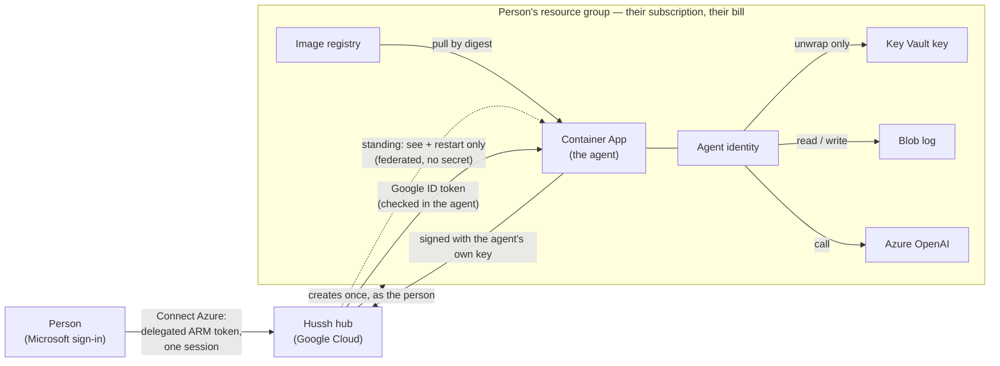

# The private agent in the person's own Azure subscription

**Status:** approved design (2026-10-01), live platform spike done in a consumer
free-trial subscription (2026-10-02). Implementation lanes 1 to 5 and the
image-source round are on the dev workspace branch. The first live Azure agent
answered owner-direct chat turns on dev on 2026-10-05 (see *First live agent*);
tool turns and the rest of the admission bar still need live evidence (see
*Known gaps*). Not on `main`, UAT or production. Inherits
`private-agent-north-star.md` by pointer; where this page and the north star
disagree, the north star wins and this page moves.

## Visual Map

## What the person is promised

*"Connect Azure, and my agent runs in my own subscription, on my bill, with Hussh
able to see and restart it and nothing more."*

One active agent per person, always. Azure is a second home for the same agent,
not a second agent. Switching homes is a move (freeze, sealed copy, hash-matched
proof, switch, 14-day grace), never two live copies: two writers would fork the
sealed commit log into two histories that both claim to be the same agent.

## Trust matrix

Who may do what in the person's subscription, per lifecycle operation.

| Operation | Authority | Standing or just-in-time |
|---|---|---|
| Setup (resource group, identities, Key Vault + key, storage, registry, Azure OpenAI, environment, role assignments) | The person's own delegated ARM token (`user_impersonation`, auth code + PKCE, online only, no refresh token) | Just-in-time: the Connect Azure sign-in |
| Image import + upgrade | The person's delegated token after they approve the update; the image source is read with a 15-minute image-reader token (see *Image source credential*) | Just-in-time: approve + sign-in |
| Re-create after the agent is gone | The person's delegated token | Just-in-time |
| Full teardown ("delete everything") | The person's delegated token | Just-in-time |
| Read status, revisions, address (FQDN) | Hussh app service principal, custom role "Hussh Pod Observer" | Standing |
| Restart (heal) | Same role: `containerApps/revisions/restart/action` | Standing |
| Remove Hussh's own access | ABAC-conditioned `roleAssignments/delete`, limited to Hussh's own principal and the recorded pod principals | Standing, used last |

Hussh never holds: `Microsoft.ManagedIdentity/*/write` (federated credentials,
`assign/action`), any Key Vault control-plane or data role, any Storage role,
`roleAssignments/write`, or Container Apps `exec`, `listSecrets`, `getauthtoken`.
Whoever can write the container app chooses the code that runs as the pod's
identity, and that identity can unwrap the agent's key. Container write is
therefore read authority, and it stays with the person.

Verified live on the first agent (2026-10-05, dev test account): Hussh's standing
role in the subscription was read plus revision restart only, beside the
ABAC-limited access-removal role, and every write in the resource group was made
under the owner's own delegated sign-in.

The standing service principal authenticates by workload identity federation: a
federated credential on the Hussh app with issuer `https://accounts.google.com`,
subject = a dedicated broker service account's numeric id, audience
`api://AzureADTokenExchange`. No client secret exists anywhere.

Revocation windows the consent copy must state: removing Hussh's role assignment
stops changes within about 10 minutes; an already-issued app token can keep
working for its remaining lifetime (60 to 90 minutes).

## Identity between agent and hub

- **Hub to agent:** unchanged from GCP. The hub sends a Google ID token whose
  audience is the agent's own address; the agent's in-process wall
  (`api/middlewares/pod_ingress.py`) verifies it against Google's public keys.
  Container Apps ingress preserves `Host` and sends `x-forwarded-proto: https`
  (measured), so the audience check works unchanged. Ingress is external; there
  is no platform invoker lock on Azure.
- **Agent to hub:** the agent signs every request with an Ed25519 key it derives
  from its own X25519 private key (`HKDF-SHA256`, info
  `hushh/pod-hub-request-signing/ed25519/v1`). The hub verifies against a public
  key it **pulled itself** from the address it read from ARM with its own
  credential, never from an address the browser or the person reports. The same
  scheme replaces Google ID tokens for GCP agents, so the hub keeps one verifier
  for every cloud. No Entra token verifier is built.

**Wire contract, as implemented** (`consent-protocol/hushh_mcp/services/pod_request_signing.py`,
pinned by a golden vector in `consent-protocol/tests/test_pod_request_signing.py`):

- Headers: `X-Hushh-Pod-Signature: ed25519.<kid>.<b64url(sig)>`,
  `X-Hushh-Pod-Timestamp` (ms), `X-Hushh-Pod-Nonce` (16 random bytes, b64url), and
  the existing `X-Hushh-Pod-Id`. `kid` is `pods_` + 32 hex of SHA-256 over the
  base64 public key; the pod publishes `podSigningKey`, `podSigningKeyId` and
  `podSigningAlg` on `GET /pod/public-key`.
- Signed bytes: canonical JSON of purpose `hushh/pod-hub-request/v1`, audience,
  HusshID, kid, method, path, sorted query, SHA-256 of the exact body, timestamp
  and nonce. Accepted window: 60 s back, 30 s ahead. Each (kid, nonce) is
  single-use (`pod_request_nonces`, dev-only migration 947).
- An unknown kid only triggers the hub's own key pull, at most once per agent per
  30 s and under a per-process cap that only a request which won its agent's slot
  can spend. A signing key is valid only with the pod key it was published with:
  any write that moves the pod key without a new signing key drops the old one in
  the same statement (a trigger in migration 947), so rotating a compromised pod
  key also revokes its signing authority. The first valid signature latches the
  agent's registry entry (`identity_mode = signed`); afterwards a Google-only
  request from it is refused, including while it waits for the hub to pull a
  signing key for a new pod key. Until then a GCP agent keeps sending its Google
  ID token beside the signature. Everything is behind the dev-only
  `POD_HUB_IDENTITY_AUTH_ENABLED`. An Azure agent has no metadata server and
  signs alone, so it can reach only a hub where that flag is on.
- **Two placements (dev-only migration 950, `docs/future/personal-agent/STANDBY-SYNC.md`
  E4).** An optional `X-Hushh-Pod-Epoch` header carries the placement epoch the
  agent was told; it is signed only when sent, so the golden vector is unchanged
  without it. Once a person has a standby agent or `placement_epoch > 0`
  (`personal_agent_registry`, bumped by one on every promotion), the hub refuses a
  signed request whose epoch is missing or below the registry's, accepts only the
  primary's `pod_signing_key_id` on turn and write routes, and accepts the
  standby's key only on routes that pass `sync_path=True`. Every such refusal is
  the verifier's ordinary `INVALID`, never a fall-through to the Google path; adding
  a standby and every switch latch `identity_mode = signed`. A row without the 950
  column is decided exactly as before (`hushh_mcp/services/pod_placement_fence.py`).

## The setup binding

Setup writes into the person's subscription only under their own sign-in, and
only into a resource group it can prove it created for this agent. The group and
the agent carry two tags:

- `hussh-setup-nonce`: 16 hex characters, minted once per new group.
- `hussh-setup-binding`: HMAC-SHA256 over (HusshID, nonce) under a key derived
  from `APP_SIGNING_KEY` for the label `setup-binding`
  (`consent-protocol/hushh_mcp/services/azure_keyed.py`).

The binding is over the **HusshID, not the account uid**: the backend that
re-verifies it is database-free and `PodSpec` deliberately carries no user id;
the registry binds the two one to one. A retry reuses the nonce of a group
already bound to this agent; a group with this agent's name but no valid binding
is refused (`RESOURCE_GROUP_FOREIGN`) and nothing is changed. Attach, discover,
upgrade and erasure re-verify the binding from ARM. Rotating `APP_SIGNING_KEY`
makes existing bindings stop verifying, which fails closed. The group name is
`rg-hussh-one-<keyed digest of the HusshID>`, so it names the person to nobody but
the hub.

## Image source credential

The person's registry pulls the approved digest straight from Hussh's private
Artifact Registry repository with ARM `importImage`. No public mirror exists, and
Azure never receives the hub's own runtime token, which carries everything the hub
may do in Google Cloud.

- The hub impersonates one dedicated reader service account,
  `HUSSH_POD_IMAGE_READER_SA`, through IAM Credentials `generateAccessToken`
  (lifetime 900 s, scope `cloud-platform`). The token carries whatever that
  account is granted, for 15 minutes, and **the hub does not check those
  grants**. The only grant must be Artifact Registry reader on the repository
  that holds the pod release.
- **On today's release layout that repository is not pod-only.** Dev publishes
  the pod release as `gcr.io/<project>/consent-protocol-pod`
  (`deploy/backend.cloudbuild.yaml`, rendered into `HUSSH_ONE_POD_IMAGE` by
  `scripts/deploy/backend-deploy.sh`). Everything under `gcr.io/<project>/` is
  one repository (the `gcr.io` repository in Artifact Registry, or one storage
  bucket on legacy Container Registry; which one backs dev is not verified
  here), and it also holds the hub's own image (`consent-protocol`) and the web
  image (`hushh-webapp`). So even the narrowest grant lets the token Azure
  receives pull the hub and web images for 15 minutes. It cannot write or
  deploy. The hub logs `azure_image_source.reader_on_shared_repository` on every
  preflight against a `gcr.io` source. The fix is a dedicated pod repository
  (see *Known gaps*).
- The token is minted at the moment of the import call, for setup and for each
  approved update, and exists only in that request body as source credentials
  (username `oauth2accesstoken`, password the token). It is never logged and never
  put in an error message.
- A Google token is only ever offered to a Google registry host
  (`*-docker.pkg.dev`, `gcr.io`). A reader equal to the hub's own identity, or a
  minted token equal to the hub's token, is refused.
- **Preflight before the Microsoft sign-in:** both `authorize/begin` and
  `upgrade/begin` prove the import will work before the person signs in. With a
  reader configured, the hub mints a token and reads the exact digest's manifest
  with it. Without one, the source must be readable anonymously. Otherwise the
  route answers 503 with a typed code: `IMAGE_SOURCE_NOT_CONFIGURED` (names the
  missing `HUSSH_POD_IMAGE_READER_SA`), `IMAGE_READER_CANNOT_READ`,
  `IMAGE_NOT_PUBLISHED` (the reader can read the repository but the digest is
  not in it; never "grant more access"), `IMAGE_REPOSITORY_MISCONFIGURED`,
  `IMAGE_READER_UNAVAILABLE`, `IMAGE_READER_IS_HUB`, `IMAGE_READER_MISCONFIGURED`
  or `IMAGE_SOURCE_UNSUPPORTED`. Setup and update read the same place: both map the
  approved reference through `release_source()`, while the approval, the
  acknowledgement and the agent's reported image stay on the approved reference.

Implemented in `consent-protocol/hushh_mcp/services/azure_image_source.py`;
`HUSSH_POD_IMAGE_READER_SA` is hub deployment configuration, not a secret and not
pod behaviour.

## Agent environment contract (rendered by the hub, read by the agent)

Topology only. Behaviour lives in the sealed `pod_config_v1` record, never in new
environment flags.

| Variable | GCP owner project | Azure subscription |
|---|---|---|
| `POD_STORAGE_BACKEND` | `commit_log` | `commit_log` |
| Object store location | `POD_STORAGE_GCS_BUCKET` (+ prefix) | `POD_STORAGE_AZURE_BLOB_URL` = `https://<account>.blob.core.windows.net/<container>[/<prefix>]` |
| Key custody | `HUSSH_POD_KMS_KEY` | `HUSSH_POD_KEY_VAULT_KEY` = `https://<vault>.vault.azure.net/keys/<name>/<version>` |
| Wrapped key object | `HUSSH_POD_WRAPPED_LOG_KEY_OBJECT` | same |
| Workload identity | GCE metadata server | `AZURE_CLIENT_ID` (the pod's user-assigned identity) + platform `IDENTITY_ENDPOINT` / `IDENTITY_HEADER` |
| Incarnation | platform `K_SERVICE` / `K_REVISION` | platform `CONTAINER_APP_NAME` / `CONTAINER_APP_REVISION` |
| Own model | `GOOGLE_CLOUD_PROJECT` + user ADC | `AZURE_OPENAI_ENDPOINT` + `AZURE_OPENAI_DEPLOYMENT` (mode `user_azure_mi`) |
| Signing key | Key Vault reference via Container Apps secret | same shape (`APP_SIGNING_KEY` from a Key Vault secret reference) |

The managed-only strip list (`_MANAGED_ONLY_ENV` in `user_gcp_backend.py`) applies
to Azure unchanged: no Hussh key, bucket or model coordinate ever reaches a
person's subscription.

## Measured platform facts (2026-10-02, consumer free-trial subscription)

| Fact | Measured |
|---|---|
| Container Apps environments per region on a free trial | 1 |
| Pod image import from Hussh's private registry (`az acr import`, short-lived Google token) | works; digest byte-identical; 65 s for 455 MiB |
| First HTTP 200 on `/health` after first deploy (rollout + first pull + boot) | 63.2 s |
| Scale-from-zero to first HTTP 200 | 36.9 s (one sample; series in progress) |
| Container Apps ETag on GET | none (no ARM optimistic concurrency); fence with the hub's upgrade lease plus `systemData.createdAt` and a creation-nonce tag |
| Ingress request timeout header | `x-envoy-expected-rq-timeout-ms: 1800000` (30 minutes) |
| Managed identity endpoint | `IDENTITY_ENDPOINT=http://localhost:12356/msi/token` + `IDENTITY_HEADER` (not an IMDS address) |
| Blob create-only (`If-None-Match: *`) on an existing blob | **409 BlobAlreadyExists** (GCS returns 412 for the same case) |
| Blob compare-and-swap mismatch (`If-Match`) | 412 ConditionNotMet |
| Key Vault key created through ARM with no data role | works; the creator still gets 403 on read and unwrap |
| `Key Vault Crypto Service Encryption User` at key scope | public key read and unwrap allowed; sign refused |
| Google service-account token to Entra token (federated credential) | works in 1 s; a managed identity token lasts 24 h (86,399 s), which is why Hussh's standing principal is an app registration |
| Azure OpenAI on a free trial (eastus2) | available; e.g. gpt-5-mini Global Standard 500K tokens/min |

At the spike the pod image did not boot off Google Cloud: it built a Google model
at import time (`api/routes/one/agent_chat.py` intro agent). The agent-side lane
now builds the chat heads on first use, so the same image boots on Container
Apps (live on dev since 2026-10-05); it still needs `APP_SIGNING_KEY`, which
setup provides as a Key Vault reference.

## First live agent (2026-10-05, dev)

Measured on the founder's dev test account: the agent `ca-hussh-one-pod` in
`eastus2`, on the Azure OpenAI deployment `one-chat` (gpt-5.6-luna, Global
Standard), set up through Connect Azure on the dev lane. Earlier live runs on
localhost (2026-10-03 and 2026-10-04) proved Microsoft sign-in, home-directory
discovery and setup admission, then stopped at free-trial limits (one Azure
OpenAI account and one Container Apps environment per subscription), since freed.

| Fact | Measured |
|---|---|
| Setup end to end, first time | about 9 minutes (Container Apps environment 6 min 19 s, model deployment 42 s) |
| Setup on a retry | 1 min 39 s |
| Container cold start | about 30 s |
| First owner-direct chat turns | answered at about 09:01 to 09:02 UTC |
| First visible text | 9.8 s on the cold first turn of a new process (its request build took 4.1 s), then 4.7 s and 3.1 s warm |
| Whole turn | 6.2 to 12.1 s |
| Model calls per plain turn | one |
| Memory recall | works from the sealed commit log (`pod_memory.recall hits=2`); Memory Bank is absent by design and its steps log `no_bank` |
| First tool turn | recalled memories, then failed with a `TypeError` on the next model call (recall results carry dates, and the tool output was serialized with plain `json.dumps`); fixed on the branch in agent release `2026.10-dev.7`, not yet installed |

For comparison, Google agents (`hushh-byoc-test`, 2026-09-28) reached first text
on plain turns in 5.9 to 6.7 s. These are a handful of turns on one agent, not a
series, so they show the path works and roughly how fast; they do not qualify a
latency claim.

Four defects only a live subscription could show were found and fixed on the
branch:

- **ARM id case.** ARM listed the agent's identity under `.../resourcegroups/...`
  while setup looked it up under `.../resourceGroups/...`, so a healthy agent was
  refused with `PROOF_FAILED`. Setup proof and observation now match ARM ids
  case-insensitively; a different principal is still refused.
- **Provision claim (dev-only migration 952).** The claim refused an account whose
  Google agent had been detached, and its insert row omitted the Azure
  coordinates that 948's check requires, so no Azure home could be claimed.
- **Key pull during attach (dev-only migration 953).** An Azure agent signs alone,
  so the hub knows it only after pulling its key. The attach guard refused the
  pull's throttle stamp while the row was `connecting`, and every heartbeat drew
  401.
- **Owner-direct admission and attach on record.** Nothing wrote the
  direct-readiness record for an `ingress: external` agent, so chat refused with
  `POD_DIRECT_NOT_READY`; the hub now runs the direct checks itself on a live beat
  (`pod_external_ingress_admission`, see
  `docs/reference/operations/dev-pod-first-light-runbook.md`). The setup also
  stayed `reserved` until attach was pressed by hand; the hub now attaches when
  the setup is recorded.

## Azure version 1 capabilities, stated honestly

`GET /pod/info` reports these under `capabilities` (with `platform: "azure"`), from
rendered topology, never from a flag
(`consent-protocol/api/routes/one/pod_capabilities.py`):

- `memoryRecall`: source `sealed_log`. Recall reads the sealed commit log
  (keyword-based); there is no managed memory service. Proven live on
  2026-10-05 (see *First live agent*).
- `voice`: unavailable, reason `no_vertex_model` (voice needs a Vertex model), or
  `owner_ai_selected` while a Bring your own AI choice is in force; the voice
  route refuses before accepting a connection.
- `gmailPush`: unavailable, reason `requires_google_pubsub` (Gmail push only
  targets Google Pub/Sub).
- `filesBackgroundOrganization`: unavailable (`files_disabled`, or
  `requires_google_cloud_storage` where Files is turned on); an update that
  carries a Files plan is refused on Azure.
- `webSearch`: unavailable. One's web search is Google Search grounding, a Gemini
  tool that ADK refuses for any other model. A head on the person's Azure OpenAI
  deployment (or on Puppy) is built without it and, when a request needs the
  web, says "Web search is not available on this setup yet." instead of
  failing with a tool error. No other search provider stands in. The decision
  is one predicate (`consent-protocol/hushh_mcp/one_adk/web_search.py`), read
  by both the head and the capability report, so `/pod/info` reports
  `webSearch: {available: false, reason: "requires_gemini_model"}` for a pod
  whose own model is Azure OpenAI. A turn that brings its own Gemini key keeps
  web search.
- `privateCommands`: unavailable with `requires_gemini_model` when the agent's own
  model is Azure OpenAI (or a sealed OpenAI key). Voice transcription and location
  commands need Gemini structured output and audio input, so the pod refuses them
  with a typed 503 `COMMAND_MODEL_UNAVAILABLE`, and the app now says so in standing
  words ("Voice and location commands are not available with your Azure model
  yet.") instead of "temporarily unavailable". A request that carries the person's
  own Gemini key still works.
- `aiSelection`: the Bring your own AI providers this image can run a sealed
  owner choice on (`bring-your-own-ai.md`).

The hub relays this report to the owner (`GET /api/one/u/{hushh_id}/info`).

**Turn timeouts.** An Azure OpenAI head keeps Gemini's budgets (20 s to the
first event, 30 s between events, 90 s per turn, and 30 s per specialist model
call). The first live plain turns fit inside them with room (9.8 s to first text
at worst, 12.1 s for a whole turn; see *First live agent*). That is a handful of
turns and no completed tool turn, not a series, so nothing changes until a
measured series says it must. Puppy keeps its own measured budgets
(`consent-protocol/tests/test_timeout_ladder.py`).

## Erasure, heal and update recovery, as implemented

Hussh can delete nothing in the person's subscription, so each lifecycle path is
built from the authority the trust matrix leaves it. The shared orchestrator
reaches each one through a typed capability in
`consent-protocol/hushh_mcp/services/compute_backend.py` (`OwnerAccessErasableBackend`,
`RestartableBackend`), never a provider name.

- **Erasure.** After the registry reserves erasure, the agent erases itself:
  `POST /pod/migration/erasure/crypto-erase` sits behind the same hub-proof and
  incarnation gate as the fence, with its own proof purpose. It closes admission for
  the attempt and writes a tombstone (`erasure/crypto-erase.json`: attempt, owner
  digest, chained record keys). It then deletes the wrapped key first, followed by
  the identity key, incarnation fence, session projection and the records. A retry
  finishes from the tombstone without the key. Key Vault custody refuses to mint a
  replacement key while the tombstone exists, so an erased agent never boots again.
- **The fences stay closed.** Hussh cannot stop the container, and its blob role
  lasts until revocation reaches Azure, so a process still holding the key in memory
  could otherwise keep writing. The erase therefore never deletes the two objects
  that refuse those writes. The log head stays the sealed erasure fence, which is
  ciphertext under the destroyed key. Memory bookkeeping becomes a closed stub that
  names no owner. The erase ends by checking that no head a live process could extend
  exists, and refuses to report done otherwise.
- **Checkpoint, then revoke.** The agent's confirmation is retained on the registry
  row as the `agentCryptoErase` checkpoint, together with the setup nonce, before
  any role assignment is touched. Hussh then revokes the agent's role assignments,
  then its own, last. Revocation can stop part way: ARM retries only 429 and 503,
  and once the agent's storage grant is gone the agent can no longer confirm
  anything. A retry therefore resumes from the checkpoint. It never calls the agent
  again and reads nothing from ARM, because Hussh's observer grants may already be
  gone while the removal grant, revoked last, is still there. Each revocation is
  idempotent, so the receipt lists every assignment confirmed gone, whether removed
  now or earlier.
- **Receipt.** The receipt (resources remaining, the vault's earliest purge date,
  "delete the resource group …") is retained once on the registry row under the
  reserved attempt (dev-only migration 949, validated against the reserved
  snapshot). It must carry exactly the checkpointed confirmation. A database
  preflight proves that the checkpoint and the receipt can be retained before the
  agent erases anything. The account stays refused while those resources exist. The
  person deletes the resource group; Hussh no longer can.
- **Residual window.** Suppose the database becomes unavailable after the
  preflight, and stays down past the last revocation, so the receipt cannot be
  stored. A retry then cannot finish, because Hussh's removal grant is already gone.
  It fails closed: the account stays refused and the person deletes the resource
  group.
- **Not enumerated by the agent:** orphan records from lost append races and Files
  objects (Files is off). Both are sealed under the destroyed key.
- **Heal** is the observer's `revisions/restart/action` through the backend, never
  the hub's Cloud Run client.
- **A crashed update** leaves the lease and the provider acknowledgement on the row.
  The observer resolves it from reads alone, because the revision name derives from
  the attempt id. Live means that revision is the latest ready one and runs the
  acknowledged image. Failed needs a definitive platform verdict: the revision failed
  to provision or to run, or ARM settled without creating it. Anything still
  activating keeps the lease. No new update starts without the person's sign-in.

## What shipped (2026-10-02, dev workspace branch)

| Lane | What landed |
|---|---|
| Agent seams | Chat heads built on first use; opaque object versions; `AzureBlobObjectStore` with the measured 409/412/404 mapping (403 is always a refusal); Key Vault custody (RSA-OAEP-256 wrap locally, unwrap through Key Vault, create-once key); `pod_workload_identity` (`IDENTITY_ENDPOINT` + `AZURE_CLIENT_ID`); `pod_platform` incarnation for the erasure fence, upgrade admission and heartbeat; the capability report above |
| Identity | Ed25519 request signing derived from the pod key, `GET /pod/public-key` publishes it, hub verifier with replay window, single-use nonces, pulled keys and the `identity_mode` latch; dev-only migration 947 |
| Model | Mode `user_azure_mi`: One and every specialist on the person's Azure OpenAI deployment as the pod's own identity; streamed tool calls assembled; one (provider, model, mode) decision for every model door; `/pod/diagnostics/model` probes the deployment |
| Hub | Raw-REST ARM client, Entra auth code + PKCE (no refresh token), federated app identity, deterministic setup plan with an ARM template held to it by a parity test, Container App renderer, `user_azure` backend (attach, typed gone reasons, restart, JIT upgrade with the pod handoff, erasure revoking Hussh last), the three Connect Azure routes, setup and update jobs on the existing job record, dev-only migration 948 |
| Frontend | Connect Azure on the cloud step, the Microsoft return route, subscription picker, update approval through the owner's sign-in, privacy-policy copy naming Microsoft Azure |
| Lifecycle | In-pod crypto-erase behind the erasure fence with closed fences after erase; owner-access erasure through a typed capability with a checkpoint before revocation and the receipt retained (dev-only migration 949); heal through the backend's restart; crashed-update recovery from observer reads |
| Honest capabilities | Non-Gemini heads are built without Google Search grounding and say web search is unavailable; `/pod/info` reports `webSearch` |
| Image source | The image-reader credential and preflight above; `GET /api/one/runtime/byoc/setup/status` now returns `jobId`, and the update progress shows only the record of the job its sign-in started |

## Known gaps

- **No Azure tool turn has completed yet.** Setup, attach, plain owner-direct
  turns and memory recall are proven live on dev (2026-10-05, *First live
  agent*). The first tool turn failed on the model call after its tool ran; the
  fix is in agent release `2026.10-dev.7`, which is built but not installed on
  the Azure agent. That release offers no predecessor until a recovery rehearsal
  qualifies one, and an Azure update also needs the repository mapping described
  below.
  Every other gate in the admission bar still needs live evidence, and
  `config/pod-completion-ledger.yaml` has no Azure rows yet.
- **Operator setup exists for dev only:** the `Hussh One (dev)` Entra app, the
  `hussh-azure-broker` and `hussh-pod-image-reader` service accounts in
  `hushh-pda-dev`, with Token Creator on each held only by the dev hub runtime.
- **The dev lane renders the Azure hub settings through
  `BACKEND_RUNTIME_CONFIG_JSON`,** not the deploy step:
  `scripts/ops/sync_backend_runtime_secrets.py` writes the values for
  `hushh-pda-dev` only, and the return address is derived from the lane origin.
  UAT and production carry none, so their Azure routes refuse with
  `NOT_CONFIGURED`. The web choice is admitted where the build sets
  `NEXT_PUBLIC_APP_ENV=dev` exactly. Pinned by
  `consent-protocol/tests/test_azure_runtime_config_wiring.py`.
- **The image reader is not pod-only on the current release layout.** The pod
  release lives in `gcr.io/<project>/consent-protocol-pod`, the same repository
  as the hub (`consent-protocol`) and web (`hushh-webapp`) images, so the
  reader's 15-minute token can pull all three. The fix is to publish the pod
  release to a dedicated Artifact Registry repository and grant the reader only
  there. That changes `deploy/backend.cloudbuild.yaml`, a protected pipeline
  path (maintainer cohort), and must also move GCP's build-provenance check in
  `consent-protocol/hushh_mcp/services/pod_image_copy.py`, which accepts only
  `gcr.io/<project>/consent-protocol-pod` today. Not verified: whether an IAM
  condition on the package name, or a narrower token scope, is honoured by the
  registry's Docker endpoint. Refusing a `gcr.io` source outright would block
  the dev live test until then, so that is a founder decision; today the hub
  only logs it. **Dev avoids it for setup:** `HUSSH_AZURE_POD_IMAGE_REPOSITORY`
  points the import at `one-pod-release`, the pod-only repository the reader alone
  is granted, with the hub image's exact digest (a digest names exact bytes). A
  release digest must be in that repository before Azure can import it; a missing
  one fails the preflight with `IMAGE_NOT_PUBLISHED` before any sign-in. The dev
  build now publishes it: the `publish-azure-pod-release` step in
  `deploy/backend.cloudbuild.yaml` (dev pod builds only) copies the exact digest
  that becomes `HUSSH_ONE_POD_IMAGE`, reads it back, and fails the build before the
  hub deploys if it did not land. The Azure **update** path uses the same mapping
  (2026-10-05); before that it imported from the approval's own `gcr.io`
  reference and refused on dev before the sign-in.
- **Azure is dev-only end to end:** setup and attach need the parked dev
  migrations 947, 948 and 951 to 953, and agent-to-hub calls need
  `POD_HUB_IDENTITY_AUTH_ENABLED`.
- **Re-create after Azure deletes the environment (built 2026-10-06, not yet
  proven live):** Microsoft deletes a Container Apps environment idle for more
  than 90 days ("Azure Container Apps environments", *Policies*, Microsoft Learn,
  page dated 2026-02-26). The page does not say whether an app scaled to zero
  counts as active, and our agent scales to zero, so treat every Azure agent as
  exposed. The hosting card reads `GET /api/one/runtime/byoc/azure/hosting`
  (`api/routes/one/byoc_azure_rebuild.py`): agent and environment both 404 is
  `hosting_reclaimed`; both 403 is `hosting_unconfirmed`, because the observer's
  grants are scoped to the environment and the agent and may be deleted with them
  (not measured). Both offer one action, a rebuild under the person's own
  sign-in (`rebuild/begin`, state kind `rebuild`). The rebuild
  (`consent-protocol/hushh_mcp/services/azure_hosting_rebuild.py`) first reads,
  read-only, the bound resource group, the environment and agent, the identity
  (its principal must equal the recorded one when one was recorded; rows that
  never recorded `runtime_principal_id` skip that check), the vault with its key and signing
  secret, and the storage account with its container. It proceeds only when the
  environment alone is gone, then reruns setup with the group's own nonce and the
  applier in adopt mode, which reads and keeps every custody resource and never
  writes one. Then one fenced write (the fresh row snapshot plus the Azure tenant,
  subscription and resource group) flips the row to `needs_reinit` and RESTORES
  `user_cloud_authorized_at`, because the owner has just signed in for this group.
  It deliberately does not reuse `mark_needs_reinit`, which clears that column.
  A cleared column leaves `UserCloud.blocks_provisioning` True, so `upgrade_pod`
  refuses every later update (`PersonalAgentCloudNotAuthorizedError`). It then
  adopts the new agent through `adopt_orphan` (same identity, approved digest, key
  pulled from the new address). Not proven live: whether the observer reads 404 or
  403 after a real idle deletion, and the full rebuild in a real subscription.
  `pod_wake`'s confirmed-gone check cannot resolve an Azure backend: its spec
  carries no Azure coordinates.
- **Full teardown** under a sign-in is not built; erasure crypto-erases the agent,
  revokes access and the receipt names the resource group to delete. Account
  deletion stays refused while that resource group exists.
- **Registry retention:** every imported digest stays in the person's Basic
  registry; pruning to the current and previous digest is not built.
- **Placement** is fixed to `eastus2` (where the model was measured available).
- **Azure OpenAI quality** has not passed the evals that make a model "proven".
- **Measurements pending:** the 48-hour bill readout, the 20-wake series (two
  single samples so far: 36.9 s at the spike, about 30 s on the dev agent) and a
  turn-latency series that includes tool turns.

## Cost (list prices, not measured bills)

From the Azure Retail Prices API, eastus, 2026-10-01: Basic container registry
about $5.07/month, the idle floor; compute about $0.054 per active hour beyond
the subscription's free monthly grant. Private endpoints and the maintenance-window configuration
each add a separate $0.10/hour environment meter, so the renderer refuses both.
A 48-hour Cost Management readout is pending before any number is quoted as
measured.

## Admission bar

Azure becomes a selectable home only when each gate in
`deployment-standard.md` (identity, encrypted recovery, lifecycle, capability
parity) has live evidence from a real subscription, recorded in
`config/pod-completion-ledger.yaml` under Azure rows, never credited from GCP
evidence.

## Operator runbook: localhost and dev live test

An operator does this once per environment. No step creates a client secret,
and nothing here is run by the hub or an agent.

### Google Cloud, in the project that runs the hub

1. **Broker service account** (the federation subject, never the hub runtime
   account). Record its numeric unique id
   (`gcloud iam service-accounts describe <broker> --format='value(uniqueId)'`)
   and grant the hub runtime identity `roles/iam.serviceAccountTokenCreator` on
   it: the hub mints the broker's ID token through `generateIdToken`.
2. **Image reader service account.** Grant it `roles/artifactregistry.reader` on
   the repository that holds the pod release only, never project-wide, and grant
   the hub runtime identity `roles/iam.serviceAccountTokenCreator` on it. On
   today's `gcr.io/<project>` layout that repository is the project's whole
   `gcr.io` repository, so this grant can also read the hub and web images.
   Accept that knowingly for a dev live test, or publish the pod release to a
   dedicated repository first (see *Known gaps*). The hub does not check what
   the reader is granted.

### The agent's model (measured inside Azure, 2026-10-04)

The setup plan deploys **gpt-5.6-luna** (`2026-07-09`, Global Standard, capacity
250K tokens/min) in the person's own Azure OpenAI account, reached over the
**Responses API** (`openai_responses_transport`, stateless `store: false`): GPT-6
and GPT-5.6 refuse tools with reasoning on Chat Completions. Measured inside the
person's Azure on the pod's managed identity, repo harnesses, 60 first-tool cases
and 22 full Nav turns, two runs each:

| Model at effort | First tool right | Nav goal | p50 call / turn | $ per 1k calls / turns |
|---|---|---|---|---|
| gpt-5.6-luna, `low` (One's head setting) | **54/60** | 91% | 2.9 s / 4.8 s | 0.46 / 0.41 |
| gpt-6-luna, default (`medium`) | 49/60 | 96% | 2.6 s / 5.4 s | 0.23 / 0.21 |
| gpt-6-luna, `low` | 47/60 | 96% | 2.4 s / 4.7 s | 0.20 / 0.17 |
| gpt-6-luna, `none` | 45/60 | 82% | 2.5 s / 4.8 s | 0.22 / 0.18 |
| gpt-5-mini, `low` | 45/60 | 77% | 3.2 s / 8.2 s | 0.95 / 1.51 |

gpt-5.6-luna leads gpt-6-luna `low` and gpt-5-mini `low` significantly (paired, p
0.04 and 0.004); gpt-6-luna is the half-price alternative, weakest at handing work
to specialists. Zero invalid tool arguments and zero rate limits across 2,030
calls. Gemini was not re-run (known to work). Tool roster 62 (no web search off
Gemini); the pod head itself carries 50.

### Microsoft Entra, the Hussh app registration

1. Supported account types: any organizational directory and personal Microsoft
   accounts (personal accounts are served through tenant discovery).
2. API permissions: Azure Service Management, delegated `user_impersonation`, and
   the sign-in scopes `openid email profile` for the identify-only first leg.
   Nothing else (no `offline_access`).

**How Connect Azure signs in (2026-10-03).** One tap, like Google. Through
`common` a personal Microsoft account lands in Microsoft's consumer directory,
which cannot reach Azure; Microsoft fails that sign-in itself (AADSTS900144,
founder-hit). So the first leg asks only who the person is (`openid email
profile`); `azure_home_directory` names their directory (a work account's own
`tid`, or for a personal account the "Default Directory" Azure created for it,
whose `<email>.onmicrosoft.com` domain resolves through Microsoft's public OpenID
configuration: `kushaltrivedi1711@gmail.com` resolved to `8703ed52-…`, measured);
the second leg is the ARM sign-in at that directory with `login_hint`, which
Microsoft usually completes without asking again; subscriptions are then listed
live and the only enabled one is chosen automatically. Typing a subscription id
is the fallback, offered only when no directory is found. Both legs run in a
popup; the return page signals the opening tab over a same-origin
`BroadcastChannel` (a signal only, never a code or token) and closes.
3. Federated credential (issuer type "Other issuer"): issuer
   `https://accounts.google.com`, subject = the broker's numeric unique id,
   audience `api://AzureADTokenExchange`.
4. Redirect URIs on the **Web** platform (the hub redeems the code server-side
   with the federated client assertion and PKCE):
   `http://localhost:3000/one/setup/cloud/azure/return` for localhost and
   `<dev web origin>/one/setup/cloud/azure/return` for dev. Each hub's
   `HUSSH_AZURE_OAUTH_REDIRECT_URI` must equal its registered value exactly;
   only `https` or `http://localhost` is accepted.

### Hub configuration

| Variable | Value |
|---|---|
| `HUSSH_AZURE_APP_CLIENT_ID` | The app registration's application (client) id |
| `HUSSH_AZURE_BROKER_SA` | The broker service account email |
| `HUSSH_AZURE_OAUTH_REDIRECT_URI` | This hub's registered return address |
| `HUSSH_POD_IMAGE_READER_SA` | The image reader service account email |

Already required and unchanged: `HUSSH_ONE_POD_IMAGE` (the pod release; a tag
is resolved to its digest), `HUSSH_CONSENT_PLANE_SA` (the hub identity the
agent's wall admits), `HUSSH_HUB_BASE_URL` (rendered into the agent as its hub
address), `APP_SIGNING_KEY`, and, for agent-to-hub calls, the dev-only
`POD_HUB_IDENTITY_AUTH_ENABLED` with the dev migrations through 953 applied.

### Localhost

1. Point Application Default Credentials at the hub identity by impersonation
   (`gcloud auth application-default login --impersonate-service-account=<hub SA>`).
   The acting identity must resolve to a service-account email, so a plain user
   login is refused, and this is the identity holding Token Creator on the broker
   and the reader.
2. Run the three terminals (`./bin/hushh proxy`, `backend`, `web`, each with
   `--mode local`) with the hub variables above in the backend environment.
3. Sign in with the second Hussh test account (verified phone), open the cloud
   step and choose Microsoft Azure; the founder completes the Microsoft sign-in.
4. Hub-to-agent turns work from localhost (a Google ID token for the agent's own
   address). Azure cannot reach localhost, so agent-to-hub calls (heartbeat,
   consent verify) need `HUSSH_HUB_BASE_URL` set to a public tunnel to the
   localhost backend, or are proven on the dev lane.

### Dev

The dev lane is shared; coordinate before dispatching. Add the four hub
variables to the dev backend (see *Known gaps*), deploy a CI-green SHA, register
the dev redirect URI, then repeat the localhost steps against the dev web
origin. Allow about 9 minutes for a first setup, most of it the Container Apps
environment, and under 2 minutes for a retry (measured 2026-10-05). Record each
result in `config/pod-completion-ledger.yaml` under Azure rows.
