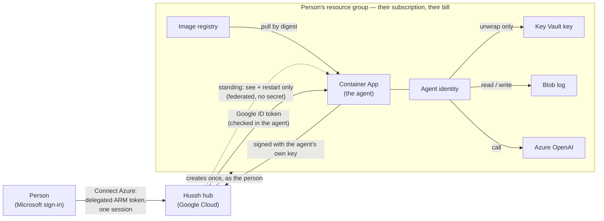

# The private agent in the person's own Azure subscription

**Status:** approved design (2026-10-01), live platform spike done in a consumer
free-trial subscription (2026-10-02). Implementation lanes 1 to 5 and the
image-source round are on the dev workspace branch with unit evidence only; no
live Azure agent has answered a turn through this code yet (see *Known gaps*).
Not on `main`, UAT or production. Inherits `private-agent-north-star.md` by
pointer; where this page and the north star disagree, the north star wins and
this page moves.

## Visual Map

## What the person is promised

*"Connect Azure, and my agent runs in my own subscription, on my bill, with Hussh
able to see and restart it and nothing more."*

One active agent per person, always. Azure is a second home for the same agent,
not a second agent. Switching homes is a move (freeze, sealed copy, hash-matched
proof, switch, 14-day grace), never two live copies: two writers would fork the
sealed commit log into two histories that both claim to be the same agent.

## Trust matrix

Who may do what in the person's subscription, per lifecycle operation.

| Operation | Authority | Standing or just-in-time |
|---|---|---|
| Setup (resource group, identities, Key Vault + key, storage, registry, Azure OpenAI, environment, role assignments) | The person's own delegated ARM token (`user_impersonation`, auth code + PKCE, online only, no refresh token) | Just-in-time: the Connect Azure sign-in |
| Image import + upgrade | The person's delegated token after they approve the update; the image source is read with a 15-minute image-reader token (see *Image source credential*) | Just-in-time: approve + sign-in |
| Re-create after the agent is gone | The person's delegated token | Just-in-time |
| Full teardown ("delete everything") | The person's delegated token | Just-in-time |
| Read status, revisions, address (FQDN) | Hussh app service principal, custom role "Hussh Pod Observer" | Standing |
| Restart (heal) | Same role: `containerApps/revisions/restart/action` | Standing |
| Remove Hussh's own access | ABAC-conditioned `roleAssignments/delete`, limited to Hussh's own principal and the recorded pod principals | Standing, used last |

Hussh never holds: `Microsoft.ManagedIdentity/*/write` (federated credentials,
`assign/action`), any Key Vault control-plane or data role, any Storage role,
`roleAssignments/write`, or Container Apps `exec`, `listSecrets`, `getauthtoken`.
Whoever can write the container app chooses the code that runs as the pod's
identity, and that identity can unwrap the agent's key. Container write is
therefore read authority, and it stays with the person.

The standing service principal authenticates by workload identity federation: a
federated credential on the Hussh app with issuer `https://accounts.google.com`,
subject = a dedicated broker service account's numeric id, audience
`api://AzureADTokenExchange`. No client secret exists anywhere.

Revocation windows the consent copy must state: removing Hussh's role assignment
stops changes within about 10 minutes; an already-issued app token can keep
working for its remaining lifetime (60 to 90 minutes).

## Identity between agent and hub

- **Hub to agent:** unchanged from GCP. The hub sends a Google ID token whose
  audience is the agent's own address; the agent's in-process wall
  (`api/middlewares/pod_ingress.py`) verifies it against Google's public keys.
  Container Apps ingress preserves `Host` and sends `x-forwarded-proto: https`
  (measured), so the audience check works unchanged. Ingress is external; there
  is no platform invoker lock on Azure.
- **Agent to hub:** the agent signs every request with an Ed25519 key it derives
  from its own X25519 private key (`HKDF-SHA256`, info
  `hushh/pod-hub-request-signing/ed25519/v1`). The hub verifies against a public
  key it **pulled itself** from the address it read from ARM with its own
  credential, never from an address the browser or the person reports. The same
  scheme replaces Google ID tokens for GCP agents, so the hub keeps one verifier
  for every cloud. No Entra token verifier is built.

**Wire contract, as implemented** (`consent-protocol/hushh_mcp/services/pod_request_signing.py`,
pinned by a golden vector in `consent-protocol/tests/test_pod_request_signing.py`):

- Headers: `X-Hushh-Pod-Signature: ed25519.<kid>.<b64url(sig)>`,
  `X-Hushh-Pod-Timestamp` (ms), `X-Hushh-Pod-Nonce` (16 random bytes, b64url), and
  the existing `X-Hushh-Pod-Id`. `kid` is `pods_` + 32 hex of SHA-256 over the
  base64 public key; the pod publishes `podSigningKey`, `podSigningKeyId` and
  `podSigningAlg` on `GET /pod/public-key`.
- Signed bytes: canonical JSON of purpose `hushh/pod-hub-request/v1`, audience,
  HusshID, kid, method, path, sorted query, SHA-256 of the exact body, timestamp
  and nonce. Accepted window: 60 s back, 30 s ahead. Each (kid, nonce) is
  single-use (`pod_request_nonces`, dev-only migration 947).
- An unknown kid only triggers the hub's own key pull, at most once per agent per
  30 s and under a per-process cap that only a request which won its agent's slot
  can spend. A signing key is valid only with the pod key it was published with:
  any write that moves the pod key without a new signing key drops the old one in
  the same statement (a trigger in migration 947), so rotating a compromised pod
  key also revokes its signing authority. The first valid signature latches the
  agent's registry entry (`identity_mode = signed`); afterwards a Google-only
  request from it is refused, including while it waits for the hub to pull a
  signing key for a new pod key. Until then a GCP agent keeps sending its Google
  ID token beside the signature. Everything is behind the dev-only
  `POD_HUB_IDENTITY_AUTH_ENABLED`. An Azure agent has no metadata server and
  signs alone, so it can reach only a hub where that flag is on.

## The setup binding

Setup writes into the person's subscription only under their own sign-in, and
only into a resource group it can prove it created for this agent. The group and
the agent carry two tags:

- `hussh-setup-nonce`: 16 hex characters, minted once per new group.
- `hussh-setup-binding`: HMAC-SHA256 over (HusshID, nonce) under a key derived
  from `APP_SIGNING_KEY` for the label `setup-binding`
  (`consent-protocol/hushh_mcp/services/azure_keyed.py`).

The binding is over the **HusshID, not the account uid**: the backend that
re-verifies it is database-free and `PodSpec` deliberately carries no user id;
the registry binds the two one to one. A retry reuses the nonce of a group
already bound to this agent; a group with this agent's name but no valid binding
is refused (`RESOURCE_GROUP_FOREIGN`) and nothing is changed. Attach, discover,
upgrade and erasure re-verify the binding from ARM. Rotating `APP_SIGNING_KEY`
makes existing bindings stop verifying, which fails closed. The group name is
`rg-hussh-one-<keyed digest of the HusshID>`, so it names the person to nobody but
the hub.

## Image source credential

The person's registry pulls the approved digest straight from Hussh's private
Artifact Registry repository with ARM `importImage`. No public mirror exists, and
Azure never receives the hub's own runtime token, which carries everything the hub
may do in Google Cloud.

- The hub impersonates one dedicated reader service account,
  `HUSSH_POD_IMAGE_READER_SA`, through IAM Credentials `generateAccessToken`
  (lifetime 900 s, scope `cloud-platform`). Its only grant is Artifact Registry
  reader on the pod image repository, so the token's effective power is read-only
  on that one repository for 15 minutes.
- The token is minted at the moment of the import call, for setup and for each
  approved update, and exists only in that request body as source credentials
  (username `oauth2accesstoken`, password the token). It is never logged and never
  put in an error message.
- A Google token is only ever offered to a Google registry host
  (`*-docker.pkg.dev`, `gcr.io`). A reader equal to the hub's own identity, or a
  minted token equal to the hub's token, is refused.
- **Preflight before the Microsoft sign-in:** both `authorize/begin` and
  `upgrade/begin` prove the import will work before the person signs in. With a
  reader configured, the hub mints a token and reads the exact digest's manifest
  with it. Without one, the source must be readable anonymously. Otherwise the
  route answers 503 with a typed code: `IMAGE_SOURCE_NOT_CONFIGURED` (names the
  missing `HUSSH_POD_IMAGE_READER_SA`), `IMAGE_READER_CANNOT_READ`,
  `IMAGE_READER_UNAVAILABLE`, `IMAGE_READER_IS_HUB`, `IMAGE_READER_MISCONFIGURED`
  or `IMAGE_SOURCE_UNSUPPORTED`.

Implemented in `consent-protocol/hushh_mcp/services/azure_image_source.py`;
`HUSSH_POD_IMAGE_READER_SA` is hub deployment configuration, not a secret and not
pod behaviour.

## Agent environment contract (rendered by the hub, read by the agent)

Topology only. Behaviour lives in the sealed `pod_config_v1` record, never in new
environment flags.

| Variable | GCP owner project | Azure subscription |
|---|---|---|
| `POD_STORAGE_BACKEND` | `commit_log` | `commit_log` |
| Object store location | `POD_STORAGE_GCS_BUCKET` (+ prefix) | `POD_STORAGE_AZURE_BLOB_URL` = `https://<account>.blob.core.windows.net/<container>[/<prefix>]` |
| Key custody | `HUSSH_POD_KMS_KEY` | `HUSSH_POD_KEY_VAULT_KEY` = `https://<vault>.vault.azure.net/keys/<name>/<version>` |
| Wrapped key object | `HUSSH_POD_WRAPPED_LOG_KEY_OBJECT` | same |
| Workload identity | GCE metadata server | `AZURE_CLIENT_ID` (the pod's user-assigned identity) + platform `IDENTITY_ENDPOINT` / `IDENTITY_HEADER` |
| Incarnation | platform `K_SERVICE` / `K_REVISION` | platform `CONTAINER_APP_NAME` / `CONTAINER_APP_REVISION` |
| Own model | `GOOGLE_CLOUD_PROJECT` + user ADC | `AZURE_OPENAI_ENDPOINT` + `AZURE_OPENAI_DEPLOYMENT` (mode `user_azure_mi`) |
| Signing key | Key Vault reference via Container Apps secret | same shape (`APP_SIGNING_KEY` from a Key Vault secret reference) |

The managed-only strip list (`_MANAGED_ONLY_ENV` in `user_gcp_backend.py`) applies
to Azure unchanged: no Hussh key, bucket or model coordinate ever reaches a
person's subscription.

## Measured platform facts (2026-10-02, consumer free-trial subscription)

| Fact | Measured |
|---|---|
| Container Apps environments per region on a free trial | 1 |
| Pod image import from Hussh's private registry (`az acr import`, short-lived Google token) | works; digest byte-identical; 65 s for 455 MiB |
| First HTTP 200 on `/health` after first deploy (rollout + first pull + boot) | 63.2 s |
| Scale-from-zero to first HTTP 200 | 36.9 s (one sample; series in progress) |
| Container Apps ETag on GET | none (no ARM optimistic concurrency); fence with the hub's upgrade lease plus `systemData.createdAt` and a creation-nonce tag |
| Ingress request timeout header | `x-envoy-expected-rq-timeout-ms: 1800000` (30 minutes) |
| Managed identity endpoint | `IDENTITY_ENDPOINT=http://localhost:12356/msi/token` + `IDENTITY_HEADER` (not an IMDS address) |
| Blob create-only (`If-None-Match: *`) on an existing blob | **409 BlobAlreadyExists** (GCS returns 412 for the same case) |
| Blob compare-and-swap mismatch (`If-Match`) | 412 ConditionNotMet |
| Key Vault key created through ARM with no data role | works; the creator still gets 403 on read and unwrap |
| `Key Vault Crypto Service Encryption User` at key scope | public key read and unwrap allowed; sign refused |
| Google service-account token to Entra token (federated credential) | works in 1 s; a managed identity token lasts 24 h (86,399 s), which is why Hussh's standing principal is an app registration |
| Azure OpenAI on a free trial (eastus2) | available; e.g. gpt-5-mini Global Standard 500K tokens/min |

At the spike the pod image did not boot off Google Cloud: it built a Google model
at import time (`api/routes/one/agent_chat.py` intro agent). The agent-side lane
now builds the chat heads on first use, so the same image boots on Container
Apps; it still needs `APP_SIGNING_KEY`, which setup provides as a Key Vault
reference.

## Azure version 1 capabilities, stated honestly

`GET /pod/info` reports these from rendered topology, never from a flag
(`consent-protocol/api/routes/one/pod_capabilities.py`):

- Memory recall from the sealed commit log (keyword-based); no managed memory
  service yet.
- Voice unavailable (it needs a Vertex model); the voice route refuses before
  accepting a connection.
- Gmail push alerts off (Gmail push only targets Google Pub/Sub).
- Files background organization off; an update that carries a Files plan is
  refused on Azure.
- Web search unavailable. One's web search is Google Search grounding, a Gemini
  tool that ADK refuses for any other model. A head on the person's Azure OpenAI
  deployment (or on Puppy) is built without it and, when a request needs the
  web, says "Web search is not available on this setup yet." instead of
  failing with a tool error. No other search provider stands in. The decision
  is one predicate (`consent-protocol/hushh_mcp/one_adk/web_search.py`), read
  by both the head and the capability report, so `/pod/info` reports
  `webSearch: {available: false, reason: "requires_gemini_model"}` for a pod
  whose own model is Azure OpenAI. A turn that brings its own Gemini key keeps
  web search.
- Private commands (structured output, audio input) refuse the Azure OpenAI mode
  with a typed 503 `COMMAND_MODEL_UNAVAILABLE`; they still work with the person's
  own Gemini key.

Each item above is reported under `capabilities` on `/pod/info`, which the hub
relays to the owner (`GET /api/one/u/{hushh_id}/info`).

**Turn timeouts.** An Azure OpenAI head keeps Gemini's budgets (20 s to the
first event, 30 s between events, 90 s per turn, and 30 s per specialist model
call). Reasoning deployments may need more, but no Azure turn
latency has been measured yet, so nothing changes until a measured series
says it must. Puppy keeps its own measured budgets
(`consent-protocol/tests/test_timeout_ladder.py`).

## Erasure, heal and update recovery, as implemented

Hussh can delete nothing in the person's subscription, so each lifecycle path is
built from the authority the trust matrix leaves it. The shared orchestrator
reaches each one through a typed capability in
`consent-protocol/hushh_mcp/services/compute_backend.py` (`OwnerAccessErasableBackend`,
`RestartableBackend`), never a provider name.

- **Erasure.** After the registry reserves erasure, the agent erases itself:
  `POST /pod/migration/erasure/crypto-erase` sits behind the same hub-proof and
  incarnation gate as the fence, with its own proof purpose. It closes admission for
  the attempt and writes a tombstone (`erasure/crypto-erase.json`: attempt, owner
  digest, chained record keys). It then deletes the wrapped key first, followed by
  the identity key, incarnation fence, session projection and the records. A retry
  finishes from the tombstone without the key. Key Vault custody refuses to mint a
  replacement key while the tombstone exists, so an erased agent never boots again.
- **The fences stay closed.** Hussh cannot stop the container, and its blob role
  lasts until revocation reaches Azure, so a process still holding the key in memory
  could otherwise keep writing. The erase therefore never deletes the two objects
  that refuse those writes. The log head stays the sealed erasure fence, which is
  ciphertext under the destroyed key. Memory bookkeeping becomes a closed stub that
  names no owner. The erase ends by checking that no head a live process could extend
  exists, and refuses to report done otherwise.
- **Checkpoint, then revoke.** The agent's confirmation is retained on the registry
  row as the `agentCryptoErase` checkpoint, together with the setup nonce, before
  any role assignment is touched. Hussh then revokes the agent's role assignments,
  then its own, last. Revocation can stop part way: ARM retries only 429 and 503,
  and once the agent's storage grant is gone the agent can no longer confirm
  anything. A retry therefore resumes from the checkpoint. It never calls the agent
  again and reads nothing from ARM, because Hussh's observer grants may already be
  gone while the removal grant, revoked last, is still there. Each revocation is
  idempotent, so the receipt lists every assignment confirmed gone, whether removed
  now or earlier.
- **Receipt.** The receipt (resources remaining, the vault's earliest purge date,
  "delete the resource group …") is retained once on the registry row under the
  reserved attempt (dev-only migration 949, validated against the reserved
  snapshot). It must carry exactly the checkpointed confirmation. A database
  preflight proves that the checkpoint and the receipt can be retained before the
  agent erases anything. The account stays refused while those resources exist. The
  person deletes the resource group; Hussh no longer can.
- **Residual window.** Suppose the database becomes unavailable after the
  preflight, and stays down past the last revocation, so the receipt cannot be
  stored. A retry then cannot finish, because Hussh's removal grant is already gone.
  It fails closed: the account stays refused and the person deletes the resource
  group.
- **Not enumerated by the agent:** orphan records from lost append races and Files
  objects (Files is off). Both are sealed under the destroyed key.
- **Heal** is the observer's `revisions/restart/action` through the backend, never
  the hub's Cloud Run client.
- **A crashed update** leaves the lease and the provider acknowledgement on the row.
  The observer resolves it from reads alone, because the revision name derives from
  the attempt id. Live means that revision is the latest ready one and runs the
  acknowledged image. Failed needs a definitive platform verdict: the revision failed
  to provision or to run, or ARM settled without creating it. Anything still
  activating keeps the lease. No new update starts without the person's sign-in.

## What shipped (2026-10-02, dev workspace branch)

| Lane | What landed |
|---|---|
| Agent seams | Chat heads built on first use; opaque object versions; `AzureBlobObjectStore` with the measured 409/412/404 mapping (403 is always a refusal); Key Vault custody (RSA-OAEP-256 wrap locally, unwrap through Key Vault, create-once key); `pod_workload_identity` (`IDENTITY_ENDPOINT` + `AZURE_CLIENT_ID`); `pod_platform` incarnation for the erasure fence, upgrade admission and heartbeat; the capability report above |
| Identity | Ed25519 request signing derived from the pod key, `GET /pod/public-key` publishes it, hub verifier with replay window, single-use nonces, pulled keys and the `identity_mode` latch; dev-only migration 947 |
| Model | Mode `user_azure_mi`: One and every specialist on the person's Azure OpenAI deployment as the pod's own identity; streamed tool calls assembled; one (provider, model, mode) decision for every model door; `/pod/diagnostics/model` probes the deployment |
| Hub | Raw-REST ARM client, Entra auth code + PKCE (no refresh token), federated app identity, deterministic setup plan with an ARM template held to it by a parity test, Container App renderer, `user_azure` backend (attach, typed gone reasons, restart, JIT upgrade with the pod handoff, erasure revoking Hussh last), the three Connect Azure routes, setup and update jobs on the existing job record, dev-only migration 948 |
| Frontend | Connect Azure on the cloud step, the Microsoft return route, subscription picker, update approval through the owner's sign-in, privacy-policy copy naming Microsoft Azure |
| Lifecycle | In-pod crypto-erase behind the erasure fence with closed fences after erase; owner-access erasure through a typed capability with a checkpoint before revocation and the receipt retained (dev-only migration 949); heal through the backend's restart; crashed-update recovery from observer reads |
| Honest capabilities | Non-Gemini heads are built without Google Search grounding and say web search is unavailable; `/pod/info` reports `webSearch` |
| Image source | The image-reader credential and preflight above; `GET /api/one/runtime/byoc/setup/status` now returns `jobId`, and the update progress shows only the record of the job its sign-in started |

## Known gaps

- **No live proof yet.** No Azure agent has been created or answered a turn
  through this code; every gate in the admission bar still needs live evidence.
- **Operator setup is not done:** the Entra app, the broker and reader service
  accounts and their grants (runbook below) do not exist yet.
- **The dev deploy lane does not render the Azure hub variables.**
  `HUSSH_AZURE_APP_CLIENT_ID`, `HUSSH_AZURE_BROKER_SA`,
  `HUSSH_AZURE_OAUTH_REDIRECT_URI` and `HUSSH_POD_IMAGE_READER_SA` are plain
  environment, not secrets, so the secret-coverage check does not require them;
  adding them to the dev backend is a change to protected pipeline paths.
- **Agent-to-hub calls are dev-only:** they need `POD_HUB_IDENTITY_AUTH_ENABLED`
  and the parked migrations 947 and 948.
- **Re-create after Azure deletes the environment:** the gone reason
  `environment_deleted` is typed, but the person-facing re-create flow is not
  wired (setup refuses a person whose agent record is already provisioned).
- **Full teardown** under a sign-in is not built; erasure crypto-erases the agent,
  revokes access and the receipt names the resource group to delete. Account
  deletion stays refused while that resource group exists.
- **Registry retention:** every imported digest stays in the person's Basic
  registry; pruning to the current and previous digest is not built.
- **Placement** is fixed to `eastus2` (where the model was measured available).
- **Azure OpenAI quality** has not passed the evals that make a model "proven".
- **Measurements pending:** the 48-hour bill readout and the 20-wake series.

## Cost (list prices, not measured bills)

From the Azure Retail Prices API, eastus, 2026-10-01: Basic container registry
about $5.07/month, the idle floor; compute about $0.054 per active hour beyond
the subscription's free monthly grant. Private endpoints and the maintenance-window configuration
each add a separate $0.10/hour environment meter, so the renderer refuses both.
A 48-hour Cost Management readout is pending before any number is quoted as
measured.

## Admission bar

Azure becomes a selectable home only when each gate in
`deployment-standard.md` (identity, encrypted recovery, lifecycle, capability
parity) has live evidence from a real subscription, recorded in
`config/pod-completion-ledger.yaml` under Azure rows, never credited from GCP
evidence.

## Operator runbook: localhost and dev live test

An operator does this once per environment. No step creates a client secret,
and nothing here is run by the hub or an agent.

### Google Cloud, in the project that runs the hub

1. **Broker service account** (the federation subject, never the hub runtime
   account). Record its numeric unique id
   (`gcloud iam service-accounts describe <broker> --format='value(uniqueId)'`)
   and grant the hub runtime identity `roles/iam.serviceAccountTokenCreator` on
   it: the hub mints the broker's ID token through `generateIdToken`.
2. **Image reader service account.** Grant it `roles/artifactregistry.reader` on
   the pod image repository only, never project-wide, and grant the hub runtime
   identity `roles/iam.serviceAccountTokenCreator` on it.

### Microsoft Entra, the Hussh app registration

1. Supported account types: any organizational directory and personal Microsoft
   accounts (personal accounts are served through tenant discovery).
2. API permission: Azure Service Management, delegated `user_impersonation`,
   and nothing else (no `offline_access`).
3. Federated credential (issuer type "Other issuer"): issuer
   `https://accounts.google.com`, subject = the broker's numeric unique id,
   audience `api://AzureADTokenExchange`.
4. Redirect URIs on the **Web** platform (the hub redeems the code server-side
   with the federated client assertion and PKCE):
   `http://localhost:3000/one/setup/cloud/azure/return` for localhost and
   `<dev web origin>/one/setup/cloud/azure/return` for dev. Each hub's
   `HUSSH_AZURE_OAUTH_REDIRECT_URI` must equal its registered value exactly;
   only `https` or `http://localhost` is accepted.

### Hub configuration

| Variable | Value |
|---|---|
| `HUSSH_AZURE_APP_CLIENT_ID` | The app registration's application (client) id |
| `HUSSH_AZURE_BROKER_SA` | The broker service account email |
| `HUSSH_AZURE_OAUTH_REDIRECT_URI` | This hub's registered return address |
| `HUSSH_POD_IMAGE_READER_SA` | The image reader service account email |

Already required and unchanged: `HUSSH_ONE_POD_IMAGE` (the pod release; a tag
is resolved to its digest), `HUSSH_CONSENT_PLANE_SA` (the hub identity the
agent's wall admits), `HUSSH_HUB_BASE_URL` (rendered into the agent as its hub
address), `APP_SIGNING_KEY`, and, for agent-to-hub calls, the dev-only
`POD_HUB_IDENTITY_AUTH_ENABLED` with migrations 947 and 948 applied.

### Localhost

1. Point Application Default Credentials at the hub identity by impersonation
   (`gcloud auth application-default login --impersonate-service-account=<hub SA>`).
   The acting identity must resolve to a service-account email, so a plain user
   login is refused, and this is the identity holding Token Creator on the broker
   and the reader.
2. Run the three terminals (`./bin/hushh proxy`, `backend`, `web`, each with
   `--mode local`) with the hub variables above in the backend environment.
3. Sign in with the second Hussh test account (verified phone), open the cloud
   step and choose Microsoft Azure; the founder completes the Microsoft sign-in.
4. Hub-to-agent turns work from localhost (a Google ID token for the agent's own
   address). Azure cannot reach localhost, so agent-to-hub calls (heartbeat,
   consent verify) need `HUSSH_HUB_BASE_URL` set to a public tunnel to the
   localhost backend, or are proven on the dev lane.

### Dev

The dev lane is shared; coordinate before dispatching. Add the four hub
variables to the dev backend (see *Known gaps*), deploy a CI-green SHA, register
the dev redirect URI, then repeat the localhost steps against the dev web
origin. Record each result in `config/pod-completion-ledger.yaml` under Azure
rows.
