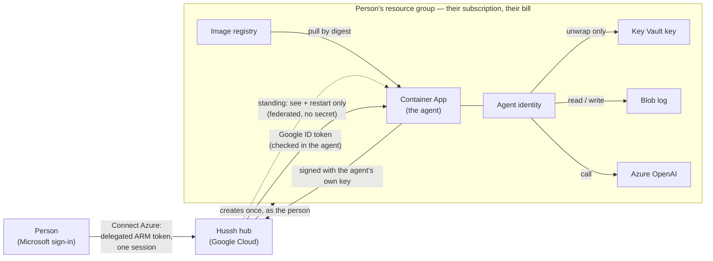

# The private agent in the person's own Azure subscription

**Status:** approved design (2026-10-01), live platform spike done in a consumer
free-trial subscription (2026-10-02), implementation in progress on the dev
workspace branch. Not on `main`, UAT or production. Inherits
`private-agent-north-star.md` by pointer; where this page and the north star
disagree, the north star wins and this page moves.

## Visual Map

## What the person is promised

*"Connect Azure, and my agent runs in my own subscription, on my bill, with Hussh
able to see and restart it and nothing more."*

One active agent per person, always. Azure is a second home for the same agent,
not a second agent. Switching homes is a move (freeze, sealed copy, hash-matched
proof, switch, 14-day grace), never two live copies: two writers would fork the
sealed commit log into two histories that both claim to be the same agent.

## Trust matrix

Who may do what in the person's subscription, per lifecycle operation.

| Operation | Authority | Standing or just-in-time |
|---|---|---|
| Setup (resource group, identities, Key Vault + key, storage, registry, Azure OpenAI, environment, role assignments) | The person's own delegated ARM token (`user_impersonation`, auth code + PKCE, online only, no refresh token) | Just-in-time: the Connect Azure sign-in |
| Image import + upgrade | The person's delegated token after they approve the update | Just-in-time: approve + sign-in |
| Re-create after the agent is gone | The person's delegated token | Just-in-time |
| Full teardown ("delete everything") | The person's delegated token | Just-in-time |
| Read status, revisions, address (FQDN) | Hussh app service principal, custom role "Hussh Pod Observer" | Standing |
| Restart (heal) | Same role: `containerApps/revisions/restart/action` | Standing |
| Remove Hussh's own access | ABAC-conditioned `roleAssignments/delete`, limited to Hussh's own principal and the recorded pod principals | Standing, used last |

Hussh never holds: `Microsoft.ManagedIdentity/*/write` (federated credentials,
`assign/action`), any Key Vault control-plane or data role, any Storage role,
`roleAssignments/write`, or Container Apps `exec`, `listSecrets`, `getauthtoken`.
Whoever can write the container app chooses the code that runs as the pod's
identity, and that identity can unwrap the agent's key. Container write is
therefore read authority, and it stays with the person.

The standing service principal authenticates by workload identity federation: a
federated credential on the Hussh app with issuer `https://accounts.google.com`,
subject = a dedicated broker service account's numeric id, audience
`api://AzureADTokenExchange`. No client secret exists anywhere.

Revocation windows the consent copy must state: removing Hussh's role assignment
stops changes within about 10 minutes; an already-issued app token can keep
working for its remaining lifetime (60 to 90 minutes).

## Identity between agent and hub

- **Hub to agent:** unchanged from GCP. The hub sends a Google ID token whose
  audience is the agent's own address; the agent's in-process wall
  (`api/middlewares/pod_ingress.py`) verifies it against Google's public keys.
  Container Apps ingress preserves `Host` and sends `x-forwarded-proto: https`
  (measured), so the audience check works unchanged. Ingress is external; there
  is no platform invoker lock on Azure.
- **Agent to hub:** the agent signs every request with an Ed25519 key it derives
  from its own X25519 private key (`HKDF-SHA256`, info
  `hushh/pod-hub-request-signing/ed25519/v1`). The hub verifies against a public
  key it **pulled itself** from the address it read from ARM with its own
  credential, never from an address the browser or the person reports. The same
  scheme replaces Google ID tokens for GCP agents, so the hub keeps one verifier
  for every cloud. No Entra token verifier is built.

**Wire contract, as implemented** (`consent-protocol/hushh_mcp/services/pod_request_signing.py`,
pinned by a golden vector in `consent-protocol/tests/test_pod_request_signing.py`):

- Headers: `X-Hushh-Pod-Signature: ed25519.<kid>.<b64url(sig)>`,
  `X-Hushh-Pod-Timestamp` (ms), `X-Hushh-Pod-Nonce` (16 random bytes, b64url), and
  the existing `X-Hushh-Pod-Id`. `kid` is `pods_` + 32 hex of SHA-256 over the
  base64 public key; the pod publishes `podSigningKey`, `podSigningKeyId` and
  `podSigningAlg` on `GET /pod/public-key`.
- Signed bytes: canonical JSON of purpose `hushh/pod-hub-request/v1`, audience,
  HusshID, kid, method, path, sorted query, SHA-256 of the exact body, timestamp
  and nonce. Accepted window: 60 s back, 30 s ahead. Each (kid, nonce) is
  single-use (`pod_request_nonces`, dev-only migration 947).
- An unknown kid only triggers the hub's own key pull, at most once per agent per
  30 s and under a per-process cap that only a request which won its agent's slot
  can spend. A signing key is valid only with the pod key it was published with:
  any write that moves the pod key without a new signing key drops the old one in
  the same statement (a trigger in migration 947), so rotating a compromised pod
  key also revokes its signing authority. The first valid signature latches the
  agent's registry entry (`identity_mode = signed`); afterwards a Google-only
  request from it is refused, including while it waits for the hub to pull a
  signing key for a new pod key. Until then a GCP agent keeps sending its Google
  ID token beside the signature. Everything is behind the dev-only
  `POD_HUB_IDENTITY_AUTH_ENABLED`.

## Agent environment contract (rendered by the hub, read by the agent)

Topology only. Behaviour lives in the sealed `pod_config_v1` record, never in new
environment flags.

| Variable | GCP owner project | Azure subscription |
|---|---|---|
| `POD_STORAGE_BACKEND` | `commit_log` | `commit_log` |
| Object store location | `POD_STORAGE_GCS_BUCKET` (+ prefix) | `POD_STORAGE_AZURE_BLOB_URL` = `https://<account>.blob.core.windows.net/<container>[/<prefix>]` |
| Key custody | `HUSSH_POD_KMS_KEY` | `HUSSH_POD_KEY_VAULT_KEY` = `https://<vault>.vault.azure.net/keys/<name>/<version>` |
| Wrapped key object | `HUSSH_POD_WRAPPED_LOG_KEY_OBJECT` | same |
| Workload identity | GCE metadata server | `AZURE_CLIENT_ID` (the pod's user-assigned identity) + platform `IDENTITY_ENDPOINT` / `IDENTITY_HEADER` |
| Incarnation | platform `K_SERVICE` / `K_REVISION` | platform `CONTAINER_APP_NAME` / `CONTAINER_APP_REVISION` |
| Own model | `GOOGLE_CLOUD_PROJECT` + user ADC | `AZURE_OPENAI_ENDPOINT` + `AZURE_OPENAI_DEPLOYMENT` (mode `user_azure_mi`) |
| Signing key | Key Vault reference via Container Apps secret | same shape (`APP_SIGNING_KEY` from a Key Vault secret reference) |

The managed-only strip list (`_MANAGED_ONLY_ENV` in `user_gcp_backend.py`) applies
to Azure unchanged: no Hussh key, bucket or model coordinate ever reaches a
person's subscription.

## Measured platform facts (2026-10-02, consumer free-trial subscription)

| Fact | Measured |
|---|---|
| Container Apps environments per region on a free trial | 1 |
| Pod image import from Hussh's private registry (`az acr import`, short-lived Google token) | works; digest byte-identical; 65 s for 455 MiB |
| First HTTP 200 on `/health` after first deploy (rollout + first pull + boot) | 63.2 s |
| Scale-from-zero to first HTTP 200 | 36.9 s (one sample; series in progress) |
| Container Apps ETag on GET | none (no ARM optimistic concurrency); fence with the hub's upgrade lease plus `systemData.createdAt` and a creation-nonce tag |
| Ingress request timeout header | `x-envoy-expected-rq-timeout-ms: 1800000` (30 minutes) |
| Managed identity endpoint | `IDENTITY_ENDPOINT=http://localhost:12356/msi/token` + `IDENTITY_HEADER` (not an IMDS address) |
| Blob create-only (`If-None-Match: *`) on an existing blob | **409 BlobAlreadyExists** (GCS returns 412 for the same case) |
| Blob compare-and-swap mismatch (`If-Match`) | 412 ConditionNotMet |
| Key Vault key created through ARM with no data role | works; the creator still gets 403 on read and unwrap |
| `Key Vault Crypto Service Encryption User` at key scope | public key read and unwrap allowed; sign refused |
| Google service-account token to Entra token (federated credential) | works in 1 s; a managed identity token lasts 24 h (86,399 s), which is why Hussh's standing principal is an app registration |
| Azure OpenAI on a free trial (eastus2) | available; e.g. gpt-5-mini Global Standard 500K tokens/min |

Off GCP the current pod image does not boot: it constructs a Google model at
import time (`api/routes/one/agent_chat.py` intro agent) and needs
`APP_SIGNING_KEY`. Lazy model construction is part of the agent-side work.

## Azure version 1 capabilities, stated honestly

- Memory recall from the sealed commit log (keyword-based); no managed memory
  service yet.
- Voice unavailable.
- Gmail push alerts off (Gmail push only targets Google Pub/Sub).
- Files background organization off.

## Cost (list prices, not measured bills)

From the Azure Retail Prices API, eastus, 2026-10-01: Basic container registry
about $5.07/month, the idle floor; compute about $0.054 per active hour beyond
the subscription's free monthly grant. Private endpoints and the maintenance-window configuration
each add a separate $0.10/hour environment meter, so the renderer refuses both.
A 48-hour Cost Management readout is pending before any number is quoted as
measured.

## Admission bar

Azure becomes a selectable home only when each gate in
`deployment-standard.md` (identity, encrypted recovery, lifecycle, capability
parity) has live evidence from a real subscription, recorded in
`config/pod-completion-ledger.yaml` under Azure rows, never credited from GCP
evidence.
