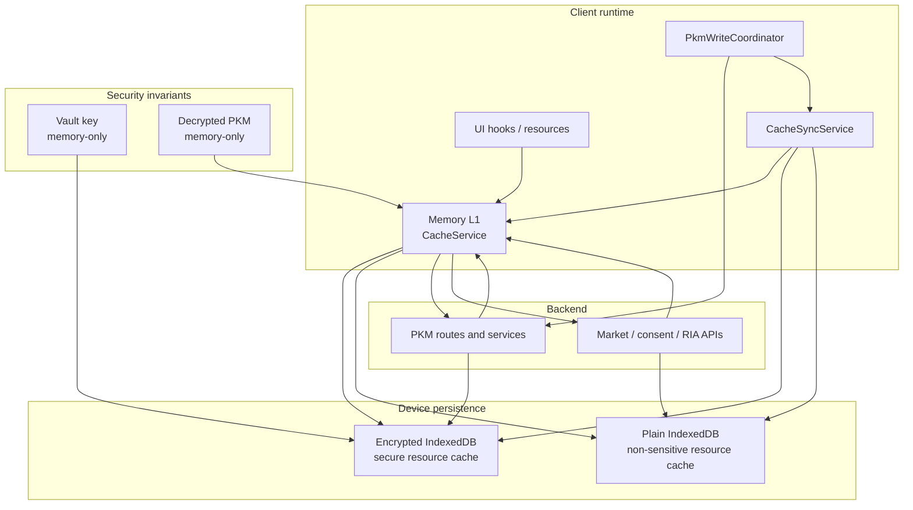

# Cache Coherence Reference

## Visual Map

## Purpose

Hussh frontend cache is split by sensitivity and runtime role:

- decrypted PKM stays **memory-only**
- encrypted PKM-derived snapshots can persist in **encrypted IndexedDB**
- non-sensitive read models can use resource-specific memory/device caches

Every DB-backed mutation must still pass through `CacheSyncService` so views stay coherent without ad-hoc invalidation.

Source files:
- `hushh-webapp/lib/services/cache-service.ts`
- `hushh-webapp/lib/cache/cache-sync-service.ts`
- `hushh-webapp/lib/cache/cache-context.tsx`
- `hushh-webapp/lib/cache/use-stale-resource.ts`
- `hushh-webapp/cache-coherence-screen-manifest.generated.json`
- `hushh-webapp/scripts/architecture/audit-cache-coherence.mjs`
- `hushh-webapp/lib/services/secure-resource-cache-service.ts`
- `hushh-webapp/lib/pkm/pkm-domain-resource.ts`
- `hushh-webapp/lib/services/pkm-write-coordinator.ts`
- `consent-protocol/hushh_mcp/services/market_insights_cache.py`
- `consent-protocol/hushh_mcp/services/market_cache_store.py`

## Key Taxonomy

Fixed user keys:
- PKM metadata cache key for the user
- PKM encrypted blob cache key for the user
- encrypted secure-resource cache entries for PKM-derived resources
- `vault_status_${userId}`
- `vault_check_${userId}`
- `active_consents_${userId}`
- `pending_consents_${userId}`
- `consent_audit_log_${userId}`
- `consent_center_summary_${userId}_${actor}`
- `portfolio_data_${userId}`

Dynamic user keys:
- `domain_data_${userId}_${domain}`
- `domain_blob_${userId}_${domain}`
- `stock_context_${userId}_${ticker}`
- `consent_center_list_${userId}_${actor}_${surface}_${query}_${page}_${limit}`
- `consent_center_preview_${userId}_${actor}_${surface}_${top}` for dedicated preview-only callers that explicitly choose `top=n`; first-party shield inbox flows should prefer the shared `consent_center_list_*_pending_*_1_20` cache entry

Summary metadata write-through fields (when available):
- `attribute_count`
- `item_count`
- `holdings_count` (financial/portfolio-like domains)
- `portfolio_total_value`

Backend Kai market cache tiers (generalized modules):
- L1 memory cache: `market_insights_cache`
- L2 Postgres cache table: `kai_market_cache_entries`
- L3 live provider fetch

Runtime DB data classes:
- `provider_cache` tables are refreshable operational state, not durable user memory.
- `workflow_state` tables can hold active approval or status state, but terminal sensitive drafts/previews should be compacted or redacted by the family retention policy.
- durable personal memory must be written through the encrypted PKM path, not by promoting provider cache rows into long-lived app DB truth.

## Mutation -> Cache Sync Matrix

- PKM store domain: `CacheSyncService.onPkmDomainStored(...)`
- PKM clear domain: `CacheSyncService.onPkmDomainCleared(...)`
- Portfolio upsert/save: `CacheSyncService.onPortfolioUpserted(...)`
- Vault setup/check state changes: `CacheSyncService.onVaultStateChanged(...)`
- Consent approve/deny/revoke: `CacheSyncService.onConsentMutated(...)`
- Analysis history write/delete: `CacheSyncService.onAnalysisHistoryMutated(...)`
- Sign out: `CacheSyncService.onAuthSignedOut(...)`
- Account delete: `CacheSyncService.onAccountDeleted(...)`

## Sign-out And Delete Purge Policy

- Sign-out should purge all user-scoped cache keys through `onAuthSignedOut(userId)`.
- Account delete should call `onAccountDeleted(userId)` before final sign-out/redirect.
- When user id is unavailable, full cache clear is allowed (`onAuthSignedOut(null)`).

## Rules

Do:
- Centralize invalidation/write-through in `CacheSyncService`.
- Write through encrypted blob keys when CRUD payloads already include ciphertext.
- Patch cached PKM metadata in-place when safe summary fields are provided.
- Treat backend `pkm_index` updates as cloud discovery projections. Local memory,
  secure device cache, and encrypted-domain write-through remain first-class
  state for local-first and on-device flows; failed projection sync should
  invalidate or retry the projection lane, not erase local encrypted cache.
- Keep `CacheContext` as a state mirror only.
- Use `invalidateUser(userId)` when purging a full user session.
- Keep domain blob + metadata reconciliation aligned with PKM index semantics.
- Keep consent-manager summary/list caches memory-only.
- `ConnectedSystemsResourceService` owns Connected Systems caching. L1 memory
  holds registry, normalized schema, binding status, and live record state. L2
  device cache holds only safe registry and normalized ready-schema metadata
  for 24 hours; schema keys include CRM, primary object, and configuration
  revision. An unavailable mapping is memory-only for one minute. CRM bindings,
  record IDs, values, intents, and staged edits never enter L2. Auth startup
  hydrates registry metadata, vault unlock warms one batch of binding statuses,
  vault lock synchronously clears protected L1 state, and sign-out/account
  deletion purges both tiers.
- Use `one:consents` as the canonical cache identity for the default investor
  consent view. The One dashboard, `/one/consent`, and the top-shell shield inbox
  must share that summary and pending-page cache; only the RIA persona uses its
  own `ria:consents` lane.
- An unresolved consent summary is unknown, not zero. Do not render `0` in
  consent tabs, badges, or roster metrics until the canonical summary resolves.
- Keep the first-party consent inbox on the same memory-only `pending page 1` list cache used by `/one/consent`; do not introduce a second browser cache lane just for the top-shell preview.
- On every successful vault unlock, warm the canonical `one:consents` summary
  and pending-page cache in the background, regardless of the route that
  opened the vault. This preserves an immediate same-session render without
  persisting consent list entries.
- After every successful vault unlock, `UnlockWarmOrchestrator` starts Agent
  Chat's redacted PKM working-set warmup in the background. It never blocks the
  unlock UI; the Agent workspace joins that in-flight work or starts a fallback
  warmup when needed. The working set remains process-memory-only and is cleared
  synchronously when the vault locks, the user changes, or PKM changes.
- Agent Chat treats the working-set TTL as a revalidation age, not an eviction
  deadline. Once decrypted records are loaded in the current unlocked session,
  the prior bounded projection answers the next turn immediately while one
  user-scoped refresh checks metadata and reloads ciphertext only when its
  revision changed. No decrypted working set survives vault lock or process exit.
- A loaded Connected Systems record follows the same protected L1 rule: show the
  current-session record immediately, then re-read it silently after binding and
  schema authority settle. Record values, binding IDs, and staged changes never
  enter the device cache; only safe registry and normalized schema metadata may
  provide a cold-start render.
- FCM consent request, resolution, and connection events must invalidate the
  canonical in-memory consent cache and trigger one retained-data background
  refresh for an open Consent Center. When push is unavailable, the visible
  fallback reconciler uses the same cache keys and event path.
- Keep passive background refresh copy human-readable:
  - `Getting your portfolio data ready`
  - `Refreshing your profile details`
  - `Refreshing your consent list`
  - `Updating market snapshots`
  - `Refreshing advisor workspace summaries`
- Keep BYOK/ZK boundaries explicit:
  - vault key stays memory-only
  - `VAULT_OWNER` stays memory-only
  - decrypted PKM stays memory-only
  - only ciphertext may persist to encrypted IndexedDB
- Treat performance as a cache-coherence contract, not an afterthought:
  - warm cache should reach usable UI without a blocking full-page loader
  - stale safe data should remain visible while refresh runs
  - cold or unsafe states may show loaders, but must emit route-readiness metadata
  - route/cache performance events must use route IDs, resource classes, cache tiers, duration buckets, and result state only
  - never emit raw cache keys, user IDs, workflow IDs, PKM payloads, portfolio values, prompts, or decrypted values in analytics

Don't:
- Add ad-hoc `CacheService.getInstance().invalidate(...)` calls in mutation flows.
- Mix component-level DB mutation and cache operations.
- Reintroduce plaintext browser persistence for PKM-derived user data.

## Performance KPI Contract

Every cacheable route should be able to explain its best available UX path from the generated screen manifest:

1. fresh memory render when the resource is valid
2. secure device stale render for encrypted user data when revision/TTL permits
3. plain device stale render for non-sensitive app resources
4. background refresh after a safe stale render
5. cold loader only when the data is missing, locked, unsafe, or first-use

The standard KPI set is:

- warm-cache time to usable UI
- cold unlock-to-usable time
- stale render rate versus blocking loader rate
- cache hit, stale-hit, miss, and locked/unsafe rate by route and resource class
- refresh duration, retry count, and error rate
- warmup duration and usefulness by resource class
- approximate footprint bucket by cache tier and sensitivity class

Use these internal observability events for the contract:

- `route_readiness_completed`
- `cache_resource_resolved`
- `route_refresh_completed`
- `warmup_completed`

The events are metadata-only. They are for UX and reliability decisions; they are not a reason to retain decrypted PKM longer or broaden warmup.

## Route Family Coherence

### Setup Journey Admission

The authenticated setup journey uses the redacted pre-vault bootstrap record
as a session resource plus a user-scoped, positive-only persistent completion
hint. The first unresolved entry may wait for the authoritative record. Once
setup completes, returning sessions may admit synchronously from that one-bit
hint while route changes reuse the full in-memory record. An authoritative
incomplete response, sign-out, account deletion, or fixture reset clears the
hint. Setup tiles prefetch their static target on intent; they must not show a
full-page loader or force a new bootstrap request on every navigation. Durable
settlement, callback recovery, explicit retry, and cache invalidation remain
the only paths that refresh the mutable journey record authoritatively.
Decrypted vault material, vault-owner tokens, OAuth artifacts, and OTPs are
never part of either cache.

Load-time admission follows one ordered path: resolve the client host first,
then use the cached bootstrap record, then join its non-forced single-flight
read when cold. Phone-mandate, vault-presence, and setup guards must not start
independent network reads before that host decision or alongside that shared
read. A nullable legacy phone hint may use the identity cache as a bounded
fallback; callback and terminal settlement retain explicit forced refreshes.
This prevents transient localhost policy from bouncing a setup route through
phone verification and keeps a cold session to one authenticated admission
request.

The `POST /api/vault/bootstrap-state` BFF is intentionally uncached at the
server layer. Setup completion and active journey state are mutable admission
facts; process-local stale-while-revalidate entries cannot be invalidated
reliably across runtime instances. Client-side single-flight and the
session-safe bootstrap cache retain the performance benefit without allowing a
stale server response to admit or block a setup transition.

Nested routes that render one workspace must share one cache contract and still appear as distinct route IDs in the generated screen manifest. Profile settings are the current reference case:

- `/one/profile/account`, `/one/profile/preferences`, `/one/profile/security`, `/one/profile/my-data`, `/one/profile/access`, `/one/profile/connected-systems`, `/one/profile/gmail`, and `/one/profile/support` render through the shared profile workspace.
- Identifier-bearing detail routes stay static-export-safe with query-backed detail keys, for example `/one/profile/my-data/domain?key=<domain_key>` and `/one/profile/access/connection?id=<connection_id>`.
- All profile nested routes inherit the profile cache posture: vault and PKM readiness gate sensitive panels; stale safe metadata may render while background refresh runs; decrypted PKM and raw cache keys never enter analytics or realtime voice context.
- Same-session Profile transitions do not use the root generic skeleton: `app/one/profile/loading.tsx` preserves the route-transition envelope, and `PhoneMandateGuard` hydrates cached vault and phone-mandate hints before its first paint. A cold or unsafe mandate state still owns its explicit guard feedback.
- Route splits must regenerate `cache-coherence-screen-manifest.generated.json` and keep route readiness/resource classes aligned with `CacheSyncService` invalidation paths.

The One setup family follows the same retained-surface rule. Its parent
`app/one/loading.tsx` and `app/one/setup/loading.tsx` boundaries intentionally
render no generic placeholder during a same-session switch. A capability adapter
owns the only cold wait for the redacted journey record; auth, vault, and phone
guards own their own unsafe states. This prevents hub-to-capability navigation
from replacing a usable shell with stacked skeletons.

## Verification

Run:
- `cd hushh-webapp && npm run verify:cache`
- `cd hushh-webapp && npm run audit:cache-coherence`
- `cd hushh-webapp && npm run verify:analytics`
- `./bin/hushh native ios --mode uat`

The `verify:cache` script hard-fails when critical mutation/auth paths bypass `CacheSyncService`.
The `audit:cache-coherence` script hard-fails when the screen cache manifest is stale or when a physical screen is missing route/surface-map coverage.

## Reconciliation Notes

- Domain metadata patches should preserve canonical summary counters (`attribute_count`, `item_count`, `holdings_count`).
- Raw `total_value` is not retained in index summary cache patches; numeric values should map to `portfolio_total_value`.
- If patch inputs are insufficient, invalidate metadata and force a clean re-fetch rather than persisting partial summaries.
- PKM writes are version-aware:
  - `POST /api/pkm/store-domain` remains canonical
  - first-party writes should use `PkmWriteCoordinator`
  - stale domains can trigger resumable client-side PKM upgrade before save
  - bounded optimistic conflict retries rebuild writes from the latest decrypted domain state
- Debate/analysis history writes attach explicit non-sensitive `write_projections[]`:
  - encrypted `financial.analysis_history` stays canonical
  - backend `decision_projection` events stay aligned with the encrypted history after save, refresh, and hard reload
  - first-party readers should treat `projection_mode=replace_all` as canonical for upgraded users
  - current retention stays `3` saved analyses per ticker (newest first)
- Save compatibility policy:
  - first-party financial/one/profile/portfolio/history writes must go through `PkmWriteCoordinator`
  - stale manifests/domains should resume the client-side PKM upgrade before save when the vault is unlocked
  - if the vault is locked and the domain is stale, the UI should surface an upgrade-required/read-only state instead of attempting a legacy plaintext fallback
