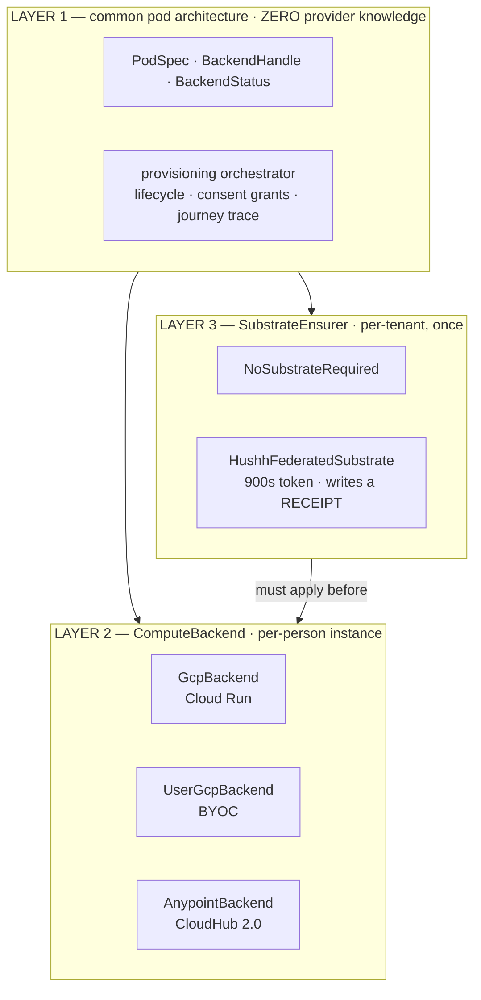

# The deployment standard

**Status:** decided, 2026-08-13 · **Scope:** hushh-managed (simulation), BYO GCP
(production), Anypoint (production), future BYO AWS / Azure · **Supersedes:**
`deployment-abstraction-boundary.md` (2026-08-12), retired — its central argument does
not survive, and the section *Why the earlier answer was wrong* below says exactly how.

## Visual Context

Canonical visual owner: [Architecture Index](./README.md). Companion contracts:
[private-agent-north-star.md](./private-agent-north-star.md) (what a pod is for),
[../operations/dev-fast-lane.md](../operations/dev-fast-lane.md) (how a branch is
previewed).

---

# DECISION — No Terraform. Anywhere.

**Terraform is not adopted — not as the abstraction, not as an applier — because
Terraform's product is a durable file describing someone's cloud account, and on this
platform we are either not permitted to hold that file (the customer's project) or we
already hold it (our own).**

## The reason — one idea, not a list

Terraform is not a way of calling cloud APIs. The calls are the cheap part and we
already make them. Terraform is a **bookkeeper**: it maintains *state* — a file
recording every resource it created and every attribute of each one. Plan, drift
detection, dependency ordering and destroy are all queries against that file. Nothing
else Terraform does is unique to it.

So one question decides Terraform: **who holds the file, and is holding it both
permitted and useful?** This platform has three kinds of account and the answer has the
same shape in all three.

**1. The customer's own GCP project (BYOC — a production path). Not permitted.**
The entire BYOC design is that hushh mints a 900-second impersonated token
(`hushh_mcp/services/user_gcp_bootstrap.py`, with no fallback to hushh identity) and
holds nothing afterward. A state file is the precise inverse: a permanent, hushh-held
mirror of a sovereign project's configuration. And because Terraform state records
resource attributes **verbatim**, it would contain the customer's own pod signing key —
the very value `_seed_secret_version` goes out of its way never even to echo. Adopting
Terraform here does not add bookkeeping. It deletes the product promise.

**2. Anypoint (the other production path). Nothing to hold.**
A Mule application on CloudHub 2.0 is not Terraform-addressable at all.

**3. hushh's own projects. Permitted — and we already hold it.**
The record is in git: `config/ci-governance.json`, and the literals at the top of the
setup scripts (`deploy/iam/setup_production_github_wif.sh` *is* the attribute mapping
and condition, verbatim). What was missing was never a record. It was a **comparison**
of that record against reality — now `scripts/ci/verify-deploy-identity-provenance.py`,
which parses the setup script and compares it to live GCP.

## Why the earlier answer was wrong

The retired ADR argued from **resource properties** — cattle vs pets, one resource vs
seven, lock contention, latency. Those criteria do not discriminate, which is why its
conclusion never felt earned:

| The earlier argument | Why it failed |
|---|---|
| "State locking serialises what must be concurrent" | False — per-person state files do not contend |
| "`apply` needs a runner we don't have" | False — Cloud Build is already driven programmatically (`scripts/ops/cloudbuild_release.sh`) |
| "Would you create it while a person is waiting?" | Self-contradictory — says *never Terraform* for the instance path, then hands BYOC substrate to Terraform |
| "7 interdependent resources vs 1" | Doesn't discriminate — graph complexity is irrelevant if you may not hold the record |

Argue from **custody of the record** and the answer is one-sided everywhere. That is
what makes it a decision rather than a preference.

## BYOC state residency — resolved, not deferred

**BYOC substrate stays non-Terraform.** `render_bootstrap_plan` is the declarative
contract; `UserGcpBootstrap` is the applier.

The residency problem is not solved by choosing a bucket. It is solved by **changing the
artifact: hushh keeps a receipt, not a state file** —
`hushh_mcp/services/byoc_substrate.py`, `SubstrateReceipt`, version
`byoc.substrate.receipt.v1`.

- State records **attributes** — which is exactly why secrets land in it.
- A receipt records **identifiers**, the plan digest, and the consent grant that
  authorised it. No configuration, no key material.
- Every BYOC resource name is already derived from `hushh_id`, so the receipt is a short
  name list plus a plan digest — recomputable, not a mirror.

| Want | How the receipt gives it |
|---|---|
| Teardown inventory | List the names, delete them |
| Audit evidence | Which plan version, which tenant, when, under which grant |
| Drift | Re-impersonate with a fresh 900s token, list, diff existence — a consent-gated read |

Storage is `personal_agent_registry.backend_metadata` (JSONB) for the live record, and
`personal_agent_deletion_tombstones` so teardown stays auditable once the person's rows
are gone.

**The residual, stated plainly:** hushh gets per-tenant, consent-gated drift, never
fleet-wide drift. That is a genuine capability loss against Terraform-with-hushh-held-
state, and it is the correct loss — fleet-wide drift across customer projects requires
exactly the standing credential this tier promises not to have.

Guarded by `tests/test_byoc_substrate.py`, which asserts the receipt/state boundary
directly, because it is the kind of property that erodes one convenient field at a time.

## The test for any new resource

> **Name the file that will hold the authoritative record of this resource, and name who
> may read it.**
>
> - **Lives in an account hushh does not own** → hushh may not hold the file. Terraform
>   refused. Write a receipt; get drift by re-asking with a short-lived token.
> - **Lives in a hushh account and a hushh-held record already declares it**
>   (`config/ci-governance.json`, a version-controlled script literal, the registry, or a
>   name derived from `hushh_id`) → Terraform is redundant. Extend the verifier that
>   compares that record to reality.
> - **Lives in a hushh account and no record declares it** → Terraform becomes
>   admissible. Even then, put the record in version control first, because that is the
>   cheap half. Adopt Terraform only on a measurement showing ordering and IAM-merge
>   semantics are the remaining cost.

No resource in this repo reaches branch three today. This is a decision against
Terraform *for this system as it stands*, not a claim that Terraform is bad.

---

## The abstraction boundary

`ComputeBackend` is the core infrastructure abstraction. The line that matters is
**substrate vs instance** — a split by *lifecycle*, not by provider.

| | **Substrate** (per tenant) | **Instance** (per person) |
|---|---|---|
| What | KMS key, bucket, service account, IAM, Pub/Sub, scheduler | the pod service itself |
| Cardinality | one per tenant | one per person, and it churns |
| Frequency | once at onboarding, then rare | constant — wake, reap, recreate |
| Latency budget | minutes | ~150s, on the signup path |
| Human review | wants a reviewable plan | must be unattended |
| Blast radius | one tenant mis-provisioned | one person's pod, retried |

Both halves are now wired. `SubstrateEnsurer` (Layer 3) runs **before**
`ComputeBackend.provision` (Layer 2), and a substrate that did not apply blocks the pod
rather than letting it boot into a project with nowhere to write and no key to write
with. `NoSubstrateRequired` keeps the managed and Anypoint tiers paying nothing for a
seam they do not need.

## Portability without artificial standardisation

`render_deploy_config` returns a **provider-shaped** artifact that Layer 1 never
interprets. Cloud Run's knative `Service` and Anypoint's AMC application descriptor
share no schema and do not need to. Parity is asserted by **capability extractors**
(`tests/test_compute_backend_parity.py`): each backend reduces its own shape to the same
small set of facts, and the assertions run against that reduction.

**Standardise the questions, never the schema.**

The failure mode to avoid is a "universal pod descriptor" that renders to every
provider. It can only be a lowest common denominator that cannot express Confidential
Space or CloudHub's private endpoint, or a leaky superset where every field is
conditional on provider anyway. Both are worse than three honest shapes and one set of
shared questions.

Evidence the abstraction already generalises: **Anypoint is not a container and not
GCP.** It is a Mule application on CloudHub 2.0 and satisfies the identical five-method
protocol. The seam has already been carried across a genuinely different execution
model, which is the only test that means anything.

## Adding a provider

Adding AWS is three artifacts and no Layer 1 change:

1. `AwsBackend(ComputeBackend)` — App Runner or ECS Fargate for the instance lifecycle.
2. One capability extractor in the parity test.
3. One `SubstrateEnsurer` implementation, if that provider needs per-tenant substrate.

**If a new provider requires a change in Layer 1, the boundary was wrong.** Treat that
as a design defect in the boundary, not a task in the provider. This is falsifiable and
guarded: `tests/test_deployment_boundary_holds.py` fails by name if a provider term
reaches the orchestrator or the registry.

## Open debt

**`backend_metadata` is an untyped dict read by magic key in the common layer.**
`personal_agent_provisioning_service.py:459` reads
`(handle.backend_metadata or {}).get("livenessMode")` to decide how a pod's silence
should be interpreted, and `gcp_backend.py` is the only writer. Every new backend must
know that key exists and spell it identically, and nothing catches a miss — a provider
spelling it `liveness_mode` gets `None` and its pods are misread as a tier they are not.
Promote the fields Layer 1 actually reads onto `BackendHandle` as typed optionals; keep
`backend_metadata` for genuinely provider-specific extras Layer 1 never inspects.

## Closed since the retired ADR

- **The substrate seam exists and has a production caller.** `SubstrateEnsurer` is
  called on the BYOC provisioning path before `UserGcpBackend.provision`, and the
  receipt reaches the registry row. `UserGcpBootstrap` was a complete applier with zero
  callers outside tests; that missing call was why BYO GCP was unreachable.
- **Credential-bearing substrate no longer bakes secrets.** Both Cloud Scheduler
  maintenance jobs authenticate with a per-invocation Google-signed OIDC token instead
  of a `X-Hushh-Maintenance-Token` header read out of Secret Manager. The retired ADR
  listed this as a reason certain resources could not go under Terraform; it is fixed on
  its own merits, because `gcloud scheduler jobs describe` printed the credential to
  anyone with view access and both jobs shared one header name.
- **Deploy-identity drift is detectable.** `verify-deploy-identity-provenance.py`
  compares `setup_production_github_wif.sh` to the live provider and IAM policy. The
  `repo-operations` skill previously prescribed a remediation for a condition nothing
  could detect.

## Not debt, contrary to older records

- **Per-pod cryptographic identity already exists for BYOC.**
  `api/routes/one/pod_identity_auth.py` verifies the pod's audience-bound ID token and
  binds the per-person service account recorded on the registry row; presenting user B's
  token cannot assert user A. It is the **managed** tier that is fleet-shared and can
  only prove "a hushh pod is calling", never which. This inverts the usual assumption in
  favour of BYO GCP as the production path: the sovereign tier has the *stronger*
  identity story.
- **The protocol generalises.** It has been carried across a non-container provider
  already, so "will this abstraction survive AWS" is not an open question.

## The one-line answer

Choose by **custody of the record**, not by resource shape. Keep the per-person instance
lifecycle on the typed `ComputeBackend` seam, keep per-tenant substrate behind
`SubstrateEnsurer`, and never hold a file describing an account that is not ours.
