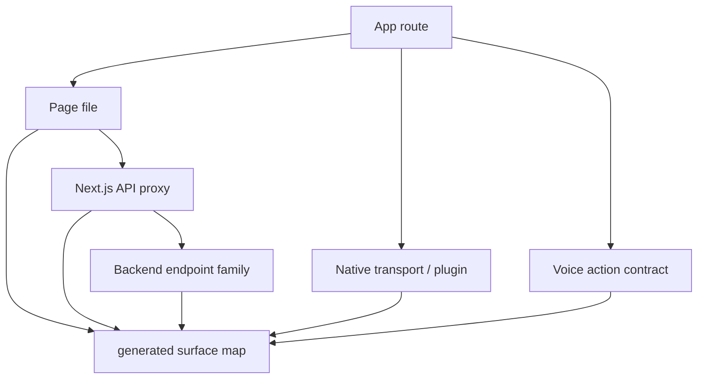

# Frontend Native Surface Map

## Visual Map

The generated surface map is the canonical scaffold for linking each app route to its
page file, native parity marker, shared shell pattern, Next.js proxy family, backend
endpoint family, native transport, plugin dependency, and voice/action contract.

## Source

- Generated contract: `hushh-webapp/frontend-native-surface-map.generated.json`
- Freshness proof: the generated contract carries a deterministic
  `content_sha256`; do not infer staleness from wall-clock generation dates.
- Generator: `hushh-webapp/scripts/architecture/generate-surface-map.mjs`
- Check command: `cd hushh-webapp && npm run verify:surface-map`
- Cache posture companion: `hushh-webapp/cache-coherence-screen-manifest.generated.json`
- One route-orchestration index: `contracts/kai/one-route-orchestration-index.v1.json`

## Rules

1. Run the check before frontend, native, API, voice/action, or route work.
2. If a screen starts calling a new service method or backend family, update the
   route override in the generator and regenerate the JSON.
3. If a route changes shell/header/back/loader behavior, regenerate the JSON and
   update route/mobile docs when the contract changes intentionally.
4. Native builds do not have a Next.js server. Native transport must be mapped as
   direct backend through `ApiService.apiFetch`, `CapacitorHttp`, or a named
   Capacitor plugin method.
5. Voice/action ids belong in each route's checked-in
   `page.voice-action-contract.json`; the surface map only indexes them.
6. The route-orchestration index joins every physical route with generated
   action reachability and the One specialist-admission policy. It is
   descriptive metadata, never consent or a TrustLink input.
7. Persistent chrome, One Voice, and Capacitor lifecycle callbacks use the
   shared [interaction runtime](./interaction-runtime.md). They may select a
   transport, but may not create separate native route or action state.
8. Native authentication has one React publication boundary in `AuthProvider`.
   Provider sign-in holds setup/vault rendering behind a post-auth settlement;
   native sign-out blocks lifecycle restore and performs terminal public-route
   replacement. Native code must not invent route or onboarding state.
9. The `/one/setup` route family is an auth-and-phone surface, not a hard-vault
   surface. Root setup owns its one progress bootstrap; protected capability
   operations opt into the shared vault prerequisite at the operation boundary.
10. Organic authentication and vault unlock enter `/one`. `/ria` is an explicit
    subagent capability surface, not a persona-selected home; persisted persona
    compatibility state cannot redirect login, resume, unlock, or setup.
11. Native restoration at the public root runs the post-auth route resolver
    exactly once before mounting a protected destination. A destructive iOS
    reset clears Firebase plus app-owned auth Keychain records because uninstall
    alone does not establish a fresh identity session.

## Current KYC Contract

`/one/kyc` is the first fully annotated route in this scaffold. It maps:

- `OneKycService` to `/api/one/{path*}` and backend `/one/kyc/*`.
- `AccountService` to `/api/account/{path*}` and backend `/account/*`.
- `KycWorkflowPkmService` to `/api/pkm/{path*}` and backend `/pkm/*`.
- Native transport to direct backend calls through `ApiService.apiFetch`.
- KYC approval to the original Gmail thread, selected workflow scopes, transient
  approved-body transport, and local plaintext cleanup after terminal states.

Future batches should extend the same route override pattern screen by screen
instead of creating parallel docs or ad hoc audit notes.
